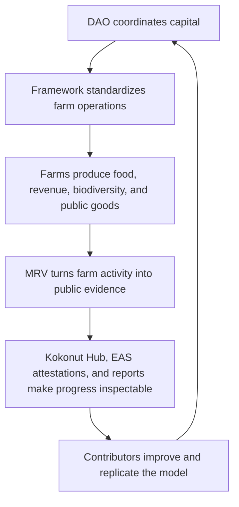

# Kokonut Network — Public Knowledge Base

Kokonut Network is a blockchain cooperative that connects Web3 communities, contributors, and capital allocators to live syntropic farms — starting with Adelphi, a regenerative farm in the Dominican Republic.

This repository powers the public Kokonut knowledge base at [kokonut.network](https://kokonut.network). It documents the Kokonut DAO, the Kokonut Framework, Adelphi farm, MRV methodology, Farm Registry API, AI agent infrastructure, contribution paths, and governance process.

> Kokonut turns real farms into community-governed regenerative assets. The DAO coordinates capital, the Framework standardizes farm operations, MRV systems publish verifiable evidence, and contributors help replicate the model across new farms.

## Start here

| Reader | Start with | Why |
| --- | --- | --- |
| New to Kokonut | [`ecosystem-wiki/kokonut-101/executive-summary.mdx`](ecosystem-wiki/kokonut-101/executive-summary.mdx) | Understand the model, live proof, DAO, Framework, MRV, and contribution paths. |
| Want to verify the farm | [`ecosystem-wiki/kokonut-farms/adelphi/summary.mdx`](ecosystem-wiki/kokonut-farms/adelphi/summary.mdx) | See Adelphi as the first live Kokonut farm. |
| Want to understand impact evidence | [`ecosystem-wiki/kokonut-farms/measurement-reporting-and-verification.mdx`](ecosystem-wiki/kokonut-farms/measurement-reporting-and-verification.mdx) | Learn how farm activity becomes public evidence. |
| Want to join governance | [`ecosystem-wiki/the-kokonut-dao/dao-layers.mdx`](ecosystem-wiki/the-kokonut-dao/dao-layers.mdx) | Understand capital governance, Guilds, proposals, and execution layers. |
| Want to contribute without capital | [`ecosystem-wiki/the-kokonut-dao/kokonut-guilds-dao.mdx`](ecosystem-wiki/the-kokonut-dao/kokonut-guilds-dao.mdx) | Learn how useful work can earn Guild Points and governance standing. |
| Want to build tools or agents | [`build-with-kokonut.mdx`](build-with-kokonut.mdx) | Use repos, contracts, APIs, and developer workflows. |
| Need quick definitions | [`ecosystem-wiki/glossary.mdx`](ecosystem-wiki/glossary.mdx) | Search Kokonut, DAO, Web3, ReFi, agriculture, and MRV terms. |

## What this repository contains

```text
Kokonut-Public-Site/
│
├── ecosystem-wiki/                      # Main Kokonut wiki
│   ├── kokonut-101/                     # Executive summary, problem, solution, vision, manifesto
│   ├── kokonut-farms/                   # MRV methodology and farm pages
│   │   └── adelphi/                     # Adelphi farm case study
│   ├── the-kokonut-dao/                 # DAO architecture, Moloch DAO, Guilds, governance, proposals
│   ├── open-collaboration-invitation.mdx
│   ├── faq.mdx
│   └── glossary.mdx
│
├── kokonut-framework/                   # Kokonut Framework methodology
│   ├── Introduction.mdx
│   ├── why-syntropic-farming.mdx
│   ├── impact-calculator.mdx
│   ├── framework-components/            # Data schema, pillars, impact methodology
│   ├── framework-add-ons/               # EBF + CRISP ecological frameworks
│   └── development-phases/              # Phase I–IV documentation
│
├── api-reference/                       # OpenAPI spec for the Kokonut Farm Registry API
│   └── kokonut-farm-registry.yaml
│
├── snippets/                            # Reusable MDX snippets
├── images/                              # Site image assets
├── docs.json                            # Mintlify navigation and configuration
└── README.md                            # Repository entry point
```

## Live proof points

The documentation is built around Adelphi, Kokonut's first live farm implementation.

| Proof point | Current documented value |
| --- | --- |
| Live farm site | Adelphi, Gonzalo, Monte Plata, Dominican Republic |
| Total mapped farm area | 15,725 m² |
| Agricultural area | 13,838 m² |
| Jobs supported | 7 |
| Free-range hens | 110 |
| UN SDGs addressed | 5 |
| Public goods funding | Public Nouns Proposal #69 |
| Live farm data | [hub.kokonut.network/projects/41](https://hub.kokonut.network/projects/41) |

## How Kokonut works



The core model has four parts:

| Layer | What it does | Start here |
| --- | --- | --- |
| DAO | Coordinates treasury, membership, proposals, rage-quit, and capital governance. | [`the-kokonut-dao/dao-layers.mdx`](ecosystem-wiki/the-kokonut-dao/dao-layers.mdx) |
| Framework | Standardizes how regenerative farms are designed, funded, measured, and replicated. | [`kokonut-framework/Introduction.mdx`](kokonut-framework/Introduction.mdx) |
| Farms | Produce food, biodiversity, jobs, data, and public-goods value. | [`kokonut-farms/adelphi/summary.mdx`](ecosystem-wiki/kokonut-farms/adelphi/summary.mdx) |
| MRV | Turns farm activity into structured evidence, public records, and impact reports. | [`measurement-reporting-and-verification.mdx`](ecosystem-wiki/kokonut-farms/measurement-reporting-and-verification.mdx) |

## Related repositories

| Repository | Branch | Purpose |
| --- | --- | --- |
| [`wasalo/Kokonut-Public-Site`](https://github.com/wasalo/Kokonut-Public-Site) | `main` | Public Mintlify knowledge base and documentation site. |
| [`wasalo/Kokonut-Agentic-Marketplace`](https://github.com/wasalo/Kokonut-Agentic-Marketplace) | `develop` | Onchain AI agent labor marketplace, smart contracts, frontend, and OpenServ integration. |
| [`wasalo/Kokonut-Intelligence`](https://github.com/wasalo/Kokonut-Intelligence) | `main` | Intelligence layer development for Kokonut data, agents, and automation. |

## Local development

This site is built with [Mintlify](https://mintlify.com).

### Prerequisites

- Node.js 18+
- Git
- Mintlify CLI

### Run locally

```bash
# Install the Mintlify CLI
npm install -g mintlify

# Clone the repository
git clone https://github.com/wasalo/Kokonut-Public-Site.git
cd Kokonut-Public-Site

# Start the local development server
mintlify dev
```

The site will be available at:

```text
http://localhost:3000
```

Changes to `.mdx` files hot-reload in the browser.

### Useful commands

```bash
mintlify dev      # Start local server on port 3000
mintlify check    # Validate navigation and links in docs.json
```

## MDX rules for Mintlify

Mintlify uses an MDX parser, so small syntax choices can break the build. Follow these rules before editing.

| Risky pattern | Safer pattern |
| --- | --- |
| Custom `<Table>` wrappers | Use standard Markdown tables. |
| Fenced code blocks inside `<Tabs>` or `<Tab>` | Move code outside the tab, or use tilde fences. |
| Nested triple backticks | Use `~~~` for inner code examples. |
| Raw `{placeholder}` text in prose | Use `[placeholder]` instead. |
| Unescaped `$vKKN` in MDX prose | Escape as `\$vKKN` when needed. |
| Unsourced carbon, yield, revenue, or impact claims | Add source context, mark as forecast, or remove. |
| Forecasts written as guarantees | Say forecast, estimate, projection, or assumption. |
| Images without alt text | Use `<Frame>`, descriptive alt text, and a caption. |

## Page structure conventions

Most improved pages should follow this structure:

1. Short frontmatter description.
2. One clear H1 promise.
3. One or two primary CTAs near the top.
4. Proof before long explanation.
5. A quick overview table or card group.
6. Mechanism section explaining how the model works.
7. Risk, limits, or verification section when claims involve money, impact, carbon, yield, governance, or tokens.
8. Bottom `CardGroup` routing readers to related pages.

Farm pages should also include:

- SDG tags on relevant sections.
- Clear separation between forecast and actuals.
- Links to Kokonut Hub where live data is available.
- MRV references for any impact claim.

DAO pages should also include:

- Capital path vs. contribution path when relevant.
- Trust protections, such as proposal-based execution and rage-quit.
- Live vs. developing status when governance tooling is still evolving.

## Contributing

Contributions are welcome through GitHub pull requests.

Docs contributions can earn Guild Points in the Communications Guild and may be eligible for Loot token recognition through DAO proposal, depending on scope and impact.

### Before opening a pull request

1. Check open issues for related work.
2. Open an issue first for anything beyond a typo or small link fix.
3. Run `mintlify dev` locally and confirm the page renders.
4. Run `mintlify check` before submitting.
5. For MRV, Common Data Schema, API, or farm-data changes, explain backward compatibility in the PR.
6. For forecasts, impact claims, carbon claims, governance claims, or token claims, include source context and avoid guarantee language.

### Contribution paths

| Contribution | Examples | Likely review path |
| --- | --- | --- |
| Small docs fix | Typos, broken links, formatting, missing cross-links | Pull request review |
| New docs page | New farm page, methodology page, DAO explainer, glossary expansion | Issue first, then PR |
| Farm-data or MRV update | Schema, payload examples, impact methodology, evidence standards | Impact Guild + technical review |
| Site architecture change | Navigation, docs.json, reusable snippets, major restructuring | Communications Guild + DAO proposal if material |
| Bounty work | Defined documentation, design, data, or developer deliverable | Guild bounty process |
| Major framework update | Methodology, governance process, API, or schema change | Framework Upgrade Proposal |

## Proposal and governance routes

Use these pages when a change needs coordination beyond a normal pull request.

| Need | Route |
| --- | --- |
| Fund a farm or infrastructure milestone | [`proposal-templates.mdx`](ecosystem-wiki/the-kokonut-dao/proposal-templates.mdx) → Farm Funding Proposal |
| Create or complete a contributor bounty | [`proposal-templates.mdx`](ecosystem-wiki/the-kokonut-dao/proposal-templates.mdx) → Guild Bounty Proposal |
| Change the Framework, schema, API, or methodology | [`proposal-templates.mdx`](ecosystem-wiki/the-kokonut-dao/proposal-templates.mdx) → Framework Upgrade Proposal |
| Approve a partner or institutional collaboration | [`proposal-templates.mdx`](ecosystem-wiki/the-kokonut-dao/proposal-templates.mdx) → Partnership Proposal |
| Understand drafting and voting rules | [`governance-framework.mdx`](ecosystem-wiki/the-kokonut-dao/governance-framework.mdx) |

## Deployed contracts

Kokonut DAO contracts are live on Gnosis Chain.

| Contract | Address | Purpose |
| --- | --- | --- |
| \$vKKN Voting Token | [`0xc6b075ac3234a7ac729114b27370b552fa284690`](https://gnosisscan.io/token/0xc6b075ac3234a7ac729114b27370b552fa284690) | Soulbound governance token. |
| Loot Token | [`0x2508a11aee11ad545bae87cd42131c04613b2099`](https://gnosisscan.io/token/0x2508a11aee11ad545bae87cd42131c04613b2099) | Non-voting economic rights token. |
| Vault & Token Manager | [`0x8977c56e979f0d8b76afb5ad85549acd2e96422d`](https://gnosisscan.io/address/0x8977c56e979f0d8b76afb5ad85549acd2e96422d) | Token issuance and smart wallet. |
| Main Treasury SAFE | [`0xeb55b75328a8dffd45bbf34b7e7efc431a179085`](https://gnosisscan.io/address/0xeb55b75328a8dffd45bbf34b7e7efc431a179085) | Rage-quit-enabled stablecoin treasury. |

```text
Chain ID: 100
RPC: https://rpc.gnosischain.com
Explorer: https://gnosisscan.io
```

## Key links

| Resource | Link |
| --- | --- |
| Live docs | [kokonut.network](https://kokonut.network) |
| Adelphi Data Hub | [hub.kokonut.network/projects/41](https://hub.kokonut.network/projects/41) |
| Kokonut DAO | [link.kokonut.network/dao](https://link.kokonut.network/dao) |
| Adelphi 3D Orthomap | [link.kokonut.network/AdelphiOrtho3D](https://link.kokonut.network/AdelphiOrtho3D) |
| Adelphi Species GeoNode | [link.kokonut.network/AdelphiSpeciesGeoNode](https://link.kokonut.network/AdelphiSpeciesGeoNode) |
| Treasury | [link.kokonut.network/treasury](https://link.kokonut.network/treasury) |
| Discord | [link.kokonut.network/discord](https://link.kokonut.network/discord) |
| Book a call | [link.kokonut.network/meeting](https://link.kokonut.network/meeting) |
| X / Twitter | [@KokonutNetwork](https://x.com/KokonutNetwork) |

## License

This documentation is licensed under [CC BY-SA 4.0](LICENSE).

By submitting a contribution, you agree that your contribution can be distributed under the same CC BY-SA 4.0 license.
