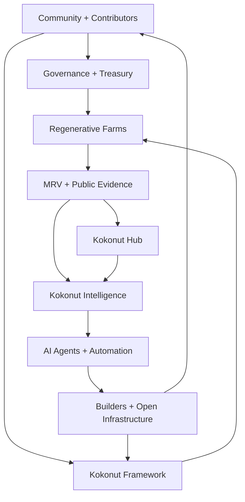
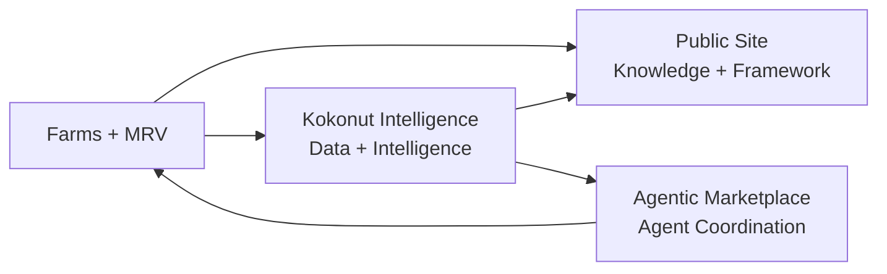

# Kokonut Network — Public Knowledge Base

**Open infrastructure for community-governed regenerative agriculture.**

[](https://kokonut.network)
[](LICENSE)
[](https://mintlify.com)

Kokonut Network is a blockchain-enabled cooperative connecting regenerative farms, communities, contributors, and capital through shared governance, repeatable farm-development methods, verifiable evidence, and open-source infrastructure.

This repository powers the public Kokonut Knowledge Base at [kokonut.network](https://kokonut.network). It documents the Kokonut ecosystem, governance architecture, Kokonut Framework, live farms, MRV methodology, Kokonut Intelligence, AI-agent infrastructure, regenerative-finance playbooks, and contribution paths.

> Kokonut turns real farms into community-governed regenerative assets. Governance coordinates capital and participation, the Framework standardizes implementation, farms create real-world value, MRV makes progress inspectable, and contributors improve the system over time.

## Start here

| I want to... | Start with |
| --- | --- |
| Understand Kokonut | [Kokonut 101](ecosystem-wiki/kokonut-101/executive-summary.mdx) |
| See the first live farm | [Adelphi Farm](ecosystem-wiki/kokonut-farms/adelphi/summary.mdx) |
| Understand impact evidence | [Measurement, Reporting & Verification](ecosystem-wiki/kokonut-farms/measurement-reporting-and-verification.mdx) |
| Understand governance | [DAO Layers](ecosystem-wiki/the-kokonut-dao/dao-layers.mdx) |
| Contribute without capital | [Kokonut Guilds](ecosystem-wiki/the-kokonut-dao/kokonut-guilds-dao.mdx) |
| Build software or agents | [Build with Kokonut](build-with-kokonut.mdx) |
| Explore Kokonut Intelligence | [Kokonut Intelligence](kokonut-intelligence.mdx) |
| Explore AI-agent architecture | [Kokonut × AI Agents](kokonut-x-ai-agents.mdx) |
| Use the regenerative-finance playbook | [ReFi Playbook](playbooks/regenerative-finance/summary.mdx) |
| Find a definition quickly | [Glossary](ecosystem-wiki/glossary.mdx) |

### Primary links

- **Documentation:** https://kokonut.network
- **Live Adelphi data:** https://hub.kokonut.network/projects/41
- **DAO:** https://link.kokonut.network/dao
- **Community:** https://link.kokonut.network/discord
- **Contribute:** [CONTRIBUTING.md](CONTRIBUTING.md)
- **Book a call:** https://link.kokonut.network/meeting

## What Kokonut is building

Kokonut combines several coordination layers that are designed to work together without collapsing the whole ecosystem into a single system.


```mermaid
flowchart TD
    COMMUNITY["Community + Contributors"]
    DAO["Governance + Treasury"]
    FRAMEWORK["Kokonut Framework"]
    FARMS["Regenerative Farms"]
    MRV["MRV + Public Evidence"]
    HUB["Kokonut Hub"]
    KI["Kokonut Intelligence"]
    AGENTS["AI Agents + Automation"]
    BUILDERS["Builders + Open Infrastructure"]

    COMMUNITY --> DAO
    COMMUNITY --> FRAMEWORK
    DAO --> FARMS
    FRAMEWORK --> FARMS
    FARMS --> MRV
    MRV --> HUB
    MRV --> KI
    HUB --> KI
    KI --> AGENTS
    AGENTS --> BUILDERS
    BUILDERS --> FRAMEWORK
    BUILDERS --> COMMUNITY
```

The core system can be understood through these layers:

| Layer | Role |
| --- | --- |
| **Community** | Farmers, contributors, researchers, partners, builders, and capital allocators coordinate around shared work. |
| **Governance** | DAO infrastructure coordinates treasury decisions, membership, proposals, execution, and contributor recognition. |
| **Framework** | A repeatable methodology for designing, funding, operating, measuring, and improving regenerative farms. |
| **Farms** | Real-world agricultural systems producing food, biodiversity, jobs, data, and economic value. |
| **MRV** | Measurement, reporting, and verification turns farm activity into structured and inspectable evidence. |
| **Kokonut Hub** | Public-facing farm data and project records. |
| **Kokonut Intelligence** | Data, analytics, research, synthesis, automation, and decision-support infrastructure. |
| **AI Agents** | Agent-assisted workflows that help coordinate research, reporting, data, and ecosystem operations. |

## Live implementation: Adelphi

Adelphi in Gonzalo, Monte Plata, Dominican Republic is Kokonut Network's first live farm implementation.

| Documented proof point | Value |
| --- | --- |
| Total mapped farm area | 15,725 m² |
| Agricultural area | 13,838 m² |
| Jobs supported | 7 |
| Free-range hens | 110 |
| UN SDGs addressed | 5 |
| Public-goods funding | Public Nouns Proposal #69 |

These values are documented reference points, not a substitute for live operational data.

**For current farm records, harvest information, and MRV evidence, use the [Adelphi Data Hub](https://hub.kokonut.network/projects/41).**

## Explore the Knowledge Base

The public site is organized into four primary areas defined in [docs.json](docs.json).

| Area | Purpose | Best for |
| --- | --- | --- |
| **Home** | Orientation and high-level entry into Kokonut | Everyone |
| **Ecosystem Wiki** | Kokonut 101, farms, MRV, DAO, governance, FAQ, glossary | Community members, partners, researchers |
| **Kokonut Framework** | Repeatable regenerative-agriculture methodology | Farm operators, researchers, implementers |
| **Builders** | Developer docs, Kokonut Intelligence, AI agents, and playbooks | Developers, data contributors, technical partners |

## Repository structure

```text
Kokonut-Public-Site/
│
├── home/
│   └── landing.mdx
│
├── ecosystem-wiki/
│   ├── kokonut-101/
│   ├── kokonut-farms/
│   │   └── adelphi/
│   ├── the-kokonut-dao/
│   ├── open-collaboration-invitation.mdx
│   ├── faq.mdx
│   └── glossary.mdx
│
├── kokonut-framework/
│   ├── Introduction.mdx
│   ├── why-syntropic-farming.mdx
│   ├── impact-calculator.mdx
│   ├── framework-components/
│   ├── framework-add-ons/
│   └── development-phases/
│
├── playbooks/
│   └── regenerative-finance/
│
├── build-with-kokonut.mdx
├── kokonut-intelligence.mdx
├── kokonut-x-ai-agents.mdx
│
├── snippets/
├── images/
├── logo/
├── docs.json
├── CONTRIBUTING.md
├── LICENSE
└── README.md
```

The filesystem and the public navigation are intentionally related but not identical. **docs.json is the source of truth for Mintlify navigation.**

## Technology and infrastructure

The Knowledge Base documents several connected technical surfaces:

- **Gnosis Chain governance and treasury infrastructure**
- **Kokonut Framework methodology and Common Data Schema**
- **Farm MRV and public evidence workflows**
- **Kokonut Hub farm records**
- **Kokonut Intelligence**
- **AI-agent and automation architecture**
- **Open repositories and developer workflows**
- **Regenerative-finance playbooks**

Start with [Build with Kokonut](build-with-kokonut.mdx) for the technical entry point.

## Related repositories

| Repository | Branch | Purpose |
| --- | --- | --- |
| [wasalo/Kokonut-Public-Site](https://github.com/wasalo/Kokonut-Public-Site) | main | Public Mintlify knowledge base and documentation site |
| [wasalo/Kokonut-Intelligence](https://github.com/wasalo/Kokonut-Intelligence) | main | Intelligence layer for data, analytics, agents, automation, and ecosystem research |
| [wasalo/Kokonut-Agentic-Marketplace](https://github.com/wasalo/Kokonut-Agentic-Marketplace) | develop | Onchain AI-agent labor marketplace, smart contracts, frontend, and OpenServ integration |


```mermaid
flowchart LR
    FARM["Farms + MRV"]
    DOCS["Public Site<br/>Knowledge + Framework"]
    KI["Kokonut Intelligence<br/>Data + Intelligence"]
    AGENTS["Agentic Marketplace<br/>Agent Coordination"]

    FARM --> DOCS
    FARM --> KI
    KI --> DOCS
    KI --> AGENTS
    AGENTS --> FARM
```

## AI-readable documentation

Kokonut's documentation is designed to be useful to both people and machine agents.

The Mintlify configuration exposes contextual workflows for ChatGPT, Claude, Perplexity, MCP, Cursor, VS Code, Grok, AI Studio, and related tools.

Useful machine-readable entry points include:

- **Knowledge Base:** https://kokonut.network
- **LLM index:** https://kokonut.network/llms.txt
- **Kokonut MCP:** https://kokonut.network/mcp
- **Kokonut Intelligence:** [kokonut-intelligence.mdx](kokonut-intelligence.mdx)
- **AI Agents:** [kokonut-x-ai-agents.mdx](kokonut-x-ai-agents.mdx)

AI-generated or agent-assisted contributions should follow the same evidence, review, provenance, and compatibility requirements as human contributions.

## Local development

This site is built with [Mintlify](https://mintlify.com).

### Prerequisites

- Node.js 18+
- Git
- Mintlify CLI

### Run locally

```bash
npm install -g mintlify

git clone https://github.com/wasalo/Kokonut-Public-Site.git
cd Kokonut-Public-Site

mintlify dev
```

The local site is available at:

```text
http://localhost:3000
```

Useful commands:

```bash
mintlify dev
mintlify check
```

Changes to MDX files hot-reload in the browser.

## Contributing

Kokonut welcomes contributions across documentation, regenerative agriculture, research, MRV, governance, data, design, Web3 infrastructure, and software development.

Three common contribution paths are:

| Path | Examples |
| --- | --- |
| **Community** | Documentation, research, translations, communications, ecosystem coordination |
| **Farm + regeneration** | Agronomy, syntropic systems, biodiversity, MRV, field data, operational methodology |
| **Technical** | Kokonut Intelligence, AI agents, contracts, APIs, analytics, developer tooling |

Before opening a substantial pull request, read **[CONTRIBUTING.md](CONTRIBUTING.md)**.

Small corrections can go directly to a PR. Material changes to methodology, schema, governance, MRV, or architecture should follow the review routes described in the contribution guide.

## Repository principles

Contributions to this Knowledge Base should follow these principles:

1. **Evidence over claims.** Important claims should be traceable to evidence or clearly identified as assumptions.
2. **Actuals are different from forecasts.** Projections, estimates, scenarios, and targets must not be presented as achieved results.
3. **Public claims should be inspectable.** Farm, impact, governance, and financial claims should link to source context when available.
4. **Local context matters.** The Framework should support replication without pretending every farm, community, or ecosystem is identical.
5. **Open standards are preferred.** Avoid unnecessary vendor lock-in and favor portable, inspectable infrastructure.
6. **Governance documentation should match reality.** Clearly distinguish deployed mechanisms from planned or experimental ones.
7. **Documentation should remain accessible.** Explain specialized agricultural, financial, governance, and Web3 concepts when they affect understanding.
8. **Every page should help the reader move forward.** Route people toward evidence, related concepts, contribution paths, or the next useful action.

## Documentation status vocabulary

Use consistent language to distinguish maturity:

| Status | Meaning |
| --- | --- |
| **Live** | Operating in production or in active real-world use |
| **Implemented** | Built and available, but not necessarily broadly deployed |
| **Pilot** | Being tested in a limited real-world or controlled setting |
| **In Development** | Actively being built |
| **Proposed** | Documented concept that has not yet been implemented |
| **Deprecated** | Retained for historical context but no longer recommended |

Do not describe planned capabilities as live.

## Governance and proposal routes

Changes that go beyond ordinary documentation maintenance may require ecosystem coordination.

| Need | Route |
| --- | --- |
| Fund a farm or infrastructure milestone | [Proposal Templates → Farm Funding](ecosystem-wiki/the-kokonut-dao/proposal-templates.mdx) |
| Create or complete a contributor bounty | [Proposal Templates → Guild Bounty](ecosystem-wiki/the-kokonut-dao/proposal-templates.mdx) |
| Change the Framework, schema, API, or methodology | [Proposal Templates → Framework Upgrade](ecosystem-wiki/the-kokonut-dao/proposal-templates.mdx) |
| Approve a partner or institutional collaboration | [Proposal Templates → Partnership](ecosystem-wiki/the-kokonut-dao/proposal-templates.mdx) |
| Understand drafting and voting rules | [Governance Framework](ecosystem-wiki/the-kokonut-dao/governance-framework.mdx) |

## Deployed contracts

Kokonut DAO contracts are documented as live on Gnosis Chain.

| Contract | Address | Purpose |
| --- | --- | --- |
| \$vKKN Voting Token | [0xc6b075ac3234a7ac729114b27370b552fa284690](https://gnosisscan.io/token/0xc6b075ac3234a7ac729114b27370b552fa284690) | Soulbound governance token |
| Loot Token | [0x2508a11aee11ad545bae87cd42131c04613b2099](https://gnosisscan.io/token/0x2508a11aee11ad545bae87cd42131c04613b2099) | Non-voting economic-rights token |
| Vault & Token Manager | [0x8977c56e979f0d8b76afb5ad85549acd2e96422d](https://gnosisscan.io/address/0x8977c56e979f0d8b76afb5ad85549acd2e96422d) | Token issuance and smart wallet |
| Main Treasury SAFE | [0xeb55b75328a8dffd45bbf34b7e7efc431a179085](https://gnosisscan.io/address/0xeb55b75328a8dffd45bbf34b7e7efc431a179085) | Rage-quit-enabled stablecoin treasury |

```text
Chain ID: 100
RPC: https://rpc.gnosischain.com
Explorer: https://gnosisscan.io
```

## Key links

| Resource | Link |
| --- | --- |
| Live docs | [kokonut.network](https://kokonut.network) |
| Adelphi Data Hub | [hub.kokonut.network/projects/41](https://hub.kokonut.network/projects/41) |
| Kokonut DAO | [link.kokonut.network/dao](https://link.kokonut.network/dao) |
| Adelphi 3D Orthomap | [link.kokonut.network/AdelphiOrtho3D](https://link.kokonut.network/AdelphiOrtho3D) |
| Adelphi Species GeoNode | [link.kokonut.network/AdelphiSpeciesGeoNode](https://link.kokonut.network/AdelphiSpeciesGeoNode) |
| Treasury | [link.kokonut.network/treasury](https://link.kokonut.network/treasury) |
| Discord | [link.kokonut.network/discord](https://link.kokonut.network/discord) |
| Book a call | [link.kokonut.network/meeting](https://link.kokonut.network/meeting) |
| X / Twitter | [@KokonutNetwork](https://x.com/KokonutNetwork) |

## License

This documentation is licensed under [CC BY-SA 4.0](LICENSE).

By submitting a contribution, you agree that your contribution can be distributed under the same CC BY-SA 4.0 license.
