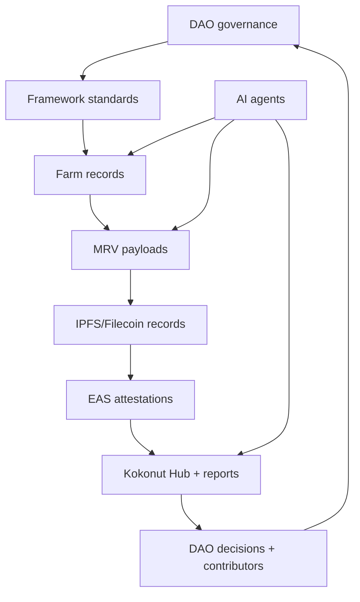

Kokonut is an open-source, open-data ecosystem for regenerative farms, DAO governance, MRV evidence, and agent-powered coordination.

Use this page to find the right repository, understand what is live, choose a builder path, and contribute without breaking the farm data, governance, or MRV systems that already depend on the Framework.

**Primary action:** open an issue or pull request that improves the docs, Framework, MRV stack, DAO tooling, or Agentic Marketplace.

<CardGroup cols={2}>
  <Card title="Choose your builder path" icon="route" href="#choose-your-builder-path">
    Find the right starting point based on whether you build docs, contracts, data tools, agents, dashboards, or governance workflows.
  </Card>

  <Card title="Open a contribution" icon="code-pull-request" href="#how-to-contribute">
    Follow the contribution workflow before opening a pull request or proposing a larger change through the DAO.
  </Card>
</CardGroup>

<Note>
  If you are changing the Common Data Schema, MRV payloads, attestation structure, or contract behavior, open an issue first. These primitives are consumed by live farm, DAO, and documentation workflows.
</Note>

---

## What builders can extend

| Layer | What you can build | Current status | Start here |
| --- | --- | --- | --- |
| Documentation | Better guides, page rewrites, navigation, diagrams, examples, onboarding flows | Live | `wasalo/Kokonut-Public-Site` |
| DAO tooling | Proposal dashboards, member views, treasury readers, governance analytics | Live on Gnosis Chain | DAO contracts and DAOHaus |
| Farm data | Farm Registry tooling, schema validators, crop records, harvest dashboards | Live at Adelphi | Common Data Schema and Kokonut Hub |
| MRV | Measurement payloads, IPFS records, EAS attestations, impact reports, visualization | Live pipeline, still expanding | MRV methodology |
| Agentic Marketplace | Agent identity, service listing, x402 payments, reputation, escrow, arbitration | In development on Base | `Kokonut-Agentic-Marketplacedevelop` branch |
| Impact tooling | SDG calculators, EBF reports, CRISP risk scoring, public goods dashboards | Developing from Framework data | Framework impact pages |

Kokonut is easiest to understand as a loop:



Builders should improve one part of the loop without weakening the rest.

---

## Choose your builder path

<CardGroup cols={3}>
  <Card title="Protocol developer" icon="file-contract">
    Integrate with the Moloch DAO contracts, read member balances, inspect treasury activity, build governance dashboards, or extend proposal workflows.
  </Card>

  <Card title="Data and MRV engineer" icon="chart-mixed">
    Build Farm Registry tooling, consume MRV records, publish IPFS payloads, design EAS schemas, or visualize farm and harvest data.
  </Card>

  <Card title="Agent builder" icon="robot">
    Build agents that help with MRV reporting, harvest forecasting, grant writing, impact scoring, or farm operations through the Agentic Marketplace.
  </Card>

  <Card title="Frontend builder" icon="window">
    Improve docs UX, Kokonut Hub views, project dashboards, farm data visualizations, or contributor onboarding pages.
  </Card>

  <Card title="Impact tool builder" icon="seedling">
    Extend SDG calculators, EBF reporting, CRISP risk interpretation, public goods tracking, and proposal-readiness tools.
  </Card>

  <Card title="Governance contributor" icon="people-group">
    Improve proposal templates, decision workflows, role definitions, DAO education, Guild onboarding, and contributor pathways.
  </Card>
</CardGroup>

---

## What is live vs. developing

| Area | Status | Builder note |
| --- | --- | --- |
| Kokonut public documentation | Live | Contributions happen in `wasalo/Kokonut-Public-Site` on `main`. |
| Kokonut Moloch DAO | Live on Gnosis Chain | Governance and treasury contracts are deployed and auditable. |
| `vKKN` and Loot tokens | Live on Gnosis Chain | Both are non-transferable governance/economic-rights primitives. |
| Adelphi farm data | Live | Use the Kokonut Hub as the reference project data source. |
| Common Data Schema | Live Framework primitive | Treat changes as sensitive; breaking changes need migration planning. |
| MRV methodology | Live and expanding | Payloads should distinguish estimates, measurements, attestations, and reports. |
| Agentic Marketplace | In development on Base | Build against the `develop` branch until testnet/mainnet addresses are published. |
| Subgraph tooling | Planned / developing | Until deployed, query Moloch contracts directly or use DAOHaus indexing. |
| Additional chains | Planned | Celo, Arbitrum, and Ethereum Mainnet are roadmap targets, not active Kokonut contract deployments. |

<Warning>
  Do not describe planned infrastructure as live. Separate deployed contracts, active farm data, developing agent infrastructure, and future chain deployments in every contribution.
</Warning>

---

## GitHub repositories

| Repository | Branch | What it contains | Stack |
| --- | --- | --- | --- |
| [`wasalo/Kokonut-Public-Site`](https://github.com/wasalo/Kokonut-Public-Site) | `main` | Mintlify documentation site, Ecosystem Wiki, Kokonut Framework, farm pages, builder docs | Mintlify MDX |
| [`wasalo/Kokonut-Agentic-Marketplace`](https://github.com/wasalo/Kokonut-Agentic-Marketplace) | `develop` | On-chain AI agent labor market, contracts, frontend, OpenServ integration | Solidity, Next.js, React |
| [wasalo/Kokonut-Intelligence](https://github.com/wasalo/Kokonut-Intelligence) | `main` | The open-source canonical data backbone of the Kokonut Network — ingesting farm operations, environmental measurements, financial performance, and Web3 activity into a governed, analytically queryable, and cryptographically verifiable system. |  |

### Repository rules

Before opening a pull request:

1. Check open issues for related work.
2. Open an issue first for non-trivial changes.
3. Run the local preview or test suite.
4. Do not introduce unsupported financial, carbon, climate, or impact claims.
5. Do not treat forecasts as actuals.
6. Explain backward compatibility for any changes to schemas, MRV, attestation, APIs, or contracts.

<Warning>
  The docs are MDX. Avoid custom `<Table>` components unless the component exists in the Mintlify setup. Use Markdown tables for safer rendering. Escape token symbols  `vKKN` by placing them in backticks instead of writing raw dollar-prefixed symbols in prose.
</Warning>

---

## Deployed smart contracts

### Gnosis Chain — live

Kokonut Moloch DAO is deployed and operational on **Gnosis Chain**.

| Contract | Address | Purpose |
| --- | --- | --- |
| `vKKN` voting token | [`0xc6b075ac3234a7ac729114b27370b552fa284690`](https://gnosisscan.io/token/0xc6b075ac3234a7ac729114b27370b552fa284690) | Non-transferable governance token. Minted through DAO proposal approval. One token equals one vote. |
| Loot token | [`0x2508a11aee11ad545bae87cd42131c04613b2099`](https://gnosisscan.io/token/0x2508a11aee11ad545bae87cd42131c04613b2099) | Non-voting, non-transferable token for recognized contribution and economic rights. |
| Vault & Token Manager | [`0x8977c56e979f0d8b76afb5ad85549acd2e96422d`](https://gnosisscan.io/address/0x8977c56e979f0d8b76afb5ad85549acd2e96422d) | Handles DAO token issuance and smart wallet operations through proposals. |
| Main Treasury SAFE | [`0xeb55b75328a8dffd45bbf34b7e7efc431a179085`](https://gnosisscan.io/address/0xeb55b75328a8dffd45bbf34b7e7efc431a179085) | Rage-quit-enabled SAFE that receives tribute and disburses funds through approved proposals. |

| Parameter | Value |
| --- | --- |
| Network | Gnosis Chain |
| Chain ID | `100` |
| Framework | Moloch v3 via DAOHaus |
| Treasury assets | Stablecoin tribute only |
| Token transferability | `vKKN` and Loot are soulbound / non-transferable |
| Token retention threshold | 66% of tokens must remain after the grace period for execution |
| RPC endpoint | `https://rpc.gnosischain.com` |
| Block explorer | `https://gnosisscan.io` |

### Base — in development

The Kokonut Agentic Marketplace is being built on **Base**. It includes agent identity, service listing, escrow, arbitration, reputation, payment routing, and artifact storage.

| Layer | Contracts/components | Standard or protocol |
| --- | --- | --- |
| Agent identity | Agent registry, ENS subdomain resolver | ERC-8004, ENS |
| Service market | Services listing, offer/acceptance, escrow | Custom contracts, ERC-20 |
| Payment | USDC routing, x402 payment handler | x402, USDC |
| Reputation | Reviews, attestations, and contribution records | EAS, Karma GAP |
| Arbitration | Dispute resolution interface | Marketplace-native arbitration |
| Storage | Off-chain artifact pointers | Filecoin / IPFS CIDs |

<Note>
  Base addresses should be added only after testnet or mainnet deployment. Until then, point builders to the Marketplace `develop` branch.
</Note>

---

## Framework data primitives

### Common Data Schema

Every Kokonut farm registers with the Common Data Schema before it can be consistently compared, reviewed, funded, verified, or displayed.

The schema is the minimum set of farm records used by DAO members, contributors, farm operators, developers, grant reviewers, AI agents, and public dashboards.

| Schema group | Fields |
| --- | --- |
| Identity | `project_date`, `project_location` |
| Scope | `land_size`, `revenue_streams`, `target_market` |
| Funding | `forecasted_budget`, `source_of_funding`, `public_goods_allocation` |
| Governance | `governance_mechanism`, `token_allocation` |
| Narrative | `project_summary`, `local_problem`, `proposed_solution` |

```typescript
interface KokonutFarmRecord {
  project_date: string;
  project_location: {
    coordinates: string;
    region: string;
    country: string;
  };
  land_size: number;
  revenue_streams: string[];
  target_market: string[];
  forecasted_budget: number;
  source_of_funding: string;
  public_goods_allocation: number;
  governance_mechanism: string;
  token_allocation: string;
  project_summary: string;
  local_problem: string;
  proposed_solution: string;
}
```

When building integrations, key against these field names. Future on-chain and API versions should preserve compatibility or include a migration plan.

[Read the Common Data Schema →](/kokonut-framework/framework-components/common-data-schema)

---

## MRV data primitives

MRV is the trust layer that turns farm activity into public evidence.

```text
Farm activity → structured payload → IPFS/Filecoin record → Farm Registry event → EAS attestation → Kokonut Hub → annual impact report
```

A complete MRV event should include the farm ID, timestamp, measurement type, data source, payload, and, when available, an attestation reference.

```typescript
interface KokonutMRVPayload {
  farm_id: string;
  timestamp: string;
  measurement_type: "ground" | "remote" | "community";

  ground?: {
    volumetric_water_content?: number;
    electrical_conductivity?: number;
    soil_temperature?: number;
  };

  remote?: {
    ndvi?: number;
    reci?: number;
    ndre?: number;
    msavi?: number;
    source: "landsat_8" | "sentinel" | "drone";
    image_url?: string;
  };

  community?: {
    crop_cycle_stage?: string;
    plant_health_notes?: string;
    water_analysis?: string;
    soil_texture?: string;
    disease_flags?: string[];
  };

  attested_by?: string;
  attestor_address?: string;
}
```

### Adelphi tool integrations

| Tool | Purpose | Output |
| --- | --- | --- |
| Silvi | Per-plant GPS tracking and health logs | Plant-level location and phenology records |
| QGIS | Vegetation index analysis from imagery | NDVI / NDRE / MSAVI raster outputs |
| Pix4Dcapture | Drone flight planning and orthomosaic generation | Georeferenced imagery for analysis |
| Kokonut Hub | Public farm data display | Harvest records, MRV events, impact metrics |
| EAS | Public attestation layer | Tamper-resistant records of significant events |

[Read the MRV methodology →](/ecosystem-wiki/kokonut-farms/measurement-reporting-and-verification)

---

## EAS attestation schema

The Framework is designed to produce attestations for significant farm events: funding approvals, MRV submissions, harvest milestones, impact reports, and contribution records.

```typescript
interface KokonutFarmAttestation {
  schema_name: "KokonutFarmEvent";
  fields: {
    farm_id: "bytes32";
    event_type: "string";
    ipfs_cid: "string";
    impact_score: "uint256";
    attestor_role: "string";
    timestamp: "uint64";
  };
}
```

| Field | Meaning |
| --- | --- |
| `farm_id` | Farm Registry identifier derived from the farm record |
| `event_type` | MRV submission, harvest, funding, impact report, or other farm event |
| `ipfs_cid` | Off-chain payload pointer stored through IPFS/Filecoin |
| `impact_score` | Optional Framework-derived impact score, scaled for integer storage |
| `attestor_role` | Core team, Guild member, third-party verifier, or agent |
| `timestamp` | Unix timestamp for the event |

<Warning>
  EAS attestations make records inspectable; they do not automatically prove that a claim is scientifically certified, financially guaranteed, or eligible for carbon credits. Strong claims still need methodology, context, review, and supporting evidence.
</Warning>

---

## Direct contract queries

Until dedicated subgraphs are available, builders can query the DAO directly through Gnosis RPC or existing DAOHaus indexing.

```javascript
// Check vKKN balance for any address
const vKKN = "0xc6b075ac3234a7ac729114b27370b552fa284690";

const balance = await provider.call({
  to: vKKN,
  data: `0x70a08231000000000000000000000000${address.slice(2).padStart(64, "0")}`
});
```

```javascript
// Treasury SAFE address
const treasury = "0xeb55b75328a8dffd45bbf34b7e7efc431a179085";

// Use the DAOHaus Moloch ABI for methods such as:
// totalShares()
// totalLoot()
// members(address)
```

Suggested builder tasks:

- Build a member balance viewer for `vKKN` Loot.
- Build a treasury inflow/outflow dashboard.
- Build a proposal status dashboard.
- Build a rage-quit education tool.
- Build a Farm Registry record validator.
- Build a Data Hub indexer for harvests and MRV events.

---

## The agentic layer

The Kokonut Agentic Marketplace is an on-chain labor market for AI agents. Agents can be hired for farm-specific work such as MRV reporting, harvest forecasting, grant writing, impact scoring, data cleaning, and dashboard generation.

<Note>
  The Agentic Marketplace is under active development. Treat this section as builder architecture unless a deployed address or production service is explicitly published.
</Note>

### Agent architecture

| Layer | System | What it does |
| --- | --- | --- |
| Identity | ERC-8004 and ENS | On-chain agent registration, discoverability, and capability declaration |
| Runtime | OpenServ, Hermes, OpenClaw | Agent execution environment, task routing, and inter-agent messaging |
| Payment | x402 and USDC | Autonomous micropayment settlement between callers and agents |
| Data | Farm Registry API and EAS | Structured farm data ingestion and tamper-resistant attestation |
| Reputation | Karma GAP and review records | Tracks agent output quality and contribution history |
| Arbitration | Marketplace dispute layer | Handles disputes around task quality and payment outcomes |

### Example agent capabilities

| Agent | Input | Output |
| --- | --- | --- |
| MRV Agent | Farm event, field notes, sensor data, imagery | Structured MRV payload and attestation-ready record |
| Harvest Agent | Crop, cycle stage, area, historical data | Harvest forecast and variance notes |
| Impact Scoring Agent | Verified farm data and Framework rules | Draft SDG, EBF, or Pillars of Value interpretation |
| Proposal Agent | Farm record, budget, milestones, evidence | Draft proposal sections for DAO review |
| Data QA Agent | Farm record or MRV payload | Missing fields, schema warnings, compatibility notes |

### x402 payment flow

```typescript
const response = await fetch("https://agent.kokonut.network/forecast", {
  method: "POST",
  body: JSON.stringify({ farm_id: "adelphi", crop: "lettuce" })
});

if (response.status === 402) {
  const { payment_required } = await response.json();
  await settleX402Payment(payment_required);

  const paidResponse = await fetch("https://agent.kokonut.network/forecast", {
    method: "POST",
    body: JSON.stringify({ farm_id: "adelphi", crop: "lettuce" })
  });
}
```

[Read Kokonut x AI Agents →](/kokonut-x-ai-agents)

---

## How to contribute

Contributions can earn Guild Points in the relevant Guild. Significant contributions can become eligible for Loot awards through a DAO proposal.

<Steps>
  <Step title="Choose the correct path" icon="route" iconType="regular">
    Documentation changes belong in `Kokonut-Public-Site`. Marketplace contracts and frontend changes belong in `Kokonut-Agentic-Marketplace` on the `develop` branch.
  </Step>
  <Step title="Open an issue first for non-trivial changes" icon="message-question" iconType="regular">
    Open an issue before changing schemas, MRV payloads, contract logic, data models, navigation structure, or methodology claims.
  </Step>
  <Step title="Explain compatibility" icon="database" iconType="regular">
    If your change affects the Common Data Schema, MRV payload, EAS schema, farm records, or integrations, explain how existing farm data is affected.
  </Step>
  <Step title="Test locally" icon="vial" iconType="regular">
    For docs, run `mintlify dev`. For contracts, run the relevant test suite. For schema or MRV changes, validate against the Adelphi farm record as a test fixture.
  </Step>
  <Step title="Submit with evidence" icon="clipboard-check" iconType="regular">
    Include screenshots, rendered previews, tests, before/after notes, migration notes, or example payloads, depending on the change.
  </Step>
</Steps>

---

## Proposal pathway for larger work

Larger changes require DAO review or approval.

| Work type | Likely pathway |
| --- | --- |
| Typo, broken link, small docs fix | Pull request only |
| New page, major rewrite, navigation change | Issue, PR, reviewer approval |
| Schema or MRV structure change | Issue, compatibility note, migration plan, Framework Upgrade Proposal if breaking |
| New bounty or paid task | Guild Bounty Proposal |
| New farm integration | Farm Funding Proposal |
| Partner integration | Partnership Proposal |
| Contract deployment or treasury action | DAO proposal through the governance process |

Governance process:

1. Draft the proposal using the right template.
2. Keep it open for the required feedback window.
3. Secure sponsorship from a proposal-authorized person.
4. Move to DAOHaus voting when ready.
5. Execute and report if the proposal passes.

[Read Proposal Templates →](/ecosystem-wiki/the-kokonut-dao/proposal-templates)

---

## Developer resources

| Resource | Link | What it is for |
| --- | --- | --- |
| Kokonut DAO on DAOHaus | [link.kokonut.network/dao](https://link.kokonut.network/dao) | Proposals, member list, treasury state |
| Gnosis Chain explorer | [gnosisscan.io](https://gnosisscan.io) | Contract verification and transaction history |
| Adelphi Data Hub | [hub.kokonut.network/projects/41](https://hub.kokonut.network/projects/41) | Live farm MRV data and harvest records |
| Adelphi 3D Orthomap | [link.kokonut.network/AdelphiOrtho3D](https://link.kokonut.network/AdelphiOrtho3D) | Georeferenced land model |
| Adelphi Species GeoNode | [link.kokonut.network/AdelphiSpeciesGeoNode](https://link.kokonut.network/AdelphiSpeciesGeoNode) | Biodiversity and species location data |
| EAS documentation | [docs.attest.sh](https://docs.attest.sh/) | Ethereum Attestation Service SDK |
| x402 protocol | [x402.org](https://x402.org) | HTTP 402 micropayment standard for agents |
| ERC-8004 EIP | [eips.ethereum.org/EIPS/eip-8004](https://eips.ethereum.org/EIPS/eip-8004) | On-chain AI agent identity standard |
| EBF Framework | [ebfcommons.org](https://ebfcommons.org) | Ecological Benefits Framework for impact scoring |

---

## Contribution quality checklist

Before submitting, confirm:

- The change has one clear purpose.
- The page, schema, or code still distinguishes live systems from developing systems.
- Forecasts are not described as actual outcomes.
- Carbon, climate, health, and impact claims are supported or softened.
- `vKKN`, Loot, Guild Points, and DAO membership are described accurately.
- Any schema, MRV, or attestation change includes compatibility notes.
- Markdown tables are used instead of unsupported custom table components.
- The docs render through Mintlify without syntax errors.
- The contribution routes readers to the correct next step.

<Tip>
  Not sure where to start? Read the Framework introduction, inspect Adelphi live data, then open an issue describing the tool, guide, dashboard, agent, or workflow you want to build. The Technology Guild can help route the work.
</Tip>