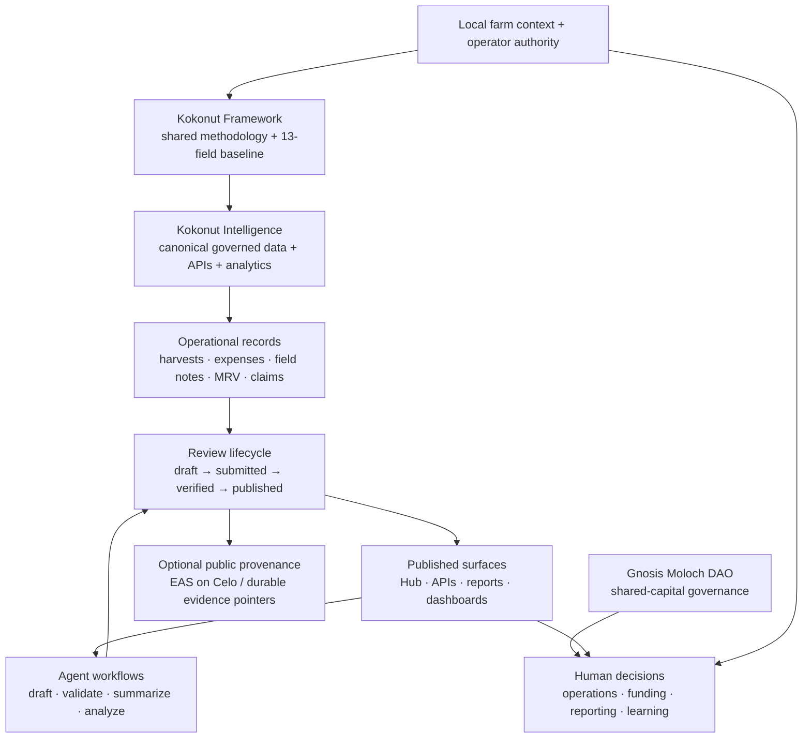
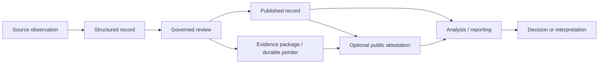
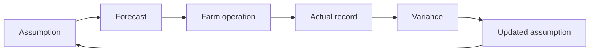

# Build against contracts, not assumptions.

Kokonut is an open ecosystem for regenerative-farm coordination, governed data, evidence, analytics, public reporting, DAO capital governance, and agent-assisted workflows.

That does **not** mean every layer is one protocol, one database, one chain, or one authority.

The builder goal is interoperability:

> **Use stable contracts where Kokonut needs compatibility. Keep local decisions local. Preserve evidence boundaries. Make maturity explicit.**

This page is the starting point for developers, data engineers, agent builders, governance-tool contributors, frontend contributors, researchers, and partners who want to extend Kokonut without silently changing what its records, claims, or governance structures mean.

<CardGroup cols={2}>
  <Card title="Choose the right surface" icon="route" href="#where-should-i-build">
    Start in the repository or governed system that actually owns the behavior you want to change.
  </Card>

  <Card title="Understand the data contract" icon="database" href="#framework-data-contract">
    Preserve the 13-field farm baseline while keeping operational evidence outside the baseline record.
  </Card>

  <Card title="Follow the evidence lifecycle" icon="magnifying-glass-chart" href="#evidence-and-mrv-contract">
    Separate source observations, governed records, publication, provenance, and interpretation.
  </Card>

  <Card title="Contribute safely" icon="code-pull-request" href="#contribution-workflow">
    Explain compatibility, authority, evidence, privacy, and maturity before changing shared primitives.
  </Card>
</CardGroup>

<Note>
  **Primary builder principle:** if a page, contract, API, schema, deployment, or dataset has a more specific canonical source, prefer that source over an old example copied into documentation.
</Note>

---

## Kokonut in one builder map

Kokonut is easiest to understand as a set of connected responsibilities rather than one mandatory pipeline.


```mermaid
flowchart TD
    LOCAL["Local farm context + operator authority"]
    FRAMEWORK["Kokonut Framework\nshared methodology + 13-field baseline"]
    KI["Kokonut Intelligence\ncanonical governed data + APIs + analytics"]
    RECORDS["Operational records\nharvests · expenses · field notes · MRV · claims"]
    REVIEW["Review lifecycle\ndraft → submitted → verified → published"]
    PUBLIC["Published surfaces\nHub · APIs · reports · dashboards"]
    PROV["Optional public provenance\nEAS on Celo / durable evidence pointers"]
    AGENTS["Agent workflows\ndraft · validate · summarize · analyze"]
    DAO["Gnosis Moloch DAO\nshared-capital governance"]
    DECISIONS["Human decisions\noperations · funding · reporting · learning"]

    LOCAL --> FRAMEWORK
    FRAMEWORK --> KI
    KI --> RECORDS
    RECORDS --> REVIEW
    REVIEW --> PUBLIC
    REVIEW --> PROV
    PUBLIC --> AGENTS
    AGENTS --> REVIEW
    DAO --> DECISIONS
    PUBLIC --> DECISIONS
    LOCAL --> DECISIONS
```

The important boundaries are:

- the **Framework** creates shared methodology and compatibility;
- **Kokonut Intelligence** is the canonical governed data and intelligence layer;
- **operational records** describe what actually happens after the baseline;
- **publication** is a governed state, not automatic exposure of every internal record;
- **EAS** can provide public provenance for significant claims without becoming scientific certification;
- **agents** can assist bounded workflows without self-certifying their own outputs;
- the **Moloch DAO** governs shared capital where applicable without becoming the universal farm operator;
- local operators, legal entities, reviewers, Guilds, SAFEs, and technical systems can hold different kinds of authority.

> **Interoperability does not require uniform authority.**

---

## Where should I build?

| If you want to... | Start here | Why |
| --- | --- | --- |
| Improve the Knowledge Base, Framework docs, navigation, diagrams, or public builder guidance | [`wasalo/Kokonut-Public-Site`](https://github.com/wasalo/Kokonut-Public-Site) | This repository is the active public documentation surface |
| Build farm data, governed workflows, analytics, reports, evidence tooling, APIs, or internal agent workflows | [`wasalo/Kokonut-Intelligence`](https://github.com/wasalo/Kokonut-Intelligence) | PostgreSQL + Directus are the canonical schema/API layer; analytics and governed workflows live here |
| Build agent identity, agent commerce, escrow, service discovery, bidding, marketplace UX, or marketplace integrations | [`wasalo/Kokonut-Agentic-Marketplace`](https://github.com/wasalo/Kokonut-Agentic-Marketplace) | This repository owns the agent-economy / marketplace implementation |
| Build DAO readers, proposal tooling, treasury views, or governance analysis | Start with the documented Gnosis DAO state and Kokonut Intelligence governance metadata | Governance data should be read from the deployed system or canonical indexed records, not duplicated prose |
| Build against the farm baseline | [Common Data Schema](/kokonut-framework/framework-components/common-data-schema) | The current 13 field names are compatibility-sensitive |
| Build MRV or evidence tooling | [Measurement, Reporting & Verification](/ecosystem-wiki/kokonut-farms/measurement-reporting-and-verification) | MRV defines the evidence lifecycle and claim boundaries |
| Build Framework-aware impact tooling | Framework methodology pages | SDGs, EBF, CRISP, Pillars, and Forms of Capital each have different evidence and interpretation rules |

### Repository orientation

| Repository | Main role | Builder status |
| --- | --- | --- |
| [`Kokonut-Public-Site`](https://github.com/wasalo/Kokonut-Public-Site) | Public Knowledge Base and Framework documentation | Active |
| [`Kokonut-Intelligence`](https://github.com/wasalo/Kokonut-Intelligence) | Governed data, APIs, analytics, reporting, evidence, attestations, internal agent workflows | Active |
| [`Kokonut-Agentic-Marketplace`](https://github.com/wasalo/Kokonut-Agentic-Marketplace) | Agent identity, services, commerce, escrow, reputation, bidding, marketplace UX, Intelligence integration | Active development |

<Warning>
  Do not assume that an example branch name, contract address, API path, test count, agent count, dashboard count, or deployment target copied into this Knowledge Base will remain current forever. For implementation work, verify those details in the repository that owns them.
</Warning>

---

## What is canonical?

Different questions have different sources of truth.

| Question | Canonical source |
| --- | --- |
| What does Kokonut publicly claim or teach? | Current Knowledge Base pages |
| What are the current Framework concepts and evidence boundaries? | Current Framework pages in `Kokonut-Public-Site` |
| What are the compatibility-sensitive farm baseline fields? | Common Data Schema |
| What operational data model, lifecycle, API, permissions, and analytics exist? | `Kokonut-Intelligence` |
| What is deployed in the agent marketplace? | Marketplace repository deployment/configuration records plus chain explorers |
| What is currently true about DAO contracts and treasury state? | Deployed chain state / authoritative DAO interface |
| What farm records are approved for public consumption? | Published governed records and approved public surfaces |
| What does an attestation prove? | The attestation schema, attestor, referenced evidence, chain record, and stated claim scope |
| Who can authorize a farm operation? | The relevant farm/operator/legal/operational authority — not inferred from a funding mechanism |

A copied example can be useful.

It is not automatically canonical.

---

## Maturity is part of the interface

Builders should describe the state of a capability explicitly.

| State | Meaning |
| --- | --- |
| **Live / active** | Currently operating or used in the documented system |
| **Documented implementation** | Implemented and evidenced for a specific scope, farm, chain, or workflow |
| **In development** | Code or architecture exists but should not be represented as generally production-ready |
| **Planned** | Intended work without a current implementation guarantee |
| **Historical** | Useful for provenance or context but not the current operating contract |
| **Forecast / modeled** | An assumption or scenario to be reconciled against actuals |
| **Evidence-dependent** | The methodology exists, but stronger conclusions depend on adequate records and review |

<Warning>
  **Do not collapse maturity states.** A repository containing code does not by itself make that capability live. A testnet deployment is not a mainnet deployment. A forecast is not an actual. An attestation is not an impact outcome.
</Warning>

---

## Framework data contract

The Common Data Schema is Kokonut's current **13-field farm baseline**.

Its role is compatibility.

It does not represent the entire operational database, and completing it does not make a farm automatically approved, funded, verified, profitable, compliant, or impactful.

### Current compatibility-sensitive shape

```typescript
interface KokonutFarmRecord {
  project_date: string;
  project_location: {
    coordinates: string;
    region: string;
    country: string;
  };
  land_size: number;
  revenue_streams: string[];
  target_market: string[];
  forecasted_budget: number;
  source_of_funding: string;
  public_goods_allocation: number;
  governance_mechanism: string;
  token_allocation: string;
  project_summary: string;
  local_problem: string;
  proposed_solution: string;
}
```

When building integrations:

- key against these field names unless an approved compatible migration says otherwise;
- do not silently narrow `governance_mechanism` into a one-authority enum;
- do not infer realized revenue from `revenue_streams`;
- do not infer buyer contracts from `target_market`;
- do not treat `forecasted_budget` as actual spending;
- do not treat `public_goods_allocation` as a universal Kokonut percentage;
- do not treat `token_allocation` as land title, farm-management authority, or automatic economic rights;
- do not assume exact coordinates must always be public;
- do not add implementation metadata to the 13-field contract and call the result backward-compatible without versioning.

[Read the full Common Data Schema →](/kokonut-framework/framework-components/common-data-schema)

### The baseline is not the operational record

A production system usually needs additional metadata and records such as:

- stable project/farm ID;
- schema/version information;
- lifecycle state;
- timestamps;
- source references;
- reviewer/publisher;
- privacy classification;
- evidence pointers;
- harvests;
- sales;
- expenses;
- losses;
- labor;
- field activities;
- soil samples;
- MRV observations;
- claims;
- attestations;
- agent actions.

Those belong in the governed implementation layer rather than being forced into the baseline object.

---

## Kokonut Intelligence is the governed implementation layer

Kokonut Intelligence is the active open-source intelligence platform for farm operations, financial performance, ecological evidence, partner reporting, governance context, analytics, and Web3 verification.

Its current architecture uses:

| Layer | Current role |
| --- | --- |
| PostgreSQL + PostGIS | Canonical relational and geospatial data |
| Directus | Canonical API, permissions, workflows, and data-entry surface |
| ClickHouse | Analytical/time-series events |
| Python services | Metrics, forecasts, ingestion, reports, exports, analysis, and agents |
| EAS on Celo | Public verification/provenance metadata where useful |
| Off-chain evidence | Detailed or private evidence that should not be exposed on-chain |
| Gnosis governance metadata | Shared-capital governance and related references |

The governed record lifecycle is:

> **draft → submitted → verified → published**

`rejected` exists for rework/exception paths, while domain-specific states such as payment, attestation, execution, and revocation remain separate fields.

<Info>
  In Kokonut Intelligence, a record marked `verified` means it passed the authorized internal workflow for that record class. It does **not** mean scientific certification, regulatory approval, audit assurance, or universal truth.
</Info>

### Builders should preserve the lifecycle

Do not create a shortcut where:

- agents publish their own outputs;
- a draft becomes public merely because it exists;
- a database validation step becomes scientific verification;
- an attestation bypasses domain review;
- a dashboard silently mixes drafts, forecasts, and actuals.

[Explore Kokonut Intelligence →](/kokonut-intelligence)

---

## Evidence and MRV contract

MRV is not one fixed storage pipeline.

The durable evidence sequence is:

> **observe → structure → review → publish → attest when useful → interpret**


```mermaid
flowchart LR
    A["Source observation"] --> B["Structured record"]
    B --> C["Governed review"]
    C --> D["Published record"]
    C --> E["Evidence package / durable pointer"]
    D --> F["Optional public attestation"]
    E --> F
    D --> G["Analysis / reporting"]
    F --> G
    G --> H["Decision or interpretation"]
```

That means:

- not every field record needs IPFS;
- not every observation needs an EAS transaction;
- an EAS attestation can establish provenance without proving causality;
- remote-sensing indices are derived indicators rather than direct measures of biodiversity, soil carbon, revenue, or resilience;
- an impact framework interprets evidence — it does not manufacture evidence;
- a forecast can belong in MRV as a testable planning assumption while remaining a forecast.

### Shared MRV payload

The current builder-facing MRV shape supports ground, remote, and community observations:

```typescript
interface KokonutMRVPayload {
  farm_id: string;
  timestamp: string;
  measurement_type: "ground" | "remote" | "community";

  ground?: {
    volumetric_water_content?: number;
    electrical_conductivity?: number;
    soil_temperature?: number;
  };

  remote?: {
    ndvi?: number;
    reci?: number;
    ndre?: number;
    msavi?: number;
    source: "landsat_8" | "sentinel" | "drone";
    image_url?: string;
  };

  community?: {
    crop_cycle_stage?: string;
    plant_health_notes?: string;
    water_analysis?: string;
    soil_texture?: string;
    disease_flags?: string[];
  };

  attested_by?: string;
  attestor_address?: string;
}
```

Treat this as a shared interoperability shape, not a complete scientific-method definition.

Serious measurements may additionally require:

- units;
- instrument/source metadata;
- calibration;
- sampling method;
- plot/coordinate context;
- observation period;
- baseline;
- reviewer;
- evidence files;
- uncertainty;
- quality flags.

[Read the MRV methodology →](/ecosystem-wiki/kokonut-farms/measurement-reporting-and-verification)

---

## Attestations: provenance, not automatic truth

Kokonut Intelligence supports EAS on Celo for public verification metadata.

Builders should **not** assume that every farm event uses one universal attestation schema or that an attestation turns an interpretation into scientific fact.

A useful attestation should make the scope inspectable:

| Question | What the builder should preserve |
| --- | --- |
| What is being claimed? | A bounded event/claim type |
| Which farm or record does it refer to? | Stable identifier/reference |
| What evidence supports it? | Governed record, evidence pointer, hash, CID, or other reference |
| Who attested it? | Attestor identity/role where appropriate |
| When? | Chain timestamp / record timestamp |
| Can it be revoked or superseded? | Relevant lifecycle/revocation state |
| What does it **not** prove? | Certification, causality, eligibility, or other unsupported conclusions |

<Warning>
  Do not reintroduce a universal `impact_score` field as if Kokonut had one canonical scalar measure of farm impact. SDGs, EBF, Pillars of Value, Forms of Capital, CRISP, financial metrics, and ecological measurements have different meanings and evidence requirements.
</Warning>

For implementation work, use the schemas and attestation tooling in `Kokonut-Intelligence` as the current technical reference.

---

## Governance and authority boundaries

Kokonut coordinates multiple forms of authority.

A builder should not flatten them into one `governance` label.

| Domain | Typical authority | What it does **not** automatically control |
| --- | --- | --- |
| Farm operations | Local operators / responsible farm team | DAO treasury, Framework methodology, external scientific review |
| Legal/operator structure | Relevant legal owner, cooperative, company, agreement parties | Every shared-capital decision or technical implementation |
| Shared-capital governance | Gnosis Moloch DAO where applicable | Day-to-day farm operations merely because funding was approved |
| Contribution coordination | Guild / contributor systems | Legal ownership of land or universal scientific authority |
| Treasury execution | Relevant SAFE / execution path | Framework methodology or agronomy |
| Data review | Authorized governed workflow | Farm ownership or DAO voting rights |
| Framework methodology | Framework/domain maintainers and review process | Local farm-management authority |
| Technical implementation | Maintainers / code owners / deployment process | Scientific truth merely because software enforces a rule |

> **Authorization should follow the domain of the decision.**

---

## Agent builder contract

Kokonut supports agent-assisted workflows, but agents should operate inside bounded permissions and review rules.

Useful agent work includes:

- preparing MRV drafts;
- validating structured records;
- identifying evidence gaps;
- generating analytics;
- reconciling forecast vs. actual;
- drafting reports;
- drafting proposals;
- summarizing governed records;
- routing work for human review.

Agents should not silently:

- self-verify material claims;
- publish their own drafts as trusted records;
- create certification status;
- convert a heuristic into a scientific conclusion;
- override local operators;
- execute treasury actions merely because they can propose them;
- expose private evidence in a public output.

### Two agent surfaces

| Surface | Purpose |
| --- | --- |
| **Kokonut Intelligence agents** | Governed analysis and workflow assistance over farm / evidence data |
| **Kokonut Agentic Marketplace** | Agent identity, services, commerce, escrow, reputation, bidding, marketplace UX, and Intelligence integrations |

The marketplace repository can evolve faster than this Knowledge Base.

Verify current contracts, network configuration, supported standards, SDK methods, and deployment addresses in the marketplace repository before shipping an integration.

[Read Kokonut × AI Agents →](/kokonut-x-ai-agents)

---

## Public vs. private data

Open infrastructure does not require every record to be public.

Builders should preserve:

- least-privilege access;
- consent boundaries;
- farm/operator privacy;
- partner restrictions;
- evidence sensitivity;
- appropriate location precision;
- private raw feedback where public consent does not exist;
- public summaries that do not leak private source material.

For public provenance, publish the minimum metadata needed to establish the claim and its evidence relationship.

Detailed or sensitive evidence can remain off-chain and access-controlled.

---

## Forecasts and actuals

Forecasts are useful because they can be wrong in informative ways.

The builder contract is to keep them distinguishable from actuals.


```mermaid
flowchart LR
    A["Assumption"] --> B["Forecast"]
    B --> C["Farm operation"]
    C --> D["Actual record"]
    D --> E["Variance"]
    E --> F["Updated assumption"]
    F --> A
```

Do not:

- overwrite the original forecast with the actual;
- present expected yield as harvested yield;
- present a target price as realized price;
- present modeled public-goods allocation as realized distribution;
- present a planned job as a job created;
- present a projected ecological benefit as a measured outcome.

A good integration makes the difference visible.

---

## Compatibility rules for shared primitives

Open an issue before making a non-trivial change to:

- the 13-field Common Data Schema;
- shared MRV payloads;
- governed lifecycle semantics;
- public API contracts;
- evidence maturity rules;
- attestation schemas;
- public/private access behavior;
- smart-contract interfaces;
- chain deployment assumptions;
- agent permissions;
- cross-repository integration contracts.

A compatibility-sensitive change should explain:

1. what contract is changing;
2. why the change is necessary;
3. which current consumers are affected;
4. whether the change is additive or breaking;
5. how old records remain interpretable;
6. whether a migration is needed;
7. how the new behavior is tested;
8. which documentation must change with it.

> **A schema can evolve. A silent semantic change is the dangerous part.**

---

## Contribution workflow

<Steps>
  <Step title="1. Start from the owning surface" icon="route" iconType="regular">
    Choose the repository or governed system that actually owns the behavior. Avoid patching a symptom in documentation when the source contract lives elsewhere.
  </Step>

  <Step title="2. Classify the state" icon="layer-group" iconType="regular">
    Say whether the behavior is live, documented for a limited scope, in development, planned, historical, forecast, or evidence-dependent.
  </Step>

  <Step title="3. Identify compatibility and authority" icon="diagram-project" iconType="regular">
    List the schemas, APIs, contracts, lifecycle states, roles, farms, or downstream systems that could be affected.
  </Step>

  <Step title="4. Preserve evidence semantics" icon="magnifying-glass-chart" iconType="regular">
    Keep observations, measurements, forecasts, derived indicators, attestations, and interpretations distinct.
  </Step>

  <Step title="5. Test in the owning repository" icon="vial" iconType="regular">
    Run the repository's current documented checks instead of relying on an old command copied into another page.
  </Step>

  <Step title="6. Submit evidence with the change" icon="clipboard-check" iconType="regular">
    Include tests, rendered previews, sample payloads, migration notes, before/after behavior, screenshots, or deployment evidence as appropriate.
  </Step>
</Steps>

### Repository-specific starting points

#### Knowledge Base

For `Kokonut-Public-Site`:

- use native Mintlify components where possible;
- prefer Markdown tables to custom table components;
- preserve internal route compatibility;
- do not make unsupported impact, financial, climate, legal, or deployment claims;
- keep current state separate from roadmap;
- render/preview MDX before opening the PR.

#### Kokonut Intelligence

For `Kokonut-Intelligence`:

- use the repository README and `AGENTS.md` for the current development commands;
- treat PostgreSQL/Directus as the canonical data/API layer unless the architecture changes through the repository's own review process;
- preserve governed lifecycle and permissions;
- keep public evidence rules and privacy constraints intact;
- update API/data documentation when a shared interface changes;
- follow current CI, code-owner, migration, and seed-idempotency rules.

#### Agentic Marketplace

For `Kokonut-Agentic-Marketplace`:

- verify the current active branch and deployment configuration in the repository;
- use the repository's current contract manifests and chain configuration;
- distinguish testnet from production deployments;
- treat Kokonut Intelligence as an external governed data source rather than duplicating its canonical data model;
- preserve payment, escrow, evaluation, and permission boundaries when integrating autonomous agents.

---

## Builder quality gate

Before submitting a meaningful contribution, confirm:

- [ ] The change has one clear purpose.
- [ ] The owning repository/surface is correct.
- [ ] Live, developing, planned, historical, forecast, and evidence-dependent states are not mixed.
- [ ] Baseline data is not confused with operational evidence.
- [ ] Forecasts are not described as actuals.
- [ ] Observations, measurements, derived indicators, attestations, and interpretations remain distinct.
- [ ] Strong carbon, climate, ecological, financial, health, legal, or impact claims have an appropriate evidence basis.
- [ ] Authority is assigned to the correct domain.
- [ ] Privacy and consent have been considered.
- [ ] Shared-schema or API changes include compatibility and migration notes when needed.
- [ ] Agent outputs cannot silently self-verify or self-publish material claims.
- [ ] Deployment/network claims are verified against their canonical implementation source.
- [ ] Tests or rendered previews demonstrate the new behavior.
- [ ] Documentation is updated alongside behavior when the public contract changed.

---

## Good first contributions

<CardGroup cols={2}>
  <Card title="Documentation hardening" icon="book-open">
    Fix stale implementation claims, unclear evidence boundaries, broken navigation, missing maturity labels, or duplicated definitions.
  </Card>

  <Card title="Schema validation" icon="database">
    Build validators that check structure without pretending syntactic validity is evidence quality.
  </Card>

  <Card title="Evidence QA" icon="clipboard-check">
    Surface missing source, method, unit, reviewer, period, provenance, or uncertainty metadata.
  </Card>

  <Card title="Forecast reconciliation" icon="chart-line">
    Compare planned production, revenue, or resource assumptions against governed actual records.
  </Card>

  <Card title="Public dashboards" icon="chart-mixed">
    Build views that expose record status and evidence class instead of collapsing everything into one score.
  </Card>

  <Card title="Agent review tooling" icon="robot">
    Help agents create bounded drafts, show evidence gaps, and route outputs to authorized reviewers.
  </Card>

  <Card title="Governance readers" icon="building-columns">
    Build read-only proposal, membership, treasury, and execution views grounded in authoritative chain/indexed state.
  </Card>

  <Card title="Privacy-safe publication" icon="shield-halved">
    Improve publication workflows that reveal useful evidence without exposing unnecessary private data.
  </Card>
</CardGroup>

---

## What builders should not assume

<Warning>
  **Do not build from these assumptions unless the owning implementation explicitly establishes them:**

  - every farm record must go through IPFS and EAS;
  - every attestation is scientific verification;
  - one numeric impact score can summarize Kokonut's full impact model;
  - the 13-field baseline is a complete farm database;
  - Moloch funding makes the DAO the farm operator;
  - a target market is a buyer commitment;
  - a revenue stream is realized revenue;
  - a forecasted budget is actual spending;
  - a testnet deployment is production;
  - an agent can certify its own output;
  - public open-source infrastructure means all source evidence should be public;
  - Adelphi proves that every future farm will produce the same outcomes.
</Warning>

---

## Continue from here

<CardGroup cols={2}>
  <Card title="Framework Introduction" icon="scroll" href="/kokonut-framework/Introduction">
    Understand interoperability, local authority, Framework components, evidence boundaries, and replication maturity.
  </Card>

  <Card title="Common Data Schema" icon="database" href="/kokonut-framework/framework-components/common-data-schema">
    Read the complete semantics and compatibility rules for the 13-field farm baseline.
  </Card>

  <Card title="MRV Methodology" icon="magnifying-glass-chart" href="/ecosystem-wiki/kokonut-farms/measurement-reporting-and-verification">
    Follow the full evidence lifecycle and claim standard.
  </Card>

  <Card title="Kokonut Intelligence" icon="brain" href="/kokonut-intelligence">
    Explore the governed data, analytics, reporting, evidence, and agent infrastructure.
  </Card>

  <Card title="Kokonut × AI Agents" icon="robot" href="/kokonut-x-ai-agents">
    See how agents can assist bounded workflows without replacing review or local authority.
  </Card>

  <Card title="Proposal Templates" icon="file-lines" href="/ecosystem-wiki/the-kokonut-dao/proposal-templates">
    Use the relevant governance pathway when a change requires shared-capital or ecosystem approval.
  </Card>
</CardGroup>

> **The best Kokonut integration is not the one that connects to the most systems. It is the one that preserves meaning across them.**
