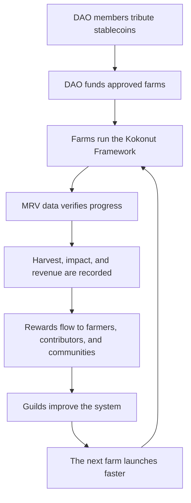

# Kokonut Network turns real farms into community-governed regenerative assets.

Kokonut Network is a blockchain cooperative connecting Web3 communities, contributors, and capital allocators to live syntropic farms — starting with [Adelphi](/ecosystem-wiki/kokonut-farms/adelphi/summary), a working regenerative farm in the Dominican Republic.

The model is simple: the DAO coordinates capital, the Framework standardizes farm operations, MRV systems publish verifiable data, and contributors help replicate the model across new farms.

  <a href="#choose-your-path-into-kokonut" style={{ display: "inline-flex", alignItems: "center", gap: "6px", background: "#009F4D", color: "#fff", padding: "10px 20px", borderRadius: "8px", fontWeight: "600", fontSize: "14px", textDecoration: "none" }}>
    Choose Your Path →
  </a>

  <a href="https://hub.kokonut.network/projects/41" style={{ display: "inline-flex", alignItems: "center", gap: "6px", border: "1.5px solid #009F4D", color: "#009F4D", padding: "10px 20px", borderRadius: "8px", fontWeight: "600", fontSize: "14px", textDecoration: "none", background: "transparent" }}>
    Explore Live Farm Data
  </a>

  Free to explore. No capital required to contribute. DAO walkthroughs are available for partners and capital allocators.

---

## TL;DR 🗒️

- Kokonut Network is a **blockchain cooperative** connecting Web3 communities to real syntropic farms — starting in the Dominican Republic with [Adelphi](/ecosystem-wiki/kokonut-farms/adelphi/summary), our first live farm.
- We address the [worldwide lack of funding for agricultural projects](https://youtu.be/ZjygLVUSq4s) by partnering with farmers, raising funds through the [Kokonut DAO](/ecosystem-wiki/the-kokonut-dao/dao-layers), and distributing rewards perpetually to the people and communities growing the network.
- Every \$vKKN governance token is backed **1:1 by a real coconut tree**. The DAO has no admins — decisions happen through on-chain proposals, and rage-quit protects every capital-contributing member.
- The [Kokonut Framework](/kokonut-framework/Introduction) is the repeatable piece: a modular trust layer covering farm funding, MRV, governance, and impact measurement so every new farm can launch without reinventing the coordination logic.
- Contributors do not need capital to start. Through [Kokonut Guilds](/ecosystem-wiki/the-kokonut-dao/kokonut-guilds-dao), builders, researchers, agronomists, and organizers can earn Guild Points through verified work.

  

    
15,725

    
m² live farm

  

  

    
13,838

    
m² agricultural

  

  

    
7

    
jobs supported

  

  

    
110

    
free-range hens

  

  

    
5

    
UN SDGs addressed

  

  

    
PN #69

    
public goods funded

  

---

## Who this is for

<CardGroup cols={2}>
  <Card title="Regenerative agriculture builders" icon="seedling">
    Learn how Kokonut turns farm operations, syntropic agriculture, MRV, and community ownership into a repeatable farm development model.
  </Card>

  <Card title="ReFi and Web3 contributors" icon="network-wired">
    See how DAO governance, EAS attestations, open-source infrastructure, Guild Points, and farm-backed tokens connect to real land.
  </Card>

  <Card title="Capital allocators and DAO members" icon="coins">
    Understand how stablecoin tribute, \$vKKN, DAO proposals, rage-quit, treasury transparency, and farm-backed governance work.
  </Card>

  <Card title="Developers and AI agent builders" icon="robot">
    Explore the Farm Registry primitives, MRV automation stack, EAS-compatible data flows, and the Kokonut Agentic Marketplace.
  </Card>
</CardGroup>

---

## What we've built so far

Kokonut Network is not a whitepaper project.

[Adelphi](/ecosystem-wiki/kokonut-farms/adelphi/summary) — our flagship syntropic farm in Gonzalo, Monte Plata, Dominican Republic — is already growing. It was funded through [Public Nouns Proposal #69](https://publicnouns.wtf/vote/69) and operates under the full Kokonut Framework: satellite MRV monitoring via Landsat 8 and Sentinel, soil moisture probes, per-plant GPS tracking through Silvi, and on-chain EAS attestations for major farm events.

Real-time harvest records and impact data are publicly available at [hub.kokonut.network/projects/41](https://hub.kokonut.network/projects/41). The numbers in this documentation are not pitch-deck placeholders — they come from a working farm, live operations, and recorded outputs.

<Note>
  Adelphi proves the model can work at the farm level. The next challenge is replication: more farms, more verified data, more contributors, and more community-owned regenerative production.
</Note>

---

## Why Kokonut Network? 🌴

Grassroots farmers control less than 10% of the global coconut market — not because their land is unproductive, but because they lack access to capital, coordination tools, and transparent governance structures.

Kokonut Network serves as the coordination layer that uses Web3 and open-source infrastructure to close this gap. The model has four interlocking parts:

<CardGroup cols={2}>
  <Card title="The Kokonut DAO" icon="hydra" href="/ecosystem-wiki/the-kokonut-dao/dao-layers">
    Holds the treasury, governs farm funding decisions, mints and burns membership tokens, and distributes rewards. It runs through proposals, not administrators.
  </Card>

  <Card title="The Kokonut Framework" icon="puzzle" href="/kokonut-framework/Introduction">
    The modular blueprint every farm runs on: common data schema, development phases, regeneration principles, MRV, and impact measurement.
  </Card>

  <Card title="Adelphi Farm" icon="seedling" href="/ecosystem-wiki/kokonut-farms/adelphi/summary">
    The living proof of concept: a women-led syntropic farm addressing five UN SDGs with public MRV records and community-first operations.
  </Card>

  <Card title="The Agentic Marketplace" icon="robot" href="/kokonut-x-ai-agents">
    The emerging infrastructure layer where AI agents support MRV reporting, harvest forecasting, grant drafting, and impact scoring at scale.
  </Card>
</CardGroup>

Our model has no expiration date. When coconut trees end their productive life, we replant them. The cooperative continues. The community owns the upside.

---

## The Kokonut loop

1. DAO members tribute stablecoins.
2. The DAO funds farms through proposals.
3. Farms run the Kokonut Framework.
4. MRV data verifies farm progress.
5. Harvest, revenue, and impact records flow back into the network.
6. Guilds and contributors improve the system so the next farm can launch faster.

---

## Built to reduce trust gaps

<CardGroup cols={3}>
  <Card title="Public farm data" icon="satellite">
    Adelphi publishes farm records, harvest activity, and impact data through the Kokonut Hub so visitors can inspect the work directly.
  </Card>

  <Card title="On-chain governance" icon="shield-check">
    Major treasury and membership decisions happen through DAO proposals, with rage-quit protection for capital-contributing members.
  </Card>

  <Card title="Contribution before capital" icon="hand-holding-seedling">
    Builders, researchers, agronomists, and organizers can start through Guild work and earn Guild Points without contributing capital.
  </Card>
</CardGroup>

<Note>
  You can explore Kokonut before committing capital. Read the docs, inspect Adelphi's live farm data, join the community, or contribute through Guilds. Capital contributors receive rage-quit protection; non-capital contributors can earn Guild Points through verified work.
</Note>

---

## Why coconuts? 🥥

Coconuts are one of the most versatile agricultural assets in the world. They produce food, drinks, oils, fiber, husks for fertilizer, and wood for furniture and construction. In a syntropic system, they are not only a crop — they are part of a living, regenerative structure that supports soil restoration, biodiversity, water retention, and long-term farm resilience.

Kokonut starts with coconut trees because they are productive, symbolic, durable, and naturally aligned with the cooperative model:

- **Long-term productive life:** trees compound value across years, not one harvest cycle.
- **Multiple product streams:** coconut water, oil, food, fiber, husk, compost, and wood.
- **Ecological fit:** coconut trees can be integrated into biodiverse syntropic systems.
- **Clear token relationship:** every \$vKKN governance token is backed 1:1 by a real coconut tree.
- **Perpetual renewal:** when a tree ends its productive life, the network replants.

> **Coconut is a versatile fruit with compounding health, environmental, and biodiversity benefits — and a proven global market.**

---

## Kokonut Framework Holistic Impact

<Frame>
  
</Frame>

We are building a [hybrid framework](/kokonut-framework/Introduction) that creates positive, community-centric impact — addressing systemic issues in underserved areas and enhancing climate resilience. Our approach focuses on sustainable solutions that improve daily lives and create incentives without deforestation.

Every component of the ecosystem is designed around the same core principle: the community is prioritized over capital. The [Kokonut Manifesto](/ecosystem-wiki/kokonut-101/manifesto) articulates this in full. The [Governance Framework](/ecosystem-wiki/the-kokonut-dao/governance-framework) operationalizes it.

---

## Choose your path into Kokonut

<CardGroup cols={2}>
  <Card title="Start with the full story" icon="book-open-reader" href="/ecosystem-wiki/kokonut-101/problem">
    Continue through Kokonut 101: the problem, solution, manifesto, and why Web3 is part of the model.
  </Card>

  <Card title="Inspect the live farm" icon="seedling" href="/ecosystem-wiki/kokonut-farms/adelphi/summary">
    See Adelphi's crops, biodiversity, harvest forecasts, MRV methodology, SDG alignment, and live farm records.
  </Card>

  <Card title="Understand the DAO" icon="hydra" href="/ecosystem-wiki/the-kokonut-dao/dao-layers">
    Learn how the treasury, tokens, governance, Guilds, rage-quit, and contributor pathways work together.
  </Card>

  <Card title="Read the Framework" icon="puzzle" href="/kokonut-framework/Introduction">
    Explore the modular trust layer every farm runs on — open source, composable, and designed to scale.
  </Card>

  <Card title="Contribute to the ecosystem" icon="telescope" href="/ecosystem-wiki/open-collaboration-invitation">
    Plug in as an agronomist, developer, ReFi builder, researcher, DAO member, partner, or community organizer.
  </Card>

  <Card title="Build with Kokonut" icon="code" href="/build-with-kokonut">
    Developers can use the public docs, deployed contracts, Farm Registry primitives, and AI agent architecture.
  </Card>
</CardGroup>

  <a href="https://link.kokonut.network/discord" style={{ display: "inline-flex", alignItems: "center", gap: "6px", background: "#009F4D", color: "#fff", padding: "10px 20px", borderRadius: "8px", fontWeight: "600", fontSize: "14px", textDecoration: "none" }}>
    Join the Community →
  </a>

  <a href="https://link.kokonut.network/meeting" style={{ display: "inline-flex", alignItems: "center", gap: "6px", border: "1.5px solid #009F4D", color: "#009F4D", padding: "10px 20px", borderRadius: "8px", fontWeight: "600", fontSize: "14px", textDecoration: "none", background: "transparent" }}>
    Book a Walkthrough
  </a>

