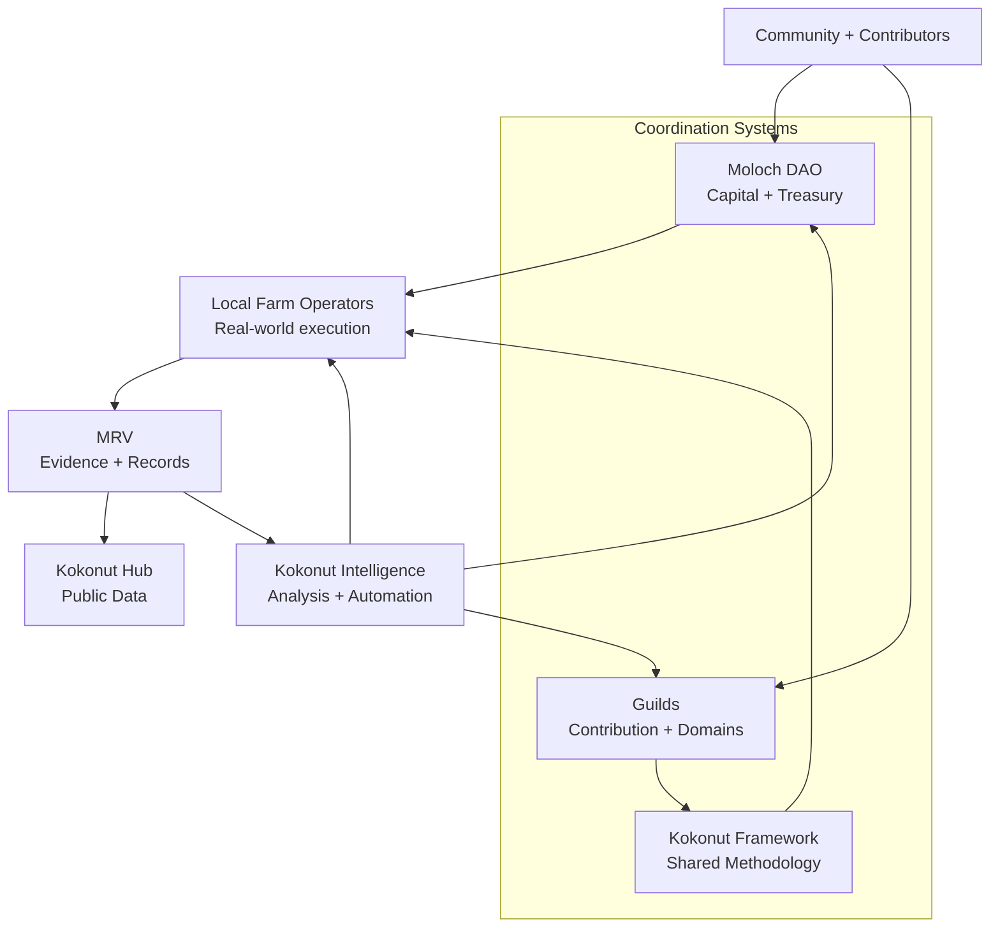
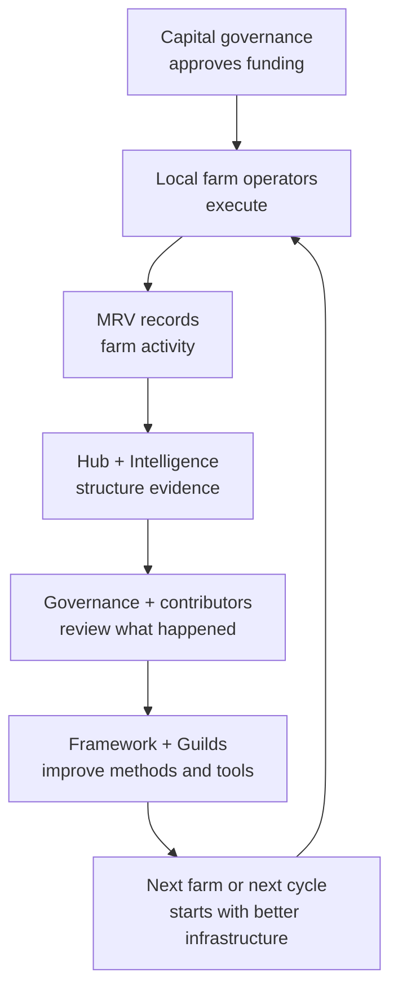

# Kokonut is open coordination infrastructure for regenerative agriculture.

Kokonut Network connects **locally operated regenerative farms** with capital governance, contributor coordination, shared implementation standards, public evidence, and open-source intelligence.

[Adelphi](/ecosystem-wiki/kokonut-farms/adelphi/summary), in Monte Plata, Dominican Republic, is the first live reference implementation. It gives the ecosystem a real place to test governance, farm-development methods, data structures, MRV, and community participation before those ideas are replicated elsewhere.

<CardGroup cols={2}>
  <Card title="Start with the live farm" icon="seedling" href="https://hub.kokonut.network/projects/41">
    Inspect Adelphi's public project records, farm activity, and MRV data before reading deeper into the model.
  </Card>

  <Card title="Continue through Kokonut 101" icon="book-open-reader" href="/ecosystem-wiki/kokonut-101/problem">
    Follow the problem, solution, vision, and manifesto that explain why the ecosystem is designed this way.
  </Card>
</CardGroup>

<Info>
  **Kokonut separates proof from projection.** Documented farm state, measured activity, forecasts, and developing infrastructure are different things and should be read that way.
</Info>

---

## Kokonut in one minute

- **Farm first:** Adelphi is a live syntropic farm with public records, operators, infrastructure, crops, poultry, and active MRV workflows.
- **Different responsibilities use different coordination systems:** the Moloch DAO governs capital and treasury decisions; Guilds coordinate contribution; local operators run the farm; the Framework provides shared methodology.
- **Evidence matters:** MRV connects field activity, remote sensing, farm records, and attestations to public reporting through the Kokonut Hub and related infrastructure.
- **The Framework is reusable, not rigid:** new farms can share data structures, development phases, evidence standards, and coordination interfaces while adapting to local ecology, culture, operators, markets, and regulation.
- **Participation is not limited to capital:** builders, researchers, agronomists, organizers, and other contributors can participate through useful work and Guild pathways.
- **The technical layer is expanding:** Kokonut Intelligence is active infrastructure, while more advanced AI-agent automation remains in development.

---

## Start with proof: Adelphi

Kokonut is not beginning with a hypothetical farm.

Adelphi is a working, women-led regenerative agriculture project in Gonzalo, Monte Plata, Dominican Republic. It is the first place where the Kokonut model is being applied in real conditions.

<CardGroup cols={4}>
  <Card title="15,725 m²" icon="map">
    Total mapped farm area documented for Adelphi.
  </Card>

  <Card title="13,838 m²" icon="seedling">
    Documented agricultural area within the site.
  </Card>

  <Card title="7 jobs" icon="people-group">
    Jobs supported in the documented farm implementation.
  </Card>

  <Card title="110 hens" icon="egg">
    Documented free-range poultry component.
  </Card>
</CardGroup>

Adelphi was supported through [Public Nouns Proposal #69](https://publicnouns.wtf/vote/69) and is documented through the [Adelphi farm pages](/ecosystem-wiki/kokonut-farms/adelphi/summary), the Kokonut Framework, and the public [Kokonut Hub](https://hub.kokonut.network/projects/41).

<Note>
  These numbers are **documented reference values**, not a live dashboard. Current farm records and MRV activity should be checked through the Kokonut Hub. Production and revenue estimates belong in the [crop and harvest forecast](/ecosystem-wiki/kokonut-farms/adelphi/crops-and-harvest-forecast) and should not be treated as achieved outcomes.
</Note>

<CardGroup cols={2}>
  <Card title="Read the Adelphi overview" icon="trees" href="/ecosystem-wiki/kokonut-farms/adelphi/summary">
    See the farm's operators, crops, biodiversity, infrastructure, MRV system, forecasts, and public records.
  </Card>

  <Card title="See how farm activity is verified" icon="badge-check" href="/ecosystem-wiki/kokonut-farms/measurement-reporting-and-verification">
    Review the evidence layers, tools, records, and limitations behind Kokonut's MRV approach.
  </Card>
</CardGroup>

---

## How Kokonut fits together

Kokonut treats regenerative agriculture as a coordination problem with several distinct responsibilities.

The ecosystem does **not** depend on one DAO making every decision.

```mermaid
flowchart TD
    PEOPLE["Community + Contributors"]

    subgraph COORDINATION["Coordination Systems"]
        CAPITAL["Moloch DAO<br/>Capital + Treasury"]
        GUILDS["Guilds<br/>Contribution + Domains"]
        FRAMEWORK["Kokonut Framework<br/>Shared Methodology"]
    end

    FARM["Local Farm Operators<br/>Real-world execution"]
    MRV["MRV<br/>Evidence + Records"]
    HUB["Kokonut Hub<br/>Public Data"]
    KI["Kokonut Intelligence<br/>Analysis + Automation"]

    PEOPLE --> CAPITAL
    PEOPLE --> GUILDS

    CAPITAL --> FARM
    GUILDS --> FRAMEWORK
    FRAMEWORK --> FARM

    FARM --> MRV
    MRV --> HUB
    MRV --> KI

    KI --> CAPITAL
    KI --> GUILDS
    KI --> FARM
```

| Layer | Primary role |
| --- | --- |
| **Moloch DAO** | Capital membership, treasury governance, proposals, voting, execution, and rage-quit protection |
| **Guilds** | Contribution coordination, domain work, reputation, bounties, and contributor pathways |
| **Kokonut Framework** | Shared farm-development methodology, data structures, development phases, and impact logic |
| **Local farm operators** | Day-to-day agricultural decisions and real-world execution |
| **MRV** | Measurement, reporting, verification, and evidence quality |
| **Kokonut Hub** | Public-facing farm and project records |
| **Kokonut Intelligence** | Data integration, analytics, synthesis, reporting, automation, and decision support |
| **AI-agent infrastructure** | Developing automation for repeatable analytical and coordination tasks |

> **The goal is interoperability, not uniformity.** Farms can share a common baseline without pretending every landscape, community, operator, market, or regulatory environment is the same.

---

## One ecosystem, different coordination systems

Kokonut separates responsibilities because capital, contribution, farm operations, evidence, and technical infrastructure require different forms of accountability.

<CardGroup cols={2}>
  <Card title="Capital governance" icon="building-columns" href="/ecosystem-wiki/the-kokonut-dao/kokonut-moloch-dao">
    Stablecoin contributors participate through the Moloch DAO. Treasury actions move through proposals, voting, execution rules, and rage-quit protections.
  </Card>

  <Card title="Contribution governance" icon="users" href="/ecosystem-wiki/the-kokonut-dao/kokonut-guilds-dao">
    Contributors can build standing through useful work, Guild participation, domain reputation, and approved contributor-recognition pathways.
  </Card>

  <Card title="Farm operations" icon="tractor">
    Local operators remain responsible for real agricultural execution. Governance infrastructure does not replace field knowledge or day-to-day stewardship.
  </Card>

  <Card title="Shared methodology" icon="puzzle" href="/kokonut-framework/Introduction">
    The Framework makes farms more interoperable through shared phases, data structures, regenerative principles, MRV, and impact methods.
  </Card>
</CardGroup>

This architecture is intentional: a living ecosystem contains different forms of knowledge, risk, responsibility, and value. Kokonut connects them without trying to collapse them into a single governance mechanism.

---

## What is live and what is still developing

Transparency about maturity matters.

| Component | Status | What that means |
| --- | --- | --- |
| **Adelphi Farm** | **Live** | Active reference farm in Monte Plata with public records and ongoing operations |
| **Kokonut Moloch DAO** | **Live** | Governance, treasury, membership, token, proposal, and rage-quit infrastructure deployed on Gnosis Chain |
| **Kokonut Framework** | **Live and evolving** | Public methodology already applied to Adelphi and continuously improved |
| **MRV pipeline** | **Active and expanding** | Field, harvest, remote-sensing, and impact records support public verification; coverage and automation continue to improve |
| **Kokonut Hub** | **Live** | Public-facing project and farm-data surface for Adelphi |
| **Kokonut Intelligence** | **Active infrastructure** | Data, analytics, research, synthesis, scoring, and reporting infrastructure |
| **AI-agent runtime and automation** | **Developing** | Task-specific automation for MRV, forecasting, reporting, scoring, identity, and payments is still being built |
| **Multi-farm replication** | **Next frontier** | The next major test is applying the shared model to additional farms without rebuilding the entire coordination stack |

<Note>
  A documented concept is not the same as a deployed system. Kokonut documentation should keep those maturity levels explicit as the ecosystem evolves.
</Note>

---

## The Kokonut coordination loop

The core loop is designed to move **capital, work, evidence, and learning** through different parts of the ecosystem.

```mermaid
flowchart TD
    A["Capital governance<br/>approves funding"] --> B["Local farm operators<br/>execute"]
    B --> C["MRV records<br/>farm activity"]
    C --> D["Hub + Intelligence<br/>structure evidence"]
    D --> E["Governance + contributors<br/>review what happened"]
    E --> F["Framework + Guilds<br/>improve methods and tools"]
    F --> G["Next farm or next cycle<br/>starts with better infrastructure"]
    G --> B
```

This is different from promising that one token, treasury, or automation system solves every problem.

The intended feedback loop is:

1. Capital decisions are made through the appropriate governance process.
2. Farm operators execute in the real world.
3. Farm activity becomes structured evidence.
4. Evidence informs reporting, governance, contributor work, and operational decisions.
5. The Framework, tools, and coordination processes improve.
6. Future farm cycles begin with more reusable knowledge and infrastructure.

Where farm revenue is involved, allocation depends on the approved economic and governance arrangements for that farm. Revenue forecasts are not guaranteed returns.

---

## Why coconuts?

Coconut trees are one of Kokonut's long-cycle anchors inside diversified syntropic systems.

They matter for several reasons:

- **Long productive life:** coconut is a perennial crop rather than a single-season harvest.
- **Multiple potential product streams:** water, food, oil, fiber, husk, compost inputs, and other processed products can create different market pathways.
- **Syntropic compatibility:** coconut trees can be integrated into multi-strata, biodiverse production systems rather than isolated monocultures.
- **Governance relationship:** Kokonut's current \$vKKN model uses a 1:1 relationship between governance tokens and coconut trees.
- **Renewal principle:** the model is designed around replanting when trees reach the end of productive life rather than treating the underlying natural asset as disposable.

Coconut is not the entire farm model. Adelphi combines long-cycle trees with shorter-cycle crops, passion fruit, poultry, biodiversity, soil regeneration, infrastructure, and community activity.

---

## How people participate

Kokonut has more than one entry path.

<CardGroup cols={2}>
  <Card title="Explore and verify" icon="magnifying-glass-chart" href="https://hub.kokonut.network/projects/41">
    Read the public documentation, inspect Adelphi records, review the MRV methodology, and examine governance before deciding how to participate.
  </Card>

  <Card title="Contribute useful work" icon="hand-holding-seedling" href="/ecosystem-wiki/open-collaboration-invitation">
    Agronomists, researchers, developers, designers, organizers, writers, analysts, and other contributors can enter through work rather than capital.
  </Card>

  <Card title="Participate in capital governance" icon="coins" href="/ecosystem-wiki/the-kokonut-dao/dao-layers">
    Understand the Moloch DAO, stablecoin tribute, \$vKKN, Loot, proposal flow, treasury protections, and rage-quit mechanics.
  </Card>

  <Card title="Build infrastructure" icon="code" href="/build-with-kokonut">
    Work with the public documentation, Framework, data structures, contracts, Kokonut Intelligence, MRV tooling, and agent architecture.
  </Card>
</CardGroup>

---

## What Kokonut is not

Understanding the boundaries is as important as understanding the ambition.

<CardGroup cols={2}>
  <Card title="Not one DAO for everything" icon="diagram-project">
    The Moloch DAO is one coordination layer. Guilds, local operators, the Framework, MRV systems, and technical infrastructure have different roles.
  </Card>

  <Card title="Not a one-size-fits-all farm template" icon="leaf">
    Shared standards make farms interoperable, but implementation must adapt to local ecology, culture, operators, markets, and regulation.
  </Card>

  <Card title="Not forecasts presented as facts" icon="calculator">
    Production, revenue, carbon, and impact projections should be labeled as estimates until supported by measured outcomes.
  </Card>

  <Card title="Not a trust-me pitch" icon="eye">
    The system is designed to be inspected through public documentation, farm records, governance records, deployed infrastructure, and open repositories.
  </Card>
</CardGroup>

---

## Who this overview is for

<CardGroup cols={2}>
  <Card title="Farmers and regenerative practitioners" icon="seedling">
    Understand how Kokonut combines local farm operations with shared methods, data, funding coordination, and evidence.
  </Card>

  <Card title="Community and ReFi contributors" icon="people-group">
    See how public-goods work, Guild coordination, governance, MRV, and regenerative production connect.
  </Card>

  <Card title="Capital allocators and governance participants" icon="building-columns">
    Understand where treasury governance fits, what protections exist, and why capital is only one layer of the ecosystem.
  </Card>

  <Card title="Developers, researchers, and AI builders" icon="robot">
    Explore Kokonut Intelligence, data schemas, MRV automation, public infrastructure, and developing agent workflows.
  </Card>
</CardGroup>

---

## Continue Kokonut 101

The executive summary is the map. The next four pages go deeper into the reasoning behind it.

<CardGroup cols={2}>
  <Card title="1. The Problem" icon="circle-info" href="/ecosystem-wiki/kokonut-101/problem">
    Why Kokonut treats agricultural undercapitalization as a coordination problem around land, capital, markets, evidence, and community power.
  </Card>

  <Card title="2. The Solution" icon="shield-check" href="/ecosystem-wiki/kokonut-101/solution">
    How the different Kokonut coordination layers work together around real farms.
  </Card>

  <Card title="3. The Vision" icon="telescope" href="/ecosystem-wiki/kokonut-101/kokonut-vision">
    The long-term direction: more regenerative farms, stronger local ownership, reusable infrastructure, and compounding community knowledge.
  </Card>

  <Card title="4. The Manifesto" icon="scroll-old" href="/ecosystem-wiki/kokonut-101/manifesto">
    The values and commitments that define how Kokonut wants to grow.
  </Card>
</CardGroup>

> **Kokonut begins with a real farm and builds outward from evidence.** Adelphi is the first reference implementation; the Framework, governance layers, MRV systems, contributor pathways, and intelligence infrastructure are designed to make the next implementation more transparent, interoperable, and easier to improve.
