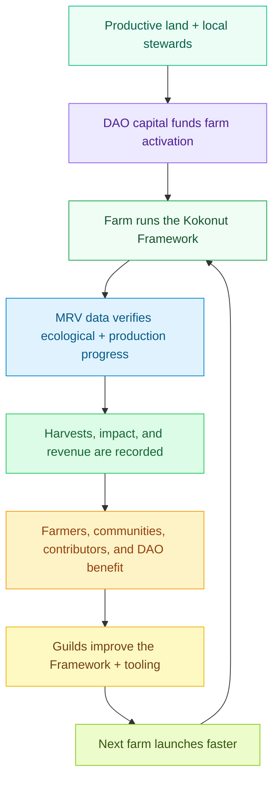

# A network of farms that restores land, distributes ownership, and compounds community wealth.

Kokonut Network exists to make regenerative agriculture fundable, governable, verifiable, and community-owned.

We are building toward a world where productive land does not sit idle because farmers lack access to capital. A world where agricultural communities own more than the labor behind the crops they grow. A world where the trust layer between contributors, capital, and farmers is not a bank, corporation, or temporary grant program — but a transparent, permissionless, community-governed network that anyone can inspect and no single actor can capture.

> **The vision is not only more farms. The vision is a new coordination layer for land, labor, capital, data, and community ownership.**

  <a href="#the-vision-in-one-loop" style={{ display: "inline-flex", alignItems: "center", gap: "6px", background: "#009F4D", color: "#fff", padding: "10px 20px", borderRadius: "8px", fontWeight: "600", fontSize: "14px", textDecoration: "none" }}>
    See the Vision in One Loop →
  </a>

  <a href="/ecosystem-wiki/kokonut-farms/adelphi/summary" style={{ display: "inline-flex", alignItems: "center", gap: "6px", border: "1.5px solid #009F4D", color: "#009F4D", padding: "10px 20px", borderRadius: "8px", fontWeight: "600", fontSize: "14px", textDecoration: "none", background: "transparent" }}>
    See Adelphi in Action
  </a>

  The vision is already underway at Adelphi — Kokonut's first live syntropic farm in Monte Plata, Dominican Republic.

<Frame>
  
  
</Frame>

Kokonut Network was created to reduce the obstacles to agricultural development and democratize participation in real-world regenerative projects — starting with the communities and the land that need it most.

---

## The vision at a glance

  

    
15,725

    
m² live farm

  

  

    
7

    
jobs supported

  

  

    
110

    
free-range hens

  

  

    
5

    
UN SDGs addressed

  

  

    
PN #69

    
public goods funded

  

  

    
1:1

    
$vKKN to trees

  

Kokonut's vision is not a distant promise. It begins with one real farm, one real DAO, one real Framework, and a growing contributor network that can make the second farm easier to fund, operate, verify, and govern than the first.

---

## What we see when we look forward

Kokonut's vision operates across three horizons simultaneously. Each one reinforces the others.

<CardGroup cols={3}>
  <Card title="Ecological regeneration" icon="seedling">
    Farms should restore the land they use. We envision syntropic farms that build soil fertility, increase biodiversity, improve water retention, reduce reliance on synthetic inputs, and leave each generation with healthier land than the last.
  </Card>

  <Card title="Economic democratization" icon="coins">
    Communities should participate in the upside of the crops they grow. We envision farm-backed governance, transparent treasuries, Guild rewards, rage-quit protections, and ownership paths that do not depend only on existing wealth.
  </Card>

  <Card title="Social sovereignty" icon="people-group">
    Land is cultural infrastructure, not only economic infrastructure. We envision farms that preserve knowledge, train local stewards, support women-led operations, create jobs, distribute seedlings, and become gathering places for community renewal.
  </Card>
</CardGroup>

---

## The vision in one loop

The goal is a regenerative flywheel: farms generate food, data, revenue, and impact; the network uses those outputs to fund contributors, improve infrastructure, and onboard more farms; every new farm adds productive capacity and community ownership to the system.

<Note>
  The difference between a foundation and a network is ownership. A foundation accumulates resources and decides who deserves them. A network distributes ownership, routes capital to where it can become productive, and makes the people tending the land direct participants in the value the land creates.
</Note>

---

## The vision made real at Adelphi

At [Adelphi](/ecosystem-wiki/kokonut-farms/adelphi/summary), the future Kokonut imagines is already visible:

- A women-led farm in Gonzalo, Monte Plata, Dominican Republic.
- 15,725 m² of productive land, with 13,838 m² dedicated to agro-ecological production.
- Short-, medium-, and long-cycle crops growing in the same system.
- 110 free-range hens producing manure that supports on-site nutrient cycling.
- Native and endangered species propagation.
- Satellite, drone, soil, field, harvest, and per-plant geospatial data.
- Public records at [hub.kokonut.network/projects/41](https://hub.kokonut.network/projects/41).
- On-chain EAS attestations for major farm events.
- Public goods allocation is built into the farm model.

This matters because visions need proof. Adelphi is the proof that Kokonut's model can move from theory into land, crops, jobs, data, and community benefit.

[Explore Adelphi Farm →](/ecosystem-wiki/kokonut-farms/adelphi/summary)

---

## Mission approach: powered by people and trees

[Syntropic farming](/kokonut-framework/why-syntropic-farming) is the agricultural engine of this vision. It turns farms into living systems: productive, biodiverse, soil-building, and resilient across multiple crop cycles.

What Kokonut adds is the coordination layer that syntropic farming needs to scale:

<CardGroup cols={2}>
  <Card title="DAO-governed capital" icon="hydra" href="/ecosystem-wiki/the-kokonut-dao/dao-layers">
    The Kokonut DAO coordinates treasury decisions, farm funding, membership, token issuance, rage-quit protection, and long-term governance through proposals instead of unilateral control.
  </Card>

  <Card title="The Kokonut Framework" icon="puzzle" href="/kokonut-framework/Introduction">
    Every farm runs on a shared blueprint: common data schema, development phases, regeneration principles, MRV standards, and public goods allocation.
  </Card>

  <Card title="MRV and attestations" icon="satellite" href="/ecosystem-wiki/kokonut-farms/measurement-reporting-and-verification">
    Satellite imagery, drone data, soil readings, harvest records, field logs, and EAS attestations turn farm activity into publicly verifiable proof.
  </Card>

  <Card title="Guild-powered contribution" icon="hand-holding-seedling" href="/ecosystem-wiki/the-kokonut-dao/kokonut-guilds-dao">
    Contributors without capital can still earn Guild Points and Loot through meaningful work in technology, impact, communications, governance, finance, and partnerships.
  </Card>
</CardGroup>

The network is powered by people and trees. Trees generate long-term productive value. People provide care, knowledge, governance, research, tools, and coordination. The Framework connects both into a repeatable system.

---

## Where the trajectory is heading

Kokonut's vision unfolds across three practical horizons.

<Steps>
  <Step title="Now: prove the model through Adelphi" icon="seedling" iconType="regular">
    The near-term work is Adelphi's full operational maturity: stronger harvest records, deeper MRV, improved farm infrastructure, local education, public data, and clearer revenue allocation.
  </Step>
  <Step title="Next: replicate the Framework" icon="diagram-project" iconType="regular">
    The next phase is onboarding additional farms into the same Framework so the DAO can compare, fund, monitor, and support multiple farms without having to rebuild the coordination logic each time.
  </Step>
  <Step title="Then: automate the scaling layer" icon="robot" iconType="regular">
    The Kokonut Agentic Marketplace will help remove manual bottlenecks from MRV, harvest forecasting, impact scoring, grant drafting, registry submissions, and EAS attestation workflows.
  </Step>
  <Step title="Long term: become permissionless farm infrastructure" icon="globe" iconType="regular">
    The long-term vision is a network where any farmer, anywhere, who commits to the Framework and populates the Common Data Schema can propose a farm to the DAO, receive funding through governance, and join a cooperative designed to improve land over generations.
  </Step>
</Steps>

---

## What success looks like

Kokonut succeeds when regenerative farms can access capital without surrendering community ownership.

It succeeds when farm data is public enough for contributors and DAO members to trust what is happening on the land.

It succeeds when women-led and community-first farms can turn underused land into food, employment, biodiversity, education, and long-term productive assets.

It succeeds when contributors who write code, improve MRV, organize communities, design governance, or document field processes can earn a real stake in the system they help build.

It succeeds when every new farm makes the next one easier to launch.

> **This is the vision of change: regenerative agriculture as shared infrastructure, not charity; community ownership as the default, not the exception.**

---

## Why is this credible

<CardGroup cols={2}>
  <Card title="The farm is real" icon="seedling" href="/ecosystem-wiki/kokonut-farms/adelphi/summary">
    Adelphi is already operating, growing crops, supporting jobs, tracking field activity, and publishing farm records.
  </Card>

  <Card title="The governance is real" icon="shield-check" href="/ecosystem-wiki/the-kokonut-dao/dao-layers">
    The DAO architecture defines how capital enters, how proposals pass, how rage-quit protects members, and how contributors can earn through Guilds.
  </Card>

  <Card title="The Framework is real" icon="puzzle" href="/kokonut-framework/Introduction">
    The Kokonut Framework is already used to standardize farm phases, data fields, MRV methods, and impact categories.
  </Card>

  <Card title="The invitation is real" icon="telescope" href="/ecosystem-wiki/open-collaboration-invitation">
    Agronomists, researchers, developers, ReFi builders, DAO members, capital allocators, and community organizers can already plug into the work.
  </Card>
</CardGroup>

---

## Choose your next step

<CardGroup cols={2}>
  <Card title="Our Solution" icon="shield-check" href="/ecosystem-wiki/kokonut-101/solution">
    Understand the four systems — DAO, Framework, Adelphi, and the Agentic Marketplace — and how each one closes a specific coordination gap.
  </Card>

  <Card title="Kokonut Manifesto" icon="scroll-old" href="/ecosystem-wiki/kokonut-101/manifesto">
    Read the principles that govern how Kokonut is built: Freedom of Choice, Work, Power, Access, Payment, and Opinion.
  </Card>

  <Card title="Adelphi Farm" icon="seedling" href="/ecosystem-wiki/kokonut-farms/adelphi/summary">
    Inspect the vision made real: 15,725 m² of syntropic agriculture already growing, monitored, and governed by the community.
  </Card>

  <Card title="Open Collaboration" icon="telescope" href="/ecosystem-wiki/open-collaboration-invitation">
    Find the contribution path that matches your skills — agronomy, research, development, ReFi, governance, capital, or community building.
  </Card>
</CardGroup>

  <a href="https://link.kokonut.network/discord" style={{ display: "inline-flex", alignItems: "center", gap: "6px", background: "#009F4D", color: "#fff", padding: "10px 20px", borderRadius: "8px", fontWeight: "600", fontSize: "14px", textDecoration: "none" }}>
    Join the Community →
  </a>

  <a href="https://link.kokonut.network/meeting" style={{ display: "inline-flex", alignItems: "center", gap: "6px", border: "1.5px solid #009F4D", color: "#009F4D", padding: "10px 20px", borderRadius: "8px", fontWeight: "600", fontSize: "14px", textDecoration: "none", background: "transparent" }}>
    Book a Walkthrough
  </a>

<Note>
  The vision is open to inspection before you commit. Read the docs, inspect the live farm data, join the Discord, contribute to the Framework, or follow the DAO before becoming a member.
</Note>