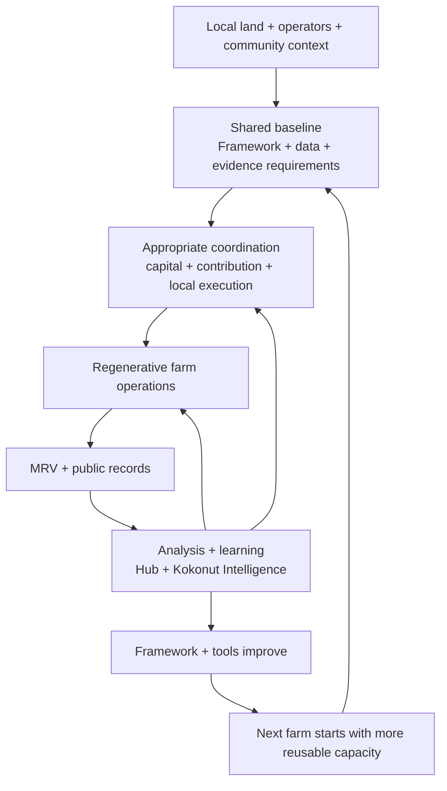

# Build a network where each regenerative farm makes the next one easier to start, operate, verify, and improve.

Kokonut's vision is not simply to operate more farms.

It is to build **shared coordination infrastructure for locally rooted regenerative agriculture**: farms that can remain different in ecology, ownership, operators, markets, and community priorities while still benefiting from common standards, public evidence, reusable tools, and interoperable governance.

[Adelphi](/ecosystem-wiki/kokonut-farms/adelphi/summary) is the first live reference implementation.

The long-term ambition is to move from **one working farm → multiple locally adapted farms → an open body of regenerative infrastructure that communities can reuse without depending on Kokonut Network as a central operator for every decision.**

<CardGroup cols={2}>
  <Card title="See the live starting point" icon="seedling" href="/ecosystem-wiki/kokonut-farms/adelphi/summary">
    Adelphi is where the vision is currently being tested through real land, operators, infrastructure, MRV, governance, and public records.
  </Card>

  <Card title="See how the system works today" icon="shield-check" href="/ecosystem-wiki/kokonut-101/solution">
    Review the current coordination architecture before reading the longer-term direction.
  </Card>
</CardGroup>

<Info>
  **This page describes direction, not guaranteed outcomes.** Some components are live, some are evolving, some are in development, and some remain long-term aspirations that must be tested through additional farms.
</Info>

---

## The North Star

Kokonut is building toward six qualities that should become stronger as the network grows.

<CardGroup cols={2}>
  <Card title="Healthier land" icon="seedling">
    Farm systems should improve soil, biodiversity, water stewardship, biomass cycling, and long-term ecological resilience rather than treating land as a disposable input.
  </Card>

  <Card title="Stronger local agency" icon="people-group">
    Local operators and communities should have meaningful roles in decisions, work, knowledge, and value creation instead of becoming passive recipients of an external model.
  </Card>

  <Card title="Plural coordination" icon="diagram-project">
    Capital, contribution, farm operations, methodology, evidence, and technical infrastructure should use the coordination mechanisms appropriate to each responsibility.
  </Card>

  <Card title="Inspectable evidence" icon="magnifying-glass-chart">
    Important claims about farms, funding, impact, harvests, and progress should become easier to inspect through structured records and public evidence.
  </Card>

  <Card title="Reusable infrastructure" icon="puzzle">
    New farms should be able to reuse data structures, development phases, MRV methods, software, governance patterns, and lessons without starting from zero.
  </Card>

  <Card title="Durable local value" icon="arrows-rotate">
    Productive farms should create conditions for recurring food, income, skills, infrastructure, ecological value, and community capacity rather than depending only on one grant cycle.
  </Card>
</CardGroup>

> **The vision is interoperability without uniformity: shared infrastructure where it helps, local autonomy where context matters.**

---

## What should scale — and what should stay local

Kokonut does not aim to scale every part of a farm in the same way.

| Should become more reusable across farms | Should remain locally determined |
| --- | --- |
| Common Data Schema | Crop mix |
| Development phases | Planting design |
| MRV record structures | Agronomic decisions |
| Evidence and provenance standards | Labor arrangements |
| Governance templates and proposal patterns | Local leadership |
| Reporting conventions | Community priorities |
| Open-source software and analytics | Market relationships |
| Lessons from previous implementations | Regulatory adaptation |
| Risk and forecast discipline | Cultural practices |
| Contributor and review workflows | Day-to-day farm management |

This distinction is central to the vision.

A network becomes more useful when **knowledge travels**, not when every farm becomes a copy of the first one.

---

## The vision in one loop

```mermaid
flowchart TD
    A["Local land + operators + community context"]
    B["Shared baseline<br/>Framework + data + evidence requirements"]
    C["Appropriate coordination<br/>capital + contribution + local execution"]
    D["Regenerative farm operations"]
    E["MRV + public records"]
    F["Analysis + learning<br/>Hub + Kokonut Intelligence"]
    G["Framework + tools improve"]
    H["Next farm starts with more reusable capacity"]

    A --> B
    B --> C
    C --> D
    D --> E
    E --> F
    F --> G
    G --> H
    H --> B

    F --> D
    F --> C
```

The loop is intentionally different from a centralized expansion model.

Kokonut's goal is not for one organization to control a growing portfolio of identical farms.

The goal is for each implementation to contribute **evidence, methods, tools, and lessons** that reduce coordination friction for the next one.

---

## Today: Adelphi is the reference implementation

[Adelphi](/ecosystem-wiki/kokonut-farms/adelphi/summary) in Gonzalo, Monte Plata, Dominican Republic is where the current architecture meets reality.

<CardGroup cols={4}>
  <Card title="15,725 m²" icon="map">
    Documented total mapped area.
  </Card>

  <Card title="13,838 m²" icon="seedling">
    Documented agricultural area.
  </Card>

  <Card title="7 jobs" icon="people-group">
    Jobs supported in the documented implementation.
  </Card>

  <Card title="110 hens" icon="egg">
    Documented free-range poultry component.
  </Card>
</CardGroup>

Adelphi currently gives Kokonut a place to test and improve:

- farm onboarding;
- funded infrastructure;
- syntropic and regenerative practices;
- local operations;
- community programming;
- crop and harvest records;
- forecasts versus actual outcomes;
- MRV methods;
- public reporting;
- governance interfaces;
- reusable documentation.

<Note>
  Adelphi is evidence that these components can coexist in one working context. It does **not** prove that every future farm will produce the same economics, ecological outcomes, community effects, or governance dynamics.
</Note>

<Frame>
  
  
</Frame>

---

## Next: prove that the model can move beyond one farm

The next important test is not a bigger diagram or a more advanced token model.

It is **whether the shared infrastructure works for a second real farm**.

The Regenerative Finance Playbook documents **Kokonut Terra Viva** as the next replication case: roughly **50,000 m²** of adjacent land under agreement and entering **Phase I — Planning & Preparation**.

That makes Terra Viva important for a different reason than Adelphi.

Adelphi asks:

> Can the pieces work together in one real farm?

Terra Viva asks:

> Can the lessons, data structures, governance patterns, and Framework move into another implementation without simply copying Adelphi?

<CardGroup cols={2}>
  <Card title="Reference #1 — Adelphi" icon="seedling" href="/ecosystem-wiki/kokonut-farms/adelphi/summary">
    Establish the first working context and generate operational lessons.
  </Card>

  <Card title="Replication test — Terra Viva" icon="diagram-project" href="/playbooks/regenerative-finance/case-studies">
    Test whether the Framework and shared infrastructure reduce friction when a second farm enters the system.
  </Card>
</CardGroup>

<Warning>
  Terra Viva should be treated according to its documented maturity. Phase I planning and a land agreement are not the same as an operating farm, realized production, or proven multi-farm scalability.
</Warning>

---

## The long-term direction

If the first and second implementations generate useful evidence, the network can progressively test larger ambitions.

<Steps>
  <Step title="1. Strengthen the first reference farm" icon="seedling" iconType="regular">
    Improve Adelphi's operations, harvest actuals, infrastructure, MRV coverage, public records, community programs, and forecast reconciliation.
  </Step>

  <Step title="2. Test replication with another farm" icon="diagram-project" iconType="regular">
    Use Terra Viva and future projects to discover which parts of the Framework are genuinely reusable and which need local adaptation.
  </Step>

  <Step title="3. Build multi-farm learning infrastructure" icon="database" iconType="regular">
    Improve shared data, comparison, reporting, Kokonut Intelligence, contributor workflows, and evidence quality across more than one implementation.
  </Step>

  <Step title="4. Reduce dependence on central coordination" icon="network-wired" iconType="regular">
    Make templates, standards, tooling, documentation, and governance patterns reusable enough that aligned communities can operate with increasing autonomy.
  </Step>

  <Step title="5. Move toward open regenerative infrastructure" icon="globe" iconType="regular">
    The long-term aspiration is an ecosystem where communities can adopt useful Kokonut primitives without requiring Kokonut Network to directly operate every farm or control every local decision.
  </Step>
</Steps>

The farther the horizon, the more it should be treated as an aspiration to test rather than a current capability.

---

## A network of coordination systems, not one super-DAO

The vision depends on avoiding a common scaling mistake: assuming one governance system should become more powerful as the ecosystem becomes more complex.

Kokonut takes the opposite direction.

As the network grows, responsibilities should remain distinguishable.

<CardGroup cols={2}>
  <Card title="Capital governance" icon="building-columns" href="/ecosystem-wiki/the-kokonut-dao/kokonut-moloch-dao">
    The Moloch DAO can coordinate treasury-level capital decisions and member protections.
  </Card>

  <Card title="Contribution coordination" icon="users" href="/ecosystem-wiki/the-kokonut-dao/kokonut-guilds-dao">
    Guilds can coordinate specialized work, reputation, review, and contributor pathways.
  </Card>

  <Card title="Local operations" icon="tractor">
    Farm operators should retain responsibility for real-world agricultural execution and local relationships.
  </Card>

  <Card title="Shared methodology" icon="puzzle" href="/kokonut-framework/Introduction">
    The Framework can carry common standards without replacing local implementation choices.
  </Card>

  <Card title="Evidence systems" icon="badge-check" href="/ecosystem-wiki/kokonut-farms/measurement-reporting-and-verification">
    MRV can make important claims easier to inspect without pretending every measurement is self-interpreting.
  </Card>

  <Card title="Intelligence infrastructure" icon="brain-circuit" href="/kokonut-intelligence">
    Data and analytical tools can improve decisions without becoming the authority over farmers, contributors, or governance.
  </Card>
</CardGroup>

> **A larger ecosystem should become more interoperable, not necessarily more centralized.**

---

## The role of technology in the vision

Technology matters because coordination can become expensive as more farms, contributors, records, and governance processes are added.

But technology is useful only when it reduces real friction.

### Blockchain can help with

- treasury governance;
- membership and proposal records;
- attestations;
- provenance;
- public verification;
- inspectable coordination rules.

### Kokonut Intelligence can help with

- integrating structured records;
- comparing farms and periods;
- data-quality checks;
- research and synthesis;
- reporting;
- forecasts and scenarios;
- decision support.

### AI agents may help with

- repetitive MRV preparation;
- forecast-vs-actual checks;
- proposal formatting;
- data-quality monitoring;
- evidence packaging;
- recurring analytical workflows.

<Note>
  **Technology supports the network; it does not become the network.** Farmers, communities, agronomists, contributors, reviewers, and governance participants remain responsible for the judgments that affect land, people, money, and public claims.
</Note>

---

## What community ownership means in this vision

"Community ownership" should not be treated as a slogan or a claim that every participant owns every asset.

In Kokonut's long-term direction, it means creating stronger pathways for people who contribute to the ecosystem to participate in the systems that affect them.

That can include:

- locally held or locally stewarded land;
- women-led farm ownership and operations;
- capital membership through the appropriate governance process;
- contribution-based standing through Guild work;
- transparent economic arrangements;
- public-goods allocation;
- community participation in farm programs;
- access to shared knowledge and infrastructure.

The exact ownership and governance structure can differ by farm.

<Warning>
  Ownership rights, economic rights, land title, governance rights, contributor reputation, and community benefit are different concepts. They should not be collapsed into one claim.
</Warning>

---

## What success should be measured by

The vision becomes credible only if it can be evaluated.

Kokonut should be able to ask whether growth is improving several forms of capacity at once.

| Dimension | Questions that matter |
| --- | --- |
| **Ecological** | Is soil, biodiversity, vegetation, water stewardship, and land condition improving according to appropriate evidence? |
| **Agricultural** | Are farms producing reliably, learning from losses, and improving operations over time? |
| **Economic** | Are realized revenues, costs, jobs, market relationships, and reinvestment becoming more durable? |
| **Community** | Are local operators and participants gaining useful skills, opportunities, infrastructure, and decision-making capacity? |
| **Governance** | Are decisions understandable, reviewable, appropriately scoped, and protected against unnecessary concentration? |
| **Evidence** | Are claims increasingly supported by timely, structured, reviewable records? |
| **Replication** | Does each new farm require less reinvention while preserving local adaptation? |
| **Open infrastructure** | Can useful parts of the system be reused outside the original team? |

Success is therefore not simply:

**more farms = success.**

A network could grow in farm count while becoming ecologically weak, financially fragile, centralized, opaque, or disconnected from local operators.

The vision is for growth in **quality, evidence, autonomy, and reusable capacity** alongside scale.

---

## What this vision does not require

<CardGroup cols={2}>
  <Card title="Not identical farms" icon="leaf">
    Different farms can use shared standards while choosing different crops, practices, markets, governance arrangements, and community priorities.
  </Card>

  <Card title="Not one DAO controlling everything" icon="diagram-project">
    Capital governance is one layer among several, not a universal operating authority.
  </Card>

  <Card title="Not blockchain for every action" icon="link">
    Use on-chain systems where public coordination, execution rules, or provenance benefit from them; keep ordinary farm operations off-chain when that is more practical.
  </Card>

  <Card title="Not AI replacing local knowledge" icon="robot">
    Automation should reduce repetitive coordination work, not displace agronomic judgment, human review, or community relationships.
  </Card>

  <Card title="Not guaranteed economics" icon="calculator">
    A shared Framework cannot eliminate weather, market, operational, governance, or financial risk.
  </Card>

  <Card title="Not dependence on Kokonut forever" icon="unlock">
    The strongest long-term outcome would be infrastructure useful enough that aligned communities can increasingly operate without central dependence.
  </Card>
</CardGroup>

---

## Why the vision is worth testing

The vision does not need to be fully proven today to be useful.

It needs to generate testable questions.

<CardGroup cols={2}>
  <Card title="Can one farm become a reliable reference?" icon="seedling" href="/ecosystem-wiki/kokonut-farms/adelphi/summary">
    Adelphi is producing the first operational answer.
  </Card>

  <Card title="Can a second farm reuse the infrastructure?" icon="diagram-project" href="/playbooks/regenerative-finance/case-studies">
    Terra Viva is positioned as the next replication test.
  </Card>

  <Card title="Can evidence improve coordination?" icon="magnifying-glass-chart" href="/ecosystem-wiki/kokonut-farms/measurement-reporting-and-verification">
    MRV and public records test whether participants can make decisions from stronger evidence.
  </Card>

  <Card title="Can the system become less dependent on its founders?" icon="network-wired">
    Open standards, documentation, contributor pathways, and reusable infrastructure are the long-term test of decentralization.
  </Card>
</CardGroup>

> **The North Star is not a giant farm organization. It is a growing commons of regenerative knowledge, evidence, coordination patterns, and open infrastructure anchored in locally operated farms.**

---

## Continue Kokonut 101

<CardGroup cols={2}>
  <Card title="Next: The Kokonut Manifesto" icon="scroll-old" href="/ecosystem-wiki/kokonut-101/manifesto">
    Read the values and commitments that should constrain how this vision is pursued.
  </Card>

  <Card title="Review the Solution" icon="shield-check" href="/ecosystem-wiki/kokonut-101/solution">
    Return to the current coordination architecture and its live, evolving, and developing components.
  </Card>

  <Card title="Explore the Framework" icon="puzzle" href="/kokonut-framework/Introduction">
    See the shared standards intended to carry learning from one farm into the next.
  </Card>

  <Card title="Inspect Adelphi" icon="seedling" href="https://hub.kokonut.network/projects/41">
    Compare the long-term vision against the public records of the first live implementation.
  </Card>
</CardGroup>
