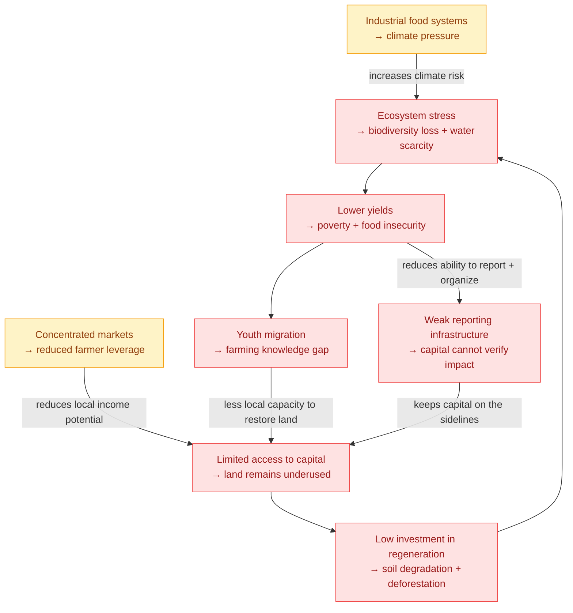

# The problem is not the land. It is the coordination layer around it.

Grassroots farmers already have land, knowledge, labor, and demand for the crops they grow. What they often lack is access to capital, transparent governance, reliable market participation, and the verification infrastructure needed to prove impact.

Kokonut Network starts from one core diagnosis:

> **The agricultural funding gap is a coordination failure — not an agronomic failure.**

The land can produce. Syntropic farming works. Communities know how to care for place. But without a trusted way to connect capital to productive land and returns to the communities that tend it, farmers remain trapped in low-income, extractive systems.

  <a href="/ecosystem-wiki/kokonut-101/solution" style={{ display: "inline-flex", alignItems: "center", gap: "6px", background: "#009F4D", color: "#fff", padding: "10px 20px", borderRadius: "8px", fontWeight: "600", fontSize: "14px", textDecoration: "none" }}>
    See the Kokonut Solution →
  </a>

  <a href="/ecosystem-wiki/kokonut-farms/adelphi/problem-and-solution" style={{ display: "inline-flex", alignItems: "center", gap: "6px", border: "1.5px solid #009F4D", color: "#009F4D", padding: "10px 20px", borderRadius: "8px", fontWeight: "600", fontSize: "14px", textDecoration: "none", background: "transparent" }}>
    See the Problem at Adelphi
  </a>

  Read the global problem first, then inspect how it appears at the farm level in Monte Plata, Dominican Republic.

---

## The funding gap that traps farmers in poverty

A global crisis revolves around insufficient funding for agricultural projects — and its consequences cascade far beyond any single farm.

Grassroots farmers who grow some of the world's most vital crops operate without the capital, coordination tools, or governance structures needed to compete. Many agricultural communities perform the labor that sustains food systems while remaining excluded from the ownership, infrastructure, and market upside those systems generate.

Most of the labor in agricultural communities is executed by people trapped in poverty — not because the land is unproductive, but because there is no accessible path from productive land to sustainable income.

  
The core problem

  

    Grassroots farmers lack the processes, knowledge, funding, and coordination infrastructure necessary to compete with corporate supply chains that capture most of the value from the crops farmers produce.
  

The coconut market clearly shows the pattern. Coconut is a high-utility crop with global demand across food, beverage, oil, fiber, fertilizer, and construction inputs. But the value created by coconut farming is often captured by processing, distribution, and retail layers far away from the communities doing the farming.

That is not a farming problem. It is a coordination problem.

---

## Why existing solutions do not work

The funding gap is not new. It has persisted because the available mechanisms to close it are structurally mismatched with what grassroots farmers actually need.

<CardGroup cols={3}>
  <Card title="Traditional agricultural finance" icon="building-columns">
    Banks and formal lenders usually require collateral, credit history, and institutional relationships that subsistence and small-scale farmers rarely have. The farmers most capable of producing regenerative, high-quality crops are often excluded from the capital systems that could help them scale.
  </Card>

  <Card title="NGO and grant cycles" icon="file-invoice-dollar">
    Grants can fund a planting cycle or infrastructure purchase, but they rarely create perpetual governance, monitoring, and revenue distribution systems. When the grant ends, the funding relationship ends with it.
  </Card>

  <Card title="Corporate supply chains" icon="industry">
    Corporate buyers control processing, distribution, pricing, and market access. Farmers supply the crop but do not own the upside, leaving them exposed to commodity price swings and weak negotiating power.
  </Card>
</CardGroup>

The result is a trust gap:

- Capital exists, but it does not know which farms to trust.
- Productive land exists, but it cannot access patient, transparent funding.
- Farmers have knowledge, but they lack governance and reporting infrastructure.
- Communities need food and income, but value is extracted upward.
- Regeneration is possible, but the financial incentives still reward short-term extraction.

<Note>
  The missing piece is a mechanism that allows capital to flow to productive land, verifies what happens on that land, and returns value to the farmers and communities doing the work.
</Note>

---

## The local reality

The global problem manifests at the community level, where undercapitalized farmers are asked to compete with extractive markets.

In the communities where Kokonut Network works — including the rural areas of Monte Plata, Dominican Republic, where our flagship [Adelphi Farm](/ecosystem-wiki/kokonut-farms/adelphi/summary) operates — residents face a compounding set of pressures.

<CardGroup cols={2}>
  <Card title="Limited employment" icon="briefcase">
    Rural residents often need to migrate to cities for income. That migration weakens local labor capacity, raises the cost of living, and makes it harder for families to invest back into the land they already own.
  </Card>

  <Card title="Food insecurity" icon="wheat-awn">
    Fertile land can sit underused while communities depend on imported or processed products that are more expensive and less nutritious than what local farms could produce.
  </Card>

  <Card title="Environmental degradation" icon="tree">
    Without incentives to protect land, short-term survival can push communities toward deforestation, soil depletion, and extractive crop cycles that reduce fertility over time.
  </Card>

  <Card title="Gender inequality" icon="venus">
    Women in rural agricultural communities often face legal, cultural, and financial barriers to land ownership, access to credit, and leadership roles — despite being central knowledge holders and operators.
  </Card>

  <Card title="Knowledge loss" icon="people-arrows">
    Younger generations raised away from agriculture lose the practical knowledge their grandparents carried. When that knowledge is not transferred, the community's relationship to the land weakens.
  </Card>

  <Card title="No trusted reporting layer" icon="clipboard-check">
    Even when regenerative work is happening, farmers rarely have the tools to prove it through standardized data, MRV records, or public impact reporting.
  </Card>
</CardGroup>

---

## The consequence cycle

These pressures do not operate in isolation. They reinforce each other.

Regenerative agriculture — specifically, [syntropic farming](/kokonut-framework/why-syntropic-farming) — can break this cycle by design. Syntropic farms improve soil with each season, reduce dependence on synthetic inputs, and generate multiple revenue streams across short-, medium-, and long-term crop cycles.

But agronomy alone is not enough.

The farming method exists. The missing layer is coordination: funding, governance, measurement, verification, and revenue distribution.

---

## What this looks like at Adelphi

Adelphi makes the global problem visible at the farm level.

  

    
15,725

    
m² total area

  

  

    
13,838

    
m² agricultural

  

  

    
7

    
jobs supported

  

  

    
110

    
free-range hens

  

  

    
5

    
UN SDGs addressed

  

  

    
PN #69

    
public goods funded

  

At Adelphi, the abstract problem becomes concrete:

- A women-led farm had land and vision, but needed funding and infrastructure.
- The surrounding community needed income, access to food, education, and safe gathering spaces.
- The land needed regenerative investment, biodiversity restoration, water systems, and long-term soil care.
- The project needed a way to prove activity, report impact, and remain accountable to contributors.

Public Nouns Proposal #69 helped fund Adelphi's critical infrastructure. Kokonut's role is to turn that one successful intervention into a repeatable model: DAO-funded capital deployment, Framework-standardized operations, public MRV records, and revenue allocation that keeps value circulating through the community.

[Read the Adelphi problem and solution →](/ecosystem-wiki/kokonut-farms/adelphi/problem-and-solution)

---

## In our own words

<iframe src="https://www.youtube.com/embed/ZjygLVUSq4s" title="Kokonut Network — The Problem" frameborder="0" className="w-full aspect-video rounded-xl" allow="accelerometer; autoplay; clipboard-write; encrypted-media; gyroscope; picture-in-picture; web-share" allowfullscreen />

---

## What has been missing

The problem is well understood. The world does not need another abstract call for sustainability.

What has been missing is a mechanism that is:

<CardGroup cols={2}>
  <Card title="Transparent" icon="eye">
    Anyone can inspect the farm data, governance process, treasury activity, and impact records.
  </Card>

  <Card title="Perpetual" icon="arrows-rotate">
    The model does not expire when a grant ends. Trees are replanted, revenue cycles continue, and the cooperative keeps operating.
  </Card>

  <Card title="Community-governed" icon="people-group">
    The people funding, building, farming, and maintaining the system participate through DAO governance, Guilds, and documented contribution pathways.
  </Card>

  <Card title="Verifiable" icon="badge-check">
    MRV submissions, harvest milestones, funding approvals, and impact reports can become public, tamper-resistant records.
  </Card>
</CardGroup>

That mechanism is what Kokonut Network is building.

---

## Next: how Kokonut closes the gap

The solution is already in motion at Adelphi. The next step is replication — applying the same Framework to the next farm, and the one after that, until the network becomes self-sustaining at scale.

<CardGroup cols={2}>
  <Card title="Our Solution" icon="shield-check" href="/ecosystem-wiki/kokonut-101/solution">
    How blockchain coordination, the Kokonut Framework, and the DAO treasury close the funding gap — and why the model has no expiration date.
  </Card>

  <Card title="Adelphi Farm" icon="seedling" href="/ecosystem-wiki/kokonut-farms/adelphi/problem-and-solution">
    See the seven specific local problems this model addresses at the farm level — and the solutions already in operation.
  </Card>

  <Card title="Why Syntropic Farming" icon="hand-holding-seedling" href="/kokonut-framework/why-syntropic-farming">
    The agronomic case for syntropic farming is that it breaks the cycle of deforestation and soil depletion.
  </Card>

  <Card title="Open Collaboration" icon="telescope" href="/ecosystem-wiki/open-collaboration-invitation">
    The problem is solvable. Read how agronomists, developers, researchers, and capital allocators can contribute.
  </Card>
</CardGroup>

  <a href="/ecosystem-wiki/kokonut-101/solution" style={{ display: "inline-flex", alignItems: "center", gap: "6px", background: "#009F4D", color: "#fff", padding: "10px 20px", borderRadius: "8px", fontWeight: "600", fontSize: "14px", textDecoration: "none" }}>
    Continue to the Solution →
  </a>

  <a href="https://link.kokonut.network/discord" style={{ display: "inline-flex", alignItems: "center", gap: "6px", border: "1.5px solid #009F4D", color: "#009F4D", padding: "10px 20px", borderRadius: "8px", fontWeight: "600", fontSize: "14px", textDecoration: "none", background: "transparent" }}>
    Join the Community
  </a>

