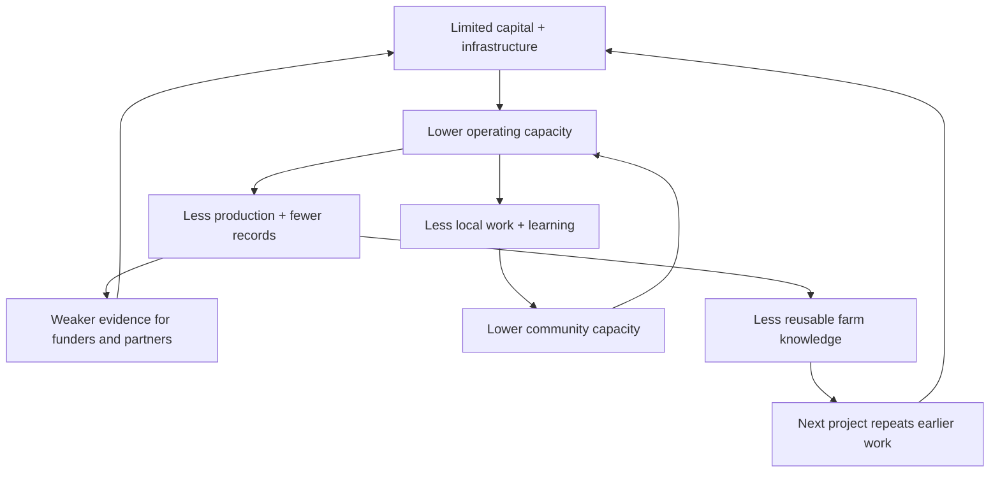

# The land can be productive while the system around it still fails.

Kokonut Network begins with a specific diagnosis:

> **Many regenerative agriculture projects are constrained not only by agronomy, but by the coordination layer around the farm.**

Land, knowledge, labor, capital, infrastructure, market access, evidence, governance, and community participation all have to connect well enough for a farm to become durable.

When those pieces remain fragmented, productive land can stay underused, good work can remain underfunded, impact can be difficult to verify, and communities can struggle to retain the value they help create.

<CardGroup cols={2}>
  <Card title="See the problem at Adelphi" icon="seedling" href="/ecosystem-wiki/kokonut-farms/adelphi/problem-and-solution">
    Move from the general coordination problem to the documented local conditions surrounding Kokonut's first live farm.
  </Card>

  <Card title="See how Kokonut responds" icon="shield-check" href="/ecosystem-wiki/kokonut-101/solution">
    Continue to the coordination systems Kokonut is building around capital, contribution, farm operations, evidence, and shared infrastructure.
  </Card>
</CardGroup>

<Info>
  This page explains **Kokonut's problem model**. It does not claim that every farmer, farm, country, or agricultural market faces the same conditions. Local diagnosis must come before local implementation.
</Info>

---

## The problem is fragmentation

A farm is not only land plus crops.

A functioning regenerative farm may depend on several systems working together:

- land access and stewardship;
- patient capital and physical infrastructure;
- agricultural knowledge and local operators;
- market participation and revenue pathways;
- reliable records and impact evidence;
- governance and accountability;
- community participation;
- long-term learning and maintenance.

Kokonut is designed around the gaps that appear **between** those systems.

<CardGroup cols={2}>
  <Card title="Capital gap" icon="building-columns">
    Productive land can exist without the financing needed for water systems, soil preparation, tools, planting, infrastructure, labor, and early operating costs.
  </Card>

  <Card title="Infrastructure gap" icon="hammer">
    Funding a farm is not only funding seeds. Durable production requires physical systems, operating capacity, maintenance, and local execution.
  </Card>

  <Card title="Evidence gap" icon="clipboard-check">
    Useful work can be difficult for outside contributors, funders, researchers, or governance participants to evaluate when farm activity is not recorded in a consistent and inspectable way.
  </Card>

  <Card title="Participation gap" icon="people-group">
    Capital providers, farm operators, researchers, builders, and local communities contribute different forms of value, but a single governance mechanism rarely represents all of them well.
  </Card>

  <Card title="Market and value gap" icon="chart-line">
    Growing a crop does not automatically create strong market access, bargaining power, processing capacity, or durable local value capture.
  </Card>

  <Card title="Learning gap" icon="arrows-rotate">
    Without reusable documentation, data structures, and feedback loops, each new farm can be forced to rebuild knowledge that another farm has already created.
  </Card>
</CardGroup>

The coordination problem is therefore broader than "farmers need money."

Capital matters, but capital without execution, evidence, local knowledge, governance, and operating systems can still fail to produce durable outcomes.

---

## Why capital alone is not enough

The Adelphi story makes this distinction concrete.

Yanny and Neury Hernández had land, a relationship to place, and a vision for a productive farm. The documented barrier was not simply whether the land could grow food. Turning that land into an operating project required soil preparation, water systems, planting, tools, infrastructure, and early operating support.

[Public Nouns Proposal #69](https://publicnouns.wtf/vote/69) helped fund critical infrastructure at Adelphi.

But the long-term problem does not end when capital arrives.

A funded farm still needs:

1. people who can operate it;
2. methods appropriate to the local ecology;
3. records that show what happened;
4. governance for shared resources and decisions;
5. market pathways for what the farm produces;
6. maintenance and adaptation over time;
7. a way to turn lessons into reusable knowledge.

<Note>
  **Funding is an input, not the entire solution.** Kokonut's thesis is that regenerative agriculture becomes easier to finance and replicate when capital is connected to operations, evidence, governance, contribution, and learning.
</Note>

---

## The trust and evidence problem

Agricultural work happens in the physical world.

That creates an information gap between the people doing the work and people who may be supporting, funding, governing, researching, or learning from it.

Without a reliable evidence layer, questions become difficult to answer:

- Was infrastructure actually installed?
- What was planted?
- What survived?
- What was harvested?
- What activities took place?
- What environmental conditions changed?
- Which outcomes are measured and which are forecasts?
- Who contributed to the work?
- Which claims can be independently inspected?

Kokonut treats this as a core coordination problem rather than a reporting task added at the end.

The [MRV methodology](/ecosystem-wiki/kokonut-farms/measurement-reporting-and-verification) is intended to turn farm activity into structured evidence through field records, remote sensing, soil observations, harvest data, GPS records, attestations, and public project information.

> **Evidence should reduce the amount of trust a participant has to place in a narrative alone.**

That does not mean every record is automatically correct or complete. Data quality, review, timing, methodology, and local interpretation still matter.

---

## The governance problem is not solved by one DAO

Agricultural ecosystems contain different kinds of responsibility.

The person deciding how to irrigate a crop is solving a different problem from the person approving a treasury proposal. A researcher validating an MRV methodology is doing different work from a contributor writing software or a farmer managing soil.

Trying to force all of those decisions through one governance mechanism creates another coordination problem.

Kokonut therefore distinguishes several domains:

| Domain | What needs coordination |
| --- | --- |
| **Capital** | Funding, treasury decisions, membership, proposals, execution, and financial protections |
| **Contribution** | Work, domain expertise, reputation, bounties, review, and contributor recognition |
| **Farm operations** | Agronomy, planting, irrigation, maintenance, harvests, labor, and local execution |
| **Methodology** | Shared development phases, data structures, regenerative principles, and impact methods |
| **Evidence** | Records, verification, provenance, review, and public reporting |
| **Technical infrastructure** | Data systems, analytics, automation, integrations, and developer tooling |

The problem is not "we need one better DAO."

The problem is **how to make these different systems interoperable without pretending they are the same thing.**

[See the current governance layers →](/ecosystem-wiki/the-kokonut-dao/dao-layers)

---

## The replication problem

A single successful farm is useful.

A repeatable learning system is more valuable.

Without common structures, a second farm may have to rediscover:

- what information should be collected before funding;
- how development phases should be documented;
- what farm records need to be preserved;
- how forecasts should be separated from actuals;
- how evidence should be reviewed;
- how contributors interact with farm operators;
- how governance decisions connect to real-world execution.

This is why Kokonut treats the [Kokonut Framework](/kokonut-framework/Introduction) as shared infrastructure rather than a rigid farm template.

The goal is to make knowledge portable **without making farms identical**.

<Note>
  Replication should preserve local adaptation. Ecology, culture, operators, crop choices, markets, regulation, and community priorities can differ from one farm to another.
</Note>

---

## What the problem looks like locally at Adelphi

The repository documents a more specific set of challenges around Adelphi and the surrounding community in Gonzalo, Monte Plata.

The [Adelphi Problem & Solution](/ecosystem-wiki/kokonut-farms/adelphi/problem-and-solution) page describes seven local areas the project is designed to address:

<CardGroup cols={2}>
  <Card title="Limited employment" icon="briefcase">
    The project is designed to create productive work that can exist within the local community rather than requiring every income opportunity to come from elsewhere.
  </Card>

  <Card title="Regenerative education" icon="seedling">
    Adelphi is designed as a place where practical syntropic farming, organic inputs, soil regeneration, and farm-data practices can be learned through direct participation.
  </Card>

  <Card title="Food access" icon="wheat-awn">
    The diversified farm system is designed to produce fresh local crops and poultry products across different production cycles.
  </Card>

  <Card title="Land regeneration" icon="tree">
    Syntropic farming, agroforestry, organic inputs, biochar, ground cover, and native-species propagation are used as alternatives to short-term extractive land use.
  </Card>

  <Card title="Knowledge continuity" icon="people-arrows">
    The farm creates a place where agricultural knowledge can be practiced, demonstrated, and transferred across generations.
  </Card>

  <Card title="Community space" icon="house">
    The farm and multipurpose gazebo provide physical infrastructure for workshops, meetings, meals, education, and community activity.
  </Card>

  <Card title="Women-led leadership" icon="venus">
    Adelphi is founded and operated by sisters Yanny and Neury Hernández, making women-led agricultural ownership and stewardship part of the project's documented model.
  </Card>

  <Card title="Public evidence" icon="magnifying-glass-chart">
    Farm records and MRV give contributors, partners, researchers, and governance participants a way to inspect activity beyond storytelling alone.
  </Card>
</CardGroup>

These are **Adelphi-specific problem areas** documented in the repository. They should not automatically be generalized to every future Kokonut farm.

---

## A reinforcing problem, not a single bottleneck

Kokonut's working model treats these gaps as connected.

```mermaid
flowchart TD
    A["Limited capital + infrastructure"] --> B["Lower operating capacity"]
    B --> C["Less production + fewer records"]
    C --> D["Weaker evidence for funders and partners"]
    D --> A

    B --> E["Less local work + learning"]
    E --> F["Lower community capacity"]
    F --> B

    C --> G["Less reusable farm knowledge"]
    G --> H["Next project repeats earlier work"]
    H --> A
```

This is intentionally a **coordination model**, not a universal causal law.

It illustrates the kind of reinforcing loop Kokonut is trying to interrupt:

**funding → execution → evidence → learning → better coordination**

rather than treating capital, farming, impact, and governance as separate projects.

---

## Where syntropic farming fits

Kokonut uses [syntropic farming](/kokonut-framework/why-syntropic-farming) as the agricultural foundation of the current model.

That matters because the coordination system should not be agnostic about what it funds. Kokonut is trying to support farms designed around soil protection, biodiversity, multi-strata production, biomass cycling, diversified crop timelines, and long-term stewardship.

But the agronomic method does not solve the entire coordination problem.

Syntropic farming does not automatically provide:

- financing;
- governance;
- market access;
- contribution systems;
- public evidence;
- data interoperability;
- documentation;
- technical infrastructure.

The farm method and the coordination layer solve different parts of the system.

---

## What this page does not claim

A useful problem statement should define its limits.

<CardGroup cols={2}>
  <Card title="Not every farmer has the same problem" icon="people-group">
    Capital, land tenure, markets, labor, infrastructure, policy, ecology, and community conditions vary by place.
  </Card>

  <Card title="Not every local claim is a global claim" icon="map">
    Conditions documented around Adelphi should not be presented as representative of every agricultural community.
  </Card>

  <Card title="Not every forecast is evidence" icon="calculator">
    Modeled production, revenue, carbon, biodiversity, or social outcomes remain projections until supported by measured results.
  </Card>

  <Card title="Not every problem belongs on-chain" icon="link">
    Blockchain can support governance and verification, but it does not replace agronomy, human relationships, local institutions, markets, or professional judgment.
  </Card>
</CardGroup>

This distinction matters because Kokonut's credibility depends on describing the problem as carefully as it describes the solution.

---

## The problem Kokonut chooses to solve

Kokonut is not attempting to solve every challenge in global agriculture.

It is building around a narrower question:

> **How can regenerative farms connect capital, local operators, contributors, shared standards, public evidence, and reusable infrastructure without surrendering local autonomy?**

That question creates the bridge to the next page.

<CardGroup cols={2}>
  <Card title="Next: The Kokonut Solution" icon="shield-check" href="/ecosystem-wiki/kokonut-101/solution">
    See how Kokonut separates capital governance, contributor coordination, farm operations, the Framework, MRV, and technical infrastructure.
  </Card>

  <Card title="Go deeper: Adelphi's local problem" icon="seedling" href="/ecosystem-wiki/kokonut-farms/adelphi/problem-and-solution">
    Examine the specific conditions, interventions, and evidence around Kokonut's first live reference farm.
  </Card>

  <Card title="Understand the farm method" icon="hand-holding-seedling" href="/kokonut-framework/why-syntropic-farming">
    See why Kokonut currently uses syntropic farming as its regenerative agricultural foundation.
  </Card>

  <Card title="Review the evidence layer" icon="magnifying-glass-chart" href="/ecosystem-wiki/kokonut-farms/measurement-reporting-and-verification">
    Understand how physical farm activity becomes structured and inspectable evidence.
  </Card>
</CardGroup>
