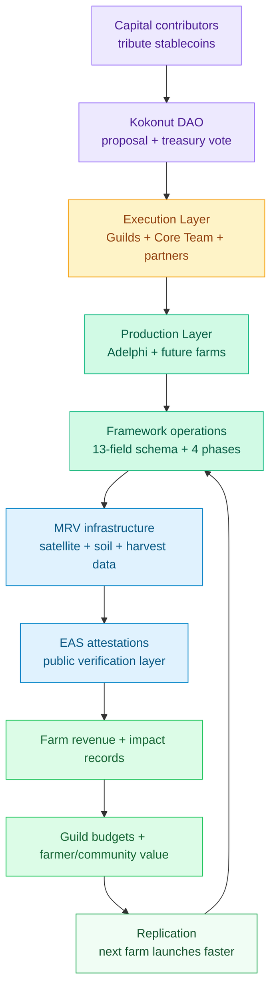

# Kokonut Network closes the agricultural coordination gap.

The [problem](/ecosystem-wiki/kokonut-101/problem) is not the land. It is the coordination layer around the land.

Grassroots farmers already have knowledge, labor, productive land, and demand for the crops they grow. What they often lack is access to patient capital, transparent governance, reliable reporting, and a way to prove impact. Kokonut Network solves this by connecting farms, contributors, DAO members, and verifiable data into one cooperative system.

> **The solution is a community-governed coordination stack for regenerative agriculture:** DAO capital funds farms, the Kokonut Framework standardizes operations, MRV verifies progress, and farm revenue helps fund the next cycle of work.

  <a href="#the-kokonut-solution-at-a-glance" style={{ display: "inline-flex", alignItems: "center", gap: "6px", background: "#009F4D", color: "#fff", padding: "10px 20px", borderRadius: "8px", fontWeight: "600", fontSize: "14px", textDecoration: "none" }}>
    See How It Works →
  </a>

  <a href="https://hub.kokonut.network/projects/41" style={{ display: "inline-flex", alignItems: "center", gap: "6px", border: "1.5px solid #009F4D", color: "#009F4D", padding: "10px 20px", borderRadius: "8px", fontWeight: "600", fontSize: "14px", textDecoration: "none", background: "transparent" }}>
    Explore Live Adelphi Data
  </a>

  Start with the mechanism, inspect the live proof, then choose whether to contribute, build, or join the DAO.

<Frame>
  
</Frame>

Blockchain open data and protocols replace the trust intermediaries that have historically excluded grassroots farmers from agricultural capital markets — making funding transparent, governance permissionless, and impact verifiable.

---

## The Kokonut solution at a glance

<CardGroup cols={2}>
  <Card title="Capital flows through the DAO" icon="hydra" href="/ecosystem-wiki/the-kokonut-dao/dao-layers">
    DAO members tribute stablecoins, receive \$vKKN governance tokens backed 1:1 by real coconut trees, and vote on funding, bounties, partnerships, and membership proposals.
  </Card>

  <Card title="Farms run the Framework" icon="puzzle" href="/kokonut-framework/Introduction">
    Every farm follows the Kokonut Framework: common data schema, four development phases, regeneration principles, MRV standards, and impact reporting.
  </Card>

  <Card title="MRV turns work into proof" icon="satellite" href="/ecosystem-wiki/kokonut-farms/measurement-reporting-and-verification">
    Satellite data, drone imagery, soil probes, community logs, harvest records, and EAS attestations make farm progress publicly auditable.
  </Card>

  <Card title="Revenue keeps the loop alive" icon="arrows-rotate">
    Farm revenue flows back to farmers, contributors, communities, and the DAO treasury — funding Guild work, infrastructure, and future farm replication.
  </Card>
</CardGroup>

<Note>
  Kokonut is not a grant program, a farm management company, or a corporate buyer. It is a cooperative coordination layer designed to make regenerative farms fundable, governable, and verifiable under a shared system.
</Note>

---

## The answer to each failure mode

The agricultural funding gap persists because existing systems fail at different points in the same cycle. Kokonut closes each failure mode with a specific mechanism.

| Failure mode | Why it fails | How Kokonut closes it |
| --- | --- | --- |
| **Traditional agricultural finance** | Requires collateral, credit history, and institutional relationships that many grassroots farmers do not have. | DAO tribute requires stablecoins, not traditional collateral. Members fund the treasury through proposals and receive \$vKKN governance tokens backed 1:1 by real coconut trees. |
| **NGO and grant models** | Funding is temporary. When the grant period ends, the coordination and reporting system usually ends with it. | Coconut trees are replanted when they end their productive life. The cooperative, revenue cycles, and contributor network continue beyond a single grant period. |
| **Corporate supply chains** | Value is extracted upward through processing, pricing, and distribution layers farmers do not own. | DAO members, Guild contributors, farmers, and communities participate in the upside. Rage-quit protects capital contributors; Guild Points and Loot create a contribution path without capital. |

This is the key shift: Kokonut not only funds farms. It changes who can coordinate, verify, govern, and benefit from the work.

---

## How the system flows

Capital and governance decisions flow downward from the DAO to farm operations. Farm data and impact records flow upward from the land to the verification layer. Revenue and contributor budgets keep the network operating without needing each farm to restart from zero.

---

## The four interlocking systems

Kokonut's solution is built on four systems that address different aspects of the coordination gap.

### 1. The Kokonut DAO — community-governed capital

The [Kokonut DAO](/ecosystem-wiki/the-kokonut-dao/dao-layers) is the network's treasury and governance engine. It operates on Gnosis Chain via the Moloch framework: no administrators, no unilateral control of the treasury, and stablecoin-based membership.

Members tribute stablecoins to the treasury and receive **\$vKKN** governance tokens backed 1:1 by real coconut trees. All major actions — farm funding, bounty payments, partner agreements, token minting, and treasury disbursements — require a passed on-chain proposal voted on by token holders.

**Rage-quit** protects capital contributors by allowing them to exit with their proportional share of the treasury before a proposal they disagree with is executed. Capital is not trapped. Minority holders are protected by design.

The [Kokonut Guilds](https://kokonut.network/ecosystem-wiki/the-kokonut-dao/kokonut-guilds-dao) extend participation to contributors who lack the capital to contribute. Six domain-specific bodies — Technology, Impact, Communications, Governance, Finance, and Community & Partnerships — operate through contribution-weighted Guild Points. Significant work can earn **Loot tokens**, creating an economic path into the network through verified contribution.

### 2. The Kokonut Framework — the standardized farm blueprint

The [Kokonut Framework](/kokonut-framework/Introduction) is the modular trust layer every farm runs on. It solves the replication problem: how do you fund, operate, monitor, and verify a second farm — or a hundredth — without rebuilding the governance and measurement infrastructure from scratch?

The answer is **standardization without rigidity**.

Every farm populates a [13-field Common Data Schema](/kokonut-framework/framework-components/common-data-schema) covering location, land size, crop mix, revenue streams, governance mechanism, token allocation, and public goods allocation. From there, each farm follows four development phases: Planning, Production, Consolidation, and continuous MRV.

This makes farms comparable, fundable, governable, and verifiable under the same system — while still allowing each farm to reflect its local ecology, community, crops, and operators.

### 3. Adelphi — live proof the model works

[Adelphi](/ecosystem-wiki/kokonut-farms/adelphi/summary) is Kokonut Network's first live syntropic farm in Gonzalo, Monte Plata, Dominican Republic. It is women-led, community-first, and publicly funded through [Public Nouns Proposal #69](https://publicnouns.wtf/vote/69).

  

    
15,725

    
m² total area

  

  

    
13,838

    
m² agricultural

  

  

    
7

    
jobs supported

  

  

    
110

    
free-range hens

  

  

    
5

    
UN SDGs addressed

  

  

    
PN #69

    
public goods funded

  

Adelphi demonstrates the solution simultaneously: DAO-funded capital deployment, Framework-standardized operations, satellite MRV, SDG-aligned impact tracking, and public goods allocation built into the model. Live farm records are available at [hub.kokonut.network/projects/41](https://hub.kokonut.network/projects/41).

### 4. The Agentic Marketplace — automation at scale

Manual MRV pipelines are a scaling bottleneck. Satellite passes, drone surveys, soil readings, harvest records, and field logs all need to be structured and verified as data before they can support governance, funding, and impact reporting.

The [Kokonut Agentic Marketplace](/kokonut-x-ai-agents) is the infrastructure layer being developed to remove this bottleneck. AI agents can support satellite MRV ingestion, vegetation-index calculation, Farm Registry API submissions, harvest forecasting, grant drafting, and EAS attestation workflows.

As the farm network scales, agents handle the repetitive data infrastructure tasks. Humans handle the land, relationships, community, and governance.

---

## What is live vs. what is being built

Transparency matters. Not every component is at the same maturity level.

| Component | Status | What it means |
| --- | --- | --- |
| **Adelphi Farm** | Live | Active syntropic farm in Monte Plata, Dominican Republic, with public records and ongoing operations. |
| **Kokonut DAO** | Live | Governance, treasury, membership, and rage-quit logic operate through deployed DAO architecture on Gnosis Chain. |
| **Kokonut Framework** | Live and evolving | The Framework is already deployed at Adelphi and is being improved as the repeatable farm blueprint. |
| **MRV \+ EAS pipeline** | Active and expanding | Satellite, soil, field, harvest, and impact records are used to make farm progress publicly verifiable. |
| **Agentic Marketplace** | In development | Automation layer for MRV, registry submissions, reporting, payments, and AI-supported operations. |
| **Future farm replication** | Next frontier | The next stage is applying the same Framework to more farms without rebuilding the stack each time. |

<Note>
  The solution is already real at the farm level. The scaling layer is what the community is now building: more standardized data, more automation, more contributors, and more farms entering the Framework.
</Note>

---

## The perpetual regenerative flywheel

<Frame>
  
</Frame>

The Kokonut Seeds mechanism is the financial engine that makes the model self-sustaining over time.

<Steps>
  <Step title="The farm produces revenue" icon="seedling" iconType="regular">
    Kokonut Seeds — the network's flagship farm-funding vehicle — generates revenue from syntropic crop production across short-, medium-, and long-cycle crops. Revenue is denominated in stablecoins and flows into the DAO treasury.
  </Step>
  <Step title="Treasury funds Guild work" icon="coins" iconType="regular">
    A portion of farm revenue is routed to the [Kokonut Guilds](/ecosystem-wiki/the-kokonut-dao/kokonut-guilds-dao) as a sustainable operational budget independent of external grants, investor rounds, or token sales.
  </Step>
  <Step title="Guilds build the network" icon="hammer" iconType="regular">
    Guild contributors earn Guild Points and may receive Loot tokens for significant work. They improve the Framework, MRV stack, data infrastructure, documentation, partnerships, and farm onboarding process.
  </Step>
  <Step title="More farms join the system" icon="chart-line" iconType="regular">
    Each new farm adds productive capacity, verified impact data, and potential revenue streams to the network. More farms create more data, more treasury activity, and more opportunities for contributors.
  </Step>
  <Step title="Trees are replanted" icon="recycle" iconType="regular">
    When coconut trees reach the end of their productive life, they are replanted. The production cycle restarts. The cooperative continues. The flywheel does not depend on a single grant cycle or harvest season.
  </Step>
</Steps>

> This is the core reason the Kokonut Framework matters: it turns one farm into a repeatable, self-reinforcing system for funding, operating, verifying, and expanding regenerative agriculture.

---

## Why is this credible

The strongest proof is that each part of the solution already appears in a working context.

<CardGroup cols={2}>
  <Card title="The farm is real" icon="seedling" href="/ecosystem-wiki/kokonut-farms/adelphi/summary">
    Adelphi is a live farm — not a whitepaper — with crops, hens, infrastructure, operators, MRV records, and public data.
  </Card>

  <Card title="The governance is inspectable" icon="shield-check" href="/ecosystem-wiki/the-kokonut-dao/kokonut-moloch-dao">
    DAO membership, treasury logic, token minting, proposal flow, and rage-quit protections are part of the deployed governance architecture.
  </Card>

  <Card title="The Framework is reusable" icon="puzzle" href="/kokonut-framework/Introduction">
    The same schema, phases, MRV standards, and impact measurement logic that govern Adelphi can govern future farms.
  </Card>

  <Card title="The data layer is public" icon="satellite" href="https://hub.kokonut.network/projects/41">
    Visitors can inspect live farm data rather than relying only on narrative claims or static reports.
  </Card>
</CardGroup>

---

## What this means in practice

At [Adelphi](/ecosystem-wiki/kokonut-farms/adelphi/summary) today:

- **Capital has been deployed** through public goods funding instead of a traditional bank loan, collateral requirement, or corporate intermediary.
- **Operations are standardized** through the Kokonut Framework across planning, production, consolidation, and continuous MRV.
- **Impact is measured** through satellite monitoring, field data, soil probes, harvest records, and per-plant geospatial tracking.
- **Impact is verifiable** through public records, on-chain EAS attestations, and live data at [hub.kokonut.network/projects/41](https://hub.kokonut.network/projects/41).
- **Community benefit is designed in** through women-led operations, local employment, biodiversity restoration, public goods allocation, and educational programming.
- **The next step is replication** — applying the same Framework to the next farm, and the one after that, until the network is self-sustaining at scale.

---

## Choose your next step

<CardGroup cols={2}>
  <Card title="Understand the DAO" icon="hydra" href="/ecosystem-wiki/the-kokonut-dao/dao-layers">
    Learn how the treasury, \$vKKN, Loot, rage-quit, Guilds, proposal flow, and governance layers work together.
  </Card>

  <Card title="Read the Framework" icon="puzzle" href="/kokonut-framework/Introduction">
    Explore the modular trust layer every Kokonut farm runs on — data schema, development phases, MRV methodology, and impact measurement.
  </Card>

  <Card title="Inspect Adelphi" icon="seedling" href="/ecosystem-wiki/kokonut-farms/adelphi/summary">
    See the live proof of concept — crops, harvest forecasts, MRV data, community impact, and SDG alignment.
  </Card>

  <Card title="Build with Kokonut" icon="code" href="/build-with-kokonut">
    Developers can use the public docs, deployed contracts, Farm Registry primitives, and agent architecture to build on the network.
  </Card>

  <Card title="Join Open Collaboration" icon="telescope" href="/ecosystem-wiki/open-collaboration-invitation">
    Agronomists, researchers, ReFi builders, developers, DAO members, and capital allocators can plug into the work already underway.
  </Card>

  <Card title="Return to the problem" icon="circle-info" href="/ecosystem-wiki/kokonut-101/problem">
    Review the funding and coordination failure that Kokonut Network was designed to solve.
  </Card>
</CardGroup>

  <a href="https://link.kokonut.network/discord" style={{ display: "inline-flex", alignItems: "center", gap: "6px", background: "#009F4D", color: "#fff", padding: "10px 20px", borderRadius: "8px", fontWeight: "600", fontSize: "14px", textDecoration: "none" }}>
    Join the Community →
  </a>

  <a href="https://link.kokonut.network/meeting" style={{ display: "inline-flex", alignItems: "center", gap: "6px", border: "1.5px solid #009F4D", color: "#009F4D", padding: "10px 20px", borderRadius: "8px", fontWeight: "600", fontSize: "14px", textDecoration: "none", background: "transparent" }}>
    Book a Walkthrough
  </a>

