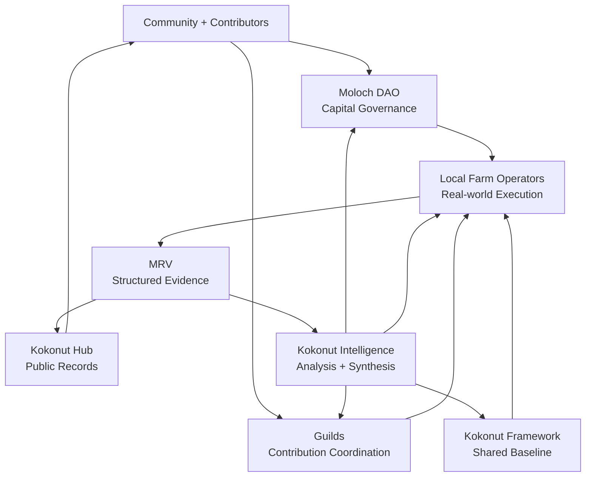
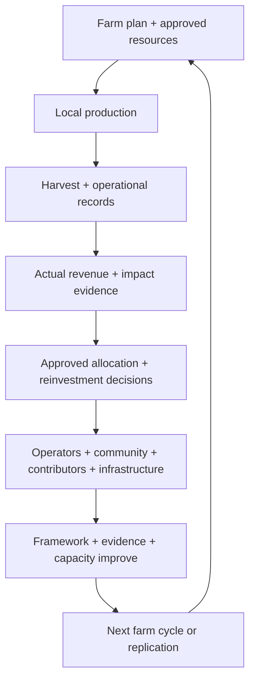

# Kokonut connects the systems a regenerative farm needs.

The [Problem Statement](/ecosystem-wiki/kokonut-101/problem) defines six coordination gaps around productive land: **capital, infrastructure, evidence, participation, markets and value, and learning**.

Kokonut's response is not one DAO, one token, one farm template, or one software platform.

> **The solution is an interoperable coordination system:** use the right mechanism for each responsibility, connect those mechanisms through shared standards and evidence, and let local farm operators remain responsible for the land.

[Adelphi](/ecosystem-wiki/kokonut-farms/adelphi/summary) is the first live reference implementation of that approach.

<CardGroup cols={2}>
  <Card title="Inspect the live reference farm" icon="seedling" href="https://hub.kokonut.network/projects/41">
    Start with Adelphi's public records and MRV activity before evaluating the broader coordination model.
  </Card>

  <Card title="See the coordination layers" icon="diagram-project" href="/ecosystem-wiki/the-kokonut-dao/dao-layers">
    Understand why capital governance, contribution coordination, farm operations, evidence, and infrastructure use different mechanisms.
  </Card>
</CardGroup>

<Info>
  **Kokonut is designed around separation of responsibility.** Shared infrastructure creates interoperability; it does not eliminate local judgment, agricultural risk, market risk, governance risk, or the need for human review.
</Info>

---

## The solution at a glance

<CardGroup cols={2}>
  <Card title="Moloch DAO — coordinate capital" icon="building-columns" href="/ecosystem-wiki/the-kokonut-dao/kokonut-moloch-dao">
    The live Moloch DAO on Gnosis Chain coordinates treasury membership, stablecoin capital, proposals, voting, execution, and rage-quit protections.
  </Card>

  <Card title="Guilds — coordinate contribution" icon="users" href="/ecosystem-wiki/the-kokonut-dao/kokonut-guilds-dao">
    Contributors coordinate domain work through Guild pathways so useful participation does not require entering through capital.
  </Card>

  <Card title="Framework — share a common baseline" icon="puzzle" href="/kokonut-framework/Introduction">
    Farms use shared data structures, development phases, regenerative principles, MRV expectations, and impact methods while adapting implementation locally.
  </Card>

  <Card title="Farm operators — execute locally" icon="tractor">
    Local operators make real-world agricultural decisions about land, crops, water, labor, timing, maintenance, and farm operations.
  </Card>

  <Card title="MRV + Hub — make activity inspectable" icon="magnifying-glass-chart" href="/ecosystem-wiki/kokonut-farms/measurement-reporting-and-verification">
    Farm records, field observations, remote sensing, harvest data, and attestations support public evidence and reporting.
  </Card>

  <Card title="Intelligence + agents — improve coordination" icon="brain-circuit" href="/kokonut-intelligence">
    Kokonut Intelligence provides active data and analytical infrastructure; more advanced agent automation remains an expanding and developing layer.
  </Card>
</CardGroup>

This is the core design choice: **different forms of responsibility use different coordination systems, but they share enough structure to work together.**

---

## How the solution answers the problem

| Problem gap | Kokonut response | What remains local or uncertain |
| --- | --- | --- |
| **Capital** | Moloch DAO treasury governance, stablecoin tribute, proposals, voting, and member protections | Whether a farm should receive capital still depends on its evidence, risks, budget, operators, and proposal |
| **Infrastructure** | Framework phases help define what a farm needs before and during deployment | Physical infrastructure, costs, contractors, maintenance, and sequencing remain farm-specific |
| **Evidence** | MRV, Kokonut Hub, structured records, provenance, and attestations make activity easier to inspect | Evidence can still be incomplete, delayed, disputed, or require professional interpretation |
| **Participation** | Moloch governance, Guild contribution paths, local farm operations, and technical contributor roles are separated | No single mechanism perfectly represents every stakeholder or decision |
| **Markets and value** | Framework records include revenue streams, target markets, public-goods allocation, and financial assumptions | Prices, buyers, processing, logistics, yields, and realized revenue remain exposed to market and execution risk |
| **Learning** | Common Data Schema, development phases, public docs, MRV, and Kokonut Intelligence preserve reusable knowledge | Future farms must still adapt to their own ecology, culture, operators, regulation, and market conditions |

Kokonut therefore does not claim to remove risk.

It aims to make **coordination, evidence, accountability, and learning more reusable and inspectable**.

---

## How the system flows

The solution is better understood as a feedback system than as a top-down chain of command.

```mermaid
flowchart TD
    COMMUNITY["Community + Contributors"]

    CAPITAL["Moloch DAO<br/>Capital Governance"]
    GUILDS["Guilds<br/>Contribution Coordination"]
    FRAMEWORK["Kokonut Framework<br/>Shared Baseline"]

    OPERATORS["Local Farm Operators<br/>Real-world Execution"]

    MRV["MRV<br/>Structured Evidence"]
    HUB["Kokonut Hub<br/>Public Records"]
    KI["Kokonut Intelligence<br/>Analysis + Synthesis"]

    COMMUNITY --> CAPITAL
    COMMUNITY --> GUILDS

    CAPITAL --> OPERATORS
    GUILDS --> OPERATORS
    FRAMEWORK --> OPERATORS

    OPERATORS --> MRV
    MRV --> HUB
    MRV --> KI

    HUB --> COMMUNITY
    KI --> CAPITAL
    KI --> GUILDS
    KI --> FRAMEWORK
    KI --> OPERATORS
```

The loop is:

1. **Capital governance** can approve resources for a farm or ecosystem need.
2. **Contributors and Guilds** coordinate specialized work.
3. **The Framework** supplies shared structures and expectations.
4. **Local operators** execute on the land.
5. **MRV** turns relevant activity into structured evidence.
6. **The Hub and Kokonut Intelligence** make records easier to inspect, compare, analyze, and reuse.
7. **Governance, contributors, operators, and the Framework** can learn from what actually happened.

That final step matters: the solution is not only funding a farm. It is creating a feedback loop that can improve the next decision and the next implementation.

---

## 1. Capital governance: Moloch DAO

The [Kokonut Moloch DAO](/ecosystem-wiki/the-kokonut-dao/kokonut-moloch-dao) is the live capital-governance layer of the ecosystem.

It is deployed on Gnosis Chain and coordinates:

- stablecoin membership tribute;
- treasury proposals;
- member voting;
- approved treasury execution;
- governance-token issuance;
- rage-quit protections for eligible capital members.

Current capital governance uses **\$vKKN** as the non-transferable voting primitive. The current Kokonut model relates governance issuance to coconut trees, but the token is only one component of the coordination architecture.

The Moloch DAO does **not** govern every operational decision.

It is primarily the mechanism for capital membership, treasury-level decisions, and the protections associated with those decisions.

<Note>
  Capital governance should not be confused with farm management. A passed treasury proposal can authorize resources; it does not tell a farmer when to irrigate, prune, plant, harvest, or respond to field conditions.
</Note>

---

## 2. Contribution coordination: Guilds

The [Kokonut Guilds](/ecosystem-wiki/the-kokonut-dao/kokonut-guilds-dao) create a separate path for people contributing knowledge and work.

The current model defines six domains:

- Technology;
- Impact;
- Communications;
- Governance;
- Finance;
- Community & Partnerships.

Contributors can build domain-specific standing through useful work rather than stablecoin tribute.

Guild Points are designed as non-transferable reputation within a Guild. Significant contributions can become eligible for recognition through the broader governance process.

This separation solves an important design problem:

> **Capital contribution and useful work are both valuable, but they are not the same thing and should not automatically produce the same governance rights.**

The Guild model itself is still evolving, including some reputation and on-chain coordination details.

---

## 3. Shared methodology: the Kokonut Framework

The [Kokonut Framework](/kokonut-framework/Introduction) is the shared operating baseline.

It helps farms and reviewers use common structures for:

- onboarding;
- baseline data;
- farm-development phases;
- regenerative principles;
- value accounting;
- MRV;
- impact reporting;
- governance context;
- funding assumptions.

Every farm begins with the [Common Data Schema](/kokonut-framework/framework-components/common-data-schema), a 13-field shared record structure.

The Framework also organizes development into four phases:

1. **Planning & Preparation**
2. **Production & Regeneration**
3. **Consolidation & Expansion**
4. **Continuous Operations**

The purpose is **standardization without rigidity**.

A future farm should not have to reinvent the meaning of a baseline, milestone, harvest record, MRV event, or governance field. But it should still be able to choose locally appropriate crops, infrastructure, operators, practices, markets, and implementation details.

<Info>
  **The Framework is not a franchise manual.** It is an interoperability layer for farms that need enough shared structure to be compared, funded, measured, and improved without becoming identical.
</Info>

---

## 4. Local execution: farm operators

The real work happens on the land.

Farm operators and local collaborators remain responsible for:

- crop and species decisions;
- planting and harvest timing;
- irrigation;
- soil and nutrient management;
- pest and disease response;
- labor coordination;
- maintenance;
- infrastructure use;
- local relationships;
- day-to-day adaptation.

This matters because neither blockchain governance nor software can substitute for agricultural judgment.

At Adelphi, the Framework and governance infrastructure support the farm; they do not replace the people operating it.

[Read the Adelphi farm system →](/ecosystem-wiki/kokonut-farms/adelphi/crops-biodiversity-and-infrastructure)

---

## 5. Evidence: MRV and public records

The [MRV methodology](/ecosystem-wiki/kokonut-farms/measurement-reporting-and-verification) connects physical farm activity to inspectable records.

Depending on the claim and available evidence, the current stack can include:

- field observations;
- crop and harvest records;
- soil measurements;
- satellite imagery;
- vegetation indices;
- drone imagery;
- GPS and per-plant records;
- photos and timestamps;
- structured payloads;
- public attestations;
- Kokonut Hub records.

The purpose is not to put every farm action on-chain.

The purpose is to preserve enough evidence that important claims can be reviewed with context and provenance.

<Warning>
  An attestation proves that a record was attested; it does not automatically prove that the underlying claim is scientifically correct, financially guaranteed, or eligible for a regulated environmental credit. Strong claims still require methodology, evidence, and review.
</Warning>

---

## 6. Intelligence: turn records into useful context

[Kokonut Intelligence](/kokonut-intelligence) is the active data and analytics layer.

It helps structure information across farm operations, environmental measurements, finance, governance, research, and Web3 activity so humans and tools can work from a more coherent evidence base.

Its role includes areas such as:

- data integration;
- analytics;
- search and synthesis;
- scoring;
- reporting;
- forecasting support;
- data-quality review;
- decision support.

Kokonut Intelligence does not become the authority over the farm.

It is infrastructure for making records easier to query, compare, interpret, and route to the humans responsible for decisions.

---

## 7. Automation: AI agents as support infrastructure

The [Kokonut × AI Agents](/kokonut-x-ai-agents) architecture extends the intelligence layer with task-specific automation.

Potential and developing workflows include:

- preparing MRV drafts;
- checking harvest actuals against forecasts;
- identifying missing or stale data;
- formatting proposals;
- preparing grant evidence packages;
- supporting impact analysis;
- routing structured outputs into review workflows.

The important boundary is human review.

Agents can make repeatable coordination work faster, but they should not independently certify high-impact claims, replace agronomists, execute governance decisions without authorization, or silently rewrite shared schemas.

<Note>
  The Agentic Marketplace and several agent-commerce components remain in development. They should be described as developing infrastructure until production deployments are explicitly published.
</Note>

---

## What is live and what is still developing

Not every part of the solution has the same maturity.

| Component | Status | Current role |
| --- | --- | --- |
| **Adelphi Farm** | **Live** | First operational reference farm with public records and ongoing activity |
| **Kokonut Moloch DAO** | **Live on Gnosis Chain** | Capital membership, treasury governance, proposals, token logic, and rage-quit |
| **Kokonut Framework** | **Live and evolving** | Shared schema, development phases, regenerative methodology, value accounting, and MRV structure |
| **Kokonut Hub / Adelphi data** | **Live** | Public project and farm-data surface |
| **MRV methodology** | **Live and expanding** | Evidence pipeline spanning farm records, measurements, remote sensing, and attestations |
| **Guild model** | **Active and evolving** | Contribution coordination is active; some reputation and on-chain mechanisms continue to mature |
| **Kokonut Intelligence** | **Active infrastructure** | Data integration, analytics, synthesis, scoring, and reporting |
| **AI-agent automation** | **Developing / expanding** | Task-specific automation around reporting, forecasting, review, and data workflows |
| **Agentic Marketplace** | **In development** | Agent identity, services, payments, reputation, and market coordination |
| **Multi-farm replication** | **Next major test** | Applying the shared system to additional farms without copying Adelphi blindly |

Transparency about this table is part of the solution itself.

Kokonut should become more credible as the ecosystem grows because the documentation distinguishes **what is operating, what is evolving, what is being built, and what remains a hypothesis**.

---

## Adelphi: the first integrated implementation

[Adelphi](/ecosystem-wiki/kokonut-farms/adelphi/summary) is where the pieces meet.

<CardGroup cols={4}>
  <Card title="15,725 m²" icon="map">
    Documented total mapped area.
  </Card>

  <Card title="13,838 m²" icon="seedling">
    Documented agricultural area.
  </Card>

  <Card title="7 jobs" icon="people-group">
    Jobs supported in the documented farm implementation.
  </Card>

  <Card title="110 hens" icon="egg">
    Documented free-range poultry component.
  </Card>
</CardGroup>

Adelphi was supported through [Public Nouns Proposal #69](https://publicnouns.wtf/vote/69).

It is useful as a reference implementation because the repository connects:

- real land and operators;
- funded infrastructure;
- syntropic and regenerative agriculture;
- Framework records;
- public farm data;
- MRV;
- biodiversity work;
- community programming;
- forecasts that can later be compared with actual outcomes.

<Note>
  Adelphi is evidence that the components can be connected in one working context. It is **not** proof that every future farm will produce the same yields, revenues, ecological outcomes, community effects, or governance dynamics.
</Note>

<CardGroup cols={2}>
  <Card title="Inspect Adelphi" icon="seedling" href="/ecosystem-wiki/kokonut-farms/adelphi/summary">
    Review the farm profile, crops, infrastructure, biodiversity, forecasts, MRV, and public records.
  </Card>

  <Card title="Explore the live data surface" icon="chart-line" href="https://hub.kokonut.network/projects/41">
    Inspect current public records instead of relying only on narrative descriptions.
  </Card>
</CardGroup>

---

## Economic coordination without guaranteed outcomes

The current Solution page previously described a "perpetual regenerative flywheel" as if revenue necessarily flows through a fixed path.

The more accurate model is conditional.

A regenerative farm can generate several kinds of value:

- farm revenue;
- operator income;
- local employment;
- contributor work;
- public goods;
- ecological outcomes;
- reusable data and knowledge.

How financial value is allocated depends on the farm's approved economic structure, governance arrangements, operating agreements, and actual performance.

<Frame>
  
</Frame>

The Kokonut Seeds flywheel is best read as a **coordination model**:

```mermaid
flowchart TD
    A["Farm plan + approved resources"] --> B["Local production"]
    B --> C["Harvest + operational records"]
    C --> D["Actual revenue + impact evidence"]
    D --> E["Approved allocation + reinvestment decisions"]
    E --> F["Operators + community + contributors + infrastructure"]
    F --> G["Framework + evidence + capacity improve"]
    G --> H["Next farm cycle or replication"]
    H --> A
```

The loop only becomes regenerative when the underlying farm performs, records are credible, allocations follow approved arrangements, and participants continue maintaining the system.

<Warning>
  Forecasted revenue is not realized revenue, and participation in Kokonut is not a guaranteed return. Harvests, markets, weather, operating costs, execution, governance, and data quality can all affect outcomes.
</Warning>

---

## What Kokonut deliberately does not centralize

A coordination system can become fragile if it tries to own every decision.

Kokonut intentionally leaves several responsibilities distributed.

<CardGroup cols={2}>
  <Card title="Agronomic judgment stays close to the farm" icon="tractor">
    Local operators and qualified agricultural practitioners remain responsible for field decisions.
  </Card>

  <Card title="Capital does not equal every kind of influence" icon="coins">
    Moloch governance protects treasury participants, while contribution pathways recognize useful work separately.
  </Card>

  <Card title="Data does not replace context" icon="database">
    Dashboards, scores, agents, and remote sensing support decisions but should not erase field observations or local knowledge.
  </Card>

  <Card title="The Framework does not erase local variation" icon="leaf">
    Shared standards improve interoperability while farm implementation remains responsive to place.
  </Card>
</CardGroup>

This is a feature of the architecture, not a missing piece.

---

## Why the solution is inspectable

The strongest evidence for Kokonut is not a claim that the system is complete.

It is that important parts can already be inspected.

<CardGroup cols={2}>
  <Card title="The farm is inspectable" icon="seedling" href="/ecosystem-wiki/kokonut-farms/adelphi/summary">
    Adelphi has documented land, operators, infrastructure, crops, poultry, MRV workflows, forecasts, and public records.
  </Card>

  <Card title="Capital governance is inspectable" icon="shield-check" href="/ecosystem-wiki/the-kokonut-dao/kokonut-moloch-dao">
    The Moloch DAO, treasury architecture, governance tokens, proposal mechanics, and rage-quit protections are documented.
  </Card>

  <Card title="The methodology is inspectable" icon="puzzle" href="/kokonut-framework/Introduction">
    The Common Data Schema, development phases, regenerative principles, value framework, and MRV methods are public.
  </Card>

  <Card title="The technical layer is inspectable" icon="code" href="/build-with-kokonut">
    Builders can review the public repositories, deployed governance infrastructure, data primitives, and developing agent architecture.
  </Card>
</CardGroup>

Inspectability does not mean perfection.

It means participants can increasingly evaluate the system from records rather than relying only on promises.

---

## What success would look like

The solution becomes more meaningful when it survives beyond the first farm.

Success would mean that a future farm can:

1. document its local context without copying Adelphi;
2. use a shared baseline for onboarding and funding review;
3. receive support through an appropriate governance process;
4. preserve local operational authority;
5. generate structured records from real activity;
6. separate forecasts from actual outcomes;
7. make important claims inspectable;
8. contribute new lessons back into the shared Framework;
9. reuse technical and coordination infrastructure that already exists.

That is the replication test.

> **The goal is not to reproduce Adelphi everywhere. The goal is to make the next regenerative farm start with more coordination capacity than the first one had.**

---

## Continue Kokonut 101

<CardGroup cols={2}>
  <Card title="Next: The Kokonut Vision" icon="telescope" href="/ecosystem-wiki/kokonut-101/kokonut-vision">
    See what this architecture is intended to make possible over the long term.
  </Card>

  <Card title="Review the Problem" icon="circle-info" href="/ecosystem-wiki/kokonut-101/problem">
    Return to the six coordination gaps this solution is designed to address.
  </Card>

  <Card title="Explore the Framework" icon="puzzle" href="/kokonut-framework/Introduction">
    Go deeper into shared data, development phases, regenerative principles, impact methods, and MRV.
  </Card>

  <Card title="Build with Kokonut" icon="code" href="/build-with-kokonut">
    Explore repositories, contracts, schemas, data primitives, Kokonut Intelligence, and agent-ready infrastructure.
  </Card>
</CardGroup>
