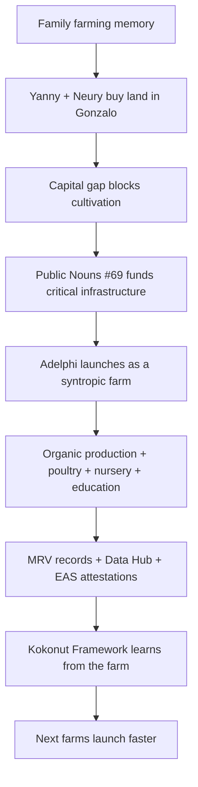

# Adelphi began as the two sisters' dream to return to the land.

Adelphi is Kokonut Network's first live syntropic farm — founded and operated by sisters **Yanny and Neury Hernández** in Gonzalo, Sabana Grande de Boyá, Monte Plata, Dominican Republic.

This is not only a farm profile. It is the human story behind Kokonut's first proof of concept: a women-led project that turns family memory, underused land, public-goods funding, syntropic agriculture, biodiversity restoration, and community education into a single regenerative system.

  <a href="#the-rebirth-of-a-dream" style={{ display: "inline-flex", alignItems: "center", gap: "6px", background: "#009F4D", color: "#fff", padding: "10px 20px", borderRadius: "8px", fontWeight: "600", fontSize: "14px", textDecoration: "none" }}>
    Read the Story →
  </a>

  <a href="https://hub.kokonut.network/projects/41" style={{ display: "inline-flex", alignItems: "center", gap: "6px", border: "1.5px solid #009F4D", color: "#009F4D", padding: "10px 20px", borderRadius: "8px", fontWeight: "600", fontSize: "14px", textDecoration: "none", background: "transparent" }}>
    Explore Live Farm Data
  </a>

  Adelphi connects personal history to public evidence: land, founders, infrastructure, crops, MRV, and community impact.

<Frame>
  
</Frame>

Mother Nature is an unbreakable living force that thrives in any environment. So are the people who choose to tend her.

---

## Why this story matters

Many regenerative agriculture projects begin with land, capital, or technical design. Adelphi begins with something more durable: a family relationship to place.

Yanny and Neury did not enter agriculture as outside operators. They grew up in a farming family, carrying memories of their grandparents' countryside home, childhood vacations surrounded by nature, and a long-held desire to return to land stewardship.

Kokonut Network matters because it gives stories like this the coordination layer they were missing: patient capital, public reporting, DAO accountability, farm infrastructure, and a Framework that other communities can replicate.

  

    
2

    
sister founders

  

  

    
15,725

    
m² total area

  

  

    
13,838

    
m² agricultural

  

  

    
PN #69

    
public goods funded

  

  

    
5

    
UN SDGs addressed

  

  

    
Live

    
MRV records

  

<Note>
  Adelphi is the emotional proof behind the technical model. The DAO, Framework, MRV stack, and Data Hub only matter because they help real people build resilient lives on real land.
</Note>

---

## The Rebirth of a Dream

  SDG 5 — Gender Equality
  SDG 1 — No Poverty

Yanny and Neury Hernández are sisters, single mothers, and the founders of Adelphi. They were raised in the city, but their roots were always tied to the countryside. Their grandparents' home became a place of memory, learning, and belonging — a place where land was not only property, but inheritance, responsibility, and possibility.

As adults, their lives moved through different paths. Yanny built a career in the pharmaceutical industry. Neury became a professional manicurist. Yet the dream of returning to the countryside never disappeared.

In 2022, they acted on that dream and purchased land in Gonzalo. Their intention was simple and powerful: build a future where they could live from the land, preserve their family's farming legacy, and create something useful for the surrounding community.

Then they met the problem that many small landholders face: owning land is not the same as having the capital to cultivate it.

The high cost of living in the city made it difficult to finance soil preparation, water systems, planting, tools, infrastructure, and the early operating costs of turning land into a working farm. This local barrier mirrored Kokonut Network's broader diagnosis: many grassroots farmers do not lack land or willpower — they lack access to the coordination layer that turns land into a regenerative livelihood.

That changed when [Public Nouns Proposal #69](https://publicnouns.wtf/vote/69) funded Adelphi's critical infrastructure. The funding did not just help launch a private farm. It helped Adelphi start as a public-good-aligned project from day one: community-first, data-visible, biodiversity-oriented, and designed to teach others.

This is how **Adelphi** was born. The name comes from the Greek word for _sisters_ — a quiet declaration of the bond between Yanny and Neury, and of the cooperative spirit the farm is meant to carry forward.

---

## Story timeline

<Steps>
  <Step title="Family memory" icon="tree" iconType="regular">
    Yanny and Neury grow up connected to their grandparents' countryside home, carrying a deep relationship with the land and farming memories.
  </Step>
  <Step title="City careers" icon="city" iconType="regular">
    Yanny works in the pharmaceutical industry while Neury builds a career as a professional manicurist. The dream of returning to the countryside remains alive.
  </Step>
  <Step title="Land purchase" icon="map-location-dot" iconType="regular">
    In 2022, the sisters bought land in Gonzalo, Monte Plata, hoping to create a future rooted in agriculture, family legacy, and community benefit.
  </Step>
  <Step title="Capital gap" icon="circle-exclamation" iconType="regular">
    The land exists, but cultivation requires infrastructure, tools, water systems, soil preparation, and operating support.
  </Step>
  <Step title="Public goods funding" icon="seedling" iconType="regular">
    Public Nouns Proposal #69 funds critical infrastructure, allowing Adelphi to begin as a community-first syntropic farm.
  </Step>
  <Step title="Live proof" icon="satellite" iconType="regular">
    Adelphi becomes Kokonut's first live farm proof: producing, teaching, regenerating, and publishing public farm data.
  </Step>
</Steps>

---

## A project for the community

  SDG 4 — Quality Education
  SDG 1 — No Poverty

Adelphi is not only meant to secure Yanny and Neury's future. It is designed to benefit the surrounding community.

The farm produces organic and agro-ecological crops, preserves biodiversity, regenerates soil, and creates a place where neighbors can learn sustainable agricultural practices. Its community education space is designed for children, elders, farmers, families, visitors, and anyone interested in reconnecting with land stewardship.

Near a batey and the Haty community, Adelphi can become a weekend refuge and gathering place: a farm where people learn by seeing, touching, planting, harvesting, cooking, resting, and asking questions.

The education program responds to a real local challenge: younger generations are increasingly disconnected from the agricultural knowledge their grandparents carried. Adelphi turns that knowledge gap into an invitation.

<CardGroup cols={2}>
  <Card title="For children" icon="child-reaching">
    A place to learn where food comes from, how soil works, and why land stewardship matters.
  </Card>

  <Card title="For elders" icon="person-cane">
    A place where traditional knowledge can be respected, remembered, and transferred to younger generations.
  </Card>

  <Card title="For local farmers" icon="tractor">
    A working demonstration of syntropic farming, biochar, nursery propagation, poultry integration, and organic inputs.
  </Card>

  <Card title="For the Kokonut Network" icon="network-wired">
    A live case study showing how community-first farms can be funded, documented, governed, and replicated.
  </Card>
</CardGroup>

---

## Reconnecting land, soil, and species

  SDG 15 — Life on Land

The ecological side of Adelphi is inseparable from the human story. The project is not only about generating income from land; it is about repairing the relationship between people and living systems.

Adelphi uses [syntropic farming](/kokonut-framework/why-syntropic-farming), biochar soil enrichment, biodiversity conservation, free-range poultry, ground cover, and a native-species nursery to build a farm that grows more alive over time.

The nursery conserves more than a dozen at-risk native species, including Hispaniola palmetto, native cacao, guavaberry, and Star Apple. Propagated plants can be distributed free of charge to visitors and neighboring communities, turning the nursery into a public good that extends beyond the farm boundary.

Every species registered in the nursery can be GPS-tracked through [Silvi](https://www.silvi.earth/) and included in the farm's satellite-monitored vegetation health records. This is where the story becomes evidence: biodiversity is not only described but also documented.

[Explore the crops, biodiversity, and infrastructure →](/ecosystem-wiki/kokonut-farms/adelphi/crops-biodiversity-and-infrastructure)

---

## From personal dream to Kokonut proof

This is the deeper reason Adelphi matters to Kokonut Network.

The farm is not only a beneficiary of the Framework. It is also a source of learning for the Framework. Every planting, harvest, workshop, species record, MRV event, and community outcome helps define what future Kokonut farms need to replicate the model with less friction.

| Story element | What does it prove for Kokonut |
| --- | --- |
| Yanny and Neury's land purchase | Grassroots founders already have agency, vision, and commitment |
| The capital gap | Land alone is not enough; coordination infrastructure is required |
| Public goods funding | Web3 communities can help finance real local infrastructure |
| Syntropic farm design | Regeneration can be operational, not only philosophical |
| Education space | Community benefit can be built into the farm from the start |
| Nursery and biodiversity work | Productive farms can also conserve species and restore ecosystems |
| Public MRV records | Impact claims can become inspectable evidence |

---

## In their own words

> **"Adelphi" is more than just an agricultural project — it is a space for transformation, where people can reconnect with nature and embrace a healthier, more balanced way of life. Yanny and Neury are not just planting crops; they are sowing the seeds of a sustainable future, filled with hope for themselves and their community.**

<Frame>
  
</Frame>

Yanny and Neury Hernández at Adelphi — building the farm, the community program, and the model that Kokonut Network was created to replicate.

---

## SDG alignment in practice

The background story of Adelphi is the most human expression of the SDGs that the farm addresses. These are not theoretical commitments — they are lived realities for Yanny, Neury, and the surrounding community.

| SDG | How the story embodies it |
| --- | --- |
| SDG 1 — No Poverty | Two single mothers creating a sustainable income from land they own, with farm operations designed to support local jobs and community benefit |
| SDG 4 — Quality Education | Weekend programs, workshops, and farm-based training designed to transfer agricultural knowledge to children, elders, neighbors, and nearby farmers |
| SDG 5 — Gender Equality | A farm founded, owned, and operated by women, demonstrating female leadership in agriculture, land stewardship, and community coordination |
| SDG 15 — Life on Land | Endangered species nursery, biochar soil regeneration, syntropic multi-strata planting, and free distribution of native plants to neighboring communities |

[Read the full SDG alignment →](/ecosystem-wiki/kokonut-farms/adelphi/sustainable-development-goals)

---

## What this story asks of the reader

The background story is not only meant to be inspiring. It is meant to make the project legible.

If you are reading as a DAO member, this is the human context behind the treasury decisions. If you are reading as a builder, this is the real-world user story behind the data systems. If you are reading as an agronomist, this is the community context behind the farm design. If you are reading as a partner or capital allocator, this is the reason Kokonut treats funding as public infrastructure, not charity.

<Note>
  You can explore Adelphi before making any commitment: read the docs, inspect the live Data Hub, review the MRV methodology, or join the community conversation.
</Note>

---

## Next steps

<CardGroup cols={2}>
  <Card title="Adelphi Executive Summary" icon="note" href="/ecosystem-wiki/kokonut-farms/adelphi/summary">
    The full project overview — key facts, revenue projections, Framework phase, MRV stack, and geospatial data for the farm Yanny and Neury are building.
  </Card>

  <Card title="Problem & Solution" icon="chalkboard" href="/ecosystem-wiki/kokonut-farms/adelphi/problem-and-solution">
    The seven local challenges this story addresses are economic hardship, food insecurity, gender inequality, educational gaps, and environmental degradation.
  </Card>

  <Card title="Crops, Biodiversity & Infrastructure" icon="puzzle" href="/ecosystem-wiki/kokonut-farms/adelphi/crops-biodiversity-and-infrastructure">
    What the farm physically produces — crops, native species, biochar, syntropic plots, poultry, and community education infrastructure.
  </Card>

  <Card title="MRV Methodology" icon="satellite" href="/ecosystem-wiki/kokonut-farms/measurement-reporting-and-verification">
    How Adelphi's story becomes verifiable evidence through data, field records, remote sensing, IPFS, and EAS attestations.
  </Card>

  <Card title="Open Collaboration" icon="telescope" href="/ecosystem-wiki/open-collaboration-invitation">
    Help replicate this model as an agronomist, researcher, developer, DAO member, capital allocator, storyteller, or community organizer.
  </Card>

  <Card title="Kokonut Manifesto" icon="scroll-old" href="/ecosystem-wiki/kokonut-101/manifesto">
    The principles behind the public goods funding model that made Adelphi possible — community before capital, land stewardship, and shared upside.
  </Card>
</CardGroup>

  <a href="https://hub.kokonut.network/projects/41" style={{ display: "inline-flex", alignItems: "center", gap: "6px", background: "#009F4D", color: "#fff", padding: "10px 20px", borderRadius: "8px", fontWeight: "600", fontSize: "14px", textDecoration: "none" }}>
    Explore Live Farm Data →
  </a>

  <a href="https://link.kokonut.network/discord" style={{ display: "inline-flex", alignItems: "center", gap: "6px", border: "1.5px solid #009F4D", color: "#009F4D", padding: "10px 20px", borderRadius: "8px", fontWeight: "600", fontSize: "14px", textDecoration: "none", background: "transparent" }}>
    Join the Community
  </a>

