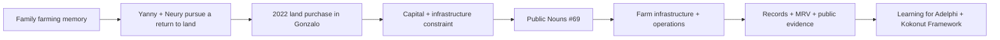

# Adelphi began with two sisters who wanted to return to the land.

Adelphi is Kokonut's first live reference farm, founded and operated by sisters **Yanny and Neury Hernández** in Gonzalo, Sabana Grande de Boyá, Monte Plata, Dominican Republic.

Before the farm became a Framework implementation, an MRV site, or a public data source, it began as a personal decision:

> **Yanny and Neury wanted to build an agricultural future on land they owned, connected to a family history of farming.**

This page tells that story.

It does not use the founders' story as proof that every intended social, ecological, or economic outcome has already been achieved. Those claims belong in the farm's operating records, MRV, forecasts, and evidence pages.

<CardGroup cols={2}>
  <Card title="See Adelphi today" icon="seedling" href="/ecosystem-wiki/kokonut-farms/adelphi/summary">
    Move from the founders' story into the farm's documented state, physical systems, forecasts, and current evidence.
  </Card>

  <Card title="Inspect published records" icon="chart-line" href="https://hub.kokonut.network/projects/41">
    Use the Kokonut Hub for current published farm, harvest, MRV, milestone, and project records.
  </Card>
</CardGroup>

<Frame>
  
</Frame>

<Note>
  **The background story is narrative context.** It explains why Adelphi exists, who founded it, and which problem the founders encountered. It should not substitute for evidence of farm performance or impact.
</Note>

---

## What the repository documents

The current Kokonut documentation consistently describes the following founder history.

<CardGroup cols={2}>
  <Card title="Two sisters" icon="people-group">
    Yanny and Neury Hernández are sisters, single mothers, landowners, founders, and operators of Adelphi.
  </Card>

  <Card title="Family connection to farming" icon="tree">
    They grew up in a farming family and spent childhood vacations at their grandparents' countryside home.
  </Card>

  <Card title="Different city careers" icon="city">
    Yanny built a career in the pharmaceutical industry. Neury became a professional manicurist.
  </Card>

  <Card title="Land purchased in 2022" icon="map-location-dot">
    The sisters purchased land in Gonzalo with the intention of building an agricultural future tied to family legacy and community benefit.
  </Card>

  <Card title="Capital and infrastructure gap" icon="circle-exclamation">
    The documented barrier was the financing needed to prepare the land, install infrastructure, and begin operating the farm.
  </Card>

  <Card title="Public-goods support" icon="hand-holding-heart">
    Public Nouns Proposal #69 helped fund critical infrastructure that allowed the project to move from intention into implementation.
  </Card>
</CardGroup>

These are the strongest source-backed elements of the story.

---

## A family memory that survived city life

Yanny and Neury's relationship with agriculture did not begin with Kokonut Network.

The repository describes them as growing up in a farming family and spending childhood vacations at their grandparents' countryside home in the Dominican Republic.

That memory remained part of their lives even as their adult careers moved in different directions.

- **Yanny** worked in the pharmaceutical industry.
- **Neury** became a professional manicurist.

Their return to agriculture was therefore not described as an outside organization assigning them a farm.

It was a decision to reconnect with something already present in their family history.

> **The land came before the coordination infrastructure. The founders came before the Framework.**

That ordering matters to the way Kokonut now describes Adelphi: shared infrastructure should support local operators rather than replace them.

---

## 2022: from intention to land ownership

In **2022**, Yanny and Neury purchased land in Gonzalo.

The repository describes their intention as building a future where they could:

- work with the land;
- preserve a family relationship with agriculture;
- build something useful for their household;
- create benefits that could extend into the surrounding community.

Buying the land was a major commitment.

It did not, however, make the farm operational.

The next challenge was financing.

---

## The gap between owning land and operating a farm

The strongest problem documented in Adelphi's origin story is not a generalized claim about all rural communities.

It is specific:

> **Yanny and Neury owned the land but lacked the capital and infrastructure required to turn it into a working farm.**

Moving from land ownership to production required resources for areas such as:

- land preparation;
- water and irrigation systems;
- tools;
- planting;
- physical infrastructure;
- early operating support.

This is the human version of the coordination problem described elsewhere in Kokonut.

Capital alone does not create a durable farm, but without capital, many of the physical conditions for production cannot begin.

<Card title="See the local problem framing" icon="chalkboard" href="/ecosystem-wiki/kokonut-farms/adelphi/problem-and-solution">
  The Problem & Solution page separates this directly documented financing constraint from the broader community, education, food, biodiversity, and gender outcomes Adelphi is designed to pursue.
</Card>

---

## Public Nouns #69: the turning point

[Public Nouns Proposal #69](https://publicnouns.wtf/vote/69) helped fund critical Adelphi infrastructure.

The significance of that event is practical.

Before funding:

**land + intent + local operators**

After funding, the project could begin building:

**land + operators + infrastructure + production systems + public documentation**

The proposal did not automatically prove that the farm would be profitable, regenerative, educational, or replicable.

It created the conditions for those questions to be tested in the real world.

```mermaid
flowchart LR
    A["Family farming memory"] --> B["Yanny + Neury pursue a return to land"]
    B --> C["2022 land purchase in Gonzalo"]
    C --> D["Capital + infrastructure constraint"]
    D --> E["Public Nouns #69"]
    E --> F["Farm infrastructure + operations"]
    F --> G["Records + MRV + public evidence"]
    G --> H["Learning for Adelphi + Kokonut Framework"]
```

---

## Why the name Adelphi matters

The existing project narrative explains **Adelphi** as a reference to the relationship between the two sisters.

That meaning fits the way the farm is presented throughout the repository:

- family before infrastructure;
- local operators before network abstractions;
- cooperation rather than replacement;
- shared work rooted in a specific relationship to land.

Because the current repository is the source for this naming explanation, this page does not attempt to turn that project meaning into a linguistic claim beyond what the documentation supports.

---

## From a personal project to a public-good-aligned farm

The founders' original motivation was personal and practical.

As the farm developed, Kokonut documentation expanded the project around additional goals:

- diversified food production;
- regenerative farming practices;
- biodiversity and nursery work;
- poultry;
- community and training infrastructure;
- public farm records;
- MRV;
- reusable learning for future farms.

Those later layers matter, but they should not erase the origin.

Adelphi is not primarily a story about technology.

It is a story about locally owned land that gained access to enough coordination infrastructure to begin operating.

<CardGroup cols={2}>
  <Card title="The physical farm" icon="puzzle" href="/ecosystem-wiki/kokonut-farms/adelphi/crops-biodiversity-and-infrastructure">
    See which crop, poultry, nursery, biofactory, soil, training, and geospatial systems now exist around the founders' original project.
  </Card>

  <Card title="The evidence layer" icon="magnifying-glass-chart" href="/ecosystem-wiki/kokonut-farms/measurement-reporting-and-verification">
    See how physical farm activity should become observations, measurements, reviewed records, attestations, and interpreted claims.
  </Card>
</CardGroup>

---

## Community purpose: intent first, outcomes second

The repository describes Adelphi as a **community-first** project.

It also identifies nearby communities, including the batey and Haty community, within the farm's intended local context.

The farm's community-oriented design includes:

- a multipurpose gazebo;
- workshops and demonstrations;
- agricultural education;
- nursery propagation;
- seedling distribution;
- a space for meetings and gathering.

Those intentions are documented.

Broader community outcomes still need records.

| Project intent | Evidence needed to demonstrate the outcome |
| --- | --- |
| Teach regenerative agriculture | Workshop records, attendance, curriculum, feedback, follow-up |
| Create a place for community gathering | Event logs, usage records, recurring programs |
| Share native or at-risk plants | Nursery inventory, distribution logs, recipient/destination records |
| Support local food access | Harvest, sales/distribution, buyer and community-access records |
| Preserve agricultural knowledge | Participation evidence, repeat learning, intergenerational involvement |

<Info>
  **The story can explain why these goals exist. It cannot prove they were achieved.** That distinction is now consistent across the Adelphi farm pages.
</Info>

---

## Women-led ownership is a documented fact

Yanny and Neury are not symbolic beneficiaries of the project.

The repository documents them as:

- sisters;
- single mothers;
- landowners;
- founders;
- farm operators.

This makes women-led ownership and operations one of the clearest social characteristics of Adelphi.

It supports a grounded statement:

> **Women are directly connected to the land, project leadership, and farm operations at Adelphi.**

It does not by itself prove a broader reduction in gender inequality across the surrounding community.

That broader outcome would require additional evidence on employment, participation, income, access to opportunity, and decision-making over time.

---

## Ecology is part of the stewardship story — but outcomes need measurement

The repository connects Adelphi's human story to:

- syntropic farming;
- native and at-risk species propagation;
- biochar;
- agroforestry;
- ground cover;
- poultry integration;
- nursery work.

These practices reflect a stewardship intention: use the farm productively while improving the conditions for ecological regeneration.

The physical practices are documented.

The ecological outcomes should be measured separately.

For example:

- a planted native species is a **recorded intervention**;
- a GPS point is **provenance**;
- repeated survival data is a **measured outcome**;
- a biodiversity-restoration claim is an **interpretation** requiring a defined method.

[Explore the physical systems →](/ecosystem-wiki/kokonut-farms/adelphi/crops-biodiversity-and-infrastructure)

---

## The story timeline

<Steps>
  <Step title="Family farming memory" icon="tree" iconType="regular">
    Yanny and Neury grow up in a farming family and spend childhood vacations at their grandparents' countryside home.
  </Step>

  <Step title="City careers" icon="city" iconType="regular">
    Yanny works in the pharmaceutical industry while Neury builds a career as a professional manicurist.
  </Step>

  <Step title="2022 land purchase" icon="map-location-dot" iconType="regular">
    The sisters purchase land in Gonzalo with the intention of building an agricultural future tied to family legacy and community benefit.
  </Step>

  <Step title="Financing constraint" icon="circle-exclamation" iconType="regular">
    They encounter the gap between owning land and financing the infrastructure required to operate it.
  </Step>

  <Step title="Public Nouns #69" icon="hand-holding-heart" iconType="regular">
    Public-goods funding helps finance critical farm infrastructure.
  </Step>

  <Step title="Adelphi becomes operational" icon="tractor" iconType="regular">
    The project develops production, poultry, nursery, biofactory, training, and farm-data systems.
  </Step>

  <Step title="Evidence begins to accumulate" icon="magnifying-glass-chart" iconType="regular">
    Farm records, MRV, the Kokonut Hub, and later analysis create a path from story to inspectable evidence.
  </Step>
</Steps>

---

## Story, implementation, evidence

The strongest Adelphi narrative keeps these three layers separate.

| Layer | Example |
| --- | --- |
| **Story** | Two sisters with a family connection to farming want to return to the land |
| **Decision** | They purchase land in Gonzalo in 2022 |
| **Constraint** | They lack enough capital and infrastructure to operate the farm |
| **Intervention** | Public Nouns #69 helps fund critical infrastructure |
| **Implementation** | Production, poultry, nursery, biofactory, training, and data systems are built |
| **Evidence** | Farm records, measurements, MRV events, Hub records, and forecasts-vs-actuals |
| **Interpretation** | Economic, ecological, SDG, community, and replication conclusions |

> **The story explains why the work began. The evidence explains what happened after it began.**

---

## A note on the old “In their own words” passage

The previous version of this page presented the following project description as a direct quotation from the founders:

> “Adelphi is more than just an agricultural project...”

The repository does not provide a source that attributes those exact words directly to Yanny or Neury.

For that reason, this revision removes the **“In their own words”** label.

The underlying sentiment—Adelphi as a place for land stewardship, community learning, and a more sustainable future—remains part of the documented project narrative, but it should not be represented as a verbatim founder quote without a source.

<Frame>
  
</Frame>

Yanny and Neury Hernández at Adelphi, the farm they founded and continue to operate.

---

## What this story can support

<CardGroup cols={2}>
  <Card title="Local agency preceded the network" icon="people-group">
    The founders purchased land and held the agricultural vision before Kokonut's coordination infrastructure was applied to the project.
  </Card>

  <Card title="The financing gap is directly documented" icon="building-columns">
    Land ownership did not remove the need for infrastructure and early operating capital.
  </Card>

  <Card title="Public-goods capital reached physical infrastructure" icon="hammer">
    Public Nouns #69 helped move the project from land ownership toward an operating farm.
  </Card>

  <Card title="Women remain central to the project" icon="venus">
    Yanny and Neury are documented as owners, founders, and operators rather than passive beneficiaries.
  </Card>
</CardGroup>

### What the story does not prove by itself

- poverty reduction;
- household-income improvement;
- food-security impact;
- ecological restoration;
- biodiversity recovery;
- education outcomes;
- community resilience;
- farm profitability;
- successful replication to another farm.

Those require evidence from the relevant farm, financial, MRV, participation, or research records.

---

## How the story connects to Kokonut

Adelphi matters to Kokonut because it keeps the system anchored in a real operating context.

The story helps explain why the architecture now separates:

- local farm operators;
- capital governance;
- contribution coordination;
- Framework methodology;
- MRV;
- public data;
- analysis and automation.

No one of those layers is the farm.

The farm begins with people, land, and the work of operating it.

The shared infrastructure exists to make that work easier to finance, document, review, learn from, and eventually adapt elsewhere.

<Card title="Read the Kokonut Manifesto" icon="scroll-old" href="/ecosystem-wiki/kokonut-101/manifesto">
  See the values that should constrain how Kokonut approaches land, local agency, technology, capital, evidence, and community participation.
</Card>

---

## Continue through Adelphi

<CardGroup cols={2}>
  <Card title="Adelphi Overview" icon="seedling" href="/ecosystem-wiki/kokonut-farms/adelphi/summary">
    Return to the canonical farm overview, documented state, Framework phase, forecasts, and current evidence.
  </Card>

  <Card title="Problem & Solution" icon="chalkboard" href="/ecosystem-wiki/kokonut-farms/adelphi/problem-and-solution">
    See how the founders' financing constraint is separated from broader outcomes the farm is designed to pursue.
  </Card>

  <Card title="Crops, Biodiversity & Infrastructure" icon="puzzle" href="/ecosystem-wiki/kokonut-farms/adelphi/crops-biodiversity-and-infrastructure">
    See what was physically built around the founders' original agricultural project.
  </Card>

  <Card title="Crops & Harvest Forecast" icon="calculator" href="/ecosystem-wiki/kokonut-farms/adelphi/crops-and-harvest-forecast">
    Review the farm's production assumptions without confusing modeled revenue with achieved outcomes.
  </Card>

  <Card title="MRV — Evidence Standard" icon="magnifying-glass-chart" href="/ecosystem-wiki/kokonut-farms/measurement-reporting-and-verification">
    Understand how the farm's story moves from narrative into inspectable records and evidence.
  </Card>

  <Card title="Sustainable Development Goals" icon="recycle" href="/ecosystem-wiki/kokonut-farms/adelphi/sustainable-development-goals">
    See how the human story maps to SDG claims only where evidence supports the connection.
  </Card>
</CardGroup>

> **Adelphi's origin is important because the project did not begin with a token, a DAO, or a software stack. It began with Yanny and Neury, land they chose to own, and a decision to try to build a future from it.**
