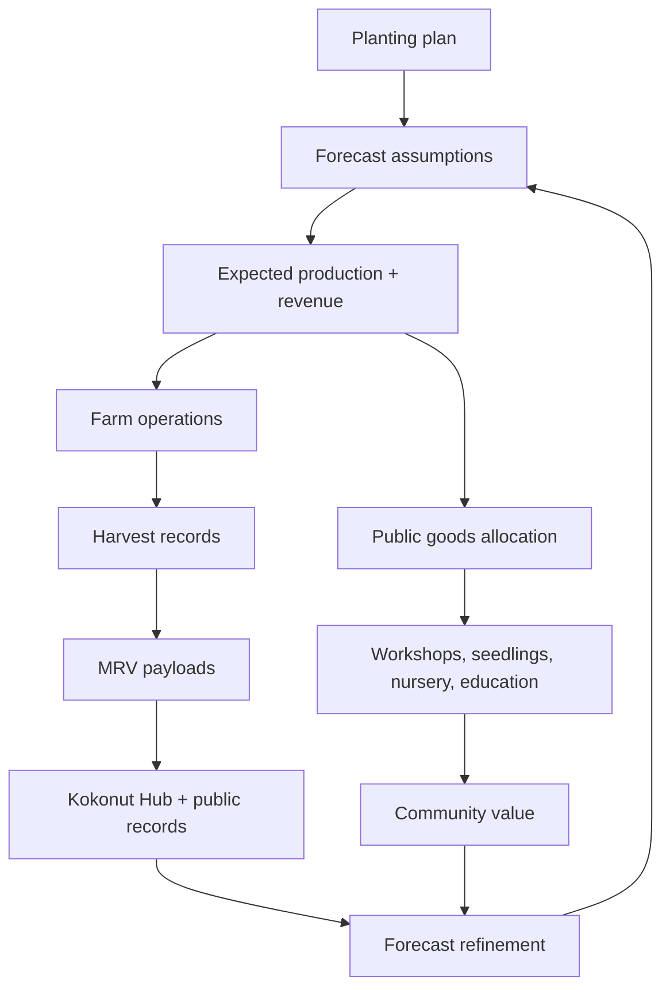

# Adelphi's harvest forecast shows how regeneration can become a recurring revenue stream.

Adelphi's production model is designed around one practical question:

> Can a regenerative farm produce short-term cash flow, long-term perennial value, public goods funding, and verifiable impact at the same time?

This page explains the forecast behind Adelphi's crop system: what is planted, how production is calculated, which assumptions are used, how revenue is projected, and how actual harvest records refine the model over time.

<div style={{ display: "flex", gap: "12px", justifyContent: "center", flexWrap: "wrap", margin: "1.5rem 0 0.75rem" }}>
  <a href="#revenue-summary-at-a-glance" style={{ display: "inline-flex", alignItems: "center", gap: "6px", background: "#009F4D", color: "#fff", padding: "10px 20px", borderRadius: "8px", fontWeight: "600", fontSize: "14px", textDecoration: "none" }}>
    See the Forecast →
  </a>

  <a href="https://hub.kokonut.network/projects/41" style={{ display: "inline-flex", alignItems: "center", gap: "6px", border: "1.5px solid #009F4D", color: "#009F4D", padding: "10px 20px", borderRadius: "8px", fontWeight: "600", fontSize: "14px", textDecoration: "none", background: "transparent" }}>
    Compare Against Live Data
  </a>
</div>

<p style={{ textAlign: "center", fontSize: "13px", color: "#6b7280", marginTop: "0.25rem" }}>
  Forecasts are planning assumptions, not guaranteed outcomes. Actuals are tracked through the Kokonut Hub and refined through MRV.
</p>

<Note>
  This page is an operational forecast for farm planning and impact modeling. It is not financial advice, an investment guarantee, or a promise of future returns. Weather, pests, soil conditions, labor, market access, and pricing can materially change actual results.
</Note>

---

## Revenue summary at a glance

| Crop/product | Cycle | Scale | Annual production forecast | Annual revenue forecast |
| --- | --- | --- | --- | --- |
| Lettuce | Short cycle · 5 harvests/yr | 10 plots | 48,450 units per harvest · 242,250 units/yr | **\$133,237.50** |
| Passion fruit | Medium cycle · annual | 8 plots · 560 plants | 47,600 fruits · 3,661 nets | **\$11,019.61** |
| Coconut | Long cycle · perennial | 8 plots · 96 trees | 6,144 coconuts at maturity | **\$4,853.76** |
| Poultry eggs | Continuous | 110 hens | ~36,500 eggs/yr | Additional revenue stream |
| **Total projected gross revenue** |  |  | Crop forecast only; eggs excluded until pricing is finalized | **~\$149,110.87 / yr** |

<sup>10% of gross crop revenue — approximately \$14,911.09/yr — is allocated to public goods activities per the Kokonut Common Data Schema. Actual harvests, prices, losses, and revenue records should be checked against hub.kokonut.network/projects/41.</sup>

---

## What this forecast helps prove

<CardGroup cols={2}>
  <Card title="Regeneration can create near-term cash flow" icon="seedling">
    Short-cycle crops like lettuce create recurring harvests while slower perennial systems mature.
  </Card>

  <Card title="Perennials create long-term cooperative value" icon="tree-palm">
    Coconut trees become the long-cycle anchor of the farm and the real-world backing logic behind Kokonut's tree-linked governance model.
  </Card>

  <Card title="Public goods can be budgeted into production" icon="hand-holding-heart">
    A 10% allocation to public goods funds workshops, seedling distribution, nursery operations, and education.
  </Card>

  <Card title="Forecasts can become verifiable records" icon="badge-check">
    The forecast becomes credible only when actual harvests are measured through MRV and published to the live Data Hub.
  </Card>
</CardGroup>

---

## Forecasting model

All crop forecasts derive from the same base formula:

```text
Total Production = (Planting Density per m²)
                 × (Bed Area in m²)
                 × (Number of Beds per Plot)
                 × (Number of Plots)
                 × (1 − Loss Rate)
```

The **loss rate** accounts for crop management variability, climate conditions, irrigation reliability, soil health, pest pressure, and harvest handling. The figures below use a **15% loss rate** as the baseline planning assumption.

```text
15% loss rate = 0.85 production multiplier
```

<Note>
  The most important number on this page is not the projected revenue total. It is the difference between the forecast and the actual. Actual harvest records should be used to improve the next planting cycle, refine the loss rate, and make future forecasts more accurate.
</Note>

---

## Crop mix overview

Adelphi uses a three-cycle production model, so revenue arrives across different time horizons.

| Cycle | Crops/products | First harvest | Revenue role |
| --- | --- | --- | --- |
| **Short cycle** | Lettuce, broccoli, spinach, tomatoes, arugula, and minor vegetables | 30–75 days after planting | High-frequency, recurring cash flow |
| **Medium cycle** | [Indian Yam](https://www.gbif.org/species/2755239), [Passion Fruit](https://www.gbif.org/species/2874190) | 6–12 months | Seasonal compounding as the plantation matures |
| **Long cycle** | Coconut | 3–5 years, then multi-year production | Perennial anchor income and tree-backed governance logic |
| **Continuous** | Free-range eggs | Daily once hens are laying | Recurring food and revenue stream; not included in the crop revenue total until pricing is finalized |

This staggered structure is central to [syntropic farming](/kokonut-framework/why-syntropic-farming): species at different successional stages occupy the same land simultaneously, support each other's growth, and generate independent value at different times.

---

## How the forecast becomes a feedback loop



The forecast should not stay static. As Adelphi collects actual harvest data, the model can improve:

- planting density assumptions can be adjusted;
- Loss rates can be updated by crop and season;
- local selling prices can be refined;
- Public goods allocations can be calculated from actual gross revenue;
- Future farms can reuse the improved model.

---

## Short cycle — Lettuce

Lettuce is the short-cycle cash-flow engine of Adelphi's forecast.

### Production variables

```text
Planting Density:            12 lettuces / m²
Bed Area:                    25 m²
Number of Beds per Plot:     19
Number of Plots:             10
Loss Rate:                   15% (multiplier: 0.85)
Forecast harvests per year:  5
Theoretical maximum:         8–10 cycles/yr for fast-growing loose-leaf varieties
```

<Note>
  The annual projection uses **5 harvests per year** as the conservative planning figure. Fast-growing loose-leaf varieties can theoretically achieve 8–10 cycles per year, but the revenue forecast uses 5 to account for preparation, soil recovery, operational variability, and seasonal conditions.
</Note>

### Applied example

| Step | Calculation | Result |
| --- | --- | --- |
| Lettuce per bed | `12 lettuces/m² × 25 m²` | 300 lettuces/bed |
| Lettuce per plot | `300 lettuces/bed × 19 beds/plot` | 5,700 lettuces/plot |
| Lettuce across 10 plots | `5,700 × 10` | 57,000 lettuces before loss |
| Effective production | `57,000 × 0.85` | **48,450 lettuces per harvest** |

### Production time by variety

| Variety | Days to harvest |
| --- | --- |
| Loose-leaf lettuce | 30–45 days |
| Head lettuce — Iceberg, Romaine, etc. | 60–75 days |

### Selling price and revenue

The lettuce model uses a conservative wholesale planning price of **\$0.55 per unit**. A higher price of **\$0.63 per unit** is treated as upside, not the baseline forecast.

| Scenario | Calculation | Result |
| --- | --- | --- |
| Baseline per harvest | `48,450 × \$0.55` | **\$26,647.50** |
| Upside per harvest | `48,450 × \$0.63` | **\$30,523.50** |
| Baseline annual revenue | `\$26,647.50 × 5 harvests` | **\$133,237.50 / yr** |

### What to verify in the Data Hub

- actual units harvested per cycle;
- actual loss rate by harvest;
- actual selling price per unit;
- rejected, donated, consumed, or unsold units;
- seasonal differences across planting windows.

---

## Medium cycle — Passion fruit

Passion fruit is Adelphi's medium-cycle compounding crop. It does not reset as quickly as lettuce; productive capacity builds as vines mature.

### Production variables

```text
Area per plot:               629 m²
Planting spacing:            3 × 3 meters (9 m²/plant)
Plants per plot:             70
Total plants (8 plots):      560
Annual production per plant: 100 passion fruits
Loss Rate:                   15% (multiplier: 0.85)
Net annual production/plant: 85 passion fruits
Selling price per net:       $3.01
Average net size:            13 passion fruits
```

### Applied example

| Step | Calculation | Result |
| --- | --- | --- |
| Net annual production | `85 passion fruits/plant × 560 plants` | 47,600 passion fruits |
| Nets produced | `47,600 ÷ 13 fruits/net` | 3,661 nets |
| Annual revenue | `3,661 nets × \$3.01/net` | **\$11,019.61 / yr** |

### Revenue characteristics

The net-based selling format of **\$3.01 per net of 13 fruits** is the planning baseline used for wholesale-style distribution. Direct community sales, organic market channels, or certification-supported distribution may create upside, but those should be tracked separately from the baseline forecast.

### What to verify in the Data Hub

- actual fruit count per plant;
- actual net size and packaging losses;
- wholesale vs direct-sale prices;
- vine establishment period;
- pest and disease pressure;
- seasonality of demand.

---

## Long cycle — Coconut

Coconut is the long-cycle anchor of the farm and the crop most directly connected to Kokonut Network's cooperative identity.

### Production variables

```text
Area per plot:               629 m²
Planting spacing:            7 × 7 meters (49 m²/plant)
Plants per plot:             12
Total plants (8 plots):      96
Annual production per plant: 75 coconuts at full maturity
Loss Rate:                   15% (multiplier: 0.85)
Net annual production/plant: 64 coconuts
Selling price per coconut:   $0.79
First harvest timeline:      3–5 years from planting
Production life:             Up to 20 years under optimal conditions
```

### Applied example

| Step | Calculation | Result |
| --- | --- | --- |
| Net annual production | `64 coconuts/tree × 96 trees` | 6,144 coconuts |
| Annual revenue | `6,144 × \$0.79/coconut` | **\$4,853.76 / yr** |

### Revenue characteristics and timeline

Coconuts do not generate revenue immediately. The first harvest typically occurs **3–5 years after planting**, with full yield developing over subsequent seasons.

This delayed payback is why Adelphi uses short and medium-cycle crops. Lettuce and passion fruit bridge the establishment period while the coconut system matures.

Once established, coconut trees can produce for up to **20 years** under optimal conditions. When a tree ends its productive life, it is replanted, restarting the production cycle and continuing the cooperative model.

### Additional value streams beyond fresh coconut

- Coconut oil, milk, and water;
- coconut husks for on-site fertility and soil inputs;
- harvested wood for furniture and construction materials;
- long-term tree-backed cooperative legitimacy.

### What to verify in the Data Hub

- number of surviving trees;
- tree health and age class;
- first harvest date;
- coconuts per tree;
- actual price per coconut;
- derivative-product revenue if processing is added.

---

## Continuous production — Poultry eggs

The farm integrates **110 free-range laying hens**, with an estimated production of **~100 eggs per day** or **~36,500 eggs per year**.

Egg revenue is intentionally listed as an **additional revenue stream** rather than included in the crop revenue total until pricing, distribution, and loss assumptions are finalized.

| Variable | Planning value |
| --- | --- |
| Hens | 110 |
| Estimated daily eggs | ~100 |
| Estimated annual eggs | ~36,500 |
| Revenue status | Additional stream; excluded from crop total until pricing model is finalized |

The poultry system also supports the regenerative fertility loop. Hens produce manure that can be processed into humic acids and organic urea, reducing dependence on external synthetic inputs.

[Read the infrastructure page →](/ecosystem-wiki/kokonut-farms/adelphi/crops-biodiversity-and-infrastructure)

---

## Combined revenue and public goods allocation

```text
Lettuce (short cycle):        $133,237.50 / yr
Passion fruit (medium cycle):  $11,019.61 / yr
Coconut (long cycle):           $4,853.76 / yr
─────────────────────────────────────────────
Total projected gross revenue: $149,110.87 / yr

Public goods allocation (10%):  $14,911.09 / yr
  → Community workshops
  → Free seedling distribution for neighbors
  → Endangered species nursery operations
  → Educational programming at the farm gazebo

Net operating revenue (90%):   $134,199.78 / yr
```

<Tip>
  The [SDG Impact Calculator](/kokonut-framework/impact-calculator) can use Adelphi's parameters — 15,725 m², full crop mix, rural location, women in leadership, biochar, and native species nursery — to estimate SDG scores and ecological outputs for this forecast.
</Tip>

---

## Forecast risk and sensitivity

Every forecast depends on assumptions. Adelphi's planning model should be read with these variables in mind:

| Variable | Why it matters |
| --- | --- |
| Loss rate | A 15% loss baseline is used, but actual losses can increase due to drought, pests, disease, or operational disruptions. |
| Market price | Wholesale and retail prices can change by season, buyer, certification status, and distribution channel. |
| Labor availability | Harvest quality, planting cadence, and post-harvest handling depend on reliable labor and training. |
| Irrigation and water | Lettuce and other short-cycle crops are sensitive to water consistency and drainage. |
| Soil health | Biochar, organic inputs, and syntropic management can improve yields over time, but soil recovery is gradual. |
| Certification | Organic certification may improve market access, but timing and price effects should not be assumed until confirmed. |
| Data quality | Better farm records reduce uncertainty and improve the next forecast cycle. |

<Note>
  Forecasts should become more accurate over time. The goal is not to defend the first projection forever; the goal is to use live harvest data to improve the model.
</Note>

---

## How actuals are verified

Adelphi's harvest forecast becomes credible only when actual farm activity is measured.

| Evidence layer | What it verifies |
| --- | --- |
| Harvest records | Crop type, quantity, date, quality, loss rate, sale status |
| Kokonut Hub | Public view of farm milestones, MRV events, and impact metrics |
| Field observations | Soil condition, crop condition, pests, irrigation, and operational notes |
| Satellite and remote sensing | Vegetation health, land-use change, and ecological trends |
| EAS attestations | Public records that connect structured evidence to the broader Kokonut data layer |

[Read the MRV methodology →](/ecosystem-wiki/kokonut-farms/measurement-reporting-and-verification)

---

## What this page supports

<CardGroup cols={2}>
  <Card title="Farm operators" icon="tractor">
    Use the forecast as a planning model for planting schedules, crop mix, harvest tracking, and expected cash flow.
  </Card>

  <Card title="DAO members" icon="hydra">
    Inspect the assumptions underlying the farm's revenue model before evaluating proposals, reports, and public-goods allocations.
  </Card>

  <Card title="Impact reviewers" icon="magnifying-glass-chart">
    Compare projected revenue, jobs, public goods allocation, and SDG impacts against actual farm records.
  </Card>

  <Card title="Builders and data contributors" icon="code">
    Improve the calculator, forecast models, MRV schemas, dashboards, and Data Hub integrations.
  </Card>
</CardGroup>

---

## Next steps

<CardGroup cols={2}>
  <Card title="Crops, Biodiversity & Infrastructure" icon="puzzle" href="/ecosystem-wiki/kokonut-farms/adelphi/crops-biodiversity-and-infrastructure">
    The physical production system behind these numbers — beds, plots, poultry, nursery, biofactory, and soil regeneration.
  </Card>

  <Card title="MRV — Measurement & Verification" icon="magnifying-glass-chart" href="/ecosystem-wiki/kokonut-farms/measurement-reporting-and-verification">
    How every harvest cycle becomes structured data, public evidence, and verifiable impact records.
  </Card>

  <Card title="SDG Impact Calculator" icon="calculator" href="/kokonut-framework/impact-calculator">
    Use Adelphi's parameters to estimate SDG scores, carbon outputs, employment effects, and impact alignment.
  </Card>

  <Card title="Adelphi Data Hub" icon="chart-line" href="https://hub.kokonut.network/projects/41">
    The live source of truth for actual harvest records, MRV events, milestones, and farm data.
  </Card>

  <Card title="Sustainable Development Goals" icon="recycle" href="/ecosystem-wiki/kokonut-farms/adelphi/sustainable-development-goals">
    How this revenue model supports No Poverty, Zero Hunger, Gender Equality, Decent Work, and Life on Land.
  </Card>

  <Card title="Adelphi Executive Summary" icon="note" href="/ecosystem-wiki/kokonut-farms/adelphi/summary">
    The full farm overview — project context, founders, Framework phase status, proof metrics, and live data links.
  </Card>
</CardGroup>

<div style={{ display: "flex", gap: "12px", justifyContent: "center", flexWrap: "wrap", margin: "2rem 0 0.75rem" }}>
  <a href="https://hub.kokonut.network/projects/41" style={{ display: "inline-flex", alignItems: "center", gap: "6px", background: "#009F4D", color: "#fff", padding: "10px 20px", borderRadius: "8px", fontWeight: "600", fontSize: "14px", textDecoration: "none" }}>
    Compare Forecast to Live Data →
  </a>

  <a href="/ecosystem-wiki/open-collaboration-invitation" style={{ display: "inline-flex", alignItems: "center", gap: "6px", border: "1.5px solid #009F4D", color: "#009F4D", padding: "10px 20px", borderRadius: "8px", fontWeight: "600", fontSize: "14px", textDecoration: "none", background: "transparent" }}>
    Help Improve the Model
  </a>
</div>