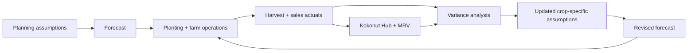

# This page is a forecast model — not a record of achieved harvests or revenue.

Adelphi's crop model estimates how short-, medium-, long-cycle, and continuous production **could perform under a defined set of assumptions**.

It is useful for:

- planting and production planning;
- comparing crop timelines;
- estimating gross-revenue scenarios;
- testing loss and price assumptions;
- planning data collection;
- comparing forecasts with actual harvest records over time.

It is **not** a live farm ledger, profit-and-loss statement, guaranteed return, or record of realized revenue.

<CardGroup cols={2}>
  <Card title="Compare with published farm records" icon="chart-line" href="https://hub.kokonut.network/projects/41">
    Use the Kokonut Hub for current published harvest, MRV, milestone, and farm records.
  </Card>

  <Card title="Understand the evidence standard" icon="magnifying-glass-chart" href="/ecosystem-wiki/kokonut-farms/measurement-reporting-and-verification">
    See why a forecast remains a model until actual farm records are collected, reviewed, and published.
  </Card>
</CardGroup>

<Warning>
  **Forecast ≠ actual. Gross revenue ≠ profit.** This model does not include the full cost structure for labor, water, inputs, packaging, transport, certification, maintenance, taxes, losses after harvest, or other operating expenses.
</Warning>

---

## How to read this model

The forecast combines crops that operate on different timelines.

That means the headline annual total is best understood as a **steady-state planning snapshot**, not a guaranteed single-calendar-year result.

| Stream | Forecast maturity |
| --- | --- |
| **Lettuce** | Short-cycle annualized model |
| **Passion fruit** | Medium-cycle annual production assumption after establishment |
| **Coconut** | Long-cycle annual production assumption at productive maturity |
| **Poultry eggs** | Continuous production estimate; revenue excluded because the pricing model is incomplete |

<Info>
  Coconut revenue should not be added to an early-year cash-flow expectation before the trees reach productive maturity. Likewise, passion-fruit and poultry performance should be reconciled against establishment and production records rather than assumed from the model.
</Info>

---

## Current documented assumptions

These are the assumptions currently encoded in the Adelphi forecast documentation.

| Variable | Current model assumption | Evidence status |
| --- | ---: | --- |
| General crop-loss rate | **15%** | Planning assumption |
| Lettuce planting density | **12 plants/m²** | Planning assumption |
| Lettuce bed area | **25 m²** | Planning assumption |
| Lettuce beds per plot | **19** | Planning assumption |
| Lettuce plots | **10** | Planning assumption |
| Lettuce harvests/year | **5** | Annual planning assumption |
| Lettuce baseline price | **\$0.55/unit** | Planning price |
| Lettuce upside price | **\$0.63/unit** | Scenario price |
| Passion-fruit plots | **8** | Planning layout |
| Passion-fruit plants | **560** | Planning count |
| Passion-fruit gross yield | **100 fruits/plant/year** | Planning assumption |
| Passion-fruit pack size | **13 fruits/net** | Planning assumption |
| Passion-fruit price | **\$3.01/net** | Planning price |
| Coconut trees | **96** | Planning/documented count used by model |
| Coconut gross yield | **75 coconuts/tree/year at maturity** | Planning assumption |
| Coconut price | **\$0.79/unit** | Planning price |
| Poultry | **110 hens** | Documented state |
| Poultry output | **~100 eggs/day** | Planning estimate |
| Public-goods allocation | **10% of gross farm revenue in the current farm model** | Documentation assumption; see inconsistency note below |

> **The model should become less assumption-heavy over time.** Every harvest, sale, loss, and operating record can replace a planning value with a farm-specific actual.

---

## Documentation inconsistency: public-goods allocation

The repository currently contains **two conflicting Adelphi allocation models**.

### Farm / Framework documentation

The current:

- Common Data Schema;
- 8 Forms of Capital page;
- Adelphi SDG page;
- Adelphi forecast page

model **10% of gross farm revenue** for public goods once revenue is realized.

### Regenerative Finance Playbook

Some ReFi Playbook pages describe a different Adelphi-specific split:

- **40%** to the Hernández family as farm operators;
- **40%** to a public-goods fund;
- **20%** to Kokonut Network.

<Warning>
  These two models are not equivalent. Until the repository is reconciled against the approved economic arrangement, this page uses **10% only as the current farm-model assumption**. It should not be presented as a legally binding, governance-approved, or already-realized distribution.
</Warning>

The strongest future source of truth should be the approved farm economic agreement or governance record, with the documentation updated to match it.

---

## Forecast summary

| Crop / product | Cycle | Scale | Modeled annual production | Modeled gross revenue |
| --- | --- | --- | ---: | ---: |
| **Lettuce** | Short cycle · 5 harvests/year | 10 plots | 48,450 units/harvest · 242,250 units/year | **\$133,237.50** |
| **Passion fruit** | Medium cycle | 8 plots · 560 plants | 47,600 fruits · 3,661 complete nets + 7 loose fruits | **\$11,019.61** from complete nets |
| **Coconut** | Long cycle · productive maturity | 96 trees | 6,144 coconuts/year | **\$4,853.76** |
| **Poultry eggs** | Continuous | 110 hens | ~36,500 eggs/year estimate | **Not modeled** |
| **Combined crop model** | Mixed maturity | Eggs excluded | — | **\$149,110.87/year** |

<Note>
  The **\$149,110.87** figure is a combined gross-revenue planning snapshot using the assumptions above. It is not net income, EBITDA, distributable cash, or a guaranteed annual result.
</Note>

---

## Core calculation logic

The crop model starts from a simple production relationship:

```text
Gross Production
= Planting Density
× Planting Area
× Number of Production Units

Modeled Saleable Production
= Gross Production
× (1 − Loss Rate)

Modeled Gross Revenue
= Saleable Production
× Planning Price
```

For packaging-based crops such as passion fruit, an additional packaging step is required.

```text
Complete Sale Units
= floor(Saleable Individual Units ÷ Units per Package)

Modeled Gross Revenue
= Complete Sale Units × Price per Package
```

The **15% loss rate** is a model-wide planning assumption.

It should eventually be replaced by crop- and season-specific actual loss rates.

---

## Short cycle — lettuce

Lettuce is the largest modeled gross-revenue stream in the current forecast.

### Current variables

```text
Planting density:           12 lettuces/m²
Bed area:                   25 m²
Beds per plot:              19
Plots:                      10
Loss rate:                  15%
Production multiplier:      0.85
Modeled harvests per year:  5
Baseline planning price:    \$0.55/unit
Upside scenario price:      \$0.63/unit
```

### Production calculation

| Step | Calculation | Result |
| --- | --- | ---: |
| Plants per bed | `12 × 25` | 300 |
| Plants per plot | `300 × 19` | 5,700 |
| Gross plants across 10 plots | `5,700 × 10` | 57,000 |
| Modeled saleable units | `57,000 × 0.85` | **48,450/harvest** |
| Annual modeled units | `48,450 × 5` | **242,250/year** |

### Revenue calculation

| Scenario | Calculation | Modeled gross revenue |
| --- | --- | ---: |
| Baseline per harvest | `48,450 × \$0.55` | **\$26,647.50** |
| Upside per harvest | `48,450 × \$0.63` | **\$30,523.50** |
| Baseline annualized | `242,250 × \$0.55` | **\$133,237.50** |
| Upside annualized | `242,250 × \$0.63` | **\$152,617.50** |

### What is still an assumption

The repository currently describes:

- 30–45 days for loose-leaf lettuce;
- 60–75 days for head lettuce;
- 5 modeled harvests per year.

Those timing values belong to the current planning model and should be replaced or refined with Adelphi-specific crop-cycle actuals as records accumulate.

### What actuals should replace

- planted units;
- germination / establishment loss;
- field loss;
- harvest quantity;
- quality grade;
- rejected units;
- donated or consumed units;
- sold units;
- sale price;
- buyer/channel;
- harvest date;
- days from planting to harvest.

---

## Lettuce sensitivity

The baseline forecast is highly sensitive to both losses and price.

### Loss-rate sensitivity at \$0.55/unit

| Loss rate | Units/harvest | Annual units at 5 harvests | Modeled gross revenue |
| ---: | ---: | ---: | ---: |
| **10%** | 51,300 | 256,500 | **\$141,075.00** |
| **15% baseline** | 48,450 | 242,250 | **\$133,237.50** |
| **20%** | 45,600 | 228,000 | **\$125,400.00** |
| **25%** | 42,750 | 213,750 | **\$117,562.50** |

### Price sensitivity at the 15% loss baseline

| Price/unit | Modeled annual gross revenue |
| ---: | ---: |
| **\$0.45** | **\$109,012.50** |
| **\$0.55 baseline** | **\$133,237.50** |
| **\$0.63 upside** | **\$152,617.50** |

<Info>
  These sensitivity tables are **derived directly from the existing Adelphi model assumptions**. They are scenarios, not new price or yield forecasts.
</Info>

---

## Medium cycle — passion fruit

### Current variables

```text
Area per plot:                629 m²
Spacing:                      3 m × 3 m
Plants per plot:              70
Plots:                        8
Total plants:                 560
Gross yield assumption:       100 fruits/plant/year
Loss rate:                    15%
Modeled net yield:            85 fruits/plant/year
Package size:                 13 fruits/net
Planning price:               \$3.01/net
```

### Production calculation

| Step | Calculation | Result |
| --- | --- | ---: |
| Modeled saleable fruit | `85 × 560` | **47,600 fruits** |
| Complete 13-fruit nets | `floor(47,600 ÷ 13)` | **3,661 nets** |
| Loose remainder | `47,600 − (3,661 × 13)` | **7 fruits** |
| Revenue from complete nets | `3,661 × \$3.01` | **\$11,019.61** |

The existing forecast monetizes only complete nets.

It does not assign revenue to the seven-fruit remainder, nor does it model packaging cost, damaged fruit, direct-sale pricing, or different buyer channels.

### Actuals needed

- surviving vines;
- establishment date;
- fruit count per vine;
- harvest periods;
- grade/rejection rate;
- package size;
- packaging loss;
- realized sale price;
- buyer/channel;
- unsold or donated fruit.

---

## Long cycle — coconut

Coconut is the long-duration crop in the current planning model.

### Current variables

```text
Trees:                        96
Gross mature-yield assumption:75 coconuts/tree/year
Loss rate:                    15%
Modeled net yield:            64 coconuts/tree/year
Planning price:               \$0.79/coconut
Modeled first-harvest window: 3–5 years after planting
```

### Production calculation

| Step | Calculation | Result |
| --- | --- | ---: |
| Modeled annual units at maturity | `64 × 96` | **6,144 coconuts** |
| Modeled gross revenue | `6,144 × \$0.79` | **\$4,853.76/year** |

<Warning>
  This is a **maturity-stage annual model**. It should not be treated as year-one or near-term revenue. The 3–5 year first-harvest window and 75-coconut gross-yield assumption are current planning assumptions in the repository and should be reconciled against actual Adelphi tree records over time.
</Warning>

Potential derivative products—oil, milk, water, husk, fiber, or timber—are **not included** in the baseline revenue total.

If those become real commercial streams, they should have separate:

- processing assumptions;
- yield conversions;
- costs;
- prices;
- market evidence;
- actual sales records.

---

## Continuous production — poultry

Adelphi documents **110 free-range laying hens**.

The current model estimates:

```text
Estimated daily eggs:   ~100
Estimated annual eggs:  ~36,500
Revenue in this model:   Not included
```

The output figure remains a **planning estimate** until reconciled against poultry production records.

A complete poultry revenue model would need:

- laying rate by period;
- flock size changes;
- mortality;
- feed and forage inputs;
- egg loss/breakage;
- eggs consumed or donated;
- eggs sold;
- packaging;
- sale price;
- buyer/channel;
- poultry operating costs.

[Read the physical poultry and nutrient system →](/ecosystem-wiki/kokonut-farms/adelphi/crops-biodiversity-and-infrastructure)

---

## Combined gross-revenue model

Using the current crop assumptions:

```text
Lettuce:        \$133,237.50
Passion fruit:   \$11,019.61
Coconut:          \$4,853.76
────────────────────────────
Crop total:     \$149,110.87

Poultry:        excluded from revenue total
```

This number should be described as **modeled gross crop revenue**.

It should not be called:

- net revenue;
- profit;
- cash available for distribution;
- household income;
- DAO income;
- guaranteed annual revenue.

Those require additional accounting data.

---

## Public-goods scenario under the 10% farm assumption

If the current **10% gross-revenue allocation assumption** is applied to the full modeled crop total:

```text
Modeled gross crop revenue:      \$149,110.87
10% public-goods scenario:        \$14,911.09
Gross revenue remaining:         \$134,199.78
                                 before operating costs,
                                 taxes, reserves, debt,
                                 distributions, or other expenses
```

Possible public-good uses documented elsewhere in the farm model include:

- workshops;
- education;
- nursery operations;
- seedling distribution;
- community programming.

<Warning>
  **\$134,199.78 is not “net operating revenue.”** It is only the modeled gross crop revenue remaining after subtracting the 10% scenario allocation. No cost model has been applied.
</Warning>

And because the repository contains the separate 40/40/20 ReFi Playbook model described earlier, no allocation should be presented as final until the authoritative economic arrangement is reconciled.

---

## Forecast → actual → revised forecast

The model should behave as a learning system.


```mermaid
flowchart LR
    A["Planning assumptions"] --> B["Forecast"]
    B --> C["Planting + farm operations"]
    C --> D["Harvest + sales actuals"]
    D --> E["Variance analysis"]
    E --> F["Updated crop-specific assumptions"]
    F --> G["Revised forecast"]
    G --> C

    D --> H["Kokonut Hub + MRV"]
    H --> E
```

For each cycle, the farm should be able to calculate:

```text
Production Variance
= Actual Production − Forecast Production

Price Variance
= Actual Price − Forecast Price

Gross Revenue Variance
= Actual Gross Revenue − Forecast Gross Revenue

Actual Loss Rate
= 1 − (Actual Saleable Production ÷ Gross Planted / Expected Production Basis)
```

The exact denominator for loss rate should be defined consistently by crop so different periods remain comparable.

---

## Minimum actuals dataset

To make this forecast genuinely operational, each harvest should preserve enough information to answer:

| Field | Why it matters |
| --- | --- |
| Farm / plot | Connects outcome to place |
| Crop / variety | Prevents unlike crops from being aggregated |
| Planting date | Establishes cycle timing |
| Harvest date | Measures actual days to harvest |
| Planted quantity / area | Provides forecast denominator |
| Harvested quantity | Core production actual |
| Saleable quantity | Separates production from marketable output |
| Loss / rejection quantity | Produces actual loss rate |
| Unit / package definition | Prevents unit ambiguity |
| Realized selling price | Replaces planning price |
| Buyer / channel | Explains price differences |
| Gross sales | Reconciles physical and financial records |
| Evidence / reviewer | Supports MRV and public reporting |

---

## Risk and uncertainty register

| Variable | Current assumption | Why it can change |
| --- | --- | --- |
| **Crop loss** | 15% baseline | Weather, pests, disease, establishment, handling, irrigation, labor |
| **Lettuce cycles** | 5/year | Variety, weather, bed turnaround, labor, soil management |
| **Market price** | Fixed planning prices | Season, quality, buyer, channel, certification, supply/demand |
| **Passion-fruit yield** | 100 gross fruits/plant/year | Establishment, disease, vine health, season |
| **Coconut yield** | 75 gross units/tree/year at maturity | Tree age, health, climate, management |
| **Poultry output** | ~100 eggs/day | Flock age, nutrition, health, season, mortality |
| **Certification** | In progress | Review timeline and compliance requirements |
| **Market access** | Target channels documented | Buyer relationships and commercial agreements are not guaranteed |
| **Operating costs** | Not modeled here | Labor, water, transport, packaging, maintenance, certification and more |
| **Public-goods allocation** | 10% farm-model assumption | Conflicts with 40/40/20 ReFi Playbook documentation and needs reconciliation |

---

## What this forecast can support today

<CardGroup cols={2}>
  <Card title="Production planning" icon="tractor">
    The model defines the crop counts, cycle assumptions, loss rate, and expected output used for planning.
  </Card>

  <Card title="Scenario analysis" icon="calculator">
    Assumptions can be changed to understand how loss, price, harvest frequency, and maturity affect modeled outcomes.
  </Card>

  <Card title="MRV design" icon="magnifying-glass-chart">
    The forecast identifies which actual records must be collected to test each assumption.
  </Card>

  <Card title="Variance learning" icon="arrows-rotate">
    Forecast-vs-actual comparison can make future farm planning increasingly farm-specific.
  </Card>
</CardGroup>

### What it does not support yet

- guaranteed annual revenue;
- farm profitability;
- operator income;
- distributable DAO revenue;
- proven public-goods funding;
- realized household economic impact;
- verified food-security impact;
- mature coconut revenue before maturity;
- poultry revenue without a pricing and sales model.

---

## Sources of truth by question

| Question | Best source |
| --- | --- |
| What does the current model assume? | **This forecast page** |
| What is physically installed or operating? | [Crops, Biodiversity & Infrastructure](/ecosystem-wiki/kokonut-farms/adelphi/crops-biodiversity-and-infrastructure) |
| What has actually been recorded? | [Kokonut Hub](https://hub.kokonut.network/projects/41) |
| How should records become evidence? | [MRV methodology](/ecosystem-wiki/kokonut-farms/measurement-reporting-and-verification) |
| How are farm-level claims summarized? | [Adelphi Overview](/ecosystem-wiki/kokonut-farms/adelphi/summary) |
| How do forecasts connect to SDGs? | [Sustainable Development Goals](/ecosystem-wiki/kokonut-farms/adelphi/sustainable-development-goals) |

---

## Continue through Adelphi

<CardGroup cols={2}>
  <Card title="Compare with live farm data" icon="chart-line" href="https://hub.kokonut.network/projects/41">
    Use published farm records to replace planning assumptions with actual performance where available.
  </Card>

  <Card title="Crops, Biodiversity & Infrastructure" icon="puzzle" href="/ecosystem-wiki/kokonut-farms/adelphi/crops-biodiversity-and-infrastructure">
    See the physical systems behind the production assumptions.
  </Card>

  <Card title="MRV — Evidence Standard" icon="magnifying-glass-chart" href="/ecosystem-wiki/kokonut-farms/measurement-reporting-and-verification">
    Understand how harvest and sales records should move from observations into reviewed evidence.
  </Card>

  <Card title="Sustainable Development Goals" icon="recycle" href="/ecosystem-wiki/kokonut-farms/adelphi/sustainable-development-goals">
    See which economic and food-production SDG claims remain forecasts and which require actual records.
  </Card>

  <Card title="Adelphi Overview" icon="seedling" href="/ecosystem-wiki/kokonut-farms/adelphi/summary">
    Return to the canonical farm overview and documented state.
  </Card>

  <Card title="Open Collaboration" icon="telescope" href="/ecosystem-wiki/open-collaboration-invitation">
    Help improve forecast assumptions, crop economics, record quality, variance analysis, or farm-data tooling.
  </Card>
</CardGroup>

> **A good forecast is not one that stays correct forever. It is one that becomes more accurate because reality is allowed to update it.**
