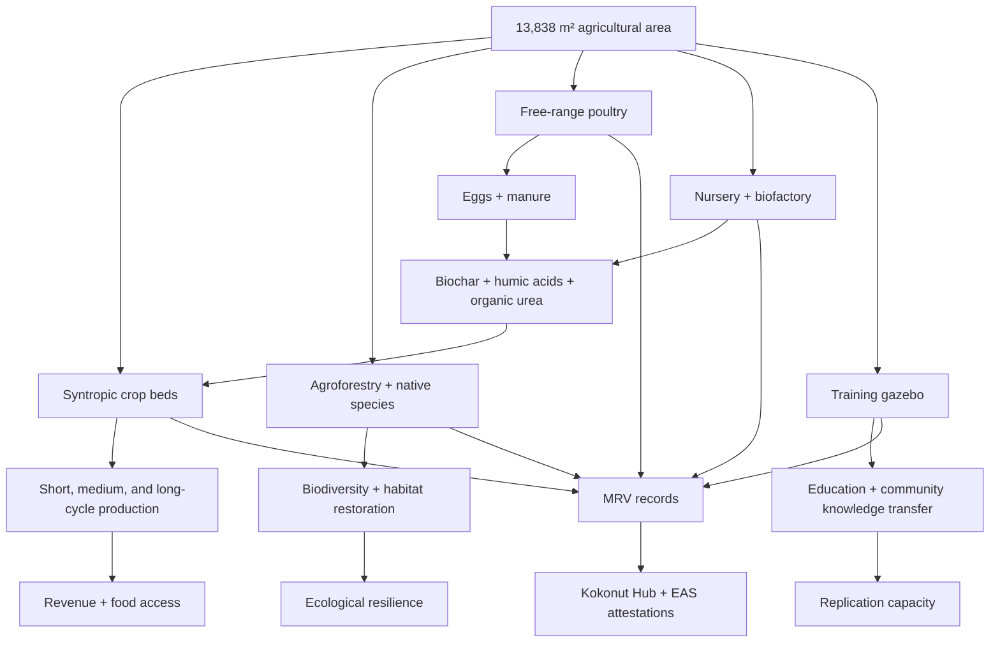

# Adelphi's infrastructure is where the Kokonut model becomes visible.

This page documents the physical system behind Adelphi: the crop beds, syntropic plots, nursery, biofactory, poultry loop, training space, conservation work, and monitoring infrastructure that turn regenerative agriculture from a promise into measurable farm activity.

Adelphi is not only growing crops. It is building a replicable operating model for regenerative farms: diversified production, ecological restoration, on-site inputs, public MRV, community education, and market access.

<div style={{ display: "flex", gap: "12px", justifyContent: "center", flexWrap: "wrap", margin: "1.5rem 0 0.75rem" }}>
  <a href="#system-at-a-glance" style={{ display: "inline-flex", alignItems: "center", gap: "6px", background: "#009F4D", color: "#fff", padding: "10px 20px", borderRadius: "8px", fontWeight: "600", fontSize: "14px", textDecoration: "none" }}>
    See the Farm System →
  </a>

  <a href="https://hub.kokonut.network/projects/41" style={{ display: "inline-flex", alignItems: "center", gap: "6px", border: "1.5px solid #009F4D", color: "#009F4D", padding: "10px 20px", borderRadius: "8px", fontWeight: "600", fontSize: "14px", textDecoration: "none", background: "transparent" }}>
    Explore Live Farm Data
  </a>
</div>

<p style={{ textAlign: "center", fontSize: "13px", color: "#6b7280", marginTop: "0.25rem" }}>
  The infrastructure below produces the crop, biodiversity, poultry, soil, and MRV records that make Adelphi auditable.
</p>

<div style={{ display: "grid", gridTemplateColumns: "repeat(auto-fit, minmax(120px, 1fr))", gap: "1px", background: "#e5e7eb", border: "1px solid #e5e7eb", borderRadius: "12px", overflow: "hidden", margin: "1.5rem 0" }}>
  <div style={{ background: "white", padding: "1rem", textAlign: "center" }}>
    <div style={{ fontSize: "1.35rem", fontWeight: "700", color: "#009F4D", lineHeight: 1 }}>13,838</div>
    <div style={{ fontSize: "0.72rem", color: "#6b7280", marginTop: "4px", fontWeight: "500" }}>m² agricultural area</div>
  </div>

  <div style={{ background: "white", padding: "1rem", textAlign: "center" }}>
    <div style={{ fontSize: "1.35rem", fontWeight: "700", color: "#009F4D", lineHeight: 1 }}>12+</div>
    <div style={{ fontSize: "0.72rem", color: "#6b7280", marginTop: "4px", fontWeight: "500" }}>at-risk species</div>
  </div>

  <div style={{ background: "white", padding: "1rem", textAlign: "center" }}>
    <div style={{ fontSize: "1.35rem", fontWeight: "700", color: "#009F4D", lineHeight: 1 }}>110</div>
    <div style={{ fontSize: "0.72rem", color: "#6b7280", marginTop: "4px", fontWeight: "500" }}>free-range hens</div>
  </div>

  <div style={{ background: "white", padding: "1rem", textAlign: "center" }}>
    <div style={{ fontSize: "1.35rem", fontWeight: "700", color: "#009F4D", lineHeight: 1 }}>100</div>
    <div style={{ fontSize: "0.72rem", color: "#6b7280", marginTop: "4px", fontWeight: "500" }}>eggs / day</div>
  </div>

  <div style={{ background: "white", padding: "1rem", textAlign: "center" }}>
    <div style={{ fontSize: "1.35rem", fontWeight: "700", color: "#009F4D", lineHeight: 1 }}>2</div>
    <div style={{ fontSize: "0.72rem", color: "#6b7280", marginTop: "4px", fontWeight: "500" }}>syntropic plots</div>
  </div>

  <div style={{ background: "white", padding: "1rem", textAlign: "center" }}>
    <div style={{ fontSize: "1.35rem", fontWeight: "700", color: "#009F4D", lineHeight: 1 }}>1</div>
    <div style={{ fontSize: "0.72rem", color: "#6b7280", marginTop: "4px", fontWeight: "500" }}>education gazebo</div>
  </div>
</div>

---

## System at a glance

<CardGroup cols={3}>
  <Card title="Diversified production" icon="wheat-awn">
    Short-cycle vegetables, medium-cycle fruits, perennial coconut trees, and continuous egg production create multiple revenue streams rather than a single-harvest dependency.
  </Card>

  <Card title="Biodiversity and conservation" icon="leaf">
    Native agroforestry species, at-risk fruit trees, ground cover systems, and nursery propagation turn production into ecological restoration.
  </Card>

  <Card title="Closed-loop fertility" icon="arrows-rotate">
    Bamboo biochar, poultry manure, humic acids, organic urea, forage, and crop residues reduce dependence on external synthetic inputs.
  </Card>

  <Card title="Training infrastructure" icon="graduation-cap">
    The gazebo and farm layout support workshops, community education, agroforestry training, and intergenerational knowledge transfer.
  </Card>

  <Card title="Market readiness" icon="store">
    Organic certification, local distribution, and future supermarket relationships create a path from regenerative production to reliable revenue.
  </Card>

  <Card title="Measurable impact" icon="satellite">
    GPS registration, satellite vegetation indices, field observations, and the Kokonut Hub make progress visible to DAO members and partners.
  </Card>
</CardGroup>

<Note>
  This page is the physical counterpart to the MRV page. MRV explains how farm activity becomes public evidence; this page explains the infrastructure that generates that evidence.
</Note>

---

## The Adelphi farm system



Adelphi's infrastructure is designed to answer one practical question:

> Can one farm produce food, restore biodiversity, create jobs, train people, verify impact, and generate revenue without becoming extractive?

The answer depends on the system as a whole — not on a single crop, facility, or funding event.

---

## Production overview

The project allocates **13,838 m²** to an agro-ecological garden designed around three production cycle lengths:

| Cycle | Crops | Revenue role | Why it matters |
| --- | --- | --- | --- |
| Short cycle | Lettuce, broccoli, spinach, tomatoes, arugula, and minor vegetables | Frequent cash flow | Creates near-term harvests and local food access |
| Medium cycle | Passion fruit, Indian yams, and other seasonal crops | Seasonal compounding | Builds revenue as the farm matures |
| Long cycle | Coconut and native agroforestry species | Perennial anchor income | Supports long-term ecological and economic continuity |
| Continuous | Free-range eggs | Daily production stream | Adds recurring revenue and closed-loop fertility |

This multi-cycle structure is central to [syntropic farming](/kokonut-framework/why-syntropic-farming): different species occupy different vertical and temporal niches, support each other's growth, and produce value on different timelines.

Every crop bed, plot boundary, and production zone is individually GPS-registered through [Silvi](https://www.silvi.earth/) and monitored through the [Kokonut MRV stack](/ecosystem-wiki/kokonut-farms/measurement-reporting-and-verification). Vegetation health is tracked with satellite indices including NDVI, NDRE, and MSAVI.

[Read the crop and harvest forecast →](/ecosystem-wiki/kokonut-farms/adelphi/crops-and-harvest-forecast)

---

## Productive diversification and species conservation

<div style={{ display: "flex", gap: "8px", marginBottom: "14px", flexWrap: "wrap" }}>
  <span style={{ background: "#ecfdf5", border: "1px solid #d1fae5", color: "#065f46", fontSize: "11px", fontWeight: "600", padding: "2px 8px", borderRadius: "12px" }}>SDG 15 — Life on Land</span>
  <span style={{ background: "#ecfdf5", border: "1px solid #d1fae5", color: "#065f46", fontSize: "11px", fontWeight: "600", padding: "2px 8px", borderRadius: "12px" }}>SDG 2 — Zero Hunger</span>
</div>

### Fruit and agroforestry production

In the higher areas of the land, Adelphi establishes fruit orchards and agroforestry systems that serve two roles at once: commercial production and ecological restoration.

Primary productive species include:

| Species | Role in the system |
| --- | --- |
| [Passion fruit](https://www.gbif.org/species/2874190) | Medium-cycle fruit revenue and vine-based canopy structure |
| [Indian Yam](https://www.gbif.org/species/2755239) | Medium-cycle food production and local crop diversity |
| Coconut | Long-cycle perennial anchor crop tied to Kokonut's farm-backed token model |
| [Lipsticktree](https://www.gbif.org/species/2874863) | Agroforestry and cultural/ecological value |
| [Custard Apple](https://www.gbif.org/species/5407123) | At-risk fruit species conserved through the nursery |
| [Soursop](https://www.gbif.org/species/5407273) | Fruit production and local agrobiological heritage |

This structure implements the [third principle of regeneration](/kokonut-framework/framework-components/framework-features/5-principles-of-regeneration): enhancing biodiversity through crop rotation, agroforestry, and silvo-pasture techniques.

### Wildlife sustainability and ecological restoration

A multi-species plantation system supports habitat, pollinators, soil structure, and local wildlife across the farm.

| Category | Species | Ecological role |
| --- | --- | --- |
| Palm and canopy | [Hispaniola palmetto](https://www.gbif.org/species/2732565) | Native, regionally significant canopy layer |
| Fruit-bearing | [Naseberry](https://www.gbif.org/species/2884162) | Sapotaceae family, food and habitat value |
| Fruit-bearing | [Star Apple](https://www.gbif.org/species/2885828) | Sapotaceae family, canopy diversity |
| Fruit-bearing | [Mammee Apple](https://www.gbif.org/species/5407123) | High ecological and food value |
| Fruit-bearing | [Custard Apple](https://www.gbif.org/species/5407123) | At-risk species conserved in a nursery |
| Agroforestry | [Jagua](https://www.gbif.org/species/2895593) | Native species with cultural and ecological value |
| Agroforestry | [Cashew](https://www.gbif.org/species/5421368) | Multi-use food and canopy contribution |
| Agroforestry | [Guavaberry](https://www.gbif.org/species/3186420) | Cultural and ecological significance |
| Agroforestry | [Congo coffee tree](https://www.gbif.org/species/2895528) | Understory canopy species |
| Cacao | [Native cacao](https://www.gbif.org/species/3152205) | Native variety and heritage preservation |
| Hedgerow | Florida fiddlewood | Habitat and boundary support |
| Ground cover | Princess vine and bejuco | Ecological corridor support |
| Hardwood | Logwood | Habitat and dyewood species |

### Nursery for at-risk species

<Frame>
  
</Frame>

<sup>The Adelphi biofactory and nursery, where endangered species are propagated, and biological inputs are produced on-site from farm-sourced materials.</sup>

The farm features a specialized nursery dedicated to reproducing endangered, critically threatened, and highly vulnerable plant species native to the Dominican Republic.

Native varieties propagated here are distributed **free of charge** to visitors and nearby communities, making the nursery a public good that extends Adelphi's impact on biodiversity beyond the farm boundary.

This directly implements the [fourth principle of regeneration](/kokonut-framework/framework-components/framework-features/5-principles-of-regeneration): protecting living roots and perennial crops that anchor and restore degraded ecosystems over time.

---

## Agro-ecological techniques and soil regeneration

<div style={{ display: "flex", gap: "8px", marginBottom: "14px", flexWrap: "wrap" }}>
  <span style={{ background: "#ecfdf5", border: "1px solid #d1fae5", color: "#065f46", fontSize: "11px", fontWeight: "600", padding: "2px 8px", borderRadius: "12px" }}>SDG 15 — Life on Land</span>
  <span style={{ background: "#ecfdf5", border: "1px solid #d1fae5", color: "#065f46", fontSize: "11px", fontWeight: "600", padding: "2px 8px", borderRadius: "12px" }}>SDG 13 — Climate Action</span>
</div>

### Biochar for soil improvement

All crops at Adelphi are managed using biochar produced on-site from bamboo found along the farm's boundary perimeter. The production process uses pyrolysis — controlled high-temperature combustion in a low-oxygen environment — and incorporates mineral-rich rocks to improve soil regeneration and nutrient retention.

Biochar supports two outcomes central to the Kokonut Framework:

- **Soil improvement:** better water retention, higher nutrient availability, and improved microbial habitat.
- **Carbon storage:** more stable carbon in the soil compared with fast-decomposing organic residues.

Biochar effects are tracked through soil monitoring, field observations, and annual MRV reporting.

### Syntropic farming plots

Two plots are dedicated to the implementation of full syntropic farming. These plots optimize plant interactions across vertical strata:

| Stratum | Function |
| --- | --- |
| Ground cover | Protects soil, retains moisture, reduces erosion |
| Low canopy | Supports food production and species diversity |
| Medium canopy | Builds fruit and vine productivity |
| High canopy | Provides long-term shade, habitat, roots, and biomass |

The syntropic plots are living demonstrations of [syntropic farming](/kokonut-framework/why-syntropic-farming) applied to Dominican soil conditions, rainfall patterns, native species, and community food needs.

### Vegetative cover and erosion control

Permanent ground cover is implemented using [beard grass](https://www.gbif.org/species/5677150) along the edges of terraced areas. This reduces erosion on sloped terrain, improves soil structure, builds organic matter, and helps the farm remain resilient during periods of heavy rainfall in Monte Plata.

This is a direct implementation of the [second principle of regeneration](/kokonut-framework/framework-components/framework-features/5-principles-of-regeneration): year-round cover crops that prevent bare soil, provide forage, and build organic matter that supports long-term fertility.

---

## Regenerative poultry production

<div style={{ display: "flex", gap: "8px", marginBottom: "14px", flexWrap: "wrap" }}>
  <span style={{ background: "#ecfdf5", border: "1px solid #d1fae5", color: "#065f46", fontSize: "11px", fontWeight: "600", padding: "2px 8px", borderRadius: "12px" }}>SDG 8 — Decent Work</span>
  <span style={{ background: "#ecfdf5", border: "1px solid #d1fae5", color: "#065f46", fontSize: "11px", fontWeight: "600", padding: "2px 8px", borderRadius: "12px" }}>SDG 15 — Life on Land</span>
</div>

### Free-range egg production

Adelphi integrates **110 free-range laying hens**, producing an estimated **100 eggs per day**. The hens are fed with forage grown on-site, primarily Pangola grass, reducing dependency on imported feed while creating a continuous food and revenue stream.

The hens contribute to the farm beyond egg production. They help manage ground cover, add organic matter, reduce pest pressure, and generate manure for biological input production.

### Closed-loop organic waste management

Poultry manure is processed into **humic acids** and **organic urea** for the bio-intensive garden. This replaces synthetic nitrogen inputs with farm-produced fertility.

```text
Pangola grass → hens → eggs + manure →
humic acids + organic urea → crop beds →
healthier crops → more forage → back to hens
```

This closed-loop system implements the [fifth principle of regeneration](/kokonut-framework/framework-components/framework-features/5-principles-of-regeneration): compost and biofertilizers that restore soil fertility through organic matter cycling.

---

## Infrastructure and training

<Frame>
  
</Frame>

<sup>The Adelphi farm polygon — showing the spatial organization of agro-ecological beds, agroforestry zones, syntropic plots, poultry area, and community infrastructure across the 15,725 m² site.</sup>

### Agro-ecological training and education space

<div style={{ display: "flex", gap: "8px", marginBottom: "12px", flexWrap: "wrap" }}>
  <span style={{ background: "#ecfdf5", border: "1px solid #d1fae5", color: "#065f46", fontSize: "11px", fontWeight: "600", padding: "2px 8px", borderRadius: "12px" }}>SDG 4 — Quality Education</span>
  <span style={{ background: "#ecfdf5", border: "1px solid #d1fae5", color: "#065f46", fontSize: "11px", fontWeight: "600", padding: "2px 8px", borderRadius: "12px" }}>SDG 8 — Decent Work</span>
</div>

A multipurpose **gazebo** serves as the farm's community hub. It functions as a dining area, meeting room, training center, and demonstration space.

The education space supports workshops and courses on:

- Organic farming principles and syntropic planting techniques
- Agroforestry design and native species propagation
- Biochar production, soil health, and water retention
- Sustainable poultry management and organic waste processing
- Farm data collection, reporting, and MRV literacy

The education center is designed for farm operators, farmers from nearby communities, children, elders, visitors, and anyone interested in sustainable land stewardship.

### Organic certification and market distribution

<div style={{ display: "flex", gap: "8px", marginBottom: "12px", flexWrap: "wrap" }}>
  <span style={{ background: "#ecfdf5", border: "1px solid #d1fae5", color: "#065f46", fontSize: "11px", fontWeight: "600", padding: "2px 8px", borderRadius: "12px" }}>SDG 2 — Zero Hunger</span>
  <span style={{ background: "#ecfdf5", border: "1px solid #d1fae5", color: "#065f46", fontSize: "11px", fontWeight: "600", padding: "2px 8px", borderRadius: "12px" }}>SDG 12 — Responsible Consumption</span>
</div>

Adelphi is pursuing official **organic certification from the Dominican Republic's Ministry of Agriculture**. Certification is important because it creates a path toward premium market access and formal institutional distribution channels.

Current certification status: **in progress**.

Once certification is achieved, harvested products can be distributed through:

- **Specialized organic food businesses** — direct relationships with organic market networks
- **Local and regional supermarkets** — formal supply chain relationships that support revenue predictability
- **Community direct sales** — local food access alongside commercial distribution

### Expansion and conservation

Adelphi's medium-term plan includes acquiring adjacent land to preserve local flora and fauna while increasing organic vegetable production capacity.

Any land acquisition should go through a formal [DAO funding proposal](/ecosystem-wiki/the-kokonut-dao/proposal-templates), ensuring expansion is governed by the community rather than a single decision-maker.

---

## How is this infrastructure verified?

Adelphi's physical infrastructure produces measurable evidence. The point is not only to describe the farm, but to make its progress inspectable.

| Infrastructure layer | What it produces | How it is verified |
| --- | --- | --- |
| Crop beds | Harvests, crop cycle records, and planting density data | Kokonut Hub, field logs, harvest reports |
| Syntropic plots | Vegetation health, soil cover, multi-strata production | Satellite indices, field observations, GPS records |
| Nursery and biofactory | Native species propagation, biochar, humic acids, organic urea | Nursery inventory, input logs, MRV events |
| Poultry system | Eggs, manure, nutrient cycling, and forage use | Poultry records, soil EC readings, farm logs |
| Training gazebo | Workshops, community engagement, knowledge transfer | Event records, attendance logs, community reports |
| Market infrastructure | Certification progress, buyers, and distribution channels | Certification status, sales records, Data Hub updates |

[Read the full MRV methodology →](/ecosystem-wiki/kokonut-farms/measurement-reporting-and-verification)

---

## What this page proves

<CardGroup cols={2}>
  <Card title="The farm is physically real" icon="location-dot">
    Adelphi is not only a concept. It has mapped plots, crop beds, animals, a nursery, a biofactory, infrastructure, and field-level monitoring.
  </Card>

  <Card title="Regeneration is operational" icon="leaf">
    The five principles are implemented through cover crops, syntropic planting, biodiversity, animal integration, and organic input cycling.
  </Card>

  <Card title="Revenue is designed into the system" icon="chart-line">
    Crop cycles, egg production, and future market channels create practical economic reasons for regeneration to continue.
  </Card>

  <Card title="The model can be audited" icon="badge-check">
    GPS records, satellite indices, soil observations, farm logs, and the Kokonut Hub turn physical work into verifiable public evidence.
  </Card>
</CardGroup>

---

## Next steps

<CardGroup cols={2}>
  <Card title="Crops & Harvest Forecast" icon="dragon" href="/ecosystem-wiki/kokonut-farms/adelphi/crops-and-harvest-forecast">
    The production formula and revenue projections for each crop — including lettuce, passion fruit, coconut, and eggs.
  </Card>

  <Card title="MRV — How it's measured" icon="magnifying-glass-chart" href="/ecosystem-wiki/kokonut-farms/measurement-reporting-and-verification">
    How farm activity becomes structured data, IPFS records, EAS attestations, and public impact evidence.
  </Card>

  <Card title="5 Principles of Regeneration" icon="hand-holding-seedling" href="/kokonut-framework/framework-components/framework-features/5-principles-of-regeneration">
    The Kokonut Framework principles implemented by the infrastructure documented on this page.
  </Card>

  <Card title="Why Syntropic Farming" icon="seedling" href="/kokonut-framework/why-syntropic-farming">
    The methodology behind the syntropic plots and why this farming model compounds ecological value over time.
  </Card>

  <Card title="Sustainable Development Goals" icon="recycle" href="/ecosystem-wiki/kokonut-farms/adelphi/sustainable-development-goals">
    How Adelphi's crops, infrastructure, and community programs align with the five UN SDGs.
  </Card>

  <Card title="Help replicate this model" icon="telescope" href="/ecosystem-wiki/open-collaboration-invitation">
    Contribute as an agronomist, researcher, developer, DAO member, capital allocator, or community organizer.
  </Card>
</CardGroup>

<div style={{ display: "flex", gap: "12px", justifyContent: "center", flexWrap: "wrap", margin: "2rem 0 0.75rem" }}>
  <a href="https://hub.kokonut.network/projects/41" style={{ display: "inline-flex", alignItems: "center", gap: "6px", background: "#009F4D", color: "#fff", padding: "10px 20px", borderRadius: "8px", fontWeight: "600", fontSize: "14px", textDecoration: "none" }}>
    Explore Live Farm Data →
  </a>

  <a href="/ecosystem-wiki/open-collaboration-invitation" style={{ display: "inline-flex", alignItems: "center", gap: "6px", border: "1.5px solid #009F4D", color: "#009F4D", padding: "10px 20px", borderRadius: "8px", fontWeight: "600", fontSize: "14px", textDecoration: "none", background: "transparent" }}>
    Help Replicate the Model
  </a>
</div>