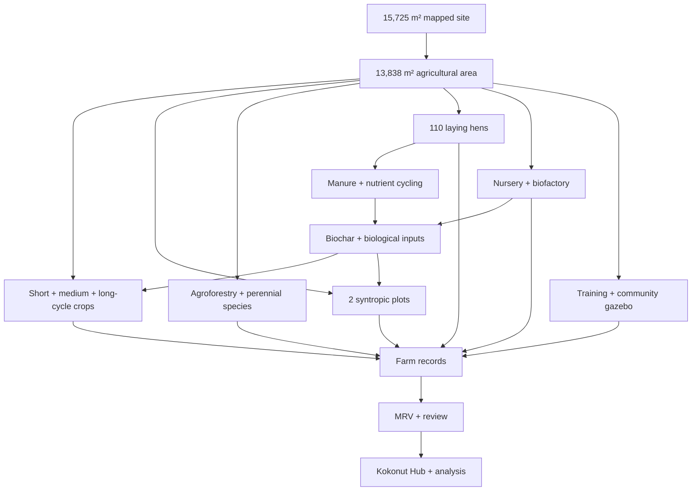
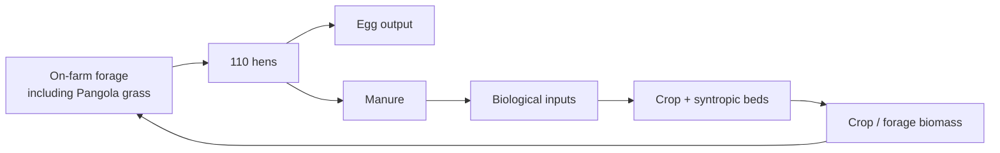

# Adelphi's physical systems turn the farm model into something that can be inspected.

This page documents the **physical operating system** of Adelphi: crop beds, syntropic plots, perennial species, nursery, biofactory, poultry, soil inputs, training infrastructure, geospatial layout, and market-readiness work.

The purpose is not to infer impact from infrastructure alone.

It is to show:

1. what is physically documented;
2. what each component is designed to do;
3. which outputs are measured versus estimated;
4. what evidence would be needed to support stronger ecological, economic, or community claims.

<CardGroup cols={2}>
  <Card title="Start with the farm overview" icon="seedling" href="/ecosystem-wiki/kokonut-farms/adelphi/summary">
    Review Adelphi's documented state, Framework phase, forecast boundaries, and current evidence model.
  </Card>

  <Card title="Inspect published farm records" icon="chart-line" href="https://hub.kokonut.network/projects/41">
    Use the Kokonut Hub for current published farm records, MRV events, harvest information, and project data.
  </Card>
</CardGroup>

<Info>
  **Infrastructure is evidence of implementation, not proof of outcome.** A nursery proves the nursery exists. A biochar application proves a practice occurred. Claims about biodiversity recovery, soil improvement, food security, or revenue require additional records and measurement.
</Info>

---

## Documented system at a glance

<CardGroup cols={3}>
  <Card title="13,838 m²" icon="map">
    Documented agricultural area within Adelphi's 15,725 m² mapped site.
  </Card>

  <Card title="110 hens" icon="egg">
    Documented free-range laying-hen component.
  </Card>

  <Card title="~100 eggs/day" icon="basket-shopping">
    Current planning estimate for poultry output, not a substitute for daily production records.
  </Card>

  <Card title="2 syntropic plots" icon="seedling">
    Two plots are documented for full syntropic implementation.
  </Card>

  <Card title="12+ species" icon="leaf">
    Current repository materials identify 12+ native or at-risk species in the nursery and agroforestry system.
  </Card>

  <Card title="1 training gazebo" icon="school">
    Multipurpose space for meetings, meals, demonstrations, workshops, and community activity.
  </Card>
</CardGroup>

<Note>
  Counts such as egg output, nursery inventory, and species status can change. Current records should take precedence over static documentation when newer evidence is available.
</Note>

---

## The farm system

```mermaid
flowchart TD
    LAND["15,725 m² mapped site"] --> AG["13,838 m² agricultural area"]

    AG --> CROPS["Short + medium + long-cycle crops"]
    AG --> SYNTROPIC["2 syntropic plots"]
    AG --> AGRO["Agroforestry + perennial species"]
    AG --> POULTRY["110 laying hens"]
    AG --> NURSERY["Nursery + biofactory"]
    AG --> GAZEBO["Training + community gazebo"]

    NURSERY --> INPUTS["Biochar + biological inputs"]
    POULTRY --> MANURE["Manure + nutrient cycling"]
    MANURE --> INPUTS
    INPUTS --> CROPS
    INPUTS --> SYNTROPIC

    CROPS --> RECORDS["Farm records"]
    SYNTROPIC --> RECORDS
    AGRO --> RECORDS
    POULTRY --> RECORDS
    NURSERY --> RECORDS
    GAZEBO --> RECORDS

    RECORDS --> MRV["MRV + review"]
    MRV --> HUB["Kokonut Hub + analysis"]
```

The system is designed so production, regeneration, inputs, animals, education, and evidence are connected.

The strength of any outcome claim still depends on the records generated by those components.

---

## Physical systems inventory

| System | Current documented state | Intended role | Evidence that should exist |
| --- | --- | --- | --- |
| **Crop beds** | Short-, medium-, and long-cycle production areas | Diversified food and revenue production | Planting logs, harvest records, losses, plot records |
| **Syntropic plots** | Two dedicated plots | Test multi-strata regenerative production | Plot maps, species records, field notes, soil/vegetation observations |
| **Agroforestry / perennial layer** | Coconut plus native and fruit-bearing species | Perennial production, canopy structure, biodiversity | Tree inventory, GPS records, phenology, survival and harvest records |
| **Nursery** | Native and at-risk species propagation | Conservation, propagation, education, distribution | Inventory, propagation records, distribution logs, species provenance |
| **Biofactory** | On-site biological-input production | Reduce external input dependence and support soil management | Input recipes, batch logs, application records |
| **Biochar system** | Bamboo-derived biochar documented as an on-site practice | Soil amendment and longer-lived carbon input | Production logs, application rates, soil observations, methodology |
| **Poultry** | 110 free-range laying hens | Eggs, manure, forage integration, nutrient cycling | Hen count, feed/forage records, egg logs, manure/input records |
| **Training gazebo** | Multipurpose education/community space | Workshops, meetings, demonstrations, meals | Event logs, attendance, curriculum, feedback |
| **Geospatial / MRV infrastructure** | GPS, remote sensing, farm records, public Hub | Make physical activity inspectable | Coordinates, imagery, record provenance, review state |
| **Certification / market readiness** | Organic certification documented as in progress | Improve market access and buyer options | Certification records, buyer records, sales/distribution actuals |

---

## Production across multiple time horizons

Adelphi does not depend on one crop cycle.

| Production horizon | Documented examples | Role |
| --- | --- | --- |
| **Short cycle** | Lettuce, broccoli, spinach, tomatoes, arugula and other vegetables | Faster production cycles and near-term cash-flow potential |
| **Medium cycle** | Passion fruit, Indian yam and other seasonal crops | Seasonal diversification |
| **Long cycle** | Coconut and perennial agroforestry species | Long-duration production and ecological structure |
| **Continuous** | Poultry eggs | Recurring farm output and nutrient-cycle integration |

The mix supports diversification across time.

It does **not** guarantee diversified revenue.

Actual economic performance depends on:

- survival;
- harvest volume;
- losses;
- prices;
- labor;
- buyers;
- logistics;
- crop timing;
- poultry productivity.

[Read the detailed forecast and assumptions →](/ecosystem-wiki/kokonut-farms/adelphi/crops-and-harvest-forecast)

---

## Crop and agroforestry diversity

The current repository documents a mix of food crops, perennial species, and agroforestry plants.

### Productive species documented in the system

| Species / crop | Current role in Adelphi |
| --- | --- |
| Lettuce and companion vegetables | Short-cycle production |
| Passion fruit | Medium-cycle fruit production |
| Indian yam | Medium-cycle food crop |
| Coconut | Long-cycle perennial crop |
| Soursop | Fruit and agroforestry diversity |
| Custard apple | Nursery / fruit diversity |
| Lipsticktree | Agroforestry and cultural/ecological use |

### Native and at-risk nursery / agroforestry species documented in the repository

Current farm materials reference species including:

- Hispaniola palmetto;
- native cacao;
- guavaberry;
- Congo coffee tree;
- jagua;
- naseberry;
- Star Apple;
- Mammee Apple;
- Custard Apple;
- cashew;
- soursop;
- lipsticktree;
- Florida fiddlewood;
- logwood;
- additional ground-cover and vine species.

<Warning>
  The repository uses terms such as **native**, **at-risk**, **endangered**, and **critically threatened** in different places. Those conservation-status claims should be verified species by species against an authoritative source before being used in external reporting. This page therefore treats the list as the **documented nursery/agroforestry inventory**, not as an independently validated conservation-status register.
</Warning>

The nursery also documents free distribution of propagated plants to visitors and nearby communities.

To support that as a recurring public-good outcome, future records should include:

- species;
- quantity propagated;
- quantity surviving;
- quantity distributed;
- recipient or destination class;
- date;
- propagation source;
- follow-up where practical.

---

## Nursery and biofactory

<Frame>
  
</Frame>

The nursery and biofactory combine two functions:

<CardGroup cols={2}>
  <Card title="Propagation" icon="sprout">
    Maintain and reproduce productive, native, and at-risk plant material for the farm, education, and distribution.
  </Card>

  <Card title="Biological inputs" icon="flask">
    Produce farm inputs such as biochar, humic-acid preparations, organic urea, and related biological amendments documented in the Framework.
  </Card>
</CardGroup>

These are **implemented practices**.

Claims that they have improved soil fertility, reduced input costs, increased yield, or restored biodiversity require separate evidence.

---

## Biochar and soil-management practices

The repository documents biochar produced from bamboo found around the farm boundary.

The documented process uses pyrolysis and incorporates mineral material as part of the farm's soil-input practice.

The intended functions include:

- adding stable carbon-rich material to soil;
- supporting nutrient retention;
- supporting water-management objectives;
- creating habitat for soil biological processes;
- reusing locally available biomass.

Those are **mechanistic expectations**, not measured Adelphi outcomes by themselves.

A stronger Adelphi soil claim should include evidence such as:

| Evidence | Why it matters |
| --- | --- |
| Application date and rate | Establishes what intervention actually occurred |
| Plot / location | Connects treatment to later observations |
| Baseline soil condition | Makes change interpretable |
| Repeated measurements | Shows direction over time |
| Moisture / EC / organic-matter context | Helps interpret soil response |
| Control or comparison where possible | Reduces attribution error |

[See the MRV evidence standard →](/ecosystem-wiki/kokonut-farms/measurement-reporting-and-verification)

---

## Syntropic plots and ground cover

Two plots are documented as dedicated syntropic implementations.

Their design uses multiple vertical and temporal layers.

| Layer | Intended function |
| --- | --- |
| **Ground cover** | Protect exposed soil and retain surface moisture |
| **Low layer** | Food production and species diversity |
| **Medium layer** | Fruit, vine, and intermediate biomass production |
| **Upper layer** | Longer-lived canopy, roots, biomass, habitat, and shade |

The farm also documents vegetative cover along terraced edges, including beard grass.

The intended purpose is to reduce bare soil and support erosion management.

A strong erosion-control claim still requires evidence such as:

- slope/location records;
- ground-cover percentage;
- rainfall period;
- erosion observations;
- before/after imagery;
- sediment or soil-loss indicators where practical.

<CardGroup cols={2}>
  <Card title="Why Syntropic Farming" icon="seedling" href="/kokonut-framework/why-syntropic-farming">
    Understand the agricultural logic behind multi-strata, succession-oriented regenerative systems.
  </Card>

  <Card title="5 Principles of Regeneration" icon="hand-holding-seedling" href="/kokonut-framework/framework-components/framework-features/5-principles-of-regeneration">
    Review the shared Framework principles behind soil cover, diversity, perennial systems, animal integration, and organic inputs.
  </Card>
</CardGroup>

---

## Poultry as production and nutrient infrastructure

Adelphi documents **110 free-range laying hens**.

The current production model estimates roughly **100 eggs per day** or **36,500 eggs per year**.

<Warning>
  The egg number is a **planning estimate** until reconciled against daily or periodic production records. Hen count and expected laying rate should not be presented as realized annual egg output.
</Warning>

The poultry system is designed to provide:

- eggs;
- manure;
- forage integration;
- organic matter;
- biological-input feedstock;
- an additional production stream.

The repository also documents Pangola grass as an on-site forage source.

That can support a reduced-external-feed strategy, but the actual degree of feed substitution should be measured through feed records rather than assumed.

### Documented nutrient loop

```mermaid
flowchart LR
    FORAGE["On-farm forage<br/>including Pangola grass"] --> HENS["110 hens"]
    HENS --> EGGS["Egg output"]
    HENS --> MANURE["Manure"]
    MANURE --> INPUTS["Biological inputs"]
    INPUTS --> BEDS["Crop + syntropic beds"]
    BEDS --> BIOMASS["Crop / forage biomass"]
    BIOMASS --> FORAGE
```

This is best described as a **designed nutrient loop**.

Its efficiency should be evaluated through feed, manure, input, soil, crop, and egg records.

---

## Training and community infrastructure

<Frame>
  
</Frame>

The multipurpose gazebo is documented as:

- dining space;
- meeting space;
- training area;
- demonstration area;
- community gathering infrastructure.

Topics supported by the documented program design include:

- organic and syntropic farming;
- agroforestry;
- nursery propagation;
- biochar and soil practices;
- poultry integration;
- farm-data collection;
- MRV literacy.

The physical space exists.

Community-learning outcomes should be supported separately through:

- event logs;
- attendance;
- audience type;
- topics taught;
- repeat participation;
- feedback;
- evidence that skills were later applied.

---

## Organic certification and market readiness

The current repository documents Adelphi's **organic certification process as in progress through the Dominican Republic Ministry of Agriculture pathway**.

That status should be read literally:

**in progress ≠ certified.**

Potential distribution channels described in current planning include:

- specialized organic-food businesses;
- local and regional supermarkets;
- direct community sales.

These are **market-access goals**, not evidence of active buyer contracts or realized sales unless supported by current commercial records.

<Card title="Forecasts and market assumptions" icon="calculator" href="/ecosystem-wiki/kokonut-farms/adelphi/crops-and-harvest-forecast">
  Review the price, yield, loss, distribution, and revenue assumptions separately from actual farm performance.
</Card>

---

## Adjacent land is now a separate replication case

Older Adelphi documentation describes adjacent land as a future Adelphi expansion strategy.

The current Kokonut 101 and Regenerative Finance documentation now identifies roughly **50,000 m² of adjacent land under agreement as Kokonut Terra Viva**, a separate replication case entering **Phase I — Planning & Preparation**.

That distinction matters.

Adelphi is the first live reference farm.

Terra Viva is the next farm-scale test of whether Kokonut's shared Framework can move into a new implementation without simply expanding the same farm.

<Card title="Terra Viva — next replication test" icon="diagram-project" href="/playbooks/regenerative-finance/case-studies">
  Review the currently documented Phase I status and why the adjacent land is treated as a separate implementation rather than part of Adelphi's existing physical infrastructure.
</Card>

---

## How each system should become evidence

| Physical system | Strong current claim | Stronger claim requires |
| --- | --- | --- |
| **Crop beds** | Crops and production areas are documented | Harvest actuals, losses, quality, sales |
| **Syntropic plots** | Two syntropic plots are implemented | Repeated soil, vegetation, yield, and biodiversity evidence |
| **Nursery** | Nursery and species inventory exist | Propagation, survival, distribution, and conservation-status records |
| **Biochar** | On-site biochar practice is documented | Application records plus repeated soil measurements |
| **Poultry** | 110 hens are documented | Egg actuals, feed inputs, health, losses, manure records |
| **Biofactory** | Biological-input production is documented | Batch records, application rates, cost/use data, soil/crop response |
| **Gazebo** | Training/community space exists | Event records, attendance, learning and participation outcomes |
| **Certification** | Process is documented as in progress | Formal certification record |
| **Market channels** | Target channels are documented | Buyer agreements, sales, prices, distribution records |
| **Remote sensing / GPS** | Geospatial evidence can be collected | Repeated, reviewed records tied to specific claims |

---

## What this infrastructure demonstrates today

<CardGroup cols={2}>
  <Card title="The farm has multiple operating systems" icon="puzzle">
    Production, poultry, nursery, biofactory, syntropic plots, training space, and evidence infrastructure exist within one farm context.
  </Card>

  <Card title="Diversification is designed into the farm" icon="wheat-awn">
    Crop timelines, perennial systems, poultry, species propagation, and biological inputs reduce dependence on a single production mechanism.
  </Card>

  <Card title="Regenerative practices are being implemented" icon="leaf">
    Biochar, ground cover, syntropic planting, agroforestry, native-species work, and nutrient cycling are documented practices.
  </Card>

  <Card title="Physical activity can generate structured evidence" icon="magnifying-glass-chart">
    Crop, species, poultry, input, geospatial, event, and infrastructure records can feed MRV and public reporting.
  </Card>
</CardGroup>

### What the infrastructure does not prove by itself

- increased biodiversity;
- improved soil function;
- carbon sequestration;
- reduced erosion;
- lower input costs;
- higher yield;
- reliable market access;
- realized farm profitability;
- improved community learning;
- local food-security impact.

Those are outcomes to measure, not properties to infer automatically from design.

---

## Continue through Adelphi

<CardGroup cols={2}>
  <Card title="Crops & Harvest Forecast" icon="calculator" href="/ecosystem-wiki/kokonut-farms/adelphi/crops-and-harvest-forecast">
    Review the production formulas, loss assumptions, prices, yield forecasts, egg estimate, and forecast-vs-actual logic.
  </Card>

  <Card title="MRV — Evidence Standard" icon="magnifying-glass-chart" href="/ecosystem-wiki/kokonut-farms/measurement-reporting-and-verification">
    Understand how these physical systems should generate observations, measurements, reviewed records, attestations, and interpretations.
  </Card>

  <Card title="Adelphi Problem & Solution" icon="chalkboard" href="/ecosystem-wiki/kokonut-farms/adelphi/problem-and-solution">
    See which implemented systems respond to documented constraints and which intended outcomes still need evidence.
  </Card>

  <Card title="Sustainable Development Goals" icon="recycle" href="/ecosystem-wiki/kokonut-farms/adelphi/sustainable-development-goals">
    Connect crops, jobs, biodiversity, women-led operations, and community infrastructure to explicit SDG evidence requirements.
  </Card>

  <Card title="Why Syntropic Farming" icon="seedling" href="/kokonut-framework/why-syntropic-farming">
    Read the agricultural methodology behind the farm's multi-strata and succession-oriented design.
  </Card>

  <Card title="Open Collaboration" icon="telescope" href="/ecosystem-wiki/open-collaboration-invitation">
    Contribute to agronomy, biodiversity records, soil methods, infrastructure documentation, MRV, data quality, or farm tooling.
  </Card>
</CardGroup>

> **The physical system matters because it creates the conditions for outcomes. The evidence system matters because it tells us which outcomes actually occurred.**
