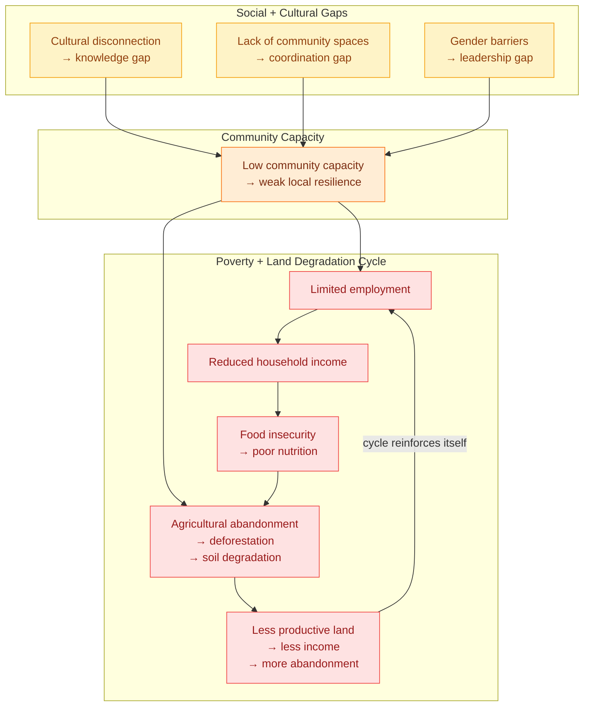

<Frame>
  
</Frame>

Public Nouns Proposal #69 funded Adelphi's critical infrastructure — enabling the farm to be designed as a public good from day one rather than a private return-maximizing project. The flywheel above shows how that investment creates value that compounds outward: farm infrastructure → community employment → organic food production → educational programs → biodiversity restoration → back into the community.

---

## From global problem to local community

The [global agricultural funding gap](/ecosystem-wiki/kokonut-101/problem) — where grassroots farmers lack access to capital while corporations control over 90% of the market — is not an abstraction. It is felt at the community level as seven interlocking, compounding challenges.

In the area surrounding Adelphi, near the batey and Haty community in Gonzalo, Sabana Grande de Boyá, Monte Plata, Dominican Republic, these challenges are daily realities for the people Yanny and Neury Hernández built this farm to serve. The problems below are not hypothetical — they were documented through community engagement as part of the [Public Nouns Proposal #69](https://publicnouns.wtf/vote/69) process that funded Adelphi's infrastructure.

Each problem compounds the others. Limited employment reduces income, which reduces food access, which increases malnutrition, which reduces community capacity to farm, which reduces employment. The seven challenges below are not independent — they form a cycle that requires a systemic solution, not a single intervention.

Adelphi is that systemic solution.

---

## The seven challenges — and how Adelphi addresses each one

### 1. Economic Hardship & Limited Employment Opportunities

  SDG 1 — No Poverty
  SDG 8 — Decent Work

- **Problem:** Many in the community, including Yanny and Neury, struggle with the high cost of living and limited economic opportunities, with most available income sources requiring migration to urban centers, hollowing out rural community capacity over time.
- **Solution:** Adelphi creates a **sustainable source of income** through organic agriculture, while also generating **7 documented jobs** for the community. The farm's three-cycle crop model projects approximately **\$149,110 in annual revenue** — distributed within the local community through employment and the farm's 10% public goods allocation. [See the full harvest forecast →](/ecosystem-wiki/kokonut-farms/adelphi/crops-and-harvest-forecast)

---

### 2. Lack of Access to Sustainable Farming & Education

  SDG 8 — Decent Work

- **Problem:** Traditional agricultural practices in the region often degrade the land, and knowledge of sustainable farming methods is limited, leaving communities without the tools to build long-term productive capacity from the soil they tend.
- **Solution:** Adelphi provides **training and workshops** on organic farming and soil regeneration through a dedicated agro-ecological education center — a multipurpose gazebo serving as a dining area, meeting room, and training facility. Farmers and community members gain practical skills in biochar application, syntropic planting, and organic pest management. [See the infrastructure →](/ecosystem-wiki/kokonut-farms/adelphi/crops-biodiversity-and-infrastructure)

---

### 3. Food Insecurity & Poor Nutrition

  SDG 2 — Zero Hunger

- **Problem:** The local community lacks consistent access to fresh, organic, and nutritious food, leading to dependence on imported or processed products that are less nutritious and more expensive than what the local land could produce.
- **Solution:** By growing **organic and agroecological crops** — lettuce, broccoli, spinach, tomatoes, arugula, passion fruit, Indian yam, and coconut — Adelphi increases access to **healthy, locally sourced food** across all three crop cycles. Short-cycle vegetables provide a rapid, continuous supply; medium and long-cycle crops build nutritional diversity and income stability over time. [See crop diversity →](/ecosystem-wiki/kokonut-farms/adelphi/crops-biodiversity-and-infrastructure)

---

### 4. Environmental Degradation & Loss of Biodiversity

  SDG 15 — Life on Land

- **Problem:** Deforestation, poor farming practices, and lack of conservation efforts contribute to soil depletion and biodiversity loss in the region — a consequence of the financial incentive gap that makes destructive short-term land use more economically rational than regenerative long-term stewardship.
- **Solution:** Adelphi promotes **agroforestry, biodiversity conservation, and soil regeneration** through biochar enrichment produced on-site from bamboo, a specialized nursery for endangered plant species, and syntropic multi-strata planting. The nursery propagates over a dozen at-risk native species — including Hispaniola palmetto, Naseberry, Star Apple, Jagua, native cacao, Congo coffee tree, and guavaberry — distributed **free** to visitors and neighboring communities. [See biodiversity program →](/ecosystem-wiki/kokonut-farms/adelphi/crops-biodiversity-and-infrastructure)

---

### 5. Social & Cultural Disconnection from the Land

  SDG 2 — Zero Hunger
  SDG 15 — Life on Land

- **Problem:** Many younger generations in rural areas have grown up disconnected from traditional farming knowledge and sustainable land use — a generational knowledge gap that weakens community resilience and accelerates agricultural abandonment.
- **Solution:** The farm serves as an **educational and community hub**, offering hands-on activities for children and adults to reconnect with nature, preserve cultural farming traditions, and learn syntropic and organic methods. Yanny and Neury plan regular weekend programs in partnership with the nearby batey and Haty community — bridging urban-raised families back to the land their grandparents worked. [Read the founders' story →](/ecosystem-wiki/kokonut-farms/adelphi/background-story)

---

### 6. Limited Recreational & Educational Spaces for the Community

  SDG 1 — No Poverty
  SDG 8 — Decent Work

- **Problem:** The community lacks safe, engaging spaces for learning, recreation, and social gathering — limiting the collective capacity to share knowledge, organize cooperative activity, or provide enriching experiences for children and the elderly.
- **Solution:** Adelphi will host **regular weekend programs** for children, the elderly, and other community members — fostering community engagement and well-being through educational, recreational, and leisure activities. The multipurpose gazebo serves as a permanent training and meeting facility, and the farm's natural environment provides a restorative green space accessible to the community. Infrastructure was made possible by the [Public Nouns #69](https://publicnouns.wtf/vote/69) public goods funding that financed Adelphi's critical infrastructure by design.

---

### 7. Gender Inequality & Limited Opportunities for Women

  SDG 5 — Gender Equality

- **Problem:** Women in rural agricultural communities often face legal and cultural barriers to economic independence, land ownership, and leadership in farming operations — excluding the majority of community knowledge-holders from the decision-making processes that shape their livelihoods.
- **Solution:** As a **women-led** initiative founded and operated by sisters Yanny and Neury Hernández, Adelphi demonstrates female leadership in agriculture at every level — ownership, operational management, community engagement, and educational programming. This model embodies the [Kokonut Manifesto's](/ecosystem-wiki/kokonut-101/manifesto) principle that anyone who adds value should have access to governance and ownership — regardless of prior wealth, status, or gender. [Read Yanny and Neury's story →](/ecosystem-wiki/kokonut-farms/adelphi/background-story) · [SDG 5 alignment →](/ecosystem-wiki/kokonut-farms/adelphi/sustainable-development-goals)

---

## How the seven challenges compound

These problems do not operate independently. They form a reinforcing cycle that requires all seven solutions to operate simultaneously — which is why Adelphi is designed as an integrated system, not a collection of separate interventions.

Each of Adelphi's seven solutions interrupts a different point in this cycle. Together they constitute a systemic response — not a single intervention that treats one symptom while the others continue.

---

> **Kokonut Adelphi is tackling economic struggles, food insecurity, environmental damage, lack of sustainable education, and social disconnection — while empowering women and fostering a strong, self-sufficient community.** 🌱✨

---

<CardGroup cols={2}>
  <Card title="Crops, Biodiversity & Infrastructure" icon="puzzle" href="/ecosystem-wiki/kokonut-farms/adelphi/crops-biodiversity-and-infrastructure">
    The physical infrastructure behind each solution — production beds, the education gazebo, the endangered species nursery, the poultry system, and agroforestry plots.
  </Card>

  <Card title="Crops & Harvest Forecast" icon="dragon" href="/ecosystem-wiki/kokonut-farms/adelphi/crops-and-harvest-forecast">
    The detailed production formula and revenue projections that back the economic solution — how \$149,110/yr is calculated across three crop cycles.
  </Card>

  <Card title="Background Story" icon="rectangle-history" href="/ecosystem-wiki/kokonut-farms/adelphi/background-story">
    How Yanny and Neury Hernández built Adelphi from a dream — and what it means for the community around them to have women leading the farm.
  </Card>

  <Card title="Sustainable Development Goals" icon="recycle" href="/ecosystem-wiki/kokonut-farms/adelphi/sustainable-development-goals">
    The full SDG alignment — how each of Adelphi's five SDGs is addressed, measured, and reported through the Kokonut Framework.
  </Card>

  <Card title="MRV — How is the impact verified" icon="magnifying-glass-chart" href="/ecosystem-wiki/kokonut-farms/measurement-reporting-and-verification">
    The measurement and verification stack that turns these solutions into tamper-proof on-chain records — satellite monitoring, soil probes, EAS attestations.
  </Card>

  <Card title="Kokonut Problem Statement" icon="circle-info" href="/ecosystem-wiki/kokonut-101/problem">
    The global context — how the coordination failure that created these seven local challenges operates at scale, and why blockchain governance specifically closes it.
  </Card>
</CardGroup>