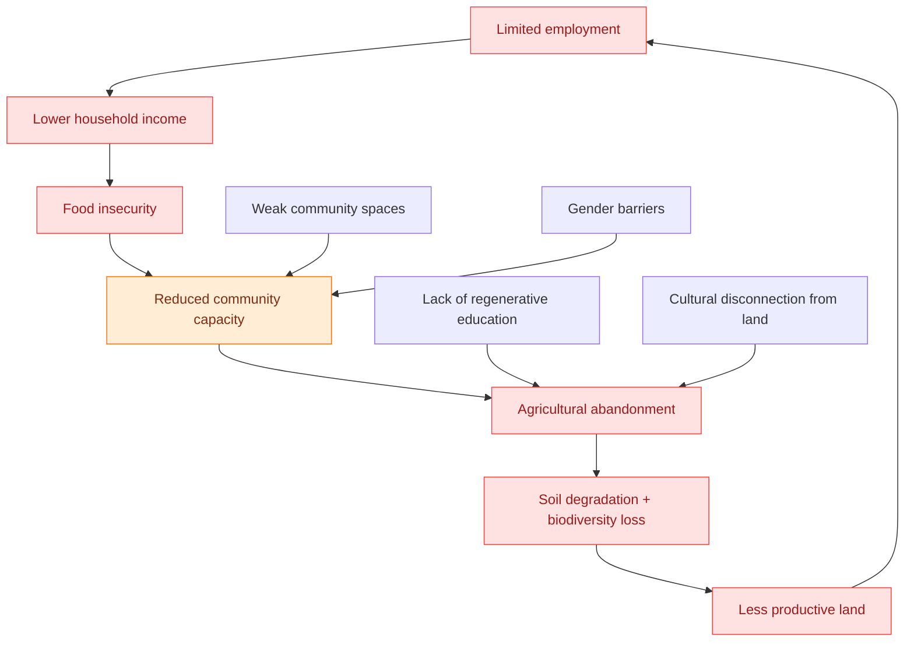
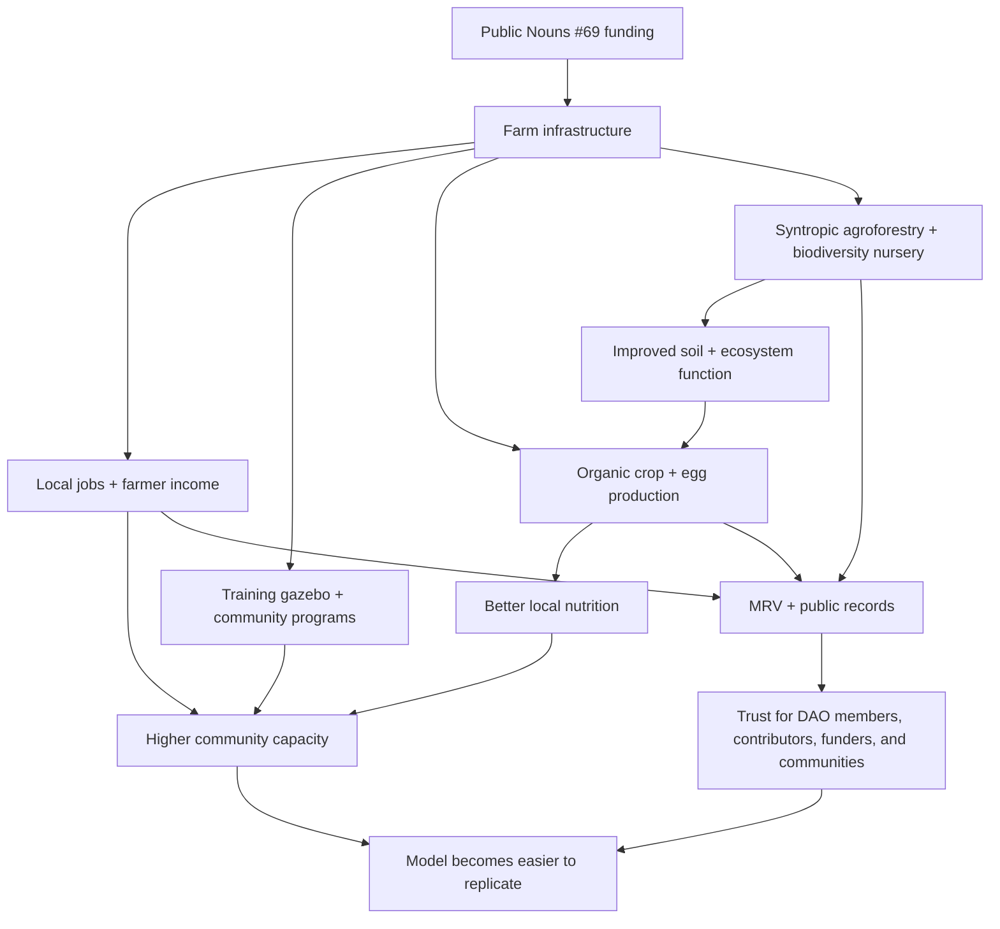

# Adelphi turns local challenges into a regenerative community system.

Adelphi is not solving one isolated problem. It is responding to a compound local reality: limited employment, food insecurity, degraded land, loss of farming knowledge, lack of community spaces, gender barriers, and limited access to regenerative education.

The farm was designed as a systemic response. Public goods funding helped build the infrastructure. Syntropic farming turns the land into a productive living system. Community programs reconnect people to agriculture. MRV makes progress visible. The Kokonut Framework turns the whole model into something other farms can learn from and replicate.

  <a href="#the-seven-local-challenges" style={{ display: "inline-flex", alignItems: "center", gap: "6px", background: "#009F4D", color: "#fff", padding: "10px 20px", borderRadius: "8px", fontWeight: "600", fontSize: "14px", textDecoration: "none" }}>
    See the Seven Solutions →
  </a>

  <a href="https://hub.kokonut.network/projects/41" style={{ display: "inline-flex", alignItems: "center", gap: "6px", border: "1.5px solid #009F4D", color: "#009F4D", padding: "10px 20px", borderRadius: "8px", fontWeight: "600", fontSize: "14px", textDecoration: "none", background: "transparent" }}>
    Explore Live Farm Data
  </a>

  Adelphi is the local proof case for Kokonut's broader thesis: the problem is not the land — it is the coordination layer around it.

---

## From a global problem to a local community

The [global agricultural funding gap](/ecosystem-wiki/kokonut-101/problem) is not abstract. It appears in communities as underused land, limited employment opportunities, limited access to fresh food, weak local infrastructure, environmental degradation, and a lack of trusted reporting systems.

In the area surrounding Adelphi — near the batey and Haty community in Gonzalo, Sabana Grande de Boyá, Monte Plata, Dominican Republic — these pressures are real community conditions. Yanny and Neury Hernández built Adelphi to respond directly to those conditions.

<Note>
  Adelphi is not a donation project. It is a productive syntropic farm, a community learning space, a biodiversity restoration site, a women-led agricultural enterprise, and a live data source for the Kokonut Framework.
</Note>

<Frame>
  
</Frame>

Public Nouns Proposal #69 funded Adelphi's critical infrastructure, helping the farm start as a public good from day one. The value flywheel shows how infrastructure creates community employment, organic food production, education, biodiversity restoration, and public data that can inform the next farm.

---

## Proof at a glance

  

    
15,725

    
m² total area

  

  

    
13,838

    
m² agricultural

  

  

    
7

    
jobs supported

  

  

    
110

    
free-range hens

  

  

    
5

    
UN SDGs addressed

  

  

    
PN #69

    
public goods funded

  

---

## The seven local challenges

<CardGroup cols={2}>
  <Card title="1. Economic hardship" icon="briefcase">
    Residents need stable income opportunities that do not require them to migrate from the community.
  </Card>

  <Card title="2. Limited regenerative education" icon="graduation-cap">
    Farmers and families need practical access to organic, syntropic, and soil-regenerating methods.
  </Card>

  <Card title="3. Food insecurity" icon="wheat-awn">
    Communities need fresh, local, nutritious food rather than relying solely on imported or processed products.
  </Card>

  <Card title="4. Environmental degradation" icon="tree">
    The land needs soil restoration, biodiversity, agroforestry, and incentives for long-term stewardship.
  </Card>

  <Card title="5. Cultural disconnection from land" icon="people-arrows">
    Younger generations need spaces where farming knowledge can be practiced, taught, and renewed.
  </Card>

  <Card title="6. Lack of community spaces" icon="house-chimney-heart">
    Children, elders, farmers, and families need safe gathering places for learning, recreation, and coordination.
  </Card>

  <Card title="7. Gender inequality" icon="venus">
    Women need visible leadership pathways in ownership, farm operations, education, and community governance.
  </Card>

  <Card title="One integrated response" icon="diagram-project">
    Adelphi addresses these issues together because each problem reinforces the others.
  </Card>
</CardGroup>

---

## How the challenges compound

Each challenge weakens the community's ability to respond to the others. That is why Adelphi was designed as a whole system: income, food, education, biodiversity, social infrastructure, women-led leadership, and measurable impact working together.

---

## The seven solutions

### 1. Economic hardship → regenerative employment and revenue

  SDG 1 — No Poverty
  SDG 8 — Decent Work

**Problem:** Many families face limited income opportunities, and available work often requires migration to urban centers. This weakens local capacity and disconnects people from productive land.

**Adelphi's response:** Adelphi creates documented local employment through organic and syntropic agriculture. The farm currently supports **7 jobs**, and its three-cycle crop model projects approximately **\$149,110.26 in annual revenue** before actuals are reconciled through live records.

<Note>
  Revenue projections are planning figures. Actual harvest and financial records should be checked against the Kokonut Hub as data is reported.
</Note>

[See the full harvest forecast →](/ecosystem-wiki/kokonut-farms/adelphi/crops-and-harvest-forecast)

---

### 2. Limited regenerative education → a living training center

  SDG 8 — Decent Work
  SDG 15 — Life on Land

**Problem:** Sustainable farming knowledge is not evenly available. Communities may know the land, but still lack access to practical training in syntropic planting, organic pest management, soil regeneration, and farm data practices.

**Adelphi's response:** Adelphi serves as a training site where local farmers and community members can learn by working directly with the land. The multipurpose gazebo serves as a dining area, meeting room, and education center for workshops, farmer training, and community learning.

[See crops, biodiversity, and infrastructure →](/ecosystem-wiki/kokonut-farms/adelphi/crops-biodiversity-and-infrastructure)

---

### 3. Food insecurity → local organic production

  SDG 2 — Zero Hunger

**Problem:** Communities can be surrounded by fertile land while still lacking consistent access to fresh, nutritious, locally produced food.

**Adelphi's response:** Adelphi grows a diversified crop mix across short, medium, and long cycles: lettuce, broccoli, spinach, tomatoes, arugula, passion fruit, Indian yams, coconut, and poultry eggs. Short-cycle vegetables support immediate food availability and cash flow; medium- and long-cycle crops build stability over time.

<CardGroup cols={3}>
  <Card title="Short cycle" icon="leaf">
    Vegetables such as lettuce and other leafy crops create fast, recurring harvests.
  </Card>

  <Card title="Medium cycle" icon="apple-whole">
    Passion fruit and Indian yams create seasonal revenue and nutritional diversity.
  </Card>

  <Card title="Long cycle" icon="tree-palm">
    Coconut trees build a perennial income base and support the 1:1 tree-backed governance thesis.
  </Card>
</CardGroup>

[See crop diversity →](/ecosystem-wiki/kokonut-farms/adelphi/crops-biodiversity-and-infrastructure)

---

### 4. Environmental degradation → syntropic regeneration and biodiversity

  SDG 15 — Life on Land

**Problem:** Deforestation, soil depletion, and biodiversity loss become more likely when short-term extraction is more economically rational than long-term stewardship.

**Adelphi's response:** Adelphi uses syntropic farming, agroforestry, organic inputs, biochar enrichment, and the propagation of native/endangered species to restore soil function and biodiversity while producing food. Its nursery supports at-risk native species and distributes biodiversity value beyond the farm itself.

[See the biodiversity program →](/ecosystem-wiki/kokonut-farms/adelphi/crops-biodiversity-and-infrastructure)

---

### 5. Cultural disconnection from land → intergenerational learning

  SDG 2 — Zero Hunger
  SDG 15 — Life on Land

**Problem:** Younger generations often grow up disconnected from traditional farming knowledge and sustainable land use. When knowledge is not practiced, it disappears.

**Adelphi's response:** The farm becomes a place where children, adults, and elders can reconnect with the land through hands-on learning, weekend activities, farm visits, and regenerative agriculture education.

[Read Yanny and Neury's story →](/ecosystem-wiki/kokonut-farms/adelphi/background-story)

---

### 6. Lack of community spaces → a permanent learning and gathering hub

  SDG 1 — No Poverty
  SDG 8 — Decent Work

**Problem:** Without safe, engaging spaces for learning, recreation, and gathering, communities have fewer opportunities to coordinate, teach, organize, and build shared capacity.

**Adelphi's response:** The multipurpose gazebo and farm environment provide a permanent space for workshops, meals, meetings, children's programming, elder engagement, and community learning. The farm itself becomes social infrastructure.

---

### 7. Gender inequality → women-led agricultural leadership

  SDG 5 — Gender Equality

**Problem:** Women in rural agricultural communities often face barriers to economic independence, land ownership, leadership, access to credit, and decision-making power.

**Adelphi's response:** Adelphi is founded and led by sisters **Yanny and Neury Hernández**. Their leadership is visible across ownership, operations, community engagement, education, and the farm's public story. This makes Adelphi a practical example of the Kokonut Manifesto's principle that those who add value should have access to governance and ownership.

[Read Yanny and Neury's story →](/ecosystem-wiki/kokonut-farms/adelphi/background-story) · [See SDG alignment →](/ecosystem-wiki/kokonut-farms/adelphi/sustainable-development-goals)

---

## How the solutions work together

Adelphi's purpose is not only to make one farm productive. It is to produce a visible, measurable pattern that other farms can reuse: fund infrastructure, grow food, create work, restore land, educate the community, report evidence, and improve the Framework.

---

## How progress is verified

Adelphi's solutions become credible because farm activity is measured and reported. Kokonut's MRV stack turns farm events into structured evidence that DAO members, grant reviewers, researchers, developers, contributors, and communities can inspect.

| Layer | What it helps verify |
| --- | --- |
| Live Kokonut Hub data | Harvest records, MRV events, farm milestones, and impact metrics. |
| Satellite and remote sensing | Vegetation health, land-use change, and farm-level ecological trends. |
| Field observations and soil monitoring | Ground-level evidence about soil, crop condition, water, and farm operations. |
| Per-plant and geospatial records | Specific plantings, farm layout, species data, and biodiversity tracking. |
| EAS attestations | Public records that connect structured evidence to the broader Kokonut data layer. |

[Read the MRV methodology →](/ecosystem-wiki/kokonut-farms/measurement-reporting-and-verification)

---

## What Adelphi proves

<CardGroup cols={2}>
  <Card title="The problem is systemic" icon="diagram-project">
    Poverty, food insecurity, soil degradation, gender barriers, and weak community spaces reinforce one another. A single intervention is not enough.
  </Card>

  <Card title="Regeneration can be productive" icon="seedling">
    Syntropic agriculture can restore land while producing food, income, biodiversity, and educational value.
  </Card>

  <Card title="Public goods funding can compound" icon="arrows-rotate">
    Infrastructure funded once can continue generating jobs, food, learning, ecological benefits, and public records over time.
  </Card>

  <Card title="Impact can be made visible" icon="badge-check">
    MRV turns local farm activity into evidence that communities, funders, contributors, and DAO members can inspect.
  </Card>
</CardGroup>

---

## Next steps

<CardGroup cols={2}>
  <Card title="Adelphi Summary" icon="seedling" href="/ecosystem-wiki/kokonut-farms/adelphi/summary">
    The full farm overview: founders, metrics, status, live data, location, infrastructure, revenue forecast, and SDG alignment.
  </Card>

  <Card title="Crops, Biodiversity & Infrastructure" icon="puzzle" href="/ecosystem-wiki/kokonut-farms/adelphi/crops-biodiversity-and-infrastructure">
    The physical systems behind the solutions: crop beds, nursery, poultry, biofactory, gazebo, irrigation, and farm infrastructure.
  </Card>

  <Card title="Crops & Harvest Forecast" icon="dragon" href="/ecosystem-wiki/kokonut-farms/adelphi/crops-and-harvest-forecast">
    The production model and revenue forecast behind the economic solution.
  </Card>

  <Card title="Sustainable Development Goals" icon="recycle" href="/ecosystem-wiki/kokonut-farms/adelphi/sustainable-development-goals">
    How Adelphi addresses SDG 1, SDG 2, SDG 5, SDG 8, and SDG 15 through measurable farm activity.
  </Card>

  <Card title="MRV — How is the impact verified" icon="magnifying-glass-chart" href="/ecosystem-wiki/kokonut-farms/measurement-reporting-and-verification">
    The measurement-and-verification stack behind Adelphi's public evidence layer.
  </Card>

  <Card title="Open Collaboration" icon="telescope" href="/ecosystem-wiki/open-collaboration-invitation">
    Help replicate the model as an agronomist, developer, researcher, community organizer, DAO member, or capital allocator.
  </Card>
</CardGroup>

  <a href="https://hub.kokonut.network/projects/41" style={{ display: "inline-flex", alignItems: "center", gap: "6px", background: "#009F4D", color: "#fff", padding: "10px 20px", borderRadius: "8px", fontWeight: "600", fontSize: "14px", textDecoration: "none" }}>
    Explore Live Farm Data →
  </a>

  <a href="/ecosystem-wiki/open-collaboration-invitation" style={{ display: "inline-flex", alignItems: "center", gap: "6px", border: "1.5px solid #009F4D", color: "#009F4D", padding: "10px 20px", borderRadius: "8px", fontWeight: "600", fontSize: "14px", textDecoration: "none", background: "transparent" }}>
    Help Replicate the Model
  </a>

