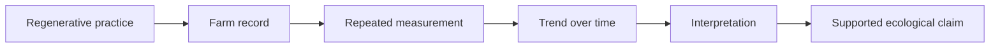
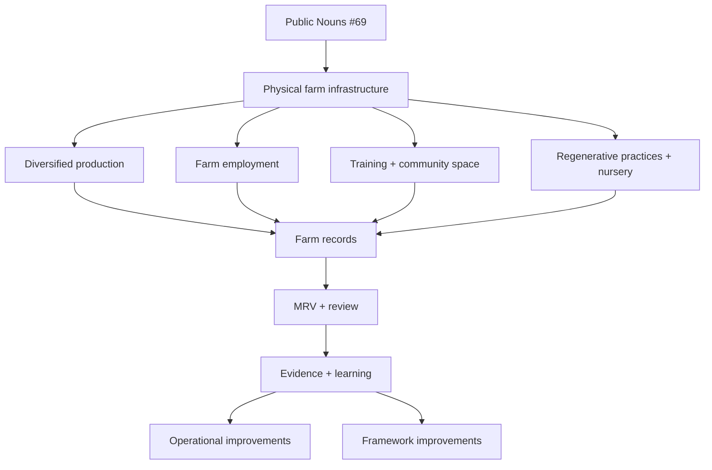

# Adelphi starts with one documented problem: land and intent were not enough.

Yanny and Neury Hernández purchased land in Gonzalo, Monte Plata in **2022** with the intention of building a productive agricultural future.

The central barrier documented in their story was clear:

> **They had land, commitment, and a farming vision, but lacked the capital and infrastructure required to turn that land into an operating farm.**

[Public Nouns Proposal #69](https://publicnouns.wtf/vote/69) helped finance critical infrastructure and created the conditions for Adelphi to move from intention into implementation.

Around that core problem, the project is also designed to address six additional priorities: **regenerative education, local food production, land regeneration, continuity of farming knowledge, community space, and women-led agricultural leadership.**

<CardGroup cols={2}>
  <Card title="See the farm today" icon="seedling" href="/ecosystem-wiki/kokonut-farms/adelphi/summary">
    Start with the documented state of Adelphi before evaluating the outcomes the project is designed to create.
  </Card>

  <Card title="Inspect published farm records" icon="chart-line" href="https://hub.kokonut.network/projects/41">
    Use the Kokonut Hub for current published farm records, MRV events, harvest information, and project data.
  </Card>
</CardGroup>

<Info>
  **This page separates documented conditions from project intent.** A farm can be designed to improve food access, education, biodiversity, employment, or community capacity without those broader outcomes being considered proven until the relevant evidence exists.
</Info>

---

## The documented starting point

The strongest problem statement at Adelphi comes directly from the founders' history.

Yanny and Neury:

- grew up with a family connection to farming;
- built careers outside agriculture;
- purchased land in Gonzalo in 2022;
- intended to build a productive farm tied to family legacy and community benefit;
- encountered difficulty financing the infrastructure required to make the land productive.

This creates a narrower and more defensible local problem:

> **How can locally owned land move from undercapitalized potential to productive regenerative infrastructure without removing the founders from the center of the project?**

Adelphi's first answer was infrastructure.

Public Nouns funding supported the transition from owned land toward an operating farm with production systems, poultry, nursery capacity, soil inputs, water and farm infrastructure, community space, and public documentation.

<Card title="Read the founders' full background" icon="book-open-reader" href="/ecosystem-wiki/kokonut-farms/adelphi/background-story">
  Yanny and Neury's story provides the human context behind the land purchase, the financing gap, the name Adelphi, and the community purpose of the farm.
</Card>

---

## Seven areas Adelphi is designed to address

The original Adelphi documentation describes seven local challenges.

A more precise framing is to treat them as **one documented constraint plus six intervention priorities**.

| Area | Current evidence status | Adelphi response |
| --- | --- | --- |
| **1. Capital and employment** | Capital/infrastructure constraint is directly documented; 7 jobs are documented | Fund physical farm capacity and operate a productive agricultural system |
| **2. Regenerative education** | Education infrastructure is documented; broader learning outcomes require program records | Use the farm and gazebo for practical regenerative-agriculture learning |
| **3. Local food production** | Crops and poultry are documented; community food-access outcomes require distribution data | Produce diversified vegetables, fruits, perennial crops, and eggs |
| **4. Land regeneration and biodiversity** | Nursery, syntropic systems, biochar, species work, and MRV methods are documented | Use regenerative practices while monitoring ecological indicators over time |
| **5. Farming-knowledge continuity** | Founder story and education intent are documented; intergenerational outcomes require participation evidence | Create a place where agricultural knowledge can be practiced and shared |
| **6. Community space** | Multipurpose gazebo is documented; community-capacity outcomes require event and participation records | Provide physical infrastructure for meetings, workshops, meals, and learning |
| **7. Women-led agricultural leadership** | Women-led ownership and operations are documented | Keep Yanny and Neury central to land stewardship, operations, and public leadership |

This framing avoids treating an intended outcome as if it has already been measured.

---

## 1. Capital constraint → productive farm infrastructure

This is the most directly documented problem in the Adelphi story.

Yanny and Neury had already taken the highest-commitment step: purchasing the land.

What they lacked was the capital needed to transform ownership into productive capacity.

[Public Nouns Proposal #69](https://publicnouns.wtf/vote/69) helped finance critical infrastructure.

Adelphi now documents:

<CardGroup cols={2}>
  <Card title="Mapped productive land" icon="map">
    15,725 m² total mapped area, with 13,838 m² documented as agricultural area.
  </Card>

  <Card title="Farm employment" icon="briefcase">
    Seven jobs are documented in the current implementation.
  </Card>

  <Card title="Production systems" icon="seedling">
    Short-, medium-, long-cycle crops and a poultry component are part of the operating design.
  </Card>

  <Card title="Supporting infrastructure" icon="hammer">
    Nursery, biofactory, training space, soil-input systems, and other farm infrastructure support ongoing operations.
  </Card>
</CardGroup>

<Note>
  The existence of infrastructure and jobs is a documented state. Long-term income resilience, profitability, or poverty reduction are higher-level outcomes that require financial and household-level evidence over time.
</Note>

---

## 2. Regenerative education → a living learning environment

Adelphi is designed to function as more than a production site.

The documented farm includes a **multipurpose gazebo** used as a meeting, dining, training, and demonstration space.

The broader education model can include topics such as:

- syntropic farming;
- agroforestry;
- native-species propagation;
- biochar;
- soil health;
- poultry integration;
- farm records;
- MRV literacy.

The physical capacity for education is already present.

The educational **outcome** should be measured separately.

Useful evidence can include:

- number of workshops held;
- attendance;
- participant type;
- curriculum or topic;
- repeat participation;
- operator or participant feedback;
- skills applied after training.

> **A training space is documented infrastructure. Community learning is an outcome that should be demonstrated through program records.**

---

## 3. Local food production → diversified farm output

Adelphi is designed around multiple production horizons.

| Horizon | Examples | Current role |
| --- | --- | --- |
| **Short cycle** | Lettuce and companion vegetables | Faster production cycles |
| **Medium cycle** | Passion fruit, Indian yam | Seasonal diversification |
| **Long cycle** | Coconut and agroforestry species | Perennial production and ecological structure |
| **Continuous** | Laying hens | Eggs, nutrient cycling, and an additional farm output |

This supports a clear claim:

**Adelphi is building diversified food-production capacity.**

It does not yet automatically support the stronger claim that local food insecurity has been reduced.

That would require evidence such as:

- realized harvest quantities;
- where products were sold or distributed;
- community-access records;
- repeat buyers or beneficiaries;
- price and affordability data;
- household or community food-access research.

<Card title="See the physical production system" icon="puzzle" href="/ecosystem-wiki/kokonut-farms/adelphi/crops-biodiversity-and-infrastructure">
  Review the crops, poultry, plots, nursery, biofactory, and infrastructure behind Adelphi's production model.
</Card>

---

## 4. Land regeneration → practices plus measured ecological change

Adelphi uses practices designed around regeneration:

- syntropic planting;
- agroforestry;
- organic inputs;
- bamboo-derived biochar;
- ground cover;
- native and at-risk species propagation;
- poultry integration;
- vegetation monitoring.

Those practices are documented.

The ecological outcomes require a stronger evidence standard.

```mermaid
flowchart LR
    A["Regenerative practice"] --> B["Farm record"]
    B --> C["Repeated measurement"]
    C --> D["Trend over time"]
    D --> E["Interpretation"]
    E --> F["Supported ecological claim"]
```

For example:

- applying biochar is a **documented practice**;
- a soil measurement is **evidence**;
- a multi-period soil trend is a **derived result**;
- claiming improved soil function is an **interpretation** that depends on method and baseline.

Likewise, planting native species is not the same as demonstrating increased biodiversity across the farm.

[Read the MRV evidence standard →](/ecosystem-wiki/kokonut-farms/measurement-reporting-and-verification)

<Warning>
  Adelphi should not describe carbon sequestration, biodiversity restoration, soil improvement, or other ecological outcomes as fully delivered solely because regenerative practices are present. Outcomes require baselines, repeated evidence, and appropriate interpretation.
</Warning>

---

## 5. Farming-knowledge continuity → practice, documentation, and participation

Yanny and Neury's background connects Adelphi to a family history of agriculture.

The farm is also designed to create a setting where other people can encounter and practice land stewardship.

That creates three different evidence layers:

<CardGroup cols={3}>
  <Card title="Practice" icon="tractor">
    Agricultural knowledge is used in daily farm operations.
  </Card>

  <Card title="Documentation" icon="clipboard-check">
    Farm methods, crop systems, MRV, infrastructure, and lessons can be recorded and reused.
  </Card>

  <Card title="Participation" icon="people-group">
    Workshops, visits, training, and community programs can extend knowledge beyond the core operators.
  </Card>
</CardGroup>

The first two are already visible in the project documentation.

The third should be supported by participation records rather than assumed.

---

## 6. Community space → physical infrastructure for coordination

The Adelphi gazebo is a concrete piece of social infrastructure.

It can support:

- meetings;
- meals;
- workshops;
- demonstrations;
- children's activities;
- farmer training;
- visitor education;
- community coordination.

That makes **“Adelphi has dedicated community and training space”** a strong documented claim.

Stronger statements—such as improved social cohesion, stronger community capacity, or intergenerational connection—require evidence about how the space is actually used.

Useful records include:

- event count;
- attendance;
- participant groups;
- recurring programs;
- partner organizations;
- participant feedback;
- outcomes from specific training activities.

---

## 7. Gender barriers → documented women-led ownership and operations

One of Adelphi's clearest social characteristics is not a forecast.

It is the project's current leadership structure.

Adelphi is founded and operated by **Yanny and Neury Hernández**.

The repository documents them as sisters, single mothers, landowners, founders, and operators.

This supports a grounded claim:

> **Adelphi is a women-led agricultural project with women directly connected to land ownership, operations, infrastructure, and public leadership.**

That is different from claiming that Adelphi has already reduced gender inequality across the surrounding community.

A broader gender-impact claim would require evidence such as:

- participation of women in farm employment;
- training participation;
- decision-making roles;
- income or economic-control outcomes;
- access to land, capital, or technical opportunity;
- change over time.

<CardGroup cols={2}>
  <Card title="Read the human story" icon="book-open-reader" href="/ecosystem-wiki/kokonut-farms/adelphi/background-story">
    Understand Yanny and Neury's path from family farming memories to land ownership and farm operations.
  </Card>

  <Card title="Review SDG 5 evidence" icon="recycle" href="/ecosystem-wiki/kokonut-farms/adelphi/sustainable-development-goals">
    See how women-led ownership and operations map to the current SDG framework and what additional evidence should be collected.
  </Card>
</CardGroup>

---

## How the responses connect

Adelphi is designed as an integrated farm system, but integration should not be confused with proven causality.

```mermaid
flowchart TD
    PN["Public Nouns #69"] --> INFRA["Physical farm infrastructure"]

    INFRA --> PROD["Diversified production"]
    INFRA --> JOBS["Farm employment"]
    INFRA --> EDU["Training + community space"]
    INFRA --> ECO["Regenerative practices + nursery"]

    PROD --> RECORDS["Farm records"]
    JOBS --> RECORDS
    EDU --> RECORDS
    ECO --> RECORDS

    RECORDS --> MRV["MRV + review"]
    MRV --> LEARN["Evidence + learning"]
    LEARN --> OPS["Operational improvements"]
    LEARN --> FRAMEWORK["Framework improvements"]
```

This is the strongest current version of the Adelphi value loop:

**fund infrastructure → operate the farm → record what happens → review evidence → improve operations and shared methods.**

Claims about household income, food security, biodiversity, education outcomes, or community resilience belong downstream of that loop and require their own evidence.

---

## Evidence standard for the seven areas

| Area | Strong current claim | Evidence needed for a stronger outcome claim |
| --- | --- | --- |
| **Capital / employment** | Public funding supported infrastructure; 7 jobs are documented | Payroll, job duration, local hiring, household-income change |
| **Education** | Training/community space exists | Event logs, attendance, curriculum, feedback, skills outcomes |
| **Food production** | Diversified crops and poultry are part of the farm system | Harvest actuals, sales/distribution records, food-access data |
| **Land regeneration** | Regenerative practices and biodiversity infrastructure exist | Baselines, repeated soil/vegetation/biodiversity measurements |
| **Knowledge continuity** | Farm methods are practiced and documented | Participation records, repeat training, intergenerational involvement |
| **Community space** | Multipurpose gazebo exists | Usage records, recurring programs, participant evidence |
| **Women-led leadership** | Yanny and Neury own/operate the project | Broader gender outcomes require participation, income, and opportunity data |

<Info>
  This table is intentionally conservative. It gives future farm reporting a clear path from **implemented intervention → recorded activity → measured outcome → supported impact claim**.
</Info>

---

## What Adelphi can claim today

<CardGroup cols={2}>
  <Card title="Infrastructure was financed and deployed" icon="hammer">
    Public-goods funding helped move locally owned land toward an operating regenerative farm.
  </Card>

  <Card title="The farm supports documented jobs" icon="briefcase">
    Seven jobs are part of the current documented implementation.
  </Card>

  <Card title="Production is diversified" icon="seedling">
    Adelphi combines multiple crop horizons, poultry, nursery work, and regenerative practices.
  </Card>

  <Card title="Women lead the project" icon="venus">
    Yanny and Neury remain central to ownership, operations, and the public identity of the farm.
  </Card>

  <Card title="Community infrastructure exists" icon="house">
    The farm includes dedicated physical space for meetings, workshops, training, and gathering.
  </Card>

  <Card title="Evidence systems are being built around the farm" icon="magnifying-glass-chart">
    Records, MRV, the Kokonut Hub, and attestation infrastructure make increasingly strong claims inspectable.
  </Card>
</CardGroup>

### What still needs evidence over time

- realized farm income and household-level economic effects;
- local food-access outcomes;
- workshop and training outcomes;
- changes in soil function;
- changes in biodiversity;
- long-term employment quality and durability;
- community-capacity effects;
- broader gender-equity outcomes;
- causal attribution between any one intervention and an observed result.

> **Adelphi is most credible when it shows the intervention clearly, measures the outcome separately, and leaves room for the evidence to challenge the original assumption.**

---

## Relationship to the Kokonut model

Adelphi's role is not to prove that one farm design should be copied everywhere.

It helps answer a more useful question:

> **Can public-goods capital, local operators, regenerative farm design, structured evidence, and reusable open infrastructure work together around one real farm?**

The current evidence shows that these components are being connected at Adelphi.

Future Kokonut farms still need their own:

- local diagnosis;
- operators;
- baseline;
- crop and infrastructure plan;
- funding structure;
- evidence requirements;
- community priorities;
- market assumptions;
- risk review.

Adelphi contributes a reference point, not a universal prescription.

---

## Continue through Adelphi

<CardGroup cols={2}>
  <Card title="Adelphi Overview" icon="seedling" href="/ecosystem-wiki/kokonut-farms/adelphi/summary">
    Return to the canonical farm overview, documented state, forecast boundaries, and Framework status.
  </Card>

  <Card title="Crops, Biodiversity & Infrastructure" icon="puzzle" href="/ecosystem-wiki/kokonut-farms/adelphi/crops-biodiversity-and-infrastructure">
    Inspect the physical interventions behind production, regeneration, biodiversity, poultry, and community space.
  </Card>

  <Card title="Crops & Harvest Forecast" icon="calculator" href="/ecosystem-wiki/kokonut-farms/adelphi/crops-and-harvest-forecast">
    Review the planning assumptions behind projected production and revenue.
  </Card>

  <Card title="Background Story" icon="rectangle-history" href="/ecosystem-wiki/kokonut-farms/adelphi/background-story">
    Read the founders' history and the documented financing problem that led to Adelphi.
  </Card>

  <Card title="Sustainable Development Goals" icon="recycle" href="/ecosystem-wiki/kokonut-farms/adelphi/sustainable-development-goals">
    See how intended outcomes map to evidence requirements across SDG 1, 2, 5, 8, and 15.
  </Card>

  <Card title="MRV — Evidence Standard" icon="magnifying-glass-chart" href="/ecosystem-wiki/kokonut-farms/measurement-reporting-and-verification">
    Understand how Adelphi should distinguish observations, measurements, forecasts, attestations, and interpreted impact.
  </Card>
</CardGroup>

> **The purpose of the page is not to make Adelphi sound like it has solved every local challenge. It is to show which problems the project is designed around, which responses are already implemented, and what evidence is still required to demonstrate the outcomes.**
