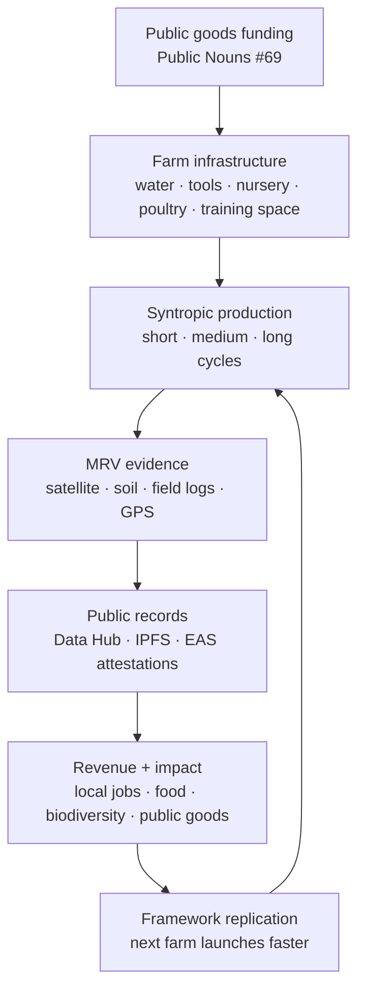

# Adelphi is the proof that Kokonut works on real land.

Adelphi is Kokonut Network's first live syntropic farm — a women-led, community-first agricultural project in Gonzalo, Sabana Grande de Boyá, Monte Plata, Dominican Republic.

It is not a concept deck, prototype, or future promise. It is a working farm with land, founders, crops, infrastructure, revenue forecasts, public goods funding, MRV monitoring, and live data available through the Kokonut Hub.

  <a href="https://hub.kokonut.network/projects/41" style={{ display: "inline-flex", alignItems: "center", gap: "6px", background: "#009F4D", color: "#fff", padding: "10px 20px", borderRadius: "8px", fontWeight: "600", fontSize: "14px", textDecoration: "none" }}>
    Explore Live Farm Data →
  </a>

  <a href="#how-adelphi-works" style={{ display: "inline-flex", alignItems: "center", gap: "6px", border: "1.5px solid #009F4D", color: "#009F4D", padding: "10px 20px", borderRadius: "8px", fontWeight: "600", fontSize: "14px", textDecoration: "none", background: "transparent" }}>
    See How Adelphi Works
  </a>

  The canonical source of truth is the live Data Hub. This page summarizes the project, model, and evidence.

<iframe src="https://www.youtube.com/embed/ZxEdvQe1JNk" title="Adelphi Farm — Kokonut Network" frameborder="0" className="w-full aspect-video rounded-xl" allow="accelerometer; autoplay; clipboard-write; encrypted-media; gyroscope; picture-in-picture; web-share" allowfullscreen />

  

    
15,725

    
m² total area

  

  

    
13,838

    
m² agricultural

  

  

    
7

    
jobs supported

  

  

    
110

    
free-range hens

  

  

    
5

    
UN SDGs addressed

  

  

    
PN #69

    
public goods funded

  

---

## Why Adelphi matters

Adelphi demonstrates all four parts of the Kokonut model at once:

<CardGroup cols={2}>
  <Card title="DAO-funded capital deployment" icon="coins" href="/ecosystem-wiki/the-kokonut-dao/dao-layers">
    Public goods funding helped deploy critical farm infrastructure without turning Adelphi into a corporate extraction project.
  </Card>

  <Card title="Framework-standardized operations" icon="puzzle" href="/kokonut-framework/Introduction">
    The farm runs through the Kokonut Framework: planning, soil preparation, production, regeneration, MRV, impact reporting, and expansion.
  </Card>

  <Card title="Public MRV and attestations" icon="satellite" href="/ecosystem-wiki/kokonut-farms/measurement-reporting-and-verification">
    Satellite imagery, soil probes, field logs, per-plant GPS, IPFS records, and EAS attestations turn farm activity into public evidence.
  </Card>

  <Card title="Community-first regenerative production" icon="people-group" href="/ecosystem-wiki/kokonut-farms/adelphi/sustainable-development-goals">
    Adelphi combines organic food production, local employment, biodiversity conservation, women-led leadership, and public goods allocation.
  </Card>
</CardGroup>

<Note>
  Adelphi is the credibility bridge between Kokonut's thesis and Kokonut's reality. If the global problem is underfunded regenerative agriculture, Adelphi is the first working proof that the DAO \+ Framework \+ MRV model can close that gap.
</Note>

---

## Project at a glance

| **Field** | **Value** |
| --- | --- |
| **Farm** | Adelphi |
| **Location** | Gonzalo, Sabana Grande de Boyá, Monte Plata, Dominican Republic |
| **Coordinates** | [18°56'19.7"N 69°44'06.0"W](https://www.google.com/maps/place/18%C2%B056%2719.7%22N+69%C2%B044%2706.0%22W/@18.9387931,-69.735003,1058m/data=!3m2!1e3!4b1!4m4!3m3!8m2!3d18.9387931!4d-69.735003?entry=ttu&g_ep=EgoyMDI0MDgyOC4wIKXMDSoASAFQAw==) |
| **Founders/operators** | Yanny & Neury Hernández |
| **Farm model** | Women-led, community-first syntropic farm |
| **Total area** | 15,725 m² |
| **Agricultural area** | 13,838 m² agro-ecological garden |
| **Framework phase** | Phase II — Production & Regeneration |
| **Funding milestone** | [Public Nouns Proposal #69](https://publicnouns.wtf/vote/69) |
| **Live data** | [hub.kokonut.network/projects/41](https://hub.kokonut.network/projects/41) |
| **3D land model** | [Adelphi Ortho3D ↗](https://link.kokonut.network/AdelphiOrtho3D) |
| **Species geodata** | [Adelphi Species GeoNode ↗](https://link.kokonut.network/AdelphiSpeciesGeoNode) |

---

## The founders

<Card title="Yanny & Neury Hernández — sisters, single mothers, farmers" icon="seedling">
  Yanny and Neury grew up in a farming family, spending childhood vacations at their grandparents' countryside home in the Dominican Republic. Although they built careers in the city — Yanny in pharmaceuticals, Neury as a professional manicurist — their connection to the land never faded.

  Two years ago, they took a bold step: they purchased land in Monte Plata with the intention to farm it, only to discover that financing cultivation was the hardest part. Adelphi was born from that gap — a project designed not only to secure their future, but to benefit the surrounding community through organic production, biodiversity education, and a gathering space for children, elders, and neighbors who want to reconnect with the land.

  [Read the full background story →](/ecosystem-wiki/kokonut-farms/adelphi/background-story)
</Card>

---

## How Adelphi works

Adelphi uses a three-cycle syntropic production model. Short-cycle vegetables create near-term cash flow, medium-cycle fruits add seasonal income, and long-cycle coconut trees build the perennial asset base that connects the farm back to Kokonut's tree-backed governance model.

---

## Revenue projection at a glance

Adelphi's three-cycle crop model generates revenue across different timeframes. Actual performance is tracked in the [Live Data Hub](https://hub.kokonut.network/projects/41), while projections are calculated through the [Crops & Harvest Forecast](/ecosystem-wiki/kokonut-farms/adelphi/crops-and-harvest-forecast) methodology.

| **Crop / stream** | **Cycle** | **Annual production** | **Est. annual revenue** |
| --- | --- | --- | --- |
| Lettuce | Short — 30–75 days, 5 harvests/yr | 48,450 units across 10 plots | \$133,237.50 |
| Passion fruit | Medium — annual | 47,600 fruits · 3,661 nets across 8 plots | \$11,019.00 |
| Coconut | Long — perennial | 6,144 coconuts across 8 plots | \$4,853.76 |
| Poultry eggs | Continuous | ~36,500 eggs/yr | Additional revenue stream |
| **Total projected** |  |  | **~\$149,110.26 / yr** |

<Note>
  The forecast uses conservative planning assumptions, including a 15% crop loss rate and 5 lettuce harvests per year. Actual yields, losses, harvest records, and impact metrics should be checked against the Data Hub.
</Note>

<Info>
  10% of gross revenue — approximately \$14,911 per year at forecasted performance — is allocated to public goods activities under the Kokonut Common Data Schema.
</Info>

---

## What is growing

<CardGroup cols={2}>
  <Card title="Short-cycle vegetables" icon="leaf">
    Lettuce, broccoli, spinach, tomatoes, arugula, and other minor crops provide fast, recurring harvests and early operational cash flow.
  </Card>

  <Card title="Medium-cycle fruits" icon="apple-whole">
    Passion fruit and Indian yam add seasonal revenue and nutritional diversity as the farm matures.
  </Card>

  <Card title="Long-cycle coconut trees" icon="tree-palm">
    Coconut trees anchor the perennial income base and connect Adelphi to Kokonut's broader 1:1 tree-backed governance logic.
  </Card>

  <Card title="Poultry and organic inputs" icon="egg">
    110 free-range hens produce approximately 100 eggs per day. Poultry manure is processed into humic acids and organic urea for on-site fertilization.
  </Card>

  <Card title="Native and endangered species nursery" icon="sprout">
    Adelphi propagates native and endangered species for conservation, education, biodiversity restoration, and free distribution to visitors and neighboring communities.
  </Card>

  <Card title="Training and community infrastructure" icon="school">
    The farm includes a multipurpose education space for workshops, meetings, community programming, and agro-ecological training.
  </Card>
</CardGroup>

[See crops, biodiversity, and infrastructure →](/ecosystem-wiki/kokonut-farms/adelphi/crops-biodiversity-and-infrastructure)

---

## How Adelphi is verified

Every significant farm event — MRV submissions, harvest milestones, funding approvals, and impact records — is designed to move from field activity into public evidence.

| **Layer** | **What it verifies** | **Tools / methods** |
| --- | --- | --- |
| **Remote sensing** | Vegetation health and land change | Landsat 8, Sentinel-2, NDVI, NDRE, ReCI, MSAVI, drone orthomosaics, QGIS |
| **Ground sensing** | Soil and crop conditions | Soil moisture, volumetric water content, electrical conductivity, soil temperature |
| **Community analytics** | Human-observed field activity | Atlantis App field observations, crop cycle stage, disease flags, plant health logs |
| **Per-plant GPS** | Individual tree and species records | Silvi plant registration, geodata, health status, phenology records |
| **On-chain evidence** | Public, tamper-resistant proof | IPFS/Filecoin records, Farm Registry events, EAS attestations |
| **Public reporting** | Network-level accountability | Kokonut Hub, EBF reports, CRISP risk analysis, SDG alignment records |

[Read the full MRV methodology →](/ecosystem-wiki/kokonut-farms/measurement-reporting-and-verification)

---

## Framework phase

Adelphi is currently operating in **Phase II — Production and Regeneration** of the [Kokonut Framework development phases](/kokonut-framework/development-phases/phase-ii).

| **Phase** | **Status** | **Description** |
| --- | --- | --- |
| [Phase I — Planning & Preparation](/kokonut-framework/development-phases/phase-i) | ✅ Complete | Soil diagnosis, crop selection, infrastructure, personnel training, and biochar-based soil preparation |
| [Phase II — Production & Regeneration](/kokonut-framework/development-phases/phase-ii) | 🔄 Active | Agro-ecological practices implemented, soil regeneration underway, all three crop cycle lengths planted |
| [Phase III — Consolidation & Expansion](/kokonut-framework/development-phases/phase-iii) | Upcoming | Harvesting protocols, go-to-market strategy, organic certification, biodiversity expansion, adjacent land strategy |
| [Phase IV — MRV](/kokonut-framework/development-phases/phase-iv) | Ongoing | Continuous across all phases — data recorded, attested on-chain, and published to the Data Hub |

<Note>
  Phase IV MRV is not a final phase that starts after the farm is mature. It runs continuously across the farm's entire operational life.
</Note>

---

## Impact alignment

Adelphi directly addresses five Sustainable Development Goals through concrete farm activities.

| **SDG** | **How Adelphi contributes** | **Evidence path** |
| --- | --- | --- |
| **SDG 1 — No Poverty** | Sustainable employment and income diversification through multi-cycle crop production | Jobs supported, revenue forecast, farm payroll and operations records |
| **SDG 2 — Zero Hunger** | Organic food production for local markets and community food access | Harvest records, crop diversity, Data Hub outputs |
| **SDG 5 — Gender Equality** | Women-led ownership, leadership, and operational management | Founder story, governance records, farm management documentation |
| **SDG 8 — Decent Work** | Fair employment, skills training, and agro-ecological education | Training records, job creation, education center activity |
| **SDG 15 — Life on Land** | Biochar soil regeneration, native species nursery, agroforestry, and biodiversity conservation | MRV data, species geodata, nursery logs, EBF reporting |

[Read the full SDG alignment →](/ecosystem-wiki/kokonut-farms/adelphi/sustainable-development-goals)

---

## What Adelphi proves

Adelphi exists to prove that Kokonut's model can turn undercapitalized land into a regenerative, community-owned, publicly verifiable production system.

<CardGroup cols={2}>
  <Card title="Farmers need coordination, not extraction" icon="hand-holding-heart">
    Adelphi shows how capital can reach farmers without giving corporations control over the upside.
  </Card>

  <Card title="Regeneration can be productive" icon="seedling">
    The farm combines soil restoration, biodiversity, organic production, and revenue generation rather than treating ecology and economics as separate goals.
  </Card>

  <Card title="Impact can be measured" icon="magnifying-glass-chart">
    MRV turns farm activity into public evidence that can be inspected by DAO members, partners, researchers, and community contributors.
  </Card>

  <Card title="The model can replicate" icon="arrows-rotate">
    Adelphi is the first implementation of the Framework. Every lesson, dataset, workflow, and attestation improves the next farm launch.
  </Card>
</CardGroup>

---

## Explore Adelphi deeper

<CardGroup cols={2}>
  <Card title="Problem & Solution" icon="chalkboard" href="/ecosystem-wiki/kokonut-farms/adelphi/problem-and-solution">
    The seven local challenges Adelphi addresses — economic hardship, food insecurity, environmental degradation, gender inequality, and more.
  </Card>

  <Card title="Crops, Biodiversity & Infrastructure" icon="puzzle" href="/ecosystem-wiki/kokonut-farms/adelphi/crops-biodiversity-and-infrastructure">
    The full production system — syntropic plots, fruit orchards, endangered species nursery, poultry farm, and training infrastructure.
  </Card>

  <Card title="Crops & Harvest Forecast" icon="dragon" href="/ecosystem-wiki/kokonut-farms/adelphi/crops-and-harvest-forecast">
    Production formulas, yield projections, revenue estimates, loss assumptions, and seasonal planning across all crop cycles.
  </Card>

  <Card title="Background Story" icon="rectangle-history" href="/ecosystem-wiki/kokonut-farms/adelphi/background-story">
    How Yanny and Neury Hernández built Adelphi from a dream of returning to the land — and what it means for their community.
  </Card>

  <Card title="Sustainable Development Goals" icon="recycle" href="/ecosystem-wiki/kokonut-farms/adelphi/sustainable-development-goals">
    Adelphi's SDG framework — how each goal is addressed, measured, and reported through the Kokonut Framework.
  </Card>

  <Card title="Live Data Hub" icon="chart-line" href="https://hub.kokonut.network/projects/41">
    Real-time harvest records, MRV events, and aggregated impact metrics — the canonical source of truth for Adelphi's actual performance.
  </Card>
</CardGroup>

  <a href="https://hub.kokonut.network/projects/41" style={{ display: "inline-flex", alignItems: "center", gap: "6px", background: "#009F4D", color: "#fff", padding: "10px 20px", borderRadius: "8px", fontWeight: "600", fontSize: "14px", textDecoration: "none" }}>
    Explore Live Farm Data →
  </a>

  <a href="/ecosystem-wiki/open-collaboration-invitation" style={{ display: "inline-flex", alignItems: "center", gap: "6px", border: "1.5px solid #009F4D", color: "#009F4D", padding: "10px 20px", borderRadius: "8px", fontWeight: "600", fontSize: "14px", textDecoration: "none", background: "transparent" }}>
    Help Replicate the Model
  </a>

