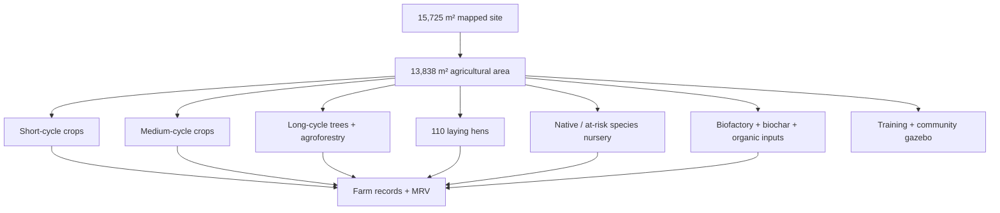

# Adelphi is Kokonut's first live reference farm.

Adelphi is a women-led, locally operated syntropic farm in **Gonzalo, Sabana Grande de Boyá, Monte Plata, Dominican Republic**, founded and operated by sisters **Yanny and Neury Hernández**.

It is where Kokonut's ideas meet real land: public-goods funding, regenerative agriculture, local operations, community infrastructure, farm records, MRV, forecasts, and shared Framework practices.

Adelphi should be read as a **reference implementation**, not as proof that every future farm will reproduce the same economics, ecological outcomes, governance dynamics, or community effects.

<CardGroup cols={2}>
  <Card title="Inspect published farm records" icon="chart-line" href="https://hub.kokonut.network/projects/41">
    Use the Kokonut Hub for current published records, farm activity, MRV events, harvest information, and project data.
  </Card>

  <Card title="Understand the evidence model" icon="magnifying-glass-chart" href="/ecosystem-wiki/kokonut-farms/measurement-reporting-and-verification">
    See how documented state, measurements, forecasts, attestations, and interpreted impact are kept separate.
  </Card>
</CardGroup>

<Info>
  **This page is an orientation layer.** Current published records belong in the Kokonut Hub. Detailed agronomy, infrastructure, forecasts, local context, founder history, and SDG evidence each have their own pages.
</Info>

<iframe
  src="https://www.youtube.com/embed/ZxEdvQe1JNk"
  title="Adelphi Farm — Kokonut Network"
  frameBorder="0"
  className="w-full aspect-video rounded-xl"
  loading="lazy"
  allow="accelerometer; autoplay; clipboard-write; encrypted-media; gyroscope; picture-in-picture; web-share"
  allowFullScreen
/>

---

## Documented state at a glance

These values are documented reference points in the current public repository.

<CardGroup cols={4}>
  <Card title="15,725 m²" icon="map">
    Total mapped farm area.
  </Card>

  <Card title="13,838 m²" icon="seedling">
    Documented agricultural area.
  </Card>

  <Card title="7 jobs" icon="people-group">
    Jobs supported in the documented implementation.
  </Card>

  <Card title="110 hens" icon="egg">
    Documented free-range laying-hen component.
  </Card>
</CardGroup>

<CardGroup cols={2}>
  <Card title="Public Nouns #69" icon="hand-holding-heart" href="https://publicnouns.wtf/vote/69">
    Public-goods funding supported critical farm infrastructure.
  </Card>

  <Card title="5 primary SDG mappings" icon="recycle" href="/ecosystem-wiki/kokonut-farms/adelphi/sustainable-development-goals">
    Adelphi currently reports against SDG 1, 2, 5, 8, and 15, with evidence requirements defined separately.
  </Card>
</CardGroup>

<Note>
  These figures should not be treated as a live dashboard. If a value changes over time, the Kokonut Hub and dated source records should take precedence over a static summary page.
</Note>

---

## How to read claims about Adelphi

The farm pages use the evidence vocabulary established in the [MRV methodology](/ecosystem-wiki/kokonut-farms/measurement-reporting-and-verification).

| Claim type | Example at Adelphi | How to read it |
| --- | --- | --- |
| **Documented state** | 15,725 m² mapped area, 110 hens, founders/operators | A recorded fact or current project attribute |
| **Measurement** | Soil value, mapped area, harvest quantity, GPS point | A value captured through a defined observation or measurement process |
| **Derived indicator** | NDVI, NDRE, ReCI, MSAVI | A value calculated from source data and requiring methodological context |
| **Forecast / model** | Projected lettuce yield or annual crop revenue | A planning scenario based on assumptions, not an achieved result |
| **Attestation / reviewed claim** | Published or attested farm record | A claim with review/provenance context; not automatic scientific certification |
| **Interpretation** | SDG mapping, EBF profile, CRISP review | A conclusion produced by applying a framework to underlying evidence |

> **The most important distinction on Adelphi pages is actual vs. forecast.** A planned yield, modeled revenue, or projected impact remains a forecast until supported by recorded outcomes.

---

## Project identity

| Field | Current documented value |
| --- | --- |
| **Farm** | Adelphi |
| **Location** | Gonzalo, Sabana Grande de Boyá, Monte Plata, Dominican Republic |
| **Coordinates** | [18°56'19.7"N 69°44'06.0"W](https://www.google.com/maps/place/18%C2%B056%2719.7%22N+69%C2%B044%2706.0%22W/@18.9387931,-69.735003,1058m/data=!3m2!1e3!4b1!4m4!3m3!8m2!3d18.9387931!4d-69.735003?entry=ttu&g_ep=EgoyMDI0MDgyOC4wIKXMDSoASAFQAw==) |
| **Founders / operators** | Yanny & Neury Hernández |
| **Operating model** | Women-led, community-first syntropic farm |
| **Total mapped area** | 15,725 m² |
| **Agricultural area** | 13,838 m² |
| **Current documented Framework phase** | Phase II — Production & Regeneration |
| **Major funding milestone** | [Public Nouns Proposal #69](https://publicnouns.wtf/vote/69) |
| **Published farm data** | [Kokonut Hub — Project 41](https://hub.kokonut.network/projects/41) |
| **3D land model** | [Adelphi Ortho3D](https://link.kokonut.network/AdelphiOrtho3D) |
| **Species geodata** | [Adelphi Species GeoNode](https://link.kokonut.network/AdelphiSpeciesGeoNode) |

---

## Why Adelphi matters to Kokonut

Adelphi is valuable because multiple parts of the Kokonut system can be tested against the same real farm.

<CardGroup cols={2}>
  <Card title="Real-world farm operations" icon="tractor">
    Agronomy, irrigation, planting, poultry, nursery work, maintenance, labor, and market activity happen under real operating constraints.
  </Card>

  <Card title="Public-goods-funded infrastructure" icon="hand-holding-heart">
    Public Nouns Proposal #69 helped fund critical physical infrastructure rather than only research or software.
  </Card>

  <Card title="Shared Framework practices" icon="puzzle" href="/kokonut-framework/Introduction">
    Adelphi uses common development phases, data structures, regenerative principles, MRV practices, and impact-reporting logic.
  </Card>

  <Card title="Inspectable evidence" icon="magnifying-glass-chart" href="/ecosystem-wiki/kokonut-farms/measurement-reporting-and-verification">
    Farm observations, measurements, records, public data, and attestations can be connected to claims with explicit evidence classes.
  </Card>

  <Card title="Community infrastructure" icon="people-group">
    The farm includes education and gathering infrastructure alongside production, biodiversity, and operator livelihoods.
  </Card>

  <Card title="Replication learning" icon="arrows-rotate">
    Adelphi generates lessons that can improve the Framework and help test what is actually reusable when another farm enters the system.
  </Card>
</CardGroup>

<Note>
  Adelphi demonstrates that these components can coexist in one operating context. The next test is whether the shared infrastructure remains useful when applied to another farm without copying Adelphi's local conditions.
</Note>

---

## The founders and origin

Yanny and Neury Hernández are sisters, single mothers, landowners, and the founders/operators of Adelphi.

Their family history is rooted in agriculture. As adults, Yanny built a career in the pharmaceutical industry and Neury became a professional manicurist, while both retained a long-term goal of returning to land stewardship.

In **2022**, they purchased land in Gonzalo with the intention of building an agricultural future tied to family legacy and community benefit.

The major barrier documented in their story was not whether the land could produce. It was the capital and infrastructure required to turn ownership and intention into an operating farm.

[Public Nouns Proposal #69](https://publicnouns.wtf/vote/69) helped fund critical infrastructure, allowing Adelphi to develop as both a productive farm and a public-good-aligned learning site.

<Card title="Read Yanny and Neury's full story" icon="book-open-reader" href="/ecosystem-wiki/kokonut-farms/adelphi/background-story">
  The background page covers their family history, land purchase, the meaning of the name Adelphi, community purpose, biodiversity work, and the human context behind the farm.
</Card>

---

## The physical farm system

Adelphi combines production, ecological restoration, on-site inputs, animals, and community infrastructure.

```mermaid
flowchart TD
    LAND["15,725 m² mapped site"] --> AG["13,838 m² agricultural area"]

    AG --> SHORT["Short-cycle crops"]
    AG --> MEDIUM["Medium-cycle crops"]
    AG --> LONG["Long-cycle trees + agroforestry"]

    AG --> POULTRY["110 laying hens"]
    AG --> NURSERY["Native / at-risk species nursery"]
    AG --> BIO["Biofactory + biochar + organic inputs"]
    AG --> GAZEBO["Training + community gazebo"]

    SHORT --> RECORDS["Farm records + MRV"]
    MEDIUM --> RECORDS
    LONG --> RECORDS
    POULTRY --> RECORDS
    NURSERY --> RECORDS
    BIO --> RECORDS
```

The documented system includes:

- short-cycle vegetables;
- passion fruit and Indian yam;
- coconut trees and native agroforestry species;
- 110 free-range laying hens;
- a nursery for native and at-risk species;
- bamboo-derived biochar;
- biological input production;
- syntropic plots;
- a multipurpose training and community gazebo;
- farm-data and MRV workflows.

<Card title="See the physical system in detail" icon="puzzle" href="/ecosystem-wiki/kokonut-farms/adelphi/crops-biodiversity-and-infrastructure">
  Review crop beds, biodiversity, nursery operations, poultry, biofactory, soil practices, infrastructure, geospatial layout, and community facilities.
</Card>

---

## Production is organized across multiple time horizons

Adelphi uses a diversified production model rather than depending on one crop cycle.

| Production horizon | Examples | Role in the farm model |
| --- | --- | --- |
| **Short cycle** | Lettuce and companion vegetables | Faster harvest cycles and near-term operating revenue potential |
| **Medium cycle** | Passion fruit, Indian yam | Seasonal diversification |
| **Long cycle** | Coconut and native agroforestry species | Perennial production and long-term ecological structure |
| **Continuous** | Poultry | Eggs, nutrient cycling, manure inputs, and an additional production stream |

This mix is intended to connect near-term production with longer-term perennial systems and ecological regeneration.

Actual harvest performance should be evaluated from farm records rather than inferred from the planting model.

---

## Forecast snapshot — not actual performance

The detailed [Crops & Harvest Forecast](/ecosystem-wiki/kokonut-farms/adelphi/crops-and-harvest-forecast) models production and revenue using explicit assumptions.

| Forecast stream | Planning assumption | Forecast annual output / revenue |
| --- | --- | --- |
| **Lettuce** | 48,450 units per harvest × 5 harvests | 242,250 units / **\$133,237.50** |
| **Passion fruit** | 560 plants, 85 fruits/plant | 47,600 fruits / 3,661 nets / **\$11,019.61** |
| **Coconut** | 96 trees, 64 coconuts/tree at maturity | 6,144 coconuts / **\$4,853.76** |
| **Poultry eggs** | 110 hens, ~100 eggs/day estimate | ~36,500 eggs/year; revenue not included in crop total |
| **Projected gross crop revenue** | Crop model only | **~\$149,110.87/year** |

<Warning>
  These are **forecasts**, not recorded harvest or revenue actuals. Weather, pests, soil conditions, labor, market access, timing, prices, and operational execution can materially change results.
</Warning>

The forecast currently uses a **15% crop-loss assumption** and **5 lettuce harvests per year**.

The planning model also assigns **10% of projected gross crop revenue** to public-goods activities. At modeled performance, that would equal approximately **\$14,911.09/year**.

That value should be described as a **forecasted allocation**, not as money already realized or distributed.

<Card title="Inspect the full forecast and assumptions" icon="calculator" href="/ecosystem-wiki/kokonut-farms/adelphi/crops-and-harvest-forecast">
  Review formulas, crop counts, loss assumptions, prices, sensitivity, forecast risks, and the forecast-vs-actual feedback loop.
</Card>

---

## How evidence moves through Adelphi

The farm uses several evidence sources because different claims require different kinds of support.

| Evidence source | What it can support | Important boundary |
| --- | --- | --- |
| **Field observations** | Crop condition, disease flags, operational notes, local context | Human observations should preserve authorship and review context |
| **Ground measurements** | Soil moisture, electrical conductivity, soil temperature | Units, placement, calibration, and reporting period matter |
| **Remote sensing** | Vegetation and land-change indicators such as NDVI, NDRE, ReCI, MSAVI | Derived indices do not directly prove yield, carbon, or biodiversity |
| **Per-plant GPS** | Location, status, phenology, species records | A GPS record proves location/provenance, not ecological impact by itself |
| **Harvest records** | Actual production and forecast reconciliation | Planned production should never be mixed with harvest actuals |
| **Published Hub records** | Public project and farm information | Publication state and timestamp matter |
| **EAS attestations on Celo** | Provenance for selected claims and evidence references | Attestation does not equal external scientific certification |
| **EBF / CRISP / SDG reporting** | Interpretation of reviewed evidence | Interpretation is only as strong as the underlying records and method |

[Read the MRV evidence standard →](/ecosystem-wiki/kokonut-farms/measurement-reporting-and-verification)

---

## Framework status

The current public documentation places Adelphi in **Phase II — Production & Regeneration**.

| Framework phase | Documented status | Role |
| --- | --- | --- |
| [Phase I — Planning & Preparation](/kokonut-framework/development-phases/phase-i) | **Complete** | Baseline planning, infrastructure, soil preparation, training, and setup |
| [Phase II — Production & Regeneration](/kokonut-framework/development-phases/phase-ii) | **Active** | Production, regenerative practices, crop systems, and ongoing farm operations |
| [Phase III — Consolidation & Expansion](/kokonut-framework/development-phases/phase-iii) | **Upcoming** | Market consolidation, certification, biodiversity expansion, and broader growth |
| [Phase IV — Continuous MRV](/kokonut-framework/development-phases/phase-iv) | **Ongoing across phases** | Records, measurements, evidence review, reporting, and verification workflows |

<Info>
  Phase IV should not be interpreted as a final stage that starts after production. MRV runs across the farm lifecycle and becomes more useful as time-series records accumulate.
</Info>

---

## SDG alignment is an evidence-mapping exercise

Adelphi currently focuses on five primary Sustainable Development Goals.

| SDG | Current Adelphi connection | Evidence that should support the claim |
| --- | --- | --- |
| **SDG 1 — No Poverty** | Jobs, productive assets, revenue potential, public-goods model | Employment, realized revenue, public-goods records, income evidence |
| **SDG 2 — Zero Hunger** | Diversified food production | Harvest actuals, crop records, egg records, distribution records |
| **SDG 5 — Gender Equality** | Women-led ownership and operations | Land/project ownership, operator roles, leadership and program records |
| **SDG 8 — Decent Work** | Seven documented jobs and skills development | Employment records, role descriptions, training and workshop records |
| **SDG 15 — Life on Land** | Nursery, syntropic agroforestry, biochar, biodiversity work | Species records, nursery logs, remote sensing, soil and MRV observations |

[Read the detailed SDG evidence map →](/ecosystem-wiki/kokonut-farms/adelphi/sustainable-development-goals)

<Note>
  The current SDG page treats **SDG 13 — Climate Action** as a co-benefit rather than a primary Adelphi SDG until carbon methodology is operationalized and reported consistently.
</Note>

---

## What Adelphi can demonstrate today

Adelphi can support several grounded conclusions without overreaching.

<CardGroup cols={2}>
  <Card title="A real farm can use shared coordination infrastructure" icon="puzzle">
    Public-goods funding, Framework practices, farm operations, data records, and contribution systems can coexist around one locally operated project.
  </Card>

  <Card title="Regeneration and production can be designed together" icon="seedling">
    The physical system combines food production, perennial crops, poultry, biodiversity, soil inputs, nursery work, and community infrastructure.
  </Card>

  <Card title="Farm claims can become more inspectable" icon="magnifying-glass-chart">
    The MRV model creates a path from observations and records toward review, publication, attestation, and interpretation.
  </Card>

  <Card title="Forecasts can become testable" icon="calculator">
    Crop and revenue projections can be compared with harvest actuals instead of remaining permanent assumptions.
  </Card>

  <Card title="Local leadership can remain central" icon="people-group">
    Yanny and Neury remain the founders and operators of the farm while shared infrastructure supports rather than replaces local execution.
  </Card>

  <Card title="One implementation can generate reusable lessons" icon="arrows-rotate">
    Adelphi can improve the Framework, MRV practices, data structures, and future farm onboarding even before multi-farm replication is proven.
  </Card>
</CardGroup>

### What Adelphi does not prove yet

- that every future farm can use the same crop model;
- that forecast revenues will be realized;
- that every reported ecological benefit has been independently certified;
- that on-chain attestations validate scientific conclusions;
- that a second farm will replicate Adelphi without new local adaptation;
- that the current Framework has already solved multi-farm scaling.

> **Adelphi's strongest role is as a live place to test, measure, learn, and improve.**

---

## Explore Adelphi deeper

<CardGroup cols={2}>
  <Card title="Problem & Solution" icon="chalkboard" href="/ecosystem-wiki/kokonut-farms/adelphi/problem-and-solution">
    The local conditions Adelphi is designed to address and how the farm responds.
  </Card>

  <Card title="Crops, Biodiversity & Infrastructure" icon="puzzle" href="/ecosystem-wiki/kokonut-farms/adelphi/crops-biodiversity-and-infrastructure">
    The physical production system: plots, crops, poultry, nursery, biofactory, soil practices, and community infrastructure.
  </Card>

  <Card title="Crops & Harvest Forecast" icon="calculator" href="/ecosystem-wiki/kokonut-farms/adelphi/crops-and-harvest-forecast">
    Production assumptions, yield models, revenue forecasts, risk, and forecast-vs-actual reconciliation.
  </Card>

  <Card title="Background Story" icon="rectangle-history" href="/ecosystem-wiki/kokonut-farms/adelphi/background-story">
    Yanny and Neury Hernández, their relationship to the land, the origin of Adelphi, and the human context behind the farm.
  </Card>

  <Card title="Sustainable Development Goals" icon="recycle" href="/ecosystem-wiki/kokonut-farms/adelphi/sustainable-development-goals">
    How the five primary SDG mappings connect to evidence requirements rather than labels alone.
  </Card>

  <Card title="Live Data Hub" icon="chart-line" href="https://hub.kokonut.network/projects/41">
    Inspect current published farm records and actual performance data.
  </Card>
</CardGroup>

> **Use the overview to understand the system, the deeper pages to understand each claim, and the Kokonut Hub to inspect current published records.**
