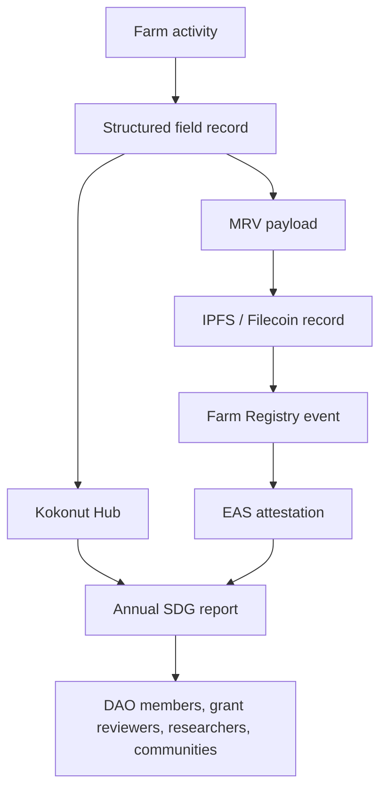
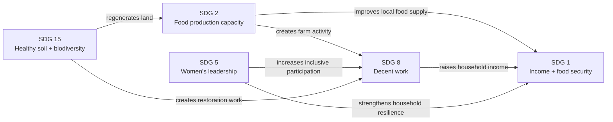

# Adelphi's SDG alignment is not a label. It is an evidence system.

Adelphi directly addresses five Sustainable Development Goals through measurable farm operations, including local jobs, diversified food production, women-led ownership, regenerative land management, public goods allocation, and annual impact reporting.

The purpose of this page is to show the connection between **farm activity → SDG outcome → evidence → reporting**. Each claim should be inspectable through the Kokonut [MRV methodology](/ecosystem-wiki/kokonut-farms/measurement-reporting-and-verification), the [Kokonut Hub](https://hub.kokonut.network/projects/41), farm records, and annual reporting cycles.

  <a href="#impact-at-a-glance" style={{ display: "inline-flex", alignItems: "center", gap: "6px", background: "#009F4D", color: "#fff", padding: "10px 20px", borderRadius: "8px", fontWeight: "600", fontSize: "14px", textDecoration: "none" }}>
    See the Impact Map →
  </a>

  <a href="https://hub.kokonut.network/projects/41" style={{ display: "inline-flex", alignItems: "center", gap: "6px", border: "1.5px solid #009F4D", color: "#009F4D", padding: "10px 20px", borderRadius: "8px", fontWeight: "600", fontSize: "14px", textDecoration: "none", background: "transparent" }}>
    Explore Live Data
  </a>

  SDG claims become credible only when they are tied to farm records, MRV events, and annual reports.

---

## Impact at a glance

  

    
5

    
primary SDGs

  

  

    
7

    
jobs supported

  

  

    
4

    
revenue streams

  

  

    
110

    
free-range hens

  

  

    
12+

    
at-risk species

  

  

    
10%

    
public goods allocation

  

| SDG | Adelphi contribution | Primary evidence |
| --- | --- | --- |
| SDG 1 — No Poverty | Jobs, farm revenue, public goods allocation, and local income resilience | Employment records, sales records, public goods allocation, annual income impact review |
| SDG 2 — Zero Hunger | Diverse organic food production across short, medium, long, and continuous cycles | Harvest records, crop cycle data, egg records, distribution records |
| SDG 5 — Gender Equality | Women-led ownership, management, decision-making, and community programming | Governance records, operator records, program records, leadership documentation |
| SDG 8 — Decent Work | Seven documented jobs, training programs, and regenerative agriculture skill-building | Employment records, workshop attendance, role descriptions, training logs |
| SDG 15 — Life on Land | Biodiversity nursery, biochar, syntropic plots, erosion control, vegetation monitoring | Species inventory, nursery logs, satellite indices, soil observations, MRV reports |

<Note>
  This page focuses on Adelphi's five primary SDGs. SDG 13 — Climate Action is treated as an important co-benefit through biochar, agroforestry, soil regeneration, and vegetation monitoring, but not as a primary SDG until the carbon methodology is fully operationalized and reported consistently.
</Note>

---

## How SDG evidence flows

SDG alignment is only useful when it can be verified. For Adelphi, that means each outcome should connect to one or more evidence sources: farm logs, harvest records, employment records, workshop attendance, nursery inventory, satellite vegetation indices, public Data Hub entries, and annual reports.

[Read the full MRV methodology →](/ecosystem-wiki/kokonut-farms/measurement-reporting-and-verification)

---

## SDG 1 — No Poverty

> Eradicate extreme poverty for all people everywhere and ensure all people have equal rights to economic resources.

Adelphi contributes to poverty reduction by creating local employment, generating farm revenue, building community infrastructure, and allocating part of that revenue to public goods.

| Indicator | Current figure or method | Evidence source |
| --- | --- | --- |
| Jobs supported | 7 full-time positions | Kokonut Hub, farm employment records |
| Projected gross annual crop revenue | ~\$149,110/yr forecast, before actuals | [Crops & Harvest Forecast](/ecosystem-wiki/kokonut-farms/adelphi/crops-and-harvest-forecast) |
| Public goods allocation | 10% of farm revenue | Common Data Schema, revenue records |
| Revenue streams | Lettuce, passion fruit, coconut, eggs | Harvest records, sales records |

### What this means

Poverty reduction at Adelphi is not treated as charity. It comes from productive assets, recurring work, local food production, and revenue that can circulate back into the community.

### How it is measured

- Employment records and role descriptions
- Monthly sales and revenue tracking
- Public goods allocation records
- Annual household income impact assessment
- Kokonut Hub farm updates and reporting cycles

### SDG interconnections

- Reinforced by **SDG 8** because decent work is a direct income mechanism
- Reinforced by **SDG 2** because local food production reduces household food pressure
- Reinforced by **SDG 5** because women-led ownership strengthens household and community resilience

---

## SDG 2 — Zero Hunger

> End hunger, achieve food security and improved nutrition, and promote sustainable agriculture.

Adelphi contributes to food security through diversified organic production. The farm is designed around multiple crop timelines, so the system does not depend on a single harvest, market, or species.

| Production stream | Annual production model | Cycle |
| --- | --- | --- |
| Lettuce plus companion vegetables | 48,450 units per harvest × 5 harvests = 242,250 units/yr forecast | Short cycle |
| Passion fruit | 47,600 fruits · 3,661 nets/yr forecast | Medium cycle |
| Coconut | 6,144 coconuts/yr forecast | Long cycle |
| Indian yam | Additional medium-cycle food crop | Medium cycle |
| Free-range eggs | ~36,500 eggs/yr at 100/day | Continuous |

### What this means

Adelphi's contribution to food security is both local and systemic. Local communities gain access to fresh food, while the farm demonstrates how regenerative production can support revenue without relying on monoculture.

### How it is measured

- Harvest records per crop and cycle
- Crop loss-rate tracking
- Egg production logs
- Distribution channel records
- Organic certification milestones
- Community food access surveys

### SDG interconnections

- Supported by **SDG 15** because healthy soil is the foundation of food production
- Reinforces **SDG 1** because food access and income reduce household vulnerability
- Reinforces **SDG 8** because producing food creates farm employment and training needs

---

## SDG 5 — Gender Equality

> Achieve gender equality and empower all women and girls.

Adelphi is founded and operated by sisters Yanny and Neury Hernández. The project demonstrates women-led agricultural ownership, decision-making, production management, financial stewardship, and community programming.

| Dimension | Evidence |
| --- | --- |
| Ownership | Land and project co-owned by Yanny and Neury Hernández |
| Operational leadership | Founders manage daily farm direction and project priorities |
| Financial management | Revenue, costs, and community allocation decisions are managed by the operators |
| Community programs | Founders design and host educational and community activities |
| Governance | Farm operator records connect the project to the Kokonut governance layer |

### What this means

Gender equality at Adelphi is not only about representation. It is control over land, operations, income, infrastructure, and community-facing education.

### How it is measured

- Operator records
- Governance and farm registration records
- Community program logs
- Women's participation in training programs
- Annual SDG 5 attestation or reporting entry

### SDG interconnections

- Reinforces **SDG 1** through women's economic independence
- Reinforces **SDG 8** through women-led job creation and inclusive hiring
- Reinforces Kokonut's broader governance principle: people who create value should have pathways to economic participation and standing

---

## SDG 8 — Decent Work and Economic Growth

> Promote sustained, inclusive and sustainable economic growth, full and productive employment, and decent work for all.

Adelphi supports seven documented jobs and builds practical skills in agro-ecological production, poultry management, nursery operations, biochar production, MRV data collection, and community education.

| Indicator | Current figure or status |
| --- | --- |
| Full-time positions | 7 |
| Employment focus | Local rural community, with deliberate emphasis on women |
| Training programs | Workshops and practical education at the on-site gazebo |
| Organic certification | In progress with the Dominican Republic Ministry of Agriculture |
| Market access goal | Organic markets, local supermarkets, direct community sales |

### Work categories at Adelphi

- Crop management across short, medium, and long-cycle beds
- Poultry management, daily egg collection, and manure processing
- Nursery propagation and native species tracking
- Biochar production and soil amendment workflows
- Community education and workshop support
- Field logging, farm records, and MRV data collection

### How it is measured

- Employment records updated quarterly
- Workshop attendance and skills-training logs
- Organic certification status updates
- Farm role documentation
- Revenue and market-access records

### SDG interconnections

- Reinforces **SDG 1** because employment income is the main poverty-reduction mechanism
- Reinforced by **SDG 5** because women-led operations shape who gets access to opportunity
- Supported by **SDG 15** because regenerative agriculture can create skilled work around land restoration rather than extraction

---

## SDG 15 — Life on Land

> Protect, restore and promote sustainable use of terrestrial ecosystems, sustainably manage forests, combat desertification, halt and reverse land degradation, and halt biodiversity loss.

Adelphi contributes to SDG 15 through agro-biodiversity, soil regeneration, organic input production, endangered species propagation, erosion control, syntropic plots, and vegetation monitoring.

| Practice | Detail | Evidence source |
| --- | --- | --- |
| At-risk species nursery | 12\+ native or at-risk species propagated and distributed to neighbors | [Crops, Biodiversity & Infrastructure](/ecosystem-wiki/kokonut-farms/adelphi/crops-biodiversity-and-infrastructure) |
| Biochar soil regeneration | Bamboo-derived biochar is produced and applied on-site | Infrastructure records, soil observations |
| Syntropic farming plots | 2 dedicated plots implementing multi-strata syntropic design | Farm layout, field observations |
| Erosion control | Beard grass ground cover along terraced edges | Field records, farm photos, MRV updates |
| Per-plant tracking | Species registered through geospatial records | Silvi/GPS records, species data |
| Vegetation monitoring | NDVI, NDRE, MSAVI, and other remote-sensing indicators | MRV stack, satellite records |

### Species in the at-risk nursery

Partial list: Hispaniola palmetto · Native cacao · Guavaberry · Congo coffee tree · Jagua · Naseberry · Star Apple · Mammee Apple · Custard Apple · Cashew · Soursop · Lipsticktree.

Full catalog: [AdelphiSpeciesGeoNode](https://link.kokonut.network/AdelphiSpeciesGeoNode)

### How it is measured

- Nursery species count and propagation records
- Plant distribution logs
- Soil observations and organic input records
- Satellite vegetation indices
- Biodiversity surveys
- Annual EBF and SDG reporting

### SDG interconnections

- Enables **SDG 2** because soil health supports food production
- Supports **SDG 1** because local plant distribution and soil fertility strengthen community resilience
- Contributes to **SDG 13** as a co-benefit through soil carbon, agroforestry, vegetation cover, and biochar

---

## How the five SDGs reinforce each other

The five SDGs at Adelphi are not independent commitments. They form a self-reinforcing system.

Healthy land enables diverse food production. Food production creates work. Work increases household income. Women-led ownership strengthens resilience and inclusion. The result is not five separate claims, but one integrated farm system.

---

## Annual SDG reporting

Adelphi's SDG reporting should be updated annually through the Kokonut Framework and the EBF impact lens.

| Reporting dimension | SDGs covered | Key metrics reported |
| --- | --- | --- |
| Environmental | SDG 15, SDG 2, SDG 13 co-benefits | Vegetation indices, biodiversity index changes, nursery species count, and soil observations |
| Economic | SDG 1, SDG 8 | Gross revenue, public goods allocation, jobs sustained, and household income changes |
| Social | SDG 5, SDG 8, SDG 1 | Women in leadership, training participants, and community programs held |
| Sustainability | All five | Organic certification status, SDG attestation count, 8 Forms of Capital review |

Reports should be published on the [Kokonut Hub](https://hub.kokonut.network/projects/41), anchored through EAS where applicable, and linked back to the relevant farm pages, so that every SDG claim has a clear evidence path.

<Warning>
  Forecasts are planning assumptions, not guaranteed outcomes. SDG 1, 2, and 8 claims should be updated as actual harvest, revenue, employment, and distribution records are added to the Data Hub.
</Warning>

---

## What this page proves

<CardGroup cols={2}>
  <Card title="SDGs are tied to real farm activity" icon="clipboard-check">
    Jobs, crops, poultry, nursery work, soil practices, training programs, and governance records are the source of the claims.
  </Card>

  <Card title="Impact can be inspected" icon="magnifying-glass-chart">
    The MRV stack, Kokonut Hub, field logs, and annual reports create an evidence path for DAO members, grant reviewers, partners, and communities.
  </Card>

  <Card title="The SDGs reinforce each other" icon="arrows-rotate">
    Soil regeneration supports food production; food production creates work; work reduces poverty; women-led ownership strengthens the whole system.
  </Card>

  <Card title="The model can be replicated" icon="seedling">
    Adelphi's SDG evidence becomes a template other Kokonut farms can adapt, report against, and improve over time.
  </Card>
</CardGroup>

---

## Next steps

<CardGroup cols={2}>
  <Card title="MRV — How is the impact verified" icon="magnifying-glass-chart" href="/ecosystem-wiki/kokonut-farms/measurement-reporting-and-verification">
    The measurement and verification stack that turns farm activity into public evidence, Data Hub records, and attestations.
  </Card>

  <Card title="Crops & Harvest Forecast" icon="dragon" href="/ecosystem-wiki/kokonut-farms/adelphi/crops-and-harvest-forecast">
    The forecast behind SDG 1, SDG 2, and SDG 8: crop cycles, production assumptions, revenue, and public goods allocation.
  </Card>

  <Card title="Crops, Biodiversity & Infrastructure" icon="puzzle" href="/ecosystem-wiki/kokonut-farms/adelphi/crops-biodiversity-and-infrastructure">
    The physical evidence behind SDG 15: nursery, biochar, syntropic plots, poultry system, training gazebo, and farm infrastructure.
  </Card>

  <Card title="Background Story" icon="rectangle-history" href="/ecosystem-wiki/kokonut-farms/adelphi/background-story">
    The human story behind SDG 5: Yanny and Neury Hernández, women-led land stewardship, and community-first agriculture.
  </Card>

  <Card title="Framework SDG Methodology" icon="chart-network" href="/kokonut-framework/framework-features/Sustainable-Development-Goals">
    The broader Kokonut Framework method for mapping SDGs, 8 Forms of Capital, EBF, and ecosystem impact across all farms.
  </Card>

  <Card title="Open Collaboration" icon="telescope" href="/ecosystem-wiki/open-collaboration-invitation">
    Help improve the SDG evidence model as an agronomist, researcher, MRV contributor, developer, DAO member, or impact reviewer.
  </Card>
</CardGroup>

  <a href="https://hub.kokonut.network/projects/41" style={{ display: "inline-flex", alignItems: "center", gap: "6px", background: "#009F4D", color: "#fff", padding: "10px 20px", borderRadius: "8px", fontWeight: "600", fontSize: "14px", textDecoration: "none" }}>
    Explore Live Data →
  </a>

  <a href="/ecosystem-wiki/kokonut-farms/measurement-reporting-and-verification" style={{ display: "inline-flex", alignItems: "center", gap: "6px", border: "1.5px solid #009F4D", color: "#009F4D", padding: "10px 20px", borderRadius: "8px", fontWeight: "600", fontSize: "14px", textDecoration: "none", background: "transparent" }}>
    Read the MRV Methodology
  </a>

