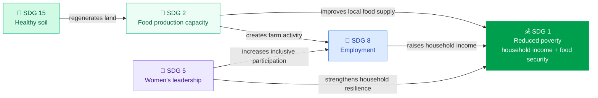

Adelphi directly addresses five of the United Nations' 17 Sustainable Development Goals. These are not aspirational alignments — they are active, measurable commitments with specific outputs tracked through the Kokonut [MRV stack](/ecosystem-wiki/kokonut-farms/measurement-reporting-and-verification), anchored as on-chain [EAS attestations](https://docs.attest.sh/), and published to [hub.kokonut.network/projects/41](https://hub.kokonut.network/projects/41).

Each SDG section below follows the same structure: what Adelphi does, the specific metrics it produces, how impact is measured, and which other SDGs that commitment reinforces. This follows the [Kokonut Framework SDG methodology](/kokonut-framework/framework-features/Sustainable-Development-Goals), which applies the [8 Forms of Capital](/kokonut-framework/framework-components/framework-features/8-forms-of-capital) and [EBF Framework](https://ebfcommons.org/) to make SDG claims verifiable rather than declarative.

---

## SDG 1 — No Poverty

> _Eradicate extreme poverty for all people everywhere and ensure all people have equal rights to economic resources._

**What Adelphi does:** This organic agricultural project contributes to poverty eradication by providing dignified, sustainable employment for local community members — improving income and quality of life for the families who participate in farm operations, training programs, and community activities.

**Specific metrics:**

| **Indicator** | **Current figure** | **Data source** |
| --- | --- | --- |
| Jobs supported | 7 full-time positions | [hub.kokonut.network/projects/41](https://hub.kokonut.network/projects/41) |
| Projected gross annual revenue | ~\$149,110 | [Harvest Forecast](/ecosystem-wiki/kokonut-farms/adelphi/crops-and-harvest-forecast) |
| Public goods allocation | ~\$14,911/yr (10% of revenue) | [Common Data Schema](/kokonut-framework/framework-components/common-data-schema) |
| Revenue streams | 4 (lettuce, passion fruit, coconut, eggs) | [Crops & Harvest Forecast](/ecosystem-wiki/kokonut-farms/adelphi/crops-and-harvest-forecast) |

**Capital contributions:**

- **Financial capital:** Direct employment income and revenue distribution within the local Monte Plata community
- **Social capital:** Community-owned revenue model — 10% of all farm revenue routed to public goods activities for the surrounding community. **How it's measured:** Monthly revenue tracking from crop sales and poultry production. Annual household income impact assessment. Employment records are maintained and reported via the Atlantis App field data system.

**SDG interconnections:**

- Contributes to **SDG 8** (Decent Work) by providing stable agricultural employment
- Supported by **SDG 2** (Zero Hunger) — food security at the household level reduces expenditure that would otherwise reduce disposable income
- Reinforced by **SDG 5** (Gender Equality) — women-led income generation strengthens the economic independence of the founding family and their community

---

## SDG 2 — Zero Hunger

> _End hunger, achieve food security and improved nutrition, and promote sustainable agriculture._

**What Adelphi does:** By focusing on the production of diverse organic foods across three crop cycle lengths, Adelphi enhances food security and provides nutritious food to the community year-round — reducing dependence on imported or processed products that are both less nutritious and more expensive.

**Specific metrics:**

| **Crop** | **Annual production** | **Cycle** |
| --- | --- | --- |
| Lettuce (\+ broccoli, spinach, tomatoes, arugula) | 48,450 units × 5 harvests = 242,250 units/yr | Short (30–75 days) |
| Passion fruit | 47,600 fruits · 3,661 nets/yr | Medium (seasonal) |
| Coconut | 6,144 coconuts/yr | Long (perennial) |
| Indian Yam | Additional medium-cycle food crop | Medium |
| Free-range eggs | ~36,500 eggs/yr (100/day) | Continuous |

**Distribution channels:**

- Organic markets — direct community access to fresh produce
- Local supermarkets — broader regional food security contribution
- On-site direct sales — lowest-friction access for immediate community **Capital contributions:**
- **Living capital:** Diverse, resilient food production system with [syntropic multi-strata structure](/kokonut-framework/why-syntropic-farming) that is less susceptible to climate shocks than monoculture
- **Cultural capital:** Preservation of native fruit varieties and traditional Dominican food crops through the endangered species nursery. **How it's measured:** Harvest records per crop per cycle, logged to the [Data Hub](https://hub.kokonut.network/projects/41). Community food access surveys conducted annually. Organic certification compliance, once achieved, tracks quality standards.

**SDG interconnections:**

- Supported by **SDG 15** (Life on Land) — healthy soil through biochar and syntropic farming directly enables diverse food production capacity
- Contributes to **SDG 1** (No Poverty) — local food production reduces household food expenditure, improving disposable income
- Reinforced by **SDG 8** (Decent Work) — the people producing this food have stable employment from the same operation

---

## SDG 5 — Gender Equality

> _Achieve gender equality and empower all women and girls._

**What Adelphi does:** This project serves as a model for female leadership in agriculture, empowering women to manage resources, make decisions, and generate independent income. Founded and operated by sisters Yanny and Neury Hernández — both single mothers who transitioned from non-agricultural careers to build this farm — Adelphi demonstrates that women can lead every dimension of a regenerative agricultural enterprise: land ownership, production management, community programming, and financial decision-making.

By promoting women's active participation in sustainable production, education, and environmental conservation, Adelphi strengthens the role of women in the local community and advances gender equality in a sector where they are structurally underrepresented.

**Specific evidence:**

| **Dimension** | **Evidence** |
| --- | --- |
| Ownership | Land and project co-owned by Yanny and Neury Hernández |
| Operational leadership | Both founders manage daily farm operations |
| Financial management | Revenue, costs, and public goods allocation are managed by the founders |
| Community programs | Founders design and lead all educational and community activities |
| Governance | Farm registered under a women-led operator in the Kokonut DAO governance structure |

**Capital contributions:**

- **Social capital:** Inclusive governance model — women hold all decision-making roles, demonstrating viability for other women in the region
- **Experiential capital:** Equal access to skill development in regenerative agriculture, farm management, and cooperative governance. **How it's measured:** Governance records in the Kokonut DAO [Farm Registry](/build-with-kokonut#framework-data-primitives). Community survey tracking women's participation in farm programs annually. SDG 5 attestation created on-chain via EAS for each annual reporting cycle.

**SDG interconnections:**

- Directly reinforces **SDG 1** (No Poverty) — women's economic independence is the most durable pathway out of household poverty
- Contributes to **SDG 8** (Decent Work) — women in leadership create the conditions for other women to access decent agricultural employment in the region
- Connected to the [Kokonut Manifesto's](/ecosystem-wiki/kokonut-101/manifesto) Freedom of Access principle: anyone who adds value should receive governance rights and economic participation — regardless of gender

---

## SDG 8 — Decent Work and Economic Growth

> _Promote sustained, inclusive and sustainable economic growth, full and productive employment, and decent work for all._

**What Adelphi does:** Adelphi creates seven documented employment positions within the local community — with a deliberate focus on hiring women and training community members in agro-ecological skills that build long-term employability beyond any single farm.

**Specific metrics:**

| **Indicator** | **Figure** |
| --- | --- |
| Full-time positions | 7 |
| Employment focus | Particularly, women in the Monte Plata rural community |
| Training programs | Regular workshops at the on-site education gazebo |
| Organic certification path | In progress — Ministry of Agriculture (DR) |
| Market access upon certification | Premium organic market pricing and formal supermarket distribution |

**Work categories at Adelphi:**

- Crop management across short, medium, and long cycle beds
- Poultry management (110 hens, daily egg collection, manure processing)
- Nursery operations — propagation, GPS tracking, community distribution
- Biochar production (bamboo harvest, pyrolysis, soil application)
- Community education program delivery
- MRV data collection and Atlantis App field logging, **Capital contributions:**
- **Financial capital:** Sustainable agricultural employment model generating stable wages within the local economy
- **Human capital:** Skills training through the [agro-ecological education center](/ecosystem-wiki/kokonut-farms/adelphi/crops-biodiversity-and-infrastructure) — building capabilities that transfer to other agricultural contexts **How it's measured:** Employment records maintained quarterly. Skills training participation is tracked per workshop session. Economic impact assessment included in annual EBF report. Organic certification status is tracked against Ministry of Agriculture milestones.

**SDG interconnections:**

- Reinforces **SDG 1** (No Poverty) — employment income is the primary mechanism for poverty reduction
- Enabled by **SDG 5** (Gender Equality) — women-led management creates the organizational culture that recruits and retains women workers
- Supported by **SDG 15** (Life on Land) — regenerative farming creates more employment per hectare than extractive conventional agriculture

---

## SDG 15 — Life on Land

> _Protect, restore and promote sustainable use of terrestrial ecosystems, sustainably manage forests, combat desertification, halt and reverse land degradation, and halt biodiversity loss._

**What Adelphi does:** With a focus on agro-biodiversity, regenerative soil techniques, and the complete elimination of chemical inputs, Adelphi promotes the conservation and sustainable use of terrestrial ecosystems — actively restoring the land while producing food and income for the community.

**Specific evidence:**

| **Practice** | **Detail** | **Evidence** |
| --- | --- | --- |
| Endangered species nursery | 12\+ at-risk native species propagated and distributed free to neighbors | [Crops & Biodiversity](/ecosystem-wiki/kokonut-farms/adelphi/crops-biodiversity-and-infrastructure) |
| Biochar soil regeneration | All crop beds treated with on-site bamboo-derived biochar | [Infrastructure page](/ecosystem-wiki/kokonut-farms/adelphi/crops-biodiversity-and-infrastructure) |
| Syntropic farming plots | 2 dedicated plots implementing the full four-strata syntropic method | [Why Syntropic Farming](/kokonut-framework/why-syntropic-farming) |
| Erosion control | Beard grass ground cover system along all terraced edges | [Infrastructure page](/ecosystem-wiki/kokonut-farms/adelphi/crops-biodiversity-and-infrastructure) |
| Native species distributed | Free propagated plants to visitors and neighboring communities | Background story |
| Vegetation health monitoring | NDVI, NDRE, MSAVI satellite indices \+ per-plant Silvi GPS tracking | [MRV page](/ecosystem-wiki/kokonut-farms/measurement-reporting-and-verification) |
| Carbon sequestration | 0.4–1.2 t CO₂e/acre/yr baseline \+ ~18% biochar uplift | [MRV — Carbon Sequestration tab](/ecosystem-wiki/kokonut-farms/measurement-reporting-and-verification) |

**Species in the at-risk nursery** (partial list — full catalog at [AdelphiSpeciesGeoNode](https://link.kokonut.network/AdelphiSpeciesGeoNode)): Hispaniola palmetto · Native cacao · Guavaberry · Congo coffee tree · Jagua · Naseberry · Star Apple · Mammee Apple · Custard Apple · Cashew · Soursop · Lipsticktree

**Capital contributions:**

- **Living capital:** Active enhancement of biodiversity — the farm increases rather than depletes the ecological value of its land with each season
- **Intellectual capital:** Documentation of native species propagation techniques and syntropic farming applications specific to Dominican Republic conditions — contributed back to the Kokonut Framework as open-source methodology. **How it's measured:** Quarterly biodiversity surveys tracking changes in local flora and fauna. Annual carbon sequestration rate calculated from satellite NDVI data and soil organic matter tests. Nursery species count and distribution records are maintained per season. All vegetation indices are archived via the MRV pipeline and attested on-chain.

**SDG interconnections:**

- Directly enables **SDG 2** (Zero Hunger) — soil health is the foundation of food production capacity; the land improves every season under syntropic methods
- Contributes to **SDG 13** (Climate Action) — carbon sequestration through biochar, agroforestry, and syntropic farming; not an Adelphi primary SDG but a direct co-benefit
- Supported by **SDG 1** (No Poverty) — free native plant distribution to neighbors extends the farm's biodiversity impact beyond its own boundary while strengthening community relationships

---

## How the five SDGs reinforce each other

The five SDGs at Adelphi are not independent commitments — they form a reinforcing system where progress in one accelerates progress in others.



```text
SDG 15 (healthy soil)
      │
      ▼
SDG 2 (food production capacity)
      │
      ▼
SDG 1 (household income + food security)
      ▲                    ▲
      │                    │
SDG 8 (employment)    SDG 5 (women's leadership)
      └──────────────────┘
      (both reinforce SDG 1 and each other)
```

Soil health at SDG 15 is the ecological foundation. Healthy soil enables diverse food production (SDG 2), which enables household income (SDG 1). Women-led management (SDG 5) creates the organizational culture that recruits and retains women workers (SDG 8), and women's economic independence is the most durable pathway to household poverty reduction (SDG 1). The five SDGs close into a self-reinforcing loop — each one Adelphi strengthens makes the others more achievable.

---

## Annual SDG reporting

SDG impact at Adelphi is reported annually through the [EBF Framework](https://ebfcommons.org/) across four dimensions:

| **EBF dimension** | **SDGs covered** | **Key metrics reported** |
| --- | --- | --- |
| **Environmental** | SDG 15, SDG 2 (soil) | Carbon sequestration (t CO₂e/acre/yr), NDVI averages, biodiversity index changes, nursery species count |
| **Economic** | SDG 1, SDG 8 | Gross revenue, public goods distributed (USD), jobs sustained, household income changes |
| **Social** | SDG 5, SDG 8, SDG 1 | Women in leadership roles, training program participants, community programs held |
| **Sustainability** | All five | Annual audit across all 8 forms of capital, organic certification status, SDG attestation count |

Reports are published to [hub.kokonut.network/projects/41](https://hub.kokonut.network/projects/41) and anchored as EAS attestations on Gnosis Chain — providing a tamper-proof, publicly queryable record of Adelphi's annual SDG performance.

For the full Kokonut Network SDG alignment methodology — including all 17 SDGs, capital contribution frameworks, and interconnection analysis — see the [Framework SDG documentation](/kokonut-framework/framework-features/Sustainable-Development-Goals).

---

<CardGroup cols={2}>
  <Card title="MRV — How is the impact verified" icon="magnifying-glass-chart" href="/ecosystem-wiki/kokonut-farms/measurement-reporting-and-verification">
    The measurement and verification stack that turns SDG claims into on-chain verified records — satellite monitoring, soil probes, EAS attestations.
  </Card>

  <Card title="Framework SDG Methodology" icon="chart-network" href="/kokonut-framework/framework-features/Sustainable-Development-Goals">
    The full Kokonut Framework SDG analysis — all 17 goals, capital contributions, and interconnections for community-owned syntropic farms.
  </Card>

  <Card title="Crops & Harvest Forecast" icon="dragon" href="/ecosystem-wiki/kokonut-farms/adelphi/crops-and-harvest-forecast">
    The production numbers behind SDG 1, 2, and 8 — how \$149,110/yr in revenue and 48,450 lettuces per harvest translate into real economic and food security impact.
  </Card>

  <Card title="Crops, Biodiversity & Infrastructure" icon="puzzle" href="/ecosystem-wiki/kokonut-farms/adelphi/crops-biodiversity-and-infrastructure">
    The physical evidence for SDG 15 — the 12\+ species nursery, biochar system, syntropic plots, and erosion control that make the biodiversity claims on this page verifiable.
  </Card>

  <Card title="Background Story" icon="rectangle-history" href="/ecosystem-wiki/kokonut-farms/adelphi/background-story">
    The human story behind SDG 5 — how Yanny and Neury Hernández built Adelphi and what women-led agricultural leadership looks like in practice.
  </Card>

  <Card title="Adelphi Data Hub" icon="chart-line" href="https://hub.kokonut.network/projects/41">
    Live SDG metrics — harvest records, employment data, and impact reports for every reporting cycle since Adelphi began production.
  </Card>
</CardGroup>