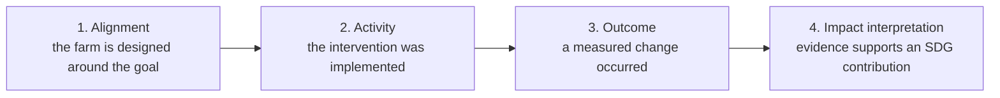
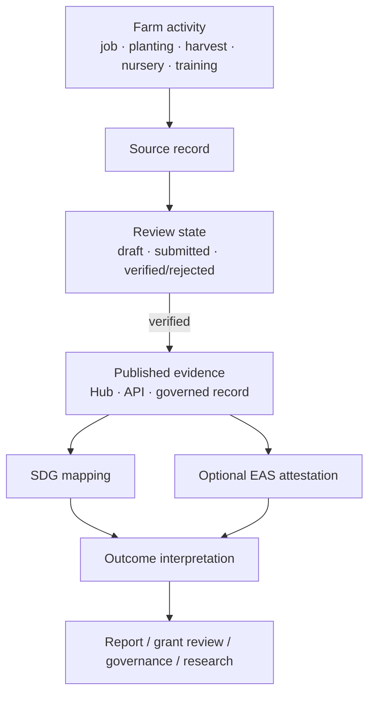
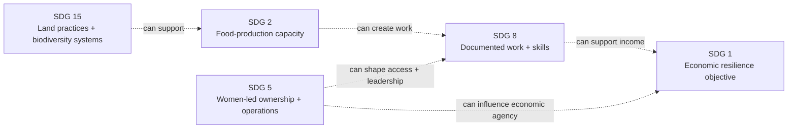

# Adelphi uses the SDGs as an evidence map — not as proof by themselves.

Adelphi currently focuses on five primary Sustainable Development Goals:

- **SDG 1 — No Poverty**
- **SDG 2 — Zero Hunger**
- **SDG 5 — Gender Equality**
- **SDG 8 — Decent Work and Economic Growth**
- **SDG 15 — Life on Land**

These goals describe **what the farm is trying to improve**.

They do not automatically prove that poverty was reduced, food security improved, gender inequality declined, employment quality increased, or biodiversity recovered.

> **An SDG claim becomes credible only when the activity, metric, reporting period, evidence source, and interpretation are clear.**

<CardGroup cols={2}>
  <Card title="Inspect published farm records" icon="chart-line" href="https://hub.kokonut.network/projects/41">
    Use the Kokonut Hub for current published farm, harvest, MRV, milestone, and project records.
  </Card>

  <Card title="Understand the evidence lifecycle" icon="magnifying-glass-chart" href="/ecosystem-wiki/kokonut-farms/measurement-reporting-and-verification">
    See how observations, measurements, forecasts, reviewed records, attestations, and interpretations remain separate.
  </Card>
</CardGroup>

<Info>
  **Alignment is not the same as verified impact.** A farm can be designed around an SDG before enough evidence exists to claim that the corresponding development outcome has been achieved.
</Info>

---

## The four levels of an SDG claim

Adelphi's SDG reporting should distinguish four levels.

```mermaid
flowchart LR
    A["1. Alignment<br/>the farm is designed around the goal"] --> B["2. Activity<br/>the intervention was implemented"]
    B --> C["3. Outcome<br/>a measured change occurred"]
    C --> D["4. Impact interpretation<br/>evidence supports an SDG contribution"]
```

| Level | Example | What it means |
| --- | --- | --- |
| **Alignment** | Adelphi prioritizes SDG 2 | Food production is part of the project design |
| **Activity** | Crops were planted or hens are present | A relevant intervention exists |
| **Outcome** | A documented harvest or job was recorded | Something measurable happened |
| **Impact interpretation** | Food access improved for a defined group | A higher-level conclusion supported by outcome evidence and context |

Most overclaiming happens when a page jumps directly from **alignment or activity** to **impact**.

---

## Primary SDGs at a glance

| SDG | Strongest current Adelphi claim | Current evidence class | Stronger claim still requires |
| --- | --- | --- | --- |
| **SDG 1 — No Poverty** | Seven jobs are documented; farm revenue and public-goods flows are modeled | Documented state + forecast | Payroll/income records, realized revenue, allocation records, household or beneficiary evidence |
| **SDG 2 — Zero Hunger** | Adelphi has diversified food-production capacity across crops and poultry | Implemented system + forecast | Harvest actuals, sales/distribution records, food-access evidence |
| **SDG 5 — Gender Equality** | Adelphi is founded, owned, and operated by Yanny and Neury Hernández | Documented state | Participation, income, opportunity, leadership, and benefit-sharing data beyond the founders |
| **SDG 8 — Decent Work** | Seven jobs are documented and multiple farm skill domains exist | Documented state + program intent | Role type, duration, compensation, safety, training, retention, and worker evidence |
| **SDG 15 — Life on Land** | Regenerative practices, nursery, syntropic plots, biochar, and geospatial monitoring are documented | Implemented practice + measurement capability | Baselines and repeated soil, vegetation, biodiversity, survival, and land-condition evidence |

<Note>
  This table intentionally uses the **strongest claim the current documentation can support**, not the strongest claim the project hopes to make eventually.
</Note>

---

## How SDG evidence should flow

The SDG layer sits **after** farm evidence, not before it.

```mermaid
flowchart TD
    A["Farm activity<br/>job · planting · harvest · nursery · training"] --> B["Source record"]
    B --> C["Review state<br/>draft · submitted · verified/rejected"]
    C -->|verified| D["Published evidence<br/>Hub · API · governed record"]
    D --> E["SDG mapping"]
    E --> F["Outcome interpretation"]
    F --> G["Report / grant review / governance / research"]

    D --> H["Optional EAS attestation"]
    H --> F
```

An SDG label should never create evidence retroactively.

The supporting evidence should exist first.

---

## SDG 1 — No Poverty

### Adelphi's current connection

Adelphi connects to SDG 1 through:

- documented farm employment;
- productive assets;
- modeled farm revenue;
- a modeled public-goods allocation;
- women-led ownership and operations.

The strongest current economic claim is:

> **Adelphi supports documented jobs and is building productive farm capacity that may generate recurring income.**

That is different from saying poverty has already been reduced.

### Current evidence

| Indicator | Current status | Evidence type |
| --- | --- | --- |
| Jobs supported | **7 documented jobs** | Documented state |
| Gross crop revenue | **~\$149,110.87/year** | Steady-state forecast, not actual |
| Public-goods allocation | **10% in the current farm model** | Modeling assumption, not realized distribution |
| Revenue streams | Lettuce, passion fruit, coconut; poultry modeled separately | Forecast / production design |

<Warning>
  The repository also contains a conflicting **40% operators / 40% public goods / 20% Kokonut Network** allocation in parts of the ReFi Playbook. The 10% figure should therefore be treated only as the current farm-model assumption until the authoritative economic arrangement is reconciled.
</Warning>

### Evidence needed for a stronger SDG 1 claim

- employment duration and role type;
- compensation or payroll evidence;
- realized sales and revenue;
- farm operating costs;
- realized public-goods transfers;
- operator income;
- beneficiary or household economic data where appropriate;
- reporting period.

### What not to claim yet

- “Adelphi reduced poverty”;
- “farm income is resilient”;
- “public goods are already funded at the modeled level”;
- “forecast revenue equals operator income.”

[Review the forecast model →](/ecosystem-wiki/kokonut-farms/adelphi/crops-and-harvest-forecast)

---

## SDG 2 — Zero Hunger

### Adelphi's current connection

Adelphi has diversified food-production infrastructure across:

- short-cycle vegetables;
- passion fruit;
- Indian yam;
- coconut;
- poultry eggs;
- additional agroforestry and food species.

The strongest current claim is:

> **Adelphi has diversified food-production capacity and a documented production model.**

That is not the same as demonstrating improved food security for the surrounding community.

### Current planning model

| Production stream | Current model | Evidence class |
| --- | --- | --- |
| Lettuce | 48,450 units/harvest × 5 modeled harvests | Forecast |
| Passion fruit | 47,600 modeled saleable fruits/year | Forecast |
| Coconut | 6,144 coconuts/year at modeled productive maturity | Forecast |
| Poultry | ~100 eggs/day from 110 hens | Estimate |
| Indian yam | Medium-cycle production stream | Implemented / planned crop |

### Evidence needed for a stronger SDG 2 claim

- actual planted quantities;
- actual harvest quantities;
- losses and rejected produce;
- egg production logs;
- sales and distribution records;
- destination or buyer category;
- donations or community distribution;
- affordability or access evidence if making food-security claims.

### What not to claim yet

- “local food insecurity was reduced”;
- “the community has improved access to food” without distribution evidence;
- “242,250 lettuces/year were produced” when that figure is a forecast.

<Card title="Forecast vs. actuals" icon="calculator" href="/ecosystem-wiki/kokonut-farms/adelphi/crops-and-harvest-forecast">
  See the assumptions behind Adelphi's production model and the actual records required to replace them over time.
</Card>

---

## SDG 5 — Gender Equality

### Adelphi's current connection

SDG 5 has one of the clearest documented starting points at Adelphi:

**Yanny and Neury Hernández are women directly connected to land ownership, project leadership, and farm operations.**

The repository describes them as:

- sisters;
- single mothers;
- landowners;
- founders;
- operators.

This supports the claim:

> **Adelphi is a women-led agricultural project.**

It does not prove that gender inequality has been reduced across the surrounding community.

### Current evidence

| Dimension | Strong current evidence |
| --- | --- |
| Ownership / stewardship | Yanny and Neury are documented as landowners and founders |
| Operational leadership | The sisters remain central to farm operations and project direction |
| Public leadership | They are the named founders/operators of the project |
| Community-facing role | The farm is designed to host education and community programs |

### Evidence needed for a broader SDG 5 claim

- participation of women in employment;
- role and decision-making data;
- training participation by gender where appropriate;
- compensation or economic-benefit data;
- access to land, capital, or technical opportunity;
- leadership roles beyond the founders;
- reporting period and comparison over time.

### What not to claim yet

- “Adelphi reduced gender inequality”;
- “women in the community have greater economic independence” without evidence;
- “inclusive hiring” unless actual hiring records support it.

[Read the founders' story →](/ecosystem-wiki/kokonut-farms/adelphi/background-story)

---

## SDG 8 — Decent Work and Economic Growth

### Adelphi's current connection

Adelphi currently documents **seven jobs** and multiple work domains associated with operating the farm.

Work can include:

- crop management;
- irrigation and maintenance;
- poultry care;
- nursery propagation;
- biological-input and biochar workflows;
- community-program support;
- farm records and MRV.

The strongest current claim is:

> **Adelphi supports documented agricultural work and creates opportunities to build regenerative-farming skills.**

The term **decent work** requires more evidence than a job count alone.

### Evidence needed for a stronger SDG 8 claim

| Dimension | Evidence required |
| --- | --- |
| Employment | Role, start date, duration, full-/part-time/seasonal status |
| Compensation | Wage or payment records where appropriate |
| Safety | PPE, incidents, safety procedures, training |
| Skills | Training logs, demonstrated competencies, role progression |
| Continuity | Retention, recurring employment, seasonality |
| Market sustainability | Realized sales and operating economics |
| Certification-related skills | Training and formal records where certification applies |

### Market-readiness context

The repository documents:

- organic certification as **in progress**;
- target channels such as organic-food businesses, supermarkets, and direct community sales.

Those are readiness activities and market goals.

They are not evidence of certification completion, buyer contracts, or realized economic growth.

### What not to claim yet

- “seven full-time jobs” unless role records establish full-time status;
- “decent work is proven” from job count alone;
- “market access is established” without buyer or sales records.

---

## SDG 15 — Life on Land

### Adelphi's current connection

Adelphi implements several practices relevant to SDG 15:

- syntropic farming;
- agroforestry;
- native and at-risk species propagation;
- nursery operations;
- bamboo-derived biochar;
- ground cover;
- poultry integration;
- geospatial records;
- remote-sensing indicators.

These support a strong **activity-level** claim:

> **Adelphi is implementing land-management and biodiversity practices designed to support ecological regeneration.**

They do not by themselves prove biodiversity restoration, improved soil function, carbon sequestration, or reduced land degradation.

### Current evidence map

| Practice / system | Strong current claim | Stronger outcome requires |
| --- | --- | --- |
| Nursery | Native/at-risk species inventory and propagation are documented | Verified species status, propagation/survival/distribution records |
| Syntropic plots | Two syntropic plots are documented | Repeated soil, vegetation, yield, and biodiversity evidence |
| Biochar | Bamboo-derived biochar practice is documented | Application records plus repeated soil measurements |
| Ground cover | Erosion-management practices are documented | Before/after imagery, cover measurements, erosion observations |
| Per-plant GPS | Location and plant records can be preserved | Survival, phenology, health, and longitudinal records |
| Remote sensing | NDVI, NDRE, ReCI, MSAVI can track vegetation patterns | Defined baseline, consistent periods, sensor/method context |

<Warning>
  The repository uses conservation terms such as **native**, **at-risk**, **endangered**, and **critically threatened** inconsistently across older pages. External biodiversity reporting should verify conservation status species by species against an authoritative source.
</Warning>

### What not to claim yet

- “biodiversity has been restored”;
- “soil health has improved” without repeated soil evidence;
- “erosion has been reduced” without comparative evidence;
- “carbon has been sequestered” without the appropriate methodology and reporting period.

[See the physical farm systems →](/ecosystem-wiki/kokonut-farms/adelphi/crops-biodiversity-and-infrastructure)

---

## SDG 13 — Climate Action remains a co-benefit

Adelphi's practices can create climate-relevant signals through:

- agroforestry;
- biochar;
- living vegetation;
- soil-building practices;
- reduced bare soil;
- perennial systems.

But the current Kokonut Framework treats **SDG 13 as a secondary climate co-benefit**, not one of Adelphi's five primary SDGs.

That boundary should remain until stronger methodology exists.

A direct climate or carbon claim would require, at minimum:

- a defined carbon methodology;
- baseline;
- measurement boundary;
- soil and/or biomass data where applicable;
- reporting period;
- uncertainty treatment;
- review or verification appropriate to the claim.

<Warning>
  Climate alignment does not create a carbon credit, certified sequestration result, or guaranteed emissions benefit.
</Warning>

---

## Secondary SDGs should remain secondary unless evidence matures

The broader Kokonut Framework maps additional SDGs as conditional or secondary.

Examples relevant to Adelphi can include:

| Secondary SDG | Potential connection | Evidence that would strengthen it |
| --- | --- | --- |
| **SDG 4 — Quality Education** | Workshops, farm demonstrations, open documentation | Event logs, attendance, curriculum, learning outcomes |
| **SDG 12 — Responsible Consumption & Production** | Biological inputs, biochar, nutrient cycling, local production | Input records, waste/material flows, procurement and production evidence |
| **SDG 13 — Climate Action** | Biochar, agroforestry, vegetation, resilience | Carbon/soil/biomass methodology and longitudinal evidence |
| **SDG 17 — Partnerships for the Goals** | Public Nouns, open-source contributors, partners | Agreements, deliverables, contribution records, joint reporting |

This avoids a common SDG-reporting failure: claiming all 17 goals because a project can be loosely connected to them.

---

## The five primary SDGs reinforce the farm system — but causality must still be measured

The original SDG page presented a causal chain such as:

**healthy land → food → jobs → income → resilience**

That is a useful design hypothesis.

It should not be reported as demonstrated causality without evidence.

A safer systems view is:

```mermaid
flowchart LR
    S15["SDG 15<br/>Land practices + biodiversity systems"]
    S2["SDG 2<br/>Food-production capacity"]
    S8["SDG 8<br/>Documented work + skills"]
    S5["SDG 5<br/>Women-led ownership + operations"]
    S1["SDG 1<br/>Economic resilience objective"]

    S15 -. "can support" .-> S2
    S2 -. "can create work" .-> S8
    S8 -. "can support income" .-> S1
    S5 -. "can shape access + leadership" .-> S8
    S5 -. "can influence economic agency" .-> S1
```

The dotted relationships are **hypotheses and pathways**, not measured causal conclusions.

---

## Reporting cadence: what should happen

The Framework describes annual impact reporting as the place where SDG evidence can be summarized.

For Adelphi, an annual SDG review **should** reconcile:

- documented jobs;
- harvest actuals;
- sales and distribution;
- public-goods transfers;
- training and event records;
- nursery propagation and distribution;
- soil and vegetation evidence;
- certification status;
- major changes in farm operations;
- unresolved evidence gaps.

The report should identify each claim as:

- **documented state**;
- **measurement**;
- **derived indicator**;
- **forecast/model**;
- **reviewed/attested claim**;
- **interpretation**.

<Note>
  This page does not assume a complete annual SDG report already exists for every period. It defines the evidence structure such a report should use.
</Note>

---

## SDG claim template

Every material SDG claim should answer:

| Field | Question |
| --- | --- |
| **SDG** | Which primary or secondary goal is being referenced? |
| **Claim** | What exactly are we saying happened? |
| **Evidence level** | Alignment, activity, outcome, or impact interpretation? |
| **Metric** | What is being counted or measured? |
| **Baseline** | What was the starting point, when relevant? |
| **Reporting period** | What dates does the claim cover? |
| **Source** | Farm record, payroll, harvest, sale, event, sensor, satellite, etc.? |
| **Record status** | Draft, submitted, verified, published, rejected? |
| **Evidence pointer** | Hub record, file, dataset, CID, attestation, report? |
| **Limitations** | What remains uncertain or unmeasured? |

### Example

Instead of:

> “Adelphi advances SDG 2 by improving food security.”

Prefer:

> “Adelphi's production system aligns with SDG 2. During the reporting period, the farm recorded **[actual harvest quantity]** of **[crop]**, of which **[distribution quantity]** was sold or distributed through **[channel]**. Broader food-security outcomes have not yet been measured.”

That wording makes the evidence boundary visible.

---

## What this page can support today

<CardGroup cols={2}>
  <Card title="Five primary SDGs are clearly defined" icon="recycle">
    SDG 1, 2, 5, 8, and 15 provide the baseline impact map for Adelphi.
  </Card>

  <Card title="Every SDG can be tied to evidence requirements" icon="clipboard-check">
    Jobs, harvests, ownership, work conditions, species records, and land practices each have an identifiable evidence path.
  </Card>

  <Card title="Forecasts stay separate from outcomes" icon="calculator">
    Modeled crop revenue, production, egg output, and public-goods allocations are not reported as achieved impact.
  </Card>

  <Card title="Secondary claims have a maturity path" icon="arrows-rotate">
    Education, climate, responsible production, and partnerships can become stronger claims when specific evidence exists.
  </Card>
</CardGroup>

### What this page does not prove

- that Adelphi has reduced poverty;
- that local food insecurity has declined;
- that gender inequality has been reduced beyond the documented women-led ownership structure;
- that all seven jobs meet every decent-work standard;
- that biodiversity or soil conditions have measurably improved;
- that carbon benefits have been verified;
- that a 10% or 40% public-goods allocation has been realized;
- that SDG alignment has been independently certified.

---

## Sources of truth by SDG question

| Question | Best source |
| --- | --- |
| What are Kokonut's primary vs. secondary SDGs? | [Framework SDG methodology](/kokonut-framework/framework-features/Sustainable-Development-Goals) |
| What has actually been published about Adelphi? | [Kokonut Hub](https://hub.kokonut.network/projects/41) |
| How should farm records become evidence? | [MRV methodology](/ecosystem-wiki/kokonut-farms/measurement-reporting-and-verification) |
| What does the crop/economic model assume? | [Crops & Harvest Forecast](/ecosystem-wiki/kokonut-farms/adelphi/crops-and-harvest-forecast) |
| What physical systems exist? | [Crops, Biodiversity & Infrastructure](/ecosystem-wiki/kokonut-farms/adelphi/crops-biodiversity-and-infrastructure) |
| What is the human context behind SDG 5? | [Background Story](/ecosystem-wiki/kokonut-farms/adelphi/background-story) |
| What problems is Adelphi designed to address? | [Problem & Solution](/ecosystem-wiki/kokonut-farms/adelphi/problem-and-solution) |

---

## Continue through Adelphi

<CardGroup cols={2}>
  <Card title="MRV — Evidence Standard" icon="magnifying-glass-chart" href="/ecosystem-wiki/kokonut-farms/measurement-reporting-and-verification">
    See how SDG-supporting records move from observation into review, publication, attestation, and interpretation.
  </Card>

  <Card title="Crops & Harvest Forecast" icon="calculator" href="/ecosystem-wiki/kokonut-farms/adelphi/crops-and-harvest-forecast">
    Review which SDG 1, 2, and 8 economic and production values are forecasts rather than actuals.
  </Card>

  <Card title="Crops, Biodiversity & Infrastructure" icon="puzzle" href="/ecosystem-wiki/kokonut-farms/adelphi/crops-biodiversity-and-infrastructure">
    Review the physical interventions relevant to SDG 2 and SDG 15.
  </Card>

  <Card title="Background Story" icon="rectangle-history" href="/ecosystem-wiki/kokonut-farms/adelphi/background-story">
    Understand the documented women-led ownership and founder context behind SDG 5.
  </Card>

  <Card title="Framework SDG Methodology" icon="chart-network" href="/kokonut-framework/framework-features/Sustainable-Development-Goals">
    See the primary/secondary SDG model that applies across Kokonut Framework farms.
  </Card>

  <Card title="Impact Calculator" icon="calculator" href="/kokonut-framework/impact-calculator">
    Use scenario outputs to plan evidence requirements without treating estimated SDG alignment as verified impact.
  </Card>
</CardGroup>

> **The SDGs are most useful when they tell us what evidence to collect next—not when they are used as badges for outcomes that have not yet been measured.**
