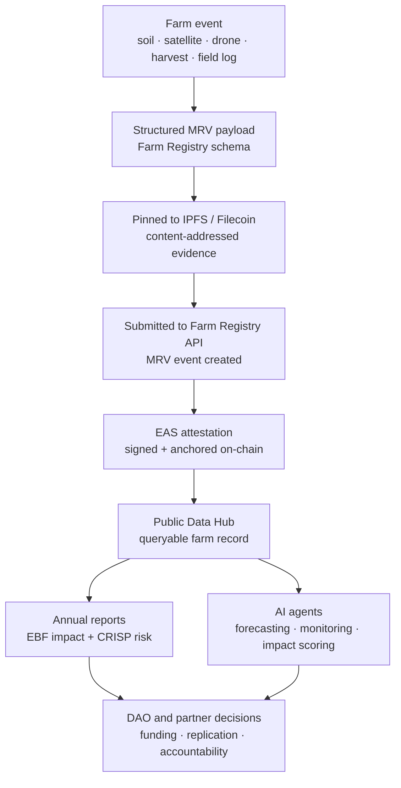

# Impact claims without evidence are marketing.

Measurement, Reporting, and Verification (**MRV**) is the trust layer of the Kokonut Framework. It is how a farm activity becomes evidence, how evidence becomes a public record, and how public records become useful for DAO members, grant reviewers, developers, researchers, capital allocators, and AI agents.

At Kokonut, MRV is not a PDF produced after the fact. It is a live data pipeline:

> **Farm activity → structured payload → IPFS record → Farm Registry event → EAS attestation → public Data Hub → annual impact report.**

At [Adelphi](/ecosystem-wiki/kokonut-farms/adelphi/summary), this pipeline is already active. Farm data flows to [hub.kokonut.network/projects/41](https://hub.kokonut.network/projects/41), where harvest records, MRV events, and impact metrics can be inspected by anyone.

<div style={{ display: "flex", gap: "12px", justifyContent: "center", flexWrap: "wrap", margin: "1.5rem 0 0.75rem" }}>
  <a href="#how-mrv-works" style={{ display: "inline-flex", alignItems: "center", gap: "6px", background: "#009F4D", color: "#fff", padding: "10px 20px", borderRadius: "8px", fontWeight: "600", fontSize: "14px", textDecoration: "none" }}>
    See How MRV Works →
  </a>

  <a href="https://hub.kokonut.network/projects/41" style={{ display: "inline-flex", alignItems: "center", gap: "6px", border: "1.5px solid #009F4D", color: "#009F4D", padding: "10px 20px", borderRadius: "8px", fontWeight: "600", fontSize: "14px", textDecoration: "none", background: "transparent" }}>
    Explore Adelphi Data
  </a>
</div>

<p style={{ textAlign: "center", fontSize: "13px", color: "#6b7280", marginTop: "0.25rem" }}>
  Built for farm operators, DAO members, grant reviewers, data scientists, Impact Guild contributors, and agent builders.
</p>

---

## MRV at a glance

<CardGroup cols={4}>
  <Card title="Measure" icon="satellite-dish">
    Soil probes, satellite imagery, drone surveys, and field observations capture what is happening on the farm.
  </Card>

  <Card title="Report" icon="database">
    Measurements are converted into structured Farm Registry payloads with timestamps, farm IDs, measurement types, and source-specific data.
  </Card>

  <Card title="Verify" icon="stamp">
    Payloads are pinned to IPFS/Filecoin and anchored through EAS attestations, creating public records that Kokonut cannot retroactively alter.
  </Card>

  <Card title="Use" icon="chart-line">
    Verified data powers farm management, DAO funding decisions, annual EBF reports, CRISP risk scoring, AI agents, and public impact dashboards.
  </Card>
</CardGroup>

<Note>
  MRV is valuable because it serves both the farm and the network. Operators get better irrigation, nutrient, and harvest decisions. DAO members and partners get verifiable evidence instead of self-reported claims.
</Note>

---

## What MRV proves

MRV answers five trust questions every regenerative farm eventually faces:

| **Question** | **MRV evidence** | **Who needs it** |
| --- | --- | --- |
| Is the farm real and active? | Farm registry record, geospatial data, field logs, harvest records | DAO members, funders, partners |
| Is the land improving? | NDVI, NDRE, ReCI, MSAVI, soil moisture, soil temperature, electrical conductivity | Impact Guild, agronomists, researchers |
| Are harvest claims credible? | Crop cycle logs, harvest milestones, production forecasts, Data Hub records | DAO members, buyers, operators |
| Is impact verifiable? | IPFS payloads, EAS attestations, annual EBF reports, CRISP risk assessments | Grant reviewers, institutions, public goods funders |
| Can the model scale? | Standardized payloads, API endpoints, agent-readable data, reusable reporting workflows | Developers, AI agents, new farms |

---

## How MRV works



The pipeline is designed so that each layer adds a different kind of trust:

1. **Sensor and field data** capture the event.
2. **Structured payloads** make the event machine-readable.
3. **IPFS/Filecoin CIDs** make the evidence content-addressed.
4. **Farm Registry events** make the data queryable.
5. **EAS attestations** make the record tamper-resistant.
6. **The Data Hub** makes the result public.
7. **Annual reports** turn raw data into ecological, economic, social, and sustainability insights.

---

## The three-tier monitoring stack

Kokonut's MRV methodology operates across three complementary sensing tiers. Each tier captures what the others cannot.

<Tabs>
  <Tab title="1. Ground sensing">
    Ground sensing measures what is happening below and around the crop.

    **Soil moisture probes** provide continuous subsurface readings across three core variables:

    - **Volumetric Water Content (VWC):** Measures how much water is present in the soil relative to total soil volume, helping operators detect irrigation needs before stress is visible above ground.
    - **Electrical Conductivity (EC):** Measures the soil's ability to conduct electricity, acting as a proxy for salinity and nutrient availability.
    - **Soil Temperature:** Tracks root-zone temperature, which affects germination, microbial activity, nutrient cycling, and plant growth.

    These readings feed into the `ground` field of each `KokonutMRVPayload`.
  </Tab>
  <Tab title="2. Remote sensing">
    Remote sensing monitors vegetation health across the farm landscape.

    Kokonut uses **Landsat 8**, **Sentinel**, and drone imagery to calculate vegetation indices. Each index is used for a different monitoring condition:

    | **Index** | **Formula** | **Best use** |
    | --- | --- | --- |
    | **NDVI** | `(NIR − RED) / (NIR + RED)` | Baseline vegetation health after canopy is established |
    | **ReCI** | `(NIR / RED) − 1` | Chlorophyll and nitrogen proxy during active vegetative growth |
    | **NDRE** | `(NIR − RED_EDGE) / (NIR + RED_EDGE)` | Mature or dense canopies where NDVI saturates |
    | **MSAVI** | `(2 × Band4 + 1 − √((2 × Band4 + 1)² − 8 × (Band4 − Band3))) / 2` | Early growth stages with high bare-soil exposure |

    Index selection matters. Applying the wrong index at the wrong crop stage can produce misleading readings.
  </Tab>
  <Tab title="3. Community analytics">
    Community analytics capture agronomic judgment that sensors cannot fully encode.

    Farm operators and community members log observations such as:

    - **Crop cycle stage:** `germination` → `seedling` → `vegetative` → `flowering` → `fruiting` → `harvest` → `post_harvest`
    - **Plant health notes:** vigor, color, uniformity, pests, disease, stress indicators
    - **Water analysis:** pH, turbidity, contamination signals, source conditions
    - **Soil texture:** tactile field assessment of structure, drainage, and organic matter
    - **Disease flags:** timestamped pest or disease observations for trend analysis

    These logs provide local context that cannot be captured by satellites alone.
  </Tab>
</Tabs>

---

## Tools used at Adelphi

| **Tool** | **Purpose** | **Data output** |
| --- | --- | --- |
| [Silvi](https://www.silvi.earth/) | Per-plant GPS tracking and health logs | Plant-level location and phenology records |
| [Atlantis App](https://apps.apple.com/in/app/impact-miner/id6448894610) | Field data collection, project management, and third-party attestations | Structured reports with photos, timestamps, and attestation-ready evidence |
| QGIS | Vegetation index calculation from drone orthomosaics | Raster analysis and NDVI/NDRE/MSAVI grid outputs |
| [Pix4Dcapture](https://www.pix4d.com/product/pix4dcapture) | Drone flight planning and orthomosaic generation | Georeferenced imagery for the QGIS pipeline |
| Landsat 8 \+ Sentinel | Landscape-scale remote sensing | Vegetation trends, crop health signals, and periodic monitoring snapshots |

---

## The MRV payload

Each farm operating under the Kokonut Framework reports against a common payload structure. This lets tools, dashboards, AI agents, and annual reports all read from the same source of truth.

```typescript
interface KokonutMRVPayload {
  farm_id: string;                  // Farm registry identifier
  timestamp: string;                // ISO 8601
  measurement_type: "ground" | "remote" | "community";

  // Ground sensing
  ground?: {
    volumetric_water_content: number; // % — moisture in soil volume
    electrical_conductivity: number;  // dS/m — salinity / nutrient proxy
    soil_temperature: number;         // °C
  };

  // Remote sensing
  remote?: {
    ndvi: number;    // general vegetation health
    reci: number;    // chlorophyll / nitrogen proxy
    ndre: number;    // dense or mature canopy monitoring
    msavi: number;   // early season / bare soil adjustment
    source: "landsat_8" | "sentinel" | "drone";
    image_url?: string; // IPFS CID or signed URL
  };

  // Community analytics
  community?: {
    crop_cycle_stage: string;
    plant_health_notes: string;
    water_analysis: string;
    soil_texture: string;
    disease_flags: string[];
  };

  // Attestation
  attested_by?: string;       // EAS attestation UID
  attestor_address?: string;  // Wallet that signed the attestation
}
```

---

## From measurement to verification

<Steps>
  <Step title="Data collected" icon="satellite-dish" iconType="regular">
    Soil probes, satellite images, drone imagery, harvest records, and community field logs are assembled into a structured MRV payload.
  </Step>
  <Step title="Payload pinned to IPFS/Filecoin" icon="database" iconType="regular">
    The full evidence package is pinned to IPFS/Filecoin. The returned CID is content-addressed: the same data always produces the same identifier, and different data cannot produce that same record.
  </Step>
  <Step title="Submitted to the Farm Registry API" icon="upload" iconType="regular">
    The payload is submitted to `POST /farms/{farm_id}/mrv`. The API returns a `mrv_id` and records the event before attestation.
  </Step>
  <Step title="EAS attestation created on-chain" icon="stamp" iconType="regular">
    The attestation encodes fields such as `farm_id`, `event_type`, `ipfs_cid`, `impact_score`, `attestor_role`, and `timestamp`. The record is signed by the attestor wallet and anchored on-chain.
  </Step>
  <Step title="Data appears on the public Data Hub" icon="chart-line" iconType="regular">
    Once attested, the MRV event appears in the farm's public record at [hub.kokonut.network/projects/41](https://hub.kokonut.network/projects/41), traceable to the original evidence package and on-chain attestation.
  </Step>
</Steps>

<Note>
  The purpose of on-chain verification is not hype. It prevents retroactive editing of the impact record and gives funders, DAO members, researchers, and communities a shared source of truth.
</Note>

---

## What gets reported annually

MRV events aggregate into annual impact reporting across four dimensions aligned with the Ecological Benefits Framework and the Kokonut 8 Forms of Capital.

| **Dimension** | **What is measured** | **Example metrics** |
| --- | --- | --- |
| **Environmental** | Ecological health and carbon performance | Carbon sequestration rates, NDVI averages, biodiversity index changes, MRV event count |
| **Economic** | Farmer and community financial impact | Gross revenue, public goods allocation, jobs created, household income changes |
| **Social** | Community wellbeing and capacity | Workshops, participants trained, women in leadership roles, educational program reach |
| **Sustainability** | Long-term resilience across all 8 forms of capital | Annual sustainability audit, organic certification status, SDG attestations |

Annual reports for [Adelphi](/ecosystem-wiki/kokonut-farms/adelphi/summary) are published through the public Data Hub. Historical MRV records, harvest forecasts, and aggregated impact metrics should remain traceable to their underlying EAS attestations.

---

## EBF and CRISP: the interpretation layer

Raw MRV data is the evidence. EBF and CRISP help interpret what that evidence means.

<CardGroup cols={2}>
  <Card title="EBF — Ecological Benefits Framework" icon="leaf-heart" href="/kokonut-framework/framework-add-ons/ecological-impact-frameworks">
    EBF asks: what ecological and community benefits did this farm produce, and how should they be reported across environmental, economic, social, and sustainability dimensions?
  </Card>

  <Card title="CRISP — Carbon Risk Scoring" icon="shield-check" href="/kokonut-framework/framework-add-ons/ecological-impact-frameworks">
    CRISP asks: how likely is the farm to deliver the carbon and ecological outcomes it claims, given operational, climate, policy, financial, and developer risks?
  </Card>
</CardGroup>

Together, they turn continuous farm-level MRV into an auditable impact profile that DAO members, public goods funders, grant reviewers, and institutional partners can use.

---

## How AI agents use MRV

Farms generate more data than human operators can process manually. Satellite passes can happen every few days. Soil probes can read hourly. Crop cycles produce repeated harvest records. Each event creates work: ingest, calculate, validate, attest, report, and sometimes trigger a DAO or marketplace action.

The [Kokonut × AI Agents](/kokonut-x-ai-agents) architecture is designed to automate the slowest parts of this workflow:

<CardGroup cols={3}>
  <Card title="MRV Agent" icon="satellite">
    Ingests satellite or drone data, calculates vegetation indices, and submits MRV payloads to the Farm Registry.
  </Card>

  <Card title="Harvest Agent" icon="wheat-awn">
    Converts harvest logs into structured records, links them to crop cycles, and prepares attestable outputs.
  </Card>

  <Card title="Impact Scoring Agent" icon="chart-mixed">
    Reads verified MRV and harvest records, calculates impact scores, and supports EBF and CRISP reporting.
  </Card>
</CardGroup>

<Warning>
  The Kokonut Agentic Marketplace is in active development. The current MRV page should distinguish between the live MRV methodology at Adelphi and the automation layer being built to increase reporting frequency and reduce manual bottlenecks.
</Warning>

---

## Why this matters for each reader

<CardGroup cols={2}>
  <Card title="Farm operators" icon="tractor">
    MRV improves decisions around irrigation, nutrients, crop stress, harvest timing, and long-term soil management.
  </Card>

  <Card title="DAO members and capital allocators" icon="coins">
    MRV provides evidence for funding proposals, treasury decisions, risk assessment, and replication decisions.
  </Card>

  <Card title="Grant reviewers and partners" icon="file-signature">
    MRV replaces subjective impact claims with timestamped records, public dashboards, and third-party-verifiable evidence.
  </Card>

  <Card title="Developers and agent builders" icon="code">
    MRV provides a standard schema, API surface, attestation format, and data layer for tools, dashboards, and AI agents.
  </Card>

  <Card title="Impact Guild contributors" icon="people-group">
    MRV creates clear work: validate field reports, review evidence packages, improve data standards, and produce annual impact reporting.
  </Card>

  <Card title="Communities" icon="hand-holding-seedling">
    MRV makes local work visible, making it easier for communities to prove what they grow, restore, teach, and sustain.
  </Card>
</CardGroup>

---

## Known improvement areas

MRV should be credible about what is live, what is planned, and what still needs contribution.

| **Area** | **Current direction** | **Contribution opportunity** |
| --- | --- | --- |
| Data schemas | Farm Registry and MRV payloads are documented | Improve compatibility, validation, and versioning |
| Attestations | EAS-compatible farm events are part of the pipeline | Define schemas, roles, review processes, and indexing |
| Dashboards | Adelphi records are published through the Data Hub | Improve public views, filters, charts, and export formats |
| AI automation | Agentic Marketplace architecture is in development | Build MRV, harvest, and impact scoring agents |
| Impact reporting | EBF and CRISP guide annual reports | Refine methodology and evidence requirements |
| Field workflow | Community analytics capture human judgment | Improve operator forms, photo standards, and QA checklists |

---

## Next steps

<CardGroup cols={2}>
  <Card title="Explore Adelphi Data" icon="chart-line" href="https://hub.kokonut.network/projects/41">
    See live MRV records, harvest data, and impact metrics from Kokonut's first live farm.
  </Card>

  <Card title="Build with Kokonut" icon="code" href="/build-with-kokonut">
    Use the Farm Registry schema, MRV payload format, attestation fields, and developer primitives.
  </Card>

  <Card title="Kokonut × AI Agents" icon="robot" href="/kokonut-x-ai-agents">
    Learn how agents automate MRV ingestion, vegetation index calculation, attestations, payments, and impact scoring.
  </Card>

  <Card title="Ecological Impact Frameworks" icon="leaf-heart" href="/kokonut-framework/framework-add-ons/ecological-impact-frameworks">
    Understand how EBF and CRISP convert raw MRV evidence into annual reports and carbon risk assessments.
  </Card>

  <Card title="Adelphi Farm" icon="seedling" href="/ecosystem-wiki/kokonut-farms/adelphi/summary">
    See the live reference implementation of the Kokonut Framework, MRV stack, and public data model.
  </Card>

  <Card title="Open Collaboration" icon="telescope" href="/ecosystem-wiki/open-collaboration-invitation">
    Join the Impact Guild, improve the MRV methodology, help validate data, or build tools for the next farm.
  </Card>
</CardGroup>

<div style={{ display: "flex", gap: "12px", justifyContent: "center", flexWrap: "wrap", margin: "2rem 0 0.75rem" }}>
  <a href="https://hub.kokonut.network/projects/41" style={{ display: "inline-flex", alignItems: "center", gap: "6px", background: "#009F4D", color: "#fff", padding: "10px 20px", borderRadius: "8px", fontWeight: "600", fontSize: "14px", textDecoration: "none" }}>
    Explore Live Data →
  </a>

  <a href="https://link.kokonut.network/discord" style={{ display: "inline-flex", alignItems: "center", gap: "6px", border: "1.5px solid #009F4D", color: "#009F4D", padding: "10px 20px", borderRadius: "8px", fontWeight: "600", fontSize: "14px", textDecoration: "none", background: "transparent" }}>
    Join the Impact Guild
  </a>
</div>