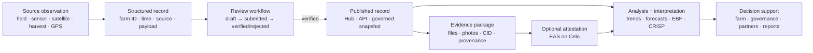
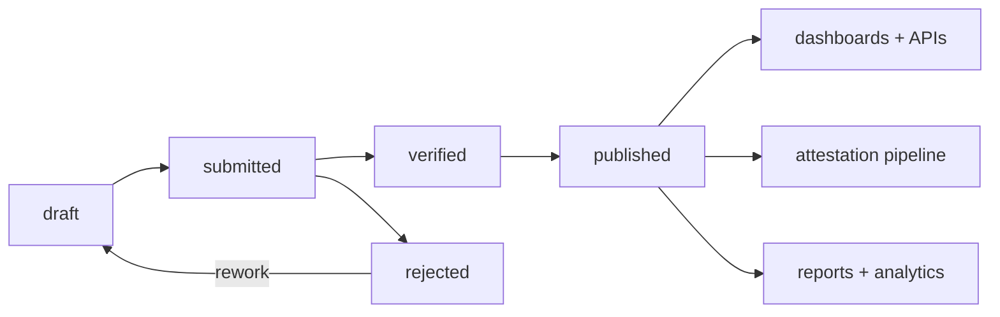
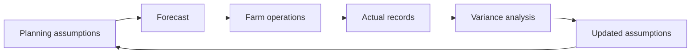

# MRV turns farm claims into evidence that can be inspected.

Measurement, Reporting, and Verification (**MRV**) is the evidence layer of the Kokonut Framework.

Its purpose is not to make every farm claim automatically true.

Its purpose is to make important claims **traceable**:

- what was observed;
- where and when it happened;
- how it was measured or reported;
- which record supports the claim;
- whether the record has been reviewed;
- whether it has been published or attested;
- what uncertainty or limitations remain.

At [Adelphi](/ecosystem-wiki/kokonut-farms/adelphi/summary), MRV is already part of the operating model. Public farm records are exposed through the [Kokonut Hub](https://hub.kokonut.network/projects/41), while the broader MRV and attestation infrastructure continues to expand.

<CardGroup cols={2}>
  <Card title="Inspect Adelphi's public records" icon="chart-line" href="https://hub.kokonut.network/projects/41">
    Use the Hub for current published farm records, MRV events, harvest information, and project data.
  </Card>

  <Card title="Understand the data infrastructure" icon="brain-circuit" href="/kokonut-intelligence">
    Kokonut Intelligence is the active data layer that stores, reviews, analyzes, publishes, and attests farm evidence.
  </Card>
</CardGroup>

<Info>
  **MRV is a chain of evidence, not a magic proof mechanism.** A sensor reading, a reviewed database record, an EAS attestation, and an impact conclusion are different things and should be described separately.
</Info>

---

## MRV in one sentence

> **Observe what happened → structure the record → review it → publish the evidence → attest when useful → interpret it with the appropriate methodology.**

That sequence matters.

A common MRV failure is to jump directly from **“a record exists”** to **“the impact claim is proven.”**

Kokonut instead separates the evidence lifecycle into distinct layers.


```mermaid
flowchart LR
    A["Source observation<br/>field · sensor · satellite · harvest · GPS"] --> B["Structured record<br/>farm ID · time · source · payload"]
    B --> C["Review workflow<br/>draft → submitted → verified/rejected"]
    C -->|verified| D["Published record<br/>Hub · API · governed snapshot"]
    D --> E["Evidence package<br/>files · photos · CID · provenance"]
    E --> F["Optional attestation<br/>EAS on Celo"]
    D --> G["Analysis + interpretation<br/>trends · forecasts · EBF · CRISP"]
    F --> G
    G --> H["Decision support<br/>farm · governance · partners · reports"]
```

Each layer answers a different question.

| Layer | Question |
| --- | --- |
| **Observation** | What was seen, measured, logged, or recorded? |
| **Structured record** | Can another system understand the event consistently? |
| **Review** | Has an authorized person or process checked the record? |
| **Publication** | Is the record approved for dashboards, APIs, reports, or downstream use? |
| **Evidence package** | Can the underlying material be traced and inspected? |
| **Attestation** | Who attested to this record, when, and against what evidence reference? |
| **Interpretation** | What can the evidence reasonably support? |
| **Decision support** | How should operators, contributors, governance, or partners use the result? |

---

## What MRV can support — and what it cannot

The strongest wording should match the strength of the evidence.

| Question | Evidence that can support it | Important limitation |
| --- | --- | --- |
| **Is the farm active?** | Geospatial records, field logs, infrastructure records, crop records, photos, harvest activity | A record can be incomplete or stale; publication date matters |
| **What was planted or harvested?** | Crop-cycle records, operator logs, GPS records, harvest entries, photos | Forecast quantities are not harvest actuals |
| **What changed on the land?** | Remote sensing, vegetation indices, soil readings, repeated field observations | Change does not automatically prove causation |
| **Are ecological conditions improving?** | Baselines plus repeated vegetation, soil, biodiversity, and water observations | Interpretation depends on methodology, season, sampling, and time period |
| **Did a reported event have provenance?** | Evidence CID, author/reviewer metadata, EAS attestation | Provenance does not guarantee scientific correctness |
| **Can an impact claim be reported?** | Reviewed records tied to a defined method such as EBF, SDG evidence, or another framework | A reporting framework is not the same as third-party certification |
| **Can a farm forecast be improved?** | Historical actuals, losses, harvests, prices, weather, crop-cycle records | Forecasts remain scenarios rather than guarantees |
| **Can the model be compared across farms?** | Shared schema, consistent time periods, comparable record types, documented methods | Local ecology and operating context still matter |

<Warning>
  **Attested does not mean scientifically verified.** An EAS attestation can make authorship, timing, and evidence references more inspectable. It does not by itself prove a carbon claim, certify ecological impact, guarantee a harvest, or create eligibility for a regulated environmental credit.
</Warning>

---

## The five evidence classes

Farm documentation becomes clearer when every claim is identified by evidence class.

<CardGroup cols={2}>
  <Card title="1. Direct observation" icon="eye">
    A field note, photo, GPS record, operator observation, or documented farm event.
  </Card>

  <Card title="2. Measurement" icon="gauge-high">
    A sensor reading, area measurement, soil value, quantity, timestamped harvest entry, or remote-sensing output.
  </Card>

  <Card title="3. Derived indicator" icon="chart-line">
    A value calculated from source data, such as a vegetation index, loss rate, trend, score, or aggregation.
  </Card>

  <Card title="4. Forecast or model" icon="calculator">
    A scenario based on assumptions: future yield, revenue, impact, carbon, risk, or another projected outcome.
  </Card>

  <Card title="5. Attestation or reviewed claim" icon="stamp">
    A record whose provenance, review, or publication state has been formally captured. The attestation describes the claim; it does not replace the underlying evidence.
  </Card>

  <Card title="Interpretation" icon="magnifying-glass-chart">
    A conclusion produced by applying a defined method to evidence — for example EBF reporting, CRISP review, SDG mapping, or an agronomic assessment.
  </Card>
</CardGroup>

This vocabulary should be used throughout Kokonut farm pages.

For example:

- **“110 hens documented”** is a recorded state.
- **“48,450 lettuces per harvest”** is a forecast when derived from planning assumptions.
- **“NDVI increased over a period”** is a derived remote-sensing observation.
- **“The farm restored biodiversity”** is a higher-level impact claim that requires a defined baseline, method, period, and supporting evidence.

---

## Record lifecycle in Kokonut Intelligence

Kokonut Intelligence defines a review lifecycle before operational records become trusted enough for public use.


```mermaid
flowchart LR
    A["draft"] --> B["submitted"]
    B --> C["verified"]
    B --> D["rejected"]
    D -->|rework| A
    C --> E["published"]
    E --> F["dashboards + APIs"]
    E --> G["attestation pipeline"]
    E --> H["reports + analytics"]
```

| Status | Meaning |
| --- | --- |
| **Draft** | A record exists but is not ready for review. |
| **Submitted** | A field worker, integration, or supervisor has submitted the record for review. |
| **Verified** | An authorized reviewer or process has approved the record for the relevant workflow. |
| **Published** | The record can be used in dashboards, reports, APIs, or attestations. |
| **Rejected** | The record requires correction or additional evidence. |

<Note>
  **“Verified” here is a workflow state.** It means the record passed the applicable Kokonut review process. It does not automatically mean external scientific certification, regulatory approval, or independent audit.
</Note>

---

## The observation stack at Adelphi

Adelphi combines several evidence sources because no single instrument can describe a whole farm.

<Tabs>
  <Tab title="Ground sensing">
    Ground observations describe conditions close to the crop and soil.

    Documented variables include:

    - volumetric water content;
    - electrical conductivity;
    - soil temperature;
    - soil and crop condition;
    - water observations;
    - operator field notes.

    These measurements can support irrigation, soil, nutrient, and crop-condition analysis when collected with consistent units, locations, and time periods.
  </Tab>

  <Tab title="Remote sensing">
    Remote sensing helps monitor vegetation and land patterns across space and time.

    Kokonut documentation references:

    - Landsat 8;
    - Sentinel-2 / Sentinel imagery;
    - drone orthomosaics;
    - QGIS analysis;
    - NDVI;
    - NDRE;
    - ReCI;
    - MSAVI.

    These indices are **derived indicators**, not direct measurements of yield, carbon, or biodiversity.

    Sensor choice, cloud cover, spatial resolution, season, canopy stage, baseline period, and band mapping all affect interpretation.
  </Tab>

  <Tab title="Community and field observations">
    Human observations provide context that remote systems cannot infer reliably.

    Examples include:

    - crop-cycle stage;
    - plant-health notes;
    - disease or pest flags;
    - irrigation observations;
    - water condition;
    - soil texture;
    - photos and timestamps;
    - operational notes.

    Local observations should remain attributable to the person, role, or workflow that produced them.
  </Tab>

  <Tab title="Per-plant and geospatial records">
    Plant-level GPS records can connect individual trees or species to location, health, status, and phenology.

    Adelphi documentation references **Silvi** for plant registration and geospatial records.

    Geospatial evidence is especially useful when a claim depends on **where** an intervention or species exists, not only whether it was reported.
  </Tab>
</Tabs>

---

## Documented tools and methods

The public repository currently references the following tools and evidence surfaces for Adelphi.

| Tool / method | Role in the evidence stack | Typical output |
| --- | --- | --- |
| **Silvi** | Per-plant GPS and health records | Location, status, phenology, plant-level records |
| **Atlantis App** | Field observations and project evidence | Reports, photos, timestamps, field context |
| **QGIS** | Geospatial and vegetation analysis | Raster analysis, derived vegetation indicators |
| **Pix4Dcapture / drone workflow** | Flight planning and imagery | Georeferenced imagery and orthomosaics |
| **Landsat / Sentinel** | Landscape-scale remote sensing | Repeated vegetation and land observations |
| **Kokonut Hub** | Public farm-data surface | Published farm records, milestones, MRV and harvest information |
| **Kokonut Intelligence** | Canonical data, review, analytics, and evidence infrastructure | Governed records, metrics, reports, APIs, attestation workflows |
| **EAS on Celo** | Public attestation layer | Attestation records tied to evidence and claims |

<Tip>
  Tools can change. The durable part of the methodology is the **evidence requirement**: source, timestamp, location or farm context, payload, provenance, review state, and limitations.
</Tip>

---

## The current MRV payload

The builder documentation defines a shared payload shape for ground, remote, and community observations.

```typescript
interface KokonutMRVPayload {
  farm_id: string;
  timestamp: string;
  measurement_type: "ground" | "remote" | "community";

  ground?: {
    volumetric_water_content?: number;
    electrical_conductivity?: number;
    soil_temperature?: number;
  };

  remote?: {
    ndvi?: number;
    reci?: number;
    ndre?: number;
    msavi?: number;
    source: "landsat_8" | "sentinel" | "drone";
    image_url?: string;
  };

  community?: {
    crop_cycle_stage?: string;
    plant_health_notes?: string;
    water_analysis?: string;
    soil_texture?: string;
    disease_flags?: string[];
  };

  attested_by?: string;
  attestor_address?: string;
}
```

This is a shared interface for interoperability.

It should not be mistaken for a complete scientific methodology. A serious measurement can also require:

- units;
- instrument or source metadata;
- calibration information;
- sampling method;
- coordinates or plot reference;
- observation period;
- baseline;
- reviewer;
- evidence files;
- uncertainty or quality flags.

Changes to the shared MRV payload should be treated as compatibility-sensitive and reviewed before implementation.

[See the builder primitives →](/build-with-kokonut)

---

## From record to public evidence

Not every observation needs to be put on-chain.

A practical evidence path is:

<Steps>
  <Step title="1. Capture the source" icon="clipboard-check" iconType="regular">
    Record the field event, measurement, imagery, harvest, GPS point, photo, or other primary evidence with enough context to understand it later.
  </Step>

  <Step title="2. Structure the record" icon="database" iconType="regular">
    Associate the observation with a farm, timestamp, measurement type, source, payload, and any relevant crop cycle, plot, operator, or evidence reference.
  </Step>

  <Step title="3. Review the record" icon="user-check" iconType="regular">
    Check completeness, units, plausibility, provenance, duplication, and whether the record supports the claim being made.
  </Step>

  <Step title="4. Publish approved records" icon="upload" iconType="regular">
    Published records can feed the Kokonut Hub, APIs, governed metrics, reports, and downstream analysis.
  </Step>

  <Step title="5. Package durable evidence when needed" icon="box-archive" iconType="regular">
    Important evidence can be referenced through content-addressed storage such as IPFS/Filecoin, preserving a stable pointer to the evidence package.
  </Step>

  <Step title="6. Attest significant claims when useful" icon="stamp" iconType="regular">
    Kokonut Intelligence supports EAS on Celo for farm-data attestations. The attestation can link a public claim to evidence, an attestor, and a timestamp.
  </Step>

  <Step title="7. Interpret with the right method" icon="magnifying-glass-chart" iconType="regular">
    Use the evidence for agronomic analysis, forecast reconciliation, EBF reporting, CRISP review, SDG evidence, governance review, or another defined purpose.
  </Step>
</Steps>

<Info>
  **Gnosis and Celo have different roles.** Kokonut governance and treasury execution are documented on Gnosis Chain. Farm-data attestations are implemented through EAS on Celo. Governance capital and farm evidence can be connected without placing them on the same chain.
</Info>

---

## What should be attested

On-chain attestations are most useful when a record has lasting coordination value.

Examples can include:

- a significant MRV submission;
- a harvest milestone;
- a farm-data claim referenced by governance;
- an impact-report evidence anchor;
- a funding or milestone record;
- a compliance or partner record where public provenance is useful.

Not every sensor reading needs its own transaction.

A high-frequency soil stream can remain in the governed data layer while a reviewed period summary or significant claim receives the durable attestation.

> **Attest the claim that needs public provenance — preserve the detailed source data where it can be reviewed appropriately.**

---

## Claim standard for Kokonut farm pages

A material farm claim should answer as many of these questions as applicable:

| Field | Question |
| --- | --- |
| **Claim** | What exactly are we saying happened? |
| **Evidence class** | Observation, measurement, derived indicator, forecast/model, attestation, or interpretation? |
| **Farm / location** | Where does the claim apply? |
| **Time period** | When was the evidence collected or the outcome recorded? |
| **Source** | Operator log, sensor, satellite, drone, GPS, harvest record, financial record, etc.? |
| **Method** | How was the value measured, calculated, or interpreted? |
| **Record status** | Draft, submitted, verified, published, or rejected? |
| **Evidence pointer** | Hub record, file, CID, photo, dataset, transaction, or attestation? |
| **Reviewer / attestor** | Who reviewed or attested the record, when applicable? |
| **Limitations** | What uncertainty, missing data, assumptions, or scope constraints remain? |

This standard is especially important for claims about:

- harvests;
- revenue;
- jobs;
- carbon;
- biodiversity;
- soil improvement;
- water;
- SDGs;
- public-goods allocation;
- certification;
- community benefit.

---

## Forecasts belong in MRV — but as forecasts

MRV is not only about recording achieved outcomes.

It also makes planning assumptions testable.

The [Adelphi Crops & Harvest Forecast](/ecosystem-wiki/kokonut-farms/adelphi/crops-and-harvest-forecast) contains projected yields and revenues based on explicit assumptions.

MRV closes the loop by comparing those projections against:

- planted quantities;
- survival and loss rates;
- actual harvest volume;
- realized prices;
- crop-cycle timing;
- operational interruptions;
- field conditions.


```mermaid
flowchart LR
    A["Planning assumptions"] --> B["Forecast"]
    B --> C["Farm operations"]
    C --> D["Actual records"]
    D --> E["Variance analysis"]
    E --> F["Updated assumptions"]
    F --> A
```

<Note>
  The goal is not to defend the original forecast. The goal is to make the next forecast better because actual farm performance is increasingly documented.
</Note>

---

## EBF, CRISP, and SDGs are interpretation layers

Raw evidence and impact interpretation should remain separate.

<CardGroup cols={3}>
  <Card title="MRV — evidence" icon="magnifying-glass-chart">
    What happened, what was measured, where the record came from, and what supports it.
  </Card>

  <Card title="EBF — value interpretation" icon="leaf-heart" href="/kokonut-framework/framework-add-ons/ecological-impact-frameworks">
    Organizes ecological, economic, social, and sustainability evidence into a broader impact profile.
  </Card>

  <Card title="CRISP — risk interpretation" icon="shield-check" href="/kokonut-framework/framework-add-ons/ecological-impact-frameworks">
    Surfaces risks that can weaken carbon or ecological delivery claims.
  </Card>
</CardGroup>

SDG reporting similarly maps documented activities and outcomes to Sustainable Development Goal categories.

None of these interpretation layers should create impact simply by being calculated.

They are only as credible as:

- the underlying evidence;
- the baseline;
- the reporting period;
- the method;
- the review;
- the disclosed uncertainty.

---

## AI agents can prepare evidence, not self-certify it

[Kokonut × AI Agents](/kokonut-x-ai-agents) describes developing automation around MRV and farm data.

Useful agent workflows can include:

- checking payload completeness;
- calculating derived vegetation indicators;
- comparing forecasts with actuals;
- identifying stale or missing records;
- preparing draft MRV summaries;
- formatting evidence packages;
- generating draft reports;
- routing records for review.

Agents should **not** independently:

- certify an impact claim;
- declare a farm compliant;
- guarantee yield or revenue;
- change the Common Data Schema silently;
- publish high-impact conclusions without the appropriate reviewer.

<Warning>
  The Agentic Marketplace remains in development. Agent-assisted MRV should be described as automation around the evidence workflow, not as an autonomous verification authority.
</Warning>

---

## Data quality matters more than data volume

More records do not automatically create better MRV.

A smaller dataset with clear provenance can be more useful than a large dataset with unclear units, missing timestamps, inconsistent sampling, or no review.

### Minimum quality questions

Before using a record in a public claim, ask:

- Is the farm and location clear?
- Is the timestamp or reporting period clear?
- Are units defined?
- Is the source known?
- Is the method reproducible or documented?
- Is there a baseline when the claim depends on change?
- Is the record complete enough for the intended use?
- Has it passed the appropriate review?
- Are assumptions separated from observations?
- Are limitations disclosed?

---

## Known limitations and failure modes

Credible MRV includes the reasons a conclusion may be weak.

| Risk | Why it matters |
| --- | --- |
| **Missing baseline** | Change cannot be interpreted confidently without knowing the starting condition |
| **Inconsistent sampling** | Different timing, locations, or methods can create false trends |
| **Sensor or instrument issues** | Calibration, placement, failure, and unit errors can contaminate measurements |
| **Remote-sensing limits** | Clouds, resolution, canopy stage, sensor differences, and season can affect derived indices |
| **Self-reporting bias** | Human observations are valuable but should preserve authorship and review context |
| **Attribution error** | A measured change does not necessarily prove that one intervention caused it |
| **Forecast confusion** | Planned yield, revenue, carbon, or impact can be mistakenly reported as an actual outcome |
| **Attestation overclaim** | On-chain provenance can be mistaken for external scientific validation |
| **Privacy exposure** | Not every raw record should be made public when it contains sensitive personal, partner, or operational data |
| **Method drift** | Comparing periods can become misleading if formulas, schemas, or measurement procedures change silently |

<Note>
  Private or sensitive evidence can remain off-chain while public claims expose only the evidence reference, attestation, or appropriately redacted record needed for verification.
</Note>

---

## Current maturity

The MRV stack combines live components with infrastructure that is still expanding.

| Component | Status | What to assume |
| --- | --- | --- |
| **Adelphi public farm data** | **Live** | Use the Kokonut Hub as the current public farm-data surface |
| **MRV methodology** | **Live and evolving** | The evidence model is in active use and continues to improve |
| **Ground / field observations** | **Active** | Records should preserve source, context, units, and review state |
| **Remote sensing** | **Active methodology** | Vegetation indicators support monitoring but require interpretation |
| **Kokonut Intelligence** | **Active infrastructure** | Canonical records, review states, analytics, reports, and attestation workflows |
| **EAS on Celo** | **Live infrastructure** | Farm-data schemas and attestation capability exist; check individual records rather than assuming everything is attested |
| **IPFS / Filecoin evidence references** | **Supported evidence layer** | Useful for durable evidence packages; not every record needs content-addressed storage |
| **EBF / CRISP interpretation** | **Framework tooling** | Decision support and reporting methods, not external certification |
| **AI-agent automation** | **Developing / expanding** | Agents assist workflows but should remain review-gated |
| **Multi-farm comparison** | **Next major test** | Shared records must prove they remain useful across additional local contexts |

---

## How different readers should use MRV

<CardGroup cols={2}>
  <Card title="Farm operators" icon="tractor">
    Use observations and trends to support field decisions while keeping agronomic judgment close to the farm.
  </Card>

  <Card title="Impact and research contributors" icon="microscope">
    Review methodology, baselines, evidence quality, uncertainty, and whether claims match the data.
  </Card>

  <Card title="Governance and capital participants" icon="building-columns">
    Use published evidence to evaluate milestones, funding requests, risks, and proposal assumptions without treating dashboards as automatic decisions.
  </Card>

  <Card title="Partners and grant reviewers" icon="file-signature">
    Trace material claims back to reviewed records, evidence packages, reporting periods, and documented methodology.
  </Card>

  <Card title="Developers" icon="code">
    Preserve schema compatibility, provenance, lifecycle state, and evidence references when building farm-data integrations.
  </Card>

  <Card title="Agent builders" icon="robot">
    Build bounded automation that prepares, checks, or analyzes evidence while leaving high-impact approval to authorized reviewers.
  </Card>
</CardGroup>

---

## Contributing to MRV

MRV changes can affect live farm records and downstream systems, so material changes should be reviewed before implementation.

Good contribution areas include:

- payload validation;
- schema versioning;
- evidence-quality rules;
- field forms;
- sensor metadata;
- remote-sensing methodology;
- forecast-vs-actual reporting;
- Hub visualization;
- attestation schemas;
- privacy and selective disclosure;
- EBF / CRISP evidence requirements;
- agent-assisted QA;
- multi-farm comparison methods.

<Warning>
  Open an issue before changing the shared MRV payload, attestation format, evidence lifecycle, or interpretation methodology. These are compatibility-sensitive primitives consumed by farm, reporting, governance, and developer workflows.
</Warning>

---

## Continue through Kokonut Farms

<CardGroup cols={2}>
  <Card title="Adelphi — Farm Overview" icon="seedling" href="/ecosystem-wiki/kokonut-farms/adelphi/summary">
    See how MRV fits into Kokonut's first live reference farm.
  </Card>

  <Card title="Crops & Harvest Forecast" icon="calculator" href="/ecosystem-wiki/kokonut-farms/adelphi/crops-and-harvest-forecast">
    See how forecast assumptions are designed to be reconciled against actual farm records.
  </Card>

  <Card title="Ecological Impact Frameworks" icon="leaf-heart" href="/kokonut-framework/framework-add-ons/ecological-impact-frameworks">
    Understand how EBF and CRISP interpret evidence without replacing the MRV layer.
  </Card>

  <Card title="Kokonut Intelligence" icon="brain-circuit" href="/kokonut-intelligence">
    Explore the canonical data, review, analytics, attestation, and agent-access infrastructure behind MRV.
  </Card>

  <Card title="Build with Kokonut" icon="code" href="/build-with-kokonut">
    Review the public payload structures, developer primitives, repositories, and compatibility requirements.
  </Card>

  <Card title="Open Collaboration" icon="telescope" href="/ecosystem-wiki/open-collaboration-invitation">
    Contribute to data quality, MRV methodology, farm records, evidence review, or tooling.
  </Card>
</CardGroup>

> **Good MRV does not eliminate uncertainty. It makes uncertainty, evidence, provenance, and interpretation visible enough that better decisions can be made.**
