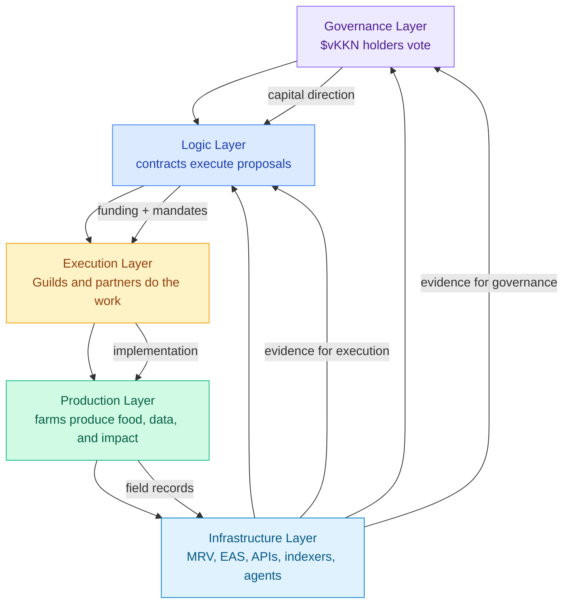

# Kokonut is not one DAO. It is a layered cooperative architecture.

The Kokonut DAO is designed to coordinate two things that usually conflict: **capital protection** and **contribution-based participation**.

Capital contributors need treasury transparency, enforceable governance rights, and a clean exit if they disagree with the DAO. Contributors without capital need a way to earn influence through useful work. Farmers need funding, execution support, and verification infrastructure. The DAO architecture separates those needs into layers so that no single mechanism has to solve every coordination problem at once.

  <a href="#the-five-layer-stack" style={{ display: "inline-flex", alignItems: "center", gap: "6px", background: "#009F4D", color: "#fff", padding: "10px 20px", borderRadius: "8px", fontWeight: "600", fontSize: "14px", textDecoration: "none" }}>
    Understand the DAO Stack →
  </a>

  <a href="#choose-your-entry-path" style={{ display: "inline-flex", alignItems: "center", gap: "6px", border: "1.5px solid #009F4D", color: "#009F4D", padding: "10px 20px", borderRadius: "8px", fontWeight: "600", fontSize: "14px", textDecoration: "none", background: "transparent" }}>
    Choose Your Entry Path
  </a>

  Capital path: stablecoin tribute → $vKKN. Contribution path: verified work → Guild Points → potential Loot.

<Frame>
  
</Frame>

The Kokonut DAO stack separates governance, smart contract logic, execution, farm production, and verification infrastructure.

---

## Architecture at a glance

| Layer | Primary actors | What it governs | Main mechanism |
| --- | --- | --- | --- |
| Governance | \$vKKN holders | Network-level decisions, treasury direction, member votes | 1 \$vKKN = 1 vote through DAOHaus |
| Logic | Smart contracts, treasury, tokens | Proposal execution, token minting/burning, rage-quit, fund movement | Verified contracts on Gnosis Chain |
| Execution | Guilds, contributors, Core Team, partners | Work coordination, bounties, deliverables, and farm deployment | Contribution-weighted Guild work |
| Production | Farmers, operators, and local communities | Farm operations, harvests, ecological work, community programs | Kokonut Framework and farm-level operations |
| Infrastructure | MRV stack, Farm Registry API, EAS, AI agents | Data flows, attestations, indexing, verification | Structured MRV and on-chain evidence |

<Note>
  The architecture is designed to avoid a single point of failure. Capital governance, operational expertise, farm production, and verification are connected — but not collapsed into one voting mechanism.
</Note>

---

## Why the DAO is layered

A regenerative agriculture network has to coordinate many kinds of value:

- stablecoin capital entering the treasury;
- farm proposals and infrastructure budgets;
- contributor work across technology, impact, finance, governance, communications, and partnerships;
- harvest records, MRV data, and impact attestations;
- farmers and local communities producing value on the land;
- DAO members who need enforceable rights and protection.

A single token-weighted DAO would overrepresent capital and underrepresent the people doing the operational work. A purely contribution-weighted DAO would struggle to protect capital contributors and treasury exits.

Kokonut uses both.

<CardGroup cols={2}>
  <Card title="Moloch DAO protects capital" icon="shield-check" href="/ecosystem-wiki/the-kokonut-dao/kokonut-moloch-dao">
    Stablecoin contributors receive soulbound governance tokens, vote on treasury decisions, and can rage-quit with their proportional treasury share.
  </Card>

  <Card title="Guilds recognize contribution" icon="hydra" href="/ecosystem-wiki/the-kokonut-dao/kokonut-guilds-dao">
    Builders, researchers, organizers, and operators earn Guild Points through verified work and can become eligible for Loot without contributing capital.
  </Card>
</CardGroup>

---

## The five-layer stack

The five layers describe how value, authority, and information move through the network — from token holders and contracts to contributors, farms, and public evidence.

<Steps>
  <Step title="Governance Layer — DAO members decide" icon="check-to-slot" iconType="regular">
    **Who:** Kokonut DAO token holders with at least one \$vKKN governance token.

    **What it does:** Votes on proposals that benefit the Kokonut ecosystem: farm funding, governance parameter changes, Guild bounty approvals, partnership ratifications, and token minting or burning.

    **How it works:** 1 \$vKKN = 1 vote through [DAOHaus](https://link.kokonut.network/dao). Proposals move through the governance process, and the DAO retains final authority over treasury-level decisions.
  </Step>
  <Step title="Logic Layer — contracts enforce the rules" icon="gears" iconType="regular">
    **Who:** The smart contracts and data structures that encode the DAO's rules.

    **What it does:** Holds the treasury, membership records, token contracts, proposal execution logic, and rage-quit mechanics.

    **How it works:** Verified contracts on Gnosis Chain manage the \$vKKN voting token, Loot token, Vault Manager, and rage-quit-enabled SAFE treasury. No individual can move funds, mint tokens, or change parameters without a passed proposal.
  </Step>
  <Step title="Execution Layer — contributors do the work" icon="hammer" iconType="regular">
    **Who:** Kokonut Guilds, Core Team members, contributors, farm partners, and local or global collaborators.

    **What it does:** Turns approved proposals into completed work: farm deployment, MRV reporting, software builds, documentation, governance operations, partnerships, and community programs.

    **How it works:** Six Guilds coordinate domain-specific work using contribution-weighted Guild Points instead of token-weighted voting.
  </Step>
  <Step title="Production Layer — farms make the mission real" icon="seedling" iconType="regular">
    **Who:** Farmers, farm operators, and communities running Kokonut Network farms.

    **What it does:** Produces food, coconuts, eggs, biodiversity, soil regeneration, jobs, training, and local community value.

    **How it works:** Farms operate under the [Kokonut Framework](/kokonut-framework/Introduction). [Adelphi](/ecosystem-wiki/kokonut-farms/adelphi/summary) is the first operational farm: 15,725 m² in Monte Plata, Dominican Republic, with live farm data published through the Kokonut Hub.
  </Step>
  <Step title="Infrastructure Layer — data becomes evidence" icon="satellite" iconType="regular">
    **Who:** MRV systems, Farm Registry API, EAS attestations, indexers, and AI agents.

    **What it does:** Turns farm activity into structured records that DAO members, contributors, funders, and communities can inspect.

    **How it works:** Farm events, harvest records, and impact data move through the MRV pipeline into public records. The Agentic Marketplace is the emerging automation layer for scaling this work across more farms.
  </Step>
</Steps>

---

## How the layers flow together

Capital and governance decisions move downward. Farm work and verification data move upward. The Infrastructure Layer makes the loop legible: it provides the Governance and Logic Layers with evidence rather than forcing members to trust claims.

---

## Two governance instances, two entry paths

Kokonut uses two complementary governance systems because capital and contributions require different protections.

|  | Kokonut Moloch DAO | Kokonut Guilds DAO |
| --- | --- | --- |
| Primary role | Treasury governance and capital allocation | Operational execution and contribution tracking |
| Membership basis | Token-weighted | Contribution-weighted |
| Entry path | Tribute stablecoins → proposal → \$vKKN minted | Complete useful work → earn Guild Points |
| Capital required | Yes | No |
| Main rights | Vote on treasury proposals; sponsor proposals; rage-quit | Influence Guild decisions; coordinate work; earn reputation |
| Exit/risk profile | Rage-quit returns proportional treasury share | No locked capital; points are reputation |
| Best for | DAO members, funders, capital allocators | Builders, researchers, agronomists, organizers, contributors |
| On-chain maturity | Live on Gnosis Chain | Reputation tracking in development |

<Note>
  The split is intentional: Moloch protects treasury contributors, while Guilds prevent capital from becoming the only path to influence.
</Note>

---

## What each path gives you

### Capital path: Kokonut Moloch DAO

The Kokonut Moloch DAO is the live capital and governance engine of the network. It holds the treasury, governs farm funding, mints membership tokens, and protects members through rage-quit.

| Feature | What it means |
| --- | --- |
| Stablecoin tribute | Members enter by contributing stablecoins to the treasury through a proposal process. |
| \$vKKN voting token | Soulbound governance token. 1 \$vKKN = 1 vote. Each token is backed 1:1 by a real coconut tree in a Kokonut Network farm. |
| Treasury voting | Members vote on farm funding, partnerships, Guild bounties, token minting, and governance changes. |
| Rage-quit | Members can exit with their proportional treasury share, including during grace periods before disliked proposals execute. |
| No admin override | Funds, tokens, and governance parameters cannot be moved or changed by the Core Team alone. |

[Read the Kokonut Moloch DAO page →](/ecosystem-wiki/the-kokonut-dao/kokonut-moloch-dao)

### Contribution path: Kokonut Guilds DAO

The Kokonut Guilds DAO is the operational layer of the network. It gives contributors a path to influence and economic recognition through verified work rather than stablecoin tribute.

| Guild path | What it means |
| --- | --- |
| Contribute | Complete an open task, bounty, report, MRV submission, proposal, technical contribution, or partnership deliverable. |
| Earn Guild Points | Completed work becomes a non-transferable reputation scoped to the relevant Guild. |
| Gain standing | Contributors can become members or stewards inside a Guild after reaching the required contribution threshold. |
| Route work to Moloch | Guilds can propose budgets, bounties, standards, and deliverables to the Moloch DAO for treasury-level approval. |
| Earn Loot eligibility | Significant contributions can be recognized through Loot token awards via the Moloch DAO proposal. |

[Read the Kokonut Guilds DAO page →](/ecosystem-wiki/the-kokonut-dao/kokonut-guilds-dao)

---

## Why this architecture matters

<CardGroup cols={2}>
  <Card title="It protects capital without making capital supreme" icon="scale-balanced">
    Capital contributors get governance rights, treasury transparency, and rage-quit protection. But contributors can still earn influence through Guild work.
  </Card>

  <Card title="It gives farmers and builders a real path in" icon="hand-holding-seedling">
    Useful work — MRV, documentation, agronomy, software, community coordination, governance support — can generate Guild Points and potential Loot.
  </Card>

  <Card title="It makes farm data part of governance" icon="satellite">
    Production does not sit outside the DAO. Farm outputs, harvest records, and MRV evidence flow back into the decision-making layer.
  </Card>

  <Card title="It lets the network scale without centralizing" icon="network-wired">
    The DAO can add more farms, contributors, agents, and Guilds without forcing every operational decision to go through a single token vote.
  </Card>
</CardGroup>

---

## What is live vs. what is developing

| Component | Status | Notes |
| --- | --- | --- |
| Kokonut Moloch DAO | Live | Deployed on Gnosis Chain with verified contracts, stablecoin treasury, \$vKKN, Loot, and rage-quit mechanics. |
| Adelphi Production Layer | Live | First operational farm in Monte Plata, Dominican Republic, with live Data Hub records. |
| Kokonut Framework | Live and evolving | Common Data Schema, farm phases, MRV methodology, and impact framework are documented publicly. |
| Guilds | Operational design / active contribution pathway | Contribution-weighted coordination layer; on-chain reputation tracking is still developing. |
| Agentic Marketplace | In development | Intended to automate MRV ingestion, data validation, Farm Registry submissions, and EAS attestations. |

<Warning>
  This page explains the architecture and participation paths. It is not financial advice, an investment offer, or a guarantee of returns. Verify live contracts, treasury state, proposal terms, and current membership parameters before contributing capital.
</Warning>

---

## Choose your entry path

<CardGroup cols={2}>
  <Card title="I want to become a DAO member" icon="dragon" href="/ecosystem-wiki/the-kokonut-dao/kokonut-moloch-dao">
    Learn how stablecoin tribute, \$vKKN, voting, rage-quit, and DAO membership work.
  </Card>

  <Card title="I want to contribute without capital" icon="hydra" href="/ecosystem-wiki/the-kokonut-dao/kokonut-guilds-dao">
    Learn how Guild Points, contribution records, Guild membership, stewardship, and Loot eligibility work.
  </Card>

  <Card title="I want to understand proposals" icon="scale-balanced" href="/ecosystem-wiki/the-kokonut-dao/governance-framework">
    Read the proposal process: drafting, voting, grace period, execution, and governance review.
  </Card>

  <Card title="I want to inspect contracts" icon="file-contract" href="/ecosystem-wiki/the-kokonut-dao/kokonut-moloch-dao">
    Review token contracts, Vault Manager, SAFE treasury, Gnosis Chain deployment, and voting power distribution.
  </Card>

  <Card title="I want to build the infrastructure" icon="code" href="/build-with-kokonut">
    Explore the Farm Registry API, EAS schema, data primitives, and agent-ready infrastructure.
  </Card>

  <Card title="I want to see the farm layer" icon="seedling" href="/ecosystem-wiki/kokonut-farms/adelphi/summary">
    See Adelphi, the first operational farm that makes the DAO architecture tangible on real land.
  </Card>
</CardGroup>

  <a href="https://link.kokonut.network/discord" style={{ display: "inline-flex", alignItems: "center", gap: "6px", background: "#009F4D", color: "#fff", padding: "10px 20px", borderRadius: "8px", fontWeight: "600", fontSize: "14px", textDecoration: "none" }}>
    Join the Community →
  </a>

  <a href="https://link.kokonut.network/meeting" style={{ display: "inline-flex", alignItems: "center", gap: "6px", border: "1.5px solid #009F4D", color: "#009F4D", padding: "10px 20px", borderRadius: "8px", fontWeight: "600", fontSize: "14px", textDecoration: "none", background: "transparent" }}>
    Book a DAO Walkthrough
  </a>

