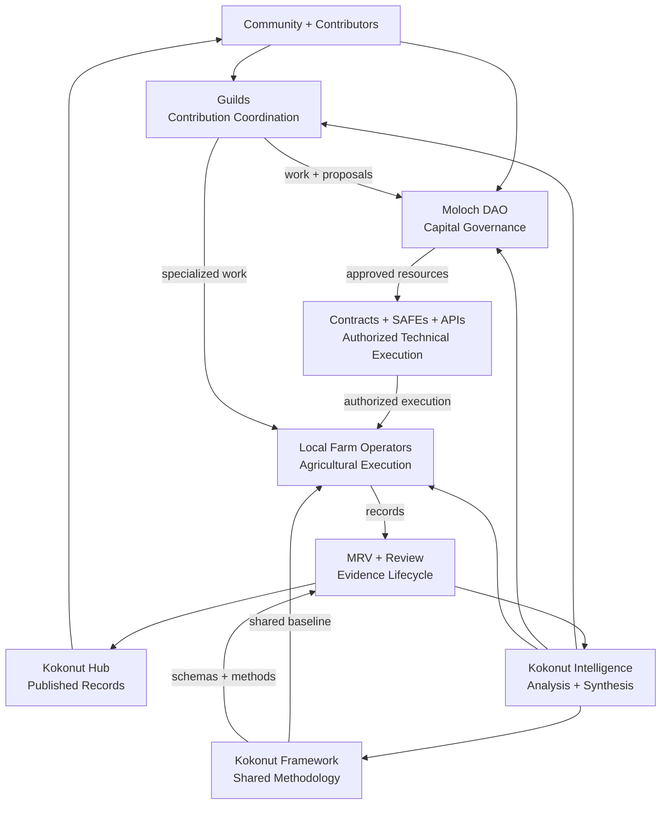
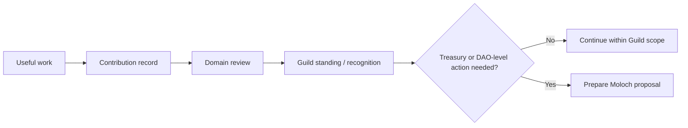

# Kokonut is not governed by one DAO.

Kokonut uses **different coordination systems for different kinds of responsibility**.

The Moloch DAO governs capital and treasury-level decisions.

Guilds coordinate useful work and domain expertise.

Farm operators remain responsible for day-to-day agricultural execution.

The Kokonut Framework provides shared methods and data structures.

MRV, the Kokonut Hub, and Kokonut Intelligence make claims easier to inspect.

Contracts and automation execute or support authorized workflows without becoming independent governance authorities.

> **The design principle is simple: give each responsibility the narrowest authority it needs, then connect the layers through evidence, proposals, shared standards, and review.**

<CardGroup cols={2}>
  <Card title="Capital governance" icon="building-columns" href="/ecosystem-wiki/the-kokonut-dao/kokonut-moloch-dao">
    The live Moloch DAO on Gnosis Chain coordinates membership, treasury proposals, voting, execution, and rage-quit protections.
  </Card>

  <Card title="Contribution coordination" icon="users" href="/ecosystem-wiki/the-kokonut-dao/kokonut-guilds-dao">
    Guilds provide a path for useful work, contribution records, domain review, and proposal preparation without requiring capital.
  </Card>

  <Card title="Local farm authority" icon="tractor" href="/ecosystem-wiki/kokonut-farms/adelphi/summary">
    Farm operators make real-world decisions about crops, water, timing, labor, maintenance, and field conditions.
  </Card>

  <Card title="Evidence and review" icon="magnifying-glass-chart" href="/ecosystem-wiki/kokonut-farms/measurement-reporting-and-verification">
    MRV and Kokonut Intelligence structure records so governance, contributors, operators, and partners can make decisions from evidence.
  </Card>
</CardGroup>

<Info>
  **“DAO” does not mean every decision belongs to token holders.** Treasury authority, domain expertise, agricultural judgment, methodology stewardship, evidence review, and software execution are intentionally separated.
</Info>

---

## Six scopes of responsibility

The architecture is easier to understand as six **scopes of authority**, not a top-down chain of command.

| Scope | Primary actors | Main responsibility | Current maturity |
| --- | --- | --- | --- |
| **Capital governance** | Moloch DAO members | Membership, treasury allocation, funded proposals, token recognition, governance changes | **Live on Gnosis Chain** |
| **Contribution coordination** | Guild contributors and reviewers | Domain work, contribution records, review, prioritization, proposal preparation | **Active and evolving** |
| **Farm operations** | Local farm operators and collaborators | Agronomy, labor, crop timing, irrigation, maintenance, field execution | **Live at Adelphi** |
| **Shared methodology** | Framework maintainers + relevant domain reviewers | Common Data Schema, development phases, MRV expectations, shared methods | **Live and evolving** |
| **Evidence and analysis** | MRV reviewers, Kokonut Intelligence, Hub users | Record lifecycle, publication, provenance, analysis, reporting | **Active infrastructure** |
| **Technical execution** | Contracts, SAFEs, APIs, integrations, agents | Execute approved rules, move authorized transactions, route data, automate bounded workflows | **Mixed: live + developing** |

This architecture is designed around **interoperability without sovereignty by one layer**.

---

## Who decides what

A governance system becomes fragile when authority is ambiguous.

This matrix defines the intended boundaries.

| Scope | Can decide / coordinate | Does **not** automatically control |
| --- | --- | --- |
| **Moloch DAO** | Treasury proposals, membership, funded commitments, DAO-level token recognition, governance parameters | Daily farm operations, scientific truth, Guild expertise, every Framework edit |
| **Guilds** | Domain priorities, contribution review, working groups, draft proposals, standards recommendations | Unilateral treasury spending, token minting, farm management, automatic DAO voting rights |
| **Farm operators** | Crops, irrigation, planting, harvest timing, maintenance, labor coordination, field response | DAO treasury, network-wide governance rules, shared schema changes |
| **Framework stewardship** | Shared schemas, phases, methodological baselines, interoperability rules | Local crop choices, field timing, operator judgment, farm ownership |
| **MRV / evidence reviewers** | Record review, evidence quality, publication readiness, provenance, claim boundaries | Treasury allocation, agronomic command, automatic certification of high-impact claims |
| **Technical systems** | Execute approved instructions, validate payloads, store records, publish data, prepare automation outputs | Independent political authority, autonomous treasury discretion, replacing accountable human review |

<Note>
  A single decision can touch more than one scope. The correct response is not to collapse authority into one body—it is to route each part of the decision to the people or system responsible for it.
</Note>

---

## How to route a decision

| Decision | Primary path | Why |
| --- | --- | --- |
| Fund new farm infrastructure | Farm/operator scope → evidence/review → Moloch proposal | Operators define the need; treasury members decide capital allocation |
| Change an irrigation schedule | Farm operators | It is a field decision, not a treasury vote |
| Create a Technology Guild bounty | Technology Guild → Moloch if treasury funding is required | Guild defines the work; Moloch authorizes shared capital |
| Recognize a major contributor with Loot | Contribution evidence → relevant review → Moloch proposal | Recognition needs evidence and DAO approval |
| Change the Common Data Schema | Framework + affected domain reviewers | Shared interoperability requires technical/methodological review |
| Publish a high-impact ecological claim | MRV / Impact review | Evidence quality is not determined by token vote |
| Change a DAO governance parameter | Moloch governance process | It changes the rules governing capital coordination |
| Deploy an AI workflow for MRV drafts | Technology + Impact review; human approval remains | Automation can prepare work but should not become verification authority |

---

## The architecture as a coordination loop

```mermaid
flowchart TD
    COMMUNITY["Community + Contributors"]

    MOLOCH["Moloch DAO<br/>Capital Governance"]
    GUILDS["Guilds<br/>Contribution Coordination"]
    FRAMEWORK["Kokonut Framework<br/>Shared Methodology"]

    OPERATORS["Local Farm Operators<br/>Agricultural Execution"]

    MRV["MRV + Review<br/>Evidence Lifecycle"]
    HUB["Kokonut Hub<br/>Published Records"]
    KI["Kokonut Intelligence<br/>Analysis + Synthesis"]

    TECH["Contracts + SAFEs + APIs<br/>Authorized Technical Execution"]

    COMMUNITY --> GUILDS
    COMMUNITY --> MOLOCH

    GUILDS -->|"work + proposals"| MOLOCH
    MOLOCH -->|"approved resources"| TECH
    TECH -->|"authorized execution"| OPERATORS

    GUILDS -->|"specialized work"| OPERATORS
    FRAMEWORK -->|"shared baseline"| OPERATORS

    OPERATORS -->|"records"| MRV
    MRV --> HUB
    MRV --> KI

    HUB --> COMMUNITY
    KI --> GUILDS
    KI --> MOLOCH
    KI --> FRAMEWORK
    KI --> OPERATORS

    FRAMEWORK -->|"schemas + methods"| MRV
```

The important flow is not “token holders command the network.”

It is:

**capital can authorize resources → contributors and operators execute work → evidence records what happened → evidence improves the next decision.**

---

## 1. Capital governance — Kokonut Moloch DAO

The [Kokonut Moloch DAO](/ecosystem-wiki/the-kokonut-dao/kokonut-moloch-dao) is the live capital-governance system.

The current documentation describes it as deployed on **Gnosis Chain** and responsible for:

- stablecoin-based membership proposals;
- treasury allocation;
- proposal voting and execution;
- \$vKKN issuance through approved membership proposals;
- Loot recognition through approved proposals;
- rage-quit protections under the applicable Moloch rules;
- governance-parameter changes.

### Current token roles

| Primitive | Current documented role |
| --- | --- |
| **\$vKKN** | Non-transferable voting token; 1 \$vKKN = 1 vote |
| **Loot** | Non-voting, non-transferable economic-rights / recognition token under the current docs |
| **Stablecoin tribute** | Capital contribution used in the Moloch membership process |

The current Kokonut model also relates \$vKKN issuance to coconut trees.

That relationship belongs to the Moloch/token model; it should not be interpreted as meaning the token controls the underlying farm, tree, land title, or agricultural decisions.

<Warning>
  Governance documentation can become stale as contracts, membership, balances, and parameters change. Capital participants should verify the current DAO, treasury, contract state, proposal terms, and applicable governance rules before acting.
</Warning>

---

## 2. Contribution coordination — Kokonut Guilds

The [Kokonut Guilds](/ecosystem-wiki/the-kokonut-dao/kokonut-guilds-dao) provide the contribution path.

They exist because useful work and capital contribution are different forms of participation.

The current Guild domains are:

- Technology;
- Impact;
- Communications;
- Governance;
- Finance;
- Community & Partnerships.

A contributor can begin with useful work such as:

- code;
- documentation;
- MRV review;
- farm research;
- financial modeling;
- governance work;
- partnerships;
- field or community coordination.

### Contribution lifecycle

```mermaid
flowchart LR
    A["Useful work"] --> B["Contribution record"]
    B --> C["Domain review"]
    C --> D["Guild standing / recognition"]
    D --> E{"Treasury or DAO-level action needed?"}
    E -->|"No"| F["Continue within Guild scope"]
    E -->|"Yes"| G["Prepare Moloch proposal"]
```

<Info>
  **Guild Points are still developing.** The Guild model is active, but point thresholds, review rules, standing, and on-chain reputation details remain evolving. A contribution should not be assumed to create points, payment, Loot, or governance rights automatically.
</Info>

Significant contributions can become eligible for Loot recognition, but Loot awards still require the applicable Moloch DAO proposal and approval process.

---

## 3. Farm operations — local authority stays close to the land

Farm operations are not a DAO subcommittee.

They are real-world agricultural responsibilities.

At a Kokonut farm, local operators can be responsible for decisions such as:

- what and when to plant;
- irrigation timing;
- crop rotation and succession;
- soil and nutrient management;
- pest and disease response;
- harvesting;
- labor coordination;
- maintenance;
- local supplier and buyer relationships;
- adaptation to weather and field conditions.

A treasury proposal can approve capital for irrigation.

It should not tell an operator **when to irrigate**.

A Framework can define a harvest-record structure.

It should not decide **which crop is locally appropriate**.

> **Shared governance should increase local operating capacity, not convert agricultural judgment into token voting.**

---

## 4. Shared methodology — Kokonut Framework

The [Kokonut Framework](/kokonut-framework/Introduction) is the interoperability layer.

It provides reusable structures such as:

- the Common Data Schema;
- development phases;
- regenerative principles;
- MRV expectations;
- value-accounting methods;
- impact-reporting logic;
- shared terminology and documentation.

The Framework helps multiple farms use compatible records without requiring identical implementation.

### Framework authority is narrow

The Framework can define:

- what a baseline record should contain;
- what evidence a claim should provide;
- how a development phase is documented;
- how shared schemas remain compatible.

It should not define:

- every farm's crop mix;
- local ownership;
- local labor arrangements;
- day-to-day agronomy;
- local cultural priorities.

<Note>
  Material changes to shared schemas, MRV primitives, or interoperability rules should involve the affected domain reviewers before implementation. Treasury funding for that work may require a separate Moloch proposal.
</Note>

---

## 5. Evidence — MRV, Hub, and Kokonut Intelligence

Evidence is a coordination layer, not a governance constituency.

The [MRV methodology](/ecosystem-wiki/kokonut-farms/measurement-reporting-and-verification) separates:

**observation → structured record → review → publication → optional attestation → interpretation**

[Kokonut Intelligence](/kokonut-intelligence) provides the active data and analytical infrastructure around those records.

The [Kokonut Hub](https://hub.kokonut.network/projects/41) provides a public surface for published project and farm information.

Evidence can inform:

- funding review;
- farm operations;
- forecast updates;
- Guild work;
- grant reporting;
- governance decisions;
- Framework improvements.

Evidence does **not** become true because the DAO voted for it.

And an on-chain attestation does **not** become scientifically correct simply because it is timestamped.

---

## 6. Technical execution — authorized systems, not autonomous rulers

Contracts, SAFEs, APIs, and agent workflows are execution infrastructure.

Their job is to make authorized processes more reliable.

### Gnosis Chain

Current Kokonut documentation uses Gnosis Chain for:

- Moloch governance;
- membership;
- treasury execution;
- \$vKKN and Loot;
- proposal-related contract logic.

### Celo

Current Kokonut Intelligence documentation uses Celo for:

- EAS farm-data attestations;
- MRV evidence references;
- harvest and impact records;
- other evidence-oriented schemas.

> **Governance capital and farm evidence are connected, but they are not the same system and they do not need to live on the same chain.**

### AI agents

AI-agent workflows are a developing support layer for tasks such as:

- MRV draft preparation;
- data-quality checks;
- forecast-vs-actual analysis;
- proposal formatting;
- evidence packaging;
- recurring reporting.

Agents should not independently:

- approve treasury spending;
- certify scientific claims;
- replace farm operators;
- grant themselves governance authority;
- silently change shared schemas.

---

## Two participation paths — plus local operating roles

The original architecture page described two entry paths.

Those remain useful, but the broader ecosystem has more than two forms of participation.

| Path | How it starts | What it can lead to | What it does not automatically grant |
| --- | --- | --- | --- |
| **Capital path** | Stablecoin tribute + approved Moloch membership proposal | \$vKKN voting rights and applicable Moloch protections | Agricultural authority or domain expertise |
| **Contribution path** | Useful work + contribution record + review | Guild standing, recognition, possible Loot proposal | Automatic payment, Loot, or Moloch voting |
| **Farm-operator path** | Real-world farm role or local operating agreement | Agricultural authority within the farm's operating scope | DAO treasury authority |
| **Framework / review path** | Methodology, evidence, data, or technical expertise | Stewardship over shared methods or review processes | Ownership of local farm decisions |

This is **plural participation**, not one ladder where every participant eventually becomes the same kind of governor.

---

## What requires Moloch approval — and what usually does not

### Typically Moloch-level

- treasury spending;
- membership;
- \$vKKN issuance;
- Loot awards;
- DAO governance changes;
- network-level funded commitments;
- funded Guild bounties when treasury capital is required.

### Typically outside direct Moloch control

- routine farm operations;
- scientific or methodological review;
- ordinary documentation edits;
- Guild-internal work that does not require treasury authority;
- data-quality review;
- agronomic decisions;
- routine software development within an already approved scope.

A decision can move **into** Moloch when it requires shared capital or changes DAO-level rules.

That does not mean Moloch becomes the subject-matter authority over the entire underlying domain.

---

## Why this separation matters

<CardGroup cols={2}>
  <Card title="Capital gets protection without becoming sovereign" icon="shield-check">
    Moloch members can govern shared treasury capital without automatically controlling agronomy, science, contribution reputation, or every ecosystem decision.
  </Card>

  <Card title="Expertise can matter without requiring capital" icon="brain-circuit">
    Guilds and domain review create pathways for people doing the work to influence the work.
  </Card>

  <Card title="Farm operators keep operational authority" icon="tractor">
    Local agricultural judgment remains close to the land instead of being converted into remote token votes.
  </Card>

  <Card title="Evidence can challenge assumptions" icon="magnifying-glass-chart">
    Published records and review workflows can inform governance without becoming subordinate to whichever proposal received the most votes.
  </Card>

  <Card title="Shared methods do not require identical farms" icon="puzzle">
    The Framework creates interoperability while preserving local implementation.
  </Card>

  <Card title="Automation remains bounded" icon="robot">
    Contracts and agents can make workflows more reliable without becoming independent decision-makers.
  </Card>
</CardGroup>

---

## What this architecture is not

<CardGroup cols={2}>
  <Card title="Not one super-DAO" icon="layer-group">
    No single voting system is intended to govern capital, farms, science, contributors, methodology, and technology simultaneously.
  </Card>

  <Card title="Not token-weighted agronomy" icon="seedling">
    More \$vKKN does not make someone more qualified to decide crop timing, soil treatment, or farm maintenance.
  </Card>

  <Card title="Not contribution without review" icon="clipboard-check">
    Useful work should be documented and reviewed before recognition; Guild participation is not automatic reputation issuance.
  </Card>

  <Card title="Not attestations as truth" icon="stamp">
    EAS improves provenance. It does not replace evidence quality, methodology, or professional review.
  </Card>

  <Card title="Not a rigid farm franchise" icon="map">
    Shared records and methods do not require farms to copy Adelphi's crops, operators, market, or local context.
  </Card>

  <Card title="Not AI governance" icon="robot">
    Agents can prepare and analyze work, but accountable humans remain responsible for high-impact decisions.
  </Card>
</CardGroup>

---

## What is live and what is still evolving

| Component | Status | Current role |
| --- | --- | --- |
| **Kokonut Moloch DAO** | **Live** | Capital membership, treasury governance, proposals, token logic, rage-quit |
| **\$vKKN and Loot** | **Live under current docs** | Non-transferable voting and non-voting token primitives |
| **Adelphi farm operations** | **Live** | First locally operated reference farm |
| **Kokonut Framework** | **Live and evolving** | Shared schemas, phases, methods, MRV and value-accounting structure |
| **MRV methodology** | **Live and evolving** | Evidence lifecycle and claim standards |
| **Kokonut Hub** | **Live** | Public farm/project data surface |
| **Kokonut Intelligence** | **Active infrastructure** | Canonical data, analytics, review, reporting, Celo EAS integration |
| **Guild model** | **Active and evolving** | Contribution coordination and domain work |
| **Guild Points** | **Developing** | Thresholds, review rules, and on-chain reputation details still maturing |
| **AI-agent automation** | **Developing / expanding** | Review-gated automation for data, reporting, forecasting, and coordination |
| **Agentic Marketplace** | **In development** | Agent identity, services, payments, reputation, and market coordination |

Transparency about maturity is part of the governance model.

A developing mechanism should not be described as if it already carries the same authority as a live contract or operating farm.

---

## Use the right page for the right question

| Question | Best page |
| --- | --- |
| How does capital governance work? | [Kokonut Moloch DAO](/ecosystem-wiki/the-kokonut-dao/kokonut-moloch-dao) |
| How do contributors coordinate? | [Kokonut Guilds](/ecosystem-wiki/the-kokonut-dao/kokonut-guilds-dao) |
| How does a proposal move from idea to execution? | [Governance Framework](/ecosystem-wiki/the-kokonut-dao/governance-framework) |
| How should I structure a proposal? | [Proposal Templates](/ecosystem-wiki/the-kokonut-dao/proposal-templates) |
| How do farm claims become evidence? | [MRV Methodology](/ecosystem-wiki/kokonut-farms/measurement-reporting-and-verification) |
| What remains under local farm authority? | [Adelphi Overview](/ecosystem-wiki/kokonut-farms/adelphi/summary) |
| What shared methods connect farms? | [Kokonut Framework](/kokonut-framework/Introduction) |
| How does the data/attestation layer work? | [Kokonut Intelligence](/kokonut-intelligence) |
| How can I contribute without capital? | [Open Collaboration](/ecosystem-wiki/open-collaboration-invitation) |

---

## Continue through The Kokonut DAO

<CardGroup cols={2}>
  <Card title="Kokonut Moloch DAO" icon="building-columns" href="/ecosystem-wiki/the-kokonut-dao/kokonut-moloch-dao">
    Go deeper into treasury governance, membership, \$vKKN, Loot, rage-quit, contracts, and live Gnosis deployment.
  </Card>

  <Card title="Kokonut Guilds" icon="users" href="/ecosystem-wiki/the-kokonut-dao/kokonut-guilds-dao">
    Understand contribution records, Guild domains, developing Guild Points, stewardship, and the route from useful work to DAO proposals.
  </Card>

  <Card title="Governance Framework" icon="scale-balanced" href="/ecosystem-wiki/the-kokonut-dao/governance-framework">
    Follow the decision process from problem definition and review through voting, execution, reporting, and learning.
  </Card>

  <Card title="Proposal Templates" icon="file-pen" href="/ecosystem-wiki/the-kokonut-dao/proposal-templates">
    Use structured templates for membership, farm funding, Guild work, Framework changes, partnerships, and other governance actions.
  </Card>

  <Card title="Build with Kokonut" icon="code" href="/build-with-kokonut">
    Inspect governance contracts, data primitives, MRV schemas, developer infrastructure, and agent-ready systems.
  </Card>

  <Card title="Kokonut Manifesto" icon="scroll-old" href="/ecosystem-wiki/kokonut-101/manifesto">
    Read the values that constrain how authority, capital, technology, evidence, land, and participation should interact.
  </Card>
</CardGroup>

> **Kokonut's governance architecture is strongest when no layer has to pretend it is qualified to govern everything.**
