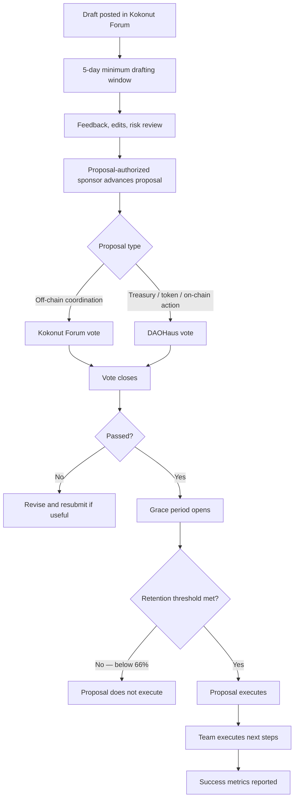

# Kokonut governance turns community decisions into enforceable action.

The Governance Framework is Kokonut Network's operating manual for collective decision-making. It defines who can propose, who can vote, where proposals are drafted, how long decisions take, what every proposal must include, and how treasury-affecting decisions become executable on-chain.

Kokonut uses this framework so farm funding, Guild bounties, Framework upgrades, partnerships, and ecosystem decisions can move through a clear process instead of informal approval.

<div style={{ display: "flex", gap: "12px", justifyContent: "center", flexWrap: "wrap", margin: "1.5rem 0 0.75rem" }}>
  <a href="#proposal-lifecycle" style={{ display: "inline-flex", alignItems: "center", gap: "6px", background: "#009F4D", color: "#fff", padding: "10px 20px", borderRadius: "8px", fontWeight: "600", fontSize: "14px", textDecoration: "none" }}>
    See the Proposal Lifecycle →
  </a>

  <a href="/ecosystem-wiki/the-kokonut-dao/proposal-templates" style={{ display: "inline-flex", alignItems: "center", gap: "6px", border: "1.5px solid #009F4D", color: "#009F4D", padding: "10px 20px", borderRadius: "8px", fontWeight: "600", fontSize: "14px", textDecoration: "none", background: "transparent" }}>
    Use a Proposal Template
  </a>
</div>

<Warning>
  This framework is a governance operating manual, not a comprehensive legal document. It is the baseline for Kokonut Network decision-making and can be amended through the same proposal process it describes.
</Warning>

---

## Governance at a glance

| Question | Answer |
| --- | --- |
| What does this framework govern? | Farm funding, Guild bounties, Framework upgrades, partnerships, DAO amendments, and treasury-affecting decisions. |
| Where are drafts written? | Kokonut Forum is the designated platform for drafting and feedback. |
| Where are votes held? | [DAOHaus](https://link.kokonut.network/dao) for on-chain treasury-affecting proposals. |
| Who can sponsor proposals? | Team Members and Guild Stewards who route-validated work from the Guild layer. |
| Who can vote on-chain? | DAO Members holding at least one `$vKKN` token on the Gnosis Chain. |
| How long does a proposal take? | Minimum 5-day drafting window \+ minimum 5-day voting window, before grace period and execution. |
| What protects dissenting members? | Rage-quit during the grace period, plus a 66% token retention threshold for on-chain proposals. |
| What must every proposal include? | Ten required fields: name, authors, team, draft start date, description, mission alignment, brand usage, financial implications, success metrics, and next steps. |

<Note>
  The Governance Framework is the process layer. The [Kokonut Moloch DAO](/ecosystem-wiki/the-kokonut-dao/kokonut-moloch-dao) is the on-chain execution layer. The [Kokonut Guilds DAO](/ecosystem-wiki/the-kokonut-dao/kokonut-guilds-dao) is the contribution and domain-expertise layer.
</Note>

---

## Why this framework exists

Kokonut Network coordinates real farms, real capital, real contributors, real community commitments, and real public-goods outcomes. That requires more than a chat vote or informal agreement.

The Governance Framework exists to make sure every important decision has:

<CardGroup cols={3}>
  <Card title="Time to review" icon="clock">
    Every proposal must remain in draft for at least 5 days before it can move to an active vote. This gives members time to ask questions, request edits, and surface risks.
  </Card>

  <Card title="Clear authorization" icon="signature">
    Proposal-authorized people and Guild Stewards move proposals from draft to vote, making sponsorship visible and accountable.
  </Card>

  <Card title="Defined voting rules" icon="check-to-slot">
    The framework separates off-chain coordination from on-chain treasury voting, so lightweight decisions and capital decisions use the right venue.
  </Card>

  <Card title="Treasury protection" icon="shield-check">
    On-chain proposals include a grace period, rage-quit protection, and a 66% retention threshold before execution.
  </Card>

  <Card title="Measurable execution" icon="list-check">
    Every proposal must define success metrics and next steps so the DAO can evaluate whether the work was completed.
  </Card>

  <Card title="Upgradeability" icon="arrows-rotate">
    The framework itself can evolve, but only through the same proposal process it governs.
  </Card>
</CardGroup>

---

## Who can propose and who can vote

Kokonut separates proposal sponsorship, domain contribution, and voting power so the system can recognize both capital and useful work.

| Role | What they can do | Where they act |
| --- | --- | --- |
| Proposal-authorized person | Draft and sponsor proposals into the active stage | Kokonut Forum → DAOHaus / Kokonut Forum |
| Team Member | Sponsor proposals and steward early ecosystem direction | Governance and operations |
| Guild Steward | Co-sign and route proposals that originate in a Guild | Guilds → Governance process |
| DAO Member | Vote on on-chain proposals with `$vKKN` | DAOHaus |
| Guild Contributor | Contribute useful work and earn Guild Points | Guilds and contribution records |
| Wider community | Review, comment, join Discord, contribute to docs, and help improve proposal quality | Discord, Kokonut Forum, GitHub, Kokonut Hub |

<Note>
  Capital gives voting power through `$vKKN`. Contribution gives operational standing through Guild Points. Significant contribution can later be recognized through Loot, but only if approved through the Moloch DAO proposal process.
</Note>

---

## Proposal lifecycle

Every Kokonut DAO proposal passes through three mandatory stages. No stage can be skipped.



<Steps>
  <Step title="Drafting Stage" icon="pen-to-square" iconType="regular">
    The proposal is written in Kokonut Forum using the required ten-field structure. Vote-authorized members are notified when the draft is posted.

    The proposal must remain open for a **minimum of 5 days**. During this window, members and contributors can request clarification, challenge assumptions, suggest edits, and surface risks before a binding vote begins.
  </Step>
  <Step title="Active Stage" icon="check-to-slot" iconType="regular">
    A proposal-authorized person sponsors the proposal into the active stage after the drafting window closes.

    - Off-chain coordination proposals can be voted on in Kokonut Forum.
    - Treasury, token, or on-chain execution proposals move to [DAOHaus](https://link.kokonut.network/dao).

    Active votes remain open for **5 days** and use the voting method assigned to the proposal type.
  </Step>
  <Step title="Grace Period" icon="hourglass-half" iconType="regular">
    After an on-chain proposal passes, a grace period opens before execution. DAO members who disagree with the result can rage-quit before the proposal executes.

    If rage-quits reduce `$vKKN` token retention below **66%**, the proposal does not execute and must be resubmitted.
  </Step>
  <Step title="Execution Stage" icon="rocket" iconType="regular">
    Once the vote passes and the grace period closes without breaching the retention threshold, the proposal executes through the DAO.

    The proposal team then becomes responsible for the stated next steps, success metrics, reporting, and any follow-up documentation.
  </Step>
</Steps>

---

## Minimum timeline

A proposal that affects the treasury cannot be rushed through in one meeting or private conversation.

```text
Day 0:    Proposal posted to Kokonut Forum
Day 1-5:  Drafting and feedback window
Day 5:    Proposal can be sponsored to active voting
Day 5-10: Active voting window
Day 10:   Vote closes; grace period opens for on-chain proposals
Day 10+:  Execution only if the proposal passed and retention protections hold
```

| Timeline rule | Why it matters |
| --- | --- |
| 5-day draft minimum | Prevents surprise proposals and gives members time to review. |
| 5-day active vote | Gives vote-authorized members enough time to participate. |
| Grace period | Gives dissenting members an exit path before execution. |
| 66% retention threshold | Prevents a proposal from executing if too much capital exits during the grace period. |

---

## Voting methods and proposal venues

| Decision type | Drafting venue | Voting venue | Voting method | Notes |
| --- | --- | --- | --- | --- |
| Community coordination | Kokonut Forum | Kokonut Forum | 1 person = 1 vote | Useful for non-treasury, social, operational, or signaling decisions. |
| Treasury disbursement | Kokonut Forum | DAOHaus | 1 `$vKKN` = 1 vote | Used when funds move from the DAO treasury. |
| Membership onboarding | Kokonut Forum / DAOHaus proposal flow | DAOHaus | 1 `$vKKN` = 1 vote | Onboarding quorum is 0% by design; any participation produces a valid outcome. |
| Token minting / Loot recognition | Kokonut Forum | DAOHaus | 1 `$vKKN` = 1 vote | Requires explicit proposal and DAO approval. |
| Governance framework amendment | Kokonut Forum | DAOHaus if on-chain impact; Kokonut Forum if coordination-only | Depends on proposal scope | Must include the edited framework or exact amendment language. |

<Warning>
  If a proposal moves treasury funds, mints tokens, awards Loot, changes DAO parameters, or affects on-chain execution, it should be treated as an on-chain governance proposal.
</Warning>

---

## Required proposal fields

Every proposal must include the same ten base fields, regardless of proposal type.

| Field | What to include | Why it matters |
| --- | --- | --- |
| Proposal Name | Short descriptive name, ideally with the correct proposal code | Makes the proposal easy to reference and archive |
| Proposal Author(s) | Name, alias, and wallet address of the author(s) | Creates accountability |
| Proposal Team | People responsible for execution if the proposal passes | Separates authorship from delivery responsibility |
| Draft Start Date | Date the draft was first posted in Kokonut Forum | Starts the 5-day drafting window |
| Proposal Description | What the proposal asks for, what it will produce, and why now | Gives voters the core decision context |
| Mission Alignment | How the proposal advances Kokonut Network's mission | Filters proposals that are not strategically aligned |
| Brand Usage | Whether the proposal uses Kokonut name, logo, or marks | Protects ecosystem reputation |
| Financial Implications | Exact costs, amounts, treasury impact, disbursement conditions, and timeline | Required for responsible treasury governance |
| Success Metrics | How the DAO will know if the proposal worked | Enables accountability after execution |
| Next Steps | Who does what after approval | Reduces ambiguity after the vote passes |

[Use a ready-made proposal template →](/ecosystem-wiki/the-kokonut-dao/proposal-templates)

---

## Proposal types

<CardGroup cols={2}>
  <Card title="Farm Funding Proposal" icon="seedling" href="/ecosystem-wiki/the-kokonut-dao/proposal-templates#farm-funding-proposal">
    Request treasury funding for a new syntropic farm or a material expansion of an existing farm. Requires the strongest documentation: farm overview, crops, revenue model, public-goods allocation, local problem, solution, and MRV plan.
  </Card>

  <Card title="Guild Bounty Proposal" icon="trophy" href="/ecosystem-wiki/the-kokonut-dao/proposal-templates#guild-bounty-proposal">
    Commission scoped work from contributors through a Guild Steward. Useful for development, MRV, documentation, governance, finance, partnerships, and other operational work.
  </Card>

  <Card title="Framework Upgrade Proposal" icon="puzzle" href="/ecosystem-wiki/the-kokonut-dao/proposal-templates#framework-upgrade-proposal">
    Propose changes to the Kokonut Framework, Common Data Schema, MRV methodology, agent architecture, or documentation standards.
  </Card>

  <Card title="Partnership Proposal" icon="handshake" href="/ecosystem-wiki/the-kokonut-dao/proposal-templates#partnership-proposal">
    Establish a formal relationship with an external organization, funder, farm operator, research partner, tool provider, or ecosystem collaborator.
  </Card>
</CardGroup>

---

## What makes a proposal strong

A strong Kokonut proposal should be easy to inspect, hard to misunderstand, and possible to measure after execution.

| Proposal quality | Strong version | Weak version |
| --- | --- | --- |
| Specific ask | Requests a defined amount, deliverable, team, and timeline | Asks for general support or vague approval |
| Mission alignment | Explains how the work advances farms, Framework, DAO, MRV, Guilds, or public goods | Uses generic sustainability language |
| Financial clarity | Includes exact amounts, wallet addresses, release conditions, and budget line items | Says funds will be used “as needed” |
| Evidence | References data, prior work, farm records, GitHub issues, MRV outputs, or community feedback | Relies on trust or reputation alone |
| Success metrics | Defines measurable outputs and reporting deadlines | Does not explain how success will be evaluated |
| Next steps | Names owners and immediate actions after approval | Leaves execution unclear |

<Note>
  For farm funding proposals, the standard should be especially high. New farm proposals should include location, coordinates, land area, operator wallet, Framework phase, Data Hub link or plan, crop model, revenue streams, target markets, public-goods allocation, and local problem/solution context.
</Note>

---

## Governance protections

Kokonut governance is designed to reduce the need for personal trust.

| Protection | What it prevents |
| --- | --- |
| Public drafting | Prevents decisions from being prepared privately without member awareness. |
| Minimum review period | Prevents rushed votes. |
| Proposal sponsorship | Prevents unvetted drafts from becoming active votes without accountability. |
| On-chain execution | Prevents private wallet control over treasury actions. |
| Rage-quit | Gives dissenting members an exit before execution. |
| 66% retention threshold | Prevents proposals from executing if too much capital exits in protest. |
| Required success metrics | Prevents proposals from passing without a way to judge completion. |
| Amendment process | Prevents unilateral edits to governance rules. |

---

## Amendments and rejected proposals

### Amendments

This Governance Framework can evolve. Any amendment must include the exact proposed change and pass through the full proposal lifecycle.

A strong amendment proposal should include:

- the current text,
- the proposed replacement text,
- why the change is needed,
- who is affected,
- whether it changes treasury risk,
- whether it changes rights or responsibilities,
- and when the amendment becomes active.

### Rejected proposals

Rejected proposals may be revised and resubmitted. There is no required cooling-off period, but resubmissions should address the reasons the original proposal failed.

A useful resubmission should include a short changelog explaining what changed since the previous version.

---

## Before you submit a proposal

<Steps>
  <Step title="Choose the right proposal type" icon="route" iconType="regular">
    Farm Funding, Guild Bounty, Framework Upgrade, and Partnership proposals each need different supporting evidence. Start with the relevant template.
  </Step>
  <Step title="Write the ten required fields" icon="list-check" iconType="regular">
    Do not skip mission alignment, financial implications, success metrics, or next steps. Those fields are what turn an idea into an accountable proposal.
  </Step>
  <Step title="Share the draft in Kokonut Forum" icon="comments" iconType="regular">
    Open the proposal for the required 5-day drafting window. Treat feedback as part of the proposal process, not as a delay.
  </Step>
  <Step title="Route through the right steward" icon="people-arrows" iconType="regular">
    Guild-originating work should involve the relevant Guild Steward. Treasury-affecting work should be prepared for on-chain voting.
  </Step>
  <Step title="Prepare for execution and reporting" icon="clipboard-check" iconType="regular">
    Know who will execute the work, how funds will be used, when updates will be posted, and how success will be measured after approval.
  </Step>
</Steps>

---

## Next steps

<CardGroup cols={2}>
  <Card title="Proposal Templates" icon="scroll" href="/ecosystem-wiki/the-kokonut-dao/proposal-templates">
    Copy ready-to-use templates for Farm Funding, Guild Bounty, Framework Upgrade, and Partnership proposals.
  </Card>

  <Card title="Kokonut Moloch DAO" icon="dragon" href="/ecosystem-wiki/the-kokonut-dao/kokonut-moloch-dao">
    Understand the on-chain system that enforces treasury execution, `$vKKN`, Loot, rage-quit, and the 66% retention threshold.
  </Card>

  <Card title="Kokonut Guilds" icon="hydra" href="/ecosystem-wiki/the-kokonut-dao/kokonut-guilds-dao">
    Learn how contributors earn Guild Points, gain standing, and route domain work into the DAO proposal process.
  </Card>

  <Card title="DAO Layers" icon="layer-group" href="/ecosystem-wiki/the-kokonut-dao/dao-layers">
    See how governance, logic, execution, production, and infrastructure layers work together across the full Kokonut DAO architecture.
  </Card>

  <Card title="Kokonut Forum" icon="pen-to-square" href="https://link.kokonut.network/charmverse">
    Draft proposals, collect feedback, and run the required governance review window.
  </Card>

  <Card title="DAOHaus" icon="check-to-slot" href="https://link.kokonut.network/dao">
    View the on-chain DAO where treasury-affecting proposals are voted on and executed.
  </Card>
</CardGroup>