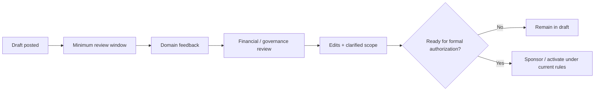
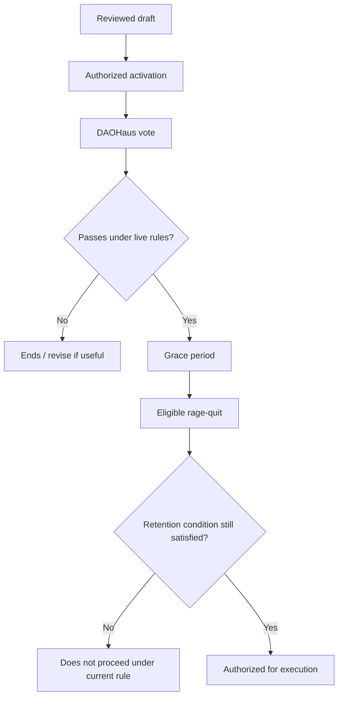
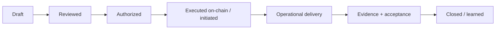

# Governance starts by asking who should decide.

Kokonut's Governance Framework is the process for moving a decision from **problem → review → authorization → execution → evidence → learning**.

The first question is not:

> “How do we put this to a DAO vote?”

It is:

> **“Which authority actually owns this decision?”**

A treasury allocation belongs in Moloch governance.

A routine irrigation decision belongs with farm operators.

An MRV claim belongs with the relevant evidence reviewers.

A shared schema change belongs with Framework and affected domain reviewers.

A Guild bounty may begin with contributors and only move into Moloch when shared treasury capital is required.

<CardGroup cols={2}>
  <Card title="Understand the authority map" icon="layer-group" href="/ecosystem-wiki/the-kokonut-dao/dao-layers">
    See how capital governance, contribution, farm operations, shared methodology, evidence, and technical execution remain separate.
  </Card>

  <Card title="Use a proposal template" icon="file-signature" href="/ecosystem-wiki/the-kokonut-dao/proposal-templates">
    Start from a structured template when the decision actually requires a formal proposal.
  </Card>

  <Card title="Inspect live DAO state" icon="building-columns" href="https://link.kokonut.network/dao">
    Verify current Moloch membership, proposals, parameters, and execution state before relying on static documentation.
  </Card>

  <Card title="Draft and discuss" icon="comments" href="https://link.kokonut.network/charmverse">
    Use the current Kokonut collaboration space for proposal drafting, review, and discussion.
  </Card>
</CardGroup>

<Warning>
  **This framework documents Kokonut's current governance process; it is not an immutable constitution or comprehensive legal agreement.** Live Moloch parameters, sponsorship rights, voting rules, and execution conditions should be verified before a binding action.
</Warning>

---

## Governance at a glance

| Question | Current answer |
| --- | --- |
| **What is this framework for?** | Routing material decisions to the correct authority and making authorization, execution, and accountability inspectable |
| **Where are proposals drafted?** | Current documentation uses Kokonut's Forum / Charmverse collaboration surface for drafts and feedback |
| **Where do binding Moloch votes happen?** | [DAOHaus](https://link.kokonut.network/dao) on Gnosis Chain |
| **Who can author a draft?** | Contributors can help prepare proposals; activation/sponsorship follows the current governance rules |
| **Who votes in Moloch?** | Eligible \$vKKN holders under the live DAO rules |
| **Current documented draft baseline** | Minimum **5 days** before moving a material proposal into active voting |
| **Current documented Moloch voting baseline** | **5 days** |
| **Current documented retention protection** | **66%** token-retention threshold before execution |
| **Current documented membership quorum** | **0%** for onboarding proposals under the current framework |
| **What happens after approval?** | Authorization still has to become correct execution, reporting, evidence, and closeout |

<Info>
  **Passing a proposal is not the same as completing the work.** Governance authorizes. Operators, contributors, contracts, SAFEs, or other responsible actors still have to execute the approved scope correctly.
</Info>

---

## Step 1 — classify the decision before drafting a proposal

Not every decision needs the same governance path.

| Decision class | Primary authority | Formal Moloch vote? |
| --- | --- | --- |
| **DAO treasury allocation** | Moloch DAO | **Yes** |
| **Membership / \$vKKN / Loot** | Moloch DAO | **Yes** |
| **DAO governance parameters** | Moloch DAO | **Yes** when changing binding DAO rules |
| **Guild contribution / domain work** | Relevant Guild contributors / reviewers | Usually **no**, unless treasury or DAO authority is required |
| **Routine farm operations** | Local farm operators | **No** |
| **Framework / Common Data Schema change** | Framework + affected domain reviewers | Not automatically; Moloch only when DAO-level funding or authority is implicated |
| **MRV / scientific claim review** | Qualified evidence / Impact reviewers | **No** merely to establish scientific validity |
| **Coordination / signaling** | Relevant community or working group | Usually **no binding Moloch action** |
| **Treasury-backed partnership** | Domain reviewers + Moloch for shared capital | **Yes** for the Moloch-scoped commitment |

> **A decision can require multiple reviews without giving one reviewer authority over every part of the decision.**

---

## Step 2 — define the problem and the authority being requested

Before a formal draft, the author should be able to answer:

- What problem are we trying to solve?
- Who is affected?
- Which authority is being requested?
- Is the proposal asking for money, token issuance, policy, recognition, technical work, or coordination?
- Which parts are within Moloch scope?
- Which parts remain with farm operators, Guilds, Framework reviewers, or evidence reviewers?
- What evidence supports the need?
- What happens if the proposal is not approved?

This prevents a common governance failure: using a treasury vote to smuggle in authority that the treasury does not actually possess.

### Example

A farm-funding proposal can authorize:

- a treasury budget;
- payment milestones;
- reporting obligations.

It should not automatically authorize:

- day-to-day crop decisions;
- scientific conclusions;
- control of locally owned land;
- publication of unsupported impact claims.

---

## Step 3 — use the right review path

A proposal should be reviewed by the people affected by its content before a binding vote.

| Proposal content | Review that should happen before binding authorization |
| --- | --- |
| Farm infrastructure | Farm operators + finance + relevant technical reviewers |
| MRV methodology | Impact / evidence reviewers + technical reviewers where schemas are affected |
| Software / contracts | Technology review + affected domain review |
| Framework primitive | Framework stewardship + every materially affected domain |
| Guild bounty | Relevant Guild / reviewer + Finance when budgeted |
| Partnership | Community & Partnerships + Finance + legal/technical review as needed |
| Token / governance change | Governance review + Moloch participants |
| Public impact claim | Evidence / Impact review before public interpretation |

<Note>
  **Review is not voting.** A domain reviewer can say whether a proposal is technically or methodologically ready without having Moloch voting power. A Moloch voter can decide whether to authorize shared capital without becoming the domain expert.
</Note>

---

## Step 4 — draft the proposal

The current [Proposal Templates](/ecosystem-wiki/the-kokonut-dao/proposal-templates) use a common ten-field base structure.

That is a **documentation and review standard**, not a claim that every community conversation is a ten-field constitutional motion.

### Current ten-field base

| Field | Purpose |
| --- | --- |
| **Proposal Name** | Stable reference for discussion and archival |
| **Proposal Author(s)** | Who prepared the proposal |
| **Proposal Team** | Who is responsible for delivery / review |
| **Draft Start Date** | Starts the documented review window |
| **Proposal Description** | Exact decision being requested |
| **Mission Alignment** | Why the proposal belongs in Kokonut |
| **Brand Usage** | Whether Kokonut identity or marks are implicated |
| **Financial Implications** | Budget, treasury impact, disbursement conditions, timing |
| **Success Metrics** | Evidence that will show whether the approved work happened |
| **Next Steps** | Owners and immediate actions after authorization |

Proposal-specific templates can add stronger requirements.

For example, farm funding should include farm context and evidence; a Framework change should include compatibility and migration implications.

---

## Step 5 — drafting and feedback

Current Kokonut documentation uses a **minimum 5-day drafting window** for material proposals.

During that window, contributors should be able to challenge:

- the problem statement;
- scope;
- budget;
- assumptions;
- evidence;
- authority boundaries;
- risks;
- success metrics;
- execution plan.


```mermaid
flowchart LR
    A["Draft posted"] --> B["Minimum review window"]
    B --> C["Domain feedback"]
    C --> D["Financial / governance review"]
    D --> E["Edits + clarified scope"]
    E --> F{"Ready for formal authorization?"}
    F -->|"No"| G["Remain in draft"]
    F -->|"Yes"| H["Sponsor / activate under current rules"]
```

<Info>
  The 5-day period is the **current documented baseline**, not an argument for rushing complex proposals on day six. Higher-risk proposals may need more review.
</Info>

---

## Step 6 — sponsorship / activation

A draft does not become a binding Moloch vote merely because the author wants it to.

The current process requires an **authorized sponsorship / activation step** before the binding on-chain stage.

This page intentionally does not hard-code a permanent list of sponsor roles.

Why?

Because sponsorship permissions and operating roles can change, while the durable principle is:

> **Someone with the current authority to activate the proposal must take responsibility for moving it into the formal voting process.**

Guild Stewards or domain coordinators can help mature and route proposals, but the Guild role system itself is still evolving and should not be treated as an immutable source of on-chain sponsorship rights.

---

## Step 7 — choose the right decision venue

### Binding Moloch actions

Use Moloch / DAOHaus when the proposal requires actions such as:

- moving DAO treasury funds;
- onboarding a Moloch member;
- minting \$vKKN;
- awarding Loot;
- changing DAO-level governance parameters;
- another binding action enforced through Moloch contracts.

### Coordination and signaling

A working group, Guild, Forum, or community process can be sufficient for:

- non-binding feedback;
- signaling;
- work prioritization;
- domain discussion;
- routine coordination within an already authorized scope.

<Warning>
  **Do not infer “1 person = 1 vote” as a universal Kokonut rule for off-chain decisions.** The appropriate decision method should be defined by the relevant process and scope.
</Warning>

---

## Step 8 — Moloch voting, grace, and retention

For binding Moloch actions, the current documentation describes:

| Stage | Current documented baseline |
| --- | --- |
| Active voting | **5 days** |
| Voting primitive | 1 \$vKKN = 1 vote |
| Grace | Opens after a passing on-chain proposal |
| Rage-quit | Eligible members may exit under the applicable rules |
| Retention | **66%** of tokens must remain under the current documented model |
| Membership quorum | **0%** for onboarding proposals under the current framework |

These values should be treated as **current governance parameters**, not permanent natural laws.

Verify the live DAO before acting.

### Binding proposal flow


```mermaid
flowchart TD
    A["Reviewed draft"] --> B["Authorized activation"]
    B --> C["DAOHaus vote"]
    C --> D{"Passes under live rules?"}

    D -->|"No"| E["Ends / revise if useful"]
    D -->|"Yes"| F["Grace period"]

    F --> G["Eligible rage-quit"]
    G --> H{"Retention condition still satisfied?"}

    H -->|"No"| I["Does not proceed under current rule"]
    H -->|"Yes"| J["Authorized for execution"]
```

---

## Step 9 — distinguish authorization from execution

A passed vote creates authority.

It does not guarantee correct implementation.

There are at least three execution layers to distinguish.

| Layer | Meaning |
| --- | --- |
| **Governance authorization** | The DAO approved a specific action |
| **Transaction execution** | The approved on-chain / SAFE / treasury action is actually submitted, confirmed, and executed through the applicable system |
| **Operational execution** | The funded team, Guild, operator, or partner actually performs the work |

For example:

> The DAO can authorize irrigation infrastructure funding.

That does not mean:

> The infrastructure has been purchased, installed, tested, and is operating correctly.

<Warning>
  **“Passed,” “executed on-chain,” and “completed in the real world” are three different statuses.** Governance reporting should preserve that distinction.
</Warning>

---

## Step 10 — report evidence after execution

Every funded or material proposal should produce a closeout trail.

Useful evidence can include:

- transaction references;
- payment records;
- receipts;
- GitHub commits;
- deployed contracts;
- farm records;
- MRV evidence;
- photos;
- datasets;
- signed agreements;
- milestone reviews;
- acceptance records;
- variance explanations.

### Proposal status model

A more useful governance lifecycle is:


```mermaid
flowchart LR
    A["Draft"] --> B["Reviewed"]
    B --> C["Authorized"]
    C --> D["Executed on-chain / initiated"]
    D --> E["Operational delivery"]
    E --> F["Evidence + acceptance"]
    F --> G["Closed / learned"]
```

A proposal should not be considered fully successful merely because its transaction executed.

---

## Current minimum timeline

For a binding proposal that follows the current documented baseline:

```text
Day 0:     Draft posted
Day 1–5:   Minimum feedback / review window
Day 5+:    Eligible for activation if ready
Next 5d:   Current documented Moloch voting window
After pass:Grace / rage-quit / retention checks
Then:      Authorized transaction and/or operational execution
Afterward: Evidence, reporting, acceptance, closeout
```

<Note>
  This is a **minimum-process illustration**, not a guaranteed calendar. Complex proposals can require more drafting, reviews, revisions, signatures, dependencies, or implementation time.
</Note>

---

## Proposal quality standard

A strong proposal makes both the decision and the later audit easier.

| Dimension | Strong proposal | Weak proposal |
| --- | --- | --- |
| **Authority** | States exactly what approval is being requested | Implies broad authority from a narrow vote |
| **Scope** | Defines deliverables and boundaries | Uses “support the project” language |
| **Evidence** | Links records, research, budgets, issues, prior work | Relies on reputation alone |
| **Budget** | Exact amounts, assets, recipients, milestones | “Funds as needed” |
| **Dependencies** | Names other reviews / approvals required | Pretends the DAO can authorize everything |
| **Success metrics** | Measurable outputs and acceptance criteria | Vague outcomes |
| **Execution owner** | Named people / roles | “Community will execute” |
| **Reporting** | Defines updates and closeout evidence | Stops at the vote |
| **Risk** | Identifies failure modes and mitigation | No downside analysis |
| **Change control** | Defines what requires re-approval | Allows silent scope drift |

---

## Material changes after approval

Execution sometimes reveals that the approved plan cannot be followed exactly.

Minor implementation details can be handled within the approved scope.

Material changes should be surfaced.

Examples include:

- substantial budget changes;
- new recipient wallets;
- major scope changes;
- different contractual obligations;
- changes to token issuance;
- changes to farm ownership / operator commitments;
- altered success criteria;
- materially different timelines where the timing was part of the approval.

The correct response can include:

1. publish the variance;
2. explain why the original plan no longer works;
3. identify the new risk;
4. determine whether the existing authorization still covers the change;
5. submit an amendment or new proposal when it does not.

> **Governance approval should not become a blank check for execution drift.**

---

## Rejected and withdrawn proposals

A rejected proposal is not automatically a failed idea.

It means the proposal did not receive the required authorization in that form.

A useful resubmission should explain:

- what was rejected or contested;
- what changed;
- which evidence improved;
- whether the budget changed;
- whether the authority request narrowed;
- what reviewer feedback was addressed.

This framework does **not** establish a universal cooling-off period for every resubmission.

If a live rule or proposal type requires one, that specific rule should control.

A proposal can also be withdrawn during drafting when the author concludes it is not ready or no longer necessary.

---

## Governance protections — and their limits

| Protection | What it helps with | What it does not guarantee |
| --- | --- | --- |
| **Public drafting** | Visible review and challenge | Good decisions |
| **Minimum review window** | Time for scrutiny | Every stakeholder will participate |
| **Sponsorship / activation** | Accountability before binding vote | The proposal is technically correct |
| **Moloch voting** | Explicit capital-governance authorization | Subject-matter expertise |
| **Grace period** | Time between pass and execution | Recovery of original contribution value |
| **Rage-quit** | Exit under applicable rules | Zero financial loss |
| **66% retention rule** | Current capital-retention protection | Universal veto over all ecosystem decisions |
| **Required success metrics** | Post-approval accountability | Successful execution |
| **Evidence / closeout** | Inspectability after delivery | Automatic impact verification |

---

## Conflict of interest

Proposal authors, reviewers, recipients, and voters can have overlapping interests.

A strong proposal should disclose material conflicts such as:

- author is also the proposed payee;
- reviewer has a financial interest in the vendor;
- Guild coordinator is selecting their own bounty;
- partner negotiator is financially connected to the counterparty;
- farm reviewer is also responsible for the metric being evaluated.

A conflict does not automatically disqualify a participant.

It should be visible so the appropriate reviewers or voters can account for it.

---

## Governance should preserve domain review

A Moloch vote can authorize capital.

It should not overwrite a failed technical, scientific, legal, or farm-operating review.

Examples:

<CardGroup cols={2}>
  <Card title="Impact claims" icon="magnifying-glass-chart">
    Token holders should not vote an unsupported ecological claim into being scientifically valid.
  </Card>

  <Card title="Farm operations" icon="tractor">
    A budget approval does not convert token holders into the farm's daily operating authority.
  </Card>

  <Card title="Shared schemas" icon="database">
    A funded implementation should still preserve compatibility and affected-domain review.
  </Card>

  <Card title="Partnership obligations" icon="handshake">
    DAO enthusiasm does not remove legal, operational, or counterparty diligence requirements.
  </Card>
</CardGroup>

---

## AI and automation in governance

AI agents can support governance by:

- drafting proposal sections;
- checking required fields;
- summarizing feedback;
- comparing budgets;
- surfacing missing evidence;
- preparing execution payloads;
- generating draft status reports.

They should not independently:

- sponsor themselves;
- vote with autonomous political discretion;
- approve treasury spending;
- fabricate evidence;
- declare domain review complete;
- change governance rules silently.

<Info>
  Governance automation should reduce clerical work while preserving accountable human authorization for high-impact decisions.
</Info>

---

## Before moving a proposal to a binding vote

<Steps>
  <Step title="1. Confirm the authority" icon="layer-group" iconType="regular">
    Make sure the proposal is asking Moloch to decide something Moloch actually controls.
  </Step>

  <Step title="2. Complete the relevant domain reviews" icon="clipboard-check" iconType="regular">
    Farm, Impact, Technology, Finance, Framework, Governance, partnership, or other affected reviewers should review the proposal as appropriate.
  </Step>

  <Step title="3. Verify the evidence and budget" icon="magnifying-glass-chart" iconType="regular">
    Link the source records, assumptions, recipients, amounts, milestones, and acceptance criteria.
  </Step>

  <Step title="4. Complete the draft window" icon="clock" iconType="regular">
    Follow the current minimum review period and allow more time when the risk or complexity justifies it.
  </Step>

  <Step title="5. Confirm current live governance rules" icon="building-columns" iconType="regular">
    Check DAOHaus and the current governance documentation for sponsorship, voting, quorum, grace, retention, and execution conditions.
  </Step>

  <Step title="6. Define execution and closeout" icon="list-check" iconType="regular">
    Name who executes, what evidence will be produced, how material changes are handled, and what closes the proposal.
  </Step>
</Steps>

---

## Use the right page for the right governance question

| Question | Best page |
| --- | --- |
| Who has authority over which type of decision? | [DAO Architecture](/ecosystem-wiki/the-kokonut-dao/dao-layers) |
| How does Moloch capital governance work? | [Kokonut Moloch DAO](/ecosystem-wiki/the-kokonut-dao/kokonut-moloch-dao) |
| How do contributors and Guilds review work? | [Kokonut Guilds](/ecosystem-wiki/the-kokonut-dao/kokonut-guilds-dao) |
| What fields should I put in a proposal? | [Proposal Templates](/ecosystem-wiki/the-kokonut-dao/proposal-templates) |
| How do farm claims become evidence? | [MRV Methodology](/ecosystem-wiki/kokonut-farms/measurement-reporting-and-verification) |
| What live proposal state should I verify? | [DAOHaus](https://link.kokonut.network/dao) |
| Where do I draft / discuss? | [Kokonut Forum / Charmverse](https://link.kokonut.network/charmverse) |

---

## Continue through The Kokonut DAO

<CardGroup cols={2}>
  <Card title="Proposal Templates" icon="file-signature" href="/ecosystem-wiki/the-kokonut-dao/proposal-templates">
    Turn a correctly routed decision into a structured, reviewable proposal.
  </Card>

  <Card title="Kokonut Moloch DAO" icon="building-columns" href="/ecosystem-wiki/the-kokonut-dao/kokonut-moloch-dao">
    Review the live capital-governance mechanics behind voting, grace, retention, rage-quit, and treasury execution.
  </Card>

  <Card title="Kokonut Guilds" icon="users" href="/ecosystem-wiki/the-kokonut-dao/kokonut-guilds-dao">
    Understand contribution records, domain review, developing Guild Points, stewardship, and proposal preparation.
  </Card>

  <Card title="DAO Architecture" icon="layer-group" href="/ecosystem-wiki/the-kokonut-dao/dao-layers">
    See why governance authority is separated across capital, contribution, farms, methodology, evidence, and technical execution.
  </Card>

  <Card title="Kokonut Forum" icon="comments" href="https://link.kokonut.network/charmverse">
    Draft proposals, collect feedback, and make review visible before binding action.
  </Card>

  <Card title="DAOHaus" icon="check-to-slot" href="https://link.kokonut.network/dao">
    Inspect current Moloch proposals, voting, membership, and live DAO state.
  </Card>
</CardGroup>

> **Good governance is not the process of voting on everything. It is the process of making authority, evidence, authorization, execution, and accountability clear enough that the right people can make the right kind of decision.**
