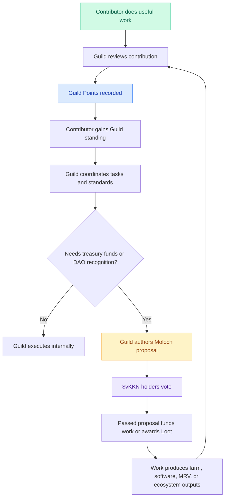

# Kokonut Guilds turn useful work into governance standing.

Kokonut has two paths into the network.

The **capital path** runs through the [Kokonut Moloch DAO](/ecosystem-wiki/the-kokonut-dao/kokonut-moloch-dao): members tribute stablecoins, receive `$vKKN`, vote on treasury decisions, and are protected by rage-quit.

The **contribution path** runs through Kokonut Guilds: contributors ship useful work, earn non-transferable Guild Points, gain standing inside a domain, and can eventually help route work, funding requests, and proposals back to the Moloch DAO.

Guilds exist because the people who understand the work should help govern the work — even if they did not enter the DAO through capital.

  <a href="#choose-your-guild" style={{ display: "inline-flex", alignItems: "center", gap: "6px", background: "#009F4D", color: "#fff", padding: "10px 20px", borderRadius: "8px", fontWeight: "600", fontSize: "14px", textDecoration: "none" }}>
    Choose Your Guild →
  </a>

  <a href="https://link.kokonut.network/discord" style={{ display: "inline-flex", alignItems: "center", gap: "6px", border: "1.5px solid #009F4D", color: "#009F4D", padding: "10px 20px", borderRadius: "8px", fontWeight: "600", fontSize: "14px", textDecoration: "none", background: "transparent" }}>
    Join the Discord
  </a>

  No capital required to begin. Start with a task, contribution, review, report, dataset, proposal, or coordination role.

---

## Guilds at a glance

| Question | Answer |
| --- | --- |
| What are Guilds? | Domain-specific contributor groups responsible for executing Kokonut work. |
| Who can start? | Anyone who can make a useful contribution. Formal membership is earned over time. |
| What do Guilds govern? | Domain decisions, standards, bounty programs, task prioritization, and execution workflows. |
| What are Guild Points? | Non-transferable reputation points tied to verified contributions in a specific Guild. |
| Can points be bought? | No. Points are earned through work and cannot be transferred, delegated, or purchased. |
| How do Guilds connect to the DAO? | Guilds coordinate work and can route proposals to the Moloch DAO when treasury funding or token recognition is needed. |
| Can Guild contributors earn DAO stake? | Significant contributions can be recognized through Moloch DAO Loot awards, subject to proposal and vote. |

<Note>
  Guilds solve Kokonut's "expertise in the game" problem. The Moloch DAO protects treasury governance. Guilds make sure the people doing the work can shape how that work evolves.
</Note>

---

## Why Guilds exist

Token-weighted governance is useful for treasury control, but it is not enough to run a living ecosystem.

A farm network needs people who can:

- improve smart contracts and data pipelines,
- validate the MRV methodology,
- document farm activity,
- write grants and proposals,
- coordinate communities,
- review budgets,
- support farmers,
- explain governance,
- and turn real-world work into public evidence.

The people best qualified to make those decisions are not always the people with the most capital. Guilds give Kokonut a way to recognize expertise, effort, and execution.

> **Moloch governs the treasury. Guilds govern the work.**

---

## How merit-based membership works

<Steps>
  <Step title="Contribute" icon="hammer" iconType="regular">
    Start by doing useful work. This can be a shipped feature, a pull request, an MRV submission, a field report, a proposal draft, a grant application, a documentation improvement, a design asset, a partner intro, or a community coordination task.
  </Step>
  <Step title="Create a contribution record" icon="clipboard-check" iconType="regular">
    Recognized work becomes a contribution record. A good record explains what was done, who did it, which Guild it belongs to, what evidence supports it, and why it matters to Kokonut.
  </Step>
  <Step title="Earn Guild Points" icon="trophy" iconType="regular">
    Completed contributions can earn Guild Points. Points are non-transferable reputation units scoped to the Guild where the work happened. They cannot be bought, sold, delegated, or moved across wallets.
  </Step>
  <Step title="Gain Guild standing" icon="scale-balanced" iconType="regular">
    Once a contributor reaches the Guild's active threshold, they gain standing inside that Guild: voting rights on Guild-scoped decisions, access to working documents, and eligibility to help author proposals.
  </Step>
  <Step title="Route work to the DAO" icon="route" iconType="regular">
    When Guild work needs treasury funding, token recognition, or DAO-wide approval, the Guild can route a proposal to the Moloch DAO. Token holders vote on capital allocation, while Guild contributors provide domain expertise and accountability for execution.
  </Step>
</Steps>

### Common contribution records

| Contribution type | Example evidence | Likely Guild |
| --- | --- | --- |
| Code contribution | Pull request, deployed contract, test suite, API endpoint, dashboard | Technology Guild |
| Impact work | MRV report, satellite analysis, EBF review, SDG mapping, field validation | Impact Guild |
| Documentation | New docs page, page rewrite, contributor guide, educational asset | Communications Guild |
| Governance work | Proposal template, review memo, forum summary, and onboarding checklist | Governance Guild |
| Financial work | Budget model, revenue forecast, treasury report, grant finance section | Finance Guild |
| Partnerships | Farmer intro, partner MOU, event, local coordination, ecosystem relationship | Community & Partnerships Guild |

---

## Membership tiers

| Tier | Entry criteria | Rights | What it means |
| --- | --- | --- | --- |
| Contributor | Complete an open task or recognized contribution | No formal voting rights yet | Open entry point for anyone who wants to help |
| Member | Reach the Guild's minimum point threshold | Vote on Guild-internal decisions | Active contributor with domain standing |
| Steward | Elected by Guild members | Represent the Guild in cross-Guild governance and co-sign proposals | Trusted coordinator for the Guild's domain |
| Emeritus | Former Steward with sustained contribution history | Advisory voice, no active voting weight by default | Reputation is preserved, even if activity slows |

<Note>
  Each Guild can define its own point thresholds, review process, and Steward term lengths. Changes should be made through Guild proposals with sufficient notice to affected contributors.
</Note>

---

## Choose your Guild

<CardGroup cols={2}>
  <Card title="Technology Guild" icon="code">
    For smart contracts, MRV data pipelines, APIs, indexers, dashboards, frontend interfaces, open-source tools, and AI agent integrations.
  </Card>

  <Card title="Impact Guild" icon="satellite">
    For MRV methodology, EBF reporting, CRISP carbon-risk scoring, SDG alignment, field validation, biodiversity evidence, and impact attestations.
  </Card>

  <Card title="Communications Guild" icon="bullhorn">
    For documentation, content strategy, social media, community updates, onboarding materials, grant storytelling, and public narrative.
  </Card>

  <Card title="Governance Guild" icon="scale-balanced">
    For proposal review, governance amendments, member onboarding, dispute resolution, voting process design, and cross-Guild coordination.
  </Card>

  <Card title="Finance Guild" icon="coins">
    For treasury reporting, farm financial modeling, budgets, grant finance, stablecoin strategy, tax/compliance support, and revenue forecasting.
  </Card>

  <Card title="Community & Partnerships Guild" icon="people-group">
    For farmer onboarding, institutional partnerships, ReFi collaborations, local events, community relationships, and cooperative network development.
  </Card>
</CardGroup>

---

## What each Guild produces

### Technology Guild

**Purpose:** Build and maintain the technical infrastructure that enables Kokonut to be composable, auditable, and usable.

**Useful contributions include:**

- Smart contract development and review
- DAO tooling and proposal interfaces
- Farm Registry APIs
- MRV data pipelines
- Data Hub improvements
- Agentic Marketplace integrations
- Frontend applications and dashboards
- Open-source tooling for the Kokonut Framework

**Good first tasks:** fix docs links, improve schema examples, add API examples, test MRV payload formats, document deployed contracts, or build small dashboard components.

---

### Impact Guild

**Purpose:** Protect the credibility of Kokonut's ecological and social impact claims.

**Useful contributions include:**

- MRV methodology design
- Satellite and drone data validation
- Soil and biodiversity reporting
- SDG alignment reviews
- EBF and CRISP methodology work
- Annual impact reports
- Third-party attestation coordination
- Adelphi and future farm impact dashboards

**Good first tasks:** review SDG mappings, improve MRV documentation, validate a crop or biodiversity data point, propose an impact metric, or help turn field observations into structured evidence.

---

### Communications Guild

**Purpose:** Make the Kokonut ecosystem understandable, discoverable, and easy to join.

**Useful contributions include:**

- Ecosystem documentation
- Landing page and onboarding copy
- Twitter/X and Discord updates
- Grant narratives
- Community education materials
- Video scripts and explainers
- Contributor guides
- Public progress reports

**Good first tasks:** improve a docs page, write a short contributor guide, turn a farm update into a social thread, create an onboarding checklist, or simplify a technical page for non-technical readers.

---

### Governance Guild

**Purpose:** Keep Kokonut's decision-making legible, fair, and operationally useful.

**Useful contributions include:**

- Proposal review and formatting
- Governance Framework amendments
- DAO onboarding guides
- Cross-Guild coordination
- Conflict and arbitration process design
- Moloch proposal support
- Vote summaries and decision logs
- Governance parameter reviews

**Good first tasks:** improve proposal templates, summarize a governance decision, review a draft proposal, map a decision process, or create a new contributor governance FAQ.

---

### Finance Guild

**Purpose:** Help the DAO understand capital flows, farm economics, budgets, and funding decisions.

**Useful contributions include:**

- Treasury reporting
- Farm revenue models
- Budget reviews
- Grant financial sections
- Stablecoin strategy
- Public goods allocation modeling
- Dominican tax/compliance support
- Partner financial diligence

**Good first tasks:** review a harvest forecast, improve a budget table, model a farm revenue scenario, create a treasury reporting template, or document public-goods allocation logic.

---

### Community & Partnerships Guild

**Purpose:** Build the relationships that allow Kokonut to grow beyond one farm.

**Useful contributions include:**

- Farmer onboarding
- Partner discovery
- Local government relationships
- ReFi ecosystem integrations
- Public goods protocol relationships
- Community events in the Dominican Republic
- MOU and partnership templates
- New farm pipeline support

**Good first tasks:** introduce a relevant partner, document a farmer onboarding need, draft an MOU template, coordinate a local event, or map potential future farms.

---

## How Guilds connect to Moloch DAO

Guilds and Moloch are intentionally separate.

Moloch protects the treasury. Guilds coordinate execution. This prevents every operational decision from becoming a full DAO vote while keeping capital allocation under token-holder governance.

| Layer | Mechanism | What it governs |
| --- | --- | --- |
| Moloch DAO | Token-weighted votes, 1 `$vKKN` = 1 vote | Treasury allocation, DAO membership, rage-quit, token recognition |
| Guilds | Contribution-weighted points | Operational decisions, domain standards, bounties, working groups |
| Meta-governance | Steward deliberation | Cross-Guild coordination, pre-Moloch consensus, ecosystem-wide standards |
| Production and MRV | Farm records, dashboards, attestations | Evidence that work happened and created value |

<Note>
  Guilds can propose. Moloch decides on the treasury. This keeps execution fast while preserving capital accountability.
</Note>

---

## How contributions can become Loot

Guild Points are not the same as DAO Loot.

Guild Points measure contribution history inside a Guild. They are non-transferable and domain-specific. DAO Loot is issued through the Moloch DAO and can recognize meaningful contributions to the broader network.

A possible path looks like this:

1. A contributor completes meaningful Guild work.
2. The Guild records and reviews the contribution.
3. The contributor gains points and standing.
4. The Guild may recommend the contributor for DAO-level recognition.
5. A Moloch proposal requests a Loot award.
6. `$vKKN` holders vote.
7. If passed, the contributor receives Loot recognition from the DAO.

<Tip>
  Loot is not automatic. It should be reserved for significant contributions that create durable value for the network, such as shipped infrastructure, verified impact reporting, farm onboarding, major grant support, or ecosystem coordination.
</Tip>

---

## What is live vs. still developing

| Area | Status | Notes |
| --- | --- | --- |
| Moloch DAO treasury governance | Live | Capital allocation and membership happen through the DAO layer. |
| Guild model | Active / evolving | The structure is defined; operating processes can improve through contribution. |
| Guild Points | Developing | Point thresholds, review rules, and on-chain reputation details should continue to mature. |
| Loot recognition | Available through DAO proposals | Recognition of significant contributions must still pass through Moloch governance. |
| Farm evidence layer | Live at Adelphi | Adelphi farm records, MRV events, and Data Hub outputs give Guilds real work to coordinate around. |
| Agentic Marketplace | Developing | Future automation can help Guilds scale MRV, reporting, and workflow coordination. |

---

## Frequently asked questions

<AccordionGroup>
  <Accordion title="Do I need to contribute capital to join a Guild?">
    No. Guilds are the contribution path. You can begin by completing useful work, joining a working group, submitting a pull request, helping with MRV, improving documentation, or supporting community operations.
  </Accordion>

  <Accordion title="Can I be in more than one Guild?">
    Yes. Guild standing is scoped by domain. Your Technology Guild contributions are separate from your Impact Guild contributions, but many contributors naturally work across multiple Guilds.
  </Accordion>

  <Accordion title="Can Guild Points be bought or transferred?">
    No. Guild Points are non-transferable contribution records. They represent work, not capital.
  </Accordion>

  <Accordion title="What happens if I stop contributing?">
    Your historical contribution record remains. Guilds may use activity windows to decide who retains active voting rights, but past work should remain visible as reputation history.
  </Accordion>

  <Accordion title="How are new Guilds formed?">
    A new Guild can be proposed by active contributors. It should define a domain, founding members, point logic, Steward responsibilities, and relationship to the broader Kokonut mission before going to governance review and, when needed, Moloch DAO approval.
  </Accordion>

  <Accordion title="How do Guilds get funded?">
    Guilds can request funding through Moloch proposals when work requires treasury support. Over time, farm revenue and the broader Kokonut flywheel can help create recurring budgets for Guild operations and bounties.
  </Accordion>
</AccordionGroup>

---

## Start contributing

<CardGroup cols={2}>
  <Card title="Open Collaboration Invitation" icon="telescope" href="/ecosystem-wiki/open-collaboration-invitation">
    Start here to understand the active contribution paths for agronomists, researchers, developers, DAO members, partners, and capital allocators.
  </Card>

  <Card title="Build with Kokonut" icon="code" href="/build-with-kokonut">
    Technical contributors can explore the public docs, contracts, Farm Registry primitives, API ideas, and agent architecture.
  </Card>

  <Card title="Kokonut Moloch DAO" icon="dragon" href="/ecosystem-wiki/the-kokonut-dao/kokonut-moloch-dao">
    Understand the treasury, `$vKKN`, Loot, rage-quit, and a capital governance layer that Guild proposals connect into.
  </Card>

  <Card title="Governance Framework" icon="scale-balanced" href="/ecosystem-wiki/the-kokonut-dao/governance-framework">
    Read the proposal process, voting flow, amendment procedures, and how decisions move through the DAO.
  </Card>

  <Card title="Proposal Templates" icon="file-signature" href="/ecosystem-wiki/the-kokonut-dao/proposal-templates">
    Use structured proposal formats when Guild work needs funding, recognition, or governance approval.
  </Card>

  <Card title="Adelphi Farm" icon="seedling" href="/ecosystem-wiki/kokonut-farms/adelphi/summary">
    See the live farm that creates real work for Guilds: MRV, reporting, infrastructure, community operations, and replication.
  </Card>
</CardGroup>

  <a href="https://link.kokonut.network/discord" style={{ display: "inline-flex", alignItems: "center", gap: "6px", background: "#009F4D", color: "#fff", padding: "10px 20px", borderRadius: "8px", fontWeight: "600", fontSize: "14px", textDecoration: "none" }}>
    Join the Discord →
  </a>

  <a href="https://github.com/wasalo/Kokonut-Public-Site" style={{ display: "inline-flex", alignItems: "center", gap: "6px", border: "1.5px solid #009F4D", color: "#009F4D", padding: "10px 20px", borderRadius: "8px", fontWeight: "600", fontSize: "14px", textDecoration: "none", background: "transparent" }}>
    Improve the Docs
  </a>

