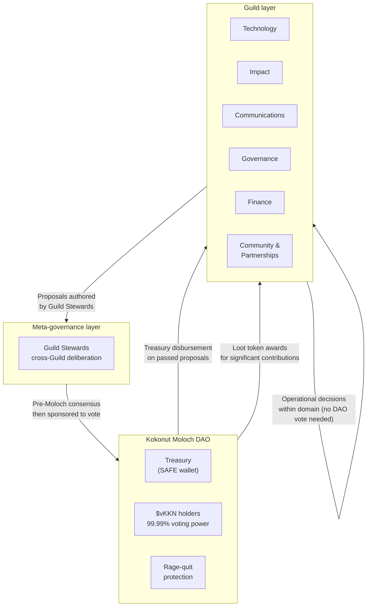

> **Kokonut Guilds are the operational intelligence of the network.** Where the [Kokonut Moloch DAO](/ecosystem-wiki/the-kokonut-dao/kokonut-moloch-dao) holds the treasury and votes on what to fund, Guilds are the organized groups of contributors who actually do the work — and earn governance influence proportional to the value they create.

## What are Kokonut Guilds?

Guilds are domain-specific contributor bodies within the Kokonut Network. Each Guild owns a vertical of the ecosystem — technology, impact, communications, governance, and so on — and operates with autonomy over its domain while remaining accountable to the broader DAO.

Unlike the Moloch DAO, where membership is token-weighted and requires a financial tribute, Guilds are **contribution-weighted**. You earn your way in through work, not capital.

This design solves a coordination problem that pure token governance struggles with: how do you give decision-making power to the people who understand a domain most deeply, without requiring them to be wealthy first?

> Guilds are Kokonut's answer to the "skin in the game vs. expertise in the game" tension — contributors earn reputation through verifiable output, not financial commitment alone.

## How Merit-based Membership works

Guild membership follows a three-stage lifecycle powered by contribution tracking and on-chain reputation.

<Steps>
  <Step title="Contribute" icon="hammer" iconType="regular">
    Anyone can contribute to a Guild without formal membership. Open bounties, ecosystem proposals, and collaborative tasks are visible to the public. Completing recognized work — a shipped feature, a published report, a funded proposal, a verified MRV submission — generates a **contribution record**.
  </Step>
  <Step title="Earn points" icon="trophy" iconType="regular">
    Completed contributions are logged as **Guild Points** — a non-transferable, on-chain reputation score scoped to the Guild where the work happened. Points are the unit of influence inside a Guild. They cannot be bought, transferred, or delegated. Point sources include:

    - Completed bounties and task completions
    - Approved DAO proposals authored or co-authored
    - Verified farm MRV submissions and attestations
    - Peer endorsements from existing Guild members
    - Participation in Guild governance (votes, reviews, deliberations)
  </Step>
  <Step title="Gain standing" icon="scale-balanced" iconType="regular">
    Once a contributor crosses the Guild's minimum point threshold, they achieve **active member** status and receive:

    - Voting rights within Guild-scoped decisions
    - Access to Guild coordination channels and working documents
    - Eligibility to author proposals that route through the Guild to the Moloch DAO
    - Representation rights in cross-Guild meta-governance
  </Step>
</Steps>

### Membership tiers

| **Tier** | **Entry Criteria** | **Governance Rights** | **Notes** |
| --- | --- | --- | --- |
| **Contributor** | Complete any open Guild task | None — work earns points | Open to anyone |
| **Member** | Reach the minimum point threshold for the Guild | Vote on Guild-internal decisions | Threshold set by each Guild |
| **Steward** | Elected by Guild members | Represent the Guild in cross-Guild governance, co-sign proposals to Moloch DAO | Term-limited via Guild vote |
| **Emeritus** | Former Steward with sustained contribution history | Advisory voice, no active voting weight | Reputation preserved on-chain |

<Note>
  Point thresholds and steward term lengths are set by each Guild independently. Guilds may adjust these parameters via internal proposal, subject to a minimum notice period for affected members.
</Note>

## The Guilds

### 🛠️ Technology Guild

Responsible for the technical infrastructure of the Kokonut Ecosystem — smart contracts, data tooling, front-end interfaces, and the agentic layer.

**Domain:** Smart contract development and auditing, frontend applications, MRV data pipelines, AI agent integrations, API, and indexer maintenance.

**Key outputs:** Contract deployments across Base, Gnosis, Celo, and Arbitrum; the Kokonut Agentic Marketplace; farm data APIs; TheGraph subgraphs; open-source tooling for the Kokonut Framework.

---

### 🌱 Impact Guild

Owns the ecological and social impact layer — ensuring that what gets reported in annual reports is rigorous, verifiable, and aligned with the EBF Framework and SDG commitments.

**Domain:** MRV methodology, EBF impact reporting, satellite and drone data validation, CRISP carbon risk scoring, SDG alignment assessment, third-party attestation coordination.

**Key outputs:** Annual environmental and social impact reports, attestation workflows for on-chain MRV data, farm health dashboards, EBF compliance reviews.

---

### 📣 Communications Guild

Manages the public narrative, educational content, and community growth of the Kokonut Network. The voice of the ecosystem outward.

**Domain:** Social media, documentation, content strategy, community events, partnership communications, grant writing, ecosystem wiki maintenance.

**Key outputs:** This documentation site, ecosystem updates, Twitter/X presence, Discord community health, governance newsletters, and onboarding materials.

---

### ⚖️ Governance Guild

Stewards the integrity of the DAO's governance processes — ensuring proposals are well-formed, quorum is met, frameworks evolve thoughtfully, and new contributors understand how decisions get made.

**Domain:** Proposal review and formatting, governance framework amendments, onboarding new DAO members, cross-Guild coordination, and dispute resolution.

**Key outputs:** Updated governance framework versions, proposal templates, member onboarding guides, arbitration case coordination, and meta-governance summaries.

---

### 💰 Finance Guild

Manages the financial health of the ecosystem — treasury reporting, budget proposals, financial modeling for farm projects, and DeFi/stablecoin strategy for the DAO vaults.

**Domain:** Treasury management, budget allocation, farm financial modeling, stablecoin strategy, ITBIS compliance for Dominican operations, and grant and investment pipeline.

**Key outputs:** Monthly treasury reports, farm revenue forecasts, budget proposals, grant application financials, and partner financial diligence.

---

### 🌍 Community & Partnerships Guild

Builds and maintains the relationships that grow the Kokonut Ecosystem — farmers, investors, public goods protocols, ReFi networks, and local cooperatives.

**Domain:** Farmer onboarding and support, institutional partnerships, local government relations, ReFi ecosystem collaboration, investor relations, and co-op network development.

**Key outputs:** Farmer partnership agreements, MOU templates, grant applications, ReFi ecosystem integrations, and community events in the Dominican Republic.

---

## How Guilds relate to the Kokonut Moloch DAO

Guilds and the Moloch DAO operate at different layers of the governance stack, with deliberate separation of concerns.

The relationship works as follows:

**Guilds propose, Moloch decides on the treasury.** Work that requires disbursement from the [Kokonut DAO treasury](https://link.kokonut.network/treasury) must be submitted via a Moloch DAO proposal. Guilds author these proposals, but token holders vote on them. This keeps capital allocation democratic and permissionless.

**Guilds decide within their domain without token votes.** Operational decisions — how to run a bounty program, which tools to adopt, how to structure an impact report — don't require a full DAO vote. Guild members handle these internally, reducing governance overhead on routine work.

**Guild Stewards participate in meta-governance.** When decisions span multiple Guilds — a new Framework standard, an ecosystem-wide partnership, a cross-chain deployment — Stewards convene to deliberate. This is Kokonut's meta-governance layer: the place where operational intelligence informs strategic direction before it goes to a Moloch DAO vote.

**Contribution in Guilds can earn Loot tokens.** Significant Guild contributions — major deliverables, shipped features, verified impact reports — can be recognized via a Moloch DAO [Loot token](https://gnosisscan.io/token/0x2508a11aee11ad545bae87cd42131c04613b2099) award. This bridges the merit-based Guild layer and the token-based Moloch layer, allowing contributors who don't have capital to still accumulate a stake in the DAO's future.

| **Layer** | **Mechanism** | **What it governs** |
| --- | --- | --- |
| **Moloch DAO** | Token-weighted votes (1 vKKN = 1 vote) | Treasury allocation, DAO membership, rage-quit |
| **Guilds** | Contribution-weighted points | Operational decisions, domain standards, bounty programs |
| **Meta-governance** | Steward deliberation | Cross-Guild coordination, pre-Moloch consensus building |

<Tip>
  New to Kokonut and not sure which Guild to join? Start by reading the [open collaboration invitation](/ecosystem-wiki/open-collaboration-invitation) and drop into the [Discord](https://link.kokonut.network/discord) to find which Guild's active work aligns with your skills.
</Tip>

## Frequently asked questions

<AccordionGroup>
  <Accordion title="Can I be a member of more than one Guild?">
    Yes. Guild membership is scoped per domain — your points and standing in the Technology Guild are independent of any points you earn in the Impact Guild. Many contributors participate in two or more Guilds, particularly where work overlaps (for example, a developer building MRV tooling may contribute meaningfully to both the Technology and Impact Guilds).
  </Accordion>

  <Accordion title="What happens to my points if I stop contributing?">
    Guild Points are non-expiring records of historical contribution. Your past work remains on-chain. However, Guilds may implement **activity windows** — a minimum contribution level over a rolling period — to determine who retains active voting rights. Inactive members retain their points and history but may be moved to observer status pending a return to active contribution.
  </Accordion>

  <Accordion title="How are new Guilds formed?">
    New Guilds can be proposed by any active Kokonut contributor. A formation proposal goes through the [Governance Guild](#️-governance-guild) for review, then to a Moloch DAO vote. A new Guild must demonstrate: a defined domain, at least three committed founding members, a proposed point system, and a clear relationship to the ecosystem's mission.
  </Accordion>

  <Accordion title="How does Guild work connect to the Guild's Revenue Stream?">
    The Kokonut  Liquidity Vacuum Mechanism creates a perpetual revenue stream routed to the Guilds. This means that as farms produce and the flywheel spins, Guild contributors have a sustainable funding pool to draw bounties and operational budgets from — independent of external grants or investor rounds.
  </Accordion>
</AccordionGroup>

---

<CardGroup cols={2}>
  <Card title="Kokonut Moloch DAO" icon="dragon" href="/ecosystem-wiki/the-kokonut-dao/kokonut-moloch-dao">
    Understand how the treasury, token mechanics, and rage-quit work at the base layer.
  </Card>

  <Card title="Governance Framework" icon="scale-balanced" href="/ecosystem-wiki/the-kokonut-dao/governance-framework">
    Read the full proposal process, voting parameters, and amendment procedures.
  </Card>

  <Card title="Open Collaboration Invitation" icon="telescope" href="/ecosystem-wiki/open-collaboration-invitation">
    Ready to contribute? Start here for context on how to plug in.
  </Card>

  <Card title="Let's Connect" icon="calendar" href="https://link.kokonut.network/meeting">
    Book a call with the Core Team to find the right Guild for your skills.
  </Card>
</CardGroup>