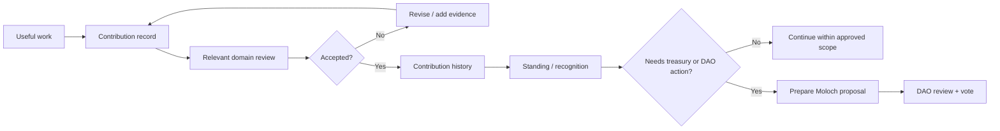
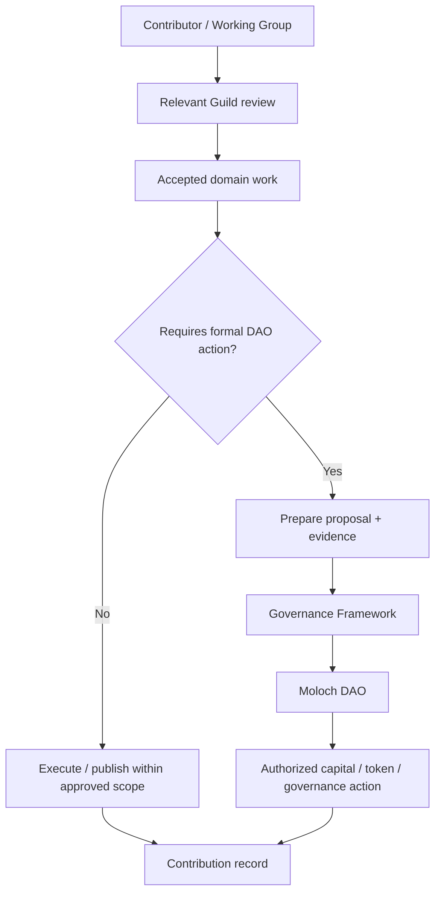
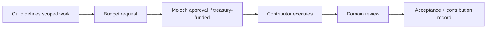

# Kokonut Guilds coordinate useful work without requiring capital first.

The Guild system is Kokonut's contribution path.

It exists because **useful work, domain expertise, and capital contribution are different forms of participation**.

A developer should not need to tribute stablecoins before fixing infrastructure.

An agronomist should not need \$vKKN before reviewing a farm method.

A researcher should not need treasury voting power before improving an MRV claim.

A community coordinator should not need capital membership before helping a farm or partner relationship move forward.

> **Guilds make contribution legible: what was done, who did it, what evidence supports it, which domain should review it, and when the work needs to move into Moloch governance.**

<CardGroup cols={2}>
  <Card title="Start contributing" icon="telescope" href="/ecosystem-wiki/open-collaboration-invitation">
    Begin with a bounded, reviewable contribution in agriculture, research, MRV, software, governance, finance, documentation, or partnerships.
  </Card>

  <Card title="Join the community" icon="brand-discord" href="https://link.kokonut.network/discord">
    Meet contributors, discuss a task, and find the domain where your skills can be useful.
  </Card>

  <Card title="Understand capital governance" icon="building-columns" href="/ecosystem-wiki/the-kokonut-dao/kokonut-moloch-dao">
    See when Guild work needs treasury authorization, Loot recognition, or another formal Moloch action.
  </Card>

  <Card title="Understand the full architecture" icon="layer-group" href="/ecosystem-wiki/the-kokonut-dao/dao-layers">
    See how Guilds fit alongside Moloch, farm operators, the Framework, MRV, and technical execution.
  </Card>
</CardGroup>

<Info>
  **Guild coordination is active. Guild Points are still developing.** Contribution records, domain review, working groups, and proposal preparation can happen today. Point thresholds, formal standing rules, voting weight, elections, and on-chain reputation should not be treated as fully mature or automatic.
</Info>

---

## What Guilds are responsible for

Guilds are **domain coordination groups**.

They can help:

- identify useful work;
- define acceptance criteria;
- review contributions;
- maintain domain knowledge;
- coordinate working groups;
- prepare bounty scopes;
- recommend standards;
- draft or improve proposals;
- surface risks and dependencies;
- recommend significant contributors for broader recognition.

They do **not** automatically control:

- the DAO treasury;
- \$vKKN issuance;
- Loot issuance;
- local farm operations;
- scientific truth outside appropriate review;
- every Framework change;
- every technical deployment.

| Guild responsibility | Boundary |
| --- | --- |
| Define useful domain work | Treasury funding still requires the appropriate authorization |
| Review contribution quality | Review does not automatically mint points, Loot, or \$vKKN |
| Recommend a standard | Shared-schema or Framework changes need affected reviewers |
| Prepare a bounty | DAO capital requires Moloch approval when treasury funds are used |
| Coordinate a working group | Farm operators retain local agricultural authority |
| Recommend Loot recognition | Loot issuance remains a Moloch proposal decision |
| Review a proposal from domain perspective | Guild expertise does not replace the formal governance process |

<Note>
  **Guilds influence work through expertise and contribution, not because they sit above farm operators, the Framework, MRV reviewers, or the Moloch DAO.**
</Note>

---

## Six current Guild domains

| Guild | Primary domain | Typical work |
| --- | --- | --- |
| **Technology** | Software, data, contracts, automation | APIs, dashboards, tests, integrations, developer tooling, agent workflows |
| **Impact** | MRV, ecology, evidence, impact methodology | Evidence review, remote sensing, biodiversity, SDGs, EBF, CRISP |
| **Communications** | Documentation, education, public narrative | Knowledge Base, onboarding, updates, explainers, visual communication |
| **Governance** | Decision process, proposals, roles, accountability | Proposal review, governance docs, process design, decision records |
| **Finance** | Budgets, farm economics, treasury analysis | Forecasts, scenarios, grant budgets, treasury reporting, financial review |
| **Community & Partnerships** | Relationships, onboarding, ecosystem coordination | Farmer onboarding, institutional relationships, events, partner research |

These domains are coordination surfaces.

They are not exclusive professions.

A single contribution can involve more than one Guild.

---

## The current contribution lifecycle

The most durable part of the Guild model is not a point number.

It is the contribution record and review process.

```mermaid
flowchart LR
    A["Useful work"] --> B["Contribution record"]
    B --> C["Relevant domain review"]
    C --> D{"Accepted?"}

    D -->|"No"| E["Revise / add evidence"]
    E --> B

    D -->|"Yes"| F["Contribution history"]
    F --> G["Standing / recognition"]

    G --> H{"Needs treasury or DAO action?"}
    H -->|"No"| I["Continue within approved scope"]
    H -->|"Yes"| J["Prepare Moloch proposal"]

    J --> K["DAO review + vote"]
```

### 1. Do useful work

Examples include:

- code;
- documentation;
- MRV analysis;
- field records;
- financial models;
- governance reviews;
- research;
- partnership coordination;
- design;
- community operations.

### 2. Create a contribution record

A useful record should identify:

| Field | Question |
| --- | --- |
| **Contributor** | Who did the work? |
| **Domain** | Which Guild or review domain is relevant? |
| **Contribution** | What changed or was delivered? |
| **Evidence** | PR, report, dataset, model, meeting notes, field record, design, etc.? |
| **Acceptance criteria** | What does “complete” mean? |
| **Reviewer** | Who is qualified to review it? |
| **Status** | Draft, submitted, accepted, needs revision, rejected? |
| **Dependencies** | Does it affect another Guild, farm, schema, contract, or governance process? |
| **Follow-up** | What should happen next? |

### 3. Review the work

The relevant reviewers determine whether the contribution meets the expected standard.

Review can consider:

- factual accuracy;
- technical quality;
- evidence;
- compatibility;
- scope;
- local context;
- impact on other systems;
- whether the work actually satisfies the task.

### 4. Build contribution history

Accepted work can become part of a contributor's visible record.

That history is more durable than any single reputation score.

### 5. Route formal actions when needed

If the work requires:

- DAO treasury capital;
- Loot recognition;
- DAO-level governance changes;
- formal token actions;
- another Moloch-scoped commitment;

it moves into the applicable governance process.

---

## Guild Points — designed reputation, still developing

Guild Points are intended to represent **non-transferable contribution reputation within a domain**.

The current design principle is:

> **Reputation should come from reviewed work, not from buying a token.**

That principle is established.

The exact implementation is still maturing.

### Current design intent

Guild Points are intended to be:

- contribution-based;
- non-transferable;
- domain-specific;
- tied to reviewable work;
- separate from \$vKKN;
- separate from Loot;
- usable as one input into contribution standing.

### Still developing

The following should **not** be treated as fixed live rules unless a current Guild process explicitly defines them:

- point values per contribution;
- minimum thresholds;
- active-member thresholds;
- voting weight;
- expiration or activity windows;
- cross-Guild portability;
- steward-election mechanics;
- on-chain representation;
- automatic eligibility rules.

<Warning>
  **A completed contribution does not automatically mint Guild Points.** It also does not automatically create payment, Loot, \$vKKN, Moloch voting rights, employment, or farm authority.
</Warning>

---

## Contribution standing should be evidence-first

The old Guild documentation describes four tiers:

**Contributor → Member → Steward → Emeritus**

That remains a useful **target operating model**, but the specific thresholds and rights are not mature enough to present as universal live rules.

| Role concept | Intended meaning | Current caution |
| --- | --- | --- |
| **Contributor** | Someone completing useful work | Open and practical today |
| **Member** | A contributor with sustained domain standing | Thresholds and formal rights can evolve |
| **Steward** | Trusted coordinator/reviewer for a Guild domain | Selection, term, and authority should be explicitly documented per Guild |
| **Emeritus** | A way to preserve historical contribution after active stewardship | Advisory status and rights should not be assumed without a defined process |

<Info>
  The important principle is **progressive responsibility based on demonstrated contribution**. The exact role mechanics should be published and reviewable before they are used to allocate formal authority.
</Info>

---

## Stewardship is a function, not a title alone

A Steward should be understood as a contributor trusted to help coordinate a domain.

Possible stewardship responsibilities include:

- maintaining an active work queue;
- defining review criteria;
- helping new contributors find bounded tasks;
- reviewing contributions;
- identifying cross-Guild dependencies;
- documenting decisions;
- helping mature work become a proposal;
- surfacing conflicts or risks;
- making sure completed work is recorded.

Stewardship should **not** imply:

- unilateral treasury authority;
- permanent office;
- automatic Moloch voting power;
- authority over local farm operations;
- authority to self-award Loot;
- authority to declare scientific claims verified without the relevant review.

A mature Steward system should make clear:

- selection method;
- term;
- review/removal method;
- conflicts of interest;
- decision scope;
- escalation path.

---

## Technology Guild

**Domain:** software, data, contracts, automation, and developer infrastructure.

Useful work can include:

- smart-contract tooling;
- DAO interfaces;
- Farm Registry and API work;
- MRV pipelines;
- dashboards;
- schema validators;
- Kokonut Intelligence integrations;
- agent workflows;
- tests;
- technical documentation.

### Review boundary

Technology review can determine whether software is technically sound.

It does not automatically determine:

- whether an ecological methodology is valid;
- whether treasury funds should be spent;
- whether a farm operator should adopt a workflow;
- whether a shared schema change is acceptable without affected-domain review.

---

## Impact Guild

**Domain:** MRV, ecology, evidence, sustainability, and impact interpretation.

Useful work can include:

- MRV methodology;
- field-evidence review;
- remote-sensing analysis;
- biodiversity records;
- soil evidence;
- SDG mapping;
- EBF interpretation;
- CRISP risk review;
- impact-report preparation.

### Review boundary

Impact review can assess whether evidence supports a claim.

It does not automatically:

- certify a regulated environmental credit;
- approve treasury spending;
- control farm operations;
- convert an EAS attestation into scientific truth.

[Read the MRV evidence standard →](/ecosystem-wiki/kokonut-farms/measurement-reporting-and-verification)

---

## Communications Guild

**Domain:** documentation, education, onboarding, and public communication.

Useful work can include:

- documentation;
- ecosystem updates;
- contributor onboarding;
- educational assets;
- proposal explainers;
- grant narratives;
- public progress summaries;
- visual communication.

### Review boundary

Communications should improve clarity without turning:

- forecasts into actuals;
- project intent into achieved impact;
- developing systems into live systems;
- marketing language into unsupported evidence claims.

---

## Governance Guild

**Domain:** decision process, proposal quality, roles, and accountability.

Useful work can include:

- proposal review;
- governance documentation;
- process diagrams;
- amendments;
- onboarding;
- decision records;
- facilitation;
- role definitions;
- cross-Guild coordination.

### Review boundary

Governance contributors can improve the process.

They do not automatically:

- decide treasury outcomes outside the formal Moloch process;
- override domain experts;
- command farm operators;
- create Moloch voting rights.

---

## Finance Guild

**Domain:** financial analysis, budgets, treasury reporting, and farm economics.

Useful work can include:

- budget models;
- forecast review;
- scenario analysis;
- treasury reporting;
- grant finance;
- farm economics;
- public-goods allocation modeling;
- financial diligence.

### Review boundary

Finance analysis can improve a funding decision.

It does not turn a forecast into realized revenue or grant authority to move DAO funds without the applicable approval.

The current Adelphi documentation also contains an unresolved **10% vs. 40/40/20 public-goods allocation inconsistency**, which is an example of the kind of cross-document financial issue that should be reconciled before being used as a binding model.

[Review the Adelphi forecast model →](/ecosystem-wiki/kokonut-farms/adelphi/crops-and-harvest-forecast)

---

## Community & Partnerships Guild

**Domain:** relationships, onboarding, local coordination, and ecosystem partnerships.

Useful work can include:

- farmer onboarding;
- partner research;
- local events;
- institutional relationships;
- ReFi collaborations;
- MOU preparation;
- coordination notes;
- new-farm pipeline research.

### Review boundary

Relationship-building does not automatically authorize:

- a binding legal agreement;
- DAO treasury spending;
- commitments on behalf of a farm operator;
- claims about a partner that have not been verified.

---

## How Guild work connects to Moloch

Guilds and Moloch solve different coordination problems.

| Question | Guild path | Moloch path |
| --- | --- | --- |
| What work is useful? | Domain contributors / reviewers | Not usually a token-vote question |
| Does the work meet domain standards? | Guild / relevant reviewers | Not usually a token-vote question |
| Should shared treasury capital fund it? | Guild can prepare recommendation | Moloch decides |
| Should a contributor receive Loot? | Guild can document/recommend | Moloch decides |
| Should \$vKKN be issued? | Not a Guild authority | Moloch decides |
| Should a technical or impact standard change? | Affected Guilds / Framework reviewers | Moloch only when DAO-level authority or funding is implicated |
| Should a farmer change daily operations? | Guild may advise | Local operator decides within farm scope |

### Routing model

```mermaid
flowchart TD
    A["Contributor / Working Group"] --> B["Relevant Guild review"]
    B --> C["Accepted domain work"]
    C --> D{"Requires formal DAO action?"}

    D -->|"No"| E["Execute / publish within approved scope"]
    D -->|"Yes"| F["Prepare proposal + evidence"]

    F --> G["Governance Framework"]
    G --> H["Moloch DAO"]
    H --> I["Authorized capital / token / governance action"]

    E --> J["Contribution record"]
    I --> J
```

> **Guilds can recommend and prepare. Moloch authorizes Moloch-scoped actions.**

---

## From contribution to Loot

Guild Points, contribution history, and Loot are different concepts.

### Contribution history

The evidence that useful work happened.

### Guild Points

A developing reputation mechanism intended to summarize reviewed contribution within a Guild.

### Loot

A live, non-voting token primitive under the current Moloch model that can be awarded through a DAO proposal.

A contribution-to-Loot path can look like:

<Steps>
  <Step title="1. Complete meaningful work" icon="hammer" iconType="regular">
    Produce a durable contribution with clear evidence and acceptance criteria.
  </Step>

  <Step title="2. Get domain review" icon="clipboard-check" iconType="regular">
    Relevant reviewers determine whether the contribution is accepted.
  </Step>

  <Step title="3. Build a contribution record" icon="clipboard-check" iconType="regular">
    Preserve the contribution, evidence, reviewer, and outcome in a reusable record.
  </Step>

  <Step title="4. Consider DAO-level recognition" icon="star" iconType="regular">
    If the contribution creates significant durable value, the Guild or other participants can recommend broader recognition.
  </Step>

  <Step title="5. Submit a Loot proposal" icon="file-pen" iconType="regular">
    Loot issuance enters the normal Moloch proposal process.
  </Step>

  <Step title="6. Moloch decides" icon="check-to-slot" iconType="regular">
    Eligible \$vKKN holders decide whether the proposed Loot award is approved.
  </Step>
</Steps>

<Note>
  **Loot should not be described as an automatic promotion from Guild Points.** The contribution record supports the case; the Moloch proposal is the authorization mechanism.
</Note>

---

## Bounties and paid work

A Guild can help define a bounty by specifying:

- problem;
- deliverable;
- owner;
- acceptance criteria;
- reviewer;
- dependencies;
- budget;
- timeline;
- evidence required for completion.

If a bounty uses DAO treasury capital, the funding authorization belongs in the applicable Moloch proposal process.

Once funded, routine delivery and review should not require a full token vote for every implementation detail.

```mermaid
flowchart LR
    A["Guild defines scoped work"] --> B["Budget request"]
    B --> C["Moloch approval if treasury-funded"]
    C --> D["Contributor executes"]
    D --> E["Domain review"]
    E --> F["Acceptance + contribution record"]
```

---

## Cross-Guild work

Many useful contributions cross domains.

Examples:

| Work | Likely review path |
| --- | --- |
| MRV dashboard | Technology + Impact |
| Farm forecast tool | Finance + Technology + farm context |
| Governance explainer | Governance + Communications |
| New farm onboarding | Community & Partnerships + Impact + Finance + operators |
| Public impact report | Impact + Communications + evidence reviewers |
| Agent-assisted MRV workflow | Technology + Impact + human reviewer |
| Partnership with treasury commitment | Community & Partnerships + Finance + Moloch |

The goal is not to create committee overhead.

The goal is to avoid one Guild approving work outside its competence.

---

## Relationship to farm operators

Guilds can support farms.

They do not replace farm operators.

A Guild may:

- research a crop method;
- build a dashboard;
- review a budget;
- improve MRV;
- prepare a funding proposal;
- document a process;
- coordinate a partner.

A Guild should not assume it can unilaterally:

- change the crop plan;
- direct labor;
- change irrigation timing;
- commit a farm to a partner agreement;
- publish sensitive farm information;
- override local operating judgment.

> **Expertise should travel through the network. Operational authority should remain close to the farm.**

---

## Relationship to the Framework and MRV

Some work belongs partly in a Guild and partly in a shared methodological process.

### Framework changes

A Technology, Impact, Governance, or other Guild may propose improvements to:

- schemas;
- development phases;
- evidence requirements;
- shared terminology;
- reporting logic.

But shared Framework primitives should involve affected reviewers before implementation.

### MRV review

Impact and Technology contributors can help with:

- evidence structure;
- validation;
- remote sensing;
- data tooling;
- attestation workflows.

But a Guild reputation score does not make a claim scientifically correct.

---

## What is live and what is still developing

| Component | Status | Current interpretation |
| --- | --- | --- |
| **Six Guild domains** | **Active model** | Used to organize contribution and domain responsibility |
| **Open contribution path** | **Live** | Contributors can begin without capital |
| **Contribution records** | **Active practice** | Reviewable artifacts and evidence can document work |
| **Domain review** | **Active / evolving** | Review can happen today; process maturity varies by domain |
| **Working groups / proposal preparation** | **Active / evolving** | Guild-aligned contributors can coordinate scoped work |
| **Guild Points** | **Developing** | Point values, thresholds, formal standing, and technical implementation still maturing |
| **Contributor → Member → Steward → Emeritus model** | **Target operating model** | Useful role framework; exact thresholds and rights should not be treated as universal live rules |
| **Loot recognition** | **Live through Moloch proposals** | Significant contribution can be proposed for non-voting DAO recognition |
| **On-chain Guild reputation** | **Developing** | Should not be assumed live unless a current implementation is documented |
| **Agent-assisted coordination** | **Developing** | Agents can support workflow; accountable humans remain responsible for review |

Transparency about maturity protects contributors from being promised rights or rewards that are not yet operational.

---

## What the Guild model is not

<CardGroup cols={2}>
  <Card title="Not pay-to-participate" icon="coins">
    Capital is not required to begin contributing.
  </Card>

  <Card title="Not automatic reputation" icon="star">
    Work should be reviewed before it becomes recognized contribution history or reputation.
  </Card>

  <Card title="Not automatic Loot" icon="award">
    Significant work can support a Loot proposal; it does not self-mint a DAO token.
  </Card>

  <Card title="Not shadow treasury governance" icon="building-columns">
    Guilds can recommend budgets, but Moloch authorizes DAO treasury actions.
  </Card>

  <Card title="Not remote farm management" icon="tractor">
    Domain expertise can support operators without replacing their real-world authority.
  </Card>

  <Card title="Not expertise by title" icon="clipboard-check">
    A role or point balance should not substitute for evidence, competence, or appropriate review.
  </Card>
</CardGroup>

---

## How to start contributing

<Steps>
  <Step title="1. Choose a useful problem" icon="bullseye" iconType="regular">
    Start with a bounded issue, documentation gap, research question, MRV need, technical task, governance improvement, financial review, or partnership task.
  </Step>

  <Step title="2. Identify the review domain" icon="users" iconType="regular">
    Decide which Guild or combination of Guilds is best positioned to review the work.
  </Step>

  <Step title="3. Define evidence before doing the work" icon="clipboard-check" iconType="regular">
    Know what artifact will demonstrate completion: PR, report, dataset, model, field record, design, proposal, or coordination outcome.
  </Step>

  <Step title="4. Submit something reviewable" icon="code-pull-request" iconType="regular">
    Make the contribution easy for another person to inspect.
  </Step>

  <Step title="5. Record the outcome" icon="clipboard-check" iconType="regular">
    Preserve what was accepted, who reviewed it, and what should happen next.
  </Step>

  <Step title="6. Route formal actions only when needed" icon="route" iconType="regular">
    Move into Moloch governance when treasury, token, or formal DAO authority is actually required.
  </Step>
</Steps>

---

## Continue through The Kokonut DAO

<CardGroup cols={2}>
  <Card title="DAO Architecture" icon="layer-group" href="/ecosystem-wiki/the-kokonut-dao/dao-layers">
    See the boundaries between Moloch, Guilds, farm operators, Framework stewardship, evidence review, and technical execution.
  </Card>

  <Card title="Kokonut Moloch DAO" icon="building-columns" href="/ecosystem-wiki/the-kokonut-dao/kokonut-moloch-dao">
    Understand the capital-governance system that authorizes treasury spending, \$vKKN, Loot, and other DAO-level actions.
  </Card>

  <Card title="Governance Framework" icon="scale-balanced" href="/ecosystem-wiki/the-kokonut-dao/governance-framework">
    Follow the proposal process from drafting and review through sponsorship, voting, grace, execution, and reporting.
  </Card>

  <Card title="Proposal Templates" icon="file-signature" href="/ecosystem-wiki/the-kokonut-dao/proposal-templates">
    Use structured templates when Guild work needs funding, recognition, Framework changes, or partnership authorization.
  </Card>

  <Card title="Open Collaboration" icon="telescope" href="/ecosystem-wiki/open-collaboration-invitation">
    Start contributing without capital and choose a bounded, reviewable first contribution.
  </Card>

  <Card title="Build with Kokonut" icon="code" href="/build-with-kokonut">
    Explore technical tasks, current contracts, data primitives, MRV schemas, and developer contribution paths.
  </Card>
</CardGroup>

> **The Guild model is strongest when reputation follows evidence, responsibility follows demonstrated contribution, and formal authority is only granted where the process for granting it is explicit.**
