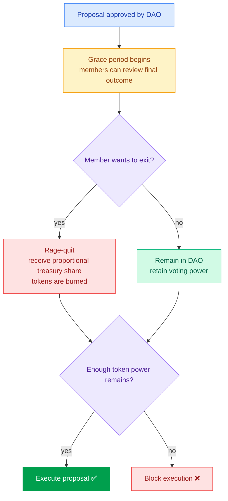

The Kokonut Moloch DAO is the capital and governance engine of the Kokonut Network — the live, deployed system on Gnosis Chain that holds the treasury, governs farm funding, and protects every member's stake. It is the Logic and Governance Layer of the [DAO Architecture](/ecosystem-wiki/the-kokonut-dao/dao-layers): the contract layer that makes the network's commitments to community ownership and member protection enforceable on-chain rather than just aspirational.

[Moloch DAOs](https://daohaus.mirror.xyz/U_JQtheSzdpRFqQwf9Ow3LgLNG0WMZ6ibAyrjWDu_fc) have no administrators and no trusted intermediaries. All decisions are made through proposals executed directly against the treasury or vaults. No individual — including the Kokonut Core Team — can move funds, mint tokens, or change governance parameters without a passed community vote.

---

## Core mechanics

| **Mechanic** | **How it works at Kokonut** |
| --- | --- |
| **Network Chain** | Deployed on [Gnosis Chain](https://docs.gnosischain.com/) — a highly secure, resilient, and decentralized EVM-compatible network. Chain ID: `100`. RPC: `https://rpc.gnosischain.com`. Block explorer: `https://gnosisscan.io`. |
| **Rage-quit** | Any DAO member can withdraw their proportional share of the treasury at any time — including during the grace period after an unwanted proposal passes. This is the core capital protection mechanism. [See rage-quit mechanics →](#how-rage-quit-works) |
| **Permissionless exit** | Contributors can enforce their governance rights by rage-quitting if they are uncomfortable with the direction the DAO is taking. No admin can freeze or confiscate your stake. Rage-quit burns your tokens and returns your treasury share. |
| **Stablecoins only** | The Kokonut DAO treasury accepts **stablecoins only** as tribute. The treasury's value does not fluctuate with crypto market prices — it is backed by productive farmland and stablecoin reserves, not speculative token prices. |

---

## DAO components

### Tokens

Both Kokonut DAO tokens are **soulbound** — permanently bound to the wallet that received them. They cannot be transferred, sold, delegated, or traded on the open market. Governance and economic rights at Kokonut flow from participation and contribution, not from purchasing power in secondary markets.

| **Token** | **Contract** | **Purpose** |
| --- | --- | --- |
| **\$vKKN — Voting Token** | [`0xc6b075ac3234a7ac729114b27370b552fa284690`](https://gnosisscan.io/token/0xc6b075ac3234a7ac729114b27370b552fa284690) | Soulbound governance token. Minted via DAO proposal when a member tributes stablecoins. 1 token = 1 vote on all on-chain proposals. Each \$vKKN is backed 1:1 by a real coconut tree in a Kokonut Network farm. |
| **Loot Token** | [`0x2508a11aee11ad545bae87cd42131c04613b2099`](https://gnosisscan.io/token/0x2508a11aee11ad545bae87cd42131c04613b2099) | Non-voting soulbound token. Awarded to land-owners, contributors, Core Team members, and partners who add verifiable value via DAO proposal. Carries economic rights (proportional treasury claim, rage-quit eligible) without governance voting rights. |

### Infrastructure contracts

| **Contract** | **Address** | **Purpose** |
| --- | --- | --- |
| **Vault & Token Manager** | [`0x8977c56e979f0d8b76afb5ad85549acd2e96422d`](https://gnosisscan.io/address/0x8977c56e979f0d8b76afb5ad85549acd2e96422d) | Handles token issuance and DAO smart wallet operations. All operations require a passed proposal — Kokonut DAO is the sole signatory. No individual can operate this contract unilaterally. |
| **Main Treasury (SAFE)** | [`0xeb55b75328a8dffd45bbf34b7e7efc431a179085`](https://gnosisscan.io/address/0xeb55b75328a8dffd45bbf34b7e7efc431a179085) | Rage-quit-enabled SAFE wallet. Handles tribute inflows, disbursement outflows, token minting and burning, and rage-quit exits. All treasury assets are stablecoins. The treasury is publicly auditable at [link.kokonut.network/treasury](https://link.kokonut.network/treasury). |

---

## Becoming a member — the tribute process

Membership in the Kokonut Moloch DAO is open to anyone willing to tribute stablecoins to the treasury. The process follows the standard [Governance Framework](/ecosystem-wiki/the-kokonut-dao/governance-framework) proposal flow:

<Steps>
  <Step title="Prepare your tribute" icon="coins" iconType="regular">
    Decide how many \$vKKN tokens you want. Each token is backed 1:1 by a real coconut tree and grants 1 vote on all DAO proposals. The tribute amount (in stablecoins) is set by the current membership proposal parameters — [book a call](https://link.kokonut.network/meeting) with the Core Team to confirm the current rate before submitting. You will need a Web3 wallet (e.g. MetaMask) connected to Gnosis Chain (Chain ID: `100`) and stablecoins on Gnosis Chain to cover the tribute and gas.
  </Step>
  <Step title="Submit a membership proposal on DAOHaus" icon="pen-to-square" iconType="regular">
    Navigate to [link.kokonut.network/dao](https://link.kokonut.network/dao) and submit a membership proposal specifying your tribute amount. The proposal enters a 5-day drafting/feedback window on [Charmverse](https://link.kokonut.network/charmverse) before moving to an active vote. All vote-authorized members (existing \$vKKN holders) are notified when your proposal enters the drafting stage.
  </Step>
  <Step title="Community votes" icon="check-to-slot" iconType="regular">
    The active voting window runs for **5 days** on DAOHaus. Voting is on-chain: 1 \$vKKN = 1 vote. Quorum for new member onboarding is 0% — any level of participation produces a valid result. The proposal needs a majority "For" vote to pass.
  </Step>
  <Step title="Grace period" icon="hourglass-half" iconType="regular">
    After the vote passes, a grace period opens before execution. Any existing member who disagrees with the new membership can [rage-quit](#how-rage-quit-works) during this window with their full proportional treasury share. This protects existing members from being diluted against their will.
  </Step>
  <Step title="Tokens minted, membership confirmed" icon="hydra" iconType="regular">
    After the grace period closes, the proposal executes: your stablecoin tribute flows into the treasury, and your \$vKKN tokens are minted to your wallet. You are now a Kokonut DAO member with:

    - Voting rights on all proposals
    - Rage-quit protection on your stake
    - Eligibility to sponsor proposals to the active voting stage
    - Access to [Charmverse](https://link.kokonut.network/charmverse) governance coordination
    - On-demand meeting access with the Core Team
  </Step>
</Steps>

<Note>
  Don't have capital to tribute? The [Kokonut Guilds DAO](/ecosystem-wiki/the-kokonut-dao/kokonut-guilds-dao) is the contribution path — earn Guild Points through verifiable work, then become eligible for Loot token awards via Moloch DAO proposal. Loot tokens carry economic rights (rage-quit eligible) without requiring a stablecoin tribute.
</Note>

---

## How rage-quit works

Rage-quit is the capital protection mechanism that makes the Kokonut DAO fundamentally different from traditional investment structures. It cannot be disabled by an administrator or bypassed by a majority vote.

**When you can rage-quit:** At any time — before a proposal, after a proposal passes (during the grace period before execution), or at any point during your membership. There is no lockup period.

**What you receive:** A proportional share of **all assets** held in the treasury at the time of your exit — not just the asset you tributed. If the treasury holds USDC, DAI, and other stablecoins, your exit distributes proportionally across all of them.

**What happens to your tokens:** Your \$vKKN tokens are burned on exit. The treasury's total share count decreases, maintaining the proportional claim of remaining members.

**Does it affect past votes?** No. Your governance history stands. Rage-quitting is a clean economic exit — it does not retroactively alter any proposals you voted on or actions taken during your membership.

**The grace period protection:** Every passed proposal opens a grace period before execution. During this window, any member who disagrees with the outcome can rage-quit with their full proportional share — before the disbursement they voted against is executed. This makes it structurally impossible for a majority to trap a minority's capital.

<Tip>
  The 66% token retention threshold means a proposal only executes if at least 66% of the total \$vKKN supply remains in the DAO after the grace period. If rage-quits reduce the supply below 66%, the proposal is not executed — protecting the treasury against governance attacks that try to pass large disbursements while minority holders exit.
</Tip>

---

## Voting power distribution

[DAO Members](https://link.kokonut.network/members) have total control over decisions. Kokonut DAO is a community-led organization — the voting power distribution reflects this structurally, not just aspirationally.

| **Role** | **Voting power** | **Notes** |
| --- | --- | --- |
| [DAO Members](https://link.kokonut.network/members) | **99.99%** | All \$vKKN holders collectively. Power grows with each new member tribute. |
| [Core Team](https://kokonut.network/about) | **0%** | The Core Team holds no governance tokens. Cannot vote on or veto any proposal. |
| [DAO Summoner](https://link3.to/wasabinetwork) | **0.0016%** | The wallet that initially deployed the DAO contracts. Symbolic founder position. |

This distribution is enforced at the contract level — the Core Team's 0% voting power is not a policy that can be changed by a Core Team decision. Changing it would require a passed DAO proposal.

---

## DAO membership utility

What \$vKKN token holders can do with their membership:

| **Utility** | **Description** | **Access** |
| --- | --- | --- |
| **Governance voting** | 1 \$vKKN = 1 vote on all proposals: farm funding, bounties, partnerships, governance upgrades, token minting/burning | [DAOHaus](https://link.kokonut.network/dao) |
| **Proposals sponsorship** | Any member with ≥1 \$vKKN can sponsor a drafted proposal to the active voting stage | [DAOHaus](https://link.kokonut.network/dao) |
| **Rage-quit protection** | Exit at any time with proportional treasury share — including during grace period. No lockup, no admin override | [DAOHaus](https://link.kokonut.network/dao) |
| **Loot token eligibility** | Significant Guild contributions can be recognized with Loot token awards via DAO proposal — giving contributors economic rights without requiring a tribute | [Kokonut Guilds](/ecosystem-wiki/the-kokonut-dao/kokonut-guilds-dao) |
| **Proposal authorship** | Submit farm funding proposals, governance amendments, Guild bounties, and ecosystem partnerships via the full proposal template | [Proposal Templates](/ecosystem-wiki/the-kokonut-dao/proposal-templates) |
| **Community coordination** | Charmverse workspace for governance forum, proposal drafts, bounty listings, and member collaboration | [Charmverse](https://link.kokonut.network/charmverse) |
| **Farm data access** | Live MRV data, harvest records, and impact metrics for all farms the DAO has funded | [hub.kokonut.network](https://hub.kokonut.network/projects/41) |
| **On-demand meetings** | DAO members can request direct meetings with Core Team members | [Meeting Calendar](https://link.kokonut.network/meeting) |

---

<CardGroup cols={2}>
  <Card title="DAO Architecture" icon="layer-group" href="/ecosystem-wiki/the-kokonut-dao/dao-layers">
    How the Moloch DAO fits into the five-layer network stack — and how it relates to the Guilds DAO operational layer.
  </Card>

  <Card title="Kokonut Guilds DAO" icon="hydra" href="/ecosystem-wiki/the-kokonut-dao/kokonut-guilds-dao">
    The contribution path to membership — earn Guild Points through work, then Loot tokens through DAO proposal, without a capital tribute.
  </Card>

  <Card title="Governance Framework" icon="scale-balanced" href="/ecosystem-wiki/the-kokonut-dao/governance-framework">
    The full proposal process — drafting, voting windows, quorum, retention threshold, and execution — that governs every action in this DAO.
  </Card>

  <Card title="Proposal Templates" icon="scroll" href="/ecosystem-wiki/the-kokonut-dao/proposal-templates">
    Ready-to-use templates for farm funding, Guild bounties, framework upgrades, and partnerships — the four proposal types that move through this DAO.
  </Card>
</CardGroup>