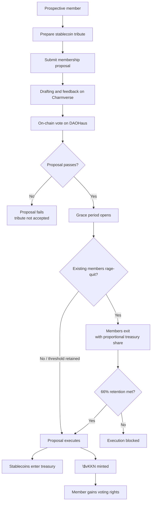
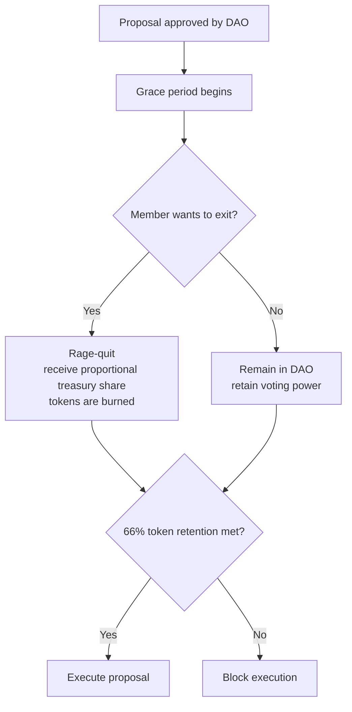

# Kokonut Moloch DAO is the treasury engine that makes community ownership enforceable.

The Kokonut Moloch DAO is the capital and governance engine of Kokonut Network. It is the live on-chain system on Gnosis Chain that holds the treasury, governs farm funding, mints membership tokens, burns exiting shares, and protects every capital-contributing member through rage-quit.

Kokonut does not ask members to trust an administrator, a company wallet, or the Core Team. Treasury actions require passed proposals. Membership is minted through DAO approval. Capital can exit through rage-quit. Governance rights are enforced by contracts instead of promises.

  <a href="#how-membership-works" style={{ display: "inline-flex", alignItems: "center", gap: "6px", background: "#009F4D", color: "#fff", padding: "10px 20px", borderRadius: "8px", fontWeight: "600", fontSize: "14px", textDecoration: "none" }}>
    See How Membership Works →
  </a>

  <a href="https://link.kokonut.network/dao" style={{ display: "inline-flex", alignItems: "center", gap: "6px", border: "1.5px solid #009F4D", color: "#009F4D", padding: "10px 20px", borderRadius: "8px", fontWeight: "600", fontSize: "14px", textDecoration: "none", background: "transparent" }}>
    Open the DAO on DAOHaus
  </a>

  Capital contribution is one path into Kokonut. Contributors without capital can start through Guilds and earn standing through verified work.

---

## DAO at a glance

| Question | Answer |
| --- | --- |
| What does this DAO govern? | Treasury assets, membership, farm funding, Guild funding, partnerships, and governance upgrades. |
| Where is it deployed? | [Gnosis Chain](https://docs.gnosischain.com/), Chain ID `100`. |
| What assets does the treasury accept? | Stablecoins only. The treasury is not designed around speculative token price exposure. |
| How do members join? | By submitting a membership proposal and tributing stablecoins to the treasury. |
| What does a member receive? | Soulbound \$vKKN voting tokens. Each \$vKKN = 1 vote and is backed 1:1 by a real coconut tree. |
| How are contributors without capital recognized? | Through Guild Points and potential Loot token awards via DAO proposal. |
| What protects members? | Rage-quit: members can exit with their proportional treasury share. |
| Who can move treasury funds? | Only the DAO through passed proposals. No individual can move funds unilaterally. |

<Note>
  The Moloch DAO is the capital path. The [Kokonut Guilds DAO](/ecosystem-wiki/the-kokonut-dao/kokonut-guilds-dao) is the contribution path. Together, they separate financial commitment from domain expertise so both capital and work can be recognized.
</Note>

---

## Why Moloch?

Kokonut uses the Moloch DAO pattern because it solves a specific governance problem: how can a group coordinate capital without trusting a central operator?

Moloch DAOs have no administrators and no trusted intermediaries. Decisions are made through proposals that execute against treasury or vault contracts. No individual — including the Kokonut Core Team — can move funds, mint tokens, burn tokens, or change governance parameters without a passed community vote.

<CardGroup cols={3}>
  <Card title="No unilateral treasury control" icon="lock">
    Treasury actions require proposals. The Main Treasury is controlled by DAO execution, not a private multisig controlled by the Core Team.
  </Card>

  <Card title="Membership by proposal" icon="user-plus">
    New \$vKKN holders are admitted through the governance process. Stablecoin tribute enters the treasury only if the proposal passes.
  </Card>

  <Card title="Exit is built in" icon="door-open">
    Members can rage-quit with their proportional share of the treasury if they disagree with the DAO's direction or a passed proposal.
  </Card>
</CardGroup>

---

## Core mechanics

| Mechanic | How it works at Kokonut |
| --- | --- |
| Network chain | Deployed on [Gnosis Chain](https://docs.gnosischain.com/), an EVM-compatible network. Chain ID: `100`. RPC: `https://rpc.gnosischain.com`. Explorer: [Gnosisscan](https://gnosisscan.io). |
| Stablecoin tribute | Membership tribute is paid in stablecoins. This reduces governance exposure to speculative crypto volatility and keeps the treasury oriented around productive deployment. |
| Soulbound membership | \$vKKN and Loot are non-transferable. Governance and economic rights come from proposal approval, capital contribution, land stewardship, or verified work — not from buying tokens on a secondary market. |
| Rage-quit | Members can exit with their proportional share of the treasury. This is the primary capital-protection mechanism. |
| Grace period | After a proposal passes, a grace period opens before execution. Members who disagree can exit before the proposal executes. |
| 66% retention threshold | If rage-quits reduce token retention below 66%, the proposal does not execute. This protects the treasury from governance attacks. |
| Proposal execution | Treasury actions are executed through the DAO once the proposal process completes. No additional approval from the Core Team is required. |

---

## DAO components

### Tokens

Both Kokonut DAO tokens are **soulbound**. They cannot be transferred, sold, delegated, or traded on the open market.

| Token | Contract | Purpose |
| --- | --- | --- |
| \$vKKN — Voting Token | [`0xc6b075ac3234a7ac729114b27370b552fa284690`](https://gnosisscan.io/token/0xc6b075ac3234a7ac729114b27370b552fa284690) | Soulbound governance token. Minted via DAO proposal when a member tributes stablecoins. 1 \$vKKN = 1 vote. Each \$vKKN is backed 1:1 by a real coconut tree in a Kokonut Network farm. |
| Loot Token | [`0x2508a11aee11ad545bae87cd42131c04613b2099`](https://gnosisscan.io/token/0x2508a11aee11ad545bae87cd42131c04613b2099) | Non-voting soulbound token. Awarded to landowners, contributors, Core Team members, and partners who add verifiable value via DAO proposal. Carries economic rights and rage-quit eligibility without governance voting rights. |

### Infrastructure contracts

| Contract | Address | Purpose |
| --- | --- | --- |
| Vault & Token Manager | [`0x8977c56e979f0d8b76afb5ad85549acd2e96422d`](https://gnosisscan.io/address/0x8977c56e979f0d8b76afb5ad85549acd2e96422d) | Handles token issuance and DAO smart wallet operations. All operations require a passed proposal. Kokonut DAO is the sole signatory. |
| Main Treasury SAFE | [`0xeb55b75328a8dffd45bbf34b7e7efc431a179085`](https://gnosisscan.io/address/0xeb55b75328a8dffd45bbf34b7e7efc431a179085) | Rage-quit-enabled SAFE wallet. Handles tribute inflows, disbursement outflows, token minting, token burning, and rage-quit exits. Public treasury view: [link.kokonut.network/treasury](https://link.kokonut.network/treasury). |

---

## How membership works

Membership in the Kokonut Moloch DAO is open to anyone willing to contribute stablecoins to the treasury and pass the DAO's membership proposal process.

<Steps>
  <Step title="Prepare your tribute" icon="coins" iconType="regular">
    Decide how many \$vKKN tokens you want to request. Each token is backed 1:1 by a real coconut tree and grants 1 vote on on-chain proposals.

    You will need:

    - A Web3 wallet connected to Gnosis Chain
    - Stablecoins on Gnosis Chain for the tribute
    - A small amount of xDAI for gas
    - The current membership proposal parameters

    [Book a call](https://link.kokonut.network/meeting) if you need help confirming the current tribute rate or proposal requirements before submitting.
  </Step>
  <Step title="Submit a membership proposal" icon="pen-to-square" iconType="regular">
    Navigate to [link.kokonut.network/dao](https://link.kokonut.network/dao) and submit a membership proposal specifying your tribute amount and the \$vKKN you are requesting.

    The proposal enters the broader Kokonut governance process: a drafting and feedback window, followed by on-chain voting on DAOHaus.
  </Step>
  <Step title="Community review and vote" icon="check-to-slot" iconType="regular">
    Members review the proposal, discuss it, and vote on it. On-chain voting uses the rule: **1 \$vKKN = 1 vote**.

    For onboarding proposals, quorum is intentionally permissionless: any level of participation produces a valid result, and the proposal needs a majority "For" vote to pass.
  </Step>
  <Step title="Grace period opens" icon="hourglass-half" iconType="regular">
    After a membership proposal passes, the grace period begins before execution. Existing members who disagree with the new membership can rage-quit with their proportional treasury share before the proposal executes.
  </Step>
  <Step title="Tokens minted, membership confirmed" icon="hydra" iconType="regular">
    Once the grace period closes and the proposal executes, your stablecoin tribute enters the treasury, and your \$vKKN tokens are minted to your wallet.

    You now have voting rights, eligibility for proposal sponsorship, rage-quit protection, access to DAO coordination, and visibility into farm funding and MRV data.
  </Step>
</Steps>

<Note>
  No capital? Start with Guilds. Contributors can complete useful work, earn Guild Points, and become eligible for Loot token awards through Moloch DAO proposals. Loot carries economic rights without requiring a stablecoin tribute.
</Note>

---

## The membership flow

---

## How rage-quit works

Rage-quit is the capital-protection mechanism that sets the Kokonut DAO apart from traditional investment structures. It gives members an enforceable right of exit.

| Question | Answer |
| --- | --- |
| When can a member rage-quit? | At any time, including during the grace period after a passed proposal and before execution. |
| What does the member receive? | A proportional share of all assets held in the treasury at the time of exit. |
| What happens to the member's tokens? | Their \$vKKN or Loot is burned, and the total share count decreases. |
| Can an admin block it? | No. Rage-quit is a contract-level mechanism, not a Core Team permission. |
| Does it erase governance history? | No. Past votes remain part of the DAO record. Rage-quit is an economic exit, not a history reset. |

<Tip>
  The 66% token-retention threshold means a proposal executes only if enough token power remains in the DAO after the grace period. If rage-quits reduce supply below the required threshold, the proposal is blocked and must be resubmitted.
</Tip>

---

## Voting power distribution

Kokonut DAO is designed so members control the DAO structurally, not symbolically.

| Role | Voting power | Notes |
| --- | --- | --- |
| [DAO Members](https://link.kokonut.network/members) | **99.99%** | All \$vKKN holders collectively. Voting power grows as new members tribute stablecoins and receive \$vKKN. |
| [Core Team](https://kokonut.network/about) | **0%** | The Core Team holds no governance tokens and cannot vote on or veto proposals. |
| [DAO Summoner](https://link3.to/wasabinetwork) | **0.0016%** | The wallet that initially deployed the DAO contracts. Symbolic founder position. |

This distribution is enforced at the contract level. The Core Team's 0% voting power is not a policy preference — it is a structural governance choice.

---

## What \$vKKN holders can do

| Utility | Description | Access |
| --- | --- | --- |
| Governance voting | Vote on farm funding, bounties, partnerships, governance upgrades, token minting, and token burning. | [DAOHaus](https://link.kokonut.network/dao) |
| Proposal sponsorship | Sponsor eligible draft proposals to the active voting stage. | [DAOHaus](https://link.kokonut.network/dao) |
| Rage-quit protection | Exit with proportional treasury share, including during grace periods. | [DAOHaus](https://link.kokonut.network/dao) |
| Proposal authorship | Submit farm funding, Guild bounty, Framework upgrade, and ecosystem partnership proposals. | [Proposal Templates](/ecosystem-wiki/the-kokonut-dao/proposal-templates) |
| Community coordination | Participate in governance drafts, feedback, bounties, and member coordination. | [Charmverse](https://link.kokonut.network/charmverse) |
| Farm data visibility | Inspect live MRV data, harvest records, and impact metrics for DAO-funded farms. | [Kokonut Hub](https://hub.kokonut.network/projects/41) |
| Loot eligibility for contributors | Significant verified Guild contributions can be recognized with Loot through DAO proposal. | [Kokonut Guilds](/ecosystem-wiki/the-kokonut-dao/kokonut-guilds-dao) |
| Member meetings | Request direct meetings with Core Team members. | [Meeting Calendar](https://link.kokonut.network/meeting) |

---

## Capital path vs contribution path

Kokonut separates two forms of commitment:

| Path | How you enter | What you earn | Best for |
| --- | --- | --- | --- |
| Capital path | Stablecoin tribute through a Moloch membership proposal | \$vKKN voting power and rage-quit protected treasury claim | DAO members, capital allocators, farm funders, long-term governance participants |
| Contribution path | Verified work through Guild tasks, bounties, research, MRV, development, governance, or partnerships | Guild Points and potential Loot awards through proposal | Builders, agronomists, researchers, operators, designers, writers, developers, and community organizers |

Both paths are important. Capital funds the network. Contributors make the network real.

---

## What is live, and what is still developing

| Component | Status | Notes |
| --- | --- | --- |
| Moloch DAO | Live | Deployed on Gnosis Chain with treasury, token, and membership contracts. |
| \$vKKN and Loot | Live | Soulbound governance and non-voting economic rights tokens. |
| Rage-quit | Live | Core Moloch protection mechanism for treasury exit. |
| Charmverse \+ DAOHaus proposal flow | Live | Used for drafting, discussion, voting, and execution. |
| Adelphi farm data | Live | Public farm records available through the Kokonut Hub. |
| Guild contribution reputation | Developing | Contribution tracking, Guild Points, and stewardship workflows continue to mature. |
| Agentic Marketplace | Developing | AI-assisted MRV, reporting, and coordination automation are being built to scale beyond one farm. |

---

## Trust checklist

Before joining, a prospective member should be able to answer:

- Do I understand that \$vKKN is soulbound and non-transferable?
- Do I understand the current tribute rate and membership parameters?
- Do I understand that stablecoin tribute enters the DAO treasury if the proposal passes?
- Do I understand rage-quit and the 66% retention threshold?
- Do I understand that DAO participation involves governance responsibility, not passive ownership?
- Have I inspected the treasury, DAO page, and live farm data?
- Have I considered whether the Guild contribution path is a better fit than the capital path?

<Warning>
  This page explains Kokonut DAO mechanics. It is not legal, tax, or financial advice. Membership involves governance responsibility and should be evaluated carefully before submitting a tribute proposal.
</Warning>

---

## Next steps

<CardGroup cols={2}>
  <Card title="DAO Architecture" icon="layer-group" href="/ecosystem-wiki/the-kokonut-dao/dao-layers">
    Understand how the Moloch DAO fits into the five-layer Kokonut Network stack: governance, logic, execution, production, and infrastructure.
  </Card>

  <Card title="Kokonut Guilds DAO" icon="hydra" href="/ecosystem-wiki/the-kokonut-dao/kokonut-guilds-dao">
    Start through contribution instead of capital. Earn Guild Points through useful work and become eligible for Loot through DAO proposal.
  </Card>

  <Card title="Governance Framework" icon="scale-balanced" href="/ecosystem-wiki/the-kokonut-dao/governance-framework">
    Review drafting windows, voting duration, quorum, retention threshold, proposal stages, and execution rules.
  </Card>

  <Card title="Proposal Templates" icon="scroll" href="/ecosystem-wiki/the-kokonut-dao/proposal-templates">
    Use ready-to-adapt templates for membership, farm funding, Guild bounties, Framework upgrades, and partnerships.
  </Card>

  <Card title="Adelphi Farm" icon="seedling" href="/ecosystem-wiki/kokonut-farms/adelphi/summary">
    Inspect the first live farm the network is building around: 15,725 m², public MRV, and community-first regenerative production.
  </Card>

  <Card title="Live Farm Data" icon="chart-line" href="https://hub.kokonut.network/projects/41">
    Explore harvest records, MRV events, farm milestones, and impact data connected to Adelphi.
  </Card>
</CardGroup>

  <a href="https://link.kokonut.network/dao" style={{ display: "inline-flex", alignItems: "center", gap: "6px", background: "#009F4D", color: "#fff", padding: "10px 20px", borderRadius: "8px", fontWeight: "600", fontSize: "14px", textDecoration: "none" }}>
    Open DAO on DAOHaus →
  </a>

  <a href="https://link.kokonut.network/meeting" style={{ display: "inline-flex", alignItems: "center", gap: "6px", border: "1.5px solid #009F4D", color: "#009F4D", padding: "10px 20px", borderRadius: "8px", fontWeight: "600", fontSize: "14px", textDecoration: "none", background: "transparent" }}>
    Book a DAO Walkthrough
  </a>

