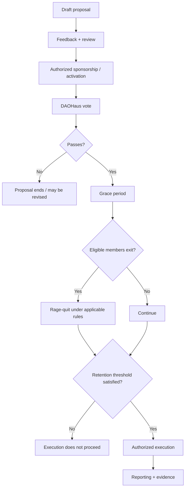
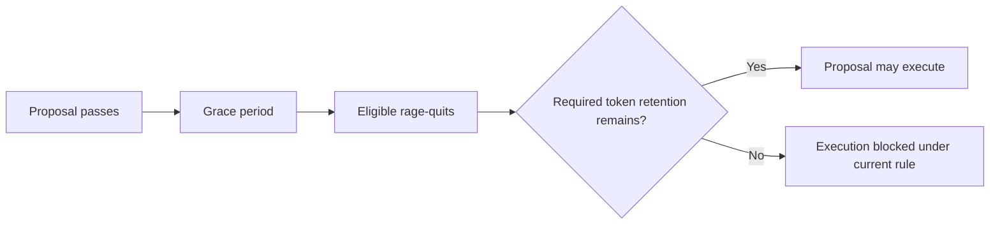

# Kokonut Moloch DAO is the live capital-governance system.

The Kokonut Moloch DAO is the part of the ecosystem responsible for **shared treasury capital, membership, DAO-level token issuance, funded commitments, and the protections attached to those decisions**.

It is deployed on **Gnosis Chain** through the Moloch / DAOHaus model.

Its job is important but deliberately narrow.

The Moloch DAO can decide whether shared treasury capital should fund a farm, bounty, partnership, or other proposal.

It does **not** automatically decide:

- when a farmer should irrigate;
- whether an ecological claim is scientifically valid;
- how a Guild should evaluate domain expertise;
- which crop belongs on a specific farm;
- whether an MRV record is methodologically sufficient;
- how every shared technical or Framework detail should be implemented.

> **Moloch governs shared capital and DAO-level rights. It does not govern every form of knowledge, work, or local execution in Kokonut.**

<CardGroup cols={2}>
  <Card title="Open the DAO" icon="building-columns" href="https://link.kokonut.network/dao">
    Inspect current proposals, membership, and DAO state through the live DAOHaus surface.
  </Card>

  <Card title="Inspect the treasury" icon="coins" href="https://link.kokonut.network/treasury">
    Review the current treasury rather than relying on static documentation for balances or asset state.
  </Card>

  <Card title="Understand the architecture" icon="layer-group" href="/ecosystem-wiki/the-kokonut-dao/dao-layers">
    See how capital governance fits alongside Guilds, farm operators, the Framework, MRV, and technical execution.
  </Card>

  <Card title="Review the governance process" icon="scale-balanced" href="/ecosystem-wiki/the-kokonut-dao/governance-framework">
    See how proposals move from drafting and review into voting, grace, execution, and reporting.
  </Card>
</CardGroup>

<Info>
  **Capital participation is only one path into Kokonut.** Contributors can begin through useful work and Guild coordination without tributing capital or holding \$vKKN.
</Info>

---

## What this DAO governs

| In scope | Why it belongs here |
| --- | --- |
| **Membership proposals** | Membership changes DAO voting power and treasury participation |
| **Treasury allocation** | Shared capital should move through reviewable DAO authorization |
| **Farm funding** | Material deployment of DAO capital requires treasury approval |
| **Funded Guild work** | Guilds define domain work; Moloch authorizes shared treasury capital when required |
| **\$vKKN issuance** | Voting power is a DAO-level governance right |
| **Loot recognition** | Loot is awarded through the DAO proposal process under the current model |
| **Governance parameters** | Changes to DAO rules affect all capital-governance participants |
| **Treasury-level partnerships** | Commitments involving DAO capital or formal DAO authority require governance review |

### What remains outside direct Moloch authority

| Outside direct scope | Primary responsibility |
| --- | --- |
| Routine agronomy and field decisions | Farm operators |
| Contribution review and Guild-domain work | Guilds / relevant domain reviewers |
| Scientific or ecological claim validation | MRV / qualified reviewers |
| Shared methodology and schema stewardship | Framework + affected domain reviewers |
| Routine software implementation | Technical contributors within approved scope |
| Evidence publication and data-quality review | MRV / Kokonut Intelligence workflows |

<Note>
  A proposal can authorize **resources** for another domain without becoming the subject-matter authority over that domain.
</Note>

---

## DAO at a glance

| Question | Current documented answer |
| --- | --- |
| **Network** | Gnosis Chain, Chain ID `100` |
| **Governance framework** | Moloch v3 via DAOHaus |
| **Capital entry path** | Stablecoin tribute through an approved membership proposal |
| **Voting primitive** | \$vKKN — non-transferable; 1 \$vKKN = 1 vote |
| **Non-voting token** | Loot — non-transferable under the current docs |
| **Treasury protection** | Grace period + rage-quit + 66% token-retention rule under the current governance model |
| **Treasury wallet** | Main Treasury SAFE |
| **Contribution alternative** | Guild contribution path; no capital required to begin |
| **Current farm evidence** | Adelphi records through the Kokonut Hub |
| **Current-state verification** | DAOHaus, Gnosisscan, treasury view, and current governance records |

<Warning>
  **Static docs are not the source of truth for live balances, member percentages, tribute terms, or active proposals.** Verify current state through the live DAO, treasury, explorer, and proposal records before taking capital-governance action.
</Warning>

---

## Why Kokonut uses Moloch-style capital governance

The capital problem is different from the contribution problem.

A treasury participant needs to know:

- who can authorize funds;
- how voting power is created;
- how a proposal becomes executable;
- what happens after a proposal passes;
- whether dissenting members have an exit path;
- whether treasury activity is inspectable.

Moloch provides a contract-based structure for those questions.

<CardGroup cols={3}>
  <Card title="Proposal-based authority" icon="file-signature">
    Membership, token issuance, treasury actions, and other DAO-level commitments move through proposals rather than informal approval.
  </Card>

  <Card title="Inspectable execution" icon="magnifying-glass-chart">
    Contracts, treasury addresses, proposals, and transactions can be independently inspected on public infrastructure.
  </Card>

  <Card title="Exit protection" icon="door-open">
    Eligible members can use rage-quit under the applicable contract and governance rules rather than relying only on social permission to leave.
  </Card>
</CardGroup>

This does not eliminate risk.

It makes important capital-governance rules more explicit and inspectable.

---

## Live Gnosis deployment

The current public documentation identifies the following Gnosis Chain contracts.

### Token contracts

| Primitive | Address | Current documented role |
| --- | --- | --- |
| **\$vKKN** | [`0xc6b075ac3234a7ac729114b27370b552fa284690`](https://gnosisscan.io/token/0xc6b075ac3234a7ac729114b27370b552fa284690) | Non-transferable voting token. Minted through DAO-approved membership proposals. 1 token = 1 vote. |
| **Loot** | [`0x2508a11aee11ad545bae87cd42131c04613b2099`](https://gnosisscan.io/token/0x2508a11aee11ad545bae87cd42131c04613b2099) | Non-voting, non-transferable token used for DAO-recognized economic participation / contribution recognition under the current model. |

### Treasury and management contracts

| Component | Address | Current documented role |
| --- | --- | --- |
| **Vault & Token Manager** | [`0x8977c56e979f0d8b76afb5ad85549acd2e96422d`](https://gnosisscan.io/address/0x8977c56e979f0d8b76afb5ad85549acd2e96422d) | Token issuance and DAO smart-wallet operations through the proposal system |
| **Main Treasury SAFE** | [`0xeb55b75328a8dffd45bbf34b7e7efc431a179085`](https://gnosisscan.io/address/0xeb55b75328a8dffd45bbf34b7e7efc431a179085) | Receives tribute and supports DAO-authorized disbursement and rage-quit-related treasury flows |

### Network references

| Field | Value |
| --- | --- |
| Chain | Gnosis Chain |
| Chain ID | `100` |
| RPC | `https://rpc.gnosischain.com` |
| Explorer | [Gnosisscan](https://gnosisscan.io) |
| DAO interface | [DAOHaus](https://link.kokonut.network/dao) |
| Treasury view | [Kokonut Treasury](https://link.kokonut.network/treasury) |

<Info>
  Contract addresses are useful durable references. **Balances, token supply, member distribution, active proposals, and treasury contents are live state** and should be read from current network data.
</Info>

---

## \$vKKN — voting power, not ownership of the farm

\$vKKN is the current Moloch voting primitive.

Under the current documentation:

- it is non-transferable / soulbound;
- it is minted through approved DAO proposals;
- 1 \$vKKN = 1 DAO vote;
- it participates in the applicable Moloch treasury and rage-quit model.

The current Kokonut model also relates \$vKKN issuance to coconut trees.

That relationship should be interpreted narrowly.

<Warning>
  **\$vKKN does not by itself establish legal title to land, ownership of an individual tree, farm-management authority, a guaranteed financial return, or a right to control local agricultural decisions.** Those concepts require their own legal, operational, and economic arrangements.
</Warning>

The safest description is:

> **\$vKKN is a non-transferable governance token whose issuance is connected to Kokonut's coconut-tree-based coordination model.**

---

## Loot — recognition without Moloch voting power

Loot is documented as the non-voting token primitive.

Under the current model, Loot can be used to recognize value contributed by actors such as:

- contributors;
- land partners;
- Core Team contributors;
- ecosystem partners;
- other approved participants.

Loot differs from \$vKKN because it does **not** grant Moloch voting power.

| Primitive | Moloch voting | Transferability under current docs | Issuance path |
| --- | --- | --- | --- |
| **\$vKKN** | Yes | Non-transferable | Approved DAO proposal, typically tied to capital membership |
| **Loot** | No | Non-transferable | Approved DAO proposal for recognized participation / contribution |
| **Guild Points** | No Moloch voting | Developing contribution reputation | Guild contribution and review workflows |

<Note>
  Guild Points are still developing. A contribution does not automatically create Guild Points, Loot, payment, or DAO rights. Loot recognition remains subject to the applicable Moloch proposal process.
</Note>

---

## Membership is a proposal, not a token purchase

The capital path begins with a **membership proposal**.

A prospective member proposes:

- a stablecoin tribute;
- the requested \$vKKN amount;
- the information required by the current governance process.

If the proposal passes and reaches execution, the approved membership action is carried out according to the live DAO rules.

<Steps>
  <Step title="1. Inspect current state" icon="magnifying-glass" iconType="regular">
    Review the live DAO, treasury, current proposal parameters, token state, and recent governance activity before deciding whether the capital path is appropriate.
  </Step>

  <Step title="2. Prepare a membership proposal" icon="file-pen" iconType="regular">
    Define the stablecoin tribute and requested \$vKKN according to the current membership process.
  </Step>

  <Step title="3. Draft and review" icon="comments" iconType="regular">
    Use the current Kokonut governance process for drafting, feedback, and proposal preparation before the binding on-chain stage.
  </Step>

  <Step title="4. Move to DAOHaus voting" icon="check-to-slot" iconType="regular">
    Eligible \$vKKN holders vote using the current DAO parameters. One \$vKKN carries one vote under the documented model.
  </Step>

  <Step title="5. Grace and retention checks" icon="hourglass-half" iconType="regular">
    A passed on-chain proposal moves through the applicable grace period and token-retention protections before execution.
  </Step>

  <Step title="6. Execute approved membership" icon="gears" iconType="regular">
    If all execution conditions are satisfied, the approved tribute and token issuance are processed through the DAO.
  </Step>
</Steps>

<Info>
  **Membership terms can change.** Do not hard-code a tribute rate, member percentage, or other live parameter from this documentation into a financial decision. Verify the active proposal and DAO state.
</Info>

---

## Current proposal timing documented by the Governance Framework

The current [Governance Framework](/ecosystem-wiki/the-kokonut-dao/governance-framework) documents:

| Stage | Current documented baseline |
| --- | --- |
| Draft / feedback | Minimum **5 days** |
| Active voting | **5 days** |
| Grace | Opens after a passing on-chain vote |
| Retention protection | **66%** token-retention threshold before execution |
| Membership quorum | Documented as **0% by design** for onboarding proposals |

These are governance parameters and policy descriptions, not immutable laws of the ecosystem.

Before submitting or evaluating a live proposal, verify the current rules.

---

## Proposal lifecycle

```mermaid
flowchart TD
    A["Draft proposal"] --> B["Feedback + review"]
    B --> C["Authorized sponsorship / activation"]
    C --> D["DAOHaus vote"]
    D --> E{"Passes?"}

    E -->|"No"| F["Proposal ends / may be revised"]
    E -->|"Yes"| G["Grace period"]

    G --> H{"Eligible members exit?"}
    H -->|"Yes"| I["Rage-quit under applicable rules"]
    H -->|"No"| J["Continue"]

    I --> K{"Retention threshold satisfied?"}
    J --> K

    K -->|"No"| L["Execution does not proceed"]
    K -->|"Yes"| M["Authorized execution"]

    M --> N["Reporting + evidence"]
```

The Governance Framework is the canonical process page.

This Moloch page focuses on the capital and contract mechanics underneath that process.

---

## Rage-quit — an exit mechanism, not a return guarantee

Rage-quit is one of the core protections in the current Moloch model.

Its purpose is to let eligible token holders exit according to the applicable treasury and contract rules instead of remaining trapped in a governance direction they strongly oppose.

### Current documented mechanics

| Question | Current documented answer |
| --- | --- |
| **What triggers the decision to rage-quit?** | The eligible member chooses to exit under the applicable Moloch rules |
| **When is it especially relevant?** | During the grace period after a proposal passes and before execution |
| **What happens to eligible tokens?** | They are burned as part of the exit process under the documented model |
| **What does the member receive?** | A proportional share of rage-quit-enabled / eligible treasury assets under the applicable contract rules |
| **What happens to proposal execution?** | The current model checks whether the 66% retention requirement remains satisfied |

<Warning>
  **Rage-quit is not a guarantee that a member recovers their original contribution or a particular dollar value.** Treasury composition, eligible assets, token supply, contract behavior, transaction conditions, and other factors affect the actual exit result.
</Warning>

### Retention protection

The current governance documentation uses a **66% token-retention threshold**.

Conceptually:

```mermaid
flowchart LR
    A["Proposal passes"] --> B["Grace period"]
    B --> C["Eligible rage-quits"]
    C --> D{"Required token retention remains?"}
    D -->|"Yes"| E["Proposal may execute"]
    D -->|"No"| F["Execution blocked under current rule"]
```

The live DAO and contracts should be treated as authoritative for an actual transaction.

---

## Treasury authority and the Core Team

The current architecture is designed so the Core Team does not have unilateral authority over the **DAO treasury**.

That is a narrower and more defensible claim than saying no trusted role exists anywhere in the ecosystem.

For the DAO treasury:

- treasury actions are intended to flow through approved governance;
- token issuance is tied to DAO authorization;
- DAO-level execution is inspectable;
- the Main Treasury SAFE is documented as part of the proposal-execution architecture.

This does not imply that every Kokonut operational wallet, software service, farm account, legal entity, or off-chain process is controlled by Moloch governance.

> **The Moloch DAO protects shared DAO capital. It does not turn every Kokonut asset or operational process into DAO property.**

---

## Governance power should be read from live state

The previous version of this page included static percentages for:

- all DAO members;
- the Core Team;
- the summoner wallet.

Those values can change as membership and supply change.

This page therefore no longer treats a fixed percentage snapshot as permanent architecture.

To evaluate current governance concentration, inspect:

1. current \$vKKN supply;
2. current holder balances;
3. active and historical proposal participation;
4. current member list;
5. any relevant token minting or burning since the last documentation update.

<Card title="Inspect current DAO membership" icon="users" href="https://link.kokonut.network/members">
  Use current membership data rather than an old percentage table when evaluating voting-power distribution.
</Card>

---

## What \$vKKN holders can do

Holding \$vKKN currently provides Moloch governance power, but the scope of that power matters.

| Capability | Scope |
| --- | --- |
| **Vote on eligible DAO proposals** | Treasury, membership, token, governance, and other Moloch-scoped decisions |
| **Participate in proposal sponsorship where eligible** | Move qualified proposals through the DAO process |
| **Use applicable rage-quit protections** | Exit under the current Moloch / treasury rules |
| **Author proposals** | Anyone can help prepare proposals; activation/sponsorship follows the current governance rules |
| **Inspect treasury and governance state** | Public on-chain and DAO interfaces |
| **Review farm evidence** | Public farm data can inform a vote, but token ownership does not make the holder the scientific or agronomic authority |

### \$vKKN does not automatically grant

- ownership of Adelphi or other farm land;
- authority over local farm operators;
- scientific-review authority;
- Guild reputation;
- employment or contributor status;
- guaranteed economic returns;
- control over off-chain entities or assets outside DAO scope.

---

## Capital path vs. contribution path

| | Capital path | Contribution path |
| --- | --- | --- |
| **Starts with** | Stablecoin tribute + membership proposal | Useful work |
| **Primary system** | Moloch DAO | Guilds / contribution workflows |
| **Governance result** | \$vKKN voting power if approved | Domain standing / recognition as applicable |
| **Capital required to begin** | Yes | No |
| **Guild Points** | Not created by holding \$vKKN | Developing contribution-reputation mechanism |
| **Loot** | Separate non-voting primitive | Significant contribution may become eligible for a Loot proposal |
| **Farm authority** | Not granted by token ownership | Not granted merely by contribution either; depends on actual farm role |

> **Capital can help fund the work. Contribution can help do the work. Neither automatically replaces local operators or domain expertise.**

---

## Risks and boundaries

Moloch governance creates protections, not certainty.

| Risk / boundary | What to understand |
| --- | --- |
| **Governance risk** | Members can approve or reject proposals you disagree with |
| **Treasury risk** | Stablecoins and treasury infrastructure still carry asset, protocol, custody, and smart-contract risk |
| **Execution risk** | A funded proposal can fail operationally even after correct governance approval |
| **Farm risk** | Weather, pests, market access, labor, infrastructure, and execution can affect real-world outcomes |
| **Model risk** | Forecasts and impact projections are not guaranteed actuals |
| **Smart-contract risk** | Auditable code is not the same as risk-free code |
| **Rage-quit limitation** | Exit mechanics do not guarantee recovery of the original contribution value |
| **Authority boundary** | A DAO vote cannot make a scientific claim true or an agronomic decision correct |

<Warning>
  This documentation explains the current Kokonut governance model. It is not legal, tax, investment, or financial advice and is not an offer of securities or a guarantee of economic outcomes.
</Warning>

---

## Static architecture vs. live state

Use this distinction whenever evaluating the DAO.

### Relatively durable architecture

- Gnosis Chain deployment;
- contract addresses unless upgraded/replaced;
- proposal-based token issuance;
- \$vKKN as the voting primitive under current docs;
- Loot as non-voting under current docs;
- the separation between Moloch capital governance and Guild contribution;
- the existence of rage-quit mechanics in the current design.

### Live / changeable state

- treasury balances;
- member count;
- holder percentages;
- active proposals;
- tribute amounts;
- token supply;
- proposal parameters;
- recent votes;
- current assets;
- current implementation status.

This distinction makes the documentation more useful without pretending a snapshot is permanent.

---

## What is live and what is still evolving

| Component | Status | Current role |
| --- | --- | --- |
| **Moloch DAO** | **Live** | Capital membership, treasury governance, proposals, execution rules |
| **\$vKKN** | **Live under current docs** | Non-transferable voting primitive |
| **Loot** | **Live under current docs** | Non-voting recognition / economic-participation primitive |
| **Main Treasury SAFE** | **Live** | DAO treasury and proposal-authorized treasury flows |
| **Rage-quit** | **Live under current Moloch model** | Exit mechanism for eligible token holders / assets |
| **DAOHaus interface** | **Live** | Member, proposal, and governance interaction surface |
| **Adelphi public farm data** | **Live** | Evidence that can inform treasury and farm-funding review |
| **Guild model** | **Active and evolving** | Contribution coordination outside the capital path |
| **Guild Points** | **Developing** | Contribution reputation rules and thresholds still maturing |
| **Agentic / AI governance support** | **Developing** | Drafting, analysis, and workflow support; not independent voting authority |

---

## Before using the capital path

<Steps>
  <Step title="Inspect the DAO" icon="building-columns" iconType="regular">
    Review current membership, proposals, and governance state through DAOHaus.
  </Step>

  <Step title="Inspect the treasury" icon="coins" iconType="regular">
    Understand which assets are currently held and which are eligible under the applicable exit rules.
  </Step>

  <Step title="Inspect the contracts" icon="file-contract" iconType="regular">
    Verify the current addresses and transaction history on Gnosisscan.
  </Step>

  <Step title="Read the governance framework" icon="scale-balanced" iconType="regular">
    Confirm current drafting, voting, grace, sponsorship, quorum, and retention rules.
  </Step>

  <Step title="Understand your authority boundary" icon="layer-group" iconType="regular">
    Moloch membership gives capital-governance rights. It does not make the member the operator, scientist, or steward for every other Kokonut domain.
  </Step>

  <Step title="Compare with the contribution path" icon="users" iconType="regular">
    If your main goal is to build, research, operate, document, or coordinate, Guild/Open Collaboration participation may be the more appropriate starting point.
  </Step>
</Steps>

---

## Continue through The Kokonut DAO

<CardGroup cols={2}>
  <Card title="DAO Architecture" icon="layer-group" href="/ecosystem-wiki/the-kokonut-dao/dao-layers">
    See how Moloch capital governance fits alongside Guilds, farms, the Framework, evidence, and technical execution.
  </Card>

  <Card title="Kokonut Guilds" icon="users" href="/ecosystem-wiki/the-kokonut-dao/kokonut-guilds-dao">
    Start through useful work rather than capital and understand the developing contribution-reputation system.
  </Card>

  <Card title="Governance Framework" icon="scale-balanced" href="/ecosystem-wiki/the-kokonut-dao/governance-framework">
    Review current proposal stages, sponsorship, voting venues, timing, grace, retention, execution, and reporting.
  </Card>

  <Card title="Proposal Templates" icon="file-pen" href="/ecosystem-wiki/the-kokonut-dao/proposal-templates">
    Prepare membership, farm-funding, Guild, Framework, partnership, and other governance proposals in a reviewable structure.
  </Card>

  <Card title="Build with Kokonut" icon="code" href="/build-with-kokonut">
    Inspect the current Gnosis contracts, DAO primitives, data schemas, and developer integration surfaces.
  </Card>

  <Card title="Open Collaboration" icon="telescope" href="/ecosystem-wiki/open-collaboration-invitation">
    Contribute without capital through documentation, governance review, research, software, MRV, finance, agronomy, or partnerships.
  </Card>
</CardGroup>

> **Moloch is strongest when it does one job well: make shared capital decisions explicit, inspectable, executable, and possible to exit—without pretending that capital governance should govern everything else.**
