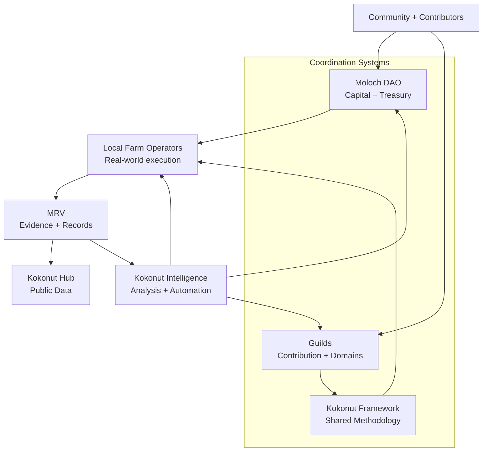

# Build regenerative farms with open coordination infrastructure.

Kokonut Network connects **locally operated regenerative farms** with community participation, capital governance, shared implementation standards, public evidence, and open-source intelligence.

Adelphi in the Dominican Republic is the first live reference implementation. The broader goal is to make each new farm easier to coordinate, measure, improve, and replicate without forcing every community into a single governance system.

<CardGroup cols={2}>
  <Card title="Explore Adelphi — live farm proof" icon="seedling" href="https://hub.kokonut.network/projects/41">
    Start with the real-world implementation: public farm records, MRV activity, harvest information, and project data.
  </Card>

  <Card title="Understand Kokonut" icon="book-open-reader" href="/ecosystem-wiki/kokonut-101/executive-summary">
    Learn how farms, governance, Guilds, the Framework, MRV, and open infrastructure fit together.
  </Card>
</CardGroup>

<Note>
  **Start with evidence, not promises.** Kokonut separates documented farm state, measured activity, forecasts, and developing infrastructure so readers can see what is live today and what is still being built.
</Note>

---

## Adelphi — the first live reference implementation

Adelphi is Kokonut Network's first live syntropic farm: a women-led, community-first agricultural project in Gonzalo, Monte Plata, Dominican Republic.

It is the place where Kokonut's governance, farm-development methodology, field operations, data structures, and MRV practices meet real land and real operators.

<CardGroup cols={4}>
  <Card title="15,725 m²" icon="map">
    Total mapped farm area documented for Adelphi.
  </Card>

  <Card title="13,838 m²" icon="seedling">
    Documented agricultural area within the site.
  </Card>

  <Card title="110 hens" icon="egg">
    Documented free-range poultry component.
  </Card>

  <Card title="Public Nouns #69" icon="hand-holding-heart">
    Public-goods funding supported the farm's development.
  </Card>
</CardGroup>

<Info>
  These are **documented reference values**, not a live dashboard. For current farm records, harvest activity, and MRV data, use the [Adelphi Data Hub](https://hub.kokonut.network/projects/41).
</Info>

<CardGroup cols={2}>
  <Card title="Read the Adelphi farm profile" icon="trees" href="/ecosystem-wiki/kokonut-farms/adelphi/summary">
    Explore the farm's crops, biodiversity, infrastructure, operators, MRV system, and documented development history.
  </Card>

  <Card title="Review crop and harvest forecasts" icon="chart-line" href="/ecosystem-wiki/kokonut-farms/adelphi/crops-and-harvest-forecast">
    See the assumptions behind projected lettuce, passion fruit, coconut, and poultry production instead of treating forecasts as achieved results.
  </Card>
</CardGroup>

---

## What Kokonut is building

Regenerative agriculture needs more than capital.

Farms also need coordination between land stewards, contributors, communities, technical systems, evidence standards, governance processes, and long-term operating knowledge.

Kokonut provides an **interoperable coordination layer** for those different responsibilities.

The ecosystem is intentionally not reduced to one DAO or one decision-making mechanism. Different forms of value and responsibility use different systems while remaining connected through shared standards and public evidence.

| Coordination layer | Primary responsibility |
| --- | --- |
| **Moloch DAO** | Capital membership, treasury proposals, voting, execution, and rage-quit protection |
| **Guilds** | Contribution coordination, domain decisions, reputation, bounties, and contributor pathways |
| **Kokonut Framework** | Shared implementation methodology, data structures, development phases, and impact logic |
| **Local farm operators** | Day-to-day agricultural decisions and real-world execution |
| **MRV** | Measurement, reporting, verification, and evidence quality |
| **Kokonut Hub** | Public project and farm records |
| **Kokonut Intelligence** | Data integration, analysis, synthesis, automation, and decision support |

> **The goal is interoperability, not uniformity.** Farms can share a common baseline for data, development phases, evidence, and coordination while adapting implementation to local ecology, operators, culture, markets, and regulation.

---

## Choose your path into Kokonut

<CardGroup cols={2}>
  <Card title="I'm new — start with the story" icon="book-open-reader" href="/ecosystem-wiki/kokonut-101/executive-summary">
    Understand why Kokonut exists, what problems it is trying to solve, and how the ecosystem fits together.
  </Card>

  <Card title="I want proof — inspect Adelphi" icon="magnifying-glass-chart" href="/ecosystem-wiki/kokonut-farms/adelphi/summary">
    Start with the live farm, then follow the links into crop records, MRV, infrastructure, forecasts, and SDG alignment.
  </Card>

  <Card title="I want to contribute" icon="telescope" href="/ecosystem-wiki/open-collaboration-invitation">
    Find contribution paths for agronomy, research, documentation, community coordination, data, governance, design, and software.
  </Card>

  <Card title="I want to understand governance" icon="scale-balanced" href="/ecosystem-wiki/the-kokonut-dao/dao-layers">
    See why Kokonut separates capital governance from contribution coordination and how the two systems interact.
  </Card>

  <Card title="I want to use the Framework" icon="puzzle" href="/kokonut-framework/Introduction">
    Learn the repeatable baseline for farm development, data, regenerative methodology, and impact measurement.
  </Card>

  <Card title="I want to build" icon="code" href="/build-with-kokonut">
    Explore public infrastructure, contracts, data structures, Kokonut Intelligence, agents, and developer workflows.
  </Card>
</CardGroup>

---

## How the regenerative loop works

<CardGroup cols={4}>
  <Card title="Coordinate" icon="people-group">
    Communities, contributors, farm operators, and capital participants coordinate through the system best suited to each responsibility.
  </Card>

  <Card title="Grow" icon="seedling">
    Local operators apply regenerative and syntropic practices using the Kokonut Framework as a shared implementation baseline.
  </Card>

  <Card title="Verify" icon="badge-check">
    Field records, satellite observations, drone imagery, soil data, harvest records, and attestations turn activity into inspectable evidence.
  </Card>

  <Card title="Improve" icon="arrows-rotate">
    Evidence informs farm operations, contributor work, governance decisions, reporting, and the next iteration of the Framework.
  </Card>
</CardGroup>

The system is designed so learning from one farm can improve the next without pretending every farm should be identical.

---

## Evidence before claims

Kokonut's public documentation is designed to make an important distinction:

<CardGroup cols={3}>
  <Card title="Documented state" icon="clipboard-check">
    What exists or has been recorded: land area, infrastructure, operators, planted systems, governance deployments, and farm records.
  </Card>

  <Card title="Measured activity" icon="chart-mixed">
    Observations and records collected through field logs, sensors, imagery, harvest records, GPS data, and public MRV workflows.
  </Card>

  <Card title="Forecasts and models" icon="calculator">
    Production, revenue, impact, or growth scenarios based on explicit assumptions. These should never be presented as achieved outcomes.
  </Card>
</CardGroup>

Adelphi's MRV documentation includes remote sensing with Landsat and Sentinel imagery, vegetation indices such as NDVI, NDRE, ReCI, and MSAVI, ground sensing, community observations, per-plant GPS records, and public data workflows.

<CardGroup cols={2}>
  <Card title="How Kokonut verifies farm activity" icon="badge-check" href="/ecosystem-wiki/kokonut-farms/measurement-reporting-and-verification">
    Review the MRV methodology, tools, evidence layers, and current limitations.
  </Card>

  <Card title="Inspect the live data surface" icon="chart-line" href="https://hub.kokonut.network/projects/41">
    Explore the public Adelphi records directly instead of relying only on narrative documentation.
  </Card>
</CardGroup>

---

## Governance designed for different kinds of participation

Kokonut uses complementary coordination systems because **capital and contribution require different protections**.

<CardGroup cols={2}>
  <Card title="Moloch DAO — capital governance" icon="building-columns" href="/ecosystem-wiki/the-kokonut-dao/kokonut-moloch-dao">
    Stablecoin contributors participate in treasury governance through proposals, voting, execution rules, and rage-quit protections.
  </Card>

  <Card title="Guilds — contribution governance" icon="users" href="/ecosystem-wiki/the-kokonut-dao/kokonut-guilds-dao">
    Builders, researchers, organizers, and operators can earn domain reputation through verified work without needing to enter through capital.
  </Card>
</CardGroup>

This separation prevents one coordination mechanism from being treated as the answer to every problem in a living ecosystem.

<Note>
  Treasury movements are governed through the deployed Moloch architecture and passed proposals. Contribution standing is coordinated through Guild-specific work and reputation. Local farm operations remain a real-world operating responsibility.
</Note>

---

## The open infrastructure behind the farms

Kokonut is not only a farm project. It is also building reusable public infrastructure around regenerative agriculture.

<CardGroup cols={2}>
  <Card title="Kokonut Framework" icon="puzzle" href="/kokonut-framework/Introduction">
    **Published methodology.** Shared farm-development phases, data structures, regenerative principles, impact methods, and implementation guidance.
  </Card>

  <Card title="Kokonut Intelligence" icon="brain-circuit" href="/kokonut-intelligence">
    **Active infrastructure.** Data integration, analytics, research, scoring, synthesis, reporting, and decision-support systems.
  </Card>

  <Card title="AI Agents" icon="robot" href="/kokonut-x-ai-agents">
    **Developing infrastructure.** Agent-assisted workflows for MRV, forecasting, reporting, analysis, and ecosystem operations.
  </Card>

  <Card title="Regenerative Finance Playbook" icon="recycle" href="/playbooks/regenerative-finance/summary">
    **Published playbook.** A practical guide to combining farm economics, regenerative design, governance, evidence, and open technical infrastructure.
  </Card>
</CardGroup>

---

## Built to reduce trust gaps

<CardGroup cols={3}>
  <Card title="Open documentation" icon="unlock">
    The Framework, governance mechanics, farm documentation, contribution paths, and technical architecture are publicly inspectable.
  </Card>

  <Card title="Governance protections" icon="shield-check">
    Capital governance uses proposals, treasury controls, grace periods, and rage-quit mechanisms rather than unilateral treasury movement.
  </Card>

  <Card title="Contribution without capital" icon="hand-holding-seedling">
    Contributors can participate through Guild work, public documentation, research, technical development, MRV, and other verified contributions.
  </Card>
</CardGroup>

<Info>
  Kokonut is designed so you can inspect the system before deciding how deeply to participate: read the docs, review farm data, examine governance, explore the repositories, or contribute useful work first.
</Info>

---

## See the vision

<iframe
  src="https://www.youtube.com/embed/ZjygLVUSq4s"
  title="Kokonut Network — Vision"
  frameBorder="0"
  className="w-full aspect-video rounded-xl"
  loading="lazy"
  allow="accelerometer; autoplay; clipboard-write; encrypted-media; gyroscope; picture-in-picture; web-share"
  allowFullScreen
/>

---

## Join and contribute

<Steps>
  <Step title="Explore before committing" icon="magnifying-glass" iconType="regular">
    Start with the [Kokonut 101 overview](/ecosystem-wiki/kokonut-101/executive-summary), [Adelphi](/ecosystem-wiki/kokonut-farms/adelphi/summary), and the [live Data Hub](https://hub.kokonut.network/projects/41).
  </Step>

  <Step title="Choose a contribution path" icon="telescope" iconType="regular">
    Agronomists, researchers, developers, designers, community organizers, data contributors, governance participants, and capital allocators all have different entry points. See the [Open Collaboration Invitation](/ecosystem-wiki/open-collaboration-invitation).
  </Step>

  <Step title="Join the community" icon="discord" iconType="regular">
    Join the [Kokonut Discord](https://link.kokonut.network/discord) to meet contributors and follow active coordination.
  </Step>

  <Step title="Build in public" icon="code-branch" iconType="regular">
    Improve the documentation, Framework, data systems, or developer infrastructure through the [Kokonut Public Site repository](https://github.com/wasalo/Kokonut-Public-Site) and related open repositories.
  </Step>

  <Step title="Talk with the team" icon="calendar" iconType="regular">
    Partners, funders, farm operators, and serious contributors can [book a walkthrough](https://link.kokonut.network/meeting) to discuss the DAO, Adelphi, the Framework, and future farm replication.
  </Step>
</Steps>

---

## Where to go next

<CardGroup cols={2}>
  <Card title="Understand Kokonut" icon="book-open-reader" href="/ecosystem-wiki/kokonut-101/executive-summary">
    Start with the mission, architecture, live proof, and ecosystem model.
  </Card>

  <Card title="Explore Adelphi" icon="seedling" href="/ecosystem-wiki/kokonut-farms/adelphi/summary">
    See the first live farm implementation in detail.
  </Card>

  <Card title="Explore the Framework" icon="puzzle" href="/kokonut-framework/Introduction">
    Learn how the shared regenerative-agriculture methodology works.
  </Card>

  <Card title="Build with Kokonut" icon="code" href="/build-with-kokonut">
    Use the open technical infrastructure, data models, contracts, intelligence layer, and agent architecture.
  </Card>
</CardGroup>

> **Kokonut grows through participation, evidence, and iteration.** The farm is real, the infrastructure is open, and the methodology improves as more people contribute what they know.
