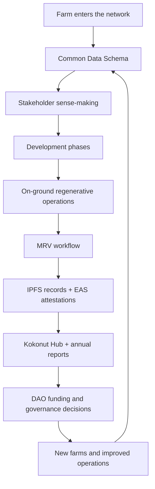

# The Kokonut Framework turns regenerative farms into verifiable community assets.

The Kokonut Framework is the operating system behind Kokonut Network. It gives every farm a shared structure for onboarding, governance, operations, MRV, impact reporting, and capital allocation.

Without the Framework, every new farm has to invent its own coordination logic. DAO members cannot compare funding proposals. Impact claims stay self-reported. Farm data cannot be aggregated across sites. Contributors do not know where their work fits.

The Framework solves this by making farms **comparable, fundable, governable, and verifiable** under one shared system — while still allowing each farm to adapt to its own land, crops, community, and market.

  <a href="#how-the-framework-works" style={{ display: "inline-flex", alignItems: "center", gap: "6px", background: "#009F4D", color: "#fff", padding: "10px 20px", borderRadius: "8px", fontWeight: "600", fontSize: "14px", textDecoration: "none" }}>
    See How It Works →
  </a>

  <a href="/ecosystem-wiki/kokonut-farms/adelphi/summary" style={{ display: "inline-flex", alignItems: "center", gap: "6px", border: "1.5px solid #009F4D", color: "#009F4D", padding: "10px 20px", borderRadius: "8px", fontWeight: "600", fontSize: "14px", textDecoration: "none", background: "transparent" }}>
    See It at Adelphi
  </a>

  Built for farm founders, DAO members, contributors, researchers, grant reviewers, capital allocators, and builders who need regenerative agriculture to be measurable and repeatable.

  

    
13

    
Common Data Schema fields

  

  

    
4

    
farm development phases

  

  

    
5

    
regeneration principles

  

  

    
8

    
forms of capital

  

  

    
MRV

    
public impact evidence

  

  

    
EAS

    
on-chain attestations

  

<Note>
  The Framework is open source at [wasalo/kokonut-framework](https://github.com/wasalo/kokonut-framework) and is already deployed through [Adelphi](/ecosystem-wiki/kokonut-farms/adelphi/summary), Kokonut Network's first live syntropic farm in Monte Plata, Dominican Republic.
</Note>

---

## What the Framework does

The Framework is not a single document, scorecard, token, or smart contract. It is a coordination system that connects farm reality to governance decisions and verifiable records.

| What it standardizes | Why it matters | Where to go deeper |
| --- | --- | --- |
| Farm onboarding | Every farm enters the network with comparable baseline data | [Common Data Schema](/kokonut-framework/framework-components/common-data-schema) |
| Farm development | Farms move through shared phases instead of ad hoc milestones | [Development Phases](/kokonut-framework/development-phases/phase-i) |
| Regenerative practice | Operators have clear ecological principles to follow | [5 Principles of Regeneration](/kokonut-framework/framework-components/framework-features/5-principles-of-regeneration) |
| Impact measurement | Farm claims become evidence instead of marketing | [MRV Methodology](/ecosystem-wiki/kokonut-farms/measurement-reporting-and-verification) |
| Value accounting | Natural, social, financial, and cultural values can be tracked together | [8 Forms of Capital](/kokonut-framework/framework-components/framework-features/8-forms-of-capital) |
| Governance decisions | DAO members can evaluate farms using shared information | [DAO Architecture](/ecosystem-wiki/the-kokonut-dao/dao-layers) |

<Warning>
  The Framework makes farms more legible and comparable. It does not eliminate agricultural, market, governance, weather, or execution risk. Those risks must be measured, reported, and improved through MRV and governance review.
</Warning>

---

## Who the Framework is for

<CardGroup cols={3}>
  <Card title="Farm founders" icon="seedling">
    Use the Framework to document land, crop plans, governance needs, revenue assumptions, public goods allocation, and MRV commitments before requesting support.
  </Card>

  <Card title="DAO members" icon="check-to-slot">
    Use the Framework to compare farm proposals, evaluate milestones, review risks, and decide whether treasury support is justified.
  </Card>

  <Card title="Contributors and Guilds" icon="people-group">
    Use the Framework to understand what work is needed across technology, impact, finance, governance, communications, and partnerships.
  </Card>

  <Card title="Researchers and reviewers" icon="microscope">
    Use the Framework to inspect how farm activity maps to impact evidence, SDGs, ecological benefits, and risk scoring.
  </Card>

  <Card title="Developers and agents" icon="code">
    Use the Framework to build tools around common data fields, Farm Registry events, MRV payloads, EAS attestations, and dashboards.
  </Card>

  <Card title="Capital allocators" icon="coins">
    Use the Framework to understand how productive land, impact evidence, and governance reporting can become institutionally legible over time.
  </Card>
</CardGroup>

---

## How the Framework works

The loop matters because regeneration is not a one-time funding event. A farm needs ongoing feedback between land, people, data, capital, and governance.

The Framework gives Kokonut a shared way to ask:

- What is this farm trying to do?
- Who benefits from it?
- What evidence proves progress?
- What risks remain?
- What capital or support is needed next?
- What should the DAO learn before funding the next farm?

---

## The three Framework pillars

The Framework is organized into three operational pillars. Each pillar answers a different trust question.

| Pillar | Core question | Primary output |
| --- | --- | --- |
| Stakeholder Sense-Making | Can this farm be understood, compared, and governed? | Shared baseline data and legitimacy |
| On-Ground Solution Variables | Can this farm implement regenerative operations in its own context? | Farm-specific execution under shared standards |
| Operational Variables | Can farm activity become useful evidence for capital, governance, and institutional review? | MRV records, risk profiles, reports, and attestations |

### 1. Stakeholder Sense-Making

This is the entry point. Before capital moves, the network needs shared context.

Every farm begins with the [Common Data Schema](/kokonut-framework/framework-components/common-data-schema): 13 fields covering project date, land size, location, governance mechanism, revenue streams, token allocation, public goods allocation, and narrative context.

This schema acts as the minimum viable onboarding contract between a farm and the network. Once populated, a farm can be evaluated by DAO members, queried by the Data Hub, and prepared for on-chain attestation.

The pillar also maps the farm's needs and wants into the [Pillars of Value](/kokonut-framework/framework-components/pillars-of-value), helping the network understand what the project creates, who benefits, how much value is produced, what contribution is additional, what risk remains, and what public goods are funded.

<Tip>
  This pillar protects the network from vague proposals. It requires clarity early, before funding, operations, or impact claims begin.
</Tip>

### 2. On-Ground Solution Variables

This is where the Framework becomes site-specific without becoming chaotic.

Every farm has different land, crops, founders, water conditions, community needs, and market access. The Framework does not erase those differences. It gives them a shared reporting structure.

The same logic can govern:

- Adelphi in Monte Plata;
- a future Kokonut farm on another chain;
- a partner farm with a different crop mix;
- a community project with different governance needs.

Each farm can remain unique while still producing comparable outputs: land data, crop cycles, milestones, MRV records, governance reports, public goods allocation, and impact evidence.

<Tip>
  This is how Kokonut avoids one-off projects. The farm can adapt locally, while the network can still learn globally.
</Tip>

### 3. Operational Variables

This is where farm activity becomes capital-relevant evidence.

The Framework connects operations to the [MRV stack](/ecosystem-wiki/kokonut-farms/measurement-reporting-and-verification), the Farm Registry API, IPFS/Filecoin records, EAS attestations, annual reports, and public dashboards.

Operational data can include:

| Data type | Example evidence | Why it matters |
| --- | --- | --- |
| Farm events | Planting, harvest, infrastructure, training, field logs | Shows whether the farm is active |
| Ecological indicators | NDVI, NDRE, MSAVI, soil moisture, soil temperature, and electrical conductivity | Shows whether land conditions are changing |
| Harvest records | Crop cycle actuals, losses, sales, and forecast updates | Shows whether revenue assumptions are improving or failing |
| Community records | jobs, training sessions, local participation, public goods allocation | Shows whether community value is real |
| Attestations | EAS records tied to structured payloads | Makes evidence public, timestamped, and harder to alter |

<Tip>
  This pillar is what turns regenerative agriculture from a narrative into a reviewable evidence system.
</Tip>

---

## In practice: Adelphi

Adelphi is the first live proof of the Kokonut Framework.

It shows the full stack working on real land:

| Framework component | Adelphi implementation |
| --- | --- |
| Farm onboarding | Registered farm with land, founders, location, governance, crop, and public goods data |
| Development phases | Planning, production, regeneration, and continuous MRV operating as one farm lifecycle |
| Regenerative principles | Syntropic plots, biodiversity restoration, poultry integration, biochar, cover crops, and native species propagation |
| MRV workflow | Satellite monitoring, soil probes, field records, harvest data, and per-plant geospatial records |
| Public evidence | Data visible through the Kokonut Hub and tied to MRV reporting workflows |
| DAO coordination | Public goods funding, governance visibility, contributor routing, and future replication learning |

Adelphi matters because it makes the Framework inspectable. It is not only a theory about how regenerative farms could be coordinated. It is a working case where land, people, data, funding, and impact reporting are connected.

[Explore Adelphi →](/ecosystem-wiki/kokonut-farms/adelphi/summary)

---

## What the Framework helps prevent

The Framework exists because regenerative agriculture often fails at the coordination layer, not only the land layer.

| Failure mode | How the Framework responds |
| --- | --- |
| Every farm invents its own proposal format | Common Data Schema and proposal templates |
| Funders cannot compare projects | Shared fields, phases, risks, and milestones |
| Impact claims are vague | MRV workflow and public evidence records |
| Governance decisions depend on trust alone | DAO review, funding milestones, and verifiable reporting |
| Ecological work is disconnected from finance | Harvest actuals, risk profiles, and public goods allocation |
| Knowledge is trapped in one farm | Standardized documentation that future farms can reuse |

<Note>
  The Framework does not guarantee success. It creates the conditions for better decisions, better evidence, and better iteration.
</Note>

---

## What the Framework makes possible

<CardGroup cols={2}>
  <Card title="Comparable farms" icon="scale-balanced">
    DAO members can compare farms by using shared fields, phases, risks, metrics, and evidence, rather than relying on narrative alone.
  </Card>

  <Card title="Fundable proposals" icon="file-invoice-dollar">
    Farm proposals can include clear budgets, milestone gates, public goods allocation, MRV requirements, and reporting duties.
  </Card>

  <Card title="Governable operations" icon="check-to-slot">
    Farm progress can be evaluated against approved plans, contributor work, DAO proposals, and Framework standards.
  </Card>

  <Card title="Verifiable impact" icon="stamp">
    MRV records, IPFS/Filecoin storage, EAS attestations, and public dashboards make the impact easier to inspect.
  </Card>

  <Card title="Reusable intelligence" icon="brain-circuit">
    Standardized data provides a cleaner foundation for analysis, recommendations, alerts, and reporting for humans and AI agents.
  </Card>

  <Card title="Replication without copy-paste farming" icon="seedling">
    Future farms can reuse the coordination system while adapting to their own land, climate, crops, and community.
  </Card>
</CardGroup>

---

## How to use this section

If you are new to the Framework, start here:

<Steps>
  <Step title="Understand the farm onboarding standard" icon="database" iconType="regular">
    Read the [Common Data Schema](/kokonut-framework/framework-components/common-data-schema) to understand the 13 fields every farm must provide.
  </Step>
  <Step title="Understand the farm lifecycle" icon="timeline" iconType="regular">
    Read the [Development Phases](/kokonut-framework/development-phases/phase-i) to see how farms move from planning to production, consolidation, and continuous MRV.
  </Step>
  <Step title="Understand the regenerative practice layer" icon="hand-holding-seedling" iconType="regular">
    Read the [5 Principles of Regeneration](/kokonut-framework/framework-components/framework-features/5-principles-of-regeneration) to see the agronomic principles behind Kokonut farms.
  </Step>
  <Step title="Understand how value is measured" icon="chart-simple" iconType="regular">
    Read the [Pillars of Value](/kokonut-framework/framework-components/pillars-of-value) and [8 Forms of Capital](/kokonut-framework/framework-components/framework-features/8-forms-of-capital) to understand how Kokonut tracks more than financial returns.
  </Step>
  <Step title="Understand verification" icon="magnifying-glass-chart" iconType="regular">
    Read [Measurement, Reporting & Verification](/ecosystem-wiki/kokonut-farms/measurement-reporting-and-verification) to see how farm activity becomes public evidence.
  </Step>
</Steps>

---

## Navigate the Framework

<CardGroup cols={2}>
  <Card title="Common Data Schema" icon="database" href="/kokonut-framework/framework-components/common-data-schema">
    The 13 fields every farm must populate before it can be evaluated, compared, and tracked.
  </Card>

  <Card title="Pillars of Value" icon="square-poll-vertical" href="/kokonut-framework/framework-components/pillars-of-value">
    The value model behind Kokonut: What, Who, How Much, Contribution, Risk, and Public Goods.
  </Card>

  <Card title="5 Principles of Regeneration" icon="hand-holding-seedling" href="/kokonut-framework/framework-components/framework-features/5-principles-of-regeneration">
    The agronomic principles behind cover crops, biodiversity, animal integration, soil health, and perennial systems.
  </Card>

  <Card title="8 Forms of Capital" icon="water" href="/kokonut-framework/framework-components/framework-features/8-forms-of-capital">
    The broader capital model: Natural, Financial, Social, Human, Material, Intellectual, Cultural, and Health capital.
  </Card>

  <Card title="Development Phases" icon="hammer-brush" href="/kokonut-framework/development-phases/phase-i">
    The four-phase lifecycle follows from planning to production, consolidation, and continuous MRV.
  </Card>

  <Card title="MRV Methodology" icon="magnifying-glass-chart" href="/ecosystem-wiki/kokonut-farms/measurement-reporting-and-verification">
    How farm activity becomes structured payloads, public records, EAS attestations, and impact reports.
  </Card>

  <Card title="Adelphi Farm" icon="seedling" href="/ecosystem-wiki/kokonut-farms/adelphi/summary">
    The first live farm where the Framework is being applied, tested, measured, and improved.
  </Card>

  <Card title="Build With Kokonut" icon="code" href="/build-with-kokonut">
    Developer primitives for Farm Registry data, MRV events, attestations, and agent-ready infrastructure.
  </Card>
</CardGroup>

  <a href="/kokonut-framework/framework-components/common-data-schema" style={{ display: "inline-flex", alignItems: "center", gap: "6px", background: "#009F4D", color: "#fff", padding: "10px 20px", borderRadius: "8px", fontWeight: "600", fontSize: "14px", textDecoration: "none" }}>
    Start With the Common Data Schema →
  </a>

  <a href="/ecosystem-wiki/open-collaboration-invitation" style={{ display: "inline-flex", alignItems: "center", gap: "6px", border: "1.5px solid #009F4D", color: "#009F4D", padding: "10px 20px", borderRadius: "8px", fontWeight: "600", fontSize: "14px", textDecoration: "none", background: "transparent" }}>
    Help Improve the Framework
  </a>

