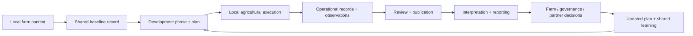

# The Kokonut Framework is the shared methodology behind Kokonut farms.

The Kokonut Framework gives farms a common baseline for:

- describing the farm and its context;
- planning development;
- applying regenerative principles;
- structuring value and impact questions;
- recording operational activity;
- producing reviewable evidence;
- learning across farms over time.

Its purpose is **not** to make every farm identical.

Its purpose is to make farms interoperable enough that local operators, contributors, reviewers, capital participants, researchers, and software systems can work from compatible information.

> **The goal is interoperability, not uniformity: shared structure where coordination benefits from it, local adaptation where land, people, markets, and regulation differ.**

<CardGroup cols={2}>
  <Card title="Start with the Common Data Schema" icon="database" href="/kokonut-framework/framework-components/common-data-schema">
    See the current 13-field baseline record used to describe a farm before deeper review, tooling, or comparison.
  </Card>

  <Card title="Follow the four development phases" icon="timeline" href="/kokonut-framework/development-phases/phase-i">
    Move from planning and preparation into production, consolidation, and continuous evidence-driven improvement.
  </Card>

  <Card title="See the Framework at Adelphi" icon="seedling" href="/ecosystem-wiki/kokonut-farms/adelphi/summary">
    Review Kokonut's first live reference farm and distinguish documented state, forecasts, operations, and evidence.
  </Card>

  <Card title="Understand the evidence layer" icon="magnifying-glass-chart" href="/ecosystem-wiki/kokonut-farms/measurement-reporting-and-verification">
    See how observations become structured records, review, publication, optional attestations, and interpretation.
  </Card>
</CardGroup>

<Info>
  **The Framework is methodology, not ownership or command authority.** It can define shared fields, phases, evidence expectations, and reusable methods without deciding every farm's crops, labor, land rights, operating choices, or local relationships.
</Info>

---

## The Framework in one sentence

> **Describe the farm consistently → plan through shared phases → operate locally → record what happened → review the evidence → learn and improve.**

That sequence is more durable than any particular tool, chain, dashboard, or governance mechanism.

```mermaid
flowchart LR
    A["Local farm context"] --> B["Shared baseline record"]
    B --> C["Development phase + plan"]
    C --> D["Local agricultural execution"]
    D --> E["Operational records + observations"]
    E --> F["Review + publication"]
    F --> G["Interpretation + reporting"]
    G --> H["Farm / governance / partner decisions"]
    H --> I["Updated plan + shared learning"]
    I --> C
```

The Framework connects those steps.

It does not collapse them into one authority.

---

## What the Framework standardizes — and what it does not

| The Framework can standardize | The Framework should not automatically standardize |
| --- | --- |
| Baseline farm fields and terminology | Land ownership or legal title |
| Development phases | Crop mix across every farm |
| Regenerative principles | Daily agronomic decisions |
| Evidence and reporting expectations | Local labor arrangements |
| Value-accounting categories | One universal revenue-sharing model |
| Shared claim vocabulary | Community priorities in every location |
| Compatibility across records and tools | One governance mechanism for every farm |
| Review and learning structures | One technology stack for every operator |

This boundary is central to the Framework.

A shared schema can make records compatible.

It does not make the farm a franchise.

A shared development phase can organize work.

It does not make every landscape move at the same speed.

A shared evidence standard can make a claim easier to inspect.

It does not make the claim automatically true.

---

## The current Framework building blocks

The Framework is easier to navigate through the components that are actually documented across this section.

| Building block | Current role | Go deeper |
| --- | --- | --- |
| **Common Data Schema** | 13-field baseline farm record | [Common Data Schema](/kokonut-framework/framework-components/common-data-schema) |
| **Development Phases** | Four-stage lifecycle for planning, production, consolidation, and continuous evidence/learning | [Phase I](/kokonut-framework/development-phases/phase-i) |
| **5 Principles of Regeneration** | Shared regenerative practice principles | [5 Principles](/kokonut-framework/framework-components/framework-features/5-principles-of-regeneration) |
| **Pillars of Value** | Six questions for understanding value, contribution, risk, and public goods | [Pillars of Value](/kokonut-framework/framework-components/pillars-of-value) |
| **8 Forms of Capital** | Broader value categories beyond financial capital | [8 Forms of Capital](/kokonut-framework/framework-components/framework-features/8-forms-of-capital) |
| **Positive-impact methodology** | Method for connecting activities, evidence, value categories, and claims | [Positive Impact](/kokonut-framework/framework-components/framework-features/methodology-positive-impact) |
| **SDG methodology** | Maps supported evidence to primary and secondary Sustainable Development Goals | [SDGs](/kokonut-framework/framework-features/Sustainable-Development-Goals) |
| **Ecological impact add-ons** | Additional ecological-benefit and risk interpretation tools | [Ecological Impact Frameworks](/kokonut-framework/framework-add-ons/ecological-impact-frameworks) |
| **MRV** | Evidence lifecycle shared with the farm and data layers | [MRV](/ecosystem-wiki/kokonut-farms/measurement-reporting-and-verification) |
| **Impact calculators** | Scenario and planning tools; outputs are not achieved impact | [Impact Calculator](/kokonut-framework/impact-calculator) |

<Note>
  The earlier standalone [`wasalo/kokonut-framework`](https://github.com/wasalo/kokonut-framework) repository is public but currently archived. Treat it as historical reference unless it is reactivated. This Knowledge Base is the current documentation surface for the Framework.
</Note>

---

## Four development phases organize the farm lifecycle

The Framework currently uses four development phases.

| Phase | Primary purpose | Typical evidence |
| --- | --- | --- |
| **I — Planning & Preparation** | Understand the site, operators, baseline, design, infrastructure needs, risks, and funding requirements | Site records, schema, plans, budgets, baseline evidence |
| **II — Production & Regeneration** | Put the farm system into operation | Planting, infrastructure, field activity, production records, MRV |
| **III — Consolidation & Expansion** | Improve operational reliability, markets, recurring systems, and farm capacity | Multi-cycle records, financial actuals, training, quality controls, expanded evidence |
| **IV — Continuous MRV & Improvement** | Maintain longitudinal evidence, compare plans with actuals, report, adapt, and learn | Repeated measurements, reports, variance analysis, review records |

Phase IV is not a finish line after which measurement stops.

Evidence and learning should continue throughout farm operations.

<CardGroup cols={2}>
  <Card title="Phase I" icon="map" href="/kokonut-framework/development-phases/phase-i">
    Planning & Preparation.
  </Card>

  <Card title="Phase II" icon="seedling" href="/kokonut-framework/development-phases/phase-ii">
    Production & Regeneration.
  </Card>

  <Card title="Phase III" icon="chart-line" href="/kokonut-framework/development-phases/phase-iii">
    Consolidation & Expansion.
  </Card>

  <Card title="Phase IV" icon="arrows-rotate" href="/kokonut-framework/development-phases/phase-iv">
    Continuous MRV, reporting, learning, and improvement.
  </Card>
</CardGroup>

---

## The Common Data Schema is the baseline — not the approval

The current Common Data Schema defines **13 required fields**.

Its purpose is to make a farm record structured enough for multiple actors and systems to work with it.

That can support:

- farm intake;
- proposal preparation;
- data ingestion;
- comparison;
- MRV linking;
- reporting;
- analysis;
- agent workflows.

It should not be interpreted as:

> “13 fields completed = farm approved, funded, verified, or investment-ready.”

Those are separate decisions.

A complete record can still contain:

- weak assumptions;
- unresolved legal questions;
- poor economics;
- insufficient evidence;
- operating risks;
- missing reviewer approval.

> **Structure makes a farm easier to inspect. It does not substitute for judgment.**

---

## Regenerative principles guide practice without becoming a recipe

The Framework documents five regenerative principles as the shared agricultural baseline.

They help organize practice around areas such as:

- soil cover and soil protection;
- biodiversity and diversity;
- perennial and multi-layer systems;
- animal integration where appropriate;
- on-site or biologically oriented inputs and nutrient cycling.

Those principles should guide design and review.

They should not be interpreted as evidence that a desired ecological outcome already occurred.

For example:

| Evidence level | Example |
| --- | --- |
| **Principle** | Maintain soil cover |
| **Implemented practice** | Mulch / living cover applied |
| **Measurement** | Repeated cover or soil observation |
| **Interpretation** | Evidence supports a claim about erosion or soil improvement |

The last step requires more than documenting the intention.

---

## Value frameworks help ask better questions

The Framework does not reduce farm value to revenue alone.

### Pillars of Value

The six Pillars of Value ask:

1. **WHAT** value is being created?
2. **WHO** experiences the value?
3. **HOW MUCH** changes?
4. **CONTRIBUTION** — what changed because of this intervention?
5. **RISK** — what may not happen or may not persist?
6. **PUBLIC GOODS** — what value extends beyond the immediate transaction?

These are analytical questions.

They do not automatically calculate or certify impact.

### 8 Forms of Capital

The Framework also uses eight capital categories:

- Natural;
- Financial;
- Social;
- Human;
- Material;
- Intellectual;
- Cultural;
- Health.

The purpose is to make different forms of value visible without pretending they are interchangeable.

A stronger financial result does not automatically compensate for ecological damage.

A biodiversity intervention does not automatically prove social benefit.

> **The Framework can hold multiple forms of value in the same analysis without declaring one form sovereign over all the others.**

---

## MRV supplies the evidence layer

The Framework and MRV are related but different.

**The Framework** defines shared structures, methods, phases, and interpretation tools.

**MRV** defines how operational observations become reviewable evidence.

The current MRV sequence is:

> **observe → structure → review → publish → attest when useful → interpret**

That means the Framework should not assume a fixed pipeline where every record must move through IPFS and EAS.

Different evidence may use different storage and publication paths.

EAS can add public provenance for significant records.

It does not turn a weak source record into scientific truth.

<Card title="Read the MRV evidence model" icon="magnifying-glass-chart" href="/ecosystem-wiki/kokonut-farms/measurement-reporting-and-verification">
  Review evidence classes, record lifecycle, forecast boundaries, attestation limits, remote sensing, and current maturity.
</Card>

---

## Kokonut Intelligence implements data infrastructure around the Framework

[Kokonut Intelligence](/kokonut-intelligence) is not the Framework itself.

It provides infrastructure that can operationalize Framework concepts through:

- canonical farm records;
- operational events;
- review states;
- analytics;
- forecasting;
- reports;
- scoring;
- EAS integration on Celo;
- agent-access workflows.

The distinction matters.

A methodology can remain valid even if a software implementation changes.

And a software score should not become a new methodology merely because it can be calculated.

| Layer | Question |
| --- | --- |
| **Framework** | What structures and methods should farms share? |
| **MRV** | How should evidence and claims be handled? |
| **Kokonut Intelligence** | How do we store, review, analyze, publish, and automate around those records? |
| **Kokonut Hub** | What published farm/project information can people inspect? |

---

## Governance uses the Framework — it does not own the Framework's subject matter

The Framework can make a farm proposal easier to evaluate.

That does not mean every Framework question belongs to the Moloch DAO.

Different decisions have different authorities.

| Decision | Primary responsibility |
| --- | --- |
| Shared DAO treasury capital | Moloch DAO |
| Routine farm operations | Local farm operators |
| Contribution work / domain review | Guilds and relevant reviewers |
| Shared Framework schema / methodology | Framework stewards + affected domain reviewers |
| Scientific / ecological claim review | Qualified evidence reviewers |
| Technical implementation | Technical contributors within approved scope |

A Moloch proposal may fund a Framework improvement.

That vote does not make token holders the scientific, agronomic, or technical authority over the content of the method.

[Read the DAO Architecture →](/ecosystem-wiki/the-kokonut-dao/dao-layers)

---

## Who uses the Framework

<CardGroup cols={2}>
  <Card title="Farm operators" icon="tractor">
    Use shared records and phases while preserving local judgment over crops, timing, water, labor, maintenance, and field response.
  </Card>

  <Card title="Contributors & Guilds" icon="users">
    Use the Framework to identify bounded work, domain dependencies, evidence needs, and reusable improvements.
  </Card>

  <Card title="Capital governance participants" icon="building-columns">
    Use compatible farm information to evaluate Moloch-scoped funding decisions without treating treasury voting as farm management.
  </Card>

  <Card title="Impact & research reviewers" icon="microscope">
    Use shared terminology, baselines, evidence classes, value frameworks, and reporting periods to evaluate claims.
  </Card>

  <Card title="Developers" icon="code">
    Use schemas and documented interfaces to build compatible data, MRV, analytics, and reporting tools.
  </Card>

  <Card title="Partners & grant reviewers" icon="handshake">
    Use structured records and evidence to understand what is documented, modeled, delivered, and still uncertain.
  </Card>
</CardGroup>

---

## Adelphi is the first live reference implementation

Adelphi is where the Framework has its clearest real-world reference.

It combines:

- locally operated land;
- farm-development phases;
- regenerative practice;
- crop and infrastructure systems;
- public-goods funding history;
- forecasts and actual records;
- MRV;
- Kokonut Hub publication;
- governance and contributor coordination.

That makes Adelphi useful for learning.

It does **not** make Adelphi a universal template.

<Warning>
  **Adelphi is a reference implementation, not proof of universal scalability.** Its crops, economics, community context, operators, biodiversity, infrastructure, and market conditions should not be copied blindly to another site.
</Warning>

[Explore Adelphi →](/ecosystem-wiki/kokonut-farms/adelphi/summary)

---

## Terra Viva is the next replication test

The current documentation identifies **Terra Viva** as the next major test of Framework portability.

Terra Viva is described as roughly **50,000 m² of adjacent land under agreement** entering:

**Phase I — Planning & Preparation**

That status matters.

Terra Viva is useful because it can help answer questions that Adelphi alone cannot:

- Which Framework fields transfer cleanly?
- Which methods need local adaptation?
- Which assumptions were specific to Adelphi?
- How should multi-farm comparison work?
- Which evidence can be normalized?
- Where does governance need to remain farm-specific?

It is **not yet evidence of successful multi-farm replication**.

---

## What the Framework can support — and what it cannot guarantee

| The Framework can support | It cannot guarantee |
| --- | --- |
| More comparable baseline records | Comparable farm outcomes |
| Better-structured funding requests | Funding approval |
| Clearer development milestones | Successful farm execution |
| Shared regenerative principles | Measured ecological improvement |
| More consistent evidence requirements | Scientific certification |
| Stronger forecast-vs-actual learning | Forecast accuracy |
| Reusable reporting structures | Impact |
| Cross-farm analysis | Identical local conditions |
| Better governance inputs | Good governance decisions |
| Agent-readable records | Correct autonomous decisions |

<Note>
  **The Framework reduces ambiguity. It does not remove uncertainty.**
</Note>

---

## Current maturity of the Framework

| Component | Current status | Interpretation |
| --- | --- | --- |
| **Framework documentation** | **Live and evolving** | Shared methods are documented and actively refined |
| **Common Data Schema** | **Active baseline** | Current 13-field structure; subject to compatibility-aware revision |
| **Four development phases** | **Active methodology** | Shared lifecycle model used across Framework documentation |
| **5 Principles of Regeneration** | **Active methodology** | Shared practice principles, not outcome guarantees |
| **Pillars of Value** | **Active analytical framework** | Helps structure value questions |
| **8 Forms of Capital** | **Active value taxonomy** | Organizes forms of value beyond finance |
| **Positive-impact methodology** | **Active and evolving** | Interpretation depends on evidence quality |
| **SDG methodology** | **Active and evolving** | Alignment and outcomes must remain distinct |
| **Ecological impact add-ons** | **Analytical / decision-support tooling** | Not external certification by themselves |
| **Impact calculators** | **Planning / scenario tools** | Outputs are modeled, not achieved impact |
| **Adelphi** | **Live reference implementation** | Strongest current real-world Framework example |
| **Terra Viva** | **Phase I / planning** | Next replication test, not an operating proof of scale |

---

## Framework principles for this documentation sprint

As the Framework pages are improved, they should preserve these rules.

1. **Interoperability, not uniformity.**
2. **Local operators retain local operating authority.**
3. **Shared structure does not equal automatic approval.**
4. **Implemented practice does not equal measured outcome.**
5. **Forecast does not equal actual.**
6. **Attestation does not equal scientific certification.**
7. **Framework methodology and software implementation remain distinguishable.**
8. **Governance authority stays scoped to the decision being made.**
9. **Public-goods and economic arrangements should follow the approved farm-specific arrangement rather than an unsupported universal rule.**
10. **Replication claims should grow only as multi-farm evidence grows.**

---

## Read the Framework in this order

<Steps>
  <Step title="1. Establish the baseline record" icon="database" iconType="regular">
    Read the [Common Data Schema](/kokonut-framework/framework-components/common-data-schema) to understand the current 13-field farm record and where its assumptions need evidence.
  </Step>

  <Step title="2. Understand value before scoring it" icon="square-poll-vertical" iconType="regular">
    Read the [Pillars of Value](/kokonut-framework/framework-components/pillars-of-value) to understand WHAT, WHO, HOW MUCH, CONTRIBUTION, RISK, and PUBLIC GOODS.
  </Step>

  <Step title="3. Understand regenerative practice" icon="hand-holding-seedling" iconType="regular">
    Read the [5 Principles of Regeneration](/kokonut-framework/framework-components/framework-features/5-principles-of-regeneration) and [Why Syntropic Farming](/kokonut-framework/why-syntropic-farming).
  </Step>

  <Step title="4. Expand the value model" icon="water" iconType="regular">
    Read the [8 Forms of Capital](/kokonut-framework/framework-components/framework-features/8-forms-of-capital).
  </Step>

  <Step title="5. Follow the farm lifecycle" icon="timeline" iconType="regular">
    Move through [Phase I](/kokonut-framework/development-phases/phase-i), Phase II, Phase III, and Phase IV.
  </Step>

  <Step title="6. Add impact interpretation carefully" icon="chart-network" iconType="regular">
    Read the [Positive-impact methodology](/kokonut-framework/framework-components/framework-features/methodology-positive-impact), [SDGs](/kokonut-framework/framework-features/Sustainable-Development-Goals), and [Ecological Impact Frameworks](/kokonut-framework/framework-add-ons/ecological-impact-frameworks).
  </Step>

  <Step title="7. Connect methodology to evidence and data" icon="magnifying-glass-chart" iconType="regular">
    Read [MRV](/ecosystem-wiki/kokonut-farms/measurement-reporting-and-verification), [Kokonut Intelligence](/kokonut-intelligence), and [Build with Kokonut](/build-with-kokonut).
  </Step>
</Steps>

---

## Navigate the Framework

<CardGroup cols={2}>
  <Card title="Common Data Schema" icon="database" href="/kokonut-framework/framework-components/common-data-schema">
    The current 13-field baseline farm record.
  </Card>

  <Card title="Pillars of Value" icon="square-poll-vertical" href="/kokonut-framework/framework-components/pillars-of-value">
    Six questions for value, contribution, risk, and public goods.
  </Card>

  <Card title="5 Principles of Regeneration" icon="hand-holding-seedling" href="/kokonut-framework/framework-components/framework-features/5-principles-of-regeneration">
    Shared regenerative practice principles.
  </Card>

  <Card title="8 Forms of Capital" icon="water" href="/kokonut-framework/framework-components/framework-features/8-forms-of-capital">
    Natural, Financial, Social, Human, Material, Intellectual, Cultural, and Health capital.
  </Card>

  <Card title="Development Phases" icon="timeline" href="/kokonut-framework/development-phases/phase-i">
    The four-stage farm-development lifecycle.
  </Card>

  <Card title="Positive-impact Methodology" icon="chart-line" href="/kokonut-framework/framework-components/framework-features/methodology-positive-impact">
    Connect activities and evidence to impact interpretation without skipping the evidence boundary.
  </Card>

  <Card title="Sustainable Development Goals" icon="chart-network" href="/kokonut-framework/framework-features/Sustainable-Development-Goals">
    Primary and secondary SDG mapping with evidence-aware claim levels.
  </Card>

  <Card title="Ecological Impact Frameworks" icon="leaf" href="/kokonut-framework/framework-add-ons/ecological-impact-frameworks">
    Additional ecological-benefit and risk interpretation tools.
  </Card>

  <Card title="Why Syntropic Farming" icon="seedling" href="/kokonut-framework/why-syntropic-farming">
    The agricultural logic behind Kokonut's syntropic and regenerative approach.
  </Card>

  <Card title="Impact Calculator" icon="calculator" href="/kokonut-framework/impact-calculator">
    Scenario planning for finance and impact; model outputs remain forecasts until actual evidence exists.
  </Card>

  <Card title="MRV Methodology" icon="magnifying-glass-chart" href="/ecosystem-wiki/kokonut-farms/measurement-reporting-and-verification">
    The evidence model that sits beside the Framework.
  </Card>

  <Card title="Adelphi" icon="seedling" href="/ecosystem-wiki/kokonut-farms/adelphi/summary">
    The first live reference implementation.
  </Card>
</CardGroup>

> **The Framework succeeds when the next farm can start with more shared knowledge and better coordination than the first one—without losing the local judgment that makes a farm real.**
