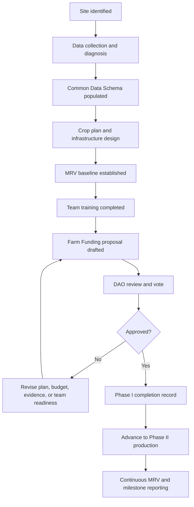

# Phase I turns a farm idea into a DAO-ready operating plan.

Phase I is the foundation of every Kokonut Framework farm. It is the stage where a site becomes legible: the land is mapped, the local problem is documented, the crop strategy is designed, the budget is prepared, the team is trained, and the MRV baseline is established before active production begins.

The purpose is simple: **do not deploy farm operations until the DAO, operators, contributors, and MRV stack can understand what is being funded and how progress will be verified.**

  <a href="#phase-i-readiness" style={{ display: "inline-flex", alignItems: "center", gap: "6px", background: "#009F4D", color: "#fff", padding: "10px 20px", borderRadius: "8px", fontWeight: "600", fontSize: "14px", textDecoration: "none" }}>
    Check Phase I Readiness →
  </a>

  <a href="/kokonut-framework/framework-components/common-data-schema" style={{ display: "inline-flex", alignItems: "center", gap: "6px", border: "1.5px solid #009F4D", color: "#009F4D", padding: "10px 20px", borderRadius: "8px", fontWeight: "600", fontSize: "14px", textDecoration: "none", background: "transparent" }}>
    See Common Data Schema
  </a>

  Use this page when preparing a farm funding proposal, reviewing a new farm, establishing an MRV baseline, or deciding whether a project is ready for Phase II.

  

    
13

    
schema fields

  

  

    
1

    
funding proposal

  

  

    
5

    
planning outputs

  

  

    
MRV

    
baseline

  

  

    
3–6

    
month target

  

<Warning>
  Phase I is not a formality. A farm with incomplete data, unclear local demand, missing budgets, untrained operators, or no MRV baseline should not be treated as ready for production funding.
</Warning>

---

## What Phase I produces

| Output | Why it matters | Where it is used next |
| --- | --- | --- |
| Complete farm record | Populates the 13 Common Data Schema fields that make the farm comparable and reviewable | Farm Registry, DAO review, Data Hub, agent workflows |
| Farm Funding Proposal | Turns the farm plan into a governance-ready Kokonut Development Proposal | Charmverse drafting and DAOHaus voting |
| MRV baseline | Establishes pre-production evidence for soil, imagery, biodiversity, site layout, and community context | MRV pipeline, EAS attestations, annual impact reporting |
| Crop and revenue plan | Defines short, medium, and long-cycle production assumptions | Harvest forecast, budget review, market strategy |
| Infrastructure plan | Defines what must be built before production can begin | Phase II milestone disbursements and operator planning |
| Training plan | Prepares the team to run syntropic farming, bio-inputs, MRV, and market operations | Human capital tracking and production readiness |

<Note>
  Phase I can include planning, assessment, proposal development, and readiness work. The key boundary is that active production and major operational milestones should not begin until the farm has enough data, training, infrastructure planning, funding approval, and MRV baseline records to be evaluated responsibly.
</Note>

---

## Phase I readiness loop

The loop protects the farm, the DAO, and the community. It forces assumptions to become records before they become spending decisions.

---

## The five Phase I workstreams

<Steps>
  <Step title="Data Collection and Diagnosis" icon="database">
    Phase I begins by documenting the farm site and its context: soil, climate, water, biodiversity, community needs, market access, and local economic conditions.

    **What to collect:**

    - **Soil:** texture, organic matter, pH, drainage, compaction, microbial activity, and initial probe readings
    - **Climate:** rainfall, temperature ranges, drought frequency, seasonal extremes, and planting windows
    - **Water:** surface water, groundwater, irrigation source quality, watershed position, and erosion risk
    - **Biodiversity:** existing trees, at-risk species, native species, pest pressure, and habitat conditions
    - **Economic context:** crop demand, local price benchmarks, buyers, distribution channels, and labor availability
    - **Community context:** who the farm serves, what problem it addresses, and how local participation will happen

    **Tools that can be used:**

    - Drone mapping for orthomosaic imagery and elevation models
    - QGIS for slope, drainage, boundary, and vegetation analysis
    - GPS registration for farm boundaries, trees, species, and production zones
    - Soil probes for baseline electrical conductivity, volumetric water content, temperature, and moisture conditions
    - Local interviews and market research for community demand and buyer validation

    **At Adelphi:** the team documented coordinates in Monte Plata, generated a 3D orthomap, established a species GeoNode, recorded native species, and used local climate and soil conditions as the basis for crop selection.

    **Schema fields started:** `project_date`, `project_location`, `land_size`, `forecasted_budget`, `local_problem`, `proposed_solution`.
  </Step>
  <Step title="Crop Selection" icon="seedling">
    Crop selection turns the diagnosis into a productive design. The goal is not to pick the most profitable crop in isolation; it is to design a syntropic system that produces food, builds soil, protects biodiversity, and generates revenue across multiple time horizons.

    **Selection criteria:**

    - **Agro-ecological fit:** crops match the farm's soil, rainfall, heat, water, slope, and disease conditions
    - **Syntropic compatibility:** crops occupy different strata and support each other across time
    - **Revenue timing:** short-cycle crops generate early cash flow while medium and long-cycle crops establish
    - **Biodiversity value:** species support pollinators, habitat, nitrogen cycling, pest balance, or native conservation
    - **Community and market demand:** crops have buyers, local use, or direct food-access value

    **At Adelphi:** lettuce was selected as a short-cycle cash-flow crop; passion fruit and Indian yam support medium-cycle production; coconut anchors the long-cycle model; native and at-risk fruit species extend biodiversity and nursery value.

    **Schema fields strengthened:** `revenue_streams`, `target_market`, `project_summary`.
  </Step>
  <Step title="Infrastructure Design" icon="hammer-brush">
    Infrastructure planning defines what must be in place before production can run safely and consistently. This includes both physical systems and evidence systems.

    **Core infrastructure planning areas:**

    - **Biofactory:** biochar production, humic acids, organic urea, composting, and other biological inputs
    - **Water and erosion management:** terraces, drainage, ground cover, irrigation, tanks, pumps, and water monitoring
    - **Energy and utilities:** electricity, lighting, tool storage, data collection equipment, and connectivity
    - **Poultry or animal integration:** housing, forage, manure handling, rotation plans, and animal welfare
    - **Community infrastructure:** training space, meeting area, visitor flow, and safety requirements
    - **MRV infrastructure:** soil probes, GPS records, data logging workflows, image baselines, and dashboard connections

    **At Adelphi,** Public Nouns Proposal #69 helped fund critical infrastructure, including the biofactory, poultry system, manure-processing station, education gazebo, and monitoring equipment.

    **MRV milestone:** pre-production baseline readings should be captured before soil amendments, crop planting, or infrastructure changes make later comparison difficult.
  </Step>
  <Step title="Personnel Training" icon="hand-holding-hand">
    A farm is not Phase II-ready until the operators understand the practices they are expected to run and the data they are expected to report.

    **Training curriculum:**

    - Syntropic planting, strata design, species interactions, and the 5 Principles of Regeneration
    - Biochar production, humic acid extraction, organic urea preparation, and safe input handling
    - Soil management, cover crop maintenance, erosion monitoring, and water retention practices
    - MRV logging, field observations, image capture, soil probe checks, and dashboard updates
    - Harvest handling, local pricing, market relationships, and public goods allocation reporting
    - Proposal accountability, milestone reporting, and community communication

    **At Adelphi:** Yanny and Neury Hernández and the farm team received training across regenerative production, bio-inputs, syntropic bed preparation, and field data logging.

    **Framework connection:** training is part of Human Capital and should be documented with attendance, role assignments, and, where possible, pre- and post-skill assessments.
  </Step>
  <Step title="Soil Preparation" icon="farm">
    Soil preparation is the first operational test of the farm's regenerative design. It should establish healthy beds without destroying the soil biology that the farm is trying to build.

    **Core preparation practices:**

    - **Biochar incorporation:** use locally appropriate biomass and controlled pyrolysis, then apply biochar based on crop-bed design and soil needs
    - **Organic fertility:** apply biological inputs such as compost, humic acids, organic urea, or other approved inputs
    - **Living cover:** establish ground cover and edge vegetation to prevent bare soil and erosion
    - **Minimal disturbance:** form beds without deep mechanical tillage when possible
    - **Baseline comparison:** record soil readings before and after preparation, so future changes can be evaluated

    **At Adelphi:** bamboo-derived biochar, beard grass cover, terraced edges, soil probe readings, and prepared crop beds established the amended baseline for Phase II.

    **MRV milestone:** post-preparation soil readings serve as the starting point for continuous Phase II measurements.
  </Step>
</Steps>

---

## Phase I readiness

Phase I is complete when the farm can answer five questions with evidence.

| Readiness question | Completion evidence |
| --- | --- |
| Is the farm legible? | All 13 Common Data Schema fields are complete and internally consistent |
| Is the proposal reviewable? | The farm Funding proposal is drafted, budgeted, and submitted for DAO review |
| Is the site measurable? | MRV baseline exists for soil, imagery, species, boundaries, and production zones |
| Is the production plan realistic? | Crop plan, infrastructure plan, market logic, and training plan are documented |
| Is the team prepared? | Operators are trained, roles are assigned, and reporting responsibilities are clear |

## Phase I completion checklist

| Criterion | How it should be verified |
| --- | --- |
| Common Data Schema complete | Farm Registry record accepted and reviewed |
| Farm Funding proposal drafted | Proposal created in the governance drafting workspace |
| DAO approval is obtained when funding is required | Proposal passes DAO voting, and the required execution steps are completed |
| MRV baseline established | Soil, imagery, species, and site records captured before production changes |
| Infrastructure plan approved | Biofactory, water, utility, poultry, community, and MRV needs documented |
| Training completed | Operator roles, training records, and MRV logging responsibilities confirmed |
| Soil preparation complete | Baseline and post-preparation readings recorded; beds and cover established |
| Phase II trigger defined | First production milestones and reporting cadence are clear |

<Warning>
  Do not mark Phase I complete just because the farm has a good story. Phase I is complete when the farm has enough structured data, operational planning, team readiness, and baseline evidence to move into production responsibly.
</Warning>

---

## What Phase I does not guarantee

Phase I reduces uncertainty, but it does not eliminate risk.

| Risk | What Phase I can do | What it cannot guarantee |
| --- | --- | --- |
| Agricultural risk | Test soil, water, crop fit, and site constraints | Perfect yields or no crop failure |
| Market risk | Validate target buyers and price assumptions | Stable prices or guaranteed sales |
| Execution risk | Train operators and assign responsibilities | Flawless operations after launch |
| Climate risk | Design for rainfall, erosion, drought, and water needs | Stable weather or no extreme events |
| Data risk | Establish MRV baseline and data workflows | Perfect data quality forever |
| Governance risk | Create a reviewable proposal | Automatic DAO approval |

This is why Phase I should be treated as a readiness gate, not a guarantee of success.

---

## Advancing to Phase II

Phase I completion triggers the transition into [Phase II — Production and Regeneration](/kokonut-framework/development-phases/phase-ii).

When Phase II begins, the farm moves from planning to active production: agro-ecological practices are implemented, short-cycle crops begin generating early harvest records, medium- and long-cycle crops are established, and MRV data begin to compound across crop cycles.

The farm status should be updated in the Farm Registry once all Phase I completion items have been verified. If the transition is recorded through EAS, the attestation should reference the baseline evidence, the proposal approval, and the checklist items used to justify the advancement.

<Note>
  MRV does not wait until the end of the farm lifecycle. It begins during Phase I with baseline evidence and continues through Phases II, III, and IV as the farm produces data, harvests, ecological observations, and public impact records.
</Note>

---

## Use Phase I when...

<CardGroup cols={3}>
  <Card title="Preparing a new farm" icon="seedling">
    Use Phase I to turn a promising site into a complete farm record, proposal, budget, crop plan, and MRV baseline.
  </Card>

  <Card title="Reviewing a proposal" icon="magnifying-glass-chart">
    Use Phase I to check whether the project is ready for DAO review or still missing evidence.
  </Card>

  <Card title="Setting MRV baselines" icon="satellite-dish">
    Use Phase I to capture pre-production records before planting, soil amendment, or infrastructure changes begin.
  </Card>

  <Card title="Training operators" icon="people-group">
    Use Phase I to confirm that the team understands syntropic farming, bio-inputs, harvest records, and field reporting.
  </Card>

  <Card title="Designing infrastructure" icon="hammer-brush">
    Use Phase I to decide what must be built before the farm can run production safely and consistently.
  </Card>

  <Card title="Preparing for Phase II" icon="arrow-right">
    Use Phase I as the gate that determines whether the farm is ready for production and regeneration work.
  </Card>
</CardGroup>

---

## Next steps

<CardGroup cols={2}>
  <Card title="Common Data Schema" icon="database" href="/kokonut-framework/framework-components/common-data-schema">
    The 13 required fields that make a farm record comparable, fundable, governable, and verifiable.
  </Card>

  <Card title="Farm Funding Proposal Template" icon="file-signature" href="/ecosystem-wiki/the-kokonut-dao/proposal-templates#farm-funding-proposal">
    The proposal format that turns Phase I outputs into a DAO-reviewable funding request.
  </Card>

  <Card title="Phase II — Production and Regeneration" icon="recycle" href="/kokonut-framework/development-phases/phase-ii">
    The production phase begins after Phase I completion criteria are met.
  </Card>

  <Card title="MRV — Measurement, Reporting, and Verification" icon="magnifying-glass-chart" href="/ecosystem-wiki/kokonut-farms/measurement-reporting-and-verification">
    How Phase I baselines become the beginning of Kokonut's evidence pipeline.
  </Card>

  <Card title="5 Principles of Regeneration" icon="hand-holding-seedling" href="/kokonut-framework/framework-components/framework-features/5-principles-of-regeneration">
    The regenerative practice logic that guides crop selection, soil preparation, and farm operations.
  </Card>

  <Card title="Adelphi Farm Summary" icon="location-dot" href="/ecosystem-wiki/kokonut-farms/adelphi/summary">
    See the first live Kokonut farm and how Phase I planning became active production.
  </Card>
</CardGroup>