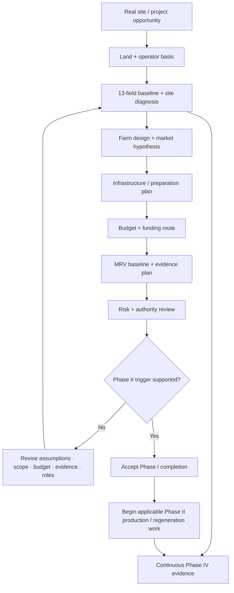

# Phase I turns a farm opportunity into a reviewable implementation plan.

**Phase I — Planning & Preparation** is where a Kokonut farm establishes enough shared context to move from intention into accountable execution.

It should answer:

- What land or operating right is involved?
- Who is responsible for day-to-day farm execution?
- What local problem and opportunity are being addressed?
- What is already known about the site?
- What production system is being proposed?
- What infrastructure and preparation are needed?
- What does the budget assume?
- Where will capital come from?
- Which decisions belong to local operators, funders, reviewers, or shared governance?
- What evidence must exist before stronger claims are made?
- What risks could make the plan fail?
- What specific conditions will trigger Phase II?

The goal is **not** to make every farm identical.

The goal is to make the farm legible enough that operators, reviewers, funders, contributors, software, and future partners can understand the same baseline without inventing missing facts.

> **Phase I is complete when the farm is ready to execute a defined next step responsibly — not when a calendar says enough time has passed.**

<CardGroup cols={2}>
  <Card title="Build the baseline record" icon="database" href="/kokonut-framework/framework-components/common-data-schema">
    Use the current 13-field Common Data Schema as the compatibility-sensitive farm descriptor.
  </Card>

  <Card title="Route authority correctly" icon="file-signature" href="/ecosystem-wiki/the-kokonut-dao/governance-framework">
    Separate local farm authority, capital authorization, evidence review, methodology, and technical execution.
  </Card>

  <Card title="Plan the evidence" icon="magnifying-glass-chart" href="/ecosystem-wiki/kokonut-farms/measurement-reporting-and-verification">
    Capture pre-intervention context before later activity makes comparison difficult.
  </Card>

  <Card title="Prepare a funding request when needed" icon="file-signature" href="/ecosystem-wiki/the-kokonut-dao/proposal-templates#farm-funding-proposal">
    Use a formal Farm Funding Proposal only when shared capital or another formal authorization is actually required.
  </Card>
</CardGroup>

<Warning>
  **Phase I is not automatic funding readiness.** A complete schema does not prove land rights, operator capacity, agronomic fit, legal compliance, buyer demand, financial viability, ecological benefit, or impact.
</Warning>

---

## Phase I at a glance

| Question | Phase I answer |
| --- | --- |
| **Main purpose** | Establish a reviewable baseline and implementation plan |
| **When it begins** | When a real site/project opportunity is identified and baseline work can begin |
| **When it ends** | When the applicable Phase II trigger is supported by evidence and accepted by the relevant authority/reviewers |
| **Fixed duration?** | **No.** Timing depends on land, design, funding, seasonality, permits, infrastructure, evidence, and operator readiness |
| **Does every farm need a Moloch vote?** | **No.** Moloch is required when the decision actually falls within Moloch authority, such as shared treasury capital |
| **Does every farm need the same practices?** | **No.** Shared outputs should be interoperable while implementation remains local |
| **Does MRV start here?** | **Yes.** Baselines and evidence design begin before production |
| **Does Phase IV wait until the end?** | **No.** Continuous evidence starts with Phase I baseline records and continues across the lifecycle |

---

## What Phase I should produce

A useful Phase I package normally contains the following outputs.

| Output | Purpose | Important boundary |
| --- | --- | --- |
| **Land / operating-basis record** | Shows what site is involved and the basis for using it | A Framework record is not legal title |
| **Local operator record** | Identifies who is responsible for routine farm execution | Funding governance does not replace local operator authority |
| **13-field baseline record** | Gives systems and reviewers a compatible farm descriptor | Schema completeness is not approval or verification |
| **Site diagnosis** | Documents material soil, water, terrain, climate, vegetation, infrastructure, market, and community context | Collect only what is relevant and supportable |
| **Farm / production design** | Defines proposed crops, timelines, regenerative practices, and operating logic | Design is a hypothesis until operations produce actuals |
| **Infrastructure & preparation plan** | Defines what needs to be built, repaired, procured, or prepared | Construction/preparation should have scope, budget, owner, and evidence |
| **Budget & funding route** | Makes cost, source, status, and assumptions visible | Forecast budget ≠ funds received or actual spend |
| **Market hypothesis** | States intended channels, buyers, price assumptions, and evidence | Target market ≠ buyer contract |
| **Operator capability / training plan** | Identifies required competencies and role responsibilities | Attendance alone does not prove competence |
| **MRV / evidence plan** | Defines baseline, records, methods, reviewers, and reporting periods | Not every record needs EAS/IPFS/on-chain publication |
| **Risk register** | Makes execution, climate, financial, data, legal, market, and social risks visible | Risk identification does not eliminate risk |
| **Authority / dependency map** | Shows which decisions/reviews are needed before execution | Not every decision belongs to Moloch |
| **Phase II trigger** | Defines the evidence required to begin production / regeneration work | Transition should be evidence-based, not date-based |

<Info>
  Phase I can include **real preparatory work** — mapping, surveying, repairs, site preparation, procurement, training, baseline sampling, infrastructure installation, or soil preparation — when that work is authorized, appropriately scoped, and recorded. The boundary is that the farm has not yet entered sustained production under the Phase II operating plan.
</Info>

---

## Phase I is a readiness loop, not a straight line

```mermaid
flowchart TD
    A["Real site / project opportunity"] --> B["Land + operator basis"]
    B --> C["13-field baseline + site diagnosis"]
    C --> D["Farm design + market hypothesis"]
    D --> E["Infrastructure / preparation plan"]
    E --> F["Budget + funding route"]
    F --> G["MRV baseline + evidence plan"]
    G --> H["Risk + authority review"]
    H --> I{"Phase II trigger supported?"}

    I -->|No| J["Revise assumptions · scope · budget · evidence · roles"]
    J --> C

    I -->|Yes| K["Accept Phase I completion"]
    K --> L["Begin applicable Phase II production / regeneration work"]

    C --> M["Continuous Phase IV evidence"]
    L --> M
```

This loop should be revisited whenever Phase I work reveals that:

- the land basis changed;
- an operator changed;
- the budget changed materially;
- the farm design is unsuitable;
- water or soil constraints are worse than expected;
- a buyer assumption failed;
- a permit or external dependency appeared;
- the evidence plan is insufficient;
- the funding route changed.

---

# Phase I workstreams

## 1. Establish the land and operating basis

Before discussing impact, funding, or crop forecasts, define the real-world operating context.

Document:

- site / project name;
- geographic context;
- land size and what that number means;
- mapped boundary where appropriate;
- owner / lessor / agreement counterparty where appropriate;
- owned / leased / agreement / other operating basis;
- relevant term or constraint;
- local operator(s);
- operator acknowledgment of the proposed plan;
- material access, easement, water, or infrastructure dependencies;
- sensitive information that should not be published publicly.

### Important distinction

> **A farm record describes the operating context. It does not create legal rights to the land.**

Where land rights or legal agreements matter, use the actual legal records and qualified review appropriate to the jurisdiction.

---

## 2. Build the 13-field baseline record

Use the [Common Data Schema](/kokonut-framework/framework-components/common-data-schema) to create a compatible baseline.

The current fields cover:

- date;
- location;
- land size;
- revenue streams;
- target markets;
- forecast budget;
- source of funding;
- public-goods allocation;
- governance/coordination context;
- token/economic narrative;
- project summary;
- local problem;
- proposed solution.

But Phase I should preserve the semantic boundaries already defined on the schema page.

Examples:

- `land_size` must state whether it means total mapped, agricultural, active production, or another basis;
- `forecasted_budget` is a forecast;
- `target_market` is a market hypothesis;
- `public_goods_allocation` can be a planning assumption rather than a realized transfer;
- `governance_mechanism` should not imply one actor governs the entire farm;
- `token_allocation` should not invent token rights when none apply.

> **Required field ≠ verified fact.**

Material values should point to supporting records.

---

## 3. Diagnose the site and operating context

The diagnosis should answer the questions that materially affect design and risk.

### Physical / ecological context

Depending on the farm:

- soil texture / condition;
- drainage;
- slope;
- erosion;
- water source and reliability;
- rainfall / seasonality;
- heat / storm / drought exposure;
- vegetation / land cover;
- existing trees / perennial systems;
- biodiversity observations;
- access / roads;
- existing infrastructure.

### Operating context

- available labor / operator capacity;
- local services;
- electricity / connectivity where relevant;
- tools / equipment;
- storage;
- security;
- logistics;
- market access.

### Social / community context

- who operates the farm;
- who may be affected;
- who may participate;
- local problem statement;
- community relationships;
- consent / privacy considerations;
- relevant public-benefit hypotheses.

### Evidence methods can include

- survey / cadastral / legal records where appropriate;
- GPS;
- drone / orthomosaic;
- QGIS or other GIS;
- field observation;
- soil probes;
- lab sampling where methodologically justified;
- photos;
- interviews;
- market research;
- public datasets;
- remote sensing.

<Note>
  Do not collect measurements merely because a tool is available. Collect evidence because it answers a material design, risk, baseline, or future-comparison question.
</Note>

---

## 4. Define the farm and production design

The farm design should connect local conditions to a realistic operating hypothesis.

It can include:

- short-, medium-, and long-cycle crops;
- perennial / agroforestry systems;
- syntropic design where appropriate;
- nursery systems;
- poultry / animals where appropriate;
- ground cover;
- biomass / nutrient loops;
- irrigation;
- soil amendments;
- infrastructure;
- harvest/logistics pathways.

### Crop / production selection should consider

| Factor | Planning question |
| --- | --- |
| Agroecological fit | Does the crop/system fit soil, water, climate, slope, disease and management conditions? |
| Labor | Can the team maintain it at the required cadence? |
| Time | When does it establish, produce, and need replacement? |
| Market | Is there evidence for the intended channel/price? |
| Infrastructure | What irrigation, storage, processing, transport, or equipment is required? |
| Risk | What could cause crop/system failure? |
| Regenerative design | Which of the 5 Principles apply and how? |
| Evidence | What records will later test whether the design worked? |

### Forecasts stay forecasts

A Phase I production model can estimate:

- plant counts;
- yield;
- loss rate;
- price;
- gross revenue;
- cost;
- public-goods allocation;
- timing.

Those values should remain visibly modeled until Phase II actuals replace them.

---

## 5. Design infrastructure and preparatory works

Infrastructure planning should identify:

- what exists;
- what must be repaired;
- what must be built;
- what must be procured;
- owner / responsible party;
- expected cost;
- acceptance criteria;
- maintenance requirement;
- evidence of completion.

Possible categories include:

- water / irrigation;
- drainage / erosion control;
- nursery;
- biofactory / input preparation;
- storage;
- tools / PPE;
- poultry/animal infrastructure where relevant;
- fencing / access;
- energy / lighting;
- community/training infrastructure;
- monitoring / data equipment;
- connectivity.

### Soil preparation can belong in Phase I

If the farm needs pre-production:

- bed formation;
- land clearing;
- cover establishment;
- soil amendment;
- biochar;
- compost / biological inputs;
- erosion controls;

those activities can occur during Phase I **after the relevant baseline is captured and the work is authorized**.

This is still preparatory work until sustained Phase II production begins.

<Warning>
  A pre- and post-preparation soil reading can document that preparation occurred. It does not automatically prove that soil health improved.
</Warning>

---

## 6. Define operator capability and training needs

Phase I should identify who needs to know how to do what.

Possible competency areas:

- farm / crop operations;
- syntropic/agroforestry management;
- irrigation;
- soil input preparation;
- animal care where relevant;
- safe tool / equipment use;
- harvest handling;
- buyer / logistics workflows;
- field logging;
- MRV data capture;
- financial / procurement reporting;
- maintenance;
- incident / risk escalation.

### Training evidence can mature

| Level | Evidence |
| --- | --- |
| Training planned | Curriculum / competency requirement exists |
| Training delivered | Attendance / completion |
| Skill observed | Demonstration / supervisor review |
| Applied capability | Person performs the work correctly in operations |
| Durable capability | Skill persists and can be transferred / mentored |

Phase I usually needs enough capability evidence to justify the Phase II responsibility being assigned.

It does not need to pretend training alone proves long-term Human Capital outcomes.

---

## 7. Build the budget and funding route

A Phase I budget should be traceable.

For each material line item, document where practical:

- description;
- quantity;
- unit cost;
- total;
- currency/asset;
- vendor / recipient where known;
- basis / quote;
- milestone;
- owner;
- contingency;
- evidence requirement.

### Funding status matters

Separate:

- proposed;
- requested;
- approved;
- received;
- committed;
- spent.

Do not use `source_of_funding` to blur those stages.

### Not every farm needs Moloch funding

A farm might be:

- locally funded;
- grant-funded;
- partner-funded;
- self-funded;
- funded through Kokonut shared treasury;
- funded through more than one source.

Use the authority appropriate to the actual capital source.

If **Moloch treasury capital** is requested, use the current [Farm Funding Proposal](/ecosystem-wiki/the-kokonut-dao/proposal-templates#farm-funding-proposal) process.

---

## 8. Validate the market hypothesis

Phase I should distinguish:

> **“we intend to sell here”**

from:

> **“a buyer has committed to buy.”**

Useful market evidence can include:

- buyer interviews;
- current prices;
- historical prices;
- competing supply;
- quality requirements;
- minimum volume;
- packaging;
- payment terms;
- transport;
- certification requirements;
- letters of interest;
- purchase orders;
- signed buyer agreements where they exist.

A price found online or in one market visit is not sufficient evidence for guaranteed revenue.

### Sensitivity should be visible

Test at least the material variables:

- price;
- yield;
- loss;
- harvest timing;
- cost;
- labor;
- buyer availability.

---

## 9. Establish the MRV baseline and evidence plan

MRV starts before the intervention when the later claim depends on change from a starting condition.

The durable sequence is:

> **observe → structure → review → publish → attest when useful → interpret**

### Baseline design should be claim-driven

| Future claim | Phase I baseline / context |
| --- | --- |
| Production improved | Plot, crop design, starting production context |
| Soil changed | Comparable pre-intervention soil measurement |
| Water use improved | Water-source/use baseline |
| Biodiversity changed | Species/habitat/vegetation baseline appropriate to the claim |
| Work/livelihood changed | Role, compensation/income or relevant starting condition |
| Public goods were delivered | Approved/planned mechanism + starting access/beneficiary context |
| Cost/input dependency changed | Procurement / input-use baseline |

### Evidence plan should name

- claim / milestone;
- source record;
- method;
- units;
- reporting period;
- operator / recorder;
- reviewer;
- publication decision;
- privacy level;
- optional attestation;
- next comparison point.

<Info>
  Phase IV begins here. Continuous operations/evidence should accumulate from the first baseline record rather than waiting for a later “reporting phase.”
</Info>

---

## 10. Build the risk register

Phase I should expose assumptions that could fail.

Useful risk categories include:

- land / access;
- water;
- weather / climate;
- agronomic;
- animal welfare/biosecurity;
- labor / operator capacity;
- infrastructure;
- procurement;
- financial / liquidity;
- buyer / market;
- data quality;
- legal / permit;
- privacy / community;
- technology;
- methodology / impact-claim;
- governance / authorization.

For each material risk:

| Field | Meaning |
| --- | --- |
| Risk | What could fail? |
| Evidence | Why is it plausible? |
| Consequence | What happens if it occurs? |
| Mitigation | What reduces it? |
| Owner | Who is responsible? |
| Trigger | What signal shows it is materializing? |
| Residual risk | What remains after mitigation? |
| Review point | When is it reassessed? |

The goal is not to make Phase I “risk-free.”

The goal is to prevent hidden assumptions from becoming surprise failures.

---

## 11. Route authority and dependencies

Phase I should explicitly answer:

> **Who has authority to decide each material issue?**

Example:

| Decision | Typical authority / reviewer |
| --- | --- |
| Routine agronomic design | Local farm operator + relevant agronomy expertise |
| Land commitment / operating right | Applicable owner/entity/legal agreement |
| Shared Kokonut treasury funding | Moloch when treasury authority is required |
| Guild/domain work | Relevant Guild/domain review |
| Framework methodology | Framework / affected methodology reviewers |
| MRV evidence quality | Qualified evidence/domain reviewer |
| Payment execution | Authorized SAFE / treasury execution process |
| Legal / permit question | Applicable legal/regulatory process |
| Technical data integration | Authorized technical maintainer/process |

<Warning>
  **A passed treasury proposal does not grant token holders routine farm-management authority, land title, scientific-review authority, or automatic control over the operator.**
</Warning>

### Dependencies should be visible

Examples:

- land agreement;
- permits;
- utility access;
- vendor quote;
- operator acknowledgment;
- technical integration;
- reviewer availability;
- grant condition;
- external certification requirement.

---

# Phase I readiness

Phase I is reviewable when the material questions below have answers supported by records.

| Readiness question | Strong evidence of readiness |
| --- | --- |
| **Is the site real and usable?** | Land/operating basis, mapped/site context, material dependencies |
| **Are local operators identified and aligned?** | Named operator(s), roles, acknowledgment, capability/training plan |
| **Is the baseline legible?** | 13-field record + supporting source records |
| **Does the farm design fit the site?** | Diagnosis → production/infrastructure design traceability |
| **Are forecasts explicit?** | Yield/price/cost/timing assumptions labeled as forecasts |
| **Is the funding route clear?** | Budget + funding status + correct authority |
| **Are material market assumptions visible?** | Channel/buyer/price evidence + sensitivity |
| **Can future claims be tested?** | MRV baseline + method + reporting period + reviewer |
| **Are material risks visible?** | Risk register + mitigation + owner + triggers |
| **Is the next authorization clear?** | Correct proposal/review path when required |
| **Is the Phase II trigger explicit?** | Specific accepted conditions, not merely a target date |

---

## Phase I completion record

Do not use one universal completion checklist blindly.

A farm should have a **farm-specific completion record** stating which conditions apply.

A strong record can include:

- [ ] land / operating basis documented;
- [ ] local operator(s) identified and acknowledged;
- [ ] 13-field baseline completed and reviewed for semantic clarity;
- [ ] site diagnosis completed at the level required by the design;
- [ ] crop / production plan documented;
- [ ] infrastructure / preparation scope documented;
- [ ] material baseline measurements captured before relevant interventions;
- [ ] budget and funding status documented;
- [ ] market assumptions documented;
- [ ] required operator training / capability documented;
- [ ] risk register reviewed;
- [ ] MRV/evidence plan approved by the applicable reviewer;
- [ ] legal / permit / external dependencies identified;
- [ ] applicable funding authorization completed;
- [ ] preparatory milestones accepted where required;
- [ ] Phase II scope, owners, first milestones, and reporting cadence defined;
- [ ] unresolved issues and assumptions explicitly recorded.

<Warning>
  **Do not mark Phase I complete because a proposal passed or because all 13 fields are populated.** Phase I completion is a synthesis of real-world readiness, evidence, authority, and unresolved risk.
</Warning>

---

## Formal funding is only one possible Phase I path

### When shared Kokonut treasury capital is requested

The Farm Funding Proposal should define:

- authority requested;
- operator acknowledgment;
- land / operating basis;
- scope;
- budget;
- recipients/vendors;
- disbursement milestones;
- release conditions;
- MRV/evidence plan;
- risks/dependencies;
- change control;
- acceptance reviewer;
- closeout.

The lifecycle remains:

> **authorization → execution → operational delivery → evidence / acceptance → closeout**

Those are different states.

### When no Moloch funding is requested

A farm can still complete Phase I if:

- its capital source is legitimate and documented;
- local/operator authority is clear;
- the Framework baseline is usable;
- risks/dependencies are visible;
- the evidence plan exists;
- the Phase II trigger is accepted by the relevant people/process.

> **Kokonut Framework compatibility does not require every farm to receive Kokonut treasury capital.**

---

## What Phase I does not guarantee

| Phase I can improve | It cannot guarantee |
| --- | --- |
| Site understanding | Agronomic success |
| Budget transparency | Final cost |
| Forecast quality | Realized yield/revenue |
| Market diligence | Guaranteed buyers |
| Operator preparation | Flawless execution |
| Risk visibility | No future surprises |
| Baseline quality | Positive ecological outcomes |
| Governance routing | Proposal approval |
| Funding authorization | Real-world milestone completion |
| Training | Long-term capability |
| Public-goods planning | Actual public-goods delivery |
| Climate/ecological hypothesis | Verified carbon/biodiversity outcome |

> **Phase I reduces avoidable uncertainty. It does not eliminate uncertainty.**

---

# Adelphi and Terra Viva show two different Phase I states

## Adelphi — historical Phase I reference

Current Kokonut documentation places Adelphi at:

- **Phase I — Complete**
- **Phase II — Active**
- **Phase III — Upcoming**
- **Phase IV — Ongoing across phases**

Adelphi's Phase I history includes documented:

- baseline planning;
- site mapping;
- infrastructure;
- soil preparation;
- training;
- production design;
- funding support, including Public Nouns Proposal #69;
- MRV/evidence setup.

Adelphi is useful as a **completed reference**.

It should not be copied line-for-line by another farm.

<Card title="Review Adelphi" icon="location-dot" href="/ecosystem-wiki/kokonut-farms/adelphi/summary">
  See the documented state, current Phase II status, evidence boundaries, and the difference between static documentation and current Hub records.
</Card>

---

## Terra Viva — the first real second-farm Phase I test

Current Kokonut documentation describes **Kokonut Terra Viva** as:

- roughly **50,000 m²** of adjacent land;
- **under agreement**;
- entering **Phase I — Planning & Preparation**;
- the next documented replication test.

That makes Terra Viva strategically important.

The question is not:

> “Can we copy Adelphi?”

The question is:

> **Can the same baseline schema, authority boundaries, readiness logic, evidence design, and development-phase method remain useful for a second real farm with its own context?**

### Terra Viva should not yet be described as

- an operating farm;
- a Phase II production system;
- successful Framework replication;
- an extension whose outcomes can be merged into Adelphi;
- proof that Adelphi economics or ecology automatically transfer.

Phase I is where those assumptions should be tested.

---

## Advancing to Phase II

[Phase II — Production & Regeneration](/kokonut-framework/development-phases/phase-ii) begins when the **farm-specific Phase II trigger** is accepted.

That trigger can include conditions such as:

- required land/operating basis confirmed;
- operator responsibility confirmed;
- production design accepted;
- required preparatory infrastructure usable;
- relevant baseline captured;
- applicable funding available;
- required procurement complete;
- material risks accepted/mitigated;
- first crop/production plan ready;
- first reporting cycle defined;
- evidence responsibilities assigned.

The trigger should state **who accepts it**.

Depending on the farm, acceptance might involve:

- local operator;
- budget owner;
- funder;
- Moloch for a treasury milestone;
- agronomy reviewer;
- evidence/MRV reviewer;
- legal/partner reviewer;
- another scoped authority.

### Optional transition record

The transition can be published in Kokonut Intelligence / Hub records and optionally attested through EAS when durable public provenance is useful.

An attestation is not required merely because a farm changed phases.

<Note>
  The phase transition records **readiness and authorization**. It does not prove that Phase II production will succeed.
</Note>

---

## How different readers should use Phase I

<CardGroup cols={2}>
  <Card title="Farm operators" icon="tractor">
    Use Phase I to make local conditions, constraints, responsibilities, preparation needs, and production hypotheses explicit before sustained operations begin.
  </Card>

  <Card title="Capital reviewers" icon="file-signature">
    Evaluate the budget, authority requested, milestones, assumptions, funding status, and evidence plan without taking over routine farm decisions.
  </Card>

  <Card title="Agronomy & impact reviewers" icon="magnifying-glass-chart">
    Check whether diagnosis, design, baselines, methods, and claim boundaries are strong enough for the proposed next step.
  </Card>

  <Card title="Guilds & contributors" icon="people-group">
    Turn missing Phase I work into bounded mapping, market, data, agronomy, budget, research, documentation, or implementation tasks.
  </Card>

  <Card title="Developers & agents" icon="database">
    Preserve baseline semantics, lifecycle state, sources, evidence pointers, authority, and unresolved assumptions in software.
  </Card>

  <Card title="Future farm founders" icon="seedling">
    Reuse the Framework outputs while adapting crops, infrastructure, economics, practices, and local relationships to the new farm.
  </Card>
</CardGroup>

---

## Current maturity

| Surface | Status | Interpretation |
| --- | --- | --- |
| **Phase I methodology** | **Active Framework methodology** | Shared planning/preparation/readiness structure |
| **13-field baseline** | **Active compatibility contract** | Baseline descriptor, not automatic approval |
| **Funding route** | **Farm-specific** | Moloch only where Moloch authority/shared treasury is relevant |
| **Preparatory physical work** | **Allowed in Phase I** | Must preserve baselines, authority, scope, evidence, and safety |
| **MRV baseline** | **Begins in Phase I** | Claim-driven evidence, not mandatory technology for every record |
| **Phase I duration** | **Not fixed** | Readiness/evidence determines transition |
| **Adelphi Phase I** | **Complete** | First historical/live reference implementation |
| **Terra Viva Phase I** | **Current planning-stage replication test** | Roughly 50,000 m² under agreement; not yet an operating Phase II farm |
| **Multi-farm Phase I comparability** | **Being tested** | Terra Viva is the next major interoperability test |

---

## Continue through the Framework

<CardGroup cols={2}>
  <Card title="Common Data Schema" icon="database" href="/kokonut-framework/framework-components/common-data-schema">
    Build the compatibility-sensitive baseline without treating schema completion as approval or verification.
  </Card>

  <Card title="Farm Funding Proposal" icon="file-signature" href="/ecosystem-wiki/the-kokonut-dao/proposal-templates#farm-funding-proposal">
    Request shared treasury capital for a defined farm milestone when that authorization is actually needed.
  </Card>

  <Card title="MRV Methodology" icon="magnifying-glass-chart" href="/ecosystem-wiki/kokonut-farms/measurement-reporting-and-verification">
    Capture baselines and design the evidence lifecycle before stronger claims are made.
  </Card>

  <Card title="5 Principles of Regeneration" icon="seedling" href="/kokonut-framework/framework-components/framework-features/5-principles-of-regeneration">
    Apply regenerative design questions without treating the practices themselves as measured outcomes.
  </Card>

  <Card title="Phase II — Production & Regeneration" icon="recycle" href="/kokonut-framework/development-phases/phase-ii">
    Move from planning/preparation into sustained production, actuals, and evidence when the Phase II trigger is accepted.
  </Card>

  <Card title="Adelphi Farm Summary" icon="location-dot" href="/ecosystem-wiki/kokonut-farms/adelphi/summary">
    Compare a completed Phase I reference with current Phase II operations.
  </Card>
</CardGroup>

> **Phase I succeeds when it makes the next decision accountable: the farm, operators, assumptions, capital, risks, evidence, and transition conditions are visible enough that execution can begin without pretending uncertainty has disappeared.**
