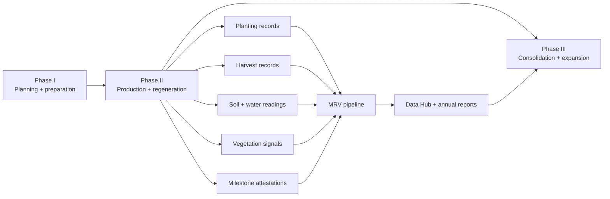

# Phase II turns a prepared farm into verified production.

Phase II begins when Phase I planning, training, infrastructure readiness, soil preparation, and DAO milestone conditions are complete. It is the stage where seeds go into the ground, production starts across short-, medium-, and long-cycle crops, and the farm begins generating the records that prove whether the Kokonut Framework is working.

Phase II is not only a planting stage. It is the evidence-building stage: harvest records, soil readings, vegetation signals, pest observations, water data, and milestone attestations start compounding into a public operating history.

<div style={{ display: "flex", gap: "12px", justifyContent: "center", flexWrap: "wrap", margin: "1.5rem 0 0.75rem" }}>
  <a href="#phase-ii-at-a-glance" style={{ display: "inline-flex", alignItems: "center", gap: "6px", background: "#009F4D", color: "#fff", padding: "10px 20px", borderRadius: "8px", fontWeight: "600", fontSize: "14px", textDecoration: "none" }}>
    See Phase II Outputs →
  </a>

  <a href="/ecosystem-wiki/kokonut-farms/measurement-reporting-and-verification" style={{ display: "inline-flex", alignItems: "center", gap: "6px", border: "1.5px solid #009F4D", color: "#009F4D", padding: "10px 20px", borderRadius: "8px", fontWeight: "600", fontSize: "14px", textDecoration: "none", background: "transparent" }}>
    Read MRV Methodology
  </a>
</div>

<p style={{ textAlign: "center", fontSize: "13px", color: "#6b7280", marginTop: "0.25rem" }}>
  Use this page to understand what must happen after a farm is funded and prepared, but before it can be considered consolidated, certified, or expansion-ready.
</p>

<Warning>
  Phase II is a live operating phase, not a guaranteed return phase. Harvests, revenue, soil improvement, and certification readiness depend on execution quality, weather, water, labor, market pricing, data quality, and DAO-verified milestones.
</Warning>

---

## Phase II at a glance

| Question | Phase II answer |
| --- | --- |
| When it begins | After Phase I completion, the criteria are met, and the first approved DAO milestone disbursement is released |
| Main purpose | Activate production, regeneration practices, and continuous MRV evidence |
| Typical duration | Usually 2–4 years, depending on crop mix, soil conditions, and long-cycle crop establishment |
| What it produces | First harvests, soil readings, MRV payloads, EAS attestations, revenue actuals, and annual impact reports |
| Primary risk | Production assumptions are tested against field reality |
| Completion signal | Sustained multi-cycle production with verified MRV data, not simply the passage of time |

<CardGroup cols={3}>
  <Card title="Production begins" icon="seedling">
    Short-cycle, medium-cycle, and long-cycle crops are planted together so the farm can generate near-term harvests while longer-term perennial systems establish.
  </Card>

  <Card title="Regeneration becomes practice" icon="leaf">
    Crop rotation, ground cover, beneficial plant associations, poultry integration, biochar, organic inputs, and soil monitoring move from plan to daily operations.
  </Card>

  <Card title="Evidence starts compounding" icon="database">
    Each planting, harvest, soil reading, and verified milestone becomes part of the farm's public operating record.
  </Card>
</CardGroup>

---

## How Phase II fits the development lifecycle



Phase I makes the farm legible. Phase II tests the plan in the field. Phase III begins only after the farm has enough verified operating history to support consolidation, certification, and expansion decisions.

[Read Phase I →](/kokonut-framework/development-phases/phase-i)

---

## What Phase II produces

| Output | Why it matters | Evidence to collect |
| --- | --- | --- |
| First plantings | Confirms the farm has moved from planning to production | Plot records, crop type, planting date, density, operator notes |
| First harvests | Tests whether production assumptions are realistic | Harvest records, yield, loss rate, sale price, buyer/channel |
| Continuous soil readings | Shows whether regeneration practices are improving the growing environment | EC, volumetric water content, soil temperature, lab results where available |
| Agro-ecological practice records | Documents how regeneration is implemented, not just claimed | Rotation logs, cover crop logs, input records, pest observations |
| MRV events | Turns operations into structured data | Farm Registry payloads, IPFS records, EAS attestations |
| Milestone evidence | Determines whether DAO disbursements should proceed | Verified milestone completion records and reviewer notes |
| Annual impact report | Summarizes environmental, economic, social, and risk evidence | EBF report, CRISP review, Data Hub records |

<Note>
  Phase II is where the farm's forecast becomes testable. Forecasts should be compared against actual harvests, prices, losses, soil readings, and market conditions before being used for stronger claims.
</Note>

---

## Phase II workstreams

<Steps>
  <Step title="Implement agro-ecological practices" icon="hand-holding-seedling" iconType="regular">
    Phase II activates the regenerative practices designed during Phase I.

    **Core practices include:**

    - Crop rotation to reduce pest and disease pressure
    - Beneficial plant associations and companion planting
    - Living ground cover between and around production beds
    - Biological pest management through biodiversity and animal integration
    - Organic fertility from compost, biochar, humic acids, manure processing, and crop residues
    - Reduced synthetic-input dependency

    **At Adelphi:** the farm applies closed-loop fertility through poultry manure, humic acids, crop beds, forage, and poultry integration. The 110-hen flock contributes eggs, manure, pest pressure management, and nutrient cycling.

    **Evidence to collect:** crop cycle stage, plant health observations, pest and disease flags, input logs, water observations, field photos, and operator notes.
  </Step>
  <Step title="Build soil regeneration evidence" icon="farm" iconType="regular">
    Phase II must show whether soil regeneration practices are improving the farm over time.

    **Soil practices include:**

    - Remineralization through mineral-rich amendments, where appropriate
    - Biochar application and organic matter incorporation
    - Humic acid and biological input application
    - Reduced disturbance between crop cycles
    - Continuous living cover to reduce erosion and heat stress

    **At Adelphi:** biochar-mineral incorporation, humic acids, beard grass, and organic matter cycling are used to improve water retention, soil biology, and nutrient availability.

    **Evidence to collect:** EC, volumetric water content, soil temperature, soil organic matter where available, photos of ground cover, input quantities, and pre/post application notes.
  </Step>
  <Step title="Plant across three crop cycles" icon="seedling" iconType="regular">
    Phase II activates the Framework's three-cycle production strategy.

    | Cycle | Role | Example crops | Evidence |
    | --- | --- | --- | --- |
    | Short cycle | Near-term harvest and cash flow | Lettuce, spinach, arugula, tomatoes, broccoli | Planting and harvest records |
    | Medium cycle | Seasonal production and mid-canopy structure | Passion fruit, Indian yam, plantain, banana | Establishment and yield records |
    | Long cycle | Perennial structure and long-term value | Coconut, cacao, hardwood, agroforestry trees | Tree health, survival, growth records |

    **At Adelphi:** lettuce drives short-cycle production, passion fruit and Indian yam support medium-cycle output, and coconut anchors the long-cycle agroforestry system.

    **Evidence to collect:** crop type, plot, planting density, cycle length, yield, loss rate, pricing, buyer/channel, and survival rates for perennial species.
  </Step>
  <Step title="Record harvests and revenue actuals" icon="scale-balanced" iconType="regular">
    Phase II is where forecasted production meets actual field performance.

    Each harvest should record:

    - Crop and variety
    - Plot or bed
    - Harvest date
    - Units harvested
    - Loss rate
    - Units sold or distributed
    - Sale price
    - Buyer or distribution channel
    - Public goods allocation, if applicable

    **At Adelphi:** lettuce, passion fruit, coconut, and eggs should be tracked separately so the farm can distinguish short-cycle cash flow, medium-cycle production, long-cycle maturity, and continuous poultry output.

    **Evidence to collect:** harvest payloads, receipts where available, field logs, buyer records, and Data Hub updates.
  </Step>
  <Step title="Trigger milestone reviews" icon="circle-check" iconType="regular">
    DAO milestone disbursements should be tied to verified events, not calendar promises.

    | Milestone type | Example trigger | Reviewer question |
    | --- | --- | --- |
    | Planting milestone | Crop beds are planted across approved zones | Was planting completed according to the approved plan? |
    | MRV milestone | First data payload accepted | Is the evidence structured, complete, and inspectable? |
    | Harvest milestone | First harvest submitted and reviewed | Does the record match the farm's forecast assumptions? |
    | Soil milestone | Soil readings compared against baseline | Is improvement observed, uncertain, or not yet visible? |
    | Impact milestone | Interim or annual report published | Are claims supported by evidence? |

    **Evidence to collect:** milestone record, reviewer notes, related MRV event, attestation link, and DAO decision reference.
  </Step>
</Steps>

---

## Adelphi Phase II reference

At Adelphi, Phase II is the live proof stage. The farm is actively testing whether the Kokonut Framework can combine food production, regenerative practices, community income, MRV, and public goods allocation on real land.

| Adelphi element | Phase II role | Verification path |
| --- | --- | --- |
| Lettuce and fast-cycle crops | Early production and cash-flow test | Harvest records and loss-rate comparison |
| Passion fruit and Indian yam | Medium-cycle production bridge | Establishment logs and first harvest records |
| Coconut trees | Long-cycle agroforestry anchor | Tree health, GPS records, satellite vegetation indicators |
| Poultry system | Eggs, pest pressure management, manure, fertility loop | Poultry logs, manure/input records, egg production records |
| Biofactory and nursery | Organic inputs and biodiversity propagation | Input logs, nursery inventory, species records |
| Ground cover and syntropic plots | Soil protection and ecological resilience | Field observations, soil readings, vegetation indices |
| Public Data Hub | Public progress visibility | MRV events, harvest records, impact metrics |

[Explore Adelphi live farm data →](https://hub.kokonut.network/projects/41)

---

## Phase II MRV milestones

Phase II evidence should move through the Kokonut MRV pipeline:

```text
Farm activity → structured payload → IPFS record → Farm Registry event → EAS attestation → public Data Hub → annual impact report
```

| Milestone | Trigger | Evidence standard |
| --- | --- | --- |
| First planting complete | Approved crop beds planted across cycle lengths | Planting record, field notes, plot references |
| First MRV data submitted | First accepted MRV payload | Structured record, timestamp, source, reviewer notes |
| First harvest recorded | First confirmed crop harvest | Crop type, yield, loss, sale/distribution record |
| Soil baseline comparison | Soil readings after regeneration practices begin | EC, VWC, temperature, lab data where available |
| Six-month production review | Interim operational report | Harvest, soil, water, pest, labor, and market notes |
| Annual impact report | Full reporting period completed | EBF report, CRISP review, public records, DAO summary |

<Warning>
  Do not treat every Phase II observation as proof of regeneration. Some changes may be seasonal, weather-driven, or caused by measurement error. Strong claims require repeated measurements, clear baselines, and transparent methodology.
</Warning>

---

## What Phase II does not guarantee

Phase II reduces uncertainty by producing evidence, but it does not eliminate risk.

| Risk | Why it still matters |
| --- | --- |
| Weather risk | Rainfall, drought, storms, and heat can affect yields and soil readings |
| Execution risk | Planting, pruning, harvesting, and input timing determine outcomes |
| Labor risk | Regenerative systems require consistent, skilled fieldwork |
| Market risk | Prices, buyers, and demand can change after planting |
| Data risk | Missing, inconsistent, or low-quality records weaken verification |
| Soil risk | Soil improvement can take multiple cycles and may not be linear |
| Governance risk | Milestones still require DAO review, documentation, and approval |

<Tip>
  The safest way to read Phase II is as a validation period: the farm is proving what works, what needs adjustment, and what evidence should guide future funding.
</Tip>

---

## Phase II completion criteria

Phase II is complete when the farm demonstrates sustained production with verified evidence.

| Criterion | How to verify it |
| --- | --- |
| At least three complete short-cycle harvest records | Harvest records submitted, reviewed, and compared against forecast assumptions |
| Medium-cycle crops established and productive | First medium-cycle harvest recorded and verified |
| Long-cycle crops established and healthy | Tree health records, survival checks, GPS/geospatial records, and vegetation signals |
| Soil improvement evidence collected | Readings compared against the Phase I baseline across multiple cycles |
| Annual impact report published | Environmental, economic, social, and risk evidence summarized and linked |
| CRISP or equivalent risk review completed | Risk factors were scored and included in the annual impact review |
| DAO has enough evidence to evaluate consolidation | Milestones, actuals, risks, and next-step budget are visible |

---

## Advancing to Phase III

Phase III begins when the evidence from Phase II shows that the farm is ready to consolidate, certify, and expand.

Phase III should not begin because a calendar says enough time has passed. It should begin because the farm has:

- A verified production record
- Clear harvest actuals
- Documented soil and operational evidence
- Healthy long-cycle crop establishment
- A public impact report
- A risk review
- A credible path toward certification, market expansion, or replication

[Read Phase III →](/kokonut-framework/development-phases/phase-iii)

---

## Reviewer checklist

Use this checklist before approving Phase II milestone disbursements or advancing to Phase III.

- Are planting and harvest records complete?
- Are actual yields separated from forecasts?
- Are loss rates documented instead of assumed?
- Are sale prices and distribution channels recorded?
- Are soil readings compared against the Phase I baseline?
- Are MRV payloads structured and inspectable?
- Are EAS attestations linked where applicable?
- Are claims about carbon, biodiversity, soil, or income supported by evidence?
- Are risks and failed assumptions documented?
- Is the next milestone clearly defined?

---

## Next steps

<CardGroup cols={2}>
  <Card title="Phase I — Planning and Preparation" icon="chalkboard-user" href="/kokonut-framework/development-phases/phase-i">
    The readiness work that must happen before Phase II production begins.
  </Card>

  <Card title="Phase III — Consolidation and Expansion" icon="chart-line-up" href="/kokonut-framework/development-phases/phase-iii">
    The certification, market, and expansion phase that Phase II evidence makes possible.
  </Card>

  <Card title="Crops & Harvest Forecast" icon="dragon" href="/ecosystem-wiki/kokonut-farms/adelphi/crops-and-harvest-forecast">
    The Adelphi forecast is used to compare expected production against actual harvest data.
  </Card>

  <Card title="Measurement, Reporting & Verification" icon="magnifying-glass-chart" href="/ecosystem-wiki/kokonut-farms/measurement-reporting-and-verification">
    How Phase II farm activity becomes public, verifiable evidence.
  </Card>

  <Card title="5 Principles of Regeneration" icon="hand-holding-seedling" href="/kokonut-framework/framework-components/framework-features/5-principles-of-regeneration">
    The regenerative practices of Phase II are put into operation.
  </Card>

  <Card title="Ecological Impact Frameworks" icon="leaf" href="/kokonut-framework/framework-add-ons/ecological-impact-frameworks">
    How EBF and CRISP interpret Phase II evidence for impact and risk reporting.
  </Card>
</CardGroup>