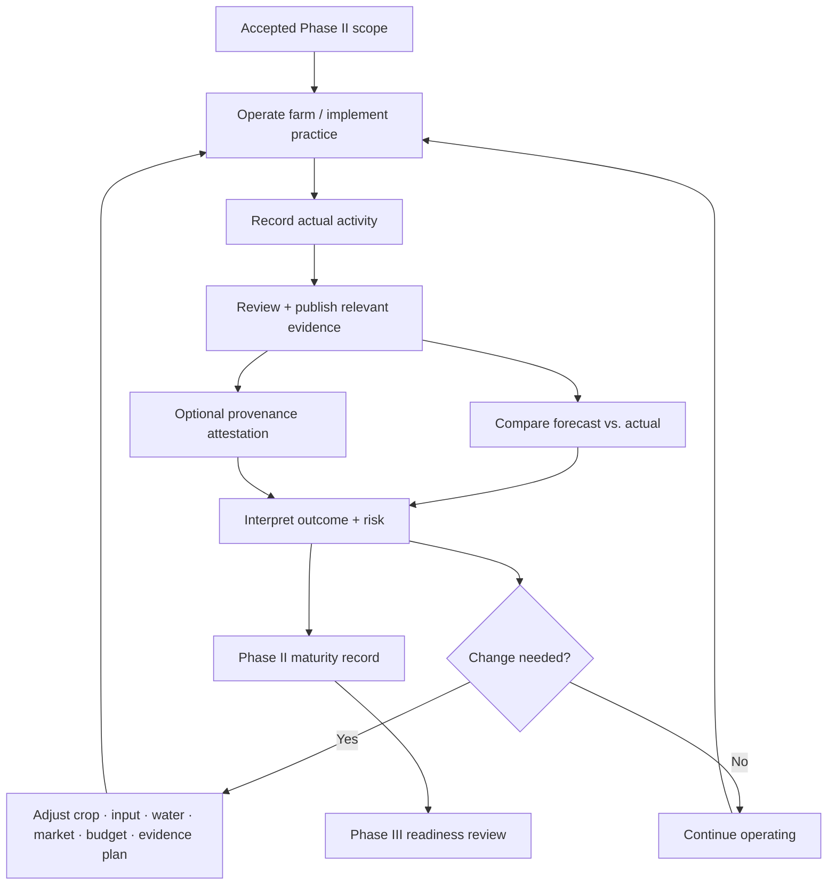
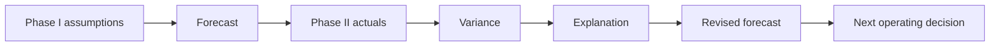
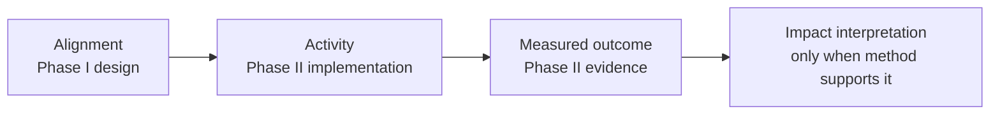

# Phase II is where the farm plan meets reality.

**Phase II — Production & Regeneration** begins when the farm-specific Phase II trigger defined in Phase I has been accepted.

This is the operating phase where the farm starts producing the records that can answer:

- What was actually planted?
- What survived?
- What was harvested?
- What was lost?
- What was sold or distributed?
- At what realized price?
- What did operations actually cost?
- Which regenerative practices were implemented?
- What changed in soil, vegetation, biodiversity, water, work, or resource use?
- Which assumptions were wrong?
- Which risks materialized?
- What should the operators change next?

> **Phase II is not “the plan being proven correct.” It is the period in which the plan is tested against field reality.**

<CardGroup cols={2}>
  <Card title="Start from the Phase I trigger" icon="chalkboard-user" href="/kokonut-framework/development-phases/phase-i">
    Phase II should begin from explicit readiness conditions rather than a universal calendar date or mandatory DAO disbursement.
  </Card>

  <Card title="Compare forecasts with actuals" icon="calculator" href="/ecosystem-wiki/kokonut-farms/adelphi/crops-and-harvest-forecast">
    Replace planning assumptions with farm-specific planting, harvest, loss, price, sale, and cost records over time.
  </Card>

  <Card title="Keep practice separate from outcome" icon="hand-holding-seedling" href="/kokonut-framework/framework-components/framework-features/5-principles-of-regeneration">
    Regenerative practices can be documented immediately; soil, biodiversity, resilience, and climate outcomes require their own evidence.
  </Card>

  <Card title="Use the evidence lifecycle" icon="magnifying-glass-chart" href="/ecosystem-wiki/kokonut-farms/measurement-reporting-and-verification">
    Follow observe → structure → review → publish → attest when useful → interpret.
  </Card>
</CardGroup>

<Warning>
  **Phase II does not mean “verified regeneration.”** Production, revenue, soil improvement, biodiversity recovery, decent work, public-goods delivery, or climate benefit must each be supported by evidence appropriate to the claim.
</Warning>

---

## Phase II at a glance

| Question | Phase II answer |
| --- | --- |
| **Main purpose** | Operate the farm, produce actual records, test assumptions, and adapt |
| **When it begins** | When the farm-specific Phase II trigger from Phase I is accepted |
| **Fixed duration?** | **No.** Timing depends on crop mix, seasons, maturity, evidence needs, market conditions, and operating performance |
| **Does every farm need Moloch milestones?** | **No.** Moloch milestones apply only when shared treasury funding or another Moloch-scoped authorization is involved |
| **Does every farm need three crop cycles?** | **No.** Short/medium/long-cycle planning is useful where relevant, but production design is farm-specific |
| **Does every record need EAS/IPFS?** | **No.** Use public provenance tools when they materially improve the record |
| **What replaces forecasts?** | Actual planting, harvest, loss, price, expense, sale, distribution, labor, and field records |
| **What is the transition signal?** | Enough operating evidence exists to justify consolidation/expansion decisions under a farm-specific Phase III trigger |
| **Does Phase IV run here?** | **Yes.** Continuous evidence and learning operate throughout Phase II |

---

## The Phase II operating loop

```mermaid
flowchart TD
    A["Accepted Phase II scope"] --> B["Operate farm / implement practice"]
    B --> C["Record actual activity"]
    C --> D["Review + publish relevant evidence"]
    D --> E["Compare forecast vs. actual"]
    E --> F["Interpret outcome + risk"]
    F --> G{"Change needed?"}

    G -->|Yes| H["Adjust crop · input · water · market · budget · evidence plan"]
    H --> B

    G -->|No| I["Continue operating"]
    I --> B

    D --> J["Optional provenance attestation"]
    J --> F

    F --> K["Phase II maturity record"]
    K --> L["Phase III readiness review"]
```

The loop matters more than any one harvest.

A mature Phase II farm should become **more specific and less assumption-heavy** over time.

---

## What Phase II should produce

| Output | What it tells the farm | Boundary |
| --- | --- | --- |
| **Planting / establishment records** | What was actually implemented | Planting does not prove yield |
| **Harvest actuals** | What was actually produced | Harvest quantity does not equal sale or profit |
| **Loss / rejection records** | Where production assumptions failed | A loss rate needs a consistent denominator |
| **Sales / distribution actuals** | What moved, to whom, at what price | Revenue does not equal profit |
| **Expense / procurement actuals** | What operations actually cost | One receipt does not equal full cost accounting |
| **Labor / operator records** | Who performed the work and under what arrangement | Job count does not equal decent work |
| **Regenerative-practice records** | Which practices actually happened | Practice does not equal ecological outcome |
| **Soil / vegetation / water / biodiversity evidence** | What measured conditions changed | Change does not automatically prove causality |
| **Infrastructure / maintenance records** | What capacity exists and remains functional | Installation does not equal utilization |
| **Risk / incident / variance records** | Which assumptions failed or changed | Identifying a risk does not eliminate it |
| **Milestone acceptance records** | Whether a funded or governed deliverable was accepted | Acceptance of a deliverable is not proof of later impact |
| **Updated forecast** | How the model should change based on actuals | Revised forecast remains a forecast |
| **Phase II maturity record** | Why the farm may be ready for consolidation | Maturity is farm-specific, not a universal score |

<Info>
  The purpose of Phase II evidence is not to make the farm look consistently successful. Failed assumptions, crop loss, missed milestones, maintenance problems, poor prices, and weak measurements are useful information when recorded honestly.
</Info>

---

# Phase II workstreams

## 1. Execute the locally approved production plan

Phase II puts the Phase I operating plan into sustained use.

Depending on the farm, that can include:

- annual vegetables;
- root crops;
- vines;
- fruit;
- coconut or other perennial trees;
- agroforestry;
- nursery production;
- poultry or animals where appropriate;
- biological-input production;
- community/training activity;
- other locally relevant production systems.

### Short, medium, and long cycles are planning categories — not a mandatory template

Kokonut often uses multiple time horizons because they help distinguish:

- early production;
- establishment periods;
- long-lived assets;
- replacement cycles;
- delayed cash flow.

But a future farm does not need to reproduce Adelphi's exact mix.

| Planning horizon | Useful question |
| --- | --- |
| **Short cycle** | What can produce useful operational feedback quickly? |
| **Medium cycle** | What requires establishment before recurring production? |
| **Long cycle** | What matures over multiple years and requires continuity planning? |
| **Continuous / recurring** | What produces or operates outside discrete crop cycles? |

The correct mix depends on the farm.

---

## 2. Record planting and establishment actuals

For material crops / production systems, record what actually happened.

Possible fields include:

- farm / plot / bed;
- crop / variety;
- planting date;
- planted quantity;
- planted area;
- source of seed/planting material;
- density;
- operator;
- establishment notes;
- irrigation/water context;
- inputs;
- weather/context;
- survival / establishment rate where relevant.

### Why this matters

A forecast may assume:

- a planting density;
- a number of plants;
- an establishment date;
- a survival rate;
- a cycle length.

Phase II creates the first opportunity to replace those assumptions with actual farm-specific values.

---

## 3. Record harvest, loss, sale, and distribution actuals

Each material harvest should preserve enough information to reconcile the production model.

| Record | Why it matters |
| --- | --- |
| Harvest date | Actual crop-cycle timing |
| Plot / crop | Source of output |
| Planted quantity / area | Forecast denominator |
| Harvested quantity | Gross production actual |
| Saleable quantity | Commercial output |
| Loss / rejection quantity | Actual loss context |
| Unit / measurement basis | Comparability |
| Realized price | Replaces planning price |
| Buyer / channel | Explains price and market performance |
| Sold quantity | Realized commercial volume |
| Donated / distributed quantity | Public-benefit / non-sale output where relevant |
| Evidence pointer | Source record / receipt / field log |
| Reviewer / lifecycle status | How the record becomes usable downstream |

### Revenue states should remain separate

Do not collapse:

- harvested;
- invoiced;
- sold;
- paid;
- cash received.

Likewise, do not collapse:

- gross revenue;
- net revenue;
- operating surplus;
- profit;
- distributable cash.

<Warning>
  **A successful harvest is not the same as a profitable harvest.**
</Warning>

---

## 4. Reconcile forecast vs. actual

This is one of Phase II's most important functions.

```mermaid
flowchart LR
    A["Phase I assumptions"] --> B["Forecast"]
    B --> C["Phase II actuals"]
    C --> D["Variance"]
    D --> E["Explanation"]
    E --> F["Revised forecast"]
    F --> G["Next operating decision"]
```

Useful variance categories include:

- planting quantity;
- establishment/survival;
- days to harvest;
- yield;
- loss/rejection;
- realized price;
- buyer/channel;
- labor;
- input cost;
- water cost;
- transport;
- packaging;
- maintenance;
- public-goods transfer where applicable.

### Variance is not failure by definition

A model is useful when reality can change it.

> **A forecast that is never revised after actual farm data arrives is documentation debt.**

---

## 5. Implement regenerative practices — without assuming the outcome

Phase II is where the [5 Principles of Regeneration](/kokonut-framework/framework-components/framework-features/5-principles-of-regeneration) become observable farm activity.

Examples can include:

- reduced avoidable soil disturbance;
- living or biomass cover;
- functional biodiversity;
- animal integration where appropriate;
- living roots / perennial continuity;
- compost;
- biochar;
- biological inputs;
- agroforestry;
- biomass cycling;
- irrigation / water management;
- erosion controls.

### Record the intervention

For a material practice, preserve:

- where;
- when;
- what;
- quantity / rate where relevant;
- operator;
- method;
- source material;
- related crop/plot;
- photo / field observation where useful;
- intended hypothesis.

Then measure the outcome separately.

### Example

> **Activity:** biochar was applied to Plot A at a recorded rate.

Possible later outcome questions:

- Did soil moisture change?
- Did input dependency change?
- Did crop performance change?
- Did soil carbon change under an appropriate method?

The practice record is useful even if the expected outcome does not appear.

---

## 6. Build ecological evidence over comparable periods

Phase II should compare conditions only when the methods and context support comparison.

Possible domains include:

- soil;
- vegetation;
- water;
- biodiversity;
- survival;
- land cover;
- input use;
- resource cycling.

### Soil

Possible evidence can include:

- EC;
- volumetric water content;
- temperature;
- lab indicators where useful;
- ground cover;
- input/application records;
- soil organic matter/carbon under fit-for-purpose methods.

### Vegetation / remote sensing

Indices such as:

- NDVI;
- NDRE;
- ReCI;
- MSAVI;

can provide derived vegetation signals.

They do not directly prove:

- yield;
- biodiversity;
- soil carbon;
- ecological restoration;
- credit eligibility.

### Biodiversity

Useful evidence can progress through:

> **inventory → implementation → survival/continuity → repeated survey → bounded interpretation**

### Method consistency matters

Record:

- measurement method;
- units;
- location;
- timing;
- instrument/sensor;
- calibration/context where relevant;
- reviewer;
- limitations.

<Info>
  **A change is not automatically an improvement, and an improvement is not automatically caused by one intervention.**
</Info>

---

## 7. Track operator, labor, and capability actuals

Phase II tests whether the human operating system works.

Useful records can include:

- operator responsibility;
- worker role;
- dates;
- full-time / part-time / seasonal status;
- compensation where appropriate;
- safety / incidents;
- training;
- competency;
- labor hours where material;
- turnover;
- dependency on one person;
- escalation / backup roles.

### Why this matters

Phase III should not depend on the assumption that a farm can scale if:

- one founder holds all operational knowledge;
- data entry depends on one external contributor;
- maintenance has no owner;
- harvest work cannot be staffed;
- financial reporting is incomplete.

Operational maturity includes people, not only crops.

---

## 8. Track expenses and operational finance

Production evidence should include cost evidence.

Useful financial actuals include:

- inputs;
- seed / seedlings;
- feed;
- labor;
- water;
- power/fuel;
- packaging;
- transport;
- tools;
- maintenance;
- repairs;
- certification/compliance costs;
- external services.

### Budget vs. actual

For funded work:

| State | Meaning |
| --- | --- |
| Budgeted | Planned amount |
| Approved | Authorized amount |
| Committed | Purchase/obligation made |
| Spent | Payment completed |
| Accepted | Deliverable/payment evidence accepted |
| Closed | Variance and follow-up documented |

This is especially important when shared treasury capital is involved.

---

## 9. Review milestones where the funding model requires them

Not every farm needs DAO milestones.

When a funder, grant, Moloch proposal, or partner agreement uses milestone-based releases, Phase II should keep:

- **authorization**;
- **payment/execution**;
- **physical delivery**;
- **evidence review**;
- **acceptance**;
- **closeout**

as separate states.

### Example milestone record

| Field | Question |
| --- | --- |
| Milestone | What deliverable was authorized? |
| Release condition | What must happen before payment/release? |
| Operator / vendor | Who executes? |
| Evidence | What proves delivery? |
| Reviewer | Who checks it? |
| Status | Authorized / executed / delivered / reviewed / accepted / closed |
| Variance | What differs from the original scope? |
| Change control | Does the variance require renewed approval? |

<Warning>
  **Moloch can authorize shared treasury capital. It does not become the agronomy reviewer or local farm operator.**
</Warning>

---

## 10. Record incidents, failed assumptions, and change control

Phase II should create a record when reality materially departs from the plan.

Examples:

- crop failure;
- mortality;
- disease;
- storm/flood/drought damage;
- irrigation failure;
- failed buyer;
- major price change;
- input shortage;
- labor gap;
- equipment failure;
- unexpected cost;
- data loss;
- invalid measurement;
- operator change;
- land/access change;
- scope change.

### A useful variance record should identify

- what changed;
- why it matters;
- immediate response;
- owner;
- budget effect;
- production effect;
- evidence effect;
- risk update;
- whether re-authorization is needed;
- next review date.

> **The farm should be allowed to change. The record should make the change legible.**

---

## 11. Publish and attest selectively

The MRV sequence remains:

> **observe → structure → review → publish → attest when useful → interpret**

### Publish when appropriate

Useful published records can include:

- farm status;
- planting/harvest records;
- milestone records;
- selected MRV events;
- public reports;
- impact evidence where appropriate.

Sensitive evidence can remain restricted.

### EAS

Use EAS when durable public provenance adds value.

An EAS attestation can preserve:

- signer;
- timestamp;
- schema;
- evidence pointer;
- claim/provenance context.

It does not establish:

- scientific truth;
- causal attribution;
- certification;
- carbon-credit eligibility;
- biodiversity restoration;
- farm profitability.

### IPFS / Filecoin

Use content-addressed storage when durable evidence artifacts benefit from it.

It is not required for every Phase II record.

---

# Phase II and the Positive Impact claim ladder

Phase II is where many claims can move from **alignment** to **activity**, and some can move to **measured outcome**.

```mermaid
flowchart LR
    A["Alignment<br/>Phase I design"] --> B["Activity<br/>Phase II implementation"]
    B --> C["Measured outcome<br/>Phase II evidence"]
    C --> D["Impact interpretation<br/>only when method supports it"]
```

Examples:

| Statement | Claim level |
| --- | --- |
| “The farm plans to maintain soil cover.” | Alignment |
| “Ground cover was established on the documented plot.” | Activity |
| “Ground-cover percentage increased from X to Y during the reporting period.” | Measured outcome |
| “The evidence supports a bounded conclusion about reduced surface exposure under the defined conditions.” | Impact interpretation |

Phase II does **not** require every claim to reach the final level.

A farm can be operationally successful while some ecological or social outcomes remain uncertain.

---

# Adelphi — current Phase II reference

Current Kokonut documentation places **Adelphi in Phase II — Production & Regeneration**.

It is the strongest current example of how Phase II should be read:

> **real infrastructure and farm activity exist, while many production/economic/ecological values still require current actual records before stronger conclusions are made.**

### Documented / current reference facts

Repository documentation currently includes:

- two syntropic plots;
- 110 hens;
- nursery + biofactory;
- bamboo-derived biochar practice;
- ground-cover / beard-grass practice;
- crop beds and mixed production systems;
- training/community infrastructure;
- GPS / remote-sensing / farm-record capability;
- Phase II status.

### Current forecast model — not actual performance

The Adelphi forecast currently models:

| Stream | Current model |
| --- | --- |
| **Lettuce** | 5 harvests/year planning assumption; 15% model loss rate |
| **Passion fruit** | Medium-cycle production assumption |
| **Coconut** | 96 trees; mature-yield model; first-harvest window currently modeled at 3–5 years |
| **Poultry** | 110 hens documented; ~100 eggs/day remains a planning estimate |
| **Combined crop gross revenue** | **$149,110.87/year** planning snapshot; poultry excluded |
| **Public-goods share** | **10%** current farm-model assumption; unresolved against historical 40/40/20 documentation |

<Warning>
  **Do not use the Adelphi forecast as evidence that these harvests, prices, revenue, egg output, public-goods transfers, or profit have been realized.** Use current Kokonut Hub records and underlying farm evidence when actual performance matters.
</Warning>

### The Phase II job at Adelphi

The key task is to replace assumptions such as:

- 15% crop loss;
- 5 lettuce harvests/year;
- planning prices;
- passion-fruit yield;
- coconut maturity yield;
- ~100 eggs/day;

with farm-specific actuals.

That is the purpose of Phase II.

<CardGroup cols={2}>
  <Card title="Inspect current published records" icon="chart-line" href="https://hub.kokonut.network/projects/41">
    Use the Kokonut Hub for changeable farm state rather than relying only on static methodology pages.
  </Card>

  <Card title="Read the forecast model" icon="calculator" href="/ecosystem-wiki/kokonut-farms/adelphi/crops-and-harvest-forecast">
    See the current assumptions, formulas, sensitivity, and minimum actuals needed to improve the model.
  </Card>

  <Card title="Inspect physical systems" icon="puzzle" href="/ecosystem-wiki/kokonut-farms/adelphi/crops-biodiversity-and-infrastructure">
    See documented crops, poultry, nursery, biofactory, soil practices, infrastructure, and evidence needs.
  </Card>

  <Card title="Review the evidence standard" icon="magnifying-glass-chart" href="/ecosystem-wiki/kokonut-farms/measurement-reporting-and-verification">
    See how observations and actual records become reviewed evidence without being overstated.
  </Card>
</CardGroup>

---

## Phase II reporting cadence is farm- and claim-specific

The old page assumed a fixed six-month review and annual impact report.

Those can be useful reporting intervals.

They should not be universal requirements.

| Record / review | Example cadence |
| --- | --- |
| Planting / treatment | Per event |
| Harvest / sale / loss | Per event |
| Expense / procurement | Per transaction / accounting cycle |
| Poultry / recurring production | Daily/weekly summary as operationally useful |
| Soil / water measurement | Method-dependent |
| Vegetation remote sensing | Comparable periodic scenes |
| Biodiversity / survival | Seasonal / method-dependent |
| Risk review | Incident / major change / reporting period |
| Funding milestone | Defined by the actual authorization |
| Full farm synthesis | Periodic when enough reviewed evidence exists |

> **Choose the reporting period because it makes the claim comparable—not because the Framework requires a universal calendar.**

---

## Phase II risk register

Phase I identifies risks.

Phase II shows which ones actually matter.

| Risk area | Phase II evidence |
| --- | --- |
| Crop / agronomy | Establishment, pest, disease, mortality, yield, loss |
| Water / climate | Irrigation, weather context, drought/storm impacts |
| Labor / operator | Staffing, capability, continuity, safety |
| Market | Buyer availability, realized price, rejected volume, payment |
| Financial | Actual cost, cash flow, maintenance, variance |
| Infrastructure | Uptime, breakdown, repair, capacity |
| Data quality | Missing/stale/inconsistent records, instrument issues |
| Ecological claim | Baseline comparability, method, attribution, reversal |
| Public goods | Actual transfer/delivery/use vs. modeled share |
| Governance / funding | Milestone/re-authorization/change-control requirements |

A good Phase II risk record should update:

- likelihood / uncertainty;
- consequence;
- owner;
- mitigation;
- trigger;
- residual risk;
- next review.

---

## What Phase II does not guarantee

| Phase II can produce | It cannot guarantee |
| --- | --- |
| Planting actuals | Successful establishment |
| Harvest actuals | Profitability |
| Sales records | Stable future buyers/prices |
| Regenerative-practice records | Soil/biodiversity restoration |
| Soil/vegetation measurements | Causal proof |
| Jobs / labor records | Decent-work outcomes |
| Public-goods records | Broader social impact |
| EAS attestations | Scientific certification |
| Multiple crop cycles | Long-term resilience |
| Forecast variance | Future forecast accuracy |
| Funding milestone acceptance | Later farm success |
| Risk updates | Risk elimination |
| Longer operating history | Automatic certification or financing |

> **Phase II reduces uncertainty by replacing assumptions with actual operating evidence. It does not remove uncertainty.**

---

# Phase II maturity and the transition to Phase III

There should not be one universal Phase II completion formula.

The old page required:

- three short-cycle harvests;
- productive medium-cycle crops;
- healthy long-cycle crops;
- soil improvement;
- annual impact report;
- scored CRISP review;
- enough DAO evidence.

Those can be useful signals in some contexts.

They are **not universal Framework requirements**.

A future farm might:

- have no short-cycle crops;
- have no livestock;
- use a different market model;
- need more than one year before meaningful ecological comparison;
- be privately/grant funded rather than Moloch funded;
- use a different evidence cadence.

### A stronger Phase II maturity review asks

| Question | Evidence |
| --- | --- |
| **Can the farm operate repeatedly?** | Repeated operating/production records appropriate to its system |
| **Are actuals replacing assumptions?** | Harvest, price, cost, loss, timing, labor, market records |
| **Can operators maintain the system?** | Role/capability/maintenance evidence |
| **Are records sufficiently reliable?** | Reviewed lifecycle, provenance, comparable semantics |
| **Are regenerative practices actually implemented?** | Practice records |
| **Are outcome claims properly bounded?** | Baselines, methods, repeated evidence where required |
| **Are risks visible and managed?** | Updated risk register / incidents / mitigation |
| **Are major forecast errors understood?** | Variance analysis |
| **Is the market path clearer?** | Actual buyers/channels/prices or documented changes |
| **Are funded milestones closed correctly?** | Acceptance / variance / closeout where applicable |
| **Is there a credible reason to consolidate or expand?** | Farm-specific Phase III scope and evidence |

### Phase III trigger

[Phase III — Consolidation & Expansion](/kokonut-framework/development-phases/phase-iii) should begin when the farm has enough operating history to justify a defined consolidation step.

Possible Phase III triggers include:

- standardizing successful operating procedures;
- strengthening traceability;
- pursuing certification;
- formalizing market channels;
- expanding infrastructure;
- reducing founder dependency;
- developing training systems;
- strengthening replacement/replanting plans;
- expanding evidence quality;
- testing replication.

The trigger should identify:

- what is being consolidated/expanded;
- why current evidence supports it;
- unresolved risks;
- budget/funding if needed;
- operator acceptance;
- reviewer/authority;
- acceptance criteria.

<Note>
  Phase III readiness is not a declaration that “Phase II succeeded.” It is a decision that the current operating evidence is strong enough to justify the next bounded consolidation or expansion step.
</Note>

---

## Phase II reviewer checklist

Use the applicable questions — not a universal pass/fail score.

- [ ] Is the current Phase II scope clear?
- [ ] Are local operators still the named owners of routine field execution?
- [ ] Are planting/establishment actuals recorded?
- [ ] Are harvest quantities recorded where harvests occurred?
- [ ] Are losses/rejections measured consistently?
- [ ] Are realized prices separated from planning prices?
- [ ] Are buyer/distribution records available where relevant?
- [ ] Are expenses/cost actuals being captured?
- [ ] Are forecasts being revised from actual performance?
- [ ] Are regenerative practices documented separately from outcome claims?
- [ ] Are ecological measurements comparable to the relevant baseline?
- [ ] Are derived indicators labeled as derived indicators?
- [ ] Are failed assumptions and incidents visible?
- [ ] Are risk owners and mitigations current?
- [ ] Are funded milestones distinguished from farm outcomes?
- [ ] Are change-control / re-authorization requirements visible?
- [ ] Are EAS/IPFS used only where useful rather than assumed mandatory?
- [ ] Are sensitive records kept appropriately restricted?
- [ ] Is current farm state routed to the Hub / live records?
- [ ] Is the proposed Phase III trigger evidence-based and farm-specific?

---

## How different readers should use Phase II

<CardGroup cols={2}>
  <Card title="Farm operators" icon="tractor">
    Use actual field, harvest, cost, market, maintenance, and risk records to adjust operations rather than following the Phase I plan blindly.
  </Card>

  <Card title="Capital reviewers" icon="file-signature">
    Compare funded milestones, budget actuals, acceptance, variance, and closeout without turning treasury authority into farm-management authority.
  </Card>

  <Card title="Agronomy & impact reviewers" icon="microscope">
    Separate implemented practice from measured outcome and check baseline, method, comparability, contribution, and uncertainty.
  </Card>

  <Card title="Guilds & contributors" icon="people-group">
    Convert operational gaps into bounded agronomy, data, market, research, finance, documentation, maintenance, or evidence work.
  </Card>

  <Card title="Partners & buyers" icon="store">
    Use traceable production, quality, timing, price, and delivery records rather than planning narratives alone.
  </Card>

  <Card title="Developers & agents" icon="database">
    Preserve actual-vs-forecast status, lifecycle state, provenance, reviewer, variance, authority, privacy, and evidence pointers in software.
  </Card>
</CardGroup>

---

## Current maturity

| Surface | Status | Interpretation |
| --- | --- | --- |
| **Phase II methodology** | **Active Framework methodology** | Sustained operations + actuals + adaptation |
| **Phase II duration** | **Not fixed** | Farm/crop/evidence dependent |
| **Short/medium/long-cycle model** | **Useful planning pattern** | Not mandatory for every farm |
| **Regenerative practices** | **Operational activity** | Do not equal measured regenerative outcomes |
| **Forecast-vs-actual loop** | **Core Phase II function** | Models should become more farm-specific over time |
| **Moloch milestones** | **Conditional** | Apply only when Moloch/funded authorization requires them |
| **EAS / IPFS** | **Optional evidence infrastructure** | Provenance/storage, not automatic proof |
| **Full impact reporting cadence** | **Farm / method-specific** | Annual can be useful but is not universal |
| **Adelphi Phase II** | **Current live reference** | Strongest operating example; use Hub for current changeable records |
| **Phase III transition** | **Evidence-based / farm-specific** | No universal harvest-count or time threshold |
| **Phase IV evidence** | **Ongoing throughout Phase II** | Continuous longitudinal records and learning |

---

## Continue through the Framework

<CardGroup cols={2}>
  <Card title="Phase I — Planning & Preparation" icon="chalkboard-user" href="/kokonut-framework/development-phases/phase-i">
    See how the baseline, risk, authority, evidence plan, and Phase II trigger should be established before sustained operations begin.
  </Card>

  <Card title="Phase III — Consolidation & Expansion" icon="chart-line-up" href="/kokonut-framework/development-phases/phase-iii">
    Move from operating evidence into bounded consolidation, market, certification, training, infrastructure, or expansion decisions.
  </Card>

  <Card title="Crops & Harvest Forecast" icon="calculator" href="/ecosystem-wiki/kokonut-farms/adelphi/crops-and-harvest-forecast">
    Compare Adelphi's planning assumptions with the actual dataset Phase II is meant to create.
  </Card>

  <Card title="MRV Methodology" icon="magnifying-glass-chart" href="/ecosystem-wiki/kokonut-farms/measurement-reporting-and-verification">
    See how Phase II observations and actuals become reviewed evidence.
  </Card>

  <Card title="Positive Impact Methodology" icon="recycle" href="/kokonut-framework/framework-components/framework-features/methodology-positive-impact">
    Keep alignment, activity, measured outcome, and impact interpretation distinct.
  </Card>

  <Card title="Adelphi Physical Systems" icon="puzzle" href="/ecosystem-wiki/kokonut-farms/adelphi/crops-biodiversity-and-infrastructure">
    Review the physical production system currently serving as the Phase II reference implementation.
  </Card>
</CardGroup>

> **Phase II succeeds when the farm becomes less dependent on assumptions and more capable of learning from its own operating evidence.**
