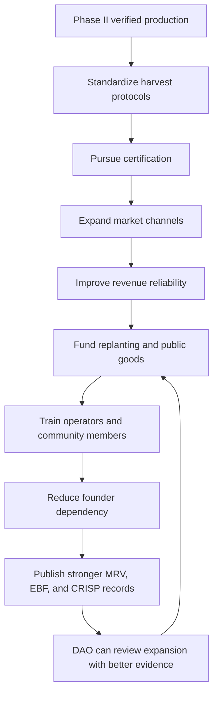
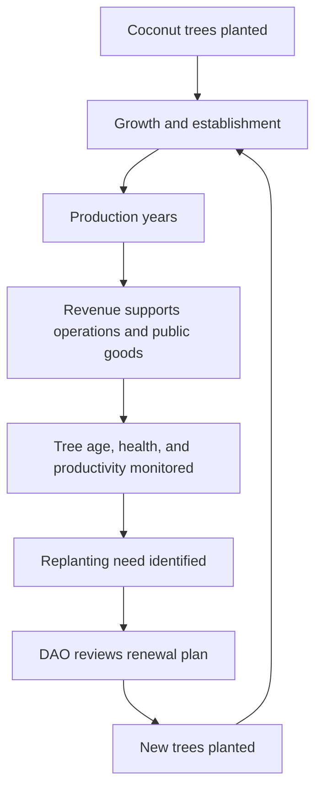

# Phase III turns verified production into a resilient farm institution.

Phase III begins after a farm has already proven that it can produce, report, and improve through Phase II. The goal is no longer simply to plant, harvest, and measure. The goal is to consolidate what worked, formalize operating systems, expand market access, reduce founder dependency, and prepare the farm for long-term public-good production.

In Kokonut, Phase III is the bridge between a productive regenerative farm and a farm that DAO members, buyers, grant reviewers, community partners, and future replicators can trust.

**Primary action:** [Check Phase III readiness](#phase-iii-readiness)\
**Next phase:** [Understand Phase IV continuous operations](/kokonut-framework/development-phases/phase-iv)

<Note>
  Phase III strengthens the farm's credibility, but it does not guarantee certification approval, premium pricing, carbon credit issuance, institutional financing, or risk-free operations. Those outcomes require evidence, governance, market execution, and ongoing MRV.
</Note>

---

## Phase III at a glance

| Question | Phase III answer |
| --- | --- |
| What stage is this? | Consolidation and expansion |
| When does it begin? | After Phase II production and MRV completion criteria are met |
| What changes? | The farm shifts from producing to standardizing, certifying, expanding, and teaching |
| Main outputs | Harvest protocols, certification pathway, market partnerships, replanting schedule, training program, multi-year evidence record |
| DAO role | Approves expansion capital, certification investments, land acquisition, operational upgrades, and major partnerships |
| MRV role | Converts operational maturity into longitudinal evidence, EAS attestations, EBF reports, and CRISP risk updates |
| Main risk | Overstating maturity before certification, buyer relationships, training systems, and multi-year reporting are actually in place |

---

## What Phase III must prove

Phase II asks: **Can this farm produce and verify regenerative activity?**

Phase III asks a harder question:

> Can this farm keep producing, keep improving, train others, serve stronger markets, and remain legible without depending on one founder or one harvest season?

That makes Phase III a trust-building phase. It should show that the farm is becoming more stable across five dimensions:

| Dimension | What must become stronger |
| --- | --- |
| Operations | Harvest protocols, quality control, traceability, and post-harvest handling |
| Markets | Buyer relationships, certification readiness, distribution reliability, pricing discipline |
| Ecology | Replanting cycles, biodiversity expansion, and long-cycle crop continuity |
| Community | Training programs, local participation, knowledge transfer, public-good distribution |
| Evidence | MRV history, annual reports, CRISP updates, EAS attestations, Data Hub records |

---

## Phase III consolidation loop

Phase III is not a single event. It is a compounding loop: better operations create better evidence, better evidence improves governance decisions, and better governance supports better long-term operations.

---

## What Phase III delivers

<CardGroup cols={2}>
  <Card title="Standardized harvest protocols" icon="scythe">
    Crop-specific maturity indicators, harvest schedules, quality control, traceability records, and post-harvest handling procedures.
  </Card>

  <Card title="Organic certification pathway" icon="award">
    Documentation, internal audits, inspections, and certification updates that make organic claims reviewable instead of informal.
  </Card>

  <Card title="Market expansion" icon="store">
    Stronger buyer relationships, clearer channel strategy, pricing discipline, and evidence-backed positioning for regenerative produce.
  </Card>

  <Card title="Biodiversity replanting" icon="tree">
    Multi-year replanting schedules for short-, medium-, and long-cycle crops, plus nursery-based native species deployment.
  </Card>

  <Card title="Training and education" icon="chalkboard-user">
    Operator training, community workshops, school programs, and train-the-trainer documentation for future replication.
  </Card>

  <Card title="Longitudinal evidence" icon="satellite-dish">
    Multi-year MRV records, annual EBF reports, CRISP updates, EAS attestations, and public Data Hub records.
  </Card>
</CardGroup>

---

## 1. Harvest protocols and post-harvest management

Phase III formalizes what Phase II tested in the field.

The farm should document how each crop is harvested, graded, stored, packaged, and reported. This reduces loss, improves quality, and prepares the farm for certification audits and buyer relationships.

| Protocol area | What to document | Why it matters |
| --- | --- | --- |
| Maturity indicators | Crop-specific color, size, texture, weight, and Brix readings were relevant | Prevents premature or late harvesting |
| Harvest schedule | Timing by crop cycle, buyer window, labor availability, and expected yield | Improves reliability and reduces waste |
| Quality control | Sorting, grading, rejection criteria, loss tracking | Makes actual quality and loss rates visible |
| Traceability | Plot, harvest date, operator, batch, buyer, price | Supports certification and buyer confidence |
| Handling | Packaging, storage, transport, and channel-specific requirements | Protects shelf life and sale value |

**At Adelphi:** Phase III should formalize lettuce cycle handling, passion fruit packaging, coconut harvest procedures, and batch-level traceability for certification and market access.

**MRV connection:** Harvest records should be logged for each harvest event and linked to farm records, actual yield, loss rate, sale price, plot, and operator.

---

## 2. Organic certification

Organic certification is not only a label. It is an audit process.

Phase III should make the farm's input history, field records, soil practices, harvest traceability, and operational procedures ready for review by the relevant national agricultural authority or certifying body.

| Certification step | Evidence needed |
| --- | --- |
| Internal audit | Input logs, soil records, crop records, field observations, training documentation |
| Application | Farm identity, operator details, land records, crop plan, production practices |
| Inspection | On-site review, documentation check, practice verification |
| Issuance or correction | Certificate approval, required changes, or follow-up actions |
| Renewal | Annual records showing continued compliance |

**At Adelphi:** certification is tied to the Dominican Republic Ministry of Agriculture pathway and should be updated in the farm record when status changes.

<Warning>
  Certification can support access to stronger market channels, but it does not automatically guarantee premium pricing, supermarket placement, export access, or buyer commitments. Those depend on supply reliability, quality, pricing, logistics, and relationship execution.
</Warning>

---

## 3. Go-to-market strategy

Phase III market strategy should be evidence-backed.

The farm should not only say it produces regenerative food. It should be able to show records of: what was harvested, how much was sold, what the loss rate was, who bought it, what price was realized, and what evidence supports quality claims.

| Channel | What it requires | Phase III role |
| --- | --- | --- |
| Community sales | Trust, proximity, consistent availability | Maintain local food access and feedback loops |
| Local organic markets | Quality, reliability, relationships | Formalize Phase II relationships |
| Restaurants and hotels | Consistent quality and delivery | Test B2B demand before larger scaling |
| Regional supermarkets | Volume, certification, documentation | Prepare supplier applications and compliance materials |
| National supermarkets | Certification, logistics, and formal agreements | Pursue only when the supply and records are strong enough |
| Export | Certification, cold chain, customs, scale | Usually Phase IV or later |

**DAO governance role:** market expansion that requires treasury spending, distribution infrastructure, new agreements with financial obligations, or brand commitments should go through a DAO proposal.

**At Adelphi:** Phase III should connect the founders' story, women-led operations, organic practices, and MRV evidence into a market narrative supported by records, not just branding.

---

## 4. Biodiversity replanting and continuous improvement

Regenerative farms should not plateau. Phase III should make biodiversity improvement part of the operating system.

That means the farm needs a replanting schedule for short-cycle beds, medium-cycle crops, long-cycle perennials, and native species from the nursery.

| Replanting layer | Phase III requirement |
| --- | --- |
| Short-cycle crops | Rotation calendar, soil recovery plan, cover-crop or rest strategy |
| Medium-cycle crops | Replacement schedule for vines and seasonal producers |
| Long-cycle crops | Multi-year renewal plan for coconut and agroforestry species |
| Native species | Nursery inventory, GPS records, planting events, survival tracking |
| Community distribution | Records of surplus plants distributed as public goods |

**At Adelphi:** Phase III should deploy nursery stock into the agroforestry zone, track survival rates, maintain passion fruit replacement schedules, and begin documenting the future coconut renewal plan.

**MRV connection:** replanting events should be logged as farm events and linked to GPS records, field observations, vegetation indicators, and annual biodiversity reporting.

---

## 5. Training and education programs

Phase III should reduce founder dependency.

A farm becomes more resilient when knowledge is documented, shared, and practiced by more than the founding team. Training is not just community outreach; it is operational risk reduction.

| Training area | What to build |
| --- | --- |
| Operator training | Harvesting, syntropic management, input preparation, data entry, certification compliance |
| Community workshops | Organic farming, soil health, biodiversity, nutrition, and stewardship |
| Youth education | Farm visits, hands-on learning, ecology, food systems, and local culture |
| Train-the-trainer | Local instructors who can teach without founder dependency |
| Documentation | A replicable farm operations manual for future Kokonut farms |

**At Adelphi:** the education gazebo can become the training hub for farmers, children, elders, visitors, contributors, and future operators.

**MRV connection:** participation records, curriculum updates, instructor development, and community programs can feed Human, Social, Cultural, and Health Capital reporting.

---

## The coconut replanting cycle

Kokonut's long-term model depends on renewal, not extraction.

Coconut trees have productive lifespans under good conditions. Phase III should document how long-cycle crops are maintained, monitored, and eventually replanted so the farm can continue beyond the life of any single tree generation.

The continuity mechanism is governance plus replanting discipline: the DAO must maintain a real renewal plan, rather than simply assuming the original planting lasts forever.

<Note>
  \$vKKN tree backing depends on accurate records, healthy farm operations, successful replanting, and DAO-approved renewal processes. The replanting cycle is a governance commitment, not an automatic guarantee.
</Note>

---

## Evidence standard for Phase III

Phase III should raise the quality of evidence, not only the quantity of activity.

| Claim | Evidence is needed before using it publicly |
| --- | --- |
| The farm is certification-ready | Input logs, field records, internal audit, inspection status, certification documents |
| The farm has stronger market access | Signed agreements, delivery records, buyer communications, sales records |
| The farm is reducing loss rates | Per-harvest loss records compared across cycles |
| The farm is expanding biodiversity | Nursery records, GPS planting events, survival rates, vegetation observations |
| The farm is reducing founder dependency | Training records, instructor records, documented SOPs, independent operator capability |
| The farm is institutionally legible | Multi-year MRV, EBF reports, CRISP assessments, EAS attestations, Data Hub records |

---

## Phase III readiness

A farm should be ready for Phase III only when Phase II has produced enough evidence to justify consolidation.

Use this checklist before advancing:

- At least three verified harvest cycles are complete.
- Soil, crop, and field observations are being logged consistently.
- Long-cycle crops are established and monitored.
- A first annual impact report or equivalent MRV summary exists.
- Loss rates, yield, and price assumptions have been compared against actuals.
- The farm has a clear certification pathway and documentation plan.
- Operators can maintain core records without constant external support.
- Any expansion spending has a clear DAO proposal path.

---

## Phase III completion criteria

Phase III is complete when the farm demonstrates durable operations across consolidation, market, training, ecology, and evidence.

| Criterion | How it should be verified |
| --- | --- |
| Certification status resolved | Certificate issued, pending actions documented, or correction path published |
| Premium or stronger market channels tested | Buyer records, delivery records, realized pricing, or signed channel agreements |
| Replanting schedule documented | Multi-year planting and renewal calendar linked to the farm record |
| Training program operational | Published curriculum, attendance records, and at least one trained instructor beyond founders |
| Multi-year impact reporting active | Annual EBF reports, MRV summaries, and EAS attestations published |
| Risk profile improving | CRISP review shows reduced operational, developer, data, or market risk over time |

---

## What Phase III does not guarantee

Phase III reduces uncertainty, but it does not remove risk.

| Risk | Why it still matters |
| --- | --- |
| Certification risk | Inspectors may require corrective actions or reject claims without adequate records |
| Market risk | Buyers may change demand, pricing, volume requirements, or payment terms |
| Execution risk | Operators may fail to maintain protocols, records, or training schedules |
| Weather and ecological risk | Storms, pests, drought, disease, and soil variability can affect production |
| Data-quality risk | Weak records reduce trust even when farm activity is real |
| Governance risk | DAO proposals may not pass, or approved capital may not produce expected outcomes |
| Carbon and RWA risk | Carbon credits, tokenization, or institutional financing require standards, legal review, and third-party trust beyond internal farm records |

---

## Advancing into Phase IV

Phase IV is not a stage that begins only after Phase III. It is the continuous MRV and operations layer that runs underneath every phase and becomes more valuable as the farm matures.

Phase III prepares the farm for stronger Phase IV credibility by creating:

- cleaner protocols,
- stronger market records,
- certification documentation,
- biodiversity and replanting records,
- training systems,
- multi-year MRV history,
- EBF and CRISP reporting,
- and DAO-reviewed expansion decisions.

A farm that reaches this level is better positioned for institutional conversations, but access to institutional capital remains contingent on evidence quality, legal structure, market conditions, and partner due diligence.

---

## Next steps

<CardGroup cols={2}>
  <Card title="Phase II — Production and Regeneration" icon="recycle" href="/kokonut-framework/development-phases/phase-ii">
    Review the production and MRV evidence that Phase III builds on.
  </Card>

  <Card title="Phase IV — Continuous Operations" icon="satellite-dish" href="/kokonut-framework/development-phases/phase-iv">
    Understand the perpetual evidence layer that continues through every phase.
  </Card>

  <Card title="Ecological Impact Frameworks" icon="leaf-heart" href="/kokonut-framework/framework-add-ons/ecological-impact-frameworks">
    See how EBF and CRISP help interpret impact and risk over time.
  </Card>

  <Card title="Proposal Templates" icon="file-signature" href="/ecosystem-wiki/the-kokonut-dao/proposal-templates">
    Use the DAO proposal system for expansion, certification, partnership, or framework changes.
  </Card>

  <Card title="MRV Methodology" icon="magnifying-glass-chart" href="/ecosystem-wiki/kokonut-farms/measurement-reporting-and-verification">
    Learn how farm activity becomes structured evidence, attestations, and public records.
  </Card>

  <Card title="Adelphi Infrastructure" icon="puzzle" href="/ecosystem-wiki/kokonut-farms/adelphi/crops-biodiversity-and-infrastructure">
    See the crops, nursery, poultry, biofactory, and training infrastructure that Phase III consolidates.
  </Card>
</CardGroup>