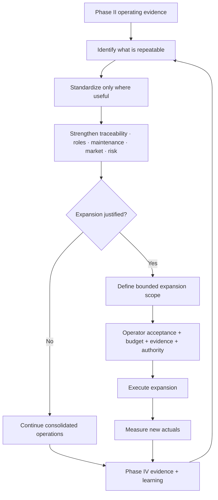
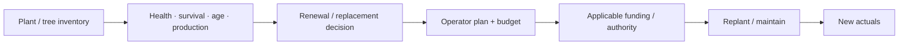
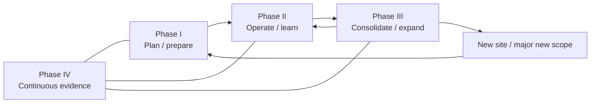

# Phase III turns operating history into durable farm capability.

**Phase III — Consolidation & Expansion** begins when Phase II has produced enough real operating evidence to justify a defined next step.

That next step might be:

- standardizing a harvest or operating procedure;
- improving traceability;
- strengthening a buyer relationship;
- pursuing a relevant certification;
- formalizing maintenance;
- reducing dependence on one founder or operator;
- expanding training capacity;
- improving long-cycle replacement planning;
- upgrading infrastructure;
- expanding production;
- testing a new market;
- preparing a second site or replication workflow.

It does **not** mean every farm must do all of those things.

> **Phase III consolidates what has earned the right to become repeatable and expands only what has enough evidence to justify expansion.**

<CardGroup cols={2}>
  <Card title="Start from Phase II actuals" icon="recycle" href="/kokonut-framework/development-phases/phase-ii">
    Consolidate what operating records actually support rather than what the Phase I forecast originally hoped would happen.
  </Card>

  <Card title="Keep authority scoped" icon="scale-balanced" href="/ecosystem-wiki/the-kokonut-dao/governance-framework">
    Expansion capital, farm operations, methodology, evidence review, legal commitments, and technical execution remain separate authority domains.
  </Card>

  <Card title="Strengthen the evidence system" icon="magnifying-glass-chart" href="/ecosystem-wiki/kokonut-farms/measurement-reporting-and-verification">
    Improve traceability, comparability, review, publication, and longitudinal learning without turning documentation into certification.
  </Card>

  <Card title="Inspect the current reference farm" icon="seedling" href="/ecosystem-wiki/kokonut-farms/adelphi/summary">
    Adelphi remains in Phase II today; Phase III should be read as its next bounded consolidation stage, not current accomplished state.
  </Card>
</CardGroup>

<Warning>
  **Phase III is not a maturity badge.** It does not automatically mean the farm is certified, profitable, investment-ready, institutionally financed, biodiversity-positive, carbon-positive, replication-ready, or resilient to future shocks.
</Warning>

---

## Phase III at a glance

| Question | Phase III answer |
| --- | --- |
| **Main purpose** | Make proven operating practices more durable, transferable, traceable, and less dependent on hidden assumptions or individual people |
| **When it begins** | When a farm-specific Phase III trigger is supported by Phase II evidence and accepted by the relevant operators/reviewers/authorities |
| **Fixed duration?** | **No.** Consolidation can continue as long as the farm operates |
| **Does every farm need certification?** | **No.** Certification is pursued when relevant to regulation, claims, buyers, market access, or farm strategy |
| **Does every farm need to expand?** | **No.** A farm can consolidate without increasing land, production, capital, or geographic footprint |
| **Does every expansion need Moloch?** | **No.** Moloch is relevant only when shared treasury capital or another Moloch-scoped commitment is involved |
| **What should become stronger?** | Procedures, traceability, operator capability, maintenance, market evidence, financial actuals, risk controls, longitudinal evidence |
| **What should not happen?** | Scaling a weak process merely because it has been documented |
| **How does Phase IV relate?** | Phase IV evidence continues throughout Phase III and makes consolidation decisions progressively more informed |

---

## Consolidation comes before expansion

Expansion is only one possible Phase III outcome.

A farm can improve significantly by consolidating what already exists.

```mermaid
flowchart TD
    A["Phase II operating evidence"] --> B["Identify what is repeatable"]
    B --> C["Standardize only where useful"]
    C --> D["Strengthen traceability · roles · maintenance · market · risk"]
    D --> E{"Expansion justified?"}

    E -->|No| F["Continue consolidated operations"]
    F --> G["Phase IV evidence + learning"]
    G --> B

    E -->|Yes| H["Define bounded expansion scope"]
    H --> I["Operator acceptance + budget + evidence + authority"]
    I --> J["Execute expansion"]
    J --> K["Measure new actuals"]
    K --> G
```

> **The farm does not fail Phase III because it chooses not to grow.**

---

# What Phase III should strengthen

A useful Phase III review normally looks across several operating dimensions.

| Dimension | Consolidation question | Evidence |
| --- | --- | --- |
| **Operations** | Can core work be repeated without relying on undocumented knowledge? | SOPs, checklists, actual operating records, quality/acceptance evidence |
| **People** | Can the farm operate without one person carrying every critical function? | Roles, competencies, backup coverage, training, demonstrated capability |
| **Maintenance** | Can physical systems remain functional over time? | Maintenance schedules, downtime, repairs, spare-part/vendor records |
| **Production** | Are actual yields, losses, timing, and quality understood well enough to plan? | Repeated crop/production actuals and variance |
| **Finance** | Are recurring costs, revenue, cash timing, and liabilities increasingly visible? | Expenses, sales, cash flow, maintenance costs, budget variance |
| **Markets** | Are real buyers/channels replacing hypothetical targets? | Orders, deliveries, realized prices, rejections, payment history |
| **Traceability** | Can material products/claims be traced to source activity? | Plot/batch/operator/date/input/harvest/buyer records |
| **Ecology** | Are practices and ecological outcomes separated and tracked over comparable periods? | Baselines, repeated measurements, methods, interpretation limits |
| **Evidence** | Can reviewers understand current state without reconstructing it manually? | Reviewed records, provenance, publication state, evidence pointers |
| **Risk** | Are repeated failure modes known and managed? | Incidents, mitigations, triggers, residual risk, review history |
| **Knowledge** | Are useful lessons reusable beyond the people who discovered them? | Documentation, training material, reusable methods, version history |
| **Authority** | Is expansion routed to the correct decision-maker? | Operator approval, funding authority, legal review, domain review |

---

## Phase III should consolidate only what Phase II actually supports

| Phase II evidence | Reasonable Phase III response | Overreach to avoid |
| --- | --- | --- |
| Repeat harvest timing is becoming predictable | Formalize harvest planning | “Yield is guaranteed” |
| One buyer repeatedly purchases product | Build account management / delivery process | “Market access is secured permanently” |
| A maintenance failure repeatedly causes downtime | Build preventive maintenance schedule | “Infrastructure is resilient” |
| A training method produces demonstrated operator competence | Turn it into a documented training module | “Training attendance proves capability” |
| A crop consistently underperforms forecast | Revise or reduce that crop | Scaling it because it was in the original plan |
| Soil measurements show a repeatable trend | Improve the soil monitoring/management protocol | Claiming causality beyond the method |
| Nursery survival records are strong | Expand propagation cautiously | Claiming biodiversity restoration |
| A certification is strategically useful | Build the relevant compliance process | Treating certification as mandatory Framework maturity |

---

# Phase III workstreams

## 1. Standardize repeatable operations

Phase III can turn successful or necessary routines into clearer procedures.

Examples:

- planting;
- irrigation;
- pruning;
- nutrient/input preparation;
- poultry/animal care where applicable;
- harvest;
- grading;
- packing;
- storage;
- cleaning;
- equipment use;
- safety;
- maintenance;
- field logging;
- buyer delivery;
- expense capture;
- incident escalation.

### Standardization should remain local

A procedure is useful when it:

- reduces ambiguity;
- preserves safety;
- supports quality;
- improves traceability;
- makes training easier;
- reduces preventable errors.

It becomes harmful when it:

- freezes a bad practice;
- ignores season/site differences;
- removes operator judgment;
- assumes every farm should behave like Adelphi.

> **Standardize the process where repetition helps. Preserve adaptation where conditions differ.**

### Useful SOP metadata

- process name;
- farm/site;
- version;
- owner;
- affected role;
- trigger/frequency;
- procedure;
- safety notes;
- required records;
- acceptance criteria;
- last review;
- change history.

---

## 2. Strengthen harvest quality and traceability

Phase II records what happened.

Phase III can make those records more consistent and useful.

Possible traceability fields include:

- farm;
- plot / bed / production zone;
- crop / product;
- variety;
- input/treatment history where relevant;
- harvest date;
- operator;
- batch / lot;
- harvested quantity;
- grade;
- rejection/loss;
- packaging;
- storage;
- buyer/channel;
- sale/delivery date;
- realized price;
- payment state.

### Traceability is not only for certification

It can support:

- quality control;
- buyer complaints;
- loss analysis;
- recall/safety workflows where applicable;
- market learning;
- certification;
- public reporting;
- internal planning.

<Info>
  Better traceability increases inspectability. It does not automatically make a product organic, safe, premium, export-ready, or compliant with a particular standard.
</Info>

---

## 3. Pursue certification only when it serves a real requirement

Certification can be important.

It is not the definition of Phase III.

A farm might pursue certification because:

- a buyer requires it;
- a product claim requires it;
- regulation requires it;
- a grant/partner requires it;
- the expected market value justifies the cost;
- the operator chooses it as part of farm strategy.

### Certification readiness can include

| Area | Examples |
| --- | --- |
| Farm identity | Operator/site/land records |
| Production records | Crop plans, planting, harvest, input history |
| Inputs | Procurement, application, allowed/prohibited input controls |
| Traceability | Plot → harvest → batch → buyer |
| Procedures | Cleaning, handling, storage, contamination controls where relevant |
| Training | Required operator/staff competence |
| Internal review | Gap assessment / corrective actions |
| External review | Application, inspection, decision, renewal process |

### Certification states should remain explicit

Use states such as:

- not pursued;
- evaluating;
- preparing;
- applied;
- inspection/review;
- corrective action;
- certified;
- expired;
- suspended;
- withdrawn;

as appropriate to the actual certification process.

### Adelphi

Current repository documentation describes Adelphi's **organic certification process as in progress through the Dominican Republic Ministry of Agriculture pathway**.

That should be read literally. It does not mean certification has been issued or imply premium pricing, supermarket placement, export eligibility, guaranteed buyers, or improved environmental outcomes.

[Review Adelphi's certification and market-readiness context →](/ecosystem-wiki/kokonut-farms/adelphi/crops-biodiversity-and-infrastructure)

---

## 4. Turn target markets into evidence-backed channels

Phase I has a market hypothesis. Phase II produces buyer/price/channel actuals. Phase III can consolidate the channels that show real evidence.

| Stage | Evidence |
| --- | --- |
| **Target** | Intended buyer/channel |
| **Contacted** | Real outreach / conversation |
| **Qualified** | Requirements, volume, quality, price, timing understood |
| **Trial** | Sample / pilot / first order |
| **Active** | Repeated transaction/delivery |
| **Contracted** | Formal agreement where applicable |
| **Strategic** | Repeated performance + material planning value |
| **Inactive / lost** | Relationship ended or stopped purchasing |

Useful market evidence can include buyer requirements, quotes, orders, invoices, delivery records, rejected shipments, payment terms, realized prices, payment timing, volume, seasonality, complaints, and repeat-purchase behavior.

> **A stronger market channel can increase risk if the farm becomes dependent on one buyer or cannot finance the delivery cycle.**

---

## 5. Reduce key-person and founder dependency

Phase III should make critical knowledge and authority easier to transfer.

For each critical function, identify:

- primary owner;
- backup owner;
- required skill;
- procedure;
- access/credentials where relevant;
- escalation path;
- last demonstrated capability.

| Level | Meaning |
| --- | --- |
| **Documented** | Procedure/training material exists |
| **Delivered** | A person completed the training |
| **Demonstrated** | Person performs the task successfully |
| **Independent** | Person performs without continuous founder supervision |
| **Transferable** | Trained person can teach/mentor others |

<Warning>
  **A workshop count is not evidence that founder dependency decreased.**
</Warning>

---

## 6. Build a maintenance system

Phase III should protect the Material Capital the farm already created.

Useful assets can include irrigation, pumps, tanks/reservoirs, tools, nursery, biofactory, poultry infrastructure, storage, fencing, energy systems, monitoring equipment, buildings, and roads/access.

For each material asset, capture where useful:

- asset ID / description;
- location;
- owner;
- installed/acquired date;
- expected service/inspection cadence;
- last service;
- current condition;
- downtime;
- repair history;
- spare parts;
- vendor/support;
- safety considerations;
- replacement expectation.

> **Material Capital becomes more credible when the farm can maintain what it already has.**

---

## 7. Create crop renewal and long-cycle continuity plans

Perennial and multi-cycle farms need renewal.

This can include replanting, replacement after mortality, pruning/rehabilitation, nursery propagation, rotation, crop succession, disease replacement, long-cycle succession, and infrastructure renewal.

Renewal should use evidence such as:

- survival;
- plant health;
- age;
- productivity;
- mortality;
- disease;
- market relevance;
- climate suitability;
- operating cost;
- replacement lead time.

### Coconut at Adelphi

Coconut is part of Adelphi's long-cycle production model.

Current Kokonut governance documentation also relates `\$vKKN` issuance to Kokonut's coconut-tree-based coordination model.

Those ideas must remain separate:

- a coconut-tree inventory can support farm operations and model context;
- a replanting plan can support agricultural continuity;
- `\$vKKN` remains a DAO governance token;
- holding `\$vKKN` does not create legal title to a tree;
- a tree does not automatically create a token right;
- Phase III does not impose a universal DAO-controlled replanting obligation.

```mermaid
flowchart LR
    A["Plant / tree inventory"] --> B["Health · survival · age · production"]
    B --> C["Renewal / replacement decision"]
    C --> D["Operator plan + budget"]
    D --> E["Applicable funding / authority"]
    E --> F["Replant / maintain"]
    F --> G["New actuals"]
```

> **Agricultural renewal should be governed by farm condition and legitimate authority—not by a simplistic token-to-tree equivalence.**

---

## 8. Consolidate training and knowledge transfer

Phase III can turn useful farm knowledge into reusable Intellectual and Human Capital.

Possible outputs include operating manuals, crop guides, field forms, safety procedures, maintenance guides, buyer/quality protocols, MRV instructions, training curriculum, facilitator notes, lessons learned, and localized material.

Separate:

- material created;
- training delivered;
- attendance;
- assessment;
- demonstrated capability;
- independent execution;
- trainer development;
- reuse by another farm.

Adelphi's community/training gazebo can support workshops, youth eco-education, farmer demonstrations, contributor visits, and local learning activities.

These are valuable activities. Stronger claims about learning, livelihoods, health, community capacity, or cultural preservation require their own evidence.

---

## 9. Improve longitudinal evidence quality

Phase III should make evidence easier to compare across time by improving stable identifiers, completeness, units, methods, timestamps, geospatial references, lifecycle states, source links, reviewer identity, privacy classification, versioning, variance explanation, and evidence freshness.

A farm can collect thousands of records and still have poor evidence if units drift, methods change silently, records lack timestamps, plots are inconsistent, missing data is hidden, derived metrics are confused with measurements, or forecasts are mixed with actuals.

> **Phase III should improve evidence quality, not merely evidence volume.**

---

## 10. Review ecological outcomes without making them prerequisites for every expansion

Ecological evidence may become stronger during Phase III because more time has passed.

That does not mean every farm must demonstrate improvement in every ecological domain before consolidating operations.

| Claim | Evidence |
| --- | --- |
| Soil condition changed | Comparable soil evidence |
| Ground exposure changed | Comparable cover/field evidence |
| Vegetation condition changed | Field + appropriate remote sensing |
| Biodiversity changed | Repeated biodiversity/habitat evidence |
| External input dependency changed | Procurement/application actuals |
| Carbon changed | Fit-for-purpose carbon methodology |
| Water performance changed | Appropriate water-use/quality/runoff method |

EBF can organize ecological-benefit interpretation. CRISP-style risk review can organize material uncertainty. Neither is a certification or mandatory numeric Phase III score.

---

## 11. Decide whether expansion is justified

Expansion can mean different things.

| Expansion type | Example |
| --- | --- |
| **Operational** | More crop beds / greater capacity |
| **Infrastructure** | Storage, irrigation, nursery, processing |
| **Market** | New buyer/channel/geography |
| **Product** | New crop/product/processing line |
| **Team** | Additional operator/worker/trainer capacity |
| **Knowledge** | Replicable manuals/training/data methods |
| **Ecological** | Expanded habitat/propagation/land-restoration work |
| **Geographic** | Additional site/farm |
| **Capital** | Larger funding requirement |
| **Technical** | New data/automation/integration capability |

A strong expansion record includes:

- scope;
- rationale;
- evidence from Phase II/III;
- operator acceptance;
- expected cost;
- funding source;
- revenue/impact assumptions;
- dependencies;
- risks;
- change-control threshold;
- success/acceptance criteria;
- evidence plan;
- reviewer;
- decision authority.

<Warning>
  **“The farm is in Phase III” is not sufficient justification for expansion capital.**
</Warning>

---

# Governance in Phase III

## Moloch is conditional, not universal

Use Moloch when the decision is actually Moloch-scoped, such as shared DAO treasury capital, binding DAO-level partnership commitments, `\$vKKN` or Loot actions, or binding Moloch governance changes.

Do not route routine farm decisions to Moloch merely because the farm is in Phase III.

| Decision | Typical authority / review |
| --- | --- |
| Harvest procedure | Local operator + applicable quality/agronomy review |
| Crop replacement | Local operator / agronomy |
| Certification application | Farm/operator/legal entity + applicable certification process |
| Buyer agreement | Applicable farm/legal entity; Moloch only if DAO commitment is involved |
| Shared treasury-funded expansion | Moloch for capital + operator for execution |
| Evidence interpretation | Qualified domain/evidence reviewer |
| Framework methodology change | Framework/affected reviewers |
| Technical integration | Authorized technical maintainer |
| Land expansion/acquisition | Actual legal owner/entity + applicable legal review; Moloch only for DAO capital/commitment |

> **Treasury authorization does not transfer routine farm authority.**

---

# Adelphi — current relationship to Phase III

Adelphi is **not currently documented as Phase III complete**.

Current Framework documentation places Adelphi at:

- **Phase I — Complete**
- **Phase II — Active**
- **Phase III — Upcoming**
- **Phase IV — Ongoing across phases**

So Phase III content for Adelphi should be a next-step consolidation agenda, not current achieved maturity.

Existing documented Adelphi assets relevant to future Phase III include crop/production infrastructure, two syntropic plots, nursery + biofactory, 110 hens, irrigation/water infrastructure, training/community gazebo, remote-sensing/farm-record capability, a crop/revenue forecast model, an organic-certification process documented as in progress, and the public Hub.

| Area | Phase III question |
| --- | --- |
| Harvest | Can repeatable crop-specific quality/traceability procedures be demonstrated? |
| Market | Which target channels have become real repeated buyer relationships? |
| Finance | Are realized cost/revenue/cash patterns replacing planning assumptions? |
| Certification | What is the current actual status, requirement, corrective action, and next step? |
| Operators | Can critical farm functions run without excessive founder/key-person dependency? |
| Maintenance | Are irrigation, nursery, poultry, biofactory, tools, and facilities maintained systematically? |
| Long-cycle crops | Are survival, health, maturity, production, and renewal plans current? |
| Training | Which activities have produced demonstrable operator/community capability? |
| Ecology | Which outcomes have comparable multi-period evidence? |
| Evidence | Are records sufficiently current, linked, reviewed, and reusable for decisions? |
| Expansion | What specific expansion is justified—and what is not yet justified? |

<Info>
  Adelphi should move into Phase III because a defined consolidation step is supported by evidence—not because Phase III is the next label in the sequence.
</Info>

---

# Replication is a separate claim

A mature single farm is not automatically a replicable system.

Replication requires evidence about what transferred, what changed, which assumptions failed, what local knowledge was required, how much support the new farm needed, whether the schema and methods remained useful, whether economics changed, whether ecological practices remained appropriate, and whether operator/governance boundaries held.

Terra Viva is currently a **Phase I planning-stage replication test**, not Phase III evidence.

> **Which parts of the Kokonut Framework are genuinely portable across farms?**

That question should be answered with multi-farm evidence, not with Adelphi maturity alone.

---

## Phase III reporting should follow the decision

The old page required annual EBF reports, CRISP updates, EAS attestations, and annual impact reporting.

Those can be useful, but they are not universal Phase III requirements.

| Decision | Useful evidence |
| --- | --- |
| Harvest SOP | Repeated harvest/loss/quality records |
| Certification | Standard-specific records |
| New buyer | Delivery/quality/price/capacity evidence |
| Irrigation expansion | Water/production/infrastructure/cost evidence |
| Nursery expansion | Demand, survival, capacity, labor, distribution evidence |
| Training program | Capability and reuse evidence |
| New land/site | Phase I baseline + operator + legal/land + market + budget + risk |
| Carbon pathway | Standard-specific methodology, measurements, uncertainty, external review |
| Biodiversity claim | Repeated biodiversity/habitat evidence |
| DAO funding | Scope, budget, authority, milestone, evidence, risk, closeout |

> **Reporting is strongest when it answers the actual decision rather than satisfying a generic annual-document checklist.**

---

## Phase III maturity review

There is no universal checklist that every farm must pass identically.

| Question | Strong evidence |
| --- | --- |
| **Are operations more repeatable?** | Useful procedures + actual performance |
| **Is quality/traceability stronger?** | Batch/plot/operator/product records |
| **Are operators less dependent on undocumented founder knowledge?** | Demonstrated backup capability |
| **Are assets maintained systematically?** | Maintenance/repair/downtime records |
| **Are financial actuals more complete?** | Costs, sales, cash timing, variance |
| **Are market relationships more real?** | Repeat buyers/contracts/orders/deliveries where relevant |
| **Is certification status accurately documented?** | Standard/process-specific evidence where certification is pursued |
| **Are long-cycle assets managed for continuity?** | Survival/health/renewal evidence |
| **Are claims better bounded?** | Methods, baselines, periods, uncertainty, reviewers |
| **Are risks managed from operating history?** | Incidents + mitigations + residual risk |
| **Is expansion evidence-backed?** | Defined scope + rationale + authority + budget + evidence plan |
| **Is learning reusable?** | Versioned procedures/training/methods + evidence of reuse |

---

## Phase III does not need a universal completion state

Phase III can become an ongoing operating mode.

A farm may consolidate one domain, expand another, pause expansion, revisit Phase II-style experimentation, open a new Phase I for a new site, and continue Phase IV evidence throughout.

The four phases are better understood as **development functions**, not a one-way staircase.

```mermaid
flowchart LR
    P1["Phase I<br/>Plan / prepare"] --> P2["Phase II<br/>Operate / learn"]
    P2 --> P3["Phase III<br/>Consolidate / expand"]
    P3 --> P2
    P3 --> N["New site / major new scope"]
    N --> P1

    P4["Phase IV<br/>Continuous evidence"] --- P1
    P4 --- P2
    P4 --- P3
```

<Note>
  A major new site, land expansion, or substantially different operating model can legitimately start a **new Phase I workstream** even while the original farm remains in Phase III.
</Note>

---

## What Phase III does not guarantee

| Phase III can strengthen | It cannot guarantee |
| --- | --- |
| Repeatable procedures | Perfect execution |
| Traceability | Certification |
| Certification readiness | Certification approval |
| Certification | Premium pricing |
| Buyer relationships | Permanent demand |
| Financial records | Profitability |
| Training systems | Durable capability without assessment |
| Maintenance systems | No breakdowns |
| Long-cycle planning | Survival or yield |
| Ecological evidence | Causality for every observed change |
| EBF interpretation | External ecological certification |
| Risk review | Low risk |
| EAS provenance | Scientific truth |
| Expansion plan | Successful expansion |
| DAO funding | Operational success |
| One mature farm | Multi-farm replication |
| Longer history | Institutional financing |
| Token/tree coordination model | Legal tree ownership or guaranteed economics |

---

## Phase III reviewer checklist

Use only the questions relevant to the proposed consolidation/expansion scope.

- [ ] Is the proposed Phase III scope specific?
- [ ] Which Phase II actuals support it?
- [ ] Are forecasts still visibly separated from actuals?
- [ ] Are local operators accepting the change?
- [ ] Is the proposed procedure actually repeatable?
- [ ] Are quality and traceability requirements defined where relevant?
- [ ] Is certification optional/required for a clearly stated reason?
- [ ] Is certification status current and source-linked?
- [ ] Are real market records replacing target-market assumptions?
- [ ] Are buyer concentration and working-capital risks visible?
- [ ] Are key-person dependencies identified?
- [ ] Are backup capabilities demonstrated?
- [ ] Is maintenance owned and recorded?
- [ ] Are long-cycle crop renewal decisions evidence-led?
- [ ] Are ecological claims separated from regenerative practices?
- [ ] Are public claims bounded by method, period, baseline, and uncertainty?
- [ ] Are EBF / CRISP-style interpretations used as decision support rather than certification?
- [ ] Are EAS/IPFS used only where useful?
- [ ] Does the expansion require new land/legal review?
- [ ] Does the expansion require funding or re-authorization?
- [ ] Is Moloch involved only where Moloch authority is actually required?
- [ ] Are success/acceptance criteria testable?
- [ ] Is change control defined?
- [ ] Does a new site or materially new scope need a new Phase I?
- [ ] Is replication being claimed only when multi-farm evidence exists?

---

## How different readers should use Phase III

<CardGroup cols={2}>
  <Card title="Farm operators" icon="tractor">
    Decide what should become repeatable, what still needs experimentation, what requires maintenance, and what expansion the farm can responsibly absorb.
  </Card>

  <Card title="Capital reviewers" icon="file-signature">
    Fund bounded consolidation or expansion where the operating evidence, authority, budget, milestones, risk, and closeout path are clear.
  </Card>

  <Card title="Agronomy & impact reviewers" icon="microscope">
    Check whether scale, standardization, certification, ecological interpretation, and claims remain appropriate to the evidence.
  </Card>

  <Card title="Guilds & contributors" icon="people-group">
    Turn operational gaps into bounded SOP, training, maintenance, market, finance, data, research, or documentation work.
  </Card>

  <Card title="Partners & buyers" icon="store">
    Evaluate supply reliability, quality, traceability, requirements, pricing, logistics, and documented performance without assuming Phase III itself is a credential.
  </Card>

  <Card title="Developers & agents" icon="database">
    Preserve versions, evidence pointers, actual-vs-forecast state, authority, certification state, maintenance status, risk, and change history in software.
  </Card>
</CardGroup>

---

## Current maturity

| Surface | Status | Interpretation |
| --- | --- | --- |
| **Phase III methodology** | **Active Framework methodology** | Consolidation/expansion function following sufficient operating evidence |
| **Phase III duration** | **Not fixed** | Can continue as long as the farm operates |
| **Certification** | **Conditional / farm-specific** | Relevant when required by claims, regulation, buyers, partners, or farm strategy |
| **Market expansion** | **Evidence-dependent** | Target markets become real only through buyer/channel actuals |
| **SOP / traceability** | **Farm-specific consolidation** | Standardize repeatable processes without eliminating local adaptation |
| **Training / succession** | **Capability-dependent** | Training delivery alone does not prove independent operating capability |
| **Maintenance** | **Core durability function** | Physical assets need condition, service, downtime, repair, and replacement evidence |
| **Ecological interpretation** | **Evidence-dependent** | EBF / risk review support decisions; neither certifies outcomes |
| **EAS / IPFS** | **Optional provenance/storage** | Not universal Phase III requirements |
| **Moloch expansion governance** | **Conditional** | Applies to shared treasury or other Moloch-scoped commitments |
| **Adelphi Phase III** | **Upcoming** | Current docs still place Adelphi in Phase II |
| **Terra Viva** | **Phase I replication test** | Not evidence of successful Phase III replication |
| **Cross-farm replication** | **Developing** | Requires evidence from more than one operating farm |

---

## Continue through the Framework

<CardGroup cols={2}>
  <Card title="Phase II — Production & Regeneration" icon="recycle" href="/kokonut-framework/development-phases/phase-ii">
    Review the operating evidence and actual-vs-forecast learning that should justify any consolidation or expansion step.
  </Card>

  <Card title="Phase IV — Continuous Operations" icon="satellite-dish" href="/kokonut-framework/development-phases/phase-iv">
    See how evidence, learning, review, and longitudinal records continue across every development phase.
  </Card>

  <Card title="Governance Framework" icon="scale-balanced" href="/ecosystem-wiki/the-kokonut-dao/governance-framework">
    Route capital, farm, evidence, methodology, legal, and technical decisions to the correct authority.
  </Card>

  <Card title="Proposal Templates" icon="file-signature" href="/ecosystem-wiki/the-kokonut-dao/proposal-templates">
    Use bounded proposals when shared treasury capital or another formal Kokonut commitment is actually needed.
  </Card>

  <Card title="MRV Methodology" icon="magnifying-glass-chart" href="/ecosystem-wiki/kokonut-farms/measurement-reporting-and-verification">
    Strengthen longitudinal evidence without confusing review, publication, or attestation with external certification.
  </Card>

  <Card title="Adelphi Infrastructure" icon="puzzle" href="/ecosystem-wiki/kokonut-farms/adelphi/crops-biodiversity-and-infrastructure">
    Review the physical systems, certification status, market-readiness work, and evidence boundaries that future Phase III consolidation would build on.
  </Card>
</CardGroup>

> **Phase III is successful when the farm becomes more durable without becoming less honest: repeatable where repetition helps, adaptable where conditions differ, and willing to expand only when its own evidence supports the next step.**
