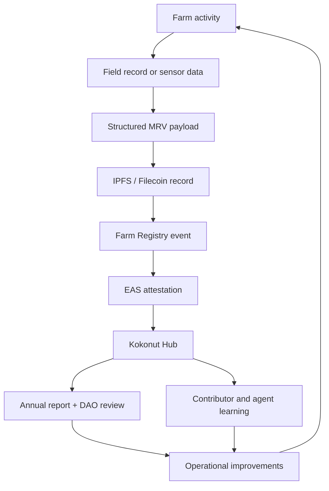

# Phase IV is the evidence layer that never stops.

Phase IV is not a final stage after Phase III. It is the continuous operating state that runs beneath every Kokonut farm from the first baseline measurement onward.

Phases I, II, and III help a farm move from planning to production to consolidation. **Phase IV is what makes that journey legible over time:** harvest records, soil readings, field observations, satellite indices, public reports, EAS attestations, DAO feedback, and annual impact reviews.

  <a href="#what-phase-iv-produces" style={{ display: "inline-flex", alignItems: "center", gap: "6px", background: "#009F4D", color: "#fff", padding: "10px 20px", borderRadius: "8px", fontWeight: "600", fontSize: "14px", textDecoration: "none" }}>
    See Phase IV Outputs →
  </a>

  <a href="/ecosystem-wiki/kokonut-farms/measurement-reporting-and-verification" style={{ display: "inline-flex", alignItems: "center", gap: "6px", border: "1.5px solid #009F4D", color: "#009F4D", padding: "10px 20px", borderRadius: "8px", fontWeight: "600", fontSize: "14px", textDecoration: "none", background: "transparent" }}>
    Read MRV Methodology
  </a>

  Phase IV does not certify claims by itself. It produces the longitudinal evidence that stronger claims, audits, DAO decisions, and partnerships can depend on.

---

## Phase IV at a glance

| Question | Phase IV answer |
| --- | --- |
| What is it? | The continuous operations and evidence layer of the Kokonut Framework. |
| When does it start? | As soon as baseline farm data begins in Phase I. |
| When does it end? | It does not end while the farm remains active in the network. |
| What does it produce? | Farm records, MRV events, harvest data, EAS attestations, reports, and governance feedback. |
| Who uses it? | Farm operators, DAO members, Impact Guild contributors, grant reviewers, researchers, partners, and agent builders. |
| What does it not guarantee? | Yields, prices, carbon credits, certification, institutional financing, or risk-free operations. |

<Note>
  Phase IV is different from the MRV technical stack. MRV explains how farm activity becomes evidence. Phase IV explains why that evidence becomes more valuable as it accumulates over months and years.
</Note>

---

## What Phase IV produces

Phase IV turns farm operations into a continuously improving evidence-based.

<CardGroup cols={2}>
  <Card title="Operational history" icon="timeline">
    A growing record of harvests, planting cycles, soil readings, field observations, infrastructure milestones, and farm events.
  </Card>

  <Card title="Public evidence" icon="stamp">
    Validated records can be published through IPFS/Filecoin, Farm Registry events, EAS attestations, and the public Kokonut Hub.
  </Card>

  <Card title="Annual impact reporting" icon="chart-line">
    EBF-style reports, SDG summaries, and farm updates become more credible when they are backed by year-over-year data.
  </Card>

  <Card title="Risk interpretation" icon="shield-check">
    CRISP-style reviews and operational risk assessments can improve as the farm builds a longer track record.
  </Card>

  <Card title="DAO feedback" icon="people-arrows">
    DAO members and Guilds can use Phase IV evidence to evaluate proposals, milestone releases, method upgrades, and future farm funding.
  </Card>

  <Card title="Replication learning" icon="seedling">
    Each farm creates lessons for the next farm: crop assumptions, loss rates, soil response, MRV gaps, training needs, and governance improvements.
  </Card>
</CardGroup>

---

## The Phase IV loop

This loop matters because regenerative agriculture is not proven in a single event. It becomes more credible through repeated observation, reported outcomes, and visible adaptation.

---

## Phase IV has four operating functions

<Steps>
  <Step title="Continuous data collection" icon="database" iconType="regular">
    Farm activity is recorded across remote sensing, field observations, per-plant records, harvest logs, soil data, and community reports.

    | Evidence source | What it can show | Typical use |
    | --- | --- | --- |
    | Satellite indices | Vegetation trends, canopy change, and farm polygon health | Ecological monitoring and anomaly detection |
    | Soil observations | Moisture, electrical conductivity, temperature, and organic matter indicators | Soil health and irrigation decisions |
    | Per-plant records | Planting location, species, inspection notes, survival status | Agroforestry and tree-backed asset records |
    | Field observations | Pest pressure, water issues, crop condition, labor notes | Operational learning and early warnings |
    | Harvest records | Yield, loss rate, sale price, crop cycle, plot, operator | Forecast comparison and revenue reporting |

    At Adelphi, this includes satellite monitoring, Silvi plant records, field observations, and harvest records routed into Kokonut's public data infrastructure.
  </Step>
  <Step title="Reporting and transparency" icon="chart-line" iconType="regular">
    Phase IV turns operational data into reporting that different audiences can inspect.

    | Cadence | Report type | Primary audience |
    | --- | --- | --- |
    | Real-time / event-based | Kokonut Hub records, MRV events, harvest logs | DAO members, contributors, reviewers |
    | Per harvest | Yield, loss rate, sale price, market notes | Farm operators, Finance Guild, DAO reviewers |
    | Annual | EBF-style impact report and SDG summary | DAO, grant partners, communities, funders |
    | Periodic / as needed | CRISP-style risk review, methodology update notes | Impact Guild, partners, capital allocators |

    The goal is not to create reports after the fact. The goal is to make reporting a byproduct of operations.
  </Step>
  <Step title="Verification and attestation" icon="stamp" iconType="regular">
    Validated farm records can be anchored through the Kokonut MRV pipeline.

    | Event type | Verification value |
    | --- | --- |
    | MRV submission | Proves that a structured evidence payload existed at a specific time. |
    | Harvest record | Connects production claims to crop, quantity, timing, and price data. |
    | Annual report | Anchors impact claims to a published record and reporting period. |
    | Phase milestone | Documents that a farm reached a defined operational threshold. |
    | Risk assessment | Records the farm's risk profile at a specific point in time. |

    Attestation does not make a claim automatically true. It makes the claim traceable, timestamped, and easier to audit.
  </Step>
  <Step title="Governance feedback and improvement" icon="arrows-rotate" iconType="regular">
    Phase IV evidence feeds decisions across the DAO, Guilds, farm operators, and future farm proposals.

    | Feedback user | How Phase IV helps |
    | --- | --- |
    | Farm operators | Improve irrigation, crop planning, pest response, labor planning, and harvest timing. |
    | DAO members | Compare proposals against actual farm performance and evidence of milestones. |
    | Impact Guild | Review reporting quality, MRV gaps, SDG claims, and methodology upgrades. |
    | Finance Guild | Compare forecasts against actual revenue, loss rates, costs, and cash-flow timing. |
    | Technology Guild | Improve data schemas, dashboards, APIs, and agent workflows. |
    | New farms | Learn from validated assumptions before requesting funding. |
  </Step>
</Steps>

---

## Why time is the most valuable variable

A farm with one month of data has observations. A farm with one year of data has a baseline. A farm with three years of data can begin showing patterns. A farm with five years of data can show whether production, soil, biodiversity, market access, and governance systems are actually compounding.

| Time horizon | What becomes possible | What still requires caution |
| --- | --- | --- |
| 0–6 months | Baseline data, early soil observations, and first operating records | Too early for strong trend claims |
| 6–12 months | First annual report, initial harvest comparison, first SDG evidence map | Limited year-over-year comparison |
| 12–36 months | Seasonal patterns, operator track record, forecast-vs-actual analysis | Carbon, RWA, and financing claims still need external standards and review |
| 36\+ months | Stronger institutional due diligence record and better replication benchmarks | Still subject to farm, market, legal, governance, and weather risk |
| 60\+ months | Long-cycle crops and multi-year operational credibility become more visible | Continued maintenance, replanting, and data quality remain essential |

<Warning>
  Phase IV can support institutional conversations, but it does not automatically unlock organic premiums, carbon credits, RWA tokenization, or debt financing. Those outcomes require additional verification, certification, market demand assessment, legal review, partner due diligence, and DAO approval, where relevant.
</Warning>

---

## Phase IV and the capital pathway

Phase IV is the evidence base that can make a farm more legible to partners over time.

| Possible pathway | Phase IV evidence needed | Claim status |
| --- | --- | --- |
| Organic premium pricing | Certification status, quality records, buyer relationships, harvest history | Conditional on certification and market access |
| Carbon credit exploration | Multi-year soil and vegetation data, standard-specific methodology, third-party verification | Not automatic; requires external standards |
| RWA primitives | Accurate plant records, governance approvals, legal review, and attestation history | Conditional and jurisdiction-sensitive |
| Impact investment | Multi-year EBF reports, financial records, risk review, and transparent governance | Depends on partner diligence |
| Institutional debt | Long-term production history, clean financials, market contracts, and legal structure | Long-term possibility, not Phase I/II outcome |

This framing is important: **Phase IV is a prerequisite layer, not a promise of financing.**

---

## How Phase IV connects to the other phases

| Framework phase | Relationship to Phase IV |
| --- | --- |
| Phase I — Foundation | Creates the baseline: farm schema, site diagnosis, soil preparation, crop plan, and MRV setup. |
| Phase II — Production | Produces the first real harvest and operational data that tests assumptions against reality. |
| Phase III — Consolidation | Uses repeated production and reporting to mature markets, training, certification, and resilience. |
| Phase IV — Continuous Operations | Keeps the farm accountable and useful as a long-term reference implementation. |

Phase IV is active throughout all phases, but it becomes more valuable as the farm continues to operate.

---

## What Phase IV does not guarantee

Phase IV reduces uncertainty by creating better records, but it does not remove uncertainty.

| Risk | Why it still matters |
| --- | --- |
| Weather and climate risk | Rainfall, drought, storms, and temperature anomalies can affect performance. |
| Execution risk | Farm outcomes still depend on operators, labor, maintenance, training, and decision quality. |
| Market risk | Prices, buyers, transport, certification, and demand can change. |
| Data-quality risk | Bad inputs, missing records, sensor failure, or inconsistent field logs weaken conclusions. |
| Governance risk | DAO decisions, funding timing, and proposal quality still affect execution. |
| Carbon and impact-claim risk | Strong claims require methodology, measurement, reporting periods, and verification. |
| Legal and regulatory risk | RWA, carbon, lending, and certification pathways depend on jurisdiction and partner review. |

---

## Phase IV reviewer checklist

Before using Phase IV data to support a proposal, report, partnership, or public claim, reviewers should ask:

- Is the farm record complete and tied to the Common Data Schema?
- Are forecasts separated from actual harvest records?
- Are SDG claims tied to measurable farm activity?
- Are carbon and climate claims clearly labeled as estimated, measured, or verified?
- Are EAS attestations linked to full payloads, not just summary claims?
- Is the reporting period clearly stated?
- Are missing data, sensor gaps, or field uncertainties disclosed?
- Has the relevant Guild reviewed the claim or methodology?
- Does the proposed next step require DAO approval?

---

## Next steps

<CardGroup cols={2}>
  <Card title="MRV — the technical stack" icon="magnifying-glass-chart" href="/ecosystem-wiki/kokonut-farms/measurement-reporting-and-verification">
    Learn how farm activity becomes structured evidence, IPFS records, Farm Registry events, EAS attestations, Data Hub entries, and annual reports.
  </Card>

  <Card title="Phase III — consolidation" icon="chart-line-up" href="/kokonut-framework/development-phases/phase-iii">
    See the stage that strengthens certification, markets, training, biodiversity, replanting, and institutional readiness.
  </Card>

  <Card title="Ecological Impact Frameworks" icon="leaf-heart" href="/kokonut-framework/framework-add-ons/ecological-impact-frameworks">
    Understand how EBF and CRISP help interpret impact evidence and risk context.
  </Card>

  <Card title="Kokonut × AI Agents" icon="robot" href="/kokonut-x-ai-agents">
    Explore how agents can help automate data collection, reporting, forecasting, and attestation workflows.
  </Card>

  <Card title="Common Data Schema" icon="table-columns" href="/kokonut-framework/framework-components/common-data-schema">
    Review the baseline farm record that Phase IV evidence builds upon.
  </Card>

  <Card title="Adelphi Farm Summary" icon="seedling" href="/ecosystem-wiki/kokonut-farms/adelphi/summary">
    See Phase IV in context through Kokonut's first live farm reference implementation.
  </Card>
</CardGroup>

  <a href="/ecosystem-wiki/kokonut-farms/measurement-reporting-and-verification" style={{ display: "inline-flex", alignItems: "center", gap: "6px", background: "#009F4D", color: "#fff", padding: "10px 20px", borderRadius: "8px", fontWeight: "600", fontSize: "14px", textDecoration: "none" }}>
    Read MRV Methodology →
  </a>

  <a href="https://hub.kokonut.network/projects/41" style={{ display: "inline-flex", alignItems: "center", gap: "6px", border: "1.5px solid #009F4D", color: "#009F4D", padding: "10px 20px", borderRadius: "8px", fontWeight: "600", fontSize: "14px", textDecoration: "none", background: "transparent" }}>
    Explore Adelphi Data
  </a>

