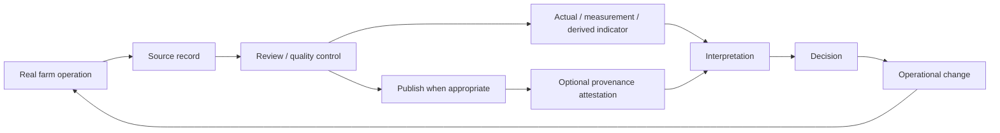
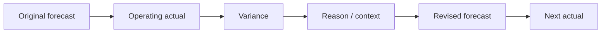
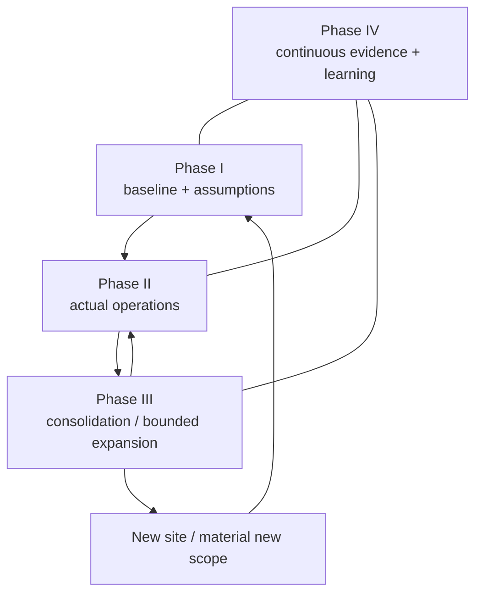

# Phase IV is the continuous evidence and learning function across every phase.

**Phase IV — Continuous Operations** does not wait for Phase III.

It begins when Phase I creates the first usable baseline and continues for as long as the farm, its records, or its claims remain active.

Its purpose is to keep the farm **legible over time**:

- what changed;
- what stayed stable;
- what failed;
- what was repaired;
- what was harvested;
- what was sold;
- what was forecast;
- what became actual;
- what evidence became stale;
- what risks materialized;
- what practices were implemented;
- what outcomes were measured;
- what claims need to be narrowed;
- what decisions should change next.

> **Time does not make evidence stronger by itself. Comparable, well-governed records over time make stronger analysis possible.**

<CardGroup cols={2}>
  <Card title="Follow the MRV evidence lifecycle" icon="magnifying-glass-chart" href="/ecosystem-wiki/kokonut-farms/measurement-reporting-and-verification">
    Use observation, measurement, review, publication, optional attestation, and interpretation without collapsing those states together.
  </Card>

  <Card title="Understand Kokonut Intelligence" icon="database" href="/kokonut-intelligence">
    See the data infrastructure that can store, review, analyze, publish, compare, and automate parts of the evidence workflow.
  </Card>

  <Card title="Review Phase III consolidation" icon="chart-line-up" href="/kokonut-framework/development-phases/phase-iii">
    See how longitudinal evidence supports maintenance, traceability, training, market, certification, and bounded expansion decisions.
  </Card>

  <Card title="Inspect Adelphi's current published state" icon="chart-line" href="https://hub.kokonut.network/projects/41">
    Use the Kokonut Hub for changeable published farm records rather than assuming a static methodology page is current operational truth.
  </Card>
</CardGroup>

<Warning>
  **Phase IV is not a certification layer.** More records, more years, a Published status, an EAS attestation, a dashboard, or an AI-generated synthesis do not automatically prove ecological improvement, profitability, decent work, public-goods delivery, carbon outcomes, resilience, or financing readiness.
</Warning>

---

## Phase IV at a glance

| Question | Phase IV answer |
| --- | --- |
| **What is it?** | The continuous evidence, review, maintenance, learning, and adaptation function of the Framework |
| **When does it start?** | With the first Phase I baseline / governed farm record |
| **When does it end?** | It does not have a universal end while the farm or material claims remain active |
| **Is it a final phase?** | **No.** It runs underneath Phases I, II, and III |
| **Is it the same as MRV?** | **No.** MRV defines how claims become evidence; Phase IV defines the continuous operating use of that evidence |
| **Is it the same as Kokonut Intelligence?** | **No.** Kokonut Intelligence is software/data infrastructure that can implement and automate parts of the workflow |
| **Does every record become public?** | **No.** Publication depends on purpose, privacy, consent, sensitivity, and governance |
| **Does every record need EAS/IPFS?** | **No.** Provenance/storage tools are optional and claim-dependent |
| **Does every farm need an annual impact report?** | **No.** Reporting cadence should match the decision, claim, method, and stakeholder need |
| **Who decides from the evidence?** | The authority appropriate to the decision: local operators, reviewers, funders, Moloch, Guilds, partners, or technical maintainers |
| **What is the core output?** | Better decisions based on increasingly comparable actual records and explicit uncertainty |

---

## Phase IV connects four different things

Phase IV is strongest when these are kept distinct.

| Layer | Question | Example |
| --- | --- | --- |
| **Operations** | What happened in the real farm? | Planting, irrigation, harvest, repair, sale, training, incident |
| **Evidence** | What record supports that event or outcome? | Field note, measurement, invoice, soil sample, harvest record |
| **Interpretation** | What does the evidence justify saying? | “Loss rate decreased during this reporting period” |
| **Decision** | What should change next? | Adjust crop density, repair pump, revise forecast, pursue buyer, narrow claim |

```mermaid
flowchart LR
    A["Real farm operation"] --> B["Source record"]
    B --> C["Review / quality control"]
    C --> D["Actual / measurement / derived indicator"]
    D --> E["Interpretation"]
    E --> F["Decision"]
    F --> G["Operational change"]
    G --> A

    C --> H["Publish when appropriate"]
    H --> I["Optional provenance attestation"]
    I --> E
```

> **Phase IV is useful only if evidence can change decisions.**

---

# The Phase IV operating model

## 1. Capture the right record

Not every farm event deserves the same record.

Useful record families can include:

- farm activity;
- planting / establishment;
- harvest;
- sale / distribution;
- expense / procurement;
- labor / role;
- field note;
- soil sample;
- water measurement;
- vegetation observation;
- biodiversity / survival;
- infrastructure / maintenance;
- incident / risk;
- training / competency;
- milestone / acceptance;
- partner / buyer interaction;
- public-goods delivery;
- certification / compliance status;
- governance / funding decision.

The record should fit the question.

<Info>
  **Collecting more data is not automatically better.** A smaller set of consistent, decision-relevant records can be more useful than a large volume of incomparable observations.
</Info>

---

## 2. Preserve evidence type

Phase IV should keep the Framework's evidence vocabulary visible.

| Evidence type | Meaning | Example |
| --- | --- | --- |
| **Documented state** | A recorded current/historical fact | “The farm has 110 hens in the documented implementation” |
| **Observation** | A recorded field condition | “Standing water observed after rainfall” |
| **Measurement** | A quantity produced through a defined method | Soil moisture reading |
| **Derived indicator** | A value computed from source data | NDVI, loss rate, gross margin |
| **Forecast** | A modeled future value | Expected crop revenue |
| **Actual** | An observed operational/financial result | Realized sale price |
| **Attestation** | A signed provenance statement | EAS record pointing to evidence |
| **Interpretation** | A bounded conclusion based on evidence | “Vegetation condition improved in the measured area during the period” |

Do not let a dashboard or report silently convert one type into another.

> **Forecast ≠ actual. Observation ≠ measurement. Measurement ≠ causality. Attestation ≠ certification. Interpretation ≠ raw evidence.**

---

## 3. Use a governed record lifecycle

Kokonut Intelligence currently distinguishes record lifecycle states such as:

> **draft → submitted → verified / rejected → published**

That lifecycle is useful for workflow control.

But the words must be interpreted carefully.

### Verified

Within Kokonut Intelligence, **Verified** means the record passed the applicable internal review workflow.

It does **not** automatically mean:

- independently audited;
- scientifically validated;
- regulator-approved;
- organically certified;
- carbon-verified;
- legally adjudicated.

### Published

**Published** means the record is available to the intended downstream/public surface.

It does not mean the record is:

- complete forever;
- still current;
- free of uncertainty;
- appropriate for every later claim.

### Rejected

A rejected record can be valuable evidence about:

- missing provenance;
- inconsistent units;
- unsupported claims;
- duplicate data;
- invalid method;
- insufficient review.

Phase IV should preserve rejection/quality history rather than hiding it.

---

## 4. Keep freshness visible

A high-quality record can become stale.

Every material current-state claim should make it possible to answer:

- when was the source event?
- when was the record created?
- when was it reviewed?
- when was it published?
- when was it last updated?
- is a newer record expected?
- does the claim still describe current farm state?

### Example

> “The farm has seven jobs.”

That can be a valid documented reference.

For a current employment claim, Phase IV should still ask:

- seven as of when?
- full-time, part-time, seasonal, or role count?
- are the roles still active?
- what changed after the source period?

> **Publication status and freshness are different properties.**

---

## 5. Compare like with like

Longitudinal analysis requires compatibility.

Before comparing records across time, check:

- same farm / plot / asset boundary;
- same unit;
- same method;
- same instrument or documented instrument change;
- same or comparable timing/season;
- same denominator;
- same definition;
- same lifecycle semantics;
- known missing-data periods;
- known intervention changes.

### Method changes should be explicit

If a method changes:

1. record the old method;
2. record the new method;
3. state the change date;
4. explain whether values remain comparable;
5. avoid creating a fake continuous trend when comparability was broken.

---

## 6. Replace forecasts with actuals — without deleting the forecast

Phase IV should preserve the original assumption and the later result.

That enables learning.

```mermaid
flowchart LR
    A["Original forecast"] --> B["Operating actual"]
    B --> C["Variance"]
    C --> D["Reason / context"]
    D --> E["Revised forecast"]
    E --> F["Next actual"]
```

Examples include:

- planting quantity;
- survival;
- harvest timing;
- yield;
- loss;
- saleable quantity;
- realized price;
- buyer/channel;
- labor;
- input use;
- cost;
- maintenance;
- public-goods transfer/delivery;
- project milestone.

> **A revised forecast should not erase the evidence that the earlier forecast was wrong.**

Forecast error is part of the farm's learning history.

---

## 7. Maintain the farm — not only the dataset

Continuous operations include physical maintenance.

Phase IV should keep current records for assets such as:

- irrigation;
- pumps;
- tanks / reservoirs;
- nursery;
- biofactory;
- poultry infrastructure;
- tools;
- fencing;
- buildings;
- energy systems;
- monitoring devices;
- storage;
- access roads.

Useful maintenance evidence can include:

- condition;
- service date;
- downtime;
- repair;
- replacement;
- spare parts;
- vendor;
- cost;
- safety issue;
- unresolved defect.

<Warning>
  A farm can have excellent data about infrastructure that is no longer functioning. **Evidence quality is not a substitute for maintenance quality.**
</Warning>

---

## 8. Update the risk register from real events

Phase I starts with risks.

Phase II reveals which ones materialize.

Phase III builds stronger controls.

Phase IV keeps the risk model current.

Examples:

- drought;
- storm/flood;
- disease/pest;
- crop mortality;
- water shortage;
- pump failure;
- buyer loss;
- price decline;
- labor shortage;
- key-person dependency;
- safety incident;
- certification correction;
- legal/land change;
- data gap;
- sensor failure;
- privacy issue;
- methodology weakness;
- funding delay.

For each material risk, update:

- evidence;
- likelihood / uncertainty;
- consequence;
- owner;
- mitigation;
- trigger;
- residual risk;
- status;
- review date.

A risk register that never changes after real incidents is not functioning as a learning tool.

---

# Evidence quality matters more than elapsed time

The old Phase IV page used a time ladder:

> one month = observations → one year = baseline → three years = patterns → five years = compounding credibility

That is too deterministic.

A baseline can exist on day one if it was collected properly.

Five years of inconsistent or stale records can still be weak evidence.

### Stronger longitudinal evidence depends on

| Dimension | Question |
| --- | --- |
| **Comparability** | Are periods measuring the same thing in a compatible way? |
| **Completeness** | Are material gaps visible? |
| **Freshness** | Is the current-state claim recent enough? |
| **Method stability** | Were method changes documented? |
| **Provenance** | Can the record be traced to its source? |
| **Review quality** | Was the appropriate reviewer involved? |
| **Boundary** | Is the farm/plot/population/system clear? |
| **Uncertainty** | Are limitations and missing explanations visible? |
| **Actual-vs-forecast status** | Are models separated from observed results? |
| **Decision relevance** | Did the evidence answer a real operational/reporting question? |

<Info>
  **More time can create more opportunities for comparison. It does not guarantee better evidence.**
</Info>

---

## Cadence should follow the record and claim

There is no universal Phase IV calendar.

| Record / question | Example cadence |
| --- | --- |
| Field activity | Per event |
| Harvest / sale / loss | Per event |
| Expense / payment | Per transaction / accounting cycle |
| Poultry / recurring output | Daily/weekly aggregation where useful |
| Maintenance | Scheduled + incident-based |
| Soil / water | Method-dependent |
| Remote sensing | Comparable periodic scenes |
| Biodiversity / survival | Seasonal / methodology-dependent |
| Training capability | Program / role / assessment cycle |
| Certification | External-standard timeline |
| Risk | Incident / trigger / reporting period |
| Partner / funder report | Agreement-specific |
| Full farm synthesis | Periodic when enough comparable reviewed evidence exists |

> **Use annual reporting when annual reporting serves the claim or stakeholder—not because Phase IV requires one report every year.**

---

# Publication, privacy, and provenance

## Not every record should be public

Phase IV should distinguish:

- public evidence;
- partner/funder evidence;
- internal operational evidence;
- restricted personal/commercial/legal evidence.

Publication decisions should consider:

- personal information;
- worker privacy;
- exact locations;
- security;
- buyer/vendor confidentiality;
- legal agreements;
- financial sensitivity;
- conservation sensitivity;
- consent;
- public-interest value.

### Public evidence should be deliberately selected

A public record should answer:

- why is this useful publicly?
- what claim does it support?
- is sensitive information removed?
- is the source/method clear?
- is the reporting period clear?
- is the record current enough?
- is the interpretation bounded?

---

## Kokonut Hub

The **Kokonut Hub** is the public surface for selected published project/farm information.

Use it for:

- current published farm records;
- changeable project state;
- public evidence pointers;
- published operational/impact context.

Do not assume:

> Hub = complete farm database

Some legitimate evidence can remain private, restricted, or unpublished.

---

## EAS on Celo

Kokonut Intelligence can anchor selected evidence/claims through **EAS on Celo**.

An attestation can help preserve:

- signer;
- timestamp;
- schema;
- evidence reference;
- provenance context.

It cannot make weak evidence strong.

It cannot independently prove:

- ecological causality;
- carbon sequestration;
- biodiversity restoration;
- certification;
- profitability;
- legal rights;
- work quality.

> **Attest selectively when durable public provenance adds value.**

---

## IPFS / Filecoin or other durable storage

Content-addressed / durable storage can be useful for:

- reports;
- evidence artifacts;
- datasets;
- media;
- snapshots.

It is not a universal Phase IV requirement.

Integrity and persistence are different from scientific validity.

---

# Phase IV, MRV, Kokonut Intelligence, and the Hub

These layers should not be collapsed.

| Layer | Role |
| --- | --- |
| **Phase IV** | Continuous operational use of evidence, review, learning, maintenance, and adaptation |
| **MRV** | Evidence methodology: how observations/measurements become reviewed claims |
| **Kokonut Intelligence** | Canonical records, lifecycle states, events, analytics, reports, forecasts, scoring, agent/data workflows, attestations |
| **Kokonut Hub** | Public surface for selected published farm/project records |
| **EAS** | Optional public provenance / attestation infrastructure |
| **Framework** | Shared methodology and semantics across farms |

This distinction matters because:

- a software workflow is not the methodology;
- a public page is not the entire evidence base;
- an attestation is not a scientific conclusion;
- an internally verified record is not external certification.

---

# Phase IV feedback should go to the right authority

Phase IV evidence can inform many decisions.

It should not route every decision to the DAO.

| Evidence / decision | Typical user / authority |
| --- | --- |
| Irrigation adjustment | Local farm operator |
| Crop replacement | Local operator + agronomy expertise |
| Harvest timing | Local operator / quality/market context |
| Maintenance priority | Operator / asset owner / budget authority |
| Buyer/channel change | Applicable farm/operator/legal entity |
| Evidence quality issue | Domain / evidence reviewer |
| Framework method problem | Framework + affected reviewers |
| Guild contribution work | Relevant Guild / contribution reviewers |
| Shared DAO treasury request | Moloch |
| Payment execution | Authorized treasury/SAFE process |
| Technical integration | Authorized technical maintainer |
| Legal/certification issue | Applicable legal/certification process |

<Warning>
  **Evidence can inform authority without transferring authority.** A dashboard, reviewer, token holder, agent, or contributor does not become the farm operator merely because they can see the records.
</Warning>

---

# Phase IV and AI / agent workflows

Agents can make continuous evidence more usable.

They can help:

- detect missing records;
- flag stale data;
- compare forecast vs. actual;
- identify anomalies;
- draft reports;
- assemble evidence packets;
- summarize risk changes;
- calculate defined indicators;
- check schema consistency;
- propose follow-up questions;
- prepare transaction or attestation drafts within authorized workflows.

They should not autonomously:

- certify ecological outcomes;
- approve farm funding;
- decide land rights;
- change farm operations without operator authority;
- invent missing data;
- convert an estimate into an actual;
- treat internal `Verified` as scientific truth;
- publish sensitive evidence without applicable permission;
- make unsupported causal claims.

> **Agent confidence is not evidence quality.**

---

# Phase IV across the development phases

| Development function | Phase IV contribution |
| --- | --- |
| **Phase I — Planning & Preparation** | Baseline, provenance, evidence plan, assumptions, risks, initial records |
| **Phase II — Production & Regeneration** | Operating actuals, forecast variance, practice records, outcomes, incidents, adaptation |
| **Phase III — Consolidation & Expansion** | Longitudinal quality, maintenance, traceability, capability, market/certification/expansion evidence |
| **New site / major scope** | Evidence from the existing farm informs a new Phase I without pretending conditions will transfer unchanged |

```mermaid
flowchart TD
    P1["Phase I<br/>baseline + assumptions"] --> P2["Phase II<br/>actual operations"]
    P2 --> P3["Phase III<br/>consolidation / bounded expansion"]
    P3 --> P2
    P3 --> N["New site / material new scope"]
    N --> P1

    P4["Phase IV<br/>continuous evidence + learning"]
    P4 --- P1
    P4 --- P2
    P4 --- P3
```

Phase IV is therefore not a destination.

It is the **memory and feedback function** running across the development lifecycle.

---

# Adelphi — current Phase IV reference

Adelphi is currently the strongest live reference for Phase IV because it already combines:

- a documented Phase I history;
- active Phase II operations;
- ongoing MRV;
- public Kokonut Hub records;
- selected Celo EAS provenance capability through Kokonut Intelligence;
- remote-sensing / field-record capability;
- forecast models that need actual reconciliation;
- soil / vegetation / biodiversity evidence needs;
- infrastructure that requires maintenance;
- market and certification pathways that can change over time.

### The most important Phase IV task at Adelphi

It is not simply:

> collect more data

It is:

> **keep replacing static assumptions with current, comparable, reviewed records while making uncertainty and stale information visible.**

Examples:

| Static/reference statement | Phase IV question |
| --- | --- |
| Seven jobs documented | What is the current role/employment state? |
| 110 hens documented | What is the current flock/output/mortality state? |
| ~100 eggs/day planning estimate | What do recurring actual production records show? |
| 5 lettuce harvests/year model | What do actual crop cycles show? |
| 15% loss assumption | What are actual loss/rejection rates by crop/cycle? |
| $149,110.87 modeled annual gross crop revenue | What revenue has actually been realized by period? |
| 10% public-goods model assumption | What amount was actually allocated/transferred/used under the applicable arrangement? |
| Organic certification in progress | What is the current certification lifecycle status? |
| Native/at-risk species documented | What do current survival/condition/status records show? |

<CardGroup cols={2}>
  <Card title="Open Adelphi Hub records" icon="chart-line" href="https://hub.kokonut.network/projects/41">
    Inspect the current public records rather than using a static Framework page as a live operational database.
  </Card>

  <Card title="Review Adelphi forecast assumptions" icon="calculator" href="/ecosystem-wiki/kokonut-farms/adelphi/crops-and-harvest-forecast">
    See which crop, loss, price, yield, revenue, and public-goods variables Phase IV actuals should progressively replace.
  </Card>
</CardGroup>

---

# Replication learning

A farm's long history can help the next farm.

It still does not prove transferability.

Useful replication evidence includes:

- which fields remained useful;
- which definitions needed adaptation;
- which crop assumptions transferred;
- which failed;
- which practices were locally appropriate;
- what operator capacity was required;
- what infrastructure was reusable;
- what market assumptions changed;
- what data collection was too expensive or unnecessary;
- what governance boundaries held;
- what technical integrations remained compatible.

### Terra Viva

Terra Viva remains a **Phase I planning-stage replication test**.

Phase IV evidence from Adelphi can inform Terra Viva's planning.

It should not be copied as if:

- crops;
- yields;
- prices;
- costs;
- soil response;
- biodiversity response;
- labor;
- buyers;
- public-goods economics;

will be identical.

> **Replication learning transfers questions, structures, and lessons more safely than it transfers conclusions.**

---

# External pathways: evidence enables diligence, not entitlement

Longitudinal evidence can make a farm easier for an external party to assess.

That does not create an automatic capital pathway.

| Possible external pathway | Relevant evidence | Additional requirement |
| --- | --- | --- |
| Organic/certified market | Certification status, traceability, quality, buyer history | Applicable certifier/buyer acceptance |
| Carbon pathway | Standard-specific measurements and methodology | External standard, validation/verification, legal/commercial fit |
| Biodiversity / nature claims | Method-specific ecological evidence | Applicable external methodology/assurance if monetized/certified |
| Grant / impact funding | Delivery, financial, outcome, governance evidence | Funder criteria and diligence |
| Commercial finance | Revenue, cost, cash flow, contracts, assets/liabilities | Lender underwriting/legal structure |
| Insurance | Risk, asset, production, incident history | Insurer underwriting |
| RWA / tokenization exploration | Accurate asset/legal/evidence records | Legal rights, jurisdiction, structure, partner diligence |
| Institutional partnership | Multi-period operations, evidence, governance, risk | Partner-specific diligence |

> **Phase IV can improve diligence readiness. It does not create a right to financing, certification, a credit, a premium, or tokenization.**

---

## Reporting should be decision-specific

A useful Phase IV report should identify:

- decision / audience;
- farm / boundary;
- reporting period;
- sources;
- actuals vs. forecasts;
- methods;
- material changes;
- missing data;
- stale records;
- incidents;
- risks;
- outcomes;
- uncertainty;
- relevant evidence pointers;
- optional attestations;
- next actions.

### Examples

| Report | Useful when |
| --- | --- |
| Crop-cycle review | Operators need to adjust planting/yield/loss assumptions |
| Financial variance report | Budget/revenue/cash assumptions need revision |
| Maintenance review | Asset reliability affects production |
| Buyer/channel review | Market strategy needs evidence |
| Certification packet | External certification process requires records |
| SDG/EBF synthesis | Reviewed evidence supports development/ecological interpretation |
| Risk review | Material risk changed |
| Grant/partner report | Agreement requires a defined reporting period |
| DAO milestone report | Moloch-authorized funding requires evidence/closeout |
| Replication brief | A new farm needs lessons from existing operations |

Not every farm needs all of these.

---

## Common failure modes

| Failure mode | Better practice |
| --- | --- |
| “Five years of data proves impact.” | Check method, comparability, gaps, boundary, uncertainty, and actual result |
| “One year is the baseline.” | Establish baseline before/at intervention according to the claim |
| “Published means current.” | Track freshness separately |
| “Verified means scientifically validated.” | Treat `Verified` as the applicable internal workflow state |
| “EAS verifies the ecological claim.” | EAS supports provenance |
| “The Hub contains all evidence.” | Treat Hub as selected public published records |
| “Annual reporting is mandatory.” | Match cadence to claim, agreement, method, or decision |
| “More data is better evidence.” | Prioritize consistency, relevance, method, provenance, and quality |
| “Satellite indices prove regeneration.” | Treat them as derived vegetation indicators |
| “AI synthesis proves the conclusion.” | Review source evidence and method |
| “DAO members should review every farm decision.” | Route decisions by authority |
| “Long history means financing-ready.” | External parties still apply their own legal, financial, technical, and risk diligence |
| “Adelphi evidence transfers to Terra Viva.” | Transfer methodology/questions, then collect Terra Viva's own baseline/actuals |

---

## Phase IV reviewer checklist

Before using longitudinal farm evidence for a decision or public claim, ask:

- [ ] What decision or claim is this evidence supporting?
- [ ] Is the farm/plot/population/system boundary clear?
- [ ] Is the record an observation, measurement, derived indicator, forecast, actual, attestation, or interpretation?
- [ ] Are forecasts separated from actuals?
- [ ] Is the source/provenance inspectable?
- [ ] Is the record current enough for the claim?
- [ ] Are lifecycle states understood correctly?
- [ ] Is internal `Verified` being mistaken for external certification?
- [ ] Are methods/units comparable across periods?
- [ ] Are method changes documented?
- [ ] Are missing-data periods visible?
- [ ] Are privacy/sensitivity constraints respected?
- [ ] Is publication necessary and authorized?
- [ ] Is EAS/IPFS being used only where useful?
- [ ] Are ecological claims separated from implemented practices?
- [ ] Are causal claims supported by the methodology?
- [ ] Are maintenance and incidents included where they affect the conclusion?
- [ ] Are risk updates current?
- [ ] Is the relevant domain reviewer involved?
- [ ] Is the decision routed to the correct authority?
- [ ] Are agent-generated outputs traceable to source records and reviewed?
- [ ] Is replication being inferred beyond the available multi-farm evidence?
- [ ] Is the next evidence/action explicit?

---

## How different readers should use Phase IV

<CardGroup cols={2}>
  <Card title="Farm operators" icon="tractor">
    Use current actuals, maintenance, incidents, risks, and field evidence to improve real operations—not to satisfy a reporting ritual.
  </Card>

  <Card title="Impact & research reviewers" icon="microscope">
    Check comparability, method, provenance, freshness, uncertainty, claim maturity, and whether interpretation exceeds the evidence.
  </Card>

  <Card title="Capital reviewers" icon="file-signature">
    Use financial, milestone, risk, and operational evidence for the specific capital decision without taking over farm authority.
  </Card>

  <Card title="Guilds & contributors" icon="people-group">
    Turn stale records, evidence gaps, maintenance needs, documentation gaps, or methodological questions into bounded contribution work.
  </Card>

  <Card title="Partners & grant reviewers" icon="handshake">
    Trace claims to reporting periods, sources, actual delivery, limitations, and the applicable external requirement.
  </Card>

  <Card title="Developers & agents" icon="database">
    Preserve lifecycle state, evidence type, provenance, freshness, privacy, method, versions, actual-vs-forecast status, and review boundaries in software.
  </Card>
</CardGroup>

---

## Current maturity

| Surface | Status | Interpretation |
| --- | --- | --- |
| **Phase IV methodology** | **Active Framework methodology** | Continuous evidence, review, maintenance, learning, and adaptation across all phases |
| **MRV relationship** | **Active** | MRV is the evidence methodology underneath Phase IV |
| **Kokonut Intelligence** | **Active and evolving** | Canonical records, analytics, lifecycle, reports, EAS, automation/agent support |
| **Kokonut Hub** | **Live public surface** | Selected published current/project records; not the complete evidence base |
| **EAS on Celo** | **Active for selected attestations** | Provenance infrastructure, not scientific/regulatory certification |
| **IPFS/Filecoin** | **Optional evidence storage** | Not a universal record requirement |
| **Annual reporting** | **Conditional** | Useful where decision/agreement/method requires it; not universal |
| **Agent-assisted monitoring/reporting** | **Active/developing** | Decision support with source/review boundaries |
| **Adelphi Phase IV** | **Ongoing** | Current live reference for longitudinal farm evidence |
| **Terra Viva Phase IV** | **Begins with its Phase I baseline** | Own records required; Adelphi evidence does not substitute |
| **Cross-farm learning** | **Developing** | Stronger as genuinely comparable multi-farm evidence accumulates |
| **External finance/certification pathways** | **Independent / conditional** | Phase IV evidence can support diligence but does not confer eligibility |

---

## Continue through the Framework

<CardGroup cols={2}>
  <Card title="MRV Methodology" icon="magnifying-glass-chart" href="/ecosystem-wiki/kokonut-farms/measurement-reporting-and-verification">
    Follow the evidence lifecycle underneath Phase IV: observe → structure → review → publish → attest when useful → interpret.
  </Card>

  <Card title="Kokonut Intelligence" icon="database" href="/kokonut-intelligence">
    See the canonical data, analytics, reporting, attestation, and agent infrastructure that can implement continuous evidence workflows.
  </Card>

  <Card title="Phase I — Planning & Preparation" icon="chalkboard-user" href="/kokonut-framework/development-phases/phase-i">
    See where Phase IV begins: the first baseline, assumptions, evidence plan, and risk record.
  </Card>

  <Card title="Phase II — Production & Regeneration" icon="recycle" href="/kokonut-framework/development-phases/phase-ii">
    See how operational actuals replace forecasts and feed continuous learning.
  </Card>

  <Card title="Phase III — Consolidation & Expansion" icon="chart-line-up" href="/kokonut-framework/development-phases/phase-iii">
    Use longitudinal evidence to consolidate durable processes and justify only bounded expansion.
  </Card>

  <Card title="Adelphi Farm Summary" icon="seedling" href="/ecosystem-wiki/kokonut-farms/adelphi/summary">
    Review the first live reference implementation and use the Hub for changeable published state.
  </Card>
</CardGroup>

> **Phase IV succeeds when the farm remembers accurately enough to learn: current records stay distinguishable from stale ones, actuals stay distinguishable from forecasts, evidence stays distinguishable from interpretation, and every important decision can be traced back to what the farm actually observed.**
