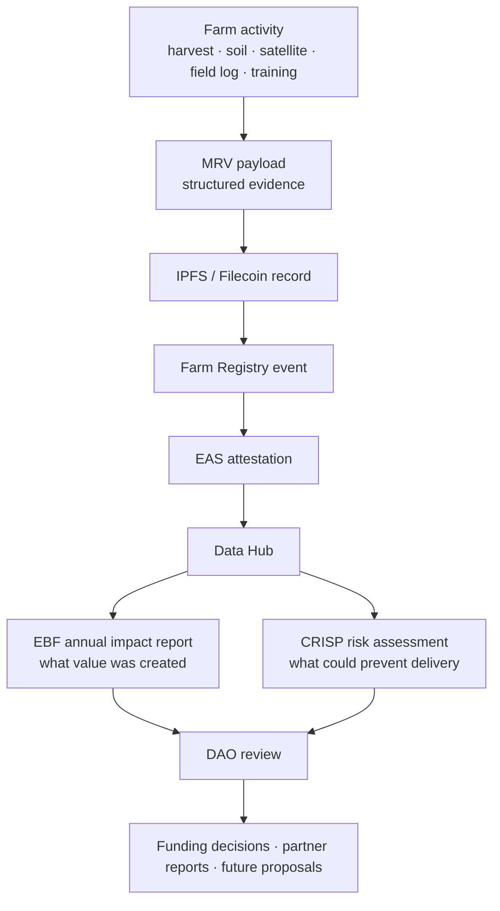

# Ecological impact needs both evidence and risk context.

Kokonut uses **EBF** and **CRISP** to help DAO members, farm operators, Impact Guild contributors, grant reviewers, and institutional partners interpret the evidence produced by the MRV workflow.

These frameworks do two different jobs:

- **EBF** explains the ecological, economic, social, and sustainability value a farm produces.
- **CRISP** explains which risks could prevent the projected carbon or ecological outcomes from being achieved.

Together, they help Kokonut move from broad regenerative claims to a clearer impact profile: **what happened, what evidence supports it, what remains uncertain, and what should be reviewed next.**

<div style={{ display: "flex", gap: "12px", justifyContent: "center", flexWrap: "wrap", margin: "1.5rem 0 0.75rem" }}>
  <a href="#ebf-and-crisp-at-a-glance" style={{ display: "inline-flex", alignItems: "center", gap: "6px", background: "#009F4D", color: "#fff", padding: "10px 20px", borderRadius: "8px", fontWeight: "600", fontSize: "14px", textDecoration: "none" }}>
    Compare EBF and CRISP →
  </a>

  <a href="/ecosystem-wiki/kokonut-farms/measurement-reporting-and-verification" style={{ display: "inline-flex", alignItems: "center", gap: "6px", border: "1.5px solid #009F4D", color: "#009F4D", padding: "10px 20px", borderRadius: "8px", fontWeight: "600", fontSize: "14px", textDecoration: "none", background: "transparent" }}>
    Read MRV Methodology
  </a>
</div>

<p style={{ textAlign: "center", fontSize: "13px", color: "#6b7280", marginTop: "0.25rem" }}>
  Use this page when preparing annual impact reports, reviewing farm proposals, assessing carbon-risk claims, or explaining Kokonut impact to partners.
</p>

<Warning>
  EBF and CRISP help structure impact and risk analysis. They do not automatically certify a farm, guarantee carbon-credit issuance, guarantee financial returns, or replace MRV evidence, legal review, agronomic review, or DAO governance.
</Warning>

---

## EBF and CRISP at a glance

| Framework | Full name | Core question | Kokonut use |
| --- | --- | --- | --- |
| **EBF** | Ecological Benefits Framework | What ecological and community benefits did the farm create? | Annual impact reporting across ecological, economic, social, and sustainability dimensions |
| **CRISP** | Carbon Risk Identification and Scoring Principles | What could prevent projected carbon or ecological benefits from being delivered? | Annual risk review for carbon-delivery, climate, policy, financial, and operator risk |
| **MRV** | Measurement, Reporting, and Verification | What evidence supports the claim? | Continuous data pipeline that produces records for EBF reports and CRISP scoring |

<Note>
  Think of MRV as the evidence layer, EBF as the impact interpretation layer, and CRISP as the risk interpretation layer.
</Note>

---

## Where these frameworks fit in Kokonut



Kokonut does not use EBF or CRISP as replacements for farm data. It uses them to interpret farm data that has already been collected, structured, published, and anchored through the MRV pipeline.

| Stage | Output | Primary owner | Where it appears |
| --- | --- | --- | --- |
| Continuous farm activity | Field logs, harvest records, soil readings, satellite indices, training records | Farm team, Impact Guild, agents | Kokonut Hub, Farm Registry, MRV records |
| Continuous MRV | Structured evidence payloads and attestations | Impact Guild, Technology Guild | IPFS/Filecoin, Farm Registry, EAS, Data Hub |
| Annual EBF report | Impact profile across ecological, economic, social, and sustainability dimensions | Impact Guild | Data Hub, annual report, EAS summary attestation |
| Annual CRISP review | Risk scoring and mitigation notes | Impact Guild, Technology Guild, DAO reviewers | Data Hub, EBF report appendix, proposal review context |
| DAO learning | Updated assumptions for future farms and proposals | DAO members, Guilds | Governance forum, proposal templates, Framework updates |

---

## EBF — Ecological Benefits Framework

### What EBF does

EBF gives Kokonut a shared language for describing value that carbon-only accounting often misses.

A regenerative farm may improve soil health, protect biodiversity, train local workers, expand community food access, generate revenue, preserve cultural knowledge, and distribute public goods. EBF helps organize those benefits into a reportable structure so they can be discussed, compared, funded, and improved.

### What EBF does not do

EBF is not a sensor, a database, a farm registry, a carbon credit standard, or an automatic certification.

It is an interpretation framework. It requires evidence from MRV, financial records, field observations, community logs, and DAO reporting before any impact claim can be considered credible.

### EBF reporting dimensions

| EBF dimension | What it asks | Example Kokonut evidence | Related capital forms |
| --- | --- | --- | --- |
| **Environmental impact** | Is the land improving? | Vegetation indices, soil readings, biodiversity records, nursery species counts, land-use records | Natural Capital |
| **Economic impact** | Is the farm creating durable economic value? | Harvest records, revenue actuals, public goods allocation, jobs created, infrastructure deployed | Financial \+ Material Capital |
| **Social impact** | Is the community gaining capacity and benefit? | Training logs, employment records, community events, participation records, leadership roles | Social \+ Human Capital |
| **Sustainability** | Can the system keep improving over time? | Multi-year MRV trend, risk controls, organic certification status, governance records, SDG evidence | All 8 Forms of Capital |

### How Kokonut produces an EBF report

An EBF report should be assembled from evidence, not written as a promotional summary.

| Evidence source | What it contributes |
| --- | --- |
| Farm Registry records | Farm identity, location, land size, infrastructure, production zones, operators |
| Satellite and remote sensing | Vegetation-health trends, land-cover signals, ecological-change indicators |
| Soil and field observations | Soil moisture, electrical conductivity, temperature, crop condition, operator notes |
| Harvest records | Production actuals, crop cycles, losses, revenue assumptions, and forecast comparison |
| Community records | Employment, training, participation, public goods activities, local engagement |
| DAO records | Funding decisions, proposal commitments, governance actions, and reporting obligations |
| EAS attestations | Public evidence anchors for important measurement, reporting, and governance events |

<Info>
  Strong EBF reporting separates actuals from forecasts. A projected benefit can guide planning, but it should not be described as delivered impact until it is supported by evidence.
</Info>

---

## CRISP — Carbon Risk Identification and Scoring Principles

### What CRISP does

CRISP helps Kokonut evaluate the risk associated with carbon-delivery and ecological-delivery claims.

This matters because a farm may have a promising regeneration thesis but still face weather risk, methodological risk, operator risk, financial risk, regulatory risk, and data quality risk.

CRISP makes those risks visible before claims are overused in proposals, partner materials, or public impact reports.

### What CRISP does not do

CRISP is not a pass/fail certification, not a guarantee of carbon delivery, and not a replacement for scientific carbon methodology.

It is a risk-scoring and due diligence framework. It helps reviewers ask better questions about whether projected benefits are likely to be delivered and verified.

### Five CRISP risk factors

| Risk factor | What it reviews | Kokonut evidence to inspect |
| --- | --- | --- |
| **Carbon yield risk** | Whether projected sequestration or carbon benefit assumptions are plausible | Baseline methodology, vegetation trends, soil data, biochar records, species mix, reporting period |
| **Climate catastrophe risk** | Whether drought, flood, fire, storms, or erosion could damage the system | Local climate data, water infrastructure, ground cover, erosion controls, disaster history |
| **Policy and legal risk** | Whether rules, land tenure, certification, or jurisdictional issues could disrupt claims | Land records, legal review, certification status, DAO proposal terms, compliance notes |
| **Financial risk** | Whether the farm can survive cost overruns, price changes, delays, or revenue shortfalls | Budget, reserves, crop diversification, revenue actuals, buyer relationships, treasury records |
| **Project developer risk** | Whether operators and supporting Guilds can execute the plan | Operator track record, field updates, milestone completion, support structure, reporting discipline |

### When Kokonut applies CRISP

CRISP should be applied repeatedly, not once.

| Moment | Why CRISP matters |
| --- | --- |
| Proposal review | Helps DAO members see whether projected benefits are realistic enough to fund |
| Phase I baseline | Establishes early risk assumptions before operations scale |
| Annual reporting | Updates risk scores using real MRV data and farm performance |
| Major expansion | Reviews whether new land, crops, infrastructure, or markets change delivery risk |
| Partner reporting | Gives grant reviewers and institutional partners a structured risk context |

---

## How EBF and CRISP work together

EBF and CRISP answer different sides of the same trust question.

```text
EBF asks:   What value did the farm create?
CRISP asks: What risks affect the farm's ability to keep delivering that value?
MRV asks:   What evidence supports the answer?
```

A strong Kokonut impact profile includes all three:

| Layer | Without it | With it |
| --- | --- | --- |
| MRV | Claims remain self-reported | Claims are tied to inspectable records |
| EBF | Value is reduced to revenue or carbon | Multiple forms of ecological and community value are visible |
| CRISP | Risk is ignored or hidden | Delivery uncertainty is named, scored, and mitigated |

---

## How this applies to Adelphi

At Adelphi, the EBF and CRISP workflow should help reviewers connect farm activity to evidence and risk.

| Adelphi activity | EBF relevance | CRISP relevance | Evidence to inspect |
| --- | --- | --- | --- |
| Syntropic plots | Environmental impact, sustainability | Carbon yield, climate risk | Satellite indices, field observations, crop logs |
| Nursery and at-risk species | Environmental impact, social impact | Project developer risk | Species inventory, distribution records, field updates |
| Biofactory and biochar | Environmental impact, sustainability | Carbon yield, methodology risk | Input logs, soil data, biochar production records |
| Poultry loop | Economic impact, sustainability | Financial and operator risk | Egg records, manure processing logs, feed records |
| Training gazebo | Social impact, human capital | Project developer risk | Workshop records, attendance logs, community reports |
| Public goods allocation | Economic impact, social impact | Financial risk | Revenue actuals, allocation reports, DAO records |

<Warning>
  Adelphi can serve as a reference implementation, but each new farm still needs its own baseline, local risk review, MRV setup, operator assessment, and DAO-approved proposal.
</Warning>

---

## Reviewer checklist

Use this checklist before treating an EBF or CRISP output as decision-ready.

- Has the farm completed a baseline record through the Common Data Schema?
- Are claims separated into actuals, forecasts, estimates, and assumptions?
- Is each impact claim tied to a measurable source?
- Are carbon and climate claims backed by methodology, reporting period, and evidence?
- Are risks scored, explained, and paired with mitigation plans?
- Are uncertainty and data gaps visible to DAO members?
- Is the output published where reviewers can inspect it?
- Are important records anchored through EAS or another verifiable public evidence layer?

---

## What this page does not guarantee

These frameworks improve reporting quality, but they do not remove execution risk.

| Risk | Why it still matters |
| --- | --- |
| Agricultural risk | Weather, pests, soil conditions, irrigation failures, and labor constraints can affect outcomes |
| Market risk | Prices, buyers, certification, and logistics can change revenue assumptions |
| Methodology risk | Carbon and ecological claims require defensible measurement methods |
| Data-quality risk | Missing or inconsistent records weaken reporting credibility |
| Governance risk | DAO decisions, proposal quality, and contributor coordination affect implementation |
| Legal and policy risk | Land, certification, environmental, or carbon-credit rules can change |

---

## Next steps

<CardGroup cols={2}>
  <Card title="MRV — Evidence Layer" icon="magnifying-glass-chart" href="/ecosystem-wiki/kokonut-farms/measurement-reporting-and-verification">
    See how farm activity becomes structured payloads, IPFS records, EAS attestations, Data Hub entries, and annual impact reports.
  </Card>

  <Card title="8 Forms of Capital" icon="water" href="/kokonut-framework/framework-components/framework-features/8-forms-of-capital">
    Understand the value categories Kokonut uses before translating farm activity into EBF-style reports.
  </Card>

  <Card title="Pillars of Value" icon="square-poll-vertical" href="/kokonut-framework/framework-components/pillars-of-value">
    Use the six evaluation questions that help DAO members decide whether a farm is worth funding.
  </Card>

  <Card title="Common Data Schema" icon="database" href="/kokonut-framework/framework-components/common-data-schema">
    Start with the farm record that makes proposals, MRV, EBF reports, and CRISP scoring comparable.
  </Card>

  <Card title="Adelphi Farm Summary" icon="seedling" href="/ecosystem-wiki/kokonut-farms/adelphi/summary">
    See the live reference farm where Kokonut applies the Framework, MRV, SDG reporting, and farm-level evidence.
  </Card>

  <Card title="Proposal Templates" icon="file-lines" href="/ecosystem-wiki/the-kokonut-dao/proposal-templates">
    Turn impact and risk assumptions into a DAO-reviewable proposal with evidence, budget, milestones, and next steps.
  </Card>
</CardGroup>

<div style={{ display: "flex", gap: "12px", justifyContent: "center", flexWrap: "wrap", margin: "2rem 0 0.75rem" }}>
  <a href="/ecosystem-wiki/kokonut-farms/measurement-reporting-and-verification" style={{ display: "inline-flex", alignItems: "center", gap: "6px", background: "#009F4D", color: "#fff", padding: "10px 20px", borderRadius: "8px", fontWeight: "600", fontSize: "14px", textDecoration: "none" }}>
    Read MRV Methodology →
  </a>

  <a href="https://hub.kokonut.network/projects/41" style={{ display: "inline-flex", alignItems: "center", gap: "6px", border: "1.5px solid #009F4D", color: "#009F4D", padding: "10px 20px", borderRadius: "8px", fontWeight: "600", fontSize: "14px", textDecoration: "none", background: "transparent" }}>
    Explore Adelphi Data
  </a>
</div>